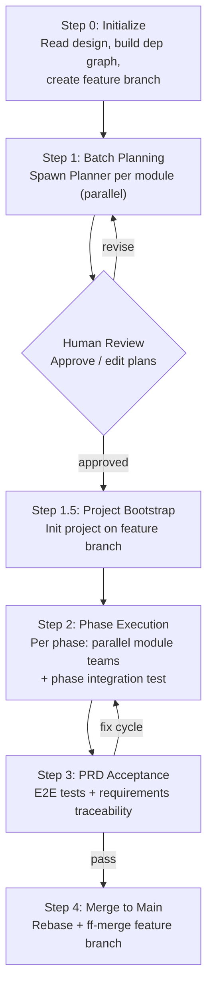
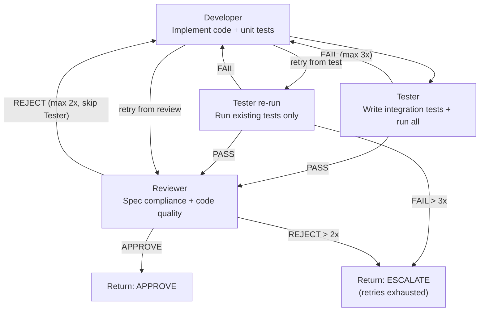

# Autoforge — Multi-Role Automated Development

Orchestrate parallel agent teams to turn a system design into tested, PRD-validated code. Each module gets its own team (Planner, Developer, Tester, Reviewer) working in isolated git worktrees. Fully automated with retry loops — human intervenes only when retries are exhausted or at explicit approval gates.

## Input Modes

```
/autoforge docs/raw/design/2026-04-09-agent-team/              # full flow (plan → execute → accept)
/autoforge --plan-only docs/raw/design/2026-04-09-agent-team/   # generate plans only, stop for human review
/autoforge --execute docs/plans/2026-04-09-agent-team-a3f1/     # execute existing plans (reads design/PRD paths from plan README)
/autoforge --status docs/plans/2026-04-09-agent-team-a3f1/      # show progress
```

## Process Overview



## Step 0 — Initialization

1. **Read design input** — read design README.md (module index, dependency graph, Feature-Module mapping, interaction protocols, test strategy) + all module specs (`modules/*.md`) + API contracts (`api/*.md` if present)
2. **Locate PRD** — follow `Design Input > Source` to find the PRD directory; read PRD README.md for feature index, acceptance criteria references, journey E2E scenarios
3. **Build dependency graph** — from Module Index `Deps` column, construct a DAG. Topologically sort into phases: Phase 1 = modules with no dependencies, Phase 2 = modules whose deps are all in Phase 1, etc.
4. **Detect project state** — check if project has existing source code (package manifests, src directories). If so, note this — Planners must account for existing code structure
5. **Determine output paths**:
   - Plan output: `docs/plans/{design-dir-name}-{hash4}/` where `{design-dir-name}` comes from the design directory name (e.g. `2026-04-09-agent-team`) and `{hash4}` = `$(git rev-parse --short=4 HEAD)`
   - Feature branch: `autoforge/{design-dir-name}-{hash4}`
6. **Create feature branch** — `git checkout -b autoforge/{design-dir-name}-{hash4}` from current HEAD
7. **Present plan to user** — show: module count, phase breakdown with dependency rationale, branch names, output paths. User confirms before proceeding.

**Step 0 → Step 1 gate:** User confirms phase breakdown and branch naming.

## Step 1 — Batch Planning

Spawn one **Planner** agent per module, all in parallel. Planners run on the feature branch — they only produce plan documents, no code. **Planners write files but do NOT commit** — the Orchestrator collects all outputs and does a single commit after all Planners complete.

### Planner Role

```
Input:
  - Module design spec (modules/M-xxx-slug.md)
  - Design README.md (for cross-module context: interaction protocols, test strategy, tech stack)
  - PRD feature specs (features referenced in module's Source Features section)

Output:
  - docs/plans/{plan-dir}/plans/plan-M-{id}-{slug}.md (using module-plan-template.md)

Responsibilities:
  - Convert module design into atomic implementation steps (2-5 minutes each)
  - Step order: interface skeleton → data model → internal logic → unit tests → integration points
  - Each step includes: target files, concrete code, expected test results
  - Mark integration points with other modules (which interfaces this module calls or exposes)
```

### After All Planners Complete

1. **Generate plan README** — write `docs/plans/{plan-dir}/README.md` using `plan-readme-template.md`: dependency graph (mermaid), phase breakdown, module list with status
2. **Commit plans** — single commit of all plan files on the feature branch: `docs(autoforge): add implementation plans for {project}`
3. **Present to human** — show plan summary per module (step count, key decisions, integration points). If `--plan-only` mode, stop here.
4. **Human review gate** — user approves, requests edits, or rejects. If edits requested, modify plans and re-commit.

**Step 1 → Step 1.5 gate:** Human approves all plans.

## Step 1.5 — Project Bootstrap

Before any module worktrees are created, initialize the project on the feature branch so all worktrees inherit a working baseline.

1. **Read tech stack** — from design README.md (Tech Stack, Test Strategy sections)
2. **Spawn Bootstrap agent** on the feature branch:
   ```
   Agent({
     description: "Project bootstrap",
     prompt: "Initialize project based on tech stack: {tech stack details}.
       Set up: directory structure, dependency installation, build config, test framework, linter.
       Verify: project compiles, test command runs (0 tests), lint passes.
       Commit with message: 'chore(autoforge): initialize project'",
     mode: "auto"
   })
   ```
3. **Skip if project already initialized** — if Step 0 detected existing source code, skip this step (or ask user whether to update project config).

## Step 2 — Phase Execution

Execute phases sequentially. Within each phase, execute modules in parallel.

### Per-Module Flow

For each module, spawn a **Module Agent** (second-level orchestrator) in an isolated git worktree. The Module Agent manages the Developer → Tester → Reviewer cycle internally.

```
Worktree branch: autoforge/{design-dir-name}-{hash4}/p{n}/M-{id}-{slug}
Forked from: autoforge/{design-dir-name}-{hash4} (feature branch)
```

Spawn each Module Agent using the Agent tool with `isolation: "worktree"`:

```
Agent({
  description: "Module Agent for M-{id}",
  isolation: "worktree",
  mode: "auto",
  prompt: "You are a Module Agent implementing M-{id}: {module-name}.
    [Paste full contents of module-agent-prompt.md with parameters filled in]

    Parameters:
    - module_design_path: {path}
    - module_plan_path: {path}
    - design_readme_path: {path}
    - report_dir: docs/plans/{plan-dir}/reports/
    - feature_branch: autoforge/{design-dir-name}-{hash4}
    - worktree_branch: autoforge/{design-dir-name}-{hash4}/p{n}/M-{id}-{slug}
    - retry_config: { dev_test_max: 3, dev_review_max: 2, combined_max: 5 }"
})
```

Module Agents within the same phase are spawned in parallel. See `module-agent-prompt.md` for the complete instructions.

### Module Agent Internal Flow



**Retry limits (per module):**

| Path | Max Retries | Total Combined Max |
|------|-------------|-------------------|
| Developer → Tester loop | 3 | 5 (across both loops) |
| Developer → Reviewer loop | 2 | |

When combined retries exceed 5, Module Agent returns `ESCALATE` with full context (failure history, latest code state, unresolved issues).

### Developer Role

```
Input:
  - Module plan file (plan-M-xxx.md)
  - Module design spec (M-xxx.md)
  - Worktree path (isolated workspace)
  - [On retry from Tester]: failure-details (which tests failed, error messages, test file paths)
  - [On retry from Reviewer]: review-comments (required fixes with severity)

Output:
  - Implemented code + unit tests in worktree
  - Commit on worktree branch with message: "feat(M-{id}): implement {description}"
  - developer-notes.md in report directory (implementation notes, decisions made, issues encountered)

Responsibilities:
  - Follow plan steps sequentially
  - Write unit tests covering module internal logic
  - Ensure all unit tests pass before handoff
  - On Tester retry: read failure details, fix source code (NOT test files), commit with "fix(M-{id}): {description}"
  - On Reviewer retry: address required review comments only, commit with "fix(M-{id}): address review feedback"
```

### Tester Role

```
Input:
  - Module design spec (M-xxx.md) — for acceptance criteria and edge cases
  - Worktree path (to read implemented code)
  - Changed files list
  - developer-notes.md
  - is_rerun (boolean) — true if this is a retry after Developer fix

Output:
  - [First run only] Integration test code committed: "test(M-{id}): add integration tests"
  - test-report.md in report directory
  - [On failure] failure-details.md in report directory

Responsibilities:
  First run (is_rerun = false):
    - Read module design spec's acceptance criteria and edge cases
    - Write integration tests (test module's public interface from external perspective)
    - Run ALL tests (unit + integration)

  Re-run (is_rerun = true):
    - Do NOT write new test files — only run existing tests
    - Run ALL tests (unit + integration)

  Both cases:
    - If all pass: return PASS with test-report.md
    - If any fail: return FAIL with failure-details.md
```

### Reviewer Role

```
Input:
  - Module design spec (M-xxx.md)
  - Worktree path (to read code)
  - test-report.md

Output:
  - review-result: APPROVE or REJECT
  - review-comments.md in report directory (if REJECT): list of issues with severity (required/suggested)

Review Dimensions:
  - Spec compliance: does code implement all interfaces and behaviors defined in design?
  - Code quality: naming, structure, error handling, no obvious bugs
  - Test sufficiency: do tests cover design's acceptance criteria and edge cases?
  - No scope creep: code doesn't add unrequested functionality
```

### After All Modules in Phase Complete

1. **Collect results** — for each module: APPROVE or ESCALATE
2. **Handle escalations** — if any module returned ESCALATE:
   - Pause execution
   - Present failure context to human: which module, what failed, retry history
   - Human decides: fix manually, skip module, or abort
   - If human fixes: update module status and continue
3. **Merge module branches** — for each approved module, sequentially:
   ```
   git checkout autoforge/{design-dir-name}-{hash4}
   git merge --ff-only autoforge/{design-dir-name}-{hash4}/p{n}/M-{id}-{slug}
   ```
   If ff-merge fails (concurrent changes), rebase first:
   ```
   git checkout autoforge/{design-dir-name}-{hash4}/p{n}/M-{id}-{slug}
   git rebase autoforge/{design-dir-name}-{hash4}
   git checkout autoforge/{design-dir-name}-{hash4}
   git merge --ff-only autoforge/{design-dir-name}-{hash4}/p{n}/M-{id}-{slug}
   ```
4. **Cleanup module branches** — delete merged module branches
5. **Phase integration test** — spawn **Integration Tester** agent on the feature branch:

### Integration Tester Role (Phase-level)

```
Input:
  - Feature branch (all modules from this phase + previous phases merged)
  - Design README.md — Module Interaction Protocols for modules in this phase
  - Module design specs for all modules in this phase (for interface contracts)
  - Previous phases' integration test files (to re-run for regression)

Output:
  - Integration test code committed: "test(autoforge/p{n}): add phase-{n} integration tests"
  - integration-report-phase-{n}.md in report directory

Responsibilities:
  - Write cross-module contract tests based on Module Interaction Protocols
  - Run ALL existing tests (unit + integration from all merged modules + previous phases)
  - If all pass: return PASS
  - If fail: return FAIL with details
```

**Integration test fix cycle (max 2):** If integration tests fail, spawn a **Developer** agent on the feature branch with the failure details and relevant module design specs. The Developer fixes the issue and commits: `fix(autoforge/p{n}): {description}`. Re-run integration tests. If still failing after 2 fix cycles, pause and notify human.

6. **Update status** — update plan README.md status table, commit: `docs(autoforge): update status after phase-{n}`
7. **Update design doc** — update Module Index `Impl` column for completed modules (`—` → `Done`), update design-level Status if needed. Commit: `docs(design): update impl status after phase-{n}`
8. **Proceed to next phase**

## Step 3 — PRD Acceptance Validation

After all phases complete, validate against the original PRD.

### Acceptance Tester Role

```
Input:
  - Feature branch (all modules merged, all phase integration tests passing)
  - PRD features/*.md (all feature specs — acceptance criteria, edge cases, test data requirements)
  - PRD journeys/*.md (E2E test scenarios)
  - Design Feature-Module mapping (to trace features → modules → code)

Output:
  - E2E acceptance test code committed: "test(autoforge): add E2E acceptance tests"
  - acceptance-report.md in report directory (using acceptance-report-template.md)

Responsibilities:
  Layer 1 — Automated acceptance tests:
    - Read each feature's Acceptance Criteria and Edge Cases
    - Read each journey's E2E Test Scenarios
    - Write automated tests for each criterion/scenario
    - Run all tests (unit + integration + E2E)

  Layer 2 — Requirements traceability:
    - For each feature, produce a status per acceptance criterion: PASS / FAIL / NOT_COVERED
    - For each journey E2E scenario: PASS / FAIL / NOT_COVERED
    - Calculate coverage: {passed}/{total} per feature, overall pass rate

  Verdict thresholds (configurable in plan README):
    - PASS: all criteria and E2E scenarios pass
    - PARTIAL: pass rate >= acceptance_threshold (default 80%), no critical failures
    - FAIL: pass rate < acceptance_threshold or critical failures exist
```

### Acceptance Fix Cycle

If acceptance report shows failures:

1. **Analyze failures** — map each failed criterion to the responsible module (via Feature-Module mapping)
2. **Dispatch targeted fixes** — for each affected module, spawn a Developer agent on the feature branch (no worktree needed — sequential fixes):
   - Input: failed acceptance criteria + relevant module design spec + current code
   - Fix the specific issue, commit: `fix(M-{id}): {acceptance criterion description}`
3. **Re-run acceptance tests** — Acceptance Tester re-runs full suite
4. **Max 2 fix cycles** — if still failing after 2 rounds, generate final acceptance report and present to human

### After Acceptance

1. **Commit final report** — `docs/plans/{plan-dir}/reports/acceptance.md`, commit: `docs(autoforge): add acceptance report`
2. **Update all statuses** — plan README + design doc Impl columns
3. **Final commit** — `docs(autoforge): mark implementation complete`

## Step 4 — Merge to Main

Only executed when acceptance verdict is PASS.

1. **Rebase feature branch** onto latest main:
   ```
   git checkout autoforge/{design-dir-name}-{hash4}
   git rebase main
   ```
2. **Fast-forward merge**:
   ```
   git checkout main
   git merge --ff-only autoforge/{design-dir-name}-{hash4}
   ```
3. **Cleanup** — delete feature branch
4. **Report** — print summary: modules implemented, tests passing, acceptance pass rate

If rebase has conflicts, pause and present to human for resolution.

## --execute Mode

When invoked with `--execute docs/plans/{plan-dir}/`:

1. **Read plan README** — extract Source Design, Source PRD, and Feature Branch from the Design Input table
2. **Checkout feature branch** — `git checkout {feature_branch}` from plan README; verify branch exists and has the plan commit
3. **Read design and PRD** — same as Step 0.1 and 0.2, using paths from the plan README
4. **Detect current state** — read plan README status tables to determine which phases/modules are already completed (supports resuming after interruption)
5. **Resume or start** — skip completed phases/modules, continue from the last incomplete point
6. **Follow Step 1.5 → Step 2 → Step 3 → Step 4** as normal

This mode is useful for:
- Resuming after an interruption
- Executing plans that were generated with `--plan-only`
- Retrying after human-resolved escalations

## --status Mode

When invoked with `--status docs/plans/{plan-dir}/`:

1. **Read plan README** — parse all status tables
2. **Present summary**:
   - Phase progress: which phases complete, which in progress
   - Module status: per-module Dev/Test/Review state, retry counts
   - Integration test results: per-phase pass/fail
   - Acceptance status: if reached, show pass rate
   - Escalations: any modules waiting for human intervention
   - Estimated remaining: how many modules/phases left
3. **No modifications** — read-only mode

## Git Strategy

### Branch Naming

```
Feature branch:
  autoforge/{design-dir-name}-{hash4}
  Example: autoforge/2026-04-09-agent-team-a3f1

Module branches (forked from feature branch):
  autoforge/{design-dir-name}-{hash4}/p{phase}/M-{id}-{slug}
  Example: autoforge/2026-04-09-agent-team-a3f1/p1/M-001-task-split
```

- `{design-dir-name}` = design directory name, directly traceable to `docs/raw/design/{name}/`
- `{hash4}` = `$(git rev-parse --short=4 HEAD)` at creation time — prevents collision on reruns
- `p{phase}` = phase number — groups modules by execution batch
- `M-{id}-{slug}` = module ID and slug — matches design document naming

### Commit Messages

```
chore(autoforge): initialize project
docs(autoforge): add implementation plans for {project}
feat(M-001): implement {module} interfaces and core logic
test(M-001): add unit tests for {module}
test(M-001): add integration tests for {module}
fix(M-001): fix {test failure description}
fix(M-001): address review feedback
test(autoforge/p1): add phase-1 integration tests
fix(autoforge/p1): resolve phase-1 integration issues
docs(autoforge): update status after phase-{n}
docs(design): update impl status after phase-{n}
test(autoforge): add E2E acceptance tests
fix(M-001): {acceptance criterion description}
docs(autoforge): add acceptance report
docs(autoforge): mark implementation complete
```

### Merge Rules

- **Always rebase before merge** — keep linear history
- **Only fast-forward merges** — `git merge --ff-only`; if ff not possible, rebase first
- **Module → feature branch**: sequential merge after each module completes within a phase
- **Feature → main**: only after full acceptance passes

### Worktree Lifecycle

| Event | Action |
|-------|--------|
| Module execution starts | Create worktree: `git worktree add` on module branch |
| Module approved & merged | Remove worktree: `git worktree remove` + delete module branch |
| Module escalated | Keep worktree alive for human inspection |
| All phases complete | All module worktrees should be cleaned up |

## Status Tracking

Plan README.md maintains a live status table (updated after each phase):

```markdown
## Module Status

| Module | Phase | Plan | Dev | Test | Review | Merged | Notes |
|--------|-------|------|-----|------|--------|--------|-------|
| M-001  | 1     | Done | Done | Done | Approved | Yes | — |
| M-002  | 1     | Done | Retry 2/3 | — | — | — | Test failure: null check |
| M-003  | 2     | Done | — | — | — | — | Waiting for Phase 1 |

## Phase Status

| Phase | Modules | Completed | Integration Test | Status |
|-------|---------|-----------|-----------------|--------|
| 1     | 3       | 2/3       | —               | In Progress |
| 2     | 2       | 0/2       | —               | Waiting |

## Acceptance

| Feature | Criteria Total | Passed | Failed | Not Covered | Status |
|---------|---------------|--------|--------|-------------|--------|
| F-001   | 8             | 8      | 0      | 0           | Pass   |
| F-002   | 7             | 5      | 2      | 0           | Fail   |
```

## Escalation Protocol

When retries are exhausted at any level:

1. **Pause** the affected module/phase (other independent work continues if possible)
2. **Present context** to human:
   - What failed and why (error messages, test output, review comments)
   - Retry history (what was tried, what changed each time)
   - Current code state (worktree path for inspection)
   - Suggested next action (manual fix / skip module / abort)
3. **Wait for human decision**
4. **Resume** based on human's choice

## Key Principles

- **Self-contained agents** — each agent receives all needed context; no agent needs to read prior conversation history
- **Parallel by default** — modules within a phase run in parallel; phases are sequential
- **Fail fast, fix targeted** — test failures and review rejections are addressed by the responsible Developer, not by re-running the entire pipeline
- **Main stays clean** — all work happens on the feature branch; main is only touched at the very end after full acceptance
- **Design is the contract** — module design specs are the source of truth; Reviewer checks code against design, not against subjective standards
- **Status is visible** — plan README is updated after every phase; design doc Impl columns reflect actual progress
- **Escalate, don't loop forever** — hard retry limits prevent infinite cycles; human judgment handles the hard cases

## Output Structure

```
docs/plans/{design-dir-name}-{hash4}/
├── README.md                              # Dependency graph + phases + live status
├── plans/
│   ├── plan-M-001-{slug}.md               # Module implementation plan
│   ├── plan-M-002-{slug}.md
│   └── ...
├── reports/
│   ├── developer-notes-M-001.md           # Developer implementation notes
│   ├── test-report-M-001.md               # Module test report
│   ├── review-M-001.md                    # Module review result
│   ├── integration-phase-1.md             # Phase integration test report
│   ├── integration-phase-2.md
│   └── acceptance.md                      # PRD acceptance report
```

## Templates

- `plan-readme-template.md` — plan directory README with dependency graph, phase list, status tables
- `module-plan-template.md` — per-module implementation plan with atomic steps
- `module-agent-prompt.md` — Module Agent instructions (second-level orchestrator)
- `acceptance-report-template.md` — PRD acceptance report with traceability matrix

## Next Steps Hint

After completion, print:

```
Autoforge complete: all modules implemented and PRD acceptance passed.
  Feature branch merged to main.
  Acceptance report: docs/plans/{plan-dir}/reports/acceptance.md
  Design status: all modules marked Done in {design-path}/README.md
```
