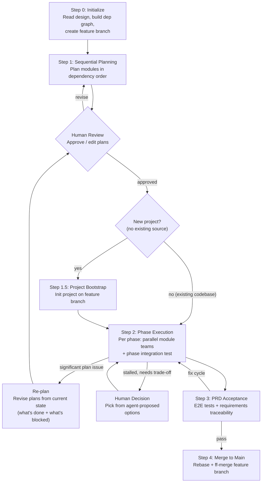
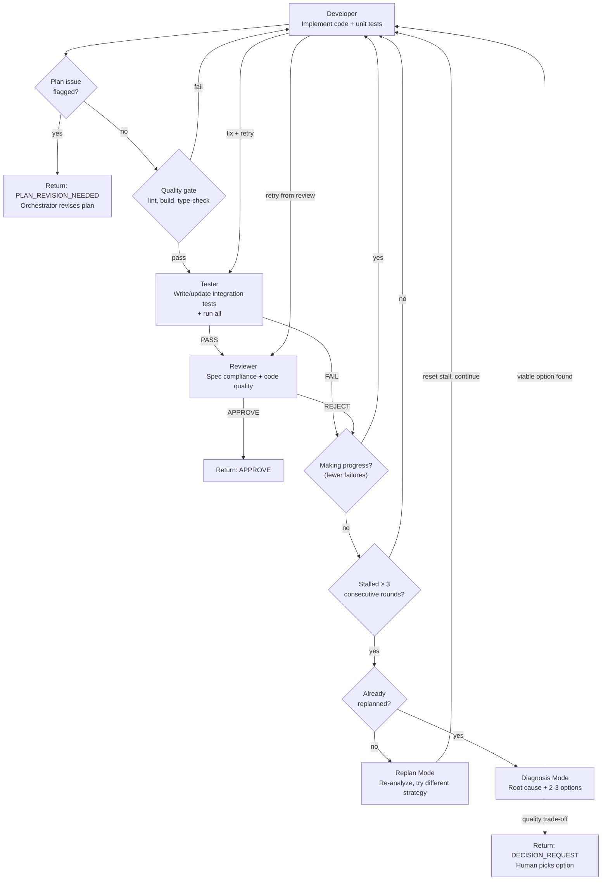

# Autoforge — Multi-Role Automated Development

Orchestrate agent teams to turn a system design into tested, PRD-validated code. Modules are planned sequentially in dependency order for consistency, then executed in parallel with isolated git worktrees. Each module gets a team (Developer, Tester, Reviewer). Fully automated with adaptive iteration — human intervenes only at explicit approval gates or when the agent has exhausted reasonable approaches and needs a trade-off decision.

## Input Modes

```
/autoforge docs/raw/design/2026-04-09-agent-team/              # full flow (plan → execute → accept)
/autoforge --plan-only docs/raw/design/2026-04-09-agent-team/   # generate plans only, stop for human review
/autoforge --execute docs/raw/plans/2026-04-09-agent-team-a3f1/     # execute existing plans (reads design/PRD paths from plan README)
/autoforge --status docs/raw/plans/2026-04-09-agent-team-a3f1/      # show progress
/autoforge --cleanup docs/raw/plans/2026-04-09-agent-team-a3f1/     # abandon run: remove worktrees, branches, optionally plans
```

## Process Overview



## Step 0 — Initialization

1. **Read design input** — read design README.md (module index, dependency graph, Feature-Module mapping, interaction protocols, test strategy) + all module specs (`modules/*.md`) + API contracts (`api/*.md` if present)
2. **Read project coding standards** — gather conventions from three sources in priority order:
   - **(a) CLAUDE.md and AGENTS.md** (if they exist) from the project root — project-specific overrides; highest priority
   - **(b) Design README's Implementation Conventions and Key Technical Decisions** — design-level conventions translated from the PRD
   - **(c) PRD architecture.md developer convention sections** — follow the design README's `Design Input > Source` to the PRD directory, then read `architecture.md` for: Coding Conventions, Test Isolation, Development Workflow, Security Coding Policy, Backward Compatibility, Git & Branch Strategy, Code Review Policy, Observability Requirements, Performance Testing, AI Agent Configuration, Deployment Architecture (environments, local dev setup, config management, CD pipeline, environment isolation)
   
   Merge these into a unified `project_coding_standards` context: (a) overrides (b) overrides (c). Pass relevant sections to all sub-agents throughout the pipeline.
3. **Locate PRD** — follow `Design Input > Source` to find the PRD directory; read PRD README.md for feature index, acceptance criteria references, journey E2E scenarios
4. **Build dependency graph** — from Module Index `Deps` column, construct a DAG. Topologically sort into phases: Phase 1 = modules with no dependencies, Phase 2 = modules whose deps are all in Phase 1, etc.
5. **Detect project state** — check if project has existing source code (package manifests, src directories). If so, note this — Planners must account for existing code structure
6. **Determine output paths**:
   - Plan output: `docs/raw/plans/{design-dir-name}-{hash4}/` where `{design-dir-name}` comes from the design directory name (e.g. `2026-04-09-agent-team`) and `{hash4}` = `$(git rev-parse --short=4 HEAD)`
   - Feature branch: `autoforge/{design-dir-name}-{hash4}`
   - Worktree root: `{project-root}/../{project-dirname}-worktrees/autoforge-{design-dir-name}-{hash4}/` — sibling to the project directory, one subdirectory per autoforge run
7. **Create feature branch and primary worktree** — the main project directory stays on its current branch throughout the autoforge run. All autoforge work happens in worktrees:
   ```
   git branch autoforge/{design-dir-name}-{hash4}
   git worktree add {worktree_root}/main autoforge/{design-dir-name}-{hash4}
   ```
   The **primary worktree** (`{worktree_root}/main/`) is used for all non-module work: planning, bootstrap, integration tests, acceptance tests, and status updates. Module-specific work uses separate per-module worktrees (see Step 2).
8. **Present plan to user** — show: module count, phase breakdown with dependency rationale, branch names, output paths. User confirms before proceeding.

**Step 0 → Step 1 gate:** User confirms phase breakdown and branch naming.

## Step 1 — Sequential Planning

Plan modules one at a time in dependency order. Each Planner receives all previously generated plans as accumulated context, ensuring consistent conventions, concrete interface alignment, and coherent file organization across the entire project.

Planners run in the **primary worktree** (on the feature branch) — they only produce plan documents, no code. **Planners write files but do NOT commit** — the Orchestrator commits all plans together after all Planners complete.

### Planning Order

Use the topological sort from Step 0. Within the same phase, order by module ID ascending:

```
Example: Phase 1 [M-001, M-002, M-008] → Phase 2 [M-003, M-005] → Phase 3 [M-006, M-007]
Planning order: M-001 → M-002 → M-008 → M-003 → M-005 → M-006 → M-007
```

### Conventions Bootstrap

The first Planner has an additional responsibility: create `docs/raw/plans/{plan-dir}/plans/conventions.md` defining project-wide implementation conventions derived from multiple sources:

**Primary sources (provide to the first Planner):**
- Design README: Tech Stack, Module Interaction Protocols, full Module Index
- Design README: Implementation Conventions section (design-level translation of PRD policies)
- PRD architecture.md: developer convention sections (Coding Conventions, Test Isolation, Development Workflow, Security Coding Policy, Backward Compatibility, Git & Branch Strategy, Code Review Policy, Observability Requirements, Performance Testing, AI Agent Configuration)

**What conventions.md must include:**
- Directory structure and file organization
- Naming conventions (files, functions, types, variables)
- Error handling patterns (error types, propagation strategy)
- Shared type definitions (types referenced across module interaction protocols)
- Import/export patterns
- Test file organization and naming
- Security patterns — input validation locations, injection prevention, secret handling (from PRD Security Coding Policy translated via design Implementation Conventions)
- Test isolation rules — resource isolation, port binding, temp directories, timeouts, global state prohibition (from PRD Test Isolation translated via design Implementation Conventions)
- Observability patterns — structured logging format, mandatory events, required log fields, health checks (from PRD Observability Requirements translated via design Implementation Conventions)
- Performance testing — benchmark requirements, CI performance gates, resource limits (from PRD Performance Testing translated via design Implementation Conventions)
- Development workflow — prerequisites, setup commands, CI gate ordering, build matrix (from PRD Development Workflow)
- AI agent instruction file policy — which instruction files to maintain (CLAUDE.md, AGENTS.md), structure policy (concise index with references to convention files, not monolithic), content priorities, maintenance triggers (from PRD AI Agent Configuration)

Subsequent Planners follow `conventions.md` and may extend it if they encounter patterns not yet covered.

### Per-Module Planning

For each module in planning order, spawn a single **Planner** agent. **Wait for each Planner to complete before spawning the next** — this is what enables context accumulation:

```
Agent({
  description: "Planner for M-{id}",
  prompt: <fill in planner-prompt.md with parameters>,
  mode: "auto"
})
```

See `planner-prompt.md` for the complete Planner prompt template.

**Planner input:**

| Input | Source | Notes |
|-------|--------|-------|
| Module design spec | `modules/M-{id}-{slug}.md` | Primary input for this module |
| Design README | Design `README.md` | Cross-module context: interaction protocols, test strategy, tech stack, Implementation Conventions, Key Technical Decisions |
| PRD architecture.md | `{prd-dir}/architecture.md` | Developer convention sections: Coding Conventions, Test Isolation, Security Coding Policy, Development Workflow, Observability Requirements, Performance Testing, Git & Branch Strategy, Code Review Policy, Backward Compatibility, AI Agent Configuration |
| PRD feature specs | `features/F-*.md` | Features referenced in module's Source Features section |
| Prototype Reuse Guide | Module spec's UI Architecture section | If module has Action = Reuse/Refactor: files to copy, patterns to preserve, adaptations needed. Planner uses this to generate "copy/adapt prototype" steps instead of "write from scratch" steps |
| PRD prototype source | `{prd-dir}/prototypes/src/{feature-slug}/` | Actual prototype code files (if module has Prototype Reuse Guide). Planner reads these to write concrete adaptation steps |
| Previous plans | `plans/plan-M-*.md` (all completed so far) | Accumulated context — concrete decisions from earlier modules |
| Implemented code | Source files on feature branch | For already-merged modules: actual code is source of truth over plans (populated during re-planning) |
| Conventions | `plans/conventions.md` | First module creates; subsequent modules read and may extend |

**Planner output:**
- `docs/raw/plans/{plan-dir}/plans/plan-M-{id}-{slug}.md` (using `module-plan-template.md`)
- [First module only] `docs/raw/plans/{plan-dir}/plans/conventions.md`
- [Subsequent modules, if needed] Additions to `conventions.md`

### After All Planners Complete

1. **Generate plan README** — write `docs/raw/plans/{plan-dir}/README.md` using `plan-readme-template.md`: dependency graph (mermaid), phase breakdown, module list with status
2. **Commit plans** — single commit of all plan files on the feature branch: `docs(plan): add implementation plans for {project}`
3. **Present to human** — provide a structured review summary so the user doesn't need to read every plan in full:
   - Per module: step count, key decisions, integration points
   - Cross-module: shared types defined in conventions.md, dependency flow
   - Risks: any assumptions or trade-offs the Planners flagged
   - If this is a **re-plan** (not initial planning), additionally provide:
     - **What changed and why** — a diff summary per plan: which steps/integration points were modified, added, or removed
     - **Trigger** — the issue that caused re-planning (ISSUE_TYPE, evidence, affected module)
     - **Impact scope** — which plans were unchanged vs. revised; which already-implemented modules need code changes
   - If `--plan-only` mode, stop here.
4. **Human review gate** — user approves, requests edits, or rejects. If edits requested, modify plans and re-commit.

**Step 1 → Step 1.5 gate:** Human approves all plans.

## Step 1.5 — Project Bootstrap (New Projects Only)

**Skip this step** if Step 0 detected an existing codebase (package manifests, src directories, build config). Proceed directly to Step 2.

This step only applies when creating a new project from scratch. It initializes the project in the primary worktree so all module worktrees inherit a working baseline.

1. **Read tech stack** — from design README.md (Tech Stack, Test Strategy sections)
2. **Spawn Bootstrap agent** in the primary worktree:
   ```
   Agent({
     description: "Project bootstrap",
     prompt: "Initialize project based on tech stack: {tech stack details}.
       Read the conventions file at {conventions_path} — it defines the expected
       directory structure, file naming, test organization, and shared types.
       Set up the project to match these conventions exactly:
       directory structure, dependency installation, build config, test framework, linter.
       Then scaffold CLAUDE.md based on AI Agent Configuration from the PRD architecture.md:
       generate a minimal CLAUDE.md with project overview placeholder, key commands
       from Development Workflow (build, test, lint), and references to convention
       files that the Development Infrastructure module will generate. Keep it
       concise (~200 lines or less) as a index file, not a monolithic document.
       Also scaffold deployment files based on Deployment Architecture from the PRD:
       environment variable template (.env.example with documented defaults from
       PRD config management policy) and local development setup script referenced
       in Development Workflow.
       Verify: project compiles, test command runs (0 tests), lint passes.
       Commit with message: 'chore: initialize project'",
     mode: "auto"
   })
   ```

## Step 2 — Phase Execution

Execute phases sequentially. Within each phase, execute modules in parallel.

### Per-Module Flow

For each module, spawn a **Module Agent** (second-level orchestrator) in an isolated git worktree. The Module Agent manages the Developer → Tester → Reviewer cycle internally.

**Create worktree and branch before spawning the agent:**

```
# Variables
worktree_root = {project-root}/../{project-dirname}-worktrees/autoforge-{design-dir-name}-{hash4}
module_branch = autoforge/{design-dir-name}-{hash4}/p{n}/M-{id}-{slug}
module_worktree = {worktree_root}/p{n}-M-{id}-{slug}

# Create worktree forked from feature branch
git worktree add -b {module_branch} {module_worktree} autoforge/{design-dir-name}-{hash4}
```

**Before spawning, detect prototype source** (if the module has one):

Read the module design spec's UI Architecture section. If a **Prototype Reuse Guide** exists with Action = Reuse or Refactor, extract the `Source` path (e.g. `{prd-dir}/prototypes/src/F-006-tui/`). This becomes `prototype_source_path`. If no Prototype Reuse Guide exists or Action = Rewrite, set `prototype_source_path` to empty.

**Then spawn the Module Agent in the worktree directory:**

```
Agent({
  description: "Module Agent for M-{id}: {module-name}",
  mode: "auto",
  prompt: "You are a Module Agent implementing M-{id}: {module-name}.
    Your working directory is: {module_worktree}
    [Paste full contents of module-agent-prompt.md with parameters filled in]

    Parameters:
    - module_design_path: {path}
    - module_plan_path: {path}
    - design_readme_path: {path}
    - report_dir: docs/raw/plans/{plan-dir}/reports/
    - feature_branch: autoforge/{design-dir-name}-{hash4}
    - module_branch: {module_branch}
    - worktree_path: {module_worktree}
    - conventions_path: docs/raw/plans/{plan-dir}/plans/conventions.md
    - project_coding_standards: {unified conventions from: (1) CLAUDE.md/AGENTS.md overrides, (2) design README Implementation Conventions + Key Technical Decisions, (3) PRD architecture.md developer convention sections — merged in priority order, or 'none'}
    - prototype_source_path: {extracted path, or empty if no prototype}
    - stall_threshold: 3
    - hard_ceiling: 20"
})
```

Module Agents within the same phase are spawned in parallel. See `module-agent-prompt.md` for the complete instructions.

### Module Agent Internal Flow



**Quality gate (between Developer and Tester):**

After Developer completes and before Tester runs, the Module Agent executes the project's CI gate commands from Development Workflow conventions (lint, build, type-check). If any fail, the Developer is given the failure output and must fix before proceeding. This catches formatting, import, and type errors early before test execution. If the Development Workflow specifies race detection, the Module Agent adds the race detection flag to test commands in subsequent Tester runs.

**Adaptive retry model:**

The Module Agent continues iterating as long as **measurable progress** is being made (fewer test failures or fewer required review findings each round). The goal is autonomous completion — human intervention is a last resort, not a quick fallback.

| Condition | Action |
|-----------|--------|
| Sub-agent flags PLAN_ISSUE (fundamental plan error) | Module Agent returns **PLAN_REVISION_NEEDED** — Orchestrator revises the plan and restarts the module |
| Sub-agent flags PLAN_ISSUE (minor deviation) | Module Agent notes the deviation and continues with a local workaround |
| Progress (fewer failures than previous round) | Continue — spawn Developer with fix context |
| No progress for 1-2 rounds | Continue — may need more iterations |
| No progress for 3 consecutive rounds | Enter **Replan Mode** — agent re-analyzes the problem and tries a fundamentally different approach (not just a different fix, a different strategy) |
| Replanned approach also stalls (3 more non-progress rounds) | Enter **Diagnosis Mode** — if a reasonable option exists that maintains quality, try it autonomously; if remaining options involve quality trade-offs, return DECISION_REQUEST |
| Hard ceiling (20 total retries) | Enter **Diagnosis Mode** → return DECISION_REQUEST |

**Replan Mode** is the critical differentiator: when the current approach isn't working, the agent doesn't ask for help — it steps back, re-reads the design spec, identifies what's fundamentally wrong, and devises an alternative implementation strategy. Only after exhausting reasonable alternatives does it involve the human, and only when the choice involves genuine trade-offs.

See `module-agent-prompt.md` for the complete Replan Mode, Diagnosis Mode, and decision request logic.

### Developer Role

```
Input:
  - Module plan file (plan-M-xxx.md)
  - Module design spec (M-xxx.md)
  - Worktree path (isolated workspace)
  - [On retry from Tester]: failure-details (which tests failed, error messages, test file paths)
  - [On retry from Reviewer]: review-comments (required fixes with severity)

Output:
  - Implemented code + unit tests in worktree
  - Commit on worktree branch with message: "feat(M-{id}): implement {description}"
  - developer-notes.md in report directory (implementation notes, decisions made, issues encountered)

Responsibilities:
  - Follow plan steps sequentially
  - Write unit tests covering module internal logic
  - Ensure all unit tests pass before handoff
  - On Tester retry: read failure details, fix source code (NOT test files), commit with "fix(M-{id}): {description}"
  - On Reviewer retry: address required review comments only, commit with "fix(M-{id}): address review feedback"
```

### Tester Role

```
Input:
  - Module design spec (M-xxx.md) — for acceptance criteria and edge cases
  - Worktree path (to read implemented code)
  - Changed files list
  - developer-notes.md

Output:
  - Integration test code committed: "test(M-{id}): add/update integration tests"
  - test-report.md in report directory (overwritten each round — Module Agent preserves history in retry_history)
  - [On failure] failure-details.md in report directory (overwritten each round)

Responsibilities:
  Every run (first or subsequent):
    - Read module design spec's acceptance criteria and edge cases
    - Read the current code and developer notes
    - If no integration tests exist yet: write them from scratch
    - If integration tests already exist: review them against the current code
      - Tests still valid → keep as-is
      - Public interface changed → update affected tests
      - New behaviors introduced (e.g., after Replan) → add new tests
      - Tests testing removed/changed behavior → update or remove
    - Run ALL tests (unit + integration)
    - If all pass: return PASS with test-report.md
    - If any fail: return FAIL with failure-details.md
```

### Reviewer Role

```
Input:
  - Module design spec (M-xxx.md)
  - Worktree path (to read code)
  - test-report.md

Output:
  - review-result: APPROVE or REJECT
  - review-comments.md in report directory (if REJECT, overwritten each round): list of issues with severity (required/suggested)

Review Dimensions:
  - Spec compliance: does code implement all interfaces and behaviors defined in design?
  - Code quality: naming, structure, error handling, no obvious bugs
  - Test sufficiency: do tests cover design's acceptance criteria and edge cases?
  - No scope creep: code doesn't add unrequested functionality
```

### After All Modules in Phase Complete

1. **Collect results** — all Module Agents in the phase run in parallel and return APPROVE, DECISION_REQUEST, or PLAN_REVISION_NEEDED. Subagents cannot interact with the user directly — they return structured results to the Orchestrator, which handles all human communication.
2. **Handle plan revisions** — if any module returned PLAN_REVISION_NEEDED, route by severity:

   **a. PLAN_TEXT_ERROR (minor)** — this module's plan has incorrect text (wrong signature, wrong path):
   - Spawn a Planner agent to revise this module's plan
   - Commit: `docs(plan): re-plan from phase {n} — {reason}`
   - Restart the Module Agent (reset retry state)

   **b. UPSTREAM_BUG / UPSTREAM_INSUFFICIENT / INTERFACE_REDESIGN (significant)** — the issue cannot be resolved by changing this module alone:
   - **Pause execution** of the current phase
   - **Return to Step 1 (Re-planning)** with the following additional context:
     - The issue report from the Module Agent (ISSUE_TYPE, evidence, suggested fix)
     - Current project state: which modules are already implemented and merged, which are in progress
     - The actual code on the feature branch (Planners read the real code, not just the old plans)
   - Re-planning follows the same sequential process as Step 1 but starts from the current state:
     - Planner re-evaluates ALL plans (completed and remaining) in dependency order
     - For already-implemented modules that need changes: plan produces fix/enhancement steps
     - For not-yet-implemented modules: plan is revised to account for the new reality
     - Conventions.md is updated if needed
   - Commit revised plans: `docs(plan): re-plan from phase {n} — {reason}`
   - **Human review gate** — present the re-plan review summary (see Step 1, item 3) with emphasis on what changed and why. The user should be able to understand the re-plan without re-reading unchanged plans.
   - After approval: resume execution from the appropriate phase, using `--execute` mode logic to determine which modules need re-execution
3. **Handle decision requests** — if any module returned DECISION_REQUEST:
   - Orchestrator presents the module's diagnosis and proposed options to the user (the Orchestrator runs in the main conversation and can communicate with the user directly)
   - Human picks an option (or provides their own instruction)
   - Spawn a Developer agent in the module's worktree with the chosen option as instructions
   - Spawn Tester to verify the fix (Tester will review/update tests as needed)
   - If pass → merge as normal; if fail → present updated diagnosis with new options to human; repeat until resolved or human chooses to skip/abort
4. **Merge module branches** — in the primary worktree (already on the feature branch), for each approved module sequentially:
   ```
   cd {worktree_root}/main
   git merge --ff-only autoforge/{design-dir-name}-{hash4}/p{n}/M-{id}-{slug}
   ```
   If ff-merge fails (concurrent changes), rebase the module branch first (from the module worktree or using git directly):
   ```
   cd {worktree_root}/p{n}-M-{id}-{slug}
   git rebase autoforge/{design-dir-name}-{hash4}
   cd {worktree_root}/main
   git merge --ff-only autoforge/{design-dir-name}-{hash4}/p{n}/M-{id}-{slug}
   ```
5. **Cleanup module worktrees and branches** — for each merged module:
   ```
   git worktree remove {worktree_root}/p{n}-M-{id}-{slug}
   git branch -d autoforge/{design-dir-name}-{hash4}/p{n}/M-{id}-{slug}
   ```
   For modules with DECISION_REQUEST or PLAN_REVISION_NEEDED: keep worktree alive for fix/restart process.
6. **Phase integration test** — spawn **Integration Tester** agent in the primary worktree:
   ```
   Agent({
     description: "Integration Tester for phase {n}",
     prompt: <fill in integration-tester-prompt.md with parameters below>,
     mode: "auto"
   })
   ```

   **Integration Tester parameters:**

   | Parameter | Source |
   |-----------|--------|
   | `phase_number` | Current phase number |
   | `feature_branch` | `autoforge/{design-dir-name}-{hash4}` |
   | `design_readme_path` | Design README.md path from Step 0 |
   | `module_design_paths` | Design specs for all modules in this phase |
   | `module_ids` | List of module IDs in this phase |
   | `previous_phase_modules` | Module IDs from all previous phases |
   | `report_dir` | `docs/raw/plans/{plan-dir}/reports/` |
   | `conventions_path` | `docs/raw/plans/{plan-dir}/plans/conventions.md` |
   | `is_rerun` | `false` on first run; `true` when re-running after fix cycle |

   See `integration-tester-prompt.md` for the complete prompt template.

   **Integration test fix cycle:** If integration tests fail, spawn a **Developer** agent in the primary worktree:

   ~~~~
   You are a Developer fixing integration test failures in phase {n}.

   ## Failure Context
   {paste failures section from integration report: test names, error messages, modules involved}

   ## Your Task
   - Read the failing integration tests to understand what's expected
   - Read the design specs for the involved modules: {module_design_paths for involved modules}
   - Fix the source code to make the integration tests pass
   - Do NOT modify the integration test files
   - Run all tests (unit + module-integration + phase-integration) to verify
   - Commit with message: "fix(p{n}): {brief description}"

   ## Rules
   - Fix the minimum necessary — do not refactor unrelated code
   - If the fix requires changes across multiple modules, make them in a single commit
   ~~~~

   Re-run integration tests after each fix (with `is_rerun: true` — reviews and updates existing tests as needed).

   Continue fix cycles as long as progress is being made (fewer failing tests each round). If stalled, the Orchestrator re-analyzes the failure and tries a different fix approach. Request human decision only after exhausting reasonable alternatives and the remaining options involve quality trade-offs.

7. **Update status** — update plan README.md status table, commit: `docs(plan): update status after phase-{n}`
8. **Update design doc** — update Module Index `Impl` column for completed modules (`—` → `Done`), update design-level Status if needed (Finalized → Implementing). Commit: `docs(design): update impl status after phase-{n}`
9. **Proceed to next phase**

## Step 3 — PRD Acceptance Validation

After all phases complete, validate against the original PRD.

### Acceptance Tester Role

Spawn the Acceptance Tester agent in the primary worktree:

```
Agent({
  description: "Acceptance Tester",
  prompt: <fill in acceptance-tester-prompt.md with parameters below>,
  mode: "auto"
})
```

**Acceptance Tester parameters:**

| Parameter | Source |
|-----------|--------|
| `feature_branch` | `autoforge/{design-dir-name}-{hash4}` |
| `prd_path` | PRD directory path from Step 0.2 |
| `design_readme_path` | Design README.md path from Step 0 |
| `report_dir` | `docs/raw/plans/{plan-dir}/reports/` |
| `conventions_path` | `docs/raw/plans/{plan-dir}/plans/conventions.md` |
| `acceptance_threshold` | From plan README Design Input table (default: 80) |
| `is_rerun` | `false` on first run; `true` when re-running after fix cycle |

See `acceptance-tester-prompt.md` for the complete prompt template. The Acceptance Tester reads all PRD feature specs and journey specs, writes E2E tests, builds a requirements traceability matrix, and determines the verdict (PASS / PARTIAL / FAIL) based on the acceptance threshold.

### Acceptance Fix Cycle

If acceptance report shows failures:

1. **Classify each failure** — the Orchestrator analyzes the acceptance report and categorizes each failed criterion:

   | Failure Type | Example | Resolution path |
   |-------------|---------|----------------|
   | **Implementation bug** | Code has a logic error; fix is local to one module | Developer fix on feature branch |
   | **Cross-module issue** | Modules work individually but feature workflow breaks across boundaries | Developer fix with access to ALL involved modules' design specs |
   | **Design gap** | The design didn't specify how to handle this scenario; no module is responsible | **Return to re-planning** (Step 1) — design needs enhancement |
   | **PRD ambiguity** | Acceptance criterion is unclear, contradictory, or untestable as written | **Present to human** — PRD clarification needed (outside autoforge scope) |

2. **Handle implementation bugs and cross-module issues** — fixes run in the **primary worktree** (`{worktree_root}/main/`) on the feature branch. All module code is already merged here, and acceptance fixes are sequential. For each failure, spawn a Developer agent:

   ~~~~
   You are a Developer fixing acceptance test failures.

   ## Failed Criteria
   {paste failed items from acceptance report: criterion reference, expected, actual, fix suggestion}

   ## Your Task
   - Read the relevant module design specs: {all module_design_paths for modules involved in the failure}
   - Read the failing acceptance tests to understand what's expected
   - For cross-module issues: read the Module Interaction Protocols from the design README
   - Fix the source code to satisfy the acceptance criteria
   - Do NOT modify the acceptance test files
   - Run all tests to verify your fix doesn't break anything
   - Commit with message: "fix(M-{id}): {acceptance criterion description}"

   ## Rules
   - Fix only the specific issues listed — do not add features or refactor
   - If multiple criteria fail for the same root cause, fix them together in one commit
   - If you cannot fix the issue because the design doesn't support it, report it rather than implementing an ad-hoc workaround
   ~~~~

3. **Handle design gaps** — if any failures are classified as design gaps:
   - These cannot be fixed by code changes alone
   - **Return to Step 1 (Re-planning)** with the acceptance failure evidence, same as PLAN_REVISION_NEEDED (significant) handling
   - Re-planning will produce revised plans that address the design gap
   - Human reviews revised plans before resuming execution

4. **Handle PRD ambiguities** — if any failures are classified as PRD issues:
   - Present to human with the specific acceptance criteria that are problematic
   - Human can: clarify the criterion (Orchestrator updates the acceptance test), waive the criterion (mark as NOT_COVERED with reason), or adjust the acceptance threshold

5. **Re-run acceptance tests** — Acceptance Tester re-runs full suite (with `is_rerun: true`)
6. **Continue as long as progress** — repeat fix cycles while failing test count decreases. If stalled, the Orchestrator re-analyzes and tries a different approach. Follow the same autonomous-first principle as module-level iteration.

### After Acceptance

1. **Commit final report** — `docs/raw/plans/{plan-dir}/reports/acceptance.md`, commit: `docs(plan): add acceptance report`
2. **Update all statuses** — plan README status tables + design doc Impl columns (all modules `Done`, design-level Status → `Implemented`)
3. **Final commit** — `docs(plan): mark implementation complete`

## Step 4 — Merge to Main

Only executed when acceptance verdict is PASS.

1. **Rebase feature branch** onto latest main (in the primary worktree, which is on the feature branch):
   ```
   cd {worktree_root}/main
   git rebase main
   ```
2. **Remove primary worktree** — frees the feature branch for merge:
   ```
   git worktree remove {worktree_root}/main
   ```
3. **Fast-forward merge** (in the main project directory, which is on `main`):
   ```
   cd {project-root}
   git merge --ff-only autoforge/{design-dir-name}-{hash4}
   ```
4. **Cleanup** — delete feature branch + worktree root:
   ```
   git branch -d autoforge/{design-dir-name}-{hash4}
   rm -rf {worktree_root}
   ```
5. **Report** — print summary: modules implemented, tests passing, acceptance pass rate

If rebase has conflicts, pause and present to human for resolution.

## --execute Mode

When invoked with `--execute docs/raw/plans/{plan-dir}/`:

1. **Read plan README** — extract Source Design, Source PRD, Feature Branch, and **Worktree Root** from the Design Input table
2. **Recover or create worktrees** — derive the worktree root from the plan README (or from the feature branch name: `{project-root}/../{project-dirname}-worktrees/{feature-branch-name}/`). Check for existing worktrees:
   ```
   git worktree list   # check for stale worktrees under {worktree_root}
   ```
   - Primary worktree (`{worktree_root}/main/`): if exists and on feature branch → reuse; if missing → create
   - Module worktrees: handle based on module status (see step 4)
   - Stale worktrees (no matching status entry): remove with `git worktree remove`
3. **Read design and PRD** — same as Step 0.1 and 0.2, using paths from the plan README
4. **Detect current state** — read plan README status tables and determine state per module:

   | Module Status | Interpretation | Action | Worktree handling |
   |--------------|----------------|--------|------------------|
   | Merged = `Yes` | Fully complete | Skip | Remove worktree + branch if still present |
   | Dev/Test/Review all `—` | Not started | Execute from beginning | Create fresh worktree |
   | Dev = `Done` or `Retry`, Merged ≠ `Yes` | In progress or failed | Re-execute | Reuse existing worktree if present; create fresh if missing |
   | Any column = `Revision` | Plan being revised | Read `reports/plan-revision-M-{id}.md` for issue details; re-plan then re-execute | Clean up old worktree; create fresh after re-plan |
   | Any column = `Decision` | Waiting for human decision | Read `reports/decision-request-M-{id}.md` for diagnosis + options; present to user | Reuse existing worktree (has partial work for inspection) |
   | Any column = `Skipped` | Human chose to skip | Skip | Remove worktree + branch if still present |

   For phase status:
   - Phase is **complete** if all its modules are `Merged = Yes` and Integration Test = `Pass`
   - Phase is **in progress** if any module is started but phase is not complete
   - Phase is **pending** if no modules have started

5. **Detect bootstrap status** — check if the feature branch contains a commit with message `chore: initialize project`. If yes, bootstrap is complete. If the design's project state was "existing source code" (Step 0.4), bootstrap was skipped and is considered complete.

6. **Determine entry point**:
   - If no phases started and bootstrap not complete → start at Step 1.5
   - If bootstrap complete but no modules executed → start at Step 2, Phase 1
   - If some phases complete → start at the first incomplete phase
   - If all phases complete but no acceptance → start at Step 3
   - If acceptance ran but failed → start at acceptance fix cycle

7. **Resume execution** — follow Step 1.5 → Step 2 → Step 3 → Step 4 from the determined entry point, skipping completed work

This mode is useful for:
- Resuming after an interruption
- Executing plans that were generated with `--plan-only`
- Retrying after human-resolved decision requests

## --status Mode

When invoked with `--status docs/raw/plans/{plan-dir}/`:

1. **Read plan README** — parse all status tables
2. **Read execution log** — parse `execution-log.md` for recent events
3. **Present summary**:
   - Phase progress: which phases complete, which in progress
   - Module status: per-module Dev/Test/Review state, retry counts
   - Integration test results: per-phase pass/fail
   - Acceptance status: if reached, show pass rate
   - Decision requests: any modules waiting for human decision
   - Recent events: last 10 entries from execution log
   - Estimated remaining: how many modules/phases left
4. **No modifications** — read-only mode

## --cleanup Mode

When invoked with `--cleanup docs/raw/plans/{plan-dir}/`:

Abandon the autoforge run and remove all artifacts. **This is destructive — confirm with user before proceeding.**

1. **Read plan README** — extract Feature Branch, Worktree Root
2. **Show current state** — run `--status` first so the user sees what will be lost
3. **Confirm** — ask user: "This will remove all worktrees, branches, and optionally plan files. Continue?"
4. **Remove all worktrees**:
   ```
   git worktree list   # find all worktrees under {worktree_root}
   # For each worktree:
   git worktree remove --force {path}
   ```
5. **Remove all module branches**:
   ```
   # For each module branch matching autoforge/{design-dir-name}-{hash4}/*:
   git branch -D {branch}
   ```
6. **Remove feature branch**:
   ```
   git branch -D autoforge/{design-dir-name}-{hash4}
   ```
7. **Remove worktree root directory**:
   ```
   rm -rf {worktree_root}
   ```
8. **Optionally remove plan files** — ask user:
   - "Keep plan files at `docs/raw/plans/{plan-dir}/` for reference?" (default: keep)
   - If user says remove: `git rm -rf docs/raw/plans/{plan-dir}/` + commit on current branch
9. **Report** — print what was cleaned up: worktrees removed, branches deleted, disk space freed

## Git Strategy

### Branch Naming

```
Feature branch (created by Orchestrator in Step 0):
  autoforge/{design-dir-name}-{hash4}
  Example: autoforge/2026-04-09-agent-team-a3f1

Module branches (created by Orchestrator before spawning Module Agent):
  autoforge/{design-dir-name}-{hash4}/p{phase}/M-{id}-{slug}
  Example: autoforge/2026-04-09-agent-team-a3f1/p1/M-001-task-split
```

- `{design-dir-name}` = design directory name, directly traceable to `docs/raw/design/{name}/`
- `{hash4}` = `$(git rev-parse --short=4 HEAD)` at creation time — prevents collision on reruns
- `p{phase}` = phase number — groups modules by execution batch
- `M-{id}-{slug}` = module ID and slug — matches design document naming
- Module branches are forked from the feature branch

**Note:** If the PRD's Git & Branch Strategy defines a branch naming convention, autoforge's internal `autoforge/` prefix does not conflict — these are automation-scoped branches cleaned up after merge. For commit messages, if the PRD specifies a format (e.g., Conventional Commits with issue IDs), extend autoforge's commit templates accordingly.

### Commit Messages

```
chore: initialize project
docs(plan): add implementation plans for {project}
feat(M-001): implement {module} interfaces and core logic
test(M-001): add unit tests for {module}
test(M-001): add integration tests for {module}
fix(M-001): fix {test failure description}
fix(M-001): address review feedback
refactor(M-001): {new approach description after Replan}
test(p1): add phase-1 integration tests
fix(p1): resolve phase-1 integration issues
docs(plan): re-plan from phase {n} — {reason}
docs(plan): update status after phase-{n}
docs(design): update impl status after phase-{n}
test(e2e): add E2E acceptance tests
fix(M-001): {acceptance criterion description}
docs(plan): add acceptance report
docs(plan): mark implementation complete
log: {brief event description}
```

### Merge Rules

- **Always rebase before merge** — keep linear history
- **Only fast-forward merges** — `git merge --ff-only`; if ff not possible, rebase first
- **Module → feature branch**: sequential merge after each module completes within a phase
- **Feature → main**: only after full acceptance passes

### Worktree Convention

```
Worktree root (sibling to project, one per autoforge run):
  {project-root}/../{project-dirname}-worktrees/autoforge-{design-dir-name}-{hash4}/
  Example: ../myapp-worktrees/autoforge-2026-04-09-agent-team-a3f1/

Primary worktree (feature branch — planning, bootstrap, integration, acceptance):
  {worktree-root}/main/
  Example: ../myapp-worktrees/autoforge-2026-04-09-agent-team-a3f1/main/

Per-module worktree (one per module during phase execution):
  {worktree-root}/p{phase}-M-{id}-{slug}/
  Example: ../myapp-worktrees/autoforge-2026-04-09-agent-team-a3f1/p1-M-001-task-split/
```

Worktrees are placed outside the project directory to avoid nesting. The **main project directory is never checked out to the feature branch** — it stays on its original branch, so other work can proceed in parallel.

### Worktree Lifecycle

Worktrees are managed by the Orchestrator:

| Event | Action |
|-------|--------|
| Autoforge starts | Create primary worktree: `git worktree add {worktree_root}/main {feature_branch}` |
| Phase starts | Create per-module worktrees: `git worktree add -b {branch} {path} {feature_branch}` |
| Module APPROVE | After merge: `git worktree remove {path}` + `git branch -d {branch}` |
| Module DECISION_REQUEST | Keep worktree + branch alive for human-assisted fix process |
| Module PLAN_REVISION_NEEDED (minor) | Keep worktree; revise plan and restart module in same worktree |
| Module PLAN_REVISION_NEEDED (significant) | Pause phase; merge unaffected APPROVE modules; clean up their worktrees. Keep affected worktrees until re-plan completes. After human approves revised plans: clean up old worktrees, create fresh ones for re-execution |
| Re-plan approved, resuming | Same as `--execute` mode: recover or recreate worktrees based on module status |
| All phases + acceptance complete | Remove worktree root: `rm -rf {worktree-root}` (verify with `git worktree list`) |

**Interruption recovery:** Worktrees and branches persist on disk across session interruptions. The `--execute` mode detects existing worktrees via `git worktree list` and handles each based on the module's status in the plan README. Stale worktrees with no matching status entry are removed.

## Status Tracking

Plan README.md maintains a live status table (updated after each phase):

```markdown
## Module Status

| Module | Phase | Plan | Dev | Test | Review | Merged | Notes |
|--------|-------|------|-----|------|--------|--------|-------|
| M-001  | 1     | Done | Done | Done | Approved | Yes | — |
| M-002  | 1     | Done | Retry 2 | — | — | — | Test failure: null check |
| M-003  | 2     | Done | — | — | — | — | Waiting for Phase 1 |

## Phase Status

| Phase | Modules | Completed | Integration Test | Status |
|-------|---------|-----------|-----------------|--------|
| 1     | 3       | 2/3       | —               | In Progress |
| 2     | 2       | 0/2       | —               | Waiting |

## Acceptance

| Feature | Criteria Total | Passed | Failed | Not Covered | Status |
|---------|---------------|--------|--------|-------------|--------|
| F-001   | 8             | 8      | 0      | 0           | Pass   |
| F-002   | 7             | 5      | 2      | 0           | Fail   |
```

## Execution Log

The Orchestrator maintains an append-only execution log at `docs/raw/plans/{plan-dir}/execution-log.md`. This is the **single source of truth** for understanding what happened, what decisions were made, and why things are the way they are.

### When to log

The Orchestrator appends an entry after every significant event:

| Event | What to record |
|-------|---------------|
| Phase started | Phase number, module list, worktree paths |
| Module Agent returned APPROVE | Module, total retries, test counts, commit hash |
| Module Agent returned DECISION_REQUEST | Module, diagnosis summary, proposed options |
| Module Agent returned PLAN_REVISION_NEEDED | Module, issue description, affected plans |
| Human decision made | Which option was chosen, rationale if provided |
| Plan revised | Which plans changed, what was corrected, downstream impact |
| Replan Mode entered (from Module Agent return) | Module, stall count, failure pattern, new strategy |
| Module retry with fix | Module, round number, what was fixed, test failure delta (e.g., 5→3) |
| Phase integration test result | Phase, pass/fail, test counts, failures if any |
| Phase merge completed | Modules merged, branch cleanup |
| Acceptance test result | Verdict, pass rate, failed criteria count |
| Acceptance fix dispatched | Module, which criteria being fixed |
| Infrastructure failure | Module, error type, action taken |

### Entry format

Each entry follows this structure:

```markdown
### {YYYY-MM-DD HH:MM} — {event summary}

**Context:** {module / phase / step}
**Event:** {what happened}
**Details:**
{key facts — test counts, failure descriptions, decisions, rationale}
**Outcome:** {what happens next as a result}
```

### Logging protocol

- The Orchestrator appends entries — sub-agents do NOT write to the log directly
- After appending, commit the log: `git add execution-log.md && git commit -m "log: {brief event description}"`
- Log commits are lightweight and frequent — one per event, not batched
- The log is append-only — never edit or remove previous entries
- Include quantitative data (test counts, failure deltas) so progress trends are visible

## Decision Request Protocol

When an agent has exhausted its autonomous options (Replan Mode tried, alternative approach also stalled, or hard ceiling reached), it enters **Diagnosis Mode** instead of giving up.

### Diagnosis Mode

The agent performs root cause analysis before requesting a human decision:

1. **Identify the pattern** — review all retry history:
   - Same test failing with same error → fundamental approach issue
   - Different tests failing each round → regression/side-effect pattern
   - Reviewer finding same issue repeatedly → spec interpretation disagreement
2. **Classify the root cause**:
   - **Design ambiguity** — spec doesn't clearly define expected behavior
   - **Plan error** — implementation steps don't achieve the spec's intent
   - **Missing capability** — the module needs something not available (external service, data, dependency)
   - **Conflicting constraints** — two requirements contradict each other
   - **Implementation complexity** — the approach is correct but execution has bugs
3. **Propose 2-3 concrete options**, each with:
   - What specifically to change (files, functions, approach)
   - Trade-offs and risks
   - Which tests/criteria would be affected

### How the Orchestrator handles DECISION_REQUEST

1. **Present** the diagnosis and options to human (other independent modules continue running)
2. **Human picks** an option — or provides a custom instruction
3. **Orchestrator spawns** a Developer agent in the module's worktree with the chosen option
4. **Verify** — spawn Tester to check the fix (Tester will review/update tests as needed)
5. **Continue** — if pass, proceed to Reviewer or merge; if fail, present an updated diagnosis with new options; repeat until resolved or human chooses to skip/abort

### Agent infrastructure failures

If an Agent tool call fails due to infrastructure issues (timeout, context overflow, tool error — as opposed to application-level test/review failures):

1. **First failure** — retry the same Agent call once (does not count toward retry tracking)
2. **Second failure** — present the infrastructure error to human with options: retry / skip module / abort
3. **Log** — record the infrastructure failure in the module's report directory for debugging

## Key Principles

- **Self-contained agents** — each agent receives all needed context; no agent needs to read prior conversation history
- **Sequential planning, parallel execution** — modules are planned one at a time in dependency order for consistency; within each execution phase, modules run in parallel
- **Fail fast, fix targeted** — test failures and review rejections are addressed by the responsible Developer, not by re-running the entire pipeline
- **Main stays clean** — all work happens on the feature branch; main is only touched at the very end after full acceptance
- **Design is the contract** — module design specs are the source of truth; Reviewer checks code against design, not against subjective standards
- **Status is visible** — plan README is updated after every phase; execution log records every decision and state change; design doc Impl columns reflect actual progress
- **Autonomous first** — continue iterating while progress is being made; when stalled, try alternative approaches before involving a human; request human decision only when reasonable options are exhausted and remaining choices involve quality trade-offs
- **Human decides trade-offs, agent decides implementation** — when genuinely stuck, the agent presents concrete options for human choice, then continues with the chosen approach — never dumps unstructured problems or gives up prematurely

## Output Structure

```
docs/raw/plans/{design-dir-name}-{hash4}/
├── README.md                              # Dependency graph + phases + live status
├── execution-log.md                       # Chronological event log (append-only)
├── plans/
│   ├── conventions.md                     # Project-wide implementation conventions
│   ├── plan-M-001-{slug}.md               # Module implementation plan
│   ├── plan-M-002-{slug}.md
│   └── ...
├── reports/
│   ├── developer-notes-M-001.md           # Developer implementation notes
│   ├── test-report-M-001.md               # Module test report
│   ├── review-M-001.md                    # Module review result
│   ├── decision-request-M-001.md          # DECISION_REQUEST details (if stalled)
│   ├── plan-revision-M-001.md             # PLAN_REVISION_NEEDED details (if plan issue)
│   ├── module-state-M-001.json            # Module Agent state (retries, stall count, history)
│   ├── integration-phase-1.md             # Phase integration test report
│   ├── integration-phase-2.md
│   └── acceptance.md                      # PRD acceptance report
```

## Templates

- `plan-readme-template.md` — plan directory README with dependency graph, phase list, status tables
- `planner-prompt.md` — Planner agent instructions (sequential planning with context accumulation)
- `module-plan-template.md` — per-module implementation plan with atomic steps
- `module-agent-prompt.md` — Module Agent instructions (second-level orchestrator)
- `integration-tester-prompt.md` — Phase-level integration tester instructions
- `acceptance-tester-prompt.md` — PRD acceptance tester instructions
- `acceptance-report-template.md` — PRD acceptance report with traceability matrix

## Next Steps Hint

After completion, print:

```
Autoforge complete: all modules implemented and PRD acceptance passed.
  Feature branch merged to main.
  Acceptance report: docs/raw/plans/{plan-dir}/reports/acceptance.md
  Plan status: docs/raw/plans/{plan-dir}/README.md
```
