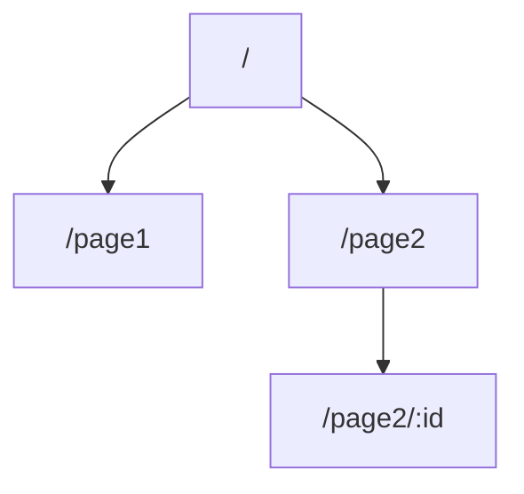
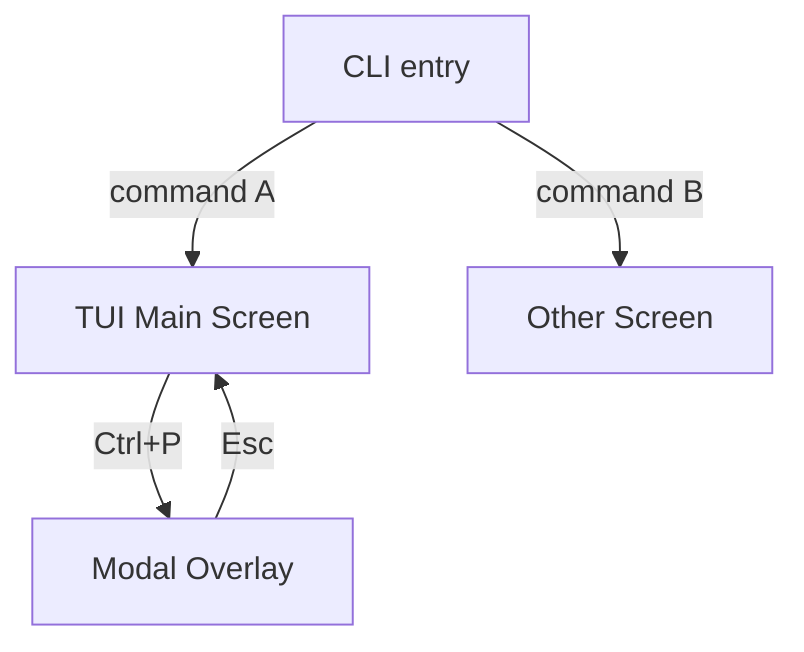

# Architecture Template — architecture.md

The architecture.md holds all shared technical context that feature files may reference. Feature files **copy relevant data models inline** — don't point agents back to architecture.md.

## Template

The architecture.md follows this structure:

### Header

```
# Architecture: {Product Name}
```

### High-Level Architecture

{Mermaid diagram or concise description}

### Tech Stack

| Layer | Technology | Rationale |
|-------|-----------|-----------|
| {e.g. Frontend / Backend / Database / Infrastructure} | {e.g. React + TypeScript / Go / PostgreSQL / AWS} | {why this choice} |

### Frontend Stack

{Omit if the product has no user-facing interface.}

| Concern | Choice | Version | Rationale |
|---------|--------|---------|-----------|
| UI Framework | {e.g. React} | {e.g. 19.x} | {why} |
| CSS Approach | {e.g. Tailwind CSS} | {e.g. 4.x} | {why} |
| Component Library | {e.g. Shadcn/ui} | {e.g. latest} | {why} |
| State Management | {e.g. Zustand} | {e.g. 5.x} | {why} |
| Build Tool | {e.g. Vite} | {e.g. 6.x} | {why} |
| Form Management | {e.g. React Hook Form} | {e.g. 7.x} | {why} |
| i18n | {e.g. react-i18next} | {e.g. 15.x} | {why} |
| E2E Testing | {e.g. Playwright} | {e.g. 1.x} | {why} |

### Design Token System

{Omit if the product has no user-facing interface. AI agents consume this section to generate consistent visual code.}

#### Colors

| Token | Value | Usage |
|-------|-------|-------|
| color.primary.50 | {lightest shade} | Lightest primary background |
| color.primary.500 | {mid shade} | Default primary |
| color.primary.900 | {darkest shade} | Darkest primary text |
| color.secondary.50–900 | {shades} | Secondary palette |
| color.neutral.50–950 | {shades} | Neutral palette |
| color.semantic.success | {value} | Success states |
| color.semantic.warning | {value} | Warning states |
| color.semantic.error | {value} | Error states, destructive actions |
| color.semantic.info | {value} | Informational |
| color.bg.default | {value} | Page background |
| color.bg.subtle | {value} | Card, section background |
| color.bg.muted | {value} | Disabled, inactive background |
| color.fg.default | {value} | Primary text |
| color.fg.muted | {value} | Secondary text |
| color.border.default | {value} | Default borders |

#### Typography

| Token | Value |
|-------|-------|
| font.family.sans | {e.g. Inter, system-ui, -apple-system, sans-serif} |
| font.family.mono | {e.g. JetBrains Mono, Fira Code, monospace} |
| font.size.xs | 0.75rem (12px) |
| font.size.sm | 0.875rem (14px) |
| font.size.base | 1rem (16px) |
| font.size.lg | 1.125rem (18px) |
| font.size.xl | 1.25rem (20px) |
| font.size.2xl | 1.5rem (24px) |
| font.size.3xl | 1.875rem (30px) |
| font.size.4xl | 2.25rem (36px) |
| font.lineHeight.tight | 1.25 |
| font.lineHeight.normal | 1.5 |
| font.lineHeight.relaxed | 1.75 |
| font.weight.normal | 400 |
| font.weight.medium | 500 |
| font.weight.semibold | 600 |
| font.weight.bold | 700 |

#### Spacing

| Token | Value | Usage |
|-------|-------|-------|
| spacing.0 | 0px | — |
| spacing.1 | 4px | Tight internal padding |
| spacing.2 | 8px | Default internal padding |
| spacing.3 | 12px | — |
| spacing.4 | 16px | Default gap, section padding |
| spacing.6 | 24px | Section margin |
| spacing.8 | 32px | Large section gap |
| spacing.12 | 48px | Page-level spacing |
| spacing.16 | 64px | Major section separation |

#### Border, Shadow, Radius

| Token | Value |
|-------|-------|
| radius.none | 0px |
| radius.sm | 2px |
| radius.md | 6px |
| radius.lg | 8px |
| radius.xl | 12px |
| radius.full | 9999px |
| shadow.sm | 0 1px 2px 0 rgb(0 0 0 / 0.05) |
| shadow.md | 0 4px 6px -1px rgb(0 0 0 / 0.1) |
| shadow.lg | 0 10px 15px -3px rgb(0 0 0 / 0.1) |

#### Breakpoints

| Token | Value | Target |
|-------|-------|--------|
| breakpoint.sm | 640px | Mobile landscape |
| breakpoint.md | 768px | Tablet |
| breakpoint.lg | 1024px | Desktop |
| breakpoint.xl | 1280px | Wide desktop |
| breakpoint.2xl | 1536px | Ultra-wide |

#### Motion

| Token | Value | Usage |
|-------|-------|-------|
| motion.duration.fast | 150ms | Hover, toggle, micro-feedback |
| motion.duration.normal | 300ms | Panel open/close, page transition |
| motion.duration.slow | 500ms | Complex entrance animation |
| motion.easing.default | cubic-bezier(0.4, 0, 0.2, 1) | General purpose |
| motion.easing.in | cubic-bezier(0.4, 0, 1, 1) | Exit animations |
| motion.easing.out | cubic-bezier(0, 0, 0.2, 1) | Entrance animations |
| motion.easing.inOut | cubic-bezier(0.4, 0, 0.2, 1) | Symmetric transitions |

#### Z-Index

| Token | Value | Usage |
|-------|-------|-------|
| z.base | 0 | Default content |
| z.dropdown | 10 | Dropdown menus |
| z.sticky | 20 | Sticky headers |
| z.overlay | 30 | Overlays, backdrops |
| z.modal | 40 | Modal dialogs |
| z.popover | 50 | Popovers, tooltips |
| z.toast | 60 | Toast notifications |

{Values above are defaults — replace with project-specific values during PRD Phase 3. If using an established component library, extract its token values as the baseline.}

### Navigation Architecture

{Omit if the product has no user-facing interface or has only a single view. Use the Web section for web/desktop apps, or the TUI section for terminal apps — not both.}

#### Web Navigation

{Omit for TUI products.}

**Site Map:**

{Mermaid diagram showing page hierarchy derived from journey Screen/View names.}



{Replace with actual product structure.}

**Navigation Layers:**

| Layer | Type | Content | Behavior |
|-------|------|---------|----------|
| Global | {sidebar / top nav / bottom tab} | {nav items} | {always visible / collapses on mobile} |
| Section | {tabs / sub-nav / breadcrumb} | {context-dependent items} | {appears within specific views} |
| Contextual | {inline links / action menus} | {in-content navigation} | {embedded in page content} |

**Route Definitions:**

| View (from journeys) | Route Pattern | Params | Query Params | Auth | Layout |
|----------------------|--------------|--------|-------------|------|--------|
| {view name} | {/path/:param} | {param: type} | {?key=default} | {required / public} | {main / minimal / none} |

**Deep Linking & State Restoration:**

| View | Shareable URL | State in URL | Restoration Behavior |
|------|-------------|-------------|---------------------|
| {view name} | Yes / No | {what state is encoded in URL} | {how state is restored on direct access} |

**Breadcrumb Strategy:** {auto-generated from route hierarchy / manual per-view / none}

#### TUI Navigation

{Omit for web products.}

**Screen Flow:**

{Mermaid diagram showing CLI entry points and TUI screen transitions.}



{Replace with actual product structure.}

**Command Structure:**

| Command | Entry Point | Screen/View | Exit |
|---------|-------------|-------------|------|
| {e.g. `app run --input <path>`} | CLI | {TUI screen name} | {Ctrl+C / completion} |

**TUI Internal Navigation:**

| From | Action | To | Notes |
|------|--------|----|-------|
| {screen/panel} | {key or action} | {target screen/panel} | {e.g. focus changes, content swaps} |

**Focus Order:** {e.g. main area → input → sidebar (Tab cycle)}

### Accessibility Baseline

{Omit if the product has no user-facing interface.}

| Aspect | Requirement |
|--------|------------|
| WCAG Level | {2.1 AA / 2.1 AAA} |
| Keyboard Navigation | All interactive elements reachable via Tab; logical tab order; no keyboard traps |
| Screen Reader | All images have alt text; form fields have associated labels; dynamic content uses ARIA live regions |
| Focus Indicators | Visible focus ring on all interactive elements; minimum 3:1 contrast ratio for focus indicator |
| Color Contrast | Text: minimum 4.5:1 (normal) / 3:1 (large); UI components: minimum 3:1 against background |
| Motion | Respect `prefers-reduced-motion`; no auto-playing animations longer than 5 seconds |
| Touch Targets | Minimum 44x44px for touch interfaces |
| Error Identification | Errors identified by more than color alone (icon + text) |

{Individual features may add requirements beyond this baseline in their Accessibility sub-section.}

### Internationalization Baseline

{Omit if the product is single-language only and explicitly confirmed as such.}

#### Shared (applies to both frontend and backend)

| Aspect | Requirement |
|--------|------------|
| Supported Languages | {e.g. en, zh-CN, ja} |
| Default Language | {e.g. en} |
| Date/Time Format | {locale-aware via Intl.DateTimeFormat / date-fns with locale} |
| Number Format | {locale-aware via Intl.NumberFormat} |
| Pluralization | {ICU MessageFormat / library-specific} |

#### Frontend (omit if no user-facing interface)

| Aspect | Requirement |
|--------|------------|
| RTL Support | {required / not required} |
| Text Externalization | All user-visible strings use i18n keys; no hardcoded text in components |
| Key Convention | {e.g. `{feature}.{section}.{element}` — e.g. `dashboard.header.title`} |
| Content Direction | {LTR-only / bidirectional — use CSS logical properties if bidirectional} |

#### Backend (omit if single-language backend with no multi-locale API consumers)

| Aspect | Requirement |
|--------|------------|
| Locale Resolution | {e.g. Accept-Language header → user profile preference → default} |
| API Error Messages | {localized per request locale / fixed language (e.g. always English)} |
| Validation Messages | {localized per request locale / error codes only (client formats)} |
| Notification Content | {localized per recipient preference / fixed language} |
| Timezone Handling | {e.g. store UTC, convert per user timezone on output / always UTC} |
| Locale-Aware Formatting | {API returns formatted values per locale / raw values (client formats)} |

### External Dependencies

| Service | Purpose | API Style | Timeout | Failure Mode | Fallback |
|---------|---------|-----------|---------|-------------|----------|
| {name} | {what it does for us} | REST / gRPC / SDK | {ms} | {what happens when down} | {degraded behavior or retry strategy} |

### Coding Conventions

These are technology-agnostic policies that ensure consistency when multiple agents or developers implement features in parallel. The system-design phase translates these policies into concrete patterns for the chosen tech stack.

#### Code Organization

| Aspect | Policy |
|--------|--------|
| Layering strategy | {e.g. domain/service/infrastructure separation — domain has no external dependencies; service orchestrates domain; infrastructure handles I/O} |
| Module/package structure | {e.g. one package per bounded context; packages named as nouns (e.g. `scheduler`, `agent`, `git`), not verbs} |
| File organization | {e.g. one primary type per file; file named after the type; tests in `_test` suffix files alongside source} |

#### Naming Conventions

| Element | Convention | Example |
|---------|-----------|---------|
| Modules/packages | {e.g. lowercase, singular nouns} | {e.g. `scheduler`, `agent`} |
| Types/classes | {e.g. PascalCase, descriptive nouns} | {e.g. `TaskScheduler`, `WorkSession`} |
| Interfaces | {e.g. behavior-describing names, no "I" prefix} | {e.g. `Scheduler`, `Store`} |
| Functions/methods | {e.g. verb-first for actions, noun for getters} | {e.g. `CreateWorktree()`, `Status()`} |
| Constants | {e.g. ALL_CAPS or PascalCase per language convention} | — |
| Files | {e.g. snake_case matching primary type} | {e.g. `task_scheduler.go`} |

#### Interface & Abstraction Design

| Aspect | Policy |
|--------|--------|
| When to define interfaces | {e.g. at module boundaries and for external dependencies; not for internal implementation details} |
| Interface location | {e.g. defined by the consumer (caller), not the provider — enables loose coupling} |
| Interface size | {e.g. prefer small, focused interfaces (1-3 methods); split large interfaces into composable parts} |
| Concrete vs abstract | {e.g. start with concrete types; extract interface only when a second consumer needs it or for testability} |

#### Dependency Wiring

| Aspect | Policy |
|--------|--------|
| Injection method | {e.g. constructor injection — all dependencies passed as parameters to constructors/factory functions} |
| Global mutable state | {e.g. prohibited — all state must be owned by a specific component and passed explicitly; no package-level variables that change after init} |
| Initialization order | {e.g. main/entry point constructs the dependency graph; components do not construct their own dependencies} |

#### Error Handling & Propagation

| Aspect | Policy |
|--------|--------|
| Error context | {e.g. all errors must include context describing what was being done when the failure occurred} |
| Error categories | {e.g. validation errors (user input), domain errors (business rule violations), infrastructure errors (I/O, network), transient errors (retry-eligible)} |
| Cross-boundary translation | {e.g. infrastructure errors are translated to domain-level errors at layer boundaries; internal details are not leaked to callers} |
| Panic / unhandled exception policy | {e.g. panics/crashes recovered at goroutine/thread entry points; converted to error returns; never propagated to callers} |

#### Logging

| Aspect | Policy |
|--------|--------|
| Format | {e.g. structured key-value pairs, not free-form strings} |
| Levels | {e.g. ERROR = requires human action; WARN = degraded but functional; INFO = key business events and state transitions; DEBUG = troubleshooting detail} |
| Sensitive data | {e.g. secrets, tokens, PII, and credentials must never appear in logs; use redaction or reference IDs instead} |
| Per-component logging | {e.g. each component logs with a component identifier for filtering} |

#### Configuration Access

| Aspect | Policy |
|--------|--------|
| Access pattern | {e.g. configuration injected at construction time; components receive only the config they need, not the entire config tree} |
| Validation | {e.g. all configuration validated at startup; fail fast with clear error message on invalid config} |
| Defaults | {e.g. every config key has a sensible default; config file is optional for getting started} |

#### Concurrency

| Aspect | Policy |
|--------|--------|
| Lifecycle management | {e.g. all long-running tasks accept a context/cancellation token; support graceful shutdown within a configurable timeout} |
| Shared state | {e.g. prefer message-passing (channels/events) over shared memory with locks; when locks are necessary, document the lock ordering} |
| Resource cleanup | {e.g. all acquired resources (file handles, processes, network connections) must be released in a cleanup/defer/finally path, even on error} |

#### Frontend Conventions

{Omit if the product has no user-facing interface.}

| Aspect | Policy |
|--------|--------|
| Component structure | {e.g. one component per file; container components separated from presentational components} |
| State management scope | {e.g. local state for UI-only concerns; shared state only for data needed by multiple components} |
| Styling approach | {e.g. all visual values reference design tokens; no inline raw values; component-scoped styles preferred over global} |

### Test Isolation

Policies ensuring tests are reliable when run in parallel, across worktrees, or in CI. Critical for multi-agent development.

| Aspect | Policy |
|--------|--------|
| Resource isolation | {e.g. every test creates its own temporary resources (dirs, repos, DBs); no test depends on resources created by another test} |
| Global mutable state | {Prohibited — tests must not read or modify module/package-level mutable state; all state passed as parameters or created in test scope} |
| Port binding | {e.g. tests that start servers must bind to port 0 (random available port); hardcoded ports are forbidden} |
| File system | {e.g. tests must use the test framework's temp directory facility; writing to working directory or project root is forbidden} |
| External processes | {e.g. tests that spawn child processes must register cleanup to terminate them on test completion, including on failure/timeout} |
| Race detection | {e.g. data race detection must be enabled in CI (e.g. `-race` flag, ThreadSanitizer); this is a CI gate, not optional} |
| Timeouts | {e.g. unit tests: max 30s; integration tests: max 5m; no test may run without a timeout bound} |
| Directory independence | {Tests must not assume any specific working directory or absolute path; must work from any worktree or checkout location} |
| Parallel classification | {e.g. tests are parallel-safe by default; tests requiring exclusive resources (shared locks, specific ports) are explicitly marked as serial and documented why} |

### Development Workflow

| Aspect | Specification |
|--------|---------------|
| Prerequisites | {e.g. Go 1.23+, Git 2.20+, Claude Code latest — list runtime versions and tools} |
| Local setup | {e.g. `make setup` — one-command bootstrap that installs tools and verifies prerequisites} |
| CI gates (blocking) | {e.g. lint → build → test with race detection → benchmark regression check; all must pass before merge} |
| CI gates (non-blocking) | {e.g. coverage report, dependency audit — informational only} |
| Build matrix | {e.g. Linux amd64 + macOS arm64; CI tests on both} |
| Versioning | {e.g. semver; tags trigger release builds} |
| Changelog | {e.g. conventional commits → auto-generated changelog; or manual CHANGELOG.md} |
| Release testing | {e.g. full test suite + E2E on release candidate before tagging} |
| Dependency policy | {e.g. new dependencies require review; license must be MIT/Apache/BSD; automated dependency update PRs reviewed weekly} |

### Security Coding Policy

Technology-agnostic security policies that every feature must follow.

| Aspect | Policy |
|--------|--------|
| Input validation | {e.g. all external input validated at system boundaries (API handlers, CLI parsers, file readers); internal layers trust validated data} |
| Boundary definition | {e.g. boundaries are: HTTP handlers, CLI argument parsers, file/config readers, message queue consumers, webhook receivers} |
| Secret handling | {e.g. secrets, tokens, credentials never in source code, logs, error messages, or VCS history; provided via environment variables / secret manager} |
| Dependency scanning | {e.g. vulnerability scanning in CI; critical/high CVEs block merge; known vulnerabilities must be fixed or documented within 7 days} |
| Injection prevention | {e.g. never concatenate user input into commands, queries, or templates; use parameterized queries, shell escaping, template sandboxing} |
| Auth enforcement | {e.g. every entry point independently verifies permissions; internal calls do not bypass auth checks} |
| Sensitive data in transit | {e.g. all external connections use TLS; no plaintext transmission of credentials or PII} |
| Sensitive data at rest | {e.g. passwords hashed with bcrypt/argon2; encryption for PII at rest — or N/A if no sensitive data stored} |

### Backward Compatibility

{Omit for v1/MVP with no existing consumers. Note the intended future versioning strategy.}

| Aspect | Policy |
|--------|--------|
| API versioning | {e.g. URL prefix `/v1/`; new version when breaking changes are unavoidable; old version maintained for 6 months after deprecation notice} |
| Breaking change definition | {e.g. removing/renaming fields, changing types, altering default behavior, removing endpoints — all are breaking} |
| Breaking change process | {e.g. deprecation notice in changelog + 2 release cycles before removal; migration guide required} |
| Data schema evolution | {e.g. additive-only changes preferred; destructive changes require migration scripts; old data must remain readable after upgrade} |
| Config file evolution | {e.g. new keys with defaults (backward compatible); removed keys ignored with warning; format changes require migration tool} |

### Git & Branch Strategy

| Aspect | Policy |
|--------|--------|
| Branch naming | {e.g. `feature/{task-id}-{slug}`, `fix/{issue-id}-{slug}`, `agent/{task-id}` for AI agents} |
| Merge strategy | {e.g. rebase + fast-forward only; enforced via branch protection} |
| Branch protection | {e.g. main branch protected: require PR, require CI pass, require N approvals} |
| PR conventions | {e.g. one PR per feature/task; body must include summary + test plan; PR should be reviewable in < 30 minutes (guideline, not hard limit)} |
| Commit message format | {e.g. Conventional Commits: `feat:`, `fix:`, `chore:`, `test:`, `docs:`; must reference task/issue ID} |
| Stale branch cleanup | {e.g. merged branches deleted automatically; unmerged branches older than 30 days flagged for review} |

### Code Review Policy

| Aspect | Policy |
|--------|--------|
| Review dimensions | {e.g. correctness, security implications, test coverage, performance impact, readability, convention compliance} |
| Approval requirements | {e.g. 1 approval for standard changes; 2 approvals for security-sensitive or architecture changes} |
| Review SLA | {e.g. review started within 1 business day; blocking feedback resolved within 2 days} |
| Automated checks | {e.g. lint, type check, test pass, coverage threshold, vulnerability scan — must all pass before human review} |
| Human review focus | {e.g. architecture fit, business logic correctness, edge case coverage, naming quality — things automation cannot verify} |
| Feedback severity | {e.g. blocker = must fix; suggestion = recommended but optional; nit = style preference, author decides} |
| AI agent self-review | {e.g. AI agents must run lint + test + build before requesting review; self-review checklist: no debug code, no hardcoded secrets, no TODO without issue link} |

### Observability Requirements

Policy-level observability requirements — what must be observable, not what tools to use. The tool-focused Observability section (below) specifies tooling.

#### Mandatory Logging Events

| Event Category | What Must Be Logged | Required Fields |
|---------------|--------------------|-----------------| 
| State transitions | {e.g. every domain entity state change (task status, agent status)} | {e.g. timestamp, component, entity_id, from_state, to_state, trigger} |
| External calls | {e.g. every call to external service or CLI} | {e.g. timestamp, service, operation, duration_ms, success, error_code} |
| Authentication | {e.g. every auth attempt (success and failure)} | {e.g. timestamp, identity, action, result, source_ip} |
| Errors | {e.g. every error at ERROR level or above} | {e.g. timestamp, component, error_type, message, stack_trace (internal only)} |

#### Health Checks

| Component | Health Definition | Check Interval |
|-----------|------------------|---------------|
| {e.g. each long-running service/process} | {e.g. can accept requests, dependencies reachable, no stuck operations} | {e.g. 30s} |

#### Key Metrics & SLOs

| Metric | Description | SLO Target |
|--------|-------------|-----------|
| {e.g. task_completion_rate} | {percentage of tasks completing successfully} | {e.g. > 90%} |
| {e.g. merge_latency_p95} | {p95 time from merge request to completion} | {e.g. < 30s} |

#### Alerting Rules

| Condition | Severity | Recipient | Escalation |
|-----------|----------|-----------|-----------|
| {e.g. error rate > 5% for 5 minutes} | {critical / warning} | {e.g. on-call / TUI notification} | {e.g. if unacknowledged for 15m, escalate to...} |

#### Audit Trail

{Omit if no operations require immutable audit logging.}

| Operation | What Is Recorded | Retention |
|-----------|-----------------|-----------|
| {e.g. configuration change} | {e.g. who, what changed, old value, new value, timestamp} | {e.g. 1 year} |

### Performance Testing

| Aspect | Policy |
|--------|--------|
| Regression detection | {e.g. benchmark suite run in CI on every PR; merge blocked if p95 latency degrades > 10% from baseline} |
| Performance budgets | {e.g. API endpoint p95 < 200ms; TUI render < 16ms/frame; startup < 3s; per-operation memory < 50MB} |
| Load testing | {e.g. required before each release; scenarios: N concurrent agents × M tasks; pass criteria: no errors, p95 within budget, memory stable} |
| Profiling | {e.g. required before merging any P0 feature; CPU and memory profile must be reviewed; no obvious O(n²) or memory leak} |
| Resource limits | {e.g. total memory for 5 agents < 2GB; per-worktree disk < 110% of repo; CI job peak memory < 4GB} |

### AI Agent Configuration

Policies for how AI coding agents discover and follow project conventions. The agent instruction file (e.g. `CLAUDE.md`) is the AI agent's "onboarding document" — its quality directly determines agent effectiveness.

#### Instruction Files

| File | Purpose | Maintained By |
|------|---------|---------------|
| {e.g. `CLAUDE.md`} | {Primary agent instruction file for Claude Code} | {e.g. updated on convention changes, reviewed in PRs} |
| {e.g. `AGENTS.md`} | {Multi-agent coordination instructions} | {e.g. updated when agent roles change} |

#### Structure Policy

Agent instruction files must be **concise indexes** (~200 lines max), not monolithic documents. Content strategy:

| Content Type | Placement | Example |
|-------------|-----------|---------|
| Project overview & purpose | Direct in instruction file | "This is a TUI app for multi-agent development collaboration" |
| Key commands (build, test, lint) | Direct in instruction file | `go build ./...`, `go test -race ./...` |
| Directory structure summary | Direct in instruction file | Brief tree of top-level dirs with purpose |
| Coding conventions | **Reference** to convention files | "See `.golangci-lint.yml` for lint rules" |
| Test isolation rules | **Reference** to test helpers | "See `internal/testutil/` for test helpers" |
| Security policies | **Reference** to security config | "See `.github/workflows/security.yml`" |
| Architecture details | **Reference** to docs | "See `docs/` for architecture docs" |
| CI pipeline details | **Reference** to workflow files | "See `.github/workflows/ci.yml`" |
| Git workflow | **Reference** or brief inline | "Rebase + ff-only; see branch protection rules" |

{The principle: anything that changes frequently or is already defined in a config file should be **referenced**, not duplicated. This prevents staleness.}

#### Maintenance Policy

| Trigger | Action |
|---------|--------|
| Convention change (linter rule, CI gate, test policy) | Update references in instruction file if file paths changed; no update needed if convention file content changed (reference stays valid) |
| Project structure change (new module, renamed directory) | Update directory structure summary in instruction file |
| New tooling adopted | Add command + reference to instruction file |
| New agent role introduced | Add role-specific section or create role-specific instruction file |

#### Multi-Agent Coordination

{Omit for single-agent projects.}

| Aspect | Policy |
|--------|--------|
| Shared instructions | {e.g. all agents read the same `CLAUDE.md` for project-wide conventions} |
| Role-specific instructions | {e.g. reviewer agents get additional security checklist; tester agents get test isolation rules} |
| Convention discovery | {e.g. agents discover conventions via `CLAUDE.md` → convention file references → read referenced files} |

#### Context Budget Priority

AI agents have limited context. Instruction file content is prioritized by error-prevention impact:

1. **Build/test/lint commands** — wrong commands waste entire agent cycles
2. **File/directory structure** — wrong placement causes import errors and confusion
3. **Naming conventions** — inconsistency is the most visible agent quality issue
4. **Import patterns** — wrong imports cause build failures
5. **Error handling patterns** — affects code review pass rate
6. **Architecture constraints** — prevents structural violations

### Shared Conventions

These conventions ensure consistency across all features. Coding agents should follow these when implementing any feature.

#### API Conventions

| Aspect | Convention |
|--------|-----------|
| Format | {e.g. JSON, content-type application/json} |
| Authentication | {e.g. Bearer JWT in Authorization header} |
| Pagination | {e.g. cursor-based with `?cursor=` and `next_cursor` in response} |
| Versioning | {e.g. URL prefix /v1/, header-based, or none} |
| Rate limiting | {e.g. 100 req/min per user, 429 response} |

#### Error Handling

| Aspect | Convention |
|--------|-----------|
| Error response format | {e.g. RFC 7807 Problem Details: `{ "type", "title", "status", "detail", "instance" }`} |
| Error codes | {e.g. application-specific codes like `AUTH_EXPIRED`, `RESOURCE_NOT_FOUND`} |
| Client errors (4xx) | {e.g. return specific error code + human-readable message, do not retry} |
| Server errors (5xx) | {e.g. return generic message + request_id, log full stack trace at ERROR level} |
| Validation errors | {e.g. 422 with field-level errors array: `[{ "field", "message" }]`} |

#### Testing Strategy

| Layer | Framework | Scope | Coverage Target |
|-------|-----------|-------|----------------|
| Unit | {e.g. Jest / pytest / Go testing} | {pure logic, utilities, models} | {e.g. 80%} |
| Integration | {e.g. Supertest / Testcontainers} | {API endpoints, DB queries, external service calls} | {e.g. critical paths} |
| E2E | {e.g. Playwright / Cypress} | {user journeys, cross-feature flows} | {e.g. happy paths + key error paths} |

### Authorization Model

{Omit for single-role products or products with no access control.}

**Roles:**

| Role | Description | Persona |
|------|-------------|---------|
| {e.g. Admin} | {what this role can do} | {which persona, if mapped} |
| {e.g. Member} | {what this role can do} | {which persona} |

**Permission Matrix:**

| Feature | {Role 1} | {Role 2} | {Role 3} |
|---------|----------|----------|----------|
| F-001 {name} | Full | Read-only | No access |
| F-002 {name} | Full | Full | No access |

**Data Visibility:** {e.g. "Users see only their own data; Admins see org-wide data; Super-admins see cross-org data"}

### Privacy & Compliance

{Omit for internal tools with no personal data or regulatory requirements.}

| Aspect | Requirement |
|--------|------------|
| Regulations | {e.g. GDPR, CCPA, HIPAA, SOC 2 — or "None identified"} |
| Personal data entities | {which data model entities contain PII — e.g. User, PaymentMethod} |
| User rights | {e.g. export, deletion, correction — required by regulation or product policy} |
| Data retention | {e.g. "User data retained 2 years after account deletion; logs retained 90 days"} |
| Consent | {e.g. "Explicit opt-in for analytics tracking; implied consent for core functionality"} |

### Data Model

**{EntityName}**

| Field | Type | Constraints | Description |
|-------|------|-------------|-------------|
| ... | ... | ... | ... |

**Relationships**
- {EntityA} 1:N {EntityB} — {why}

### Deployment Architecture

#### Environments

| Environment | Purpose | Users | Infrastructure | URL / Access | Notes |
|-------------|---------|-------|---------------|-------------|-------|
| Development | {local development and debugging} | {developers, AI agents} | {e.g. local / Docker / devcontainer} | {URL or N/A} | {e.g. hot reload, seed data} |
| Testing / CI | {automated testing in isolated environment} | {CI system} | {e.g. ephemeral containers per PR} | {N/A — headless} | {e.g. clean state per run} |
| Staging | {pre-production validation} | {QA, stakeholders} | {e.g. mirrors production at smaller scale} | {URL} | {e.g. anonymized data} |
| Production | {live user-facing service} | {end users} | {e.g. cloud, on-prem, CDN} | {URL} | {e.g. multi-region, autoscaling} |

{Omit environments that don't apply. A local-only CLI tool may only need Development.}

#### Local Development Setup

| Aspect | Policy |
|--------|--------|
| Reproducibility | {e.g. single-command setup (`make dev`, `./scripts/dev.sh`); must work from clean checkout} |
| Service dependencies | {e.g. database, cache, message queue — how are they provided locally? containerized services / in-memory stubs / external shared instance} |
| Environment variables | {e.g. `.env.example` template committed to VCS with documented defaults; real secrets never in VCS} |
| Data seeding | {e.g. seed script populates minimal working dataset; idempotent (safe to run multiple times)} |

#### Environment Parity

| Aspect | Policy |
|--------|--------|
| Parity level | {e.g. staging mirrors production infrastructure at smaller scale; dev uses local equivalents for external services} |
| Acceptable differences | {e.g. dev uses SQLite instead of PostgreSQL for simplicity; staging has no autoscaling} |
| Configuration consistency | {e.g. same configuration keys across all environments; only values differ} |

#### Configuration Management

| Aspect | Policy |
|--------|--------|
| Configuration source | {e.g. environment variables for all environments; config files per environment for complex settings} |
| Secret management | {e.g. secrets via environment variables or secret manager; never in VCS; placeholder references in config templates} |
| Validation | {e.g. application validates all required configuration at startup; fails fast with clear error on missing/invalid config} |
| Template | {e.g. `.env.example` or `config.example.yaml` committed to VCS; documents every config key with purpose and default} |

#### Data Migration

{Omit if the product has no persistent data that evolves over time.}

| Aspect | Policy |
|--------|--------|
| Migration tool | {e.g. versioned migration scripts; framework-managed or standalone tool} |
| Reversibility | {e.g. every migration must have a corresponding rollback; rollback tested before merge} |
| Seed data | {e.g. dev/test environments use seed script; staging uses anonymized production snapshot or synthetic data} |

#### Deployment Pipeline (CD)

{Omit for local-only tools with no deployment target.}

| Aspect | Policy |
|--------|--------|
| Deployment trigger | {e.g. staging: auto-deploy on merge to main; production: manual approval + tag} |
| Deployment strategy | {e.g. rolling update / blue-green / canary — or N/A for CLI tools} |
| Rollback strategy | {e.g. redeploy previous version; database rollback via migration tool; feature flag toggle for instant rollback} |
| Zero-downtime | {e.g. required for production; not required for staging} |
| Smoke tests | {e.g. automated health check + critical path test after deployment} |

#### Environment Isolation

| Aspect | Policy |
|--------|--------|
| Multi-instance isolation | {e.g. multiple developers/agents can run independent local environments without port or data conflicts} |
| Port allocation | {e.g. configurable ports via environment variables; no hardcoded port numbers} |
| Database isolation | {e.g. each developer/agent uses separate database instance or schema; CI creates ephemeral database per test run} |
| Namespace separation | {e.g. container names prefixed with developer/agent ID to avoid collision} |

#### Infrastructure as Code

{Omit if infrastructure is trivially simple (e.g. single-binary CLI tool) or manually provisioned for MVP.}

| Aspect | Policy |
|--------|--------|
| IaC requirement | {e.g. all infrastructure defined declaratively; no manual provisioning in production} |
| Scope | {e.g. container definitions, orchestration config, cloud resource declarations, networking} |
| Environment parameterization | {e.g. same IaC templates for all environments; differences expressed as parameter values} |

**CI/CD:** {pipeline tool + trigger rules, e.g. "GitHub Actions: PR → test → staging auto-deploy; tag → prod deploy"}
**Containerization:** {Docker / K8s / serverless — if applicable}

### Observability

| Concern | Tool / Approach | Standard |
|---------|----------------|----------|
| Logging | {library + destination, e.g. structured JSON → CloudWatch} | {log level policy, what to log} |
| Metrics | {collection method, e.g. Prometheus + Grafana} | {key metrics to expose} |
| Tracing | {distributed tracing tool, e.g. OpenTelemetry} | {when to create spans} |
| Alerting | {alerting tool + channel} | {alert conditions, escalation} |

### Non-functional Requirements

| ID | Category | Requirement |
|----|----------|------------|
| NFR-001 | Performance | {p95 latency, throughput targets} |
| NFR-002 | Security | {auth method, data protection} |
| NFR-003 | Scalability | {concurrent users, growth rate} |
| NFR-004 | Reliability | {SLA, backup strategy} |
| NFR-005 | Internationalization | {supported languages, RTL support — omit if single-language} |

### Glossary

| Term | Definition |
|------|-----------|
| ... | ... |

## Key Rules

- architecture.md holds all **shared technical context** that feature files may reference
- Feature files **copy relevant data models inline** — don't point agents back to architecture.md
- No section should exist if it has nothing useful to say — omit empty sections
- Frontend Stack, Design Token System, Navigation Architecture, and Accessibility Baseline are **omitted** for products with no user-facing interface
- Internationalization Baseline: Frontend sub-section is omitted for products with no user-facing interface; Backend sub-section is omitted for single-language backends; Shared sub-section is omitted only if the product is single-language AND has no multi-locale consumers
- Design Token values are defaults — replace during PRD Phase 3 (Frontend Foundation). If using an established component library, extract its token values as baseline
- Feature files reference design tokens by **semantic name** (e.g. `color.primary.500`), never by raw values
- **Coding Conventions**, **Test Isolation**, **Development Workflow**, **Security Coding Policy**, **Git & Branch Strategy**, **Code Review Policy**, **Observability Requirements**, **Performance Testing**, and **AI Agent Configuration** sections are always present — they are technology-agnostic policies applicable to any project. Frontend Conventions sub-section is omitted for products with no user-facing interface
- **Backward Compatibility** is omitted for v1/MVP with no existing consumers — but the intended future versioning strategy should be noted
- **Observability Requirements** (policy-level) is distinct from **Observability** (tool-level) — the former defines WHAT must be observable, the latter defines WHICH tools to use
- All developer convention sections contain **policies** (e.g. "errors must include context", "all input validated at boundaries"), not **implementation patterns** (e.g. "use `fmt.Errorf`", "use express-validator") — the system-design phase translates policies into stack-specific patterns
- Feature files copy relevant policies into their "Relevant conventions" section, the same way they copy data models — including security policies, test isolation rules, and review standards that apply to the feature
