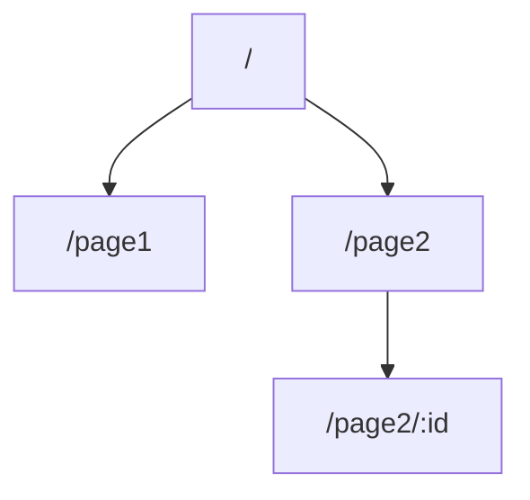

# Architecture Template — architecture.md

The architecture.md holds all shared technical context that feature files may reference. Feature files **copy relevant data models inline** — don't point agents back to architecture.md.

## Template

The architecture.md follows this structure:

### Header

```
# Architecture: {Product Name}
```

### High-Level Architecture

{Mermaid diagram or concise description}

### Tech Stack

| Layer | Technology | Rationale |
|-------|-----------|-----------|
| {e.g. Frontend / Backend / Database / Infrastructure} | {e.g. React + TypeScript / Go / PostgreSQL / AWS} | {why this choice} |

### Frontend Stack

{Omit if the product has no user-facing interface.}

| Concern | Choice | Version | Rationale |
|---------|--------|---------|-----------|
| UI Framework | {e.g. React} | {e.g. 19.x} | {why} |
| CSS Approach | {e.g. Tailwind CSS} | {e.g. 4.x} | {why} |
| Component Library | {e.g. Shadcn/ui} | {e.g. latest} | {why} |
| State Management | {e.g. Zustand} | {e.g. 5.x} | {why} |
| Build Tool | {e.g. Vite} | {e.g. 6.x} | {why} |
| Form Management | {e.g. React Hook Form} | {e.g. 7.x} | {why} |
| i18n | {e.g. react-i18next} | {e.g. 15.x} | {why} |
| E2E Testing | {e.g. Playwright} | {e.g. 1.x} | {why} |

### Design Token System

{Omit if the product has no user-facing interface. AI agents consume this section to generate consistent visual code.}

#### Colors

| Token | Value | Usage |
|-------|-------|-------|
| color.primary.50 | {lightest shade} | Lightest primary background |
| color.primary.500 | {mid shade} | Default primary |
| color.primary.900 | {darkest shade} | Darkest primary text |
| color.secondary.50–900 | {shades} | Secondary palette |
| color.neutral.50–950 | {shades} | Neutral palette |
| color.semantic.success | {value} | Success states |
| color.semantic.warning | {value} | Warning states |
| color.semantic.error | {value} | Error states, destructive actions |
| color.semantic.info | {value} | Informational |
| color.bg.default | {value} | Page background |
| color.bg.subtle | {value} | Card, section background |
| color.bg.muted | {value} | Disabled, inactive background |
| color.fg.default | {value} | Primary text |
| color.fg.muted | {value} | Secondary text |
| color.border.default | {value} | Default borders |

#### Typography

| Token | Value |
|-------|-------|
| font.family.sans | {e.g. Inter, system-ui, -apple-system, sans-serif} |
| font.family.mono | {e.g. JetBrains Mono, Fira Code, monospace} |
| font.size.xs | 0.75rem (12px) |
| font.size.sm | 0.875rem (14px) |
| font.size.base | 1rem (16px) |
| font.size.lg | 1.125rem (18px) |
| font.size.xl | 1.25rem (20px) |
| font.size.2xl | 1.5rem (24px) |
| font.size.3xl | 1.875rem (30px) |
| font.size.4xl | 2.25rem (36px) |
| font.lineHeight.tight | 1.25 |
| font.lineHeight.normal | 1.5 |
| font.lineHeight.relaxed | 1.75 |
| font.weight.normal | 400 |
| font.weight.medium | 500 |
| font.weight.semibold | 600 |
| font.weight.bold | 700 |

#### Spacing

| Token | Value | Usage |
|-------|-------|-------|
| spacing.0 | 0px | — |
| spacing.1 | 4px | Tight internal padding |
| spacing.2 | 8px | Default internal padding |
| spacing.3 | 12px | — |
| spacing.4 | 16px | Default gap, section padding |
| spacing.6 | 24px | Section margin |
| spacing.8 | 32px | Large section gap |
| spacing.12 | 48px | Page-level spacing |
| spacing.16 | 64px | Major section separation |

#### Border, Shadow, Radius

| Token | Value |
|-------|-------|
| radius.none | 0px |
| radius.sm | 2px |
| radius.md | 6px |
| radius.lg | 8px |
| radius.xl | 12px |
| radius.full | 9999px |
| shadow.sm | 0 1px 2px 0 rgb(0 0 0 / 0.05) |
| shadow.md | 0 4px 6px -1px rgb(0 0 0 / 0.1) |
| shadow.lg | 0 10px 15px -3px rgb(0 0 0 / 0.1) |

#### Breakpoints

| Token | Value | Target |
|-------|-------|--------|
| breakpoint.sm | 640px | Mobile landscape |
| breakpoint.md | 768px | Tablet |
| breakpoint.lg | 1024px | Desktop |
| breakpoint.xl | 1280px | Wide desktop |
| breakpoint.2xl | 1536px | Ultra-wide |

#### Motion

| Token | Value | Usage |
|-------|-------|-------|
| motion.duration.fast | 150ms | Hover, toggle, micro-feedback |
| motion.duration.normal | 300ms | Panel open/close, page transition |
| motion.duration.slow | 500ms | Complex entrance animation |
| motion.easing.default | cubic-bezier(0.4, 0, 0.2, 1) | General purpose |
| motion.easing.in | cubic-bezier(0.4, 0, 1, 1) | Exit animations |
| motion.easing.out | cubic-bezier(0, 0, 0.2, 1) | Entrance animations |
| motion.easing.inOut | cubic-bezier(0.4, 0, 0.2, 1) | Symmetric transitions |

#### Z-Index

| Token | Value | Usage |
|-------|-------|-------|
| z.base | 0 | Default content |
| z.dropdown | 10 | Dropdown menus |
| z.sticky | 20 | Sticky headers |
| z.overlay | 30 | Overlays, backdrops |
| z.modal | 40 | Modal dialogs |
| z.popover | 50 | Popovers, tooltips |
| z.toast | 60 | Toast notifications |

{Values above are defaults — replace with project-specific values during PRD Phase 3. If using an established component library, extract its token values as the baseline.}

### Navigation Architecture

{Omit if the product has no user-facing interface or has only a single view.}

#### Site Map

{Mermaid diagram showing page hierarchy derived from journey Screen/View names.}



{Replace with actual product structure.}

#### Navigation Layers

| Layer | Type | Content | Behavior |
|-------|------|---------|----------|
| Global | {sidebar / top nav / bottom tab} | {nav items} | {always visible / collapses on mobile} |
| Section | {tabs / sub-nav / breadcrumb} | {context-dependent items} | {appears within specific views} |
| Contextual | {inline links / action menus} | {in-content navigation} | {embedded in page content} |

#### Route Definitions

| View (from journeys) | Route Pattern | Params | Query Params | Auth | Layout |
|----------------------|--------------|--------|-------------|------|--------|
| {view name} | {/path/:param} | {param: type} | {?key=default} | {required / public} | {main / minimal / none} |

#### Deep Linking & State Restoration

| View | Shareable URL | State in URL | Restoration Behavior |
|------|-------------|-------------|---------------------|
| {view name} | Yes / No | {what state is encoded in URL} | {how state is restored on direct access} |

#### Breadcrumb Strategy

{auto-generated from route hierarchy / manual per-view / none}

### Accessibility Baseline

{Omit if the product has no user-facing interface.}

| Aspect | Requirement |
|--------|------------|
| WCAG Level | {2.1 AA / 2.1 AAA} |
| Keyboard Navigation | All interactive elements reachable via Tab; logical tab order; no keyboard traps |
| Screen Reader | All images have alt text; form fields have associated labels; dynamic content uses ARIA live regions |
| Focus Indicators | Visible focus ring on all interactive elements; minimum 3:1 contrast ratio for focus indicator |
| Color Contrast | Text: minimum 4.5:1 (normal) / 3:1 (large); UI components: minimum 3:1 against background |
| Motion | Respect `prefers-reduced-motion`; no auto-playing animations longer than 5 seconds |
| Touch Targets | Minimum 44x44px for touch interfaces |
| Error Identification | Errors identified by more than color alone (icon + text) |

{Individual features may add requirements beyond this baseline in their Accessibility sub-section.}

### Internationalization Baseline

{Omit if the product is single-language only and explicitly confirmed as such.}

| Aspect | Requirement |
|--------|------------|
| Supported Languages | {e.g. en, zh-CN, ja} |
| Default Language | {e.g. en} |
| RTL Support | {required / not required} |
| Text Externalization | All user-visible strings use i18n keys; no hardcoded text in components |
| Key Convention | {e.g. `{feature}.{section}.{element}` — e.g. `dashboard.header.title`} |
| Date/Time Format | {locale-aware via Intl.DateTimeFormat / date-fns with locale} |
| Number Format | {locale-aware via Intl.NumberFormat} |
| Pluralization | {ICU MessageFormat / library-specific} |
| Content Direction | {LTR-only / bidirectional — use CSS logical properties if bidirectional} |

### External Dependencies

| Service | Purpose | API Style | Timeout | Failure Mode | Fallback |
|---------|---------|-----------|---------|-------------|----------|
| {name} | {what it does for us} | REST / gRPC / SDK | {ms} | {what happens when down} | {degraded behavior or retry strategy} |

### Shared Conventions

These conventions ensure consistency across all features. Coding agents should follow these when implementing any feature.

#### API Conventions

| Aspect | Convention |
|--------|-----------|
| Format | {e.g. JSON, content-type application/json} |
| Authentication | {e.g. Bearer JWT in Authorization header} |
| Pagination | {e.g. cursor-based with `?cursor=` and `next_cursor` in response} |
| Versioning | {e.g. URL prefix /v1/, header-based, or none} |
| Rate limiting | {e.g. 100 req/min per user, 429 response} |

#### Error Handling

| Aspect | Convention |
|--------|-----------|
| Error response format | {e.g. RFC 7807 Problem Details: `{ "type", "title", "status", "detail", "instance" }`} |
| Error codes | {e.g. application-specific codes like `AUTH_EXPIRED`, `RESOURCE_NOT_FOUND`} |
| Client errors (4xx) | {e.g. return specific error code + human-readable message, do not retry} |
| Server errors (5xx) | {e.g. return generic message + request_id, log full stack trace at ERROR level} |
| Validation errors | {e.g. 422 with field-level errors array: `[{ "field", "message" }]`} |

#### Testing Strategy

| Layer | Framework | Scope | Coverage Target |
|-------|-----------|-------|----------------|
| Unit | {e.g. Jest / pytest / Go testing} | {pure logic, utilities, models} | {e.g. 80%} |
| Integration | {e.g. Supertest / Testcontainers} | {API endpoints, DB queries, external service calls} | {e.g. critical paths} |
| E2E | {e.g. Playwright / Cypress} | {user journeys, cross-feature flows} | {e.g. happy paths + key error paths} |

### Authorization Model

{Omit for single-role products or products with no access control.}

**Roles:**

| Role | Description | Persona |
|------|-------------|---------|
| {e.g. Admin} | {what this role can do} | {which persona, if mapped} |
| {e.g. Member} | {what this role can do} | {which persona} |

**Permission Matrix:**

| Feature | {Role 1} | {Role 2} | {Role 3} |
|---------|----------|----------|----------|
| F-001 {name} | Full | Read-only | No access |
| F-002 {name} | Full | Full | No access |

**Data Visibility:** {e.g. "Users see only their own data; Admins see org-wide data; Super-admins see cross-org data"}

### Privacy & Compliance

{Omit for internal tools with no personal data or regulatory requirements.}

| Aspect | Requirement |
|--------|------------|
| Regulations | {e.g. GDPR, CCPA, HIPAA, SOC 2 — or "None identified"} |
| Personal data entities | {which data model entities contain PII — e.g. User, PaymentMethod} |
| User rights | {e.g. export, deletion, correction — required by regulation or product policy} |
| Data retention | {e.g. "User data retained 2 years after account deletion; logs retained 90 days"} |
| Consent | {e.g. "Explicit opt-in for analytics tracking; implied consent for core functionality"} |

### Data Model

**{EntityName}**

| Field | Type | Constraints | Description |
|-------|------|-------------|-------------|
| ... | ... | ... | ... |

**Relationships**
- {EntityA} 1:N {EntityB} — {why}

### Deployment Architecture

| Environment | Infrastructure | URL / Access | Notes |
|-------------|---------------|-------------|-------|
| Development | {local / Docker / cloud} | {URL or N/A} | {hot reload, seed data, etc.} |
| Staging | {infra description} | {URL} | {mirrors prod, data policy} |
| Production | {infra description} | {URL} | {scaling, regions} |

**CI/CD:** {pipeline tool + trigger rules, e.g. "GitHub Actions: PR → test → staging auto-deploy; tag → prod deploy"}
**Containerization:** {Docker / K8s / serverless — if applicable}

### Observability

| Concern | Tool / Approach | Standard |
|---------|----------------|----------|
| Logging | {library + destination, e.g. structured JSON → CloudWatch} | {log level policy, what to log} |
| Metrics | {collection method, e.g. Prometheus + Grafana} | {key metrics to expose} |
| Tracing | {distributed tracing tool, e.g. OpenTelemetry} | {when to create spans} |
| Alerting | {alerting tool + channel} | {alert conditions, escalation} |

### Non-functional Requirements

| ID | Category | Requirement |
|----|----------|------------|
| NFR-001 | Performance | {p95 latency, throughput targets} |
| NFR-002 | Security | {auth method, data protection} |
| NFR-003 | Scalability | {concurrent users, growth rate} |
| NFR-004 | Reliability | {SLA, backup strategy} |
| NFR-005 | Internationalization | {supported languages, RTL support — omit if single-language} |

### Glossary

| Term | Definition |
|------|-----------|
| ... | ... |

## Key Rules

- architecture.md holds all **shared technical context** that feature files may reference
- Feature files **copy relevant data models inline** — don't point agents back to architecture.md
- No section should exist if it has nothing useful to say — omit empty sections
- Frontend Stack, Design Token System, Navigation Architecture, Accessibility Baseline, and Internationalization Baseline are **omitted** for products with no user-facing interface
- Design Token values are defaults — replace during PRD Phase 3 (Frontend Foundation). If using an established component library, extract its token values as baseline
- Feature files reference design tokens by **semantic name** (e.g. `color.primary.500`), never by raw values
