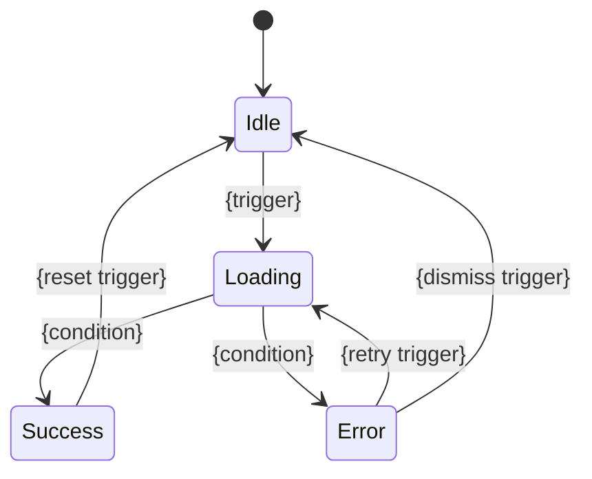

# Feature Spec Template

Each file is **self-contained** — a coding agent implements the feature by reading only this file.

## Template

The feature file follows this structure. Omit any section that has no useful content.

### Header

```
# F-{001}: {Feature Name}

> **Priority:** P0 | P1 | P2  **Effort:** S | M | L | XL
```

### Context

**Product:** {one sentence}
**Relevant architecture:** {only parts this feature touches, 3-5 lines}
**Relevant data models:** {copy entity definitions this feature reads/writes}
**Relevant conventions:** copy applicable convention text from `architecture/` topic files — specifically `coding-conventions.md` (error handling, logging, concurrency policies relevant to this feature), `test-isolation.md` (resource isolation, parallel safety rules relevant to this feature's tests), `security.md` (input validation, secret handling relevant to this feature), and `shared-conventions.md` (API format, error structure). Copy the actual policy text inline — do not reference the files by path. The goal: a coding agent reads only this feature file and has all conventions needed to implement correctly. Also include when applicable: Code Review Policy (review dimensions applicable to this feature), Performance Testing (budgets applicable to this feature), Backward Compatibility (API versioning, schema evolution relevant to this feature's API contracts or data models), Observability Requirements (mandatory logging events, health checks, metrics relevant to this feature), AI Agent Configuration (instruction file references, maintenance triggers relevant to this feature). Omit conventions this feature doesn't touch (e.g. no API conventions for a pure background-job feature; no concurrency policy for a stateless utility; no backward compatibility for internal-only features with no API)
**Permission:** {which roles can access this feature and at what level — e.g. "Admin: full, Member: read-only, Viewer: no access". Copy from architecture.md Authorization Model. Omit for single-role products or features with no access restrictions}

### User Stories

- As a {persona}, I want to {action}, so that {outcome}.
- As a {persona}, I want to {action}, so that {outcome}.

### Journey Context

- **Journey:** [J-{NNN}: {journey name}](../journeys/J-{NNN}-{slug}.md) — Touchpoints #{touchpoint numbers} — Pain points: {which pain points resolved}
- **Journey:** [J-{NNN}: {journey name}](../journeys/J-{NNN}-{slug}.md) — Touchpoints #{touchpoint numbers} — Pain points: {which pain points resolved}

### Requirements

1. {precise, unambiguous requirement}
2. ...

### Acceptance Criteria

Behavioral (Given/When/Then):
- Given {precondition}, when {action}, then {result}
- Given {precondition}, when {edge case}, then {result}

{If this feature has Dependencies (depends-on), include at least one cross-feature integration criterion (Dependencies are listed in the Dependencies section below -- during initial writing, fill this integration criterion after completing the Dependencies section, or leave a `[TODO: add integration criterion for F-{dep}]` placeholder and backfill in Step 4 cross-linking):}
- Given {upstream feature} has {completed its action / produced its output}, when {this feature consumes it}, then {end-to-end observable result}

Non-behavioral (consider each dimension — include those that apply, omit the rest):
- **Performance:** {e.g. "Response time must be < 200ms at p95 for N concurrent users"}
- **Resource limits:** {e.g. "Memory usage must stay < 512MB for datasets up to 10k records"}
- **Concurrency:** {e.g. "Must handle 3 simultaneous agents writing to the same store without data loss"}
- **Security / permissions:** {e.g. "Viewer role receives 403 when attempting write operations"}
- **Degradation:** {e.g. "Must function with GitHub API unavailable, using cached data"}

### API Contract

{Only if this feature exposes or consumes APIs. Omit for pure UI or background-job features.}

**`{METHOD} {/path}`**

Request:
```json
{
  "field": "type — description"
}
```

Response (success — {status code}):
```json
{
  "field": "type — description"
}
```

Response (error — {status code}):
```json
{
  "error response per Shared Conventions error format"
}
```

{Repeat for each endpoint this feature introduces.}

### Interaction Design

{Required for user-facing features (web UI, mobile, desktop, CLI with TUI). Omit only for backend-only features (background jobs, pure API, CLI without TUI, infrastructure).}

#### Screen & Layout

**Screen/View:** {which screen(s) this feature appears on — must match Screen/View names from journey touchpoints}
**Route:** {**Web**: URL pattern from architecture.md Navigation Architecture — must match Route Definitions table. **TUI**: command/screen identifier from architecture.md Command Structure, or omit if screen is implicit}
**Layout:** {describe the visual structure using design token references — e.g. "two-column layout, sidebar width spacing.64, main content area with spacing.6 padding, cards with radius.lg and shadow.md"}

#### Component Contracts

{For each non-trivial UI component in this feature, define the interface that AI agents code against. Simple leaf components (a button, a label) don't need full contracts — only components with meaningful props, events, or composition points.}

**{ComponentName}**

| Prop | Type | Required | Default | Description |
|------|------|----------|---------|-------------|
| {name} | {type} | Y/N | {value} | {what it controls} |

| Event | Payload | Description |
|-------|---------|-------------|
| {name} | {type} | {when emitted and by what user action} |

| Slot/Children | Purpose | Default Content |
|---------------|---------|-----------------|
| {name} | {what goes here} | {fallback if empty} |

{Repeat for each component.}

#### Interaction State Machine

{For each component with non-trivial state transitions. Use Mermaid stateDiagram.}



| From | Event | To | System Feedback | Side Effects |
|------|-------|----|-----------------|-------------|
| {state} | {user action or system event} | {state} | {what the user sees — e.g. spinner, toast, banner} | {API calls, cache invalidation, analytics events} |

**Rules:**
- Every state must have at least one exit (no dead states)
- Every transition must specify system feedback (what the user sees)
- Loading states must have both success AND error exits

#### Form Specification

{Only for features with forms. Omit otherwise.}

| Field | Type | Label (i18n key) | Validation | Error Message (i18n key) | Depends On | Conditional |
|-------|------|-------------------|------------|--------------------------|------------|-------------|
| {name} | text / email / select / checkbox / ... | {feature}.{field}.label | {e.g. required, minLength(3), maxLength(100)} | {feature}.{field}.error.{rule} | {other field name, or —} | {shown when {field} = {value}, or —} |

**Submission behavior:**
- Validation timing: {on blur / on submit / on change after first submit}
- Submit button state: {disabled until valid / always enabled, validate on click}
- Success action: {redirect to {route} / show success state / close modal}
- Error action: {show inline errors / show error banner / show toast}

#### Micro-Interactions & Motion

{Key animations and transitions that provide user feedback. Omit for features with no meaningful motion.}

| Trigger | Element | Animation | Duration Token | Easing Token | Purpose |
|---------|---------|-----------|---------------|-------------|---------|
| {e.g. page enter} | {e.g. main content} | {e.g. fade in + slide up 8px} | motion.duration.normal | motion.easing.out | {e.g. smooth entry} |

#### Accessibility

**WCAG Level:** {2.1 AA / 2.1 AAA — or "baseline per architecture.md"}

**Keyboard Navigation:**

| Action | Key | Behavior |
|--------|-----|----------|
| {e.g. navigate list} | {e.g. Arrow Up/Down} | {e.g. moves focus between items} |
| {e.g. submit form} | {e.g. Enter} | {e.g. submits if focused on form} |
| {e.g. close modal} | {e.g. Escape} | {e.g. closes modal, returns focus to trigger} |

**ARIA:**

| Element | Role | Label/Description | Live Region |
|---------|------|-------------------|-------------|
| {e.g. search results} | {e.g. region} | {e.g. aria-label="{i18n key}"} | {e.g. polite — announces count changes} |
| {e.g. error message} | {e.g. alert} | — | {e.g. assertive} |

**Focus Management:**
- After modal open: focus moves to {first focusable element / close button}
- After modal close: focus returns to {trigger element}
- After form submit success: focus moves to {success message / next logical element}
- After inline error: focus moves to {first invalid field}

#### Internationalization (Frontend)

{For user-facing features. Omit for backend-only features.}

**Supported Languages:** {from architecture.md — e.g. en, zh-CN, ja}
**RTL Support:** {yes / no}
**Text Keys:** (prefix: `{feature-slug}.`)

| Key | Default (en) | Context |
|-----|-------------|---------|
| {feature}.title | {text} | {page/section title} |
| {feature}.submit_button | {text} | {CTA button} |
| {feature}.error.required | {text} | {validation error} |

**Format Rules:**

| Data Type | Format | Library/Method |
|-----------|--------|---------------|
| Date | {e.g. locale-aware, relative for < 7 days} | {e.g. date-fns/format with locale} |
| Number | {e.g. locale-aware thousand separator} | {e.g. Intl.NumberFormat} |
| Currency | {e.g. symbol + locale formatting} | {e.g. Intl.NumberFormat with currency} |
| Pluralization | {e.g. ICU MessageFormat} | {per i18n library} |

#### Internationalization (Backend)

{For backend features that return user-visible text (API errors, validation messages, notifications, emails). Omit for single-language backends or features with no locale-dependent output.}

**Locale Resolution:** {from architecture.md — e.g. Accept-Language header → user preference → default}

**Locale-Dependent Messages:**

| Message / Response | Localized? | How Locale Is Determined | Notes |
|--------------------|-----------|------------------------|-------|
| {e.g. API validation errors} | {yes / no — error codes only} | {e.g. Accept-Language header} | {e.g. client formats from code} |
| {e.g. email notification body} | {yes / no} | {e.g. recipient user preference} | {e.g. template per locale} |

**Timezone Handling:** {from architecture.md — e.g. store UTC, convert per user timezone on API output}

#### Responsive Behavior

**Web** — {Reference breakpoint tokens from architecture.md Design Token System.}

| Breakpoint | Layout Change | Component Change |
|------------|--------------|-----------------|
| < sm (mobile) | {e.g. single column, full-width cards} | {e.g. hamburger menu replaces sidebar} |
| sm – md (tablet) | {e.g. two-column, collapsible sidebar} | {e.g. sidebar as overlay} |
| >= lg (desktop) | {e.g. three-column, fixed sidebar} | {e.g. full sidebar visible} |

**TUI** — {Reference terminal size tokens from architecture.md Design Token System. Replace the web breakpoint table above with:}

| Terminal Width | Layout Change | Component Change |
|---------------|--------------|-----------------|
| < {breakpoint.sidebar.collapse} | {e.g. sidebar hidden, content full-width} | {e.g. Ctrl+B toggles sidebar} |
| >= {breakpoint.sidebar.collapse} | {e.g. sidebar visible at fixed width} | {e.g. sidebar always shown} |

#### Prototype Reference

{Populated after prototype validation completes. Omit during initial feature writing. Must be filled for every user-facing feature after prototype validation.}

- **Prototype path:** `../prototypes/src/{feature-slug}/`
- **Screenshots:** `../prototypes/screenshots/{feature-slug}/` {browser screenshots for web; teatest `.golden` files or terminal screenshots for TUI}
- **Confirmed:** {YYYY-MM-DD}

### State Flow

{Business entity state flow — for features where domain objects have lifecycle states (e.g. orders, approvals, subscriptions). Distinct from the Interaction State Machine above, which tracks UI component states. Omit for stateless CRUD.}

```mermaid
stateDiagram-v2
    [*] --> {State1}
    {State1} --> {State2}: {event}
    {State2} --> {State3}: {event}
    {State3} --> [*]
```

| From | Event | To | Side Effects |
|------|-------|----|-------------|
| {state} | {trigger} | {state} | {what else happens: notifications, data changes, etc.} |

### Edge Cases

{Use the same Given/When/Then format as Acceptance Criteria — every edge case must be testable as an automated test.}

- Given {precondition / unusual state}, when {trigger}, then {observable, assertable result}
- Given {precondition / boundary value}, when {action}, then {observable result}

{If this feature has a Permission line in Context, include at least one unauthorized access edge case:}
- Given {unauthorized role, e.g. "a user with Viewer role"}, when {attempting a restricted action}, then {rejection behavior, e.g. "returns 403 and no data is modified"}

### Test Data Requirements

{Minimum dataset and preconditions needed to verify this feature. Omit for features with trivial or no test data needs.}

| Aspect | Specification |
|--------|---------------|
| Fixtures / seed data | {e.g. "a PRD directory with README.md + 3 feature files with cross-dependencies"} |
| Boundary values | {e.g. "0 tasks, 1 task, 100+ tasks for DAG construction"} |
| Preconditions | {e.g. "a git repo with at least one worktree already created by F-004"} |
| External service stubs | {e.g. "mock gh CLI returning 5 issues; mock Claude API returning structured JSON"} |

### Dependencies

- Depends on: [F-{XXX}](./F-{XXX}-{slug}.md) — {reason}
- Blocks: [F-{YYY}](./F-{YYY}-{slug}.md) — {reason}

### Analytics & Tracking

| Event | Trigger | Payload | Purpose |
|-------|---------|---------|---------|
| {event_name} | {user action that fires it} | {key data fields} | {which Goal metric this feeds} |

### Notifications

{Only if this feature triggers notifications to users. Omit if no notifications.}

| Event | Channel | Recipient | Content Summary | User Control |
|-------|---------|-----------|----------------|-------------|
| {e.g. task failed} | {email / push / in-app / SMS} | {e.g. task owner} | {what the notification communicates} | {e.g. can disable in settings} |

### Risks & Mitigations

{Copy relevant risks from README.md that affect this feature — only if applicable, omit otherwise}

| Risk | Mitigation in this feature |
|------|---------------------------|
| {risk from README} | {how this feature's implementation addresses it} |

### Implementation Notes

- **Approach:** {strategy}
- **Key files:** {paths to modify (existing codebase) or suggested file structure (new project)}
- **Testing:** {what to test}
- **Pitfalls:** {what to avoid}

## Rules

- **Context = minimal but sufficient**: only architecture/models this feature touches. Copy inline, never say "see architecture.md".
- **Omit empty sections**: no API Contract for pure UI features, no Interaction Design for backend-only features (background jobs, pure API, infrastructure). **All user-facing features must include Interaction Design.** No frontend i18n for backend-only features; no backend i18n for pure UI features or single-language backends.
- **Precise language**: "must", "returns", "rejects" — not "should consider", "might want to".
- **Testable criteria**: every acceptance criterion and edge case maps to an automated test. Edge cases use Given/When/Then, same as acceptance criteria.
