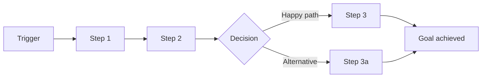

# Journey Template — journeys/ directory

The journeys/ directory documents all key user journeys. It bridges personas (README.md) and features (features/*.md) — every feature should trace back to a journey touchpoint, and every journey pain point should have feature coverage.

## Directory Structure

```
journeys/
├── J-001-{slug}.md        # Individual journey spec
├── J-002-{slug}.md
└── ...
```

The Journey Index lives in the top-level README.md (see `prd-template.md`), not in a separate file — consistent with how Feature Index works.

## Individual Journey File Template (J-{NNN}-{slug}.md)

Each journey file follows this structure. Omit any section that has no useful content.

### Header

```markdown
# J-{001}: {Journey Name}

**Persona:** {who}
**Trigger:** {what event or need initiates this journey}
**Goal:** {what the user is trying to accomplish}
**Frequency:** {how often this journey occurs — daily / weekly / on-demand / one-time}
```

### Journey Flow



### Touchpoints

| # | Stage | User Action | System Response | Screen/View | Interaction Mode | Emotion | Pain Point | Mapped Feature |
|---|-------|-------------|-----------------|-------------|------------------|---------|------------|----------------|
| 1 | {stage name} | {what the user does} | {what the system does} | {screen or view the user is on — e.g. "Dashboard", "Settings > Profile", "CLI prompt". Use consistent names across journeys} | {primary interaction pattern: click / form / drag / swipe / long-press / keyboard / scroll / hover / voice / scan} | {positive/neutral/negative} | {frustration or friction, if any} | [F-{XXX}](../features/F-{XXX}-{slug}.md) |

**Mapped Feature** is backfilled during PRD Step 4 (cross-linking) after features are derived from touchpoints. During initial journey writing (Phase 2), leave this column blank or mark as `—`. Do not block journey completion on feature mapping.

**Stages** are logical phases of the journey, such as:
- **Discovery** — user becomes aware of the product/feature
- **Onboarding** — first-time setup, learning
- **Core Task** — primary value delivery
- **Completion** — task done, confirmation, next steps
- **Return** — coming back, picking up where left off
- **Recovery** — handling errors, failures, edge cases

### Alternative Paths

| Condition | Diverges at | Path | Rejoins at |
|-----------|-------------|------|------------|
| {when this happens} | Step {#} | {what happens instead} | Step {#} or {dead end} |

### Page Transitions

{How the user moves between screens during this journey. Omit for single-screen journeys.}

| From (Step #) | To (Step #) | Transition Type | Data Prefetch | Notes |
|---------------|-------------|-----------------|---------------|-------|
| {e.g. #1 Dashboard} | {e.g. #2 Task Detail} | {navigate (push) / navigate (replace) / modal / drawer / back} | {e.g. task data via API / cached / none} | {e.g. show skeleton during fetch, restore scroll position} |

### Error & Recovery Paths

| Error Scenario | Occurs at | User Sees | Recovery Action | Mapped Feature |
|---------------|-----------|-----------|-----------------|----------------|
| {what goes wrong} | Step {#} | {error message / state} | {how user recovers} | [F-{XXX}](../features/F-{XXX}-{slug}.md) |

### E2E Test Scenarios

{Translate the journey flow into executable end-to-end test specifications. Each scenario covers a full path (happy, alternative, or error) through the journey, crossing feature boundaries. Omit for single-touchpoint journeys.}

| Scenario | Path | Steps (touchpoints) | Features Exercised | Expected Outcome |
|----------|------|---------------------|--------------------|------------------|
| {e.g. "Happy path: PRD to execution"} | Happy | #1 → #2 → #3 → #4 | F-001, F-003, F-005 | {observable end state, e.g. "all tasks reach done status, worktrees cleaned up"} |
| {e.g. "Error: agent failure mid-run"} | Error & Recovery | #1 → #2 → Error at #3 → Recovery #4 | F-003, F-009, F-010 | {e.g. "failed task retried, quality gate re-run, execution resumes"} |
| {e.g. "Alternative: user edits tasks before execution"} | Alternative | #1 → #2a → #3 → #4 | F-001, F-006 | {e.g. "modified task list used for scheduling"} |

### Journey Metrics

| Metric | Target | Baseline | Measurement | Verification |
|--------|--------|----------|-------------|--------------|
| Completion rate | {%} | {current or N/A} | {how to measure} | {manual acceptance / automated E2E / monitoring — and pass/fail criteria} |
| Time to complete | {duration} | {current or N/A} | {how to measure} | {manual acceptance / automated E2E / monitoring — and pass/fail criteria} |
| Drop-off point | {step #} | {current or N/A} | {how to measure} | {manual acceptance / automated E2E / monitoring — and pass/fail criteria} |

## Typical Journeys to Consider

Not all products need all of these. Use this as a checklist to avoid blind spots:

- **First-time use / Onboarding** — the user's very first experience
- **Core task (happy path)** — the primary value delivery, everything goes right
- **Core task (unhappy path)** — the primary task but things go wrong (bad input, network failure, permission denied)
- **Return visit** — user comes back after time away, needs to re-orient
- **Power user** — advanced/bulk operations, shortcuts, integrations
- **Admin / Management** — configuration, user management, settings
- **Upgrade / Migration** — moving from old system or free tier to paid

## Key Rules

- **Every feature must map to at least one journey touchpoint** — orphan features indicate either a missing journey or an unnecessary feature
- **Every pain point should have feature coverage** — unaddressed pain points are scope gaps
- **Journeys describe the user's experience, not the system's behavior** — write from the user's perspective
- **Include emotional states** — they drive UX decisions and priority
- **Alternative and error paths are not optional** — most bugs and UX failures live here
- **Copy relevant journey context into feature files** — don't force coding agents to read journey files
- **Screen/View names must be consistent across journeys** — the same screen referenced in different journeys must use the same name. This column builds a de-facto screen inventory for the product
- **Interaction Mode captures the primary interaction pattern** at each touchpoint — this informs the feature's Interaction Design section (component contracts, state machines, accessibility keyboard requirements)
- **Page Transitions describe cross-screen navigation** during the journey — this informs architecture.md's Navigation Architecture and feature-level routing
- **E2E Test Scenarios are required for multi-touchpoint journeys** — translate each path (happy, alternative, error) into a cross-feature test specification. Omit only for single-touchpoint journeys
- **Every Error & Recovery Path must trace to a testable criterion** — either an Edge Case or Acceptance Criterion in a Feature file
