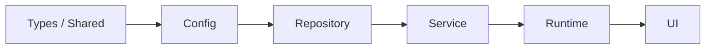
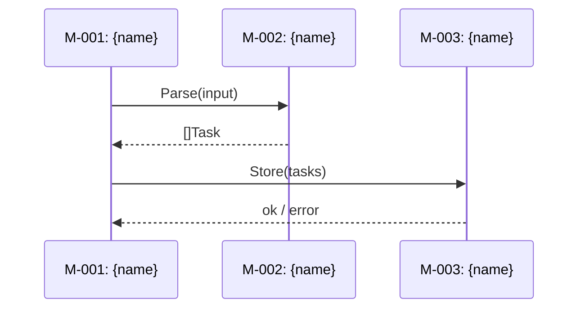

# Design Template — README.md

The README.md is the navigational entry point for the design directory. Omit any section that has no useful content.

## Directory Structure

```
{output-dir}/
├── README.md              # Design overview + module index + mapping matrix
├── modules/
│   ├── M-001-{slug}.md    # Self-contained module design
│   └── ...
├── api/                   # Only when project has APIs
│   ├── API-001-{slug}.md  # Self-contained API contract
│   └── ...
```

## Template

The README.md follows this structure:

### Header

```
# System Design: {Product Name}

> {One-sentence design objective}
```

### Design Input

- **Source:** [{PRD name}]({path to PRD README.md}) | {document name} | Interactive
- **Date:** YYYY-MM-DD
- **Status:** Draft | Finalized | Implementing | Implemented

### Architecture Overview

{Mermaid diagram — more detailed than PRD, showing module interfaces and data flow}

### Dependency Layering

{Forward-only dependency order between module layers. Modules may only depend on modules in the same layer or layers to their left. This constraint prevents circular dependencies and enables parallel agent work on modules in different layers.}



{The diagram above is an example — replace with the actual layer order for this project. Each layer is a group of modules with the same architectural role.}

| Layer | Modules | May Depend On |
|-------|---------|---------------|
| {e.g. Types} | M-001, M-005 | — (no dependencies) |
| {e.g. Repository} | M-002 | Types |
| {e.g. Service} | M-003, M-004 | Types, Repository |
| {e.g. UI} | M-006 | Types, Service |

**Rule:** cross-layer dependencies must follow the left-to-right order. Any reverse dependency (e.g. Repository → Service) is a design violation that must be resolved by extracting a shared interface into a lower layer.

### Key Technical Decisions

| Decision | Options | Conclusion | Rationale |
|----------|---------|------------|-----------|
| {e.g. state management} | A: in-memory / B: SQLite / C: JSON files | C | {why} |

### Module Index

| ID | Module | Type | Responsibility | Complexity | Deps | Impl | Spec |
|----|--------|------|---------------|------------|------|------|------|
| M-001 | {name} | backend | {one sentence} | M | — | — | [spec](modules/M-001-{slug}.md) |
| M-002 | {name} | frontend | {one sentence} | S | M-001 | — | [spec](modules/M-002-{slug}.md) |

Type: `backend` | `frontend` | `shared` — helps identify which modules have UI responsibilities
Impl: `—` (not started) | `In progress` | `Done` — tracks per-module implementation status; updated by coding agents or users when implementation begins/completes

### NFR Allocation

{Shows how PRD-level non-functional requirements are decomposed across modules. Helps identify hot-spot modules (carrying multiple critical NFRs) and gaps (NFRs not allocated to any module).}

| NFR Source | Category | PRD Target | Primary Module | Budget | Supporting Modules |
|------------|----------|------------|---------------|--------|-------------------|
| {e.g. NFR-001} | Performance | P99 < 500ms (task creation) | M-002 (< 300ms) | 60% | M-001 (< 100ms), M-003 (< 100ms) |
| {e.g. NFR-002} | Security | All user input sanitized | M-001 | — | M-003 (secondary validation) |

### Test Strategy

{Project-level testing approach derived from Step 3 Testing Deep-Dive. Provides the global context for per-module Testing sections.}

**Test pyramid:** {e.g. unit-heavy 70/20/10 — rationale from project characteristics}

**Toolchain:**

| Test Type | Framework | Runner |
|-----------|-----------|--------|
| Unit | {e.g. Jest / pytest / go test} | {e.g. CI parallel, local watch mode} |
| Integration | {e.g. Supertest / testcontainers} | {e.g. CI with service dependencies} |
| E2E | {e.g. Playwright / Cypress} | {e.g. CI against staging, nightly} |
| Contract | {e.g. Pact / custom shared fixtures} | {e.g. CI on interface changes} |

**Test data management:** {e.g. factories with sensible defaults; each test owns its data; transaction rollback for DB isolation}

**NFR verification:**

| NFR Category | Verification Method | Tool | Trigger |
|-------------|-------------------|------|---------|
| Performance | {e.g. load test with k6} | {tool} | {e.g. pre-release, nightly} |
| Security | {e.g. dependency scan + SAST} | {tool} | {e.g. every CI run} |

**CI execution order:** {e.g. lint → unit → integration → E2E; fail-fast at each stage}

### Feature-Module Mapping

| | M-001 {name} | M-002 {name} | M-003 {name} |
|-------|:-:|:-:|:-:|
| F-001 {name} | ✦ | ✦ | |
| F-002 {name} | | ✦ | △ |
| F-003 {name} | △ | | ✦ |

✦ = requires modification  △ = read-only dependency

### Module Interaction Protocols

{Critical cross-module interactions. Each entry describes one key data flow path across module boundaries. This section is the global view of how modules work together — individual module files describe only their own side of the interface.}

| Interaction | Caller → Callee | Method | Data Format | Error Strategy | Contract Test |
|-------------|----------------|--------|-------------|----------------|---------------|
| {e.g. Task ingestion} | M-001 → M-002 | sync function call | `[]Task` | caller retries 3x, then fails with `ErrIngestFailed` | {e.g. shared fixture: valid/invalid Task payloads; both sides test against same fixtures} |
| {e.g. Status notification} | M-003 → M-001 | async event / message queue | `StatusEvent` JSON | dead-letter queue after 5 failures | {e.g. schema validation: producer and consumer validate against shared JSON schema} |

{For complex interactions, include a sequence diagram:}



### View / Screen Index

{Maps PRD journey touchpoints' Screen/View names to the frontend modules that implement them. Omit if the project has no user-facing interface (pure API, CLI-only with no TUI, background service).}

| View | Description | Primary Module | Source Features | Source Journeys |
|------|-------------|---------------|-----------------|-----------------|
| {e.g. Dashboard} | {one sentence — what the user sees and does here} | M-002 | F-001, F-003 | J-001 #3, J-002 #5 |
| {e.g. Settings > Profile} | {one sentence} | M-004 | F-007 | J-001 #7 |

**Notes:**
- View names must match the Screen/View column in PRD journey touchpoints exactly
- If a view is shared across multiple journeys, list all journey references
- For complex views, note the major sections/areas and which feature controls each

### Prototype-to-Production Mapping

{Maps PRD prototype components to production module destinations. Omit if PRD has no prototypes.}

| Prototype Component | Source Path (PRD) | Target Module | Action | Gap Description |
|--------------------|--------------------|---------------|--------|-----------------|
| {e.g. TaskList} | {prototypes/src/components/TaskList.tsx} | M-{NNN} | {Reuse / Refactor / Rewrite} | {what needs to change for production — omit for Reuse} |

**Action legend:**
- **Reuse** — prototype code is production-ready; copy to module with minimal changes (e.g. add route guard, swap mock data for real API)
- **Refactor** — structure is correct but implementation needs improvement (describe specifically in Gap)
- **Rewrite** — prototype served validation purposes only; implement from PRD feature spec

### Design System Conventions

{Shared UI implementation patterns. References PRD's Design Token System for visual values. Omit if no user-facing interface.}

**Design Token Source:** [{PRD name} architecture.md]({path to PRD architecture.md}#design-token-system)

**Token Implementation:**

| Token Category | Implementation | File/Config |
|---------------|---------------|-------------|
| Colors | {e.g. CSS custom properties via Tailwind theme} | {e.g. tailwind.config.ts theme.extend.colors} |
| Typography | {e.g. Tailwind font classes} | {e.g. tailwind.config.ts theme.extend.fontSize} |
| Spacing | {e.g. Tailwind spacing scale (default matches PRD tokens)} | {e.g. no config needed / custom config} |
| Motion | {e.g. CSS transitions referencing custom properties} | {e.g. globals.css :root variables} |

**Component patterns:**
- **Loading states:** {e.g. skeleton components; duration from motion.duration tokens}
- **Error states:** {e.g. inline ErrorBanner with retry; uses color.semantic.error token}
- **Empty states:** {e.g. centered illustration + CTA; reusable EmptyState component}
- **Toast notifications:** {e.g. Sonner library, positioned top-right, auto-dismiss after 5s}
- **Modal dialogs:** {e.g. Shadcn Dialog, focus-trapped, Escape to close}
- **Form patterns:** {e.g. React Hook Form with Zod schema; inline error display per PRD form specs}

**Responsive implementation:**
- **Approach:** {e.g. mobile-first with Tailwind breakpoint prefixes}
- **Sidebar behavior:** {e.g. Sheet component on mobile (< md), fixed sidebar on desktop}
- **Grid system:** {e.g. CSS Grid with Tailwind grid classes; 12-column on desktop, single-column on mobile}

**Dark mode / theming:** {e.g. CSS class-based with next-themes / not supported}

### API Index

| ID | API | Direction | Spec |
|----|-----|-----------|------|
| API-001 | {name} | {internal/external} | [spec](api/API-001-{slug}.md) |

### Analytics Coverage

{Maps PRD feature analytics events to the modules responsible for emitting them. This section does not design the analytics implementation — it ensures the planning phase knows where analytics code must be added. Omit if no features define Analytics & Tracking events.}

| Feature | Event | Trigger | Responsible Module |
|---------|-------|---------|-------------------|
| [F-001: {name}]({path to PRD feature file}) | {event_name} | {user action} | M-001 |
| [F-002: {name}]({path to PRD feature file}) | {event_name} | {user action} | M-002 |

### References

- [PRD]({path to PRD README.md})
- [User Journeys]({path to PRD journeys/})
- [Architecture & Glossary]({path to PRD architecture.md})

### Revision History

{Populated by `--revise` mode. Omit on initial creation.}

| Version | Date | Change Type | Previous Version | Summary of Changes |
|---------|------|-------------|-----------------|-------------------|
| {this directory name or "in-place"} | {YYYY-MM-DD} | {New version / In-place edit} | [{previous directory name}]({relative path}) or N/A | {what changed and why} |

## Key Rules

- README.md is **navigational only** — no module implementation details
- `Key Technical Decisions` records important choices and rationale, preventing redundant discussion
- `NFR Allocation` is the global view of how PRD-level NFRs decompose across modules — identifies hot-spot modules and coverage gaps
- `Feature-Module Mapping` is the core input for the planning phase (writing-plans)
- `Test Strategy` captures project-level testing approach — pyramid allocation, toolchain, test data management, NFR verification methods, and CI execution order. Per-module Testing sections derive from this global strategy. Omit if the project has no testable code (pure documentation, config-only)
- `Module Interaction Protocols` captures cross-module contracts that no single module file owns — the global view of how modules work together. The `Contract Test` column specifies how each interaction is verified (shared fixtures, schema validation, integration tests)
- `View / Screen Index` maps PRD journey screens to frontend modules — ensures every user-facing view has clear module ownership. Omit if the project has no user-facing interface
- `Design System Conventions` captures shared UI **implementation** patterns — references PRD's Design Token System for visual values and specifies how tokens map to code. Omit if no user-facing interface
- `Prototype-to-Production Mapping` connects PRD prototypes to production modules — each prototype component gets an Action (Reuse / Refactor / Rewrite) and a Gap Description. Omit if PRD has no prototypes
- `Dependency Layering` defines the forward-only dependency order — modules depend only on same-layer or leftward layers; reverse dependencies are design violations that must be resolved before implementation
- `Analytics Coverage` bridges PRD feature analytics to module ownership — ensures the planning phase doesn't lose track of analytics implementation. Omit if no features define analytics events
- API Index only appears when the project has APIs — omit if not applicable
- No section should exist if it has nothing useful to say — omit empty sections
