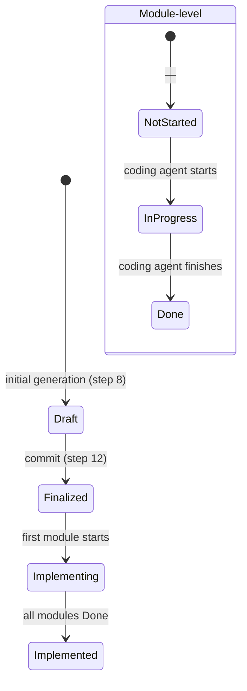

# Generate Mode — Phase 1 Design Generation

This file covers the default generation flow: PRD-based, document-based, interactive, and incremental modes. For `--review`, see `review-mode.md`. For `--revise`, see `revise-mode.md`.

## Phase 1 Steps

1. **Parse input & confirm scope** — read PRD directory (README.md + journeys/*.md + architecture.md + features/*.md), parse existing design draft/notes file, or gather info interactively. Extract and note: journey flows (end-to-end data paths), cross-journey patterns (shared pain points, repeated touchpoints, handoff points, shared infrastructure needs — from README.md's Cross-Journey Patterns section), external dependencies (services, timeouts, failure modes), deployment architecture, observability requirements, shared conventions, testing conventions (frameworks, coverage targets, test infrastructure), authorization model (roles, permission matrix), privacy & compliance requirements (personal data entities, user rights, retention), notification requirements (from feature Notifications sections), NFRs (with IDs), risks, glossary, feature analytics events, and developer convention policies (coding conventions, test isolation, development workflow, security coding policy, backward compatibility, git & branch strategy, code review policy, observability requirements policy, performance testing, AI agent configuration (instruction files, structure policy, convention references, maintenance policy)). Summarize understanding back to user, confirm scope before proceeding. **If the project has an existing codebase** (source files, package manifests, or architecture docs present), **enter Incremental Design Mode** (see below) to assess current architecture before continuing.
2. **Module decomposition** — propose module breakdown based on architecture, features, and cross-journey patterns (shared infrastructure needs like search, notification, progress tracking suggest shared/common modules), present to user for confirmation
3. **Interactive refinement** (one question at a time, prefer multiple choice). Cover these topics in order, skip any that are already clear from the input:
   - **Architecture:** key technical choices, infrastructure decisions, dependency layering (forward-only layer order for modules — see Architecture Refinement deep-dive), ambiguities with multiple implementation paths → present options
   - **Modules:** boundary definition, responsibility split, interface protocols between modules
   - **UI / Frontend implementation architecture:** (skip if no user-facing interface) prototype assessment, view-to-module mapping, routing implementation, state management implementation, form strategy, frontend performance budget, design token implementation, component structure, frontend-backend data flow (see Frontend Implementation Architecture deep-dive below)
   - **Backend i18n implementation:** (skip if single-language backend) locale resolution middleware placement, message catalog structure, error/notification localization mechanism, timezone conversion approach (see Backend i18n Implementation deep-dive below)
   - **Data flow:** cross-module interactions, state management, error propagation
   - **NFR decomposition:** take PRD-level NFRs and decompose to module-level constraints — which modules bear the performance/security/scalability load?
   - **Testing:** test pyramid allocation, module test isolation strategy, external dependency test approach, test data management (see Testing Deep-Dive below)
4. **Key technical decisions** — summarize decisions made during interaction, user confirms
5. **Feature-Module mapping** — generate mapping matrix, user confirms
6. **Generate module designs** — generate each module spec, show summary per module
7. **Generate API contracts** — only if the project has APIs. Design API contracts are the refined, authoritative version of PRD feature-level API contracts — they add parameter types, error codes, examples, and constraints. If a PRD feature's API Contract conflicts with the design API contract, the design version takes precedence
8. **Generate README.md** — aggregate index with all sections
9. **Write files** — write all generated files to disk (not yet committed)
10. **Self-review** — read each written file against the Design Review checklist (see `design-review-checklist.md`), fix issues directly in files using the Self-Review Flow defined there
11. **User review** — user reviews files in their editor, confirms or requests changes
12. **Commit** — set `Design Input > Status` to `Finalized`

## Design Status Lifecycle

The design tracks status at two levels: **design-level** (`Design Input > Status` in README.md) and **module-level** (`Impl` column in Module Index).

**Module-level status** (Module Index `Impl` column):

| Impl | Meaning | Set When |
|------|---------|----------|
| — | Not started | Initial generation |
| In progress | Module is being coded | Coding agent starts implementing this module |
| Done | Module implementation complete | Coding agent finishes this module |

**Design-level status** (derived from module-level):

| Status | Meaning | Derived From |
|--------|---------|-------------|
| Draft | Design in progress, not yet committed | Initial generation (steps 1-11) |
| Finalized | Design committed, ready for implementation | Step 12 (commit); all modules still `—` |
| Implementing | Implementation has started | At least one module is `In progress` or `Done`, but not all `Done` |
| Implemented | All modules implemented | All modules are `Done` |

**Maintenance rules:**
- Set `Draft` on initial file generation (step 8)
- Set `Finalized` on commit (step 12)
- Module `Impl` column is updated by coding agents or users when they start/finish implementing a module
- When any module's `Impl` changes, update design-level `Status` accordingly (Finalized → Implementing on first module start; Implementing → Implemented when all Done)
- `prd-analysis --revise` reads design-level `Status` to decide: `Finalized` → PRD can be modified in place with change record; `Implementing` or `Implemented` → PRD must create a new version
- `system-design --revise` reads module-level `Impl` to decide per-module mutability (see `revise-mode.md` Step 1)

## Step Completion Conditions (interactive steps only)

- **Step 1 → 2:** Scope confirmed, input fully parsed, user agrees with understanding summary
- **Step 2 → 3:** Module breakdown proposed and confirmed — each module has a name, type (backend/frontend/shared), one-sentence responsibility, and rough complexity estimate
- **Step 3 → 4:** All architecture ambiguities resolved (no "TBD"), dependency layering defined and confirmed, module boundaries validated, critical data flows traced, NFR budget allocated to modules, frontend implementation architecture decided (if applicable — including prototype assessment, routing, state management, form implementation strategy, performance budget, design token implementation, component structure sketch, frontend-backend data flow mapping, a11y implementation strategy, i18n implementation strategy, Design System Conventions approach), backend i18n implementation decided (if multi-locale backend — locale resolution middleware, message catalog, timezone conversion), test strategy decided (pyramid allocation, isolation approach, external dependency test method), developer convention policies translated to stack-specific implementation patterns (coding conventions mapped to language idioms, test isolation mapped to framework config, security policies mapped to tools, CI gates mapped to pipeline config)
- **Step 4 → 5:** Key technical decisions summarized in table form, user confirms all choices
- **Step 5 → 6:** Feature-Module mapping complete, no orphan features, user confirms
- **Step 6 → 7:** All module specs generated; each module has interface definition, responsibility, data model (if applicable), Testing section (if applicable — skip for trivial S-complexity modules with no dependencies), and Boundary Enforcement section (if the project has linting/CI infrastructure — skip for trivial S-complexity modules); frontend modules have UI Architecture section complete (component tree, routing, state management, key interactions, performance, a11y implementation, i18n implementation); frontend modules with forms use consistent form patterns per Design System Conventions; backend modules that return locale-dependent text have Backend i18n Implementation section (locale resolution, message catalog, timezone conversion)
- **Step 7 → 8:** All API contracts generated (if applicable); endpoint definitions match module interfaces; all endpoints include error codes, Authentication & Permissions, and Constraints sections; Test Scenarios included for non-trivial APIs

## Module Complexity Guide

| Level | Criteria | Example |
|-------|----------|---------|
| **S** | Single responsibility, < 5 public interfaces, no external dependencies, straightforward CRUD or pass-through | Config loader, simple validator |
| **M** | 2-3 internal components, 5-10 public interfaces, 1-2 module dependencies, some business logic | REST API handler with validation |
| **L** | Complex algorithms or state management, > 10 interfaces, 3+ dependencies, requires careful error handling | Workflow engine, query optimizer |
| **XL** | Should be challenged — consider splitting. Only acceptable if splitting would force artificial seams | Full auth system (tokens + RBAC + SSO) |

## Step 3 Deep-Dive: Architecture Refinement

**Start from PRD:** If the PRD's architecture.md already specifies deployment architecture, observability, tech stack decisions, or developer convention policies (coding conventions, test isolation, security coding policy, development workflow, git & branch strategy, code review policy, observability requirements, performance testing, backward compatibility), use those as the baseline — only ask about gaps or ambiguities, don't re-ask what's already decided.

For each ambiguous technical choice, evaluate along these dimensions:

1. **Technology selection** — for each choice point (database, message queue, framework, etc.):
   - **Maturity:** production-proven vs. bleeding-edge? Known failure modes?
   - **Team familiarity:** team has experience, or learning curve required?
   - **Ecosystem:** library support, community, tooling, observability integrations?
   - **Performance characteristics:** latency profile, throughput ceiling, resource cost?
   - Present as multiple-choice with trade-off summary for each option
2. **Infrastructure decisions** (inherit from PRD deployment architecture if present):
   - Deployment model (monolith / modular monolith / microservices / serverless)?
   - State management strategy (stateless services + external store / in-process state / hybrid)?
   - Communication patterns (sync REST/gRPC / async events / CQRS)?
3. **External dependency mapping** — using PRD's External Dependencies table, determine which module owns each external service integration. For each: which module calls it, how does the module handle the documented failure mode and fallback?
4. **Dependency layering** — define a forward-only layer order for modules (e.g. Types → Config → Repository → Service → Runtime → UI). Each layer is a group of modules with the same architectural role. Modules may only depend on modules in the same layer or layers to their left. Present the proposed layering as a table (layer → modules → allowed dependencies) and confirm with user. This layering populates the README's Dependency Layering section and constrains the Module Index Deps column.

## Step 3 Deep-Dive: Module Refinement

Apply these rules to judge whether modules should be split or merged:

- **Split when:** a module has more than 2 distinct responsibilities; its interface surface is > 10 public functions; or it owns data models that serve unrelated use cases
- **Merge when:** two modules always change together; one module's only caller is the other; or splitting forces data duplication without benefit
- **Litmus test:** can you describe the module's responsibility in 2-3 sentences? If not, it's too big. Does the module have a reason to exist independently? If not, merge it.
- **Boundary validation:** for each proposed boundary, ask — "if two different developers implement these two modules with only the interface spec, will it work?" If the answer requires implicit knowledge, the interface is underspecified.

## Step 3 Deep-Dive: Data Flow Refinement

For each critical data path (derived from PRD journey flows — use journey files (journeys/*.md) touchpoints as the source of end-to-end user flows, and cross-journey patterns as the source of shared data paths that span multiple journeys, then map to module boundaries):

1. **Trace the path** — which modules does data touch, in what order?
2. **Sync vs. async** — must the caller wait for a result, or can it fire-and-forget?
3. **Consistency requirements** — does this path need strong consistency (transaction), eventual consistency (events), or is best-effort acceptable?
4. **Error propagation** — when module B fails mid-flow, what does module A see? Does it retry, compensate, or fail fast?
5. **Volume & latency** — expected throughput on this path? Latency budget?

## Step 3 Deep-Dive: NFR Decomposition

For each PRD-level NFR, decompose to module-level budgets:

1. **Identify the hot path** — which modules are on the critical path for this NFR?
2. **Allocate budget** — e.g., "PRD says P99 < 500ms for task creation — ingestion gets 100ms, validation gets 100ms, storage gets 300ms"
3. **Identify the bottleneck owner** — which module has the tightest constraint? That module's design gets extra scrutiny.
4. **Security NFRs** — which modules handle untrusted input? Those modules must define input validation and sanitization strategies.
5. **Scalability NFRs** — which modules are stateful? Those are scaling bottlenecks — design for statelessness or explicit sharding.

## Step 3 Deep-Dive: Frontend Implementation Architecture

Skip this section entirely if the project has no user-facing interface (pure API, background service). For projects with a UI (web, mobile, desktop, TUI):

1. **Prototype assessment** — read the PRD's `prototypes/src/` directory (if it exists). Prototypes are **production-seed code**, not throwaway mockups — treat them as the starting point for implementation. Prototypes may be web (React/Vue/etc.) or TUI (bubbletea/Ink/etc.) — assess both the same way. For each prototype component:
   - **Classify:** Can it be used directly (Reuse)? Needs improvement (Refactor)? Must be rewritten (Rewrite)? TUI prototypes in compiled languages like Go are often closer to production-ready
   - **For Reuse/Refactor — extract reuse details:** list specific files to copy, patterns to preserve (state machines, styling approach, component structure), and adaptations needed (mock data → real API, placeholder → real integration)
   - Record classification in README's Prototype-to-Production Mapping table
   - Record per-file reuse details in each target module's **UI Architecture > Prototype Reuse Guide** subsection (see module-template.md UI Architecture section) — this is what coding agents read to know which files to copy and how to adapt them
   - Review `prototypes/screenshots/` (browser screenshots or teatest golden files) to verify state coverage
2. **View inventory & module mapping** — collect all Screen/View names from PRD journey touchpoints. Use the **Screen / View** column from each journey's Touchpoints table (defined in journey-template.md) as the source for the View / Screen Index. The Touchpoint table format is: `| # | Stage | Screen / View | Action | Interaction Mode | System Response | Pain Point | Mapped Feature |`. Each unique view becomes an entry in the README's View / Screen Index. For each view, determine which frontend module owns it. Ask user to confirm.
3. **Routing implementation** — based on PRD's Navigation Architecture:
   - Route configuration approach (file-based routing / config-based / framework convention)
   - Route guards / middleware (auth checks, data prefetching)
   - Code splitting strategy (per-route lazy loading, shared chunks)
   - Error boundaries per route
4. **State management implementation** — based on PRD's chosen approach (from architecture.md Frontend Stack):
   - Store structure (flat vs. nested, normalized vs. denormalized)
   - Async state patterns (loading/error/success wrappers, optimistic updates)
   - State persistence (URL params, localStorage, session)
   - Server state vs. client state separation (e.g. React Query/SWR for server state)
5. **Form implementation strategy** — based on PRD's Form Specifications in features:
   - Form library configuration
   - Validation execution (client-side schema, server-side validation, hybrid)
   - Error display pattern (inline, summary, toast)
   - Multi-step form state management (if applicable)
6. **Frontend performance budget** — based on PRD NFRs plus frontend-specific metrics:
   - Core Web Vitals targets (LCP, INP, CLS)
   - Bundle size budget (total, per-route)
   - Image optimization strategy (formats, lazy loading, CDN)
   - Caching strategy (service worker, HTTP cache, state cache)
7. **Design token implementation** — how PRD's design tokens map to code:
   - CSS custom properties / Tailwind config / theme object
   - Dark mode / theme switching mechanism (if applicable)
   - Token-to-code generation pipeline (if using a tool like Style Dictionary)
8. **Component structure** — for each frontend module, sketch the component tree: top-level layout → sections → leaf components. Enough detail for a coding agent to create the file structure.
9. **Frontend-backend data flow** — for each view, trace which API endpoints or backend modules supply data. Identify: what data is fetched on load, what mutations trigger API calls, what state is purely local.

**Rules:**
- Frontend modules follow the same module-template.md, with the added UI Architecture section
- Module Index in README must include a Type column (`backend` | `frontend` | `shared`)
- **PRD owns the interaction design (what + behavior); system-design owns the implementation architecture (how)**
- **Boundary clarification:** PRD owns design token *definitions* (names, values, semantic meaning). System-design owns the *implementation mechanism* — how tokens are delivered to code (CSS custom properties, Tailwind config, Go constants, etc.). System-design does NOT redefine token values or add new tokens.
- Do NOT redefine design tokens, component contracts, state machines, a11y requirements, or i18n requirements — these are authoritative in the PRD. System-design references them and specifies how to implement them

## Step 3 Deep-Dive: Backend i18n Implementation

Skip if the PRD's Internationalization Baseline has no Backend sub-section (single-language backend). Otherwise, design how to implement the PRD's backend i18n requirements:

1. **Locale resolution middleware** — where in the request pipeline is the user's locale determined? Which module owns this logic? How does it flow to downstream modules (context parameter, thread-local, request header)?
2. **Message catalog structure** — how are localized messages stored and loaded? (embedded files, external JSON/YAML per locale, database-backed, third-party service). Which module owns the catalog? How do other modules access it?
3. **Error & validation message localization** — how do modules produce locale-aware error messages? (error codes + client-side formatting, server-side message lookup, hybrid). What's the interface — `Localize(code string, locale string) string` or similar?
4. **Notification content localization** — how are email/push/SMS templates localized? (template-per-locale files, template engine with locale parameter, external service). Which module owns template rendering?
5. **Timezone conversion** — which module converts stored UTC timestamps to user-local time? At the API serialization layer, or deeper? What format is used in API responses?

Record decisions in README's Key Technical Decisions table (backend i18n rows). Per-module details go in each module's Backend i18n Implementation section.

**Rules:**
- **PRD owns the i18n requirements (what); system-design owns the implementation architecture (how)** — do NOT redefine supported languages, locale resolution strategy, or which messages are localized. Reference the PRD and specify the implementation mechanism
- Backend i18n decisions feed into the same Key Technical Decisions table as other architecture choices

## Step 3 Deep-Dive: Testing

Establish the project-level test strategy that will be recorded in README's Test Strategy section and decomposed into per-module Testing sections. **Start from PRD:** if the PRD's architecture.md already specifies testing conventions (frameworks, coverage targets), use those as the baseline.

1. **Test pyramid allocation** — decide the ratio of unit : integration : E2E tests for this project:
   - **Unit-heavy** (e.g. 70/20/10): projects with complex business logic, algorithms, or data transformations — most value comes from fast, isolated tests
   - **Integration-heavy** (e.g. 30/50/20): projects with many module interactions, database-heavy operations, or external service integrations — boundary correctness is the main risk
   - **E2E-heavy** (e.g. 20/30/50): projects where user-facing workflows are the primary risk — forms, multi-step processes, UI state management
   - Present as multiple-choice with rationale for each option based on the project's characteristics
2. **Module test isolation strategy** — for each module, determine how it can be tested independently:
   - Which dependencies need to be replaced with test doubles (mocks, stubs, fakes)?
   - Which modules should use real dependencies (e.g. in-memory database instead of mock)?
   - **Litmus test:** can each module's tests run without starting any other module? If not, the module boundary or interface needs redesign.
3. **External dependency test approach** — for each external dependency from the PRD's External Dependencies table:
   - **Real service** (sandboxed): when the service provides a test/sandbox environment
   - **Contract test**: verify the external interface contract without calling the real service — capture expected request/response shapes and validate locally
   - **Fake/stub**: in-process replacement that mimics behavior (e.g. in-memory database, fake HTTP server)
   - **Record/replay**: capture real responses, replay in tests — good for stable third-party APIs
   - Present decision per dependency, not as a blanket policy
4. **Test data management** — decide how test data is created, isolated, and cleaned up:
   - **Factories/builders**: programmatic test data creation with sensible defaults
   - **Fixtures**: static test data files for stable reference data
   - **Seeding**: database seed scripts for integration test environments
   - **Isolation strategy**: each test gets fresh data (transaction rollback, test containers, unique prefixes) vs. shared test database with cleanup
5. **NFR verification methods** — for each NFR category that requires runtime verification:
   - **Performance**: tool (e.g. k6, Artillery, Benchmark.js), load model (concurrent users, request rate), environment requirements
   - **Security**: approach (SAST in CI, dependency scanning, input fuzzing), tools, scope per module
   - **Reliability**: chaos/fault injection approach, failure scenario coverage
   - Skip NFR categories where static analysis or code review is sufficient (no runtime test needed)
6. **CI test execution** — how tests run in the continuous integration pipeline:
   - **Stage ordering**: unit → integration → E2E (fail-fast: stop on first stage failure?)
   - **Parallelization**: which test suites can run in parallel?
   - **Environment requirements**: which stages need external services (database, message queue)?
   - Skip if the project has no CI pipeline or if CI is already fully specified in PRD architecture.md

## Step 3 Deep-Dive: Developer Convention Translation

For each PRD convention policy section, translate technology-agnostic policies into stack-specific implementation patterns for the chosen tech stack. This is the core contract between PRD and system-design.

1. **Coding Conventions** — translate code organization, naming, interface design, dependency wiring, error handling, logging, config access, and concurrency policies into concrete language/framework idioms (e.g. PRD "errors must include context" → Go `fmt.Errorf("doing X: %w", err)` or TypeScript `new AppError("doing X", { cause })`)
2. **Test Isolation** — translate resource isolation, port binding, file system, race detection, timeout policies into framework-specific test configuration and helper patterns (e.g. PRD "use random ports" → Go `net.Listen("tcp", ":0")` or Jest `getPort()`)
3. **Security Coding Policy** — translate input validation, injection prevention, secret handling, auth enforcement into concrete middleware/library choices (e.g. PRD "validate at boundaries" → Go `validate` struct tags at handler layer or Express `express-validator` middleware)
4. **Development Workflow** — translate CI gates, prerequisites, release process into concrete pipeline configuration (e.g. PRD "race detection in CI" → `go test -race ./...` in GitHub Actions)
5. **Git & Branch Strategy** — confirm PRD's git policies apply to the chosen stack, add stack-specific hooks if needed (e.g. pre-commit hooks for linting)
6. **Code Review Policy** — translate review dimensions into concrete automated checks (e.g. PRD "security review" → CodeQL/gosec in CI, PRD "convention compliance" → golangci-lint rules)
7. **Observability Requirements** — translate mandatory events, health checks, metrics into concrete logging library config, health endpoint design, metrics export format (e.g. PRD "structured logging" → Go `slog` with JSON handler)
8. **Performance Testing** — translate budgets and regression detection into concrete benchmark harness and CI gate configuration (e.g. PRD "p95 < 200ms" → Go benchmark with `benchstat` comparison in CI)
9. **Backward Compatibility** — translate API versioning and schema evolution into concrete version negotiation and migration patterns
10. **AI Agent Configuration** — translate instruction file policies into concrete file decisions: which files to generate (CLAUDE.md, AGENTS.md), content structure following the PRD's structure policy (concise index with references), what conventions to reference from generated config files, maintenance triggers mapped to CI/git hooks
11. **Deployment Architecture** — translate deployment policies into concrete tooling decisions: local dev environment setup (e.g. Docker Compose, devcontainer, Nix flake), CD pipeline implementation (e.g. GitHub Actions deploy workflow, ArgoCD config), container/infrastructure definitions (e.g. Dockerfile, K8s manifests, Terraform modules), environment isolation approach (e.g. Docker network per agent, database schema prefix), configuration management (e.g. dotenv files, Vault integration), data migration tool choice (e.g. golang-migrate, Flyway, Alembic)

Record translated patterns in README's Implementation Conventions section.

## Interactive Mode (no PRD or document input)

When no PRD or document is provided, gather context interactively:

**Question sequence:**
1. "What does your product do?" (1-2 sentences)
2. "What tech stack are you using or planning?" (language, framework, database)
3. "Who are the users and what are the main workflows?" (personas + key flows)
4. "List the 3-5 most important features." (one sentence each)
5. "Any external services or APIs to integrate with?"
6. "Any non-functional requirements? (performance targets, security, compliance)"

**Depth guidance:** Each feature description should be specific enough to derive module boundaries — "user authentication" is too vague; "email/password login with JWT sessions and OAuth2 Google sign-in" is sufficient.

Also gather:
- Shared conventions (API format, error handling, testing strategy) and developer convention policies (coding conventions, test isolation, security policies, development workflow, git strategy, code review, observability, performance testing, backward compatibility, AI agent configuration (instruction files, structure policy)) — needed as data source for README's Implementation Conventions and module specs' Relevant Conventions sections

**Entry condition for Step 2:** Problem is clearly articulated, tech stack decided, at least 3 features identified with enough specificity to determine module boundaries, and key NFRs noted (or explicitly marked as none).

## Document-Based Mode

When input is an existing design draft or notes file (not a PRD directory):

Read document → summarize understanding → check gaps against checklist below → ask targeted questions → generate

**Gap checklist for design documents** — scan for missing or vague coverage:

- [ ] Module boundaries clearly defined with distinct responsibilities?
- [ ] Interface definitions with parameter types, return types, error types?
- [ ] Data models with field types, constraints, and ownership?
- [ ] Cross-module interaction patterns (sync/async, error propagation)?
- [ ] Non-functional requirements with concrete, measurable targets?
- [ ] Dependency direction explicit and acyclic?
- [ ] Key technical decisions documented with rationale?
- [ ] Feature-to-module traceability present?
- [ ] Dependency layering defined? Forward-only layer order with modules assigned to layers?
- [ ] UI/frontend implementation architecture covered (if user-facing)? Views mapped, component structure defined, routing and state management implementation specified?
- [ ] Prototype-to-Production mapping present (if PRD has prototypes)?
- [ ] Frontend performance budgets defined (Core Web Vitals, bundle size)?
- [ ] Routing implementation strategy specified (guards, code splitting, error boundaries)?
- [ ] State management implementation detailed (store structure, async patterns, persistence)?
- [ ] Design token implementation approach defined (CSS vars, Tailwind config, theme object)?
- [ ] Accessibility and i18n implementation strategies specified for frontend modules?
- [ ] Backend i18n implementation specified (locale resolution middleware, message catalog, timezone conversion) for multi-locale backends?
- [ ] Form implementation strategy defined (library, validation approach, error display, multi-step pattern)?
- [ ] Frontend-backend data flow traced for each view (load fetches, mutations, local-only state)?
- [ ] Design System Conventions complete (responsive approach, dark mode/theming, component patterns)?
- [ ] Analytics events mapped to responsible modules (if PRD defines analytics events)?
- [ ] API contracts include error codes, Authentication & Permissions, and Constraints?
- [ ] Test strategy defined? Test pyramid allocation, module isolation approach, external dependency test method, test data management?
- [ ] Developer convention policies present (coding conventions, test isolation, security, development workflow, git strategy, code review, observability, performance testing, backward compatibility)?
- [ ] AI agent configuration defined (instruction files, structure policy, convention references, maintenance policy)?
- [ ] Convention policies translated to stack-specific implementation patterns (not left as technology-agnostic policies)?

## Incremental Design Mode

When the project already has an existing codebase (detected by presence of source code files, package manifests, or existing architecture docs):

**Module classification:**
- **New module** — no existing code corresponds to this module's responsibilities. Design from scratch using the standard module template.
- **Modified module** — existing code partially covers this module's scope. The module spec must include a **Change Scope** section documenting: current state (what exists), proposed changes (what to add/modify/remove), and migration path (how to get from current to proposed without breaking existing functionality).
- **Wrapper module** — existing code is wrapped by a new interface. Preserve existing behavior; add interface layer only.

1. **Assess existing architecture** — read key files (entry points, package structure, existing docs) to understand the current system structure
2. **Identify change scope** — based on the PRD/requirements, determine which parts of the existing architecture are affected:
   - New modules to add
   - Existing modules to modify (document current state → proposed state)
   - Existing interfaces that must remain stable (backward compatibility constraints)
3. **Delta-focused design** — module specs should clearly distinguish:
   - **Existing:** current behavior that must be preserved
   - **Modified:** what changes and why
   - **New:** entirely new components
4. **Integration risk assessment** — for each modification to an existing module, identify:
   - What existing callers/dependents are affected?
   - What tests need to be updated? Are existing test isolation strategies (mocks, fakes) and contract tests impacted by the interface change?
   - Is the change backward-compatible or does it require a migration?

**Existing tests:** If existing tests cover functionality being modified, the module spec's Testing section must specify: which existing tests remain valid, which need updating (and why), and which new tests are needed. Do not assume a clean slate.

**Backward compatibility:** For modified modules, the design review checklist's "module can be tested in isolation" dimension also requires: existing consumers of modified interfaces must continue working during and after the transition. Document any breaking changes in the module's Implementation Constraints section.
