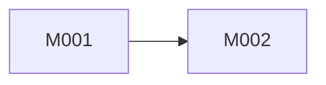
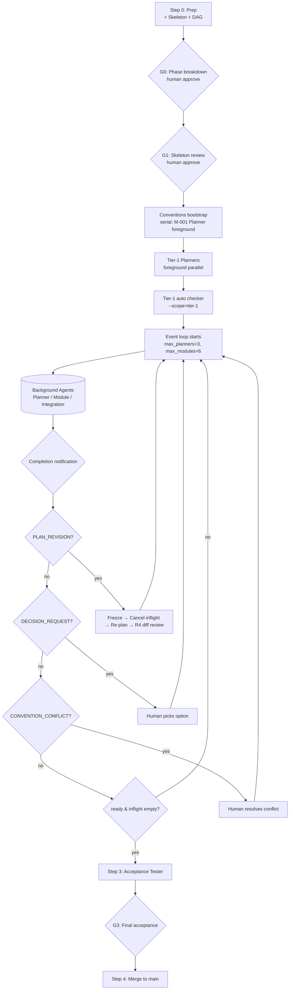

# Autoforge DAG Scheduling Implementation Plan

> **For agentic workers:** REQUIRED SUB-SKILL: Use superpowers:subagent-driven-development (recommended) or superpowers:executing-plans to implement this plan task-by-task. Steps use checkbox (`- [ ]`) syntax for tracking.

**Goal:** Replace autoforge's phase-based scheduler with an event-driven DAG scheduler, pipelining planning against execution and adding neighborhood-scope integration tests, per the design at `docs/superpowers/specs/2026-05-18-autoforge-dag-scheduling-design.md`.

**Architecture:** The autoforge skill is prose + shell scripts. The scheduler is **described** in `SKILL.md` (humans and the Claude orchestrator follow it), backed by shell helpers that the orchestrator invokes for state I/O and gate checks. Tests live under `skills/autoforge/tests/` as bash scripts that build temp fixtures, run the scripts, and assert on JSON/file output. TDD applies to scripts (red → green → commit); prose edits to `SKILL.md` and prompts use a deliberate before/after diff approach with checker validation.

**Tech Stack:** Bash 4+, Python 3.9+ (via `scripts/lib/autoforge_lint.py`), YAML for config, Markdown for prompts and templates. No new runtime dependencies.

**Worktree:** This plan should be executed in an isolated git worktree. The first task creates it.

**Scope note:** Single PR per user decision (all-at-once rewrite in a worktree). The plan is organized as 8 sequential milestones (M1–M8) for review clarity, but produces one PR at the end.

---

## File Structure

### New files

| Path | Purpose |
|------|---------|
| `skills/autoforge/scripts/run-state-init.sh` | Initialize `run-state.json` from a Module Index |
| `skills/autoforge/scripts/run-state-update.sh` | Apply a state transition: update JSON, regenerate `run-status.md` and mermaid, batch-commit |
| `skills/autoforge/scripts/check-scheduler-state.sh` | CR-AF33 — `run-state.json` ↔ `module-state-*.json` ↔ git log consistency |
| `skills/autoforge/scripts/check-idle-timeout.sh` | CR-AF32 — event loop idle while ready set non-empty |
| `skills/autoforge/scripts/lib/run_state.py` | Python helper module: read/write `run-state.json`, compute ready sets, scope filtering |
| `skills/autoforge/scripts/lib/run_status_render.py` | Render `run-status.md` + DAG mermaid from `run-state.json` |
| `skills/autoforge/tests/test-run-state-init.sh` | Tests for `run-state-init.sh` |
| `skills/autoforge/tests/test-run-state-update.sh` | Tests for `run-state-update.sh` (state transitions, batched commit) |
| `skills/autoforge/tests/test-check-scheduler-state.sh` | Tests for CR-AF33 detection |
| `skills/autoforge/tests/test-check-idle-timeout.sh` | Tests for CR-AF32 detection |
| `skills/autoforge/tests/test-scope-filter.sh` | Tests for `--scope=tier-N` and `--scope=module-M-id` in `run-checkers.sh` |
| `skills/autoforge/tests/test-ready-set.sh` | Tests for ready-set computation (planning + execution) |
| `skills/autoforge/tests/test-conventions-merge.sh` | Tests for rolling-merge logic (helper exposed in `run_state.py`) |
| `skills/autoforge/tests/fixtures/dag-3-modules/` | Smoke-test fixture: 3-module DAG |

### Modified files

| Path | Change summary |
|------|----------------|
| `skills/autoforge/SKILL.md` | Heavy rewrite of Step 0–4; add §1–§8 of spec; remove phase-barrier wording |
| `skills/autoforge/common/config.yml` | Add `scheduler` section: `max_planners`, `max_modules`, `idle_timeout_minutes`, batched-commit cadence |
| `skills/autoforge/planning/planner-prompt.md` | Add input params: `revision_trigger`, `cancelled_state_snapshot`, `merged_code_authority`, `conflicting_additions` |
| `skills/autoforge/integration/tester-prompt.md` | Rewrite scope: `target_module` + `closure_module_ids` (neighborhood) instead of phase-wide |
| `skills/autoforge/module/agent-prompt.md` | Add `needs_patch` resumption path; preserve worktree on cancel |
| `skills/autoforge/delivery-discipline.md` | Add `CONVENTION_CONFLICT` ISSUE_TYPE; remove phase-barrier wording |
| `skills/autoforge/scripts/run-checkers.sh` | Add `--scope=tier-N` and `--scope=module-M-id` orthogonal flag |
| `skills/autoforge/CHANGELOG.md` | Record breaking changes and migration note |
| `skills/autoforge/tests/run-all.sh` | No code change — new test scripts auto-discovered |

---

## Milestone M1 — Worktree, config, and `run-state.json` foundation

### Task 1: Create isolated worktree for this plan

**Files:**
- Worktree path: `../cofounder-worktrees/autoforge-dag-scheduling/`

- [ ] **Step 1: Create the worktree off `main`**

Run:
```bash
cd /Users/wangzw/workspace/cofounder
git fetch
git worktree add -b feat/autoforge-dag-scheduling ../cofounder-worktrees/autoforge-dag-scheduling main
```
Expected: new directory `../cofounder-worktrees/autoforge-dag-scheduling/` on branch `feat/autoforge-dag-scheduling`.

- [ ] **Step 2: Switch into the worktree and verify**

Run:
```bash
cd ../cofounder-worktrees/autoforge-dag-scheduling
pwd
git rev-parse --abbrev-ref HEAD
```
Expected: `pwd` prints the worktree path; branch prints `feat/autoforge-dag-scheduling`.

> **All subsequent tasks run from this worktree. The original `/Users/wangzw/workspace/cofounder` stays untouched.**

- [ ] **Step 3: No commit yet** — proceed to Task 2.

---

### Task 2: Extend `common/config.yml` with scheduler config

**Files:**
- Modify: `skills/autoforge/common/config.yml` (append at end)

- [ ] **Step 1: Append the `scheduler` block**

Edit `skills/autoforge/common/config.yml`, append after the existing `escalation:` block:

```yaml

# Event-driven DAG scheduler caps (replaces phase-barrier model).
# Bounds the number of concurrent background agents the orchestrator may
# have in flight. Tier-1 Module Agents are typically the bottleneck;
# raising max_modules above the typical DAG fan-out wastes the slot.
# Cost scales linearly with max_modules (Sonnet) and ~5x linearly with
# max_planners (Opus). Defaults chosen for a typical 20-30 module run.
scheduler:
  max_planners: 3
  max_modules: 6
  idle_timeout_minutes: 30
  # Batched-commit cadence for run-status.md updates: commit every K
  # transitions OR every T seconds, whichever comes first. Avoids commit
  # storms while keeping the on-disk log fresh enough for GitHub views.
  status_commit_every_k: 5
  status_commit_every_seconds: 60
```

- [ ] **Step 2: Verify YAML is parseable**

Run:
```bash
python3 -c "import yaml,sys; yaml.safe_load(open('skills/autoforge/common/config.yml'))"
```
Expected: exits 0, no output.

- [ ] **Step 3: Commit**

```bash
git add skills/autoforge/common/config.yml
git commit -m "feat(autoforge): add scheduler config for DAG event loop

Adds max_planners, max_modules, idle_timeout_minutes, and status-commit
cadence settings to common/config.yml. Backing config for the upcoming
event-driven scheduler. See design doc §1."
```

---

### Task 3: Write `run-state.json` schema doc + Python helper

**Files:**
- Create: `skills/autoforge/scripts/lib/run_state.py`
- Test: `skills/autoforge/tests/test-run-state-helper.sh`

The Python helper is the single source of truth for `run-state.json` schema and ready-set computation. Shell scripts (`run-state-init.sh`, `run-state-update.sh`, `check-scheduler-state.sh`) delegate to this module.

- [ ] **Step 1: Write the failing test**

Create `skills/autoforge/tests/test-run-state-helper.sh`:

```bash
#!/usr/bin/env bash
set -euo pipefail
DIR="$(cd "$(dirname "${BASH_SOURCE[0]}")" && pwd)"
# shellcheck source=lib/test_helpers.sh
source "$DIR/lib/test_helpers.sh"

LIB="$DIR/../scripts/lib"

start_test "create_initial_state builds modules dict from index"
out=$(python3 -c "
import sys; sys.path.insert(0, '$LIB')
from run_state import create_initial_state
modules = [
    {'id': 'M-001', 'deps': []},
    {'id': 'M-002', 'deps': ['M-001']},
    {'id': 'M-003', 'deps': ['M-001', 'M-002']},
]
s = create_initial_state(modules)
assert s['modules']['M-001']['tier'] == 1
assert s['modules']['M-002']['tier'] == 2
assert s['modules']['M-003']['tier'] == 3
assert s['modules']['M-003']['closure'] == ['M-001', 'M-002']
assert s['modules']['M-001']['plan_status'] == 'pending'
assert s['modules']['M-001']['exec_status'] == 'pending'
print('OK')
")
assert_stdout_contains "OK" "$out"

start_test "ready_set_planning returns modules with all-planned closure"
out=$(python3 -c "
import sys; sys.path.insert(0, '$LIB')
from run_state import create_initial_state, ready_set_planning
modules = [
    {'id': 'M-001', 'deps': []},
    {'id': 'M-002', 'deps': ['M-001']},
]
s = create_initial_state(modules)
# M-001 has empty closure -> planning-ready immediately
assert ready_set_planning(s) == ['M-001'], ready_set_planning(s)
# Mark M-001 planned -> M-002 becomes planning-ready
s['modules']['M-001']['plan_status'] = 'planned'
assert ready_set_planning(s) == ['M-002'], ready_set_planning(s)
print('OK')
")
assert_stdout_contains "OK" "$out"

start_test "ready_set_execution requires closure.all(exec_status=merged)"
out=$(python3 -c "
import sys; sys.path.insert(0, '$LIB')
from run_state import create_initial_state, ready_set_execution
modules = [
    {'id': 'M-001', 'deps': []},
    {'id': 'M-002', 'deps': ['M-001']},
]
s = create_initial_state(modules)
# Both pending -> M-001 not exec-ready (plan_status != planned)
assert ready_set_execution(s) == []
s['modules']['M-001']['plan_status'] = 'planned'
# M-001 plan_status=planned + empty closure -> exec-ready
assert ready_set_execution(s) == ['M-001']
# Merge M-001 -> M-002 still not ready (plan_status pending)
s['modules']['M-001']['exec_status'] = 'merged'
assert ready_set_execution(s) == []
# Plan M-002 -> ready
s['modules']['M-002']['plan_status'] = 'planned'
assert ready_set_execution(s) == ['M-002']
print('OK')
")
assert_stdout_contains "OK" "$out"

start_test "ready_set_execution priorities needs_patch first"
out=$(python3 -c "
import sys; sys.path.insert(0, '$LIB')
from run_state import create_initial_state, ready_set_execution
modules = [
    {'id': 'M-001', 'deps': []},
    {'id': 'M-002', 'deps': []},
]
s = create_initial_state(modules)
# Both plan_status=planned, M-001 needs_patch, M-002 pending
s['modules']['M-001']['plan_status'] = 'planned'
s['modules']['M-001']['exec_status'] = 'needs_patch'
s['modules']['M-002']['plan_status'] = 'planned'
ready = ready_set_execution(s)
# needs_patch must come first
assert ready[0] == 'M-001', ready
print('OK')
")
assert_stdout_contains "OK" "$out"

start_test "load_and_save roundtrip preserves state"
tmp=$(mktempdir); state="$tmp/run-state.json"
out=$(python3 -c "
import sys; sys.path.insert(0, '$LIB')
from run_state import create_initial_state, save_state, load_state
modules = [{'id': 'M-001', 'deps': []}]
s = create_initial_state(modules)
s['modules']['M-001']['plan_status'] = 'planned'
save_state('$state', s)
s2 = load_state('$state')
assert s2['modules']['M-001']['plan_status'] == 'planned'
print('OK')
")
assert_stdout_contains "OK" "$out"

summary
```

- [ ] **Step 2: Make it executable and run — verify it fails (module missing)**

```bash
chmod +x skills/autoforge/tests/test-run-state-helper.sh
bash skills/autoforge/tests/test-run-state-helper.sh
```
Expected: FAIL with "ModuleNotFoundError: No module named 'run_state'".

- [ ] **Step 3: Write the helper module**

Create `skills/autoforge/scripts/lib/run_state.py`:

```python
"""run-state.json reader/writer and ready-set computation.

Single source of truth for autoforge's event-driven scheduler state.
Shell wrappers (run-state-init.sh, run-state-update.sh) call into this
module; checkers (check-scheduler-state.sh) read it directly.

Schema version 1. Bump VERSION and add a migration if the on-disk
shape changes.
"""
from __future__ import annotations

import json
import os
from typing import Iterable

VERSION = 1

# Tier and tier-1 special handling are computed once at init time.
# Subsequent operations are pure state transitions.

PLAN_STATES = {"pending", "planning", "planned", "revising"}
EXEC_STATES = {
    "pending", "ready", "running", "approved",
    "integrating", "merged", "cancelled", "needs_patch", "failed",
}


def _topological_tier(modules: list[dict]) -> dict[str, int]:
    """Return module-id -> tier (1-indexed BFS layer over the dep DAG)."""
    by_id = {m["id"]: m for m in modules}
    tier: dict[str, int] = {}

    def resolve(mid: str, seen: set[str]) -> int:
        if mid in tier:
            return tier[mid]
        if mid in seen:
            raise ValueError(f"cycle in module DAG involving {mid}")
        seen = seen | {mid}
        deps = by_id[mid].get("deps", [])
        if not deps:
            tier[mid] = 1
        else:
            tier[mid] = 1 + max(resolve(d, seen) for d in deps)
        return tier[mid]

    for m in modules:
        resolve(m["id"], set())
    return tier


def _closure(modules: list[dict]) -> dict[str, list[str]]:
    """Transitive deps for each module, in topological order."""
    by_id = {m["id"]: m for m in modules}
    closure: dict[str, list[str]] = {}

    def resolve(mid: str) -> list[str]:
        if mid in closure:
            return closure[mid]
        out: list[str] = []
        seen: set[str] = set()
        for d in by_id[mid].get("deps", []):
            for sub in resolve(d):
                if sub not in seen:
                    seen.add(sub)
                    out.append(sub)
            if d not in seen:
                seen.add(d)
                out.append(d)
        closure[mid] = out
        return out

    for m in modules:
        resolve(m["id"])
    return closure


def create_initial_state(modules: list[dict], *, scheduler: dict | None = None) -> dict:
    """Build a fresh run-state.json document from a Module Index.

    `modules`: list of dicts each having `id` (str) and `deps` (list[str]).
    `scheduler`: optional override for caps; defaults match config.yml.
    """
    scheduler = scheduler or {
        "max_planners": 3,
        "max_modules": 6,
        "idle_timeout_minutes": 30,
        "status_commit_every_k": 5,
        "status_commit_every_seconds": 60,
    }
    tiers = _topological_tier(modules)
    closures = _closure(modules)
    out_modules: dict[str, dict] = {}
    for m in modules:
        mid = m["id"]
        out_modules[mid] = {
            "deps": list(m.get("deps", [])),
            "closure": closures[mid],
            "tier": tiers[mid],
            "plan_status": "pending",
            "exec_status": "pending",
            "agent_handle": None,
            "retry_history": [],
            "report_paths": {},
        }
    return {
        "version": VERSION,
        "scheduler": scheduler,
        "modules": out_modules,
        "inflight": {"planners": [], "modules": [], "integration_testers": []},
        "human_gates": {
            "G0_approved": False,
            "G1_skeleton_approved": False,
            "G3_acceptance_approved": False,
        },
        "revisions": [],
        "current_revision": None,
        "frozen_at": None,
        "last_event_at": None,
    }


def load_state(path: str) -> dict:
    with open(path, "r", encoding="utf-8") as f:
        return json.load(f)


def save_state(path: str, state: dict) -> None:
    tmp = path + ".tmp"
    with open(tmp, "w", encoding="utf-8") as f:
        json.dump(state, f, indent=2, ensure_ascii=False)
        f.write("\n")
    os.replace(tmp, path)


def ready_set_planning(state: dict) -> list[str]:
    """Modules whose plan_status=pending AND closure.all(plan_status=planned).

    Sorted by tier asc, then by module id (stable).
    """
    modules = state["modules"]
    ready: list[tuple[int, str]] = []
    for mid, m in modules.items():
        if m["plan_status"] != "pending":
            continue
        if all(modules[d]["plan_status"] == "planned" for d in m["closure"]):
            ready.append((m["tier"], mid))
    ready.sort()
    return [mid for _, mid in ready]


def ready_set_execution(state: dict) -> list[str]:
    """Modules whose plan_status=planned AND exec_status in {pending, needs_patch}
    AND closure.all(exec_status=merged).

    Priority order: needs_patch > pending; then tier asc; then module id.
    """
    modules = state["modules"]
    ready: list[tuple[int, int, str]] = []
    for mid, m in modules.items():
        if m["plan_status"] != "planned":
            continue
        exec_status = m["exec_status"]
        if exec_status not in ("pending", "needs_patch"):
            continue
        if not all(modules[d]["exec_status"] == "merged" for d in m["closure"]):
            continue
        priority = 0 if exec_status == "needs_patch" else 1
        ready.append((priority, m["tier"], mid))
    ready.sort()
    return [mid for _, _, mid in ready]


def filter_modules_by_scope(state: dict, scope: str) -> Iterable[str]:
    """Return module ids matching a --scope argument.

    Supported scopes:
      - 'all' (default)
      - 'tier-N' (e.g. 'tier-1')
      - 'module-M-NNN' (e.g. 'module-M-007')
    """
    modules = state["modules"]
    if scope == "all":
        return list(modules.keys())
    if scope.startswith("tier-"):
        try:
            n = int(scope.removeprefix("tier-"))
        except ValueError:
            raise ValueError(f"invalid scope: {scope}")
        return [mid for mid, m in modules.items() if m["tier"] == n]
    if scope.startswith("module-"):
        mid = scope.removeprefix("module-")
        if mid not in modules:
            raise ValueError(f"scope module not in state: {mid}")
        return [mid]
    raise ValueError(f"unknown scope: {scope}")
```

- [ ] **Step 4: Run tests — verify they pass**

```bash
bash skills/autoforge/tests/test-run-state-helper.sh
```
Expected: `5 passed, 0 failed`.

- [ ] **Step 5: Run all autoforge tests to confirm no regression**

```bash
bash skills/autoforge/tests/run-all.sh
```
Expected: all existing tests pass; the new test is now in the discoverable set.

- [ ] **Step 6: Commit**

```bash
git add skills/autoforge/scripts/lib/run_state.py \
        skills/autoforge/tests/test-run-state-helper.sh
git commit -m "feat(autoforge): add run-state.json helper module + tests

Pure Python helper for the upcoming DAG scheduler: schema, ready-set
computation, scope filtering. Single source of truth — shell wrappers
delegate here. Tests cover topological tier, closure, ready sets, and
needs_patch priority. See design doc §1."
```

---

### Task 4: `run-state-init.sh` — initialize state file from a plan-dir

**Files:**
- Create: `skills/autoforge/scripts/run-state-init.sh`
- Test: `skills/autoforge/tests/test-run-state-init.sh`

The orchestrator runs this once at end of Step 0 to seed `docs/raw/plans/{plan-dir}/run-state.json` from the design README's Module Index.

- [ ] **Step 1: Write the failing test**

Create `skills/autoforge/tests/test-run-state-init.sh`:

```bash
#!/usr/bin/env bash
set -euo pipefail
DIR="$(cd "$(dirname "${BASH_SOURCE[0]}")" && pwd)"
# shellcheck source=lib/test_helpers.sh
source "$DIR/lib/test_helpers.sh"
SCRIPT="$DIR/../scripts/run-state-init.sh"

start_test "init creates run-state.json with expected schema"
plan=$(mktempdir); mkdir -p "$plan"
# Module index JSON (the script's input contract — orchestrator emits this
# from the design README's Module Index table).
cat > "$plan/modules.json" <<'JSON'
[
  {"id": "M-001", "deps": []},
  {"id": "M-002", "deps": ["M-001"]}
]
JSON
bash "$SCRIPT" "$plan" "$plan/modules.json"
test -f "$plan/run-state.json" || fail "run-state.json not created"
out=$(python3 -c "
import json
s = json.load(open('$plan/run-state.json'))
assert s['version'] == 1
assert set(s['modules'].keys()) == {'M-001', 'M-002'}
assert s['modules']['M-002']['tier'] == 2
assert s['scheduler']['max_modules'] == 6
print('OK')
")
assert_stdout_contains "OK" "$out"

start_test "init refuses to overwrite an existing run-state.json"
plan=$(mktempdir); mkdir -p "$plan"
echo '{"version":1,"modules":{}}' > "$plan/run-state.json"
cat > "$plan/modules.json" <<'JSON'
[{"id":"M-001","deps":[]}]
JSON
set +e
out=$(bash "$SCRIPT" "$plan" "$plan/modules.json" 2>&1)
rc=$?
set -e
assert_exit_code 2 "$rc" "$out"

start_test "init rejects missing modules.json"
plan=$(mktempdir); mkdir -p "$plan"
set +e
out=$(bash "$SCRIPT" "$plan" "$plan/missing.json" 2>&1)
rc=$?
set -e
assert_exit_code 2 "$rc" "$out"

summary
```

- [ ] **Step 2: Make executable + run — verify failure (script missing)**

```bash
chmod +x skills/autoforge/tests/test-run-state-init.sh
bash skills/autoforge/tests/test-run-state-init.sh
```
Expected: FAIL — script not found.

- [ ] **Step 3: Write the script**

Create `skills/autoforge/scripts/run-state-init.sh`:

```bash
#!/usr/bin/env bash
# run-state-init.sh — seed run-state.json from a Module Index JSON.
#
# Usage:
#   run-state-init.sh <plan-dir> <modules.json>
#
# <modules.json> is a JSON array of {id, deps} objects derived from the
# design README's Module Index. The orchestrator builds it from the
# design doc; this script does not parse the design README directly so
# the responsibility split stays clean.
#
# Refuses to run if <plan-dir>/run-state.json already exists. Use
# run-state-update.sh for transitions.
#
# Exit codes:
#   0  state file created
#   2  argument or filesystem error

set -euo pipefail

PLAN_DIR="${1:-}"
MODULES_JSON="${2:-}"
if [ -z "$PLAN_DIR" ] || [ ! -d "$PLAN_DIR" ]; then
  echo "ERROR: plan-dir not found: ${PLAN_DIR:-<empty>}" >&2
  echo "Usage: run-state-init.sh <plan-dir> <modules.json>" >&2
  exit 2
fi
if [ -z "$MODULES_JSON" ] || [ ! -f "$MODULES_JSON" ]; then
  echo "ERROR: modules.json not found: ${MODULES_JSON:-<empty>}" >&2
  exit 2
fi
STATE="$PLAN_DIR/run-state.json"
if [ -e "$STATE" ]; then
  echo "ERROR: $STATE already exists; refusing to overwrite. Delete it" >&2
  echo "manually if a re-init is intended." >&2
  exit 2
fi

SCRIPT_DIR="$(cd "$(dirname "${BASH_SOURCE[0]}")" && pwd)"
export AF_PLAN_DIR="$PLAN_DIR"
export AF_MODULES_JSON="$MODULES_JSON"
export AF_SCRIPT_DIR="$SCRIPT_DIR"

python3 - <<'PYEOF'
import json, os, sys
plan_dir = os.environ["AF_PLAN_DIR"]
modules_json = os.environ["AF_MODULES_JSON"]
script_dir = os.environ["AF_SCRIPT_DIR"]

sys.path.insert(0, os.path.join(script_dir, "lib"))
from run_state import create_initial_state, save_state

with open(modules_json, "r", encoding="utf-8") as f:
    modules = json.load(f)
if not isinstance(modules, list):
    print(f"ERROR: {modules_json} must be a JSON array", file=sys.stderr)
    sys.exit(2)
for m in modules:
    if not isinstance(m, dict) or "id" not in m or "deps" not in m:
        print(f"ERROR: malformed entry {m!r}; need {{id, deps}}", file=sys.stderr)
        sys.exit(2)

state = create_initial_state(modules)
save_state(os.path.join(plan_dir, "run-state.json"), state)
print(f"initialized run-state.json with {len(modules)} modules")
PYEOF
```

- [ ] **Step 4: Make executable + run tests — verify pass**

```bash
chmod +x skills/autoforge/scripts/run-state-init.sh
bash skills/autoforge/tests/test-run-state-init.sh
```
Expected: `3 passed, 0 failed`.

- [ ] **Step 5: Commit**

```bash
git add skills/autoforge/scripts/run-state-init.sh \
        skills/autoforge/tests/test-run-state-init.sh
git commit -m "feat(autoforge): add run-state-init.sh

Initializes run-state.json from a module-index JSON. Refuses to
overwrite; orchestrator must use run-state-update.sh for transitions.
See design doc §1."
```

---

### Task 5: `run_status_render.py` — render run-status.md + DAG mermaid

**Files:**
- Create: `skills/autoforge/scripts/lib/run_status_render.py`
- Test: `skills/autoforge/tests/test-run-status-render.sh`

Pure rendering: state-in, markdown-out. No side effects. Called by `run-state-update.sh` (next task) when emitting `run-status.md`.

- [ ] **Step 1: Write the failing test**

Create `skills/autoforge/tests/test-run-status-render.sh`:

```bash
#!/usr/bin/env bash
set -euo pipefail
DIR="$(cd "$(dirname "${BASH_SOURCE[0]}")" && pwd)"
source "$DIR/lib/test_helpers.sh"
LIB="$DIR/../scripts/lib"

start_test "render emits snapshot with in-flight, ready, and tier sections"
out=$(python3 -c "
import sys; sys.path.insert(0, '$LIB')
from run_state import create_initial_state
from run_status_render import render_status_md
modules = [
    {'id': 'M-001', 'deps': []},
    {'id': 'M-002', 'deps': ['M-001']},
]
s = create_initial_state(modules)
s['modules']['M-001']['plan_status'] = 'planned'
s['modules']['M-001']['exec_status'] = 'merged'
s['modules']['M-002']['plan_status'] = 'planning'
s['inflight']['planners'] = ['M-002']
s['last_event_at'] = '2026-05-18T12:34:56Z'
md = render_status_md(s)
assert 'In-flight Planners: 1 / 3 cap' in md, md
assert 'M-002' in md
assert 'Tier 1:' in md
print('OK')
")
assert_stdout_contains "OK" "$out"

start_test "render_dag_mermaid emits classDef colors per status"
out=$(python3 -c "
import sys; sys.path.insert(0, '$LIB')
from run_state import create_initial_state
from run_status_render import render_dag_mermaid
modules = [
    {'id': 'M-001', 'deps': []},
    {'id': 'M-002', 'deps': ['M-001']},
]
s = create_initial_state(modules)
s['modules']['M-001']['exec_status'] = 'merged'
mm = render_dag_mermaid(s)
assert 'M-001:::merged' in mm, mm
assert 'M-002:::pending' in mm, mm
assert 'classDef merged' in mm
print('OK')
")
assert_stdout_contains "OK" "$out"

summary
```

- [ ] **Step 2: Run — expect failure**

```bash
chmod +x skills/autoforge/tests/test-run-status-render.sh
bash skills/autoforge/tests/test-run-status-render.sh
```
Expected: FAIL — `run_status_render` not found.

- [ ] **Step 3: Write the renderer**

Create `skills/autoforge/scripts/lib/run_status_render.py`:

```python
"""Render run-status.md and DAG mermaid from a run-state.json document.

Pure: state in, markdown out. No I/O.
"""
from __future__ import annotations

from run_state import ready_set_planning, ready_set_execution  # type: ignore

# Status -> mermaid classDef name. Keep this list in sync with EXEC_STATES
# in run_state.py.
_STATUS_TO_CLASS = {
    "pending": "pending",
    "ready": "ready",
    "running": "running",
    "approved": "approved",
    "integrating": "integrating",
    "merged": "merged",
    "cancelled": "cancelled",
    "needs_patch": "needs_patch",
    "failed": "failed",
}

_CLASS_DEFS = """  classDef pending fill:#eee,stroke:#999
  classDef ready fill:#fc9,stroke:#c60
  classDef running fill:#9cf,stroke:#06c
  classDef approved fill:#cf9,stroke:#690
  classDef integrating fill:#9fc,stroke:#069
  classDef merged fill:#9f9,stroke:#060
  classDef cancelled fill:#ccc,stroke:#666
  classDef needs_patch fill:#f99,stroke:#c00
  classDef failed fill:#f66,stroke:#900"""


def _count_by_status(modules: dict) -> dict[str, int]:
    out: dict[str, int] = {}
    for m in modules.values():
        s = m["exec_status"]
        out[s] = out.get(s, 0) + 1
    return out


def render_dag_mermaid(state: dict) -> str:
    """Render a mermaid flowchart with nodes colored by exec_status."""
    modules = state["modules"]
    lines: list[str] = ["```mermaid", "flowchart LR"]
    for mid, m in sorted(modules.items()):
        cls = _STATUS_TO_CLASS.get(m["exec_status"], "pending")
        if not m["deps"]:
            lines.append(f"  {mid}[{mid}]:::{cls}")
        for d in m["deps"]:
            d_cls = _STATUS_TO_CLASS.get(modules[d]["exec_status"], "pending")
            lines.append(f"  {d}[{d}]:::{d_cls} --> {mid}[{mid}]:::{cls}")
    lines.append(_CLASS_DEFS)
    lines.append("```")
    return "\n".join(lines)


def render_status_md(state: dict) -> str:
    """Render run-status.md from current state."""
    sched = state["scheduler"]
    modules = state["modules"]
    inflight = state["inflight"]
    p_cap = sched["max_planners"]
    m_cap = sched["max_modules"]
    rp = ready_set_planning(state)
    re_ = ready_set_execution(state)
    by_status = _count_by_status(modules)

    # Tier rollup: per tier, count modules by exec_status.
    tiers: dict[int, dict[str, int]] = {}
    for m in modules.values():
        t = tiers.setdefault(m["tier"], {})
        t[m["exec_status"]] = t.get(m["exec_status"], 0) + 1

    out: list[str] = []
    out.append(f"# Autoforge Run Status\n")
    out.append(f"## Snapshot @ {state.get('last_event_at') or '(never)'}\n")
    out.append(
        f"In-flight Planners: {len(inflight['planners'])} / {p_cap} cap"
    )
    for mid in inflight["planners"]:
        out.append(f"  - {mid}")
    out.append("")
    out.append(
        f"In-flight Modules: {len(inflight['modules'])} / {m_cap} cap"
    )
    for mid in inflight["modules"]:
        out.append(f"  - {mid}  ({modules[mid]['exec_status']})")
    out.append("")
    out.append(
        f"In-flight Integration Testers: {len(inflight['integration_testers'])}"
    )
    for mid in inflight["integration_testers"]:
        out.append(f"  - {mid}")
    out.append("")
    out.append(f"Ready (planning): {rp}")
    out.append(f"Ready (execution): {re_}")
    out.append("")
    out.append("Tier progress:")
    for tier in sorted(tiers):
        parts = ", ".join(f"{k}={v}" for k, v in sorted(tiers[tier].items()))
        out.append(f"  Tier {tier}: {parts}")
    out.append("")
    out.append("Totals by status: " + ", ".join(
        f"{k}={v}" for k, v in sorted(by_status.items())
    ))
    out.append("")
    if state.get("current_revision"):
        out.append(f"Current revision: {state['current_revision']}")
    else:
        out.append("Current revision: none")
    out.append("")
    out.append("## DAG\n")
    out.append(render_dag_mermaid(state))
    return "\n".join(out) + "\n"
```

> **Note:** the helpers load via `sys.path.insert(0, $LIB)` (matching the existing pattern in `tests/test-run-state-helper.sh`). The import is `from run_state import ...`, NOT relative.

- [ ] **Step 4: Run tests — verify pass**

```bash
bash skills/autoforge/tests/test-run-status-render.sh
```
Expected: `2 passed, 0 failed`.

- [ ] **Step 5: Commit**

```bash
git add skills/autoforge/scripts/lib/run_status_render.py \
        skills/autoforge/tests/test-run-status-render.sh
git commit -m "feat(autoforge): add run-status.md + DAG mermaid renderer

Pure rendering helpers for the event-loop observability layer. See
design doc §8."
```

---

### Task 6: `run-state-update.sh` — apply a transition, commit on cadence

**Files:**
- Create: `skills/autoforge/scripts/run-state-update.sh`
- Test: `skills/autoforge/tests/test-run-state-update.sh`

Single-entry CLI for state transitions. The orchestrator's main loop runs this once per agent completion. The script updates `run-state.json`, regenerates `run-status.md` and the DAG mermaid block in `README.md`, and commits — batching `docs(plan): update run-status` commits per `status_commit_every_k` / `status_commit_every_seconds`.

- [ ] **Step 1: Write the failing test**

Create `skills/autoforge/tests/test-run-state-update.sh`:

```bash
#!/usr/bin/env bash
set -euo pipefail
DIR="$(cd "$(dirname "${BASH_SOURCE[0]}")" && pwd)"
source "$DIR/lib/test_helpers.sh"
SCRIPT="$DIR/../scripts/run-state-update.sh"
INIT="$DIR/../scripts/run-state-init.sh"

setup_plan_dir() {
  local plan="$1"
  mkdir -p "$plan"
  cat > "$plan/modules.json" <<'JSON'
[
  {"id": "M-001", "deps": []},
  {"id": "M-002", "deps": ["M-001"]}
]
JSON
  bash "$INIT" "$plan" "$plan/modules.json" >/dev/null
}

start_test "update sets plan_status and writes run-status.md"
plan=$(mktempdir); setup_plan_dir "$plan"
bash "$SCRIPT" "$plan" set-plan-status M-001 planned
out=$(python3 -c "
import json
s = json.load(open('$plan/run-state.json'))
assert s['modules']['M-001']['plan_status'] == 'planned'
assert s['last_event_at']
print('OK')
")
assert_stdout_contains "OK" "$out"
test -f "$plan/run-status.md" || fail "run-status.md not generated"

start_test "update sets exec_status to merged on closure modules"
plan=$(mktempdir); setup_plan_dir "$plan"
bash "$SCRIPT" "$plan" set-plan-status M-001 planned
bash "$SCRIPT" "$plan" set-exec-status M-001 merged
out=$(python3 -c "
import json
s = json.load(open('$plan/run-state.json'))
assert s['modules']['M-001']['exec_status'] == 'merged'
print('OK')
")
assert_stdout_contains "OK" "$out"

start_test "update rejects invalid plan_status value"
plan=$(mktempdir); setup_plan_dir "$plan"
set +e
out=$(bash "$SCRIPT" "$plan" set-plan-status M-001 bogus 2>&1)
rc=$?
set -e
assert_exit_code 2 "$rc" "$out"

start_test "update rejects unknown module"
plan=$(mktempdir); setup_plan_dir "$plan"
set +e
out=$(bash "$SCRIPT" "$plan" set-plan-status M-999 planned 2>&1)
rc=$?
set -e
assert_exit_code 2 "$rc" "$out"

start_test "inflight add/remove updates inflight list"
plan=$(mktempdir); setup_plan_dir "$plan"
bash "$SCRIPT" "$plan" inflight-add planners M-001
out=$(python3 -c "
import json
s = json.load(open('$plan/run-state.json'))
assert s['inflight']['planners'] == ['M-001']
print('OK')
")
assert_stdout_contains "OK" "$out"
bash "$SCRIPT" "$plan" inflight-remove planners M-001
out=$(python3 -c "
import json
s = json.load(open('$plan/run-state.json'))
assert s['inflight']['planners'] == []
print('OK')
")
assert_stdout_contains "OK" "$out"

summary
```

- [ ] **Step 2: Run — expect failure (script missing)**

```bash
chmod +x skills/autoforge/tests/test-run-state-update.sh
bash skills/autoforge/tests/test-run-state-update.sh
```
Expected: FAIL.

- [ ] **Step 3: Write the script**

Create `skills/autoforge/scripts/run-state-update.sh`:

```bash
#!/usr/bin/env bash
# run-state-update.sh — apply a state transition to run-state.json.
#
# Usage:
#   run-state-update.sh <plan-dir> <action> <args...>
#
# Actions:
#   set-plan-status <module-id> <pending|planning|planned|revising>
#   set-exec-status <module-id> <pending|ready|running|approved|integrating|merged|cancelled|needs_patch|failed>
#   inflight-add <bucket> <module-id>
#   inflight-remove <bucket> <module-id>
#   gate-approve <G0_approved|G1_skeleton_approved|G3_acceptance_approved>
#   freeze <revision-seq>
#   unfreeze
#
# Side effects:
#   1. Updates run-state.json (atomic write).
#   2. Updates last_event_at to now (UTC ISO 8601).
#   3. Regenerates run-status.md.
#   4. NOTE: does NOT commit. The orchestrator commits on the
#      status_commit_every_k / status_commit_every_seconds cadence
#      (a separate `run-state-update.sh <plan-dir> commit` action,
#      added in a later milestone, handles batched commits).
#
# Exit codes:
#   0  state updated
#   2  invalid argument

set -euo pipefail

PLAN_DIR="${1:-}"
ACTION="${2:-}"
if [ -z "$PLAN_DIR" ] || [ ! -d "$PLAN_DIR" ]; then
  echo "ERROR: plan-dir not found: ${PLAN_DIR:-<empty>}" >&2
  exit 2
fi
if [ -z "$ACTION" ]; then
  echo "ERROR: action required" >&2
  exit 2
fi
shift 2

SCRIPT_DIR="$(cd "$(dirname "${BASH_SOURCE[0]}")" && pwd)"
export AF_PLAN_DIR="$PLAN_DIR"
export AF_SCRIPT_DIR="$SCRIPT_DIR"
export AF_ACTION="$ACTION"
export AF_ARGS_JSON
AF_ARGS_JSON=$(python3 -c "import json,sys; print(json.dumps(sys.argv[1:]))" "$@")

python3 - <<'PYEOF'
import json, os, sys, datetime as dt
plan_dir = os.environ["AF_PLAN_DIR"]
script_dir = os.environ["AF_SCRIPT_DIR"]
action = os.environ["AF_ACTION"]
args = json.loads(os.environ["AF_ARGS_JSON"])

sys.path.insert(0, os.path.join(script_dir, "lib"))
from run_state import (
    load_state, save_state, PLAN_STATES, EXEC_STATES,
)
from run_status_render import render_status_md

state_path = os.path.join(plan_dir, "run-state.json")
state = load_state(state_path)

def err(msg, code=2):
    print(f"ERROR: {msg}", file=sys.stderr); sys.exit(code)

now = dt.datetime.now(dt.timezone.utc).isoformat(timespec="seconds")

if action == "set-plan-status":
    if len(args) != 2:
        err("set-plan-status <module-id> <status>")
    mid, status = args
    if mid not in state["modules"]:
        err(f"unknown module: {mid}")
    if status not in PLAN_STATES:
        err(f"invalid plan_status: {status} (valid: {sorted(PLAN_STATES)})")
    state["modules"][mid]["plan_status"] = status
elif action == "set-exec-status":
    if len(args) != 2:
        err("set-exec-status <module-id> <status>")
    mid, status = args
    if mid not in state["modules"]:
        err(f"unknown module: {mid}")
    if status not in EXEC_STATES:
        err(f"invalid exec_status: {status} (valid: {sorted(EXEC_STATES)})")
    state["modules"][mid]["exec_status"] = status
elif action in ("inflight-add", "inflight-remove"):
    if len(args) != 2:
        err(f"{action} <bucket> <module-id>")
    bucket, mid = args
    if bucket not in state["inflight"]:
        err(f"invalid bucket: {bucket} (valid: {sorted(state['inflight'])})")
    lst = state["inflight"][bucket]
    if action == "inflight-add":
        if mid not in lst:
            lst.append(mid)
    else:
        state["inflight"][bucket] = [x for x in lst if x != mid]
elif action == "gate-approve":
    if len(args) != 1:
        err("gate-approve <gate-key>")
    key = args[0]
    if key not in state["human_gates"]:
        err(f"invalid gate: {key}")
    state["human_gates"][key] = True
elif action == "freeze":
    if len(args) != 1:
        err("freeze <revision-seq>")
    state["frozen_at"] = now
    state["current_revision"] = int(args[0])
elif action == "unfreeze":
    state["frozen_at"] = None
    state["current_revision"] = None
else:
    err(f"unknown action: {action}")

state["last_event_at"] = now
save_state(state_path, state)

with open(os.path.join(plan_dir, "run-status.md"), "w", encoding="utf-8") as f:
    f.write(render_status_md(state))

print(f"applied {action} {args}")
PYEOF
```

- [ ] **Step 4: Run tests — verify pass**

```bash
chmod +x skills/autoforge/scripts/run-state-update.sh
bash skills/autoforge/tests/test-run-state-update.sh
```
Expected: `5 passed, 0 failed`.

- [ ] **Step 5: Commit**

```bash
git add skills/autoforge/scripts/run-state-update.sh \
        skills/autoforge/tests/test-run-state-update.sh
git commit -m "feat(autoforge): add run-state-update.sh

CLI for applying state transitions to run-state.json. Regenerates
run-status.md on each call. Commits are batched separately by the
orchestrator. See design doc §1 + §8."
```

---

## Milestone M2 — `--scope` flag in `run-checkers.sh`

### Task 7: Add scope filter to `run-checkers.sh`

**Files:**
- Modify: `skills/autoforge/scripts/run-checkers.sh`
- Test: `skills/autoforge/tests/test-scope-filter.sh`

Filter the dispatch table's `module-plan(...)` entries by scope. Other checkers (plan-readme, discipline-scan, plan-pollution) are unaffected — they always run.

- [ ] **Step 1: Write the failing test**

Create `skills/autoforge/tests/test-scope-filter.sh`:

```bash
#!/usr/bin/env bash
set -euo pipefail
DIR="$(cd "$(dirname "${BASH_SOURCE[0]}")" && pwd)"
source "$DIR/lib/test_helpers.sh"
SCRIPT="$DIR/../scripts/run-checkers.sh"
INIT="$DIR/../scripts/run-state-init.sh"

setup_plan() {
  local plan="$1"
  mkdir -p "$plan/plans" "$plan/reports"
  cat > "$plan/README.md" <<'MD'
# Plan: Demo
## Design Input
| Field | Value |
|---|---|
| Threshold | 80 |
## Dependency Graph

## Phase Breakdown
P1: M-001, M-002
## Module Plans
| Module | Status |
|---|---|
| M-001 | planned |
| M-002 | planned |
MD
  for m in M-001 M-002; do
    cat > "$plan/plans/plan-${m}.md" <<EOF
# Plan ${m}
## Goal
stub
## Steps
1. step 1
## Tests
## Files Touched
## Dependencies
## Acceptance Criteria
EOF
  done
  cat > "$plan/modules.json" <<'JSON'
[
  {"id": "M-001", "deps": []},
  {"id": "M-002", "deps": ["M-001"]}
]
JSON
  bash "$INIT" "$plan" "$plan/modules.json" >/dev/null
}

start_test "default scope (--scope=all) runs module-plan for every module"
plan=$(mktempdir); setup_plan "$plan"
set +e
out=$(bash "$SCRIPT" "$plan" --source-root "$plan" --phase=plan --json-only 2>/dev/null)
set -e
echo "$out" | grep -q '"scope": "module-plan(plan-M-001.md)"' || \
  fail "expected module-plan for M-001"
echo "$out" | grep -q '"scope": "module-plan(plan-M-002.md)"' || \
  fail "expected module-plan for M-002"
pass

start_test "scope=tier-1 limits to tier-1 modules"
plan=$(mktempdir); setup_plan "$plan"
set +e
out=$(bash "$SCRIPT" "$plan" --source-root "$plan" --phase=plan \
        --scope=tier-1 --json-only 2>/dev/null)
set -e
# M-001 is tier 1, M-002 is tier 2 in our fixture.
echo "$out" | grep -q '"scope": "module-plan(plan-M-001.md)"' || \
  fail "expected module-plan for M-001 under tier-1"
if echo "$out" | grep -q '"scope": "module-plan(plan-M-002.md)"'; then
  fail "tier-1 scope should not include M-002"
fi
pass

start_test "scope=module-M-002 limits to that one module"
plan=$(mktempdir); setup_plan "$plan"
set +e
out=$(bash "$SCRIPT" "$plan" --source-root "$plan" --phase=plan \
        --scope=module-M-002 --json-only 2>/dev/null)
set -e
echo "$out" | grep -q '"scope": "module-plan(plan-M-002.md)"' || \
  fail "expected module-plan for M-002 under module scope"
if echo "$out" | grep -q '"scope": "module-plan(plan-M-001.md)"'; then
  fail "module-M-002 scope should not include M-001"
fi
pass

start_test "unknown scope rejected"
plan=$(mktempdir); setup_plan "$plan"
set +e
out=$(bash "$SCRIPT" "$plan" --source-root "$plan" --phase=plan \
        --scope=tier-bogus 2>&1)
rc=$?
set -e
assert_exit_code 2 "$rc" "$out"

summary
```

- [ ] **Step 2: Run — expect failure (flag unknown)**

```bash
chmod +x skills/autoforge/tests/test-scope-filter.sh
bash skills/autoforge/tests/test-scope-filter.sh
```
Expected: FAIL — `--scope` flag rejected.

- [ ] **Step 3: Add `--scope` parsing to `run-checkers.sh`**

Edit `skills/autoforge/scripts/run-checkers.sh`. In the `while` argument loop (around line 96), add a case clause before the `*` default:

Find this block:
```bash
    --phase=*)
      echo "ERROR: unknown phase: $1 (valid: --phase=plan|execute|accept|delivery-tag)" >&2
      exit 2
      ;;
    -h|--help) usage; exit 0 ;;
```

Insert before `--phase=*)`:
```bash
    --scope=*)
      SCOPE="${1#--scope=}"
      shift
      ;;
```

At the top of the script, add `SCOPE="all"` to the default-vars block (where `GATE_MODE=""`, `PHASE=""`, `JSON_ONLY=""` are declared, around line 93):
```bash
SCOPE="all"
```

Update the `usage()` function to document `--scope`:
```bash
  echo "  --scope=<all|tier-N|module-M-id>  filter module-plan checker (default all)" >&2
```

Export the new var to the Python block:
```bash
export AF_SCOPE="$SCOPE"
```

- [ ] **Step 4: Apply scope filter inside the Python dispatch builder**

In the Python heredoc, find the per-module-plan dispatch loop (around line 246):
```python
for path in sorted(glob.glob(os.path.join(plan_dir, "plans", "plan-M-*.md"))):
    dispatches.append((
        f"module-plan({os.path.basename(path)})",
        [os.path.join(script_dir, "check-module-plan.sh"), path],
    ))
```

Replace with:
```python
scope = os.environ.get("AF_SCOPE", "all")
allowed_ids: set[str] | None
if scope == "all":
    allowed_ids = None
else:
    # Read run-state.json (if it exists) to resolve tier scope.
    state_path = os.path.join(plan_dir, "run-state.json")
    if not os.path.isfile(state_path):
        print(f"ERROR: --scope={scope} requires run-state.json at {state_path}",
              file=sys.stderr)
        sys.exit(2)
    sys.path.insert(0, os.path.join(script_dir, "lib"))
    from run_state import load_state, filter_modules_by_scope
    try:
        state = load_state(state_path)
        allowed_ids = set(filter_modules_by_scope(state, scope))
    except ValueError as e:
        print(f"ERROR: {e}", file=sys.stderr)
        sys.exit(2)

import re as _scope_re
_MODULE_ID_RE = _scope_re.compile(r"plan-(M-\d+)")
for path in sorted(glob.glob(os.path.join(plan_dir, "plans", "plan-M-*.md"))):
    if allowed_ids is not None:
        m = _MODULE_ID_RE.search(os.path.basename(path))
        if not m or m.group(1) not in allowed_ids:
            continue
    dispatches.append((
        f"module-plan({os.path.basename(path)})",
        [os.path.join(script_dir, "check-module-plan.sh"), path],
    ))
```

- [ ] **Step 5: Run tests — verify pass**

```bash
bash skills/autoforge/tests/test-scope-filter.sh
```
Expected: `4 passed, 0 failed`.

- [ ] **Step 6: Run full test suite to confirm no regression**

```bash
bash skills/autoforge/tests/run-all.sh
```
Expected: every existing test still passes.

- [ ] **Step 7: Commit**

```bash
git add skills/autoforge/scripts/run-checkers.sh \
        skills/autoforge/tests/test-scope-filter.sh
git commit -m "feat(autoforge): add --scope flag to run-checkers.sh

Allows filtering module-plan checker by tier or specific module.
Other checkers (plan-readme, discipline-scan, plan-pollution,
phase-audit) are unaffected. Default --scope=all preserves behavior
for existing callers. See design doc §7."
```

---

## Milestone M3 — New checkers: CR-AF32 (idle-timeout) and CR-AF33 (scheduler-state)

### Task 8: `check-idle-timeout.sh` — CR-AF32

**Files:**
- Create: `skills/autoforge/scripts/check-idle-timeout.sh`
- Test: `skills/autoforge/tests/test-check-idle-timeout.sh`

Detects: event loop has gone `> idle_timeout_minutes` since `last_event_at` while `ready_set_*` is non-empty AND `inflight` lists are not full. Returns CR-AF32 error.

- [ ] **Step 1: Write the failing test**

Create `skills/autoforge/tests/test-check-idle-timeout.sh`:

```bash
#!/usr/bin/env bash
set -euo pipefail
DIR="$(cd "$(dirname "${BASH_SOURCE[0]}")" && pwd)"
source "$DIR/lib/test_helpers.sh"
SCRIPT="$DIR/../scripts/check-idle-timeout.sh"

setup() {
  local plan="$1"; local last_event="$2"
  mkdir -p "$plan"
  python3 - <<PYEOF
import json, sys, os
sys.path.insert(0, '$DIR/../scripts/lib')
from run_state import create_initial_state, save_state
modules = [
  {'id': 'M-001', 'deps': []},
  {'id': 'M-002', 'deps': []},
]
s = create_initial_state(modules)
# Make M-001 planning-ready (it already is at init time).
s['scheduler']['idle_timeout_minutes'] = 1
s['last_event_at'] = '$last_event'
save_state('$plan/run-state.json', s)
PYEOF
}

start_test "PASS when last_event_at is recent"
plan=$(mktempdir)
now=$(python3 -c "import datetime as dt; print(dt.datetime.now(dt.timezone.utc).isoformat(timespec='seconds'))")
setup "$plan" "$now"
set +e
out=$(bash "$SCRIPT" "$plan" 2>&1)
rc=$?
set -e
assert_exit_code 0 "$rc" "$out"

start_test "FAIL with CR-AF32 when idle > timeout AND ready set non-empty"
plan=$(mktempdir)
old=$(python3 -c "import datetime as dt; print((dt.datetime.now(dt.timezone.utc)-dt.timedelta(minutes=10)).isoformat(timespec='seconds'))")
setup "$plan" "$old"
set +e
out=$(bash "$SCRIPT" "$plan" 2>&1)
rc=$?
set -e
assert_exit_code 1 "$rc" "$out"
echo "$out" | grep -q '"criterion_id": "CR-AF32"' || \
  fail "expected CR-AF32 finding in $out"

start_test "PASS when idle but ready set empty (nothing to do)"
plan=$(mktempdir)
old=$(python3 -c "import datetime as dt; print((dt.datetime.now(dt.timezone.utc)-dt.timedelta(minutes=10)).isoformat(timespec='seconds'))")
setup "$plan" "$old"
# Mark every module merged so ready sets are empty.
python3 - <<PYEOF
import sys; sys.path.insert(0, '$DIR/../scripts/lib')
from run_state import load_state, save_state
s = load_state('$plan/run-state.json')
for m in s['modules'].values():
    m['plan_status'] = 'planned'
    m['exec_status'] = 'merged'
save_state('$plan/run-state.json', s)
PYEOF
set +e
out=$(bash "$SCRIPT" "$plan" 2>&1)
rc=$?
set -e
assert_exit_code 0 "$rc" "$out"

summary
```

- [ ] **Step 2: Run — expect failure (script missing)**

```bash
chmod +x skills/autoforge/tests/test-check-idle-timeout.sh
bash skills/autoforge/tests/test-check-idle-timeout.sh
```
Expected: FAIL.

- [ ] **Step 3: Write the checker**

Create `skills/autoforge/scripts/check-idle-timeout.sh`:

```bash
#!/usr/bin/env bash
# check-idle-timeout.sh — CR-AF32 idle-timeout exceeded
#
# Emits an error finding if:
#   now - last_event_at > scheduler.idle_timeout_minutes
#   AND (ready_set_planning OR ready_set_execution) is non-empty
#   AND inflight slots are not full (planners < cap or modules < cap)
#
# Usage: check-idle-timeout.sh <plan-dir>
#
# Exit codes:
#   0  PASS
#   1  finding emitted (JSON on stdout, banner on stderr)
#   2  script-level error

set -euo pipefail

PLAN_DIR="${1:-}"
if [ -z "$PLAN_DIR" ] || [ ! -d "$PLAN_DIR" ]; then
  echo "ERROR: plan-dir not found: ${PLAN_DIR:-<empty>}" >&2
  exit 2
fi
SCRIPT_DIR="$(cd "$(dirname "${BASH_SOURCE[0]}")" && pwd)"
export AF_PLAN_DIR="$PLAN_DIR"
export AF_SCRIPT_DIR="$SCRIPT_DIR"

python3 - <<'PYEOF'
import json, os, sys, datetime as dt
plan_dir = os.environ["AF_PLAN_DIR"]
script_dir = os.environ["AF_SCRIPT_DIR"]
sys.path.insert(0, os.path.join(script_dir, "lib"))
from run_state import load_state, ready_set_planning, ready_set_execution

state_path = os.path.join(plan_dir, "run-state.json")
if not os.path.isfile(state_path):
    print("PASS no run-state.json (checker is a no-op pre-init)")
    sys.exit(0)

state = load_state(state_path)
sched = state["scheduler"]
last = state.get("last_event_at")
if not last:
    print("PASS last_event_at is null (nothing has happened yet)")
    sys.exit(0)

last_dt = dt.datetime.fromisoformat(last)
now = dt.datetime.now(dt.timezone.utc)
elapsed = (now - last_dt).total_seconds() / 60.0
timeout_min = sched.get("idle_timeout_minutes", 30)

if elapsed <= timeout_min:
    print(f"PASS idle for {elapsed:.1f}min (under {timeout_min}min threshold)")
    sys.exit(0)

ready = ready_set_planning(state) + ready_set_execution(state)
slots_open = (
    len(state["inflight"]["planners"]) < sched["max_planners"] or
    len(state["inflight"]["modules"]) < sched["max_modules"]
)
if not ready or not slots_open:
    print(f"PASS idle but no work waiting (ready={len(ready)}, slots_open={slots_open})")
    sys.exit(0)

print(
    f"FOUND CR-AF32 idle-timeout exceeded "
    f"(elapsed {elapsed:.1f}min > {timeout_min}min, "
    f"ready set non-empty, slots open)",
    file=sys.stderr,
)
doc = {
    "issues": [{
        "criterion_id": "CR-AF32",
        "file": os.path.relpath(state_path, plan_dir),
        "severity": "error",
        "description": (
            f"Event loop idle for {elapsed:.1f} minutes "
            f"(threshold {timeout_min}min) while ready set has "
            f"{len(ready)} module(s) waiting and agent slots are open. "
            f"Likely causes: a stuck inflight agent, a misconfigured cap, "
            f"or an orchestrator that lost the completion notification."
        ),
        "suggested_fix": (
            "Inspect run-state.json inflight lists. For each inflight "
            "module, check its worktree and module-state-M-*.json for "
            "recent activity. If an agent is genuinely stuck, kill its "
            "session and remove it from inflight; the next loop iteration "
            "will respawn it from the ready set."
        ),
    }]
}
print(json.dumps(doc, indent=2, ensure_ascii=False))
sys.exit(1)
PYEOF
```

- [ ] **Step 4: Run tests — verify pass**

```bash
chmod +x skills/autoforge/scripts/check-idle-timeout.sh
bash skills/autoforge/tests/test-check-idle-timeout.sh
```
Expected: `3 passed, 0 failed`.

- [ ] **Step 5: Commit**

```bash
git add skills/autoforge/scripts/check-idle-timeout.sh \
        skills/autoforge/tests/test-check-idle-timeout.sh
git commit -m "feat(autoforge): add CR-AF32 idle-timeout checker

Detects an event loop that has stopped making progress while the
ready set is non-empty and agent slots are open. See design doc §8."
```

---

### Task 9: `check-scheduler-state.sh` — CR-AF33

**Files:**
- Create: `skills/autoforge/scripts/check-scheduler-state.sh`
- Test: `skills/autoforge/tests/test-check-scheduler-state.sh`

Detects inconsistencies between `run-state.json` and other on-disk truth:
1. A module marked `exec_status=merged` whose branch is not in the feature branch's ancestry (or branch doesn't exist).
2. A module marked `running` whose `module-state-M-{id}.json` reports `state=approved` or later (orchestrator lost a notification).
3. An `inflight.modules` list entry that has no corresponding worktree.

- [ ] **Step 1: Write the failing test**

Create `skills/autoforge/tests/test-check-scheduler-state.sh`:

```bash
#!/usr/bin/env bash
set -euo pipefail
DIR="$(cd "$(dirname "${BASH_SOURCE[0]}")" && pwd)"
source "$DIR/lib/test_helpers.sh"
SCRIPT="$DIR/../scripts/check-scheduler-state.sh"

make_repo_with_state() {
  local repo="$1"; local plan="$2"
  mkdir -p "$repo"
  (
    cd "$repo"
    git init -q -b main
    git config user.email t@example.com; git config user.name t
    echo seed > seed.txt; git add seed.txt; git commit -q -m seed
    git branch autoforge/feature
  )
  mkdir -p "$plan"
  python3 - <<PYEOF
import sys; sys.path.insert(0, '$DIR/../scripts/lib')
from run_state import create_initial_state, save_state
modules = [{'id': 'M-001', 'deps': []}]
s = create_initial_state(modules)
save_state('$plan/run-state.json', s)
PYEOF
}

start_test "PASS when state is consistent"
repo=$(mktempdir); plan=$(mktempdir)
make_repo_with_state "$repo" "$plan"
set +e
out=$(bash "$SCRIPT" "$plan" --source-root "$repo" 2>&1)
rc=$?
set -e
assert_exit_code 0 "$rc" "$out"

start_test "FAIL CR-AF33 when exec_status=merged but module branch absent"
repo=$(mktempdir); plan=$(mktempdir)
make_repo_with_state "$repo" "$plan"
python3 - <<PYEOF
import sys; sys.path.insert(0, '$DIR/../scripts/lib')
from run_state import load_state, save_state
s = load_state('$plan/run-state.json')
s['modules']['M-001']['plan_status'] = 'planned'
s['modules']['M-001']['exec_status'] = 'merged'
save_state('$plan/run-state.json', s)
PYEOF
set +e
out=$(bash "$SCRIPT" "$plan" --source-root "$repo" 2>&1)
rc=$?
set -e
assert_exit_code 1 "$rc" "$out"
echo "$out" | grep -q '"criterion_id": "CR-AF33"' || fail "expected CR-AF33"

start_test "FAIL CR-AF33 when inflight module has no worktree"
repo=$(mktempdir); plan=$(mktempdir)
make_repo_with_state "$repo" "$plan"
python3 - <<PYEOF
import sys; sys.path.insert(0, '$DIR/../scripts/lib')
from run_state import load_state, save_state
s = load_state('$plan/run-state.json')
s['inflight']['modules'] = ['M-001']
save_state('$plan/run-state.json', s)
PYEOF
set +e
out=$(bash "$SCRIPT" "$plan" --source-root "$repo" 2>&1)
rc=$?
set -e
assert_exit_code 1 "$rc" "$out"
echo "$out" | grep -q '"criterion_id": "CR-AF33"' || fail "expected CR-AF33"

summary
```

- [ ] **Step 2: Run — expect failure**

```bash
chmod +x skills/autoforge/tests/test-check-scheduler-state.sh
bash skills/autoforge/tests/test-check-scheduler-state.sh
```
Expected: FAIL.

- [ ] **Step 3: Write the checker**

Create `skills/autoforge/scripts/check-scheduler-state.sh`:

```bash
#!/usr/bin/env bash
# check-scheduler-state.sh — CR-AF33 scheduler-state-inconsistent
#
# Cross-validates run-state.json against on-disk truth:
#   - modules marked exec_status=merged must have their branch as an
#     ancestor of the feature branch (or be merged into it)
#   - modules in inflight.modules must have an associated worktree
#   - modules marked running whose module-state-M-*.json claims
#     approved/later state indicate a lost notification
#
# Usage: check-scheduler-state.sh <plan-dir> [--source-root <dir>]
#
# Exit codes:
#   0  PASS (consistent or no state file)
#   1  finding emitted
#   2  script-level error

set -euo pipefail

PLAN_DIR="${1:-}"
if [ -z "$PLAN_DIR" ] || [ ! -d "$PLAN_DIR" ]; then
  echo "ERROR: plan-dir not found: ${PLAN_DIR:-<empty>}" >&2
  exit 2
fi
shift
SOURCE_ROOT="$(pwd)"
while [ $# -gt 0 ]; do
  case "$1" in
    --source-root) SOURCE_ROOT="$2"; shift 2 ;;
    *) echo "ERROR: unknown arg $1" >&2; exit 2 ;;
  esac
done

SCRIPT_DIR="$(cd "$(dirname "${BASH_SOURCE[0]}")" && pwd)"
export AF_PLAN_DIR="$PLAN_DIR"
export AF_SOURCE_ROOT="$SOURCE_ROOT"
export AF_SCRIPT_DIR="$SCRIPT_DIR"

python3 - <<'PYEOF'
import json, os, sys, subprocess
plan_dir = os.environ["AF_PLAN_DIR"]
source_root = os.environ["AF_SOURCE_ROOT"]
script_dir = os.environ["AF_SCRIPT_DIR"]
sys.path.insert(0, os.path.join(script_dir, "lib"))
from run_state import load_state

state_path = os.path.join(plan_dir, "run-state.json")
if not os.path.isfile(state_path):
    print("PASS no run-state.json (checker is a no-op pre-init)")
    sys.exit(0)

state = load_state(state_path)
issues: list[dict] = []


def git(*args: str) -> tuple[int, str]:
    res = subprocess.run(
        ["git", "-C", source_root, *args],
        capture_output=True, text=True
    )
    return res.returncode, (res.stdout or "") + (res.stderr or "")


# Resolve the feature branch by convention: autoforge/<run-id>. If multiple
# match, use the most recent (committerdate). If none, skip ancestry checks.
rc, out = git("for-each-ref", "--format=%(refname:short)",
              "--sort=-committerdate", "refs/heads/autoforge/")
feature_branch = ""
if rc == 0:
    for line in out.strip().splitlines():
        # The feature branch has the run id but no slash after it; module
        # branches are `autoforge/<run>/p<n>/M-...` — more slashes.
        if line.count("/") == 1:
            feature_branch = line; break

for mid, m in state["modules"].items():
    if m["exec_status"] == "merged":
        # Find the module's branch. Convention: contains the module id.
        rc, out = git("for-each-ref", "--format=%(refname:short)",
                      f"refs/heads/**/{mid}-**")
        branches = [b for b in out.strip().splitlines() if b]
        if not branches:
            # The branch may have been deleted post-merge — that's OK if
            # the merge commit is in the feature branch's history.
            if feature_branch:
                rc2, _ = git("log", "--format=%H", "--grep",
                             f"feat({mid})", feature_branch)
                if rc2 != 0 or not _.strip():
                    issues.append({
                        "criterion_id": "CR-AF33",
                        "file": os.path.relpath(state_path, plan_dir),
                        "severity": "critical",
                        "description": (
                            f"Module {mid} marked exec_status=merged but no "
                            f"corresponding branch exists and feature branch "
                            f"{feature_branch} has no commit matching "
                            f"feat({mid})."
                        ),
                        "suggested_fix": (
                            f"Investigate: was {mid} actually merged? If not, "
                            f"revert exec_status to 'approved' and re-run "
                            f"merge from its worktree."
                        ),
                    })
            continue
        # Ancestry: at least one matching branch must be an ancestor of
        # the feature branch (or be the feature branch itself).
        if feature_branch:
            ancestor = False
            for b in branches:
                rc2, _ = git("merge-base", "--is-ancestor", b, feature_branch)
                if rc2 == 0:
                    ancestor = True; break
            if not ancestor:
                issues.append({
                    "criterion_id": "CR-AF33",
                    "file": os.path.relpath(state_path, plan_dir),
                    "severity": "critical",
                    "description": (
                        f"Module {mid} marked exec_status=merged but its "
                        f"branch(es) {branches} are NOT ancestors of feature "
                        f"branch {feature_branch}."
                    ),
                    "suggested_fix": (
                        f"Either complete the merge of one of {branches} into "
                        f"{feature_branch} (use ff-merge per Git Strategy) or "
                        f"revert {mid} exec_status to 'approved' if the merge "
                        f"was abandoned."
                    ),
                })

# Inflight modules without worktrees
rc, out = git("worktree", "list", "--porcelain")
worktree_paths: list[str] = []
if rc == 0:
    for line in out.splitlines():
        if line.startswith("worktree "):
            worktree_paths.append(line.removeprefix("worktree "))
for mid in state["inflight"]["modules"]:
    if not any(mid in p for p in worktree_paths):
        issues.append({
            "criterion_id": "CR-AF33",
            "file": os.path.relpath(state_path, plan_dir),
            "severity": "error",
            "description": (
                f"Module {mid} is in inflight.modules but no worktree "
                f"matches it (checked: {worktree_paths})."
            ),
            "suggested_fix": (
                f"Either restart {mid}'s Module Agent (recreate the worktree) "
                f"or remove {mid} from inflight via "
                f"`run-state-update.sh ... inflight-remove modules {mid}`."
            ),
        })

if not issues:
    print(f"PASS scheduler state consistent ({len(state['modules'])} modules)")
    sys.exit(0)

print(
    f"FOUND CR-AF33 ({len(issues)} inconsistency/inconsistencies)",
    file=sys.stderr,
)
print(json.dumps({"issues": issues}, indent=2, ensure_ascii=False))
sys.exit(1)
PYEOF
```

- [ ] **Step 4: Run tests — verify pass**

```bash
chmod +x skills/autoforge/scripts/check-scheduler-state.sh
bash skills/autoforge/tests/test-check-scheduler-state.sh
```
Expected: `3 passed, 0 failed`.

- [ ] **Step 5: Commit**

```bash
git add skills/autoforge/scripts/check-scheduler-state.sh \
        skills/autoforge/tests/test-check-scheduler-state.sh
git commit -m "feat(autoforge): add CR-AF33 scheduler-state checker

Cross-validates run-state.json against branches, worktrees, and
module-state files. Catches lost notifications and orphan inflight
records. See design doc §8."
```

---

### Task 10: Wire CR-AF32/CR-AF33 into `run-checkers.sh` `--phase=execute`

**Files:**
- Modify: `skills/autoforge/scripts/run-checkers.sh`
- Test: extend `skills/autoforge/tests/test-run-checkers.sh`

- [ ] **Step 1: Read the existing test to understand its style**

```bash
head -40 skills/autoforge/tests/test-run-checkers.sh
```

- [ ] **Step 2: Add wiring in `run-checkers.sh`**

In the Python heredoc of `run-checkers.sh`, find the `phase-audit` dispatch block (around line 296):

```python
if phase in ("execute", "accept", "delivery-tag"):
    dispatches.append((
        "phase-audit",
        [os.path.join(script_dir, "phase-audit.sh"), plan_dir,
         "--source-root", source_root],
    ))
```

Append immediately after:
```python
# Scheduler-state and idle-timeout: execute phase only. These complement
# phase-audit by guarding the run-state.json side rather than the
# git/worktree side. Skip when run-state.json is absent (older runs).
if phase in ("execute",) and os.path.isfile(os.path.join(plan_dir, "run-state.json")):
    dispatches.append((
        "scheduler-state",
        [os.path.join(script_dir, "check-scheduler-state.sh"), plan_dir,
         "--source-root", source_root],
    ))
    dispatches.append((
        "idle-timeout",
        [os.path.join(script_dir, "check-idle-timeout.sh"), plan_dir],
    ))
```

- [ ] **Step 3: Add a regression test**

Append to `skills/autoforge/tests/test-run-checkers.sh` (use the same `setup`/`start_test` style already in that file). Add a test that:
1. Builds a plan-dir with a `run-state.json` containing an inflight module without a worktree.
2. Runs `run-checkers.sh ... --phase=execute --json-only`.
3. Asserts CR-AF33 appears in stdout.

If the existing test file doesn't have a fixture builder for `run-state.json`, copy the inline helper from `test-check-scheduler-state.sh`. Use `make_autoforge_fixture` from `lib/test_helpers.sh` for the git side.

- [ ] **Step 4: Run tests — verify pass**

```bash
bash skills/autoforge/tests/test-run-checkers.sh
bash skills/autoforge/tests/run-all.sh
```
Expected: all pass.

- [ ] **Step 5: Commit**

```bash
git add skills/autoforge/scripts/run-checkers.sh \
        skills/autoforge/tests/test-run-checkers.sh
git commit -m "feat(autoforge): wire CR-AF32/AF33 into --phase=execute

run-checkers.sh now dispatches check-idle-timeout.sh and
check-scheduler-state.sh during phase=execute when run-state.json
exists. See design doc §8."
```

---

## Milestone M4 — Update prompt files

### Task 11: Rewrite `integration/tester-prompt.md` for neighborhood scope

**Files:**
- Modify: `skills/autoforge/integration/tester-prompt.md`

Current prompt is phase-wide: it consumes `phase_number`, `module_ids`, `previous_phase_modules`. New prompt is neighborhood: `target_module`, `closure_module_ids`, `neighborhood_design_paths`, `already_merged_modules`.

- [ ] **Step 1: Read the current prompt**

```bash
sed -n '1,50p' skills/autoforge/integration/tester-prompt.md
```

- [ ] **Step 2: Rewrite the input parameters section**

In `skills/autoforge/integration/tester-prompt.md`, find the parameters block (top of file). Replace:

```
- `phase_number`: current phase being validated (e.g., 1)
- `module_design_paths`: paths to module design specs for all modules in this phase
- `module_ids`: list of module IDs in this phase (e.g., [M-001, M-002, M-008])
- `previous_phase_modules`: module IDs from all previous phases (already integrated)
```

with:

```
- `target_module`: the module that just ff-merged to the feature branch (e.g., M-007). Your test work centers on this module's interactions.
- `closure_module_ids`: list of module IDs that `target_module` directly or transitively depends on (e.g., [M-001, M-003]). These have already been merged AND have already passed their own neighborhood integration tests.
- `neighborhood_design_paths`: paths to module design specs for {target_module} ∪ closure_module_ids. Read these to understand the interfaces and protocols this neighborhood is governed by.
- `already_merged_modules`: list of module IDs that are merged but NOT in the closure of `target_module`. Informational only — DO NOT re-test interactions among them; those were validated when each of them merged.
```

- [ ] **Step 3: Rewrite the test-scoping section**

Find the section currently titled "Write or Update Cross-Module Integration Tests" (around line 57). Replace its opening paragraph with:

```markdown
### 2. Write or Update Neighborhood Integration Tests

**Scope rule (mandatory):** focus tests on the interactions between `target_module` and modules in `closure_module_ids`. Do **not** rewrite or duplicate tests that exercise interactions among `already_merged_modules` only — those were validated by their own neighborhood integration runs. If you find such tests already exist (left by earlier runs), keep them but do not modify them.

**If `is_rerun` = true:** Read the previous report at `{report_dir}/integration-M-{target_module}.md` to understand what failed. Update affected tests where `target_module`'s interface changed; add tests for new behaviors introduced by the fix; remove tests for removed behavior. Then run the full test suite.

**If `is_rerun` = false:** Write integration tests from scratch, scoped per the rule above.
```

Then in the bullet list immediately after, replace "for each Module Interaction Protocol involving modules in this phase" with "for each Module Interaction Protocol that involves `target_module`".

- [ ] **Step 4: Update report output filename**

Find the section describing the report output. Change `integration-phase-{phase_number}.md` to `integration-M-{target_module}.md` (consistent with the per-module scope).

- [ ] **Step 5: Verify the file is internally coherent**

```bash
grep -n "phase_number\|module_ids\|previous_phase_modules" \
    skills/autoforge/integration/tester-prompt.md
```
Expected: no matches. If matches remain, fix them.

- [ ] **Step 6: Commit**

```bash
git add skills/autoforge/integration/tester-prompt.md
git commit -m "refactor(autoforge): rewrite Integration Tester prompt for neighborhood scope

Replaces phase-wide scope (module_ids, previous_phase_modules) with
neighborhood scope (target_module, closure_module_ids,
already_merged_modules). Tester now runs per module merge, not per
phase boundary. See design doc §4."
```

---

### Task 12: Extend `planning/planner-prompt.md` with revision params

**Files:**
- Modify: `skills/autoforge/planning/planner-prompt.md`

Add four new optional input parameters for the revision flow (§5).

- [ ] **Step 1: Read the parameters section**

```bash
grep -n "Parameters\|## Input\|## Context" skills/autoforge/planning/planner-prompt.md
```

- [ ] **Step 2: Add the new parameter block**

Find the existing Context/Parameters section. Append:

```markdown

### Optional revision parameters (§5)

These parameters are populated by the orchestrator only when this Planner
spawn is part of a revision flow (not on initial planning). If absent,
treat the values as empty and proceed with normal planning.

- `revision_trigger`: object describing why this revision was started:
  ```yaml
  seq: 1
  source_module: M-007
  issue_type: PLAN_TEXT_ERROR | UPSTREAM_BUG | UPSTREAM_INSUFFICIENT |
              INTERFACE_REDESIGN | UPSTREAM_NOT_IMPLEMENTED |
              CONVENTION_CONFLICT
  evidence: <path to reports/plan-revision-M-{id}.md, or raw conflict block>
  ```
  Read the evidence file/section in full before proposing plan changes.

- `cancelled_state_snapshot`: path to `revisions/{seq}/cancelled-modules.json`.
  Each entry includes module id, status at cancellation, commit count, and
  worktree path. Use this to decide whether to instruct cancelled modules to
  resume from existing commits or reset.

- `merged_code_authority`: boolean. When `true`, for any module in your
  dependency closure whose status is `merged`, treat the **actual code on
  the feature branch** as authoritative — not the stale plan file. Read the
  source files and reflect their real interfaces in your new plan. Stale
  plans are advisory only.

- `conflicting_additions`: list of paths to `conventions-additions/M-*.md`
  files that the orchestrator detected as semantically conflicting (only set
  on `CONVENTION_CONFLICT` revisions). Resolve the conflict by writing a
  single replacement section into your plan's conventions-additions output,
  with a brief justification.
```

- [ ] **Step 3: Verify the file is still readable as a prompt**

Manually inspect (open the file or `cat`) — ensure the new section fits the surrounding flow and doesn't contradict existing instructions.

- [ ] **Step 4: Commit**

```bash
git add skills/autoforge/planning/planner-prompt.md
git commit -m "feat(autoforge): add revision input params to Planner prompt

Planner now accepts revision_trigger, cancelled_state_snapshot,
merged_code_authority, and conflicting_additions parameters. Used by
the §5 revision flow. See design doc §5."
```

---

### Task 13: Extend `module/agent-prompt.md` with `needs_patch` and cancel paths

**Files:**
- Modify: `skills/autoforge/module/agent-prompt.md`

Add: (a) recognize `exec_status=needs_patch` as a valid startup state (resume an already-merged module that needs a code patch), and (b) on cancellation, preserve the worktree and commits.

- [ ] **Step 1: Locate the startup/persistence section**

```bash
grep -n "module-state-M\|startup\|resume\|Persistence" skills/autoforge/module/agent-prompt.md
```

- [ ] **Step 2: Add a new top-level section about `needs_patch`**

Append the following near the existing Persistence section (or wherever startup logic is described):

```markdown

## Resumption from `needs_patch`

If the Orchestrator spawns you with the `needs_patch` flag set (passed as a
spawn parameter or inferred from the worktree being pre-populated with
prior commits on a module branch), your task is to apply a targeted patch
to already-merged code rather than implement the module from scratch.

Inputs in this mode:
- `patch_reason`: a short paragraph explaining what triggered the patch
  (typically "downstream module M-{id} required interface change X" or
  "neighborhood integration test for M-{id} found upstream bug Y").
- `patch_steps`: 1-N concrete change steps written by the Planner during
  the revision flow, appended to the existing module plan under a
  `## Patch Steps (revision-{seq})` heading. Read these in addition to
  the original plan steps.

Flow:
1. Run normal Setup verification (cd to worktree, confirm branch).
2. Read `patch_steps` from the plan file.
3. Skip the "Implementation from scratch" step. Spawn Developer with
   a Variant-3-style prompt (review fix) targeting `patch_steps`.
4. Run Quality Gate → Tester → Reviewer per the normal cycle.
5. Return APPROVE / DECISION_REQUEST / PLAN_REVISION_NEEDED as usual.

The Orchestrator will re-run the neighborhood Integration Tester for this
module after merge.
```

- [ ] **Step 3: Add a cancellation-preservation note**

Find the section describing what happens when a sub-agent fails or the Module Agent is interrupted. Add a paragraph:

```markdown

## On Cancellation by the Orchestrator

If the Orchestrator signals a freeze (`run-state.json.frozen_at != null`)
while you are running, **do NOT discard your current commits**. The
revision flow expects to inspect your worktree state. Specifically:
- Complete the current sub-agent (Developer / Tester / Reviewer) if it has
  already started. Do not begin a new sub-agent.
- Run the Pre-Return Verification — commit any uncommitted in-flight
  files using the normal conventional-commit format.
- Persist `module-state-M-{id}.json` with the final state.
- Return STATUS = CANCELLED (a new return value) instead of APPROVE.

The Orchestrator records your CANCELLED return and your commit chain in
`revisions/{seq}/cancelled-modules.json`. The revision flow's R5 step
decides whether to resume from your commits or reset.
```

- [ ] **Step 4: Update the STATUS return value enum if it's listed explicitly**

```bash
grep -n "APPROVE\|DECISION_REQUEST\|PLAN_REVISION_NEEDED" \
    skills/autoforge/module/agent-prompt.md | head
```

If there is an explicit list of return statuses (typically in the introduction or summary), add `CANCELLED` to that list.

- [ ] **Step 5: Commit**

```bash
git add skills/autoforge/module/agent-prompt.md
git commit -m "feat(autoforge): add needs_patch resumption + CANCELLED return path

Module Agent now supports two new flows: resuming an already-merged
module to apply a targeted patch (needs_patch), and graceful return
on Orchestrator-issued cancellation (CANCELLED). See design doc §5."
```

---

### Task 14: Add `CONVENTION_CONFLICT` to `delivery-discipline.md`

**Files:**
- Modify: `skills/autoforge/delivery-discipline.md`

- [ ] **Step 1: Find the ISSUE_TYPE list**

```bash
grep -n "PLAN_TEXT_ERROR\|UPSTREAM_BUG\|INTERFACE_REDESIGN\|ISSUE_TYPE" \
    skills/autoforge/delivery-discipline.md
```

- [ ] **Step 2: Add the new ISSUE_TYPE entry**

Append to the ISSUE_TYPE enumeration (or insert in alphabetical/logical position) a section equivalent to the others:

```markdown

### CONVENTION_CONFLICT

**When:** the Orchestrator's rolling-merge step detects that a new
`conventions-additions/M-{id}.md` contradicts (not just extends) the
existing `conventions.md`.

**Source:** the Orchestrator itself, not a sub-agent. (Unique among
ISSUE_TYPEs — every other type bubbles up from a Module Agent or
Integration Tester.)

**Example:** M-002's Planner adds "Wrap errors with `errors.Wrap`";
M-008's Planner adds "Wrap errors with `fmt.Errorf(\"%w\", ...)`". Both
sections cover the same scope with incompatible rules.

**Handling:** routes through the §5 revision flow with
`issue_type = CONVENTION_CONFLICT`. The Planner spawn for the conflict
receives `conflicting_additions` listing both addition files; its task
is to write a single replacement section, not to revise downstream
module plans.

**Detection mechanics:** see `scripts/lib/run_state.py` rolling-merge
helper. The Orchestrator MUST trigger this flow rather than silently
appending the later addition.
```

- [ ] **Step 3: Remove or update phase-barrier references**

Search for phase-barrier wording that no longer applies:

```bash
grep -n "phase boundary\|phase-boundary\|phase barrier\|previous phase" \
    skills/autoforge/delivery-discipline.md
```

For each match, decide:
- If it refers to "phase integration test" or "phase merge" — update to "neighborhood integration test" or "module merge".
- If it refers to phase as a structural construct — replace with "tier" (informational) or remove if the surrounding rule no longer applies.

Make targeted edits with `Edit` tool calls per matched line.

- [ ] **Step 4: Commit**

```bash
git add skills/autoforge/delivery-discipline.md
git commit -m "docs(autoforge): add CONVENTION_CONFLICT ISSUE_TYPE

New ISSUE_TYPE for orchestrator-detected conventions-additions
conflicts. Also updates phase-barrier wording to match the new
DAG scheduler model. See design doc §3, §5."
```

---

## Milestone M5 — Rewrite SKILL.md (the largest task)

SKILL.md is 1611 lines. The rewrite touches Step 0–4 plus the diagram at the top. Approach: do it section by section with `Edit` calls, validating each section with the existing checkers before moving on.

### Task 15: Replace the flow diagram and Step 0 (G0 + G1 + skeleton + run-state init)

**Files:**
- Modify: `skills/autoforge/SKILL.md`

- [ ] **Step 1: Capture the current flow diagram**

```bash
sed -n '60,100p' skills/autoforge/SKILL.md
```

Identify the existing mermaid block that maps Step 1 / Step 2 / Step 3 / Step 4.

- [ ] **Step 2: Replace the flow diagram**

Use Edit to replace the existing top-level mermaid with the new flow from spec §9:



- [ ] **Step 3: Locate Step 0 section**

```bash
grep -n "^## Step 0\|^### " skills/autoforge/SKILL.md | head -30
```

Note the line range of Step 0 (likely from `## Step 0` to just before `## Step 1`).

- [ ] **Step 4: Add the new sub-steps to Step 0**

After the existing Step 0 sub-step that detects PRD and design directories, add the following new sub-steps (keep the existing 1–7a sub-steps that handle worktree setup):

```markdown

8. **Build Module Index JSON** — extract every module from the design README's Module Index table into `<plan-dir>/modules.json`:
   ```json
   [
     {"id": "M-001", "deps": []},
     {"id": "M-002", "deps": ["M-001"]}
   ]
   ```
   Use this JSON as the source of truth for the scheduler — the table in
   the design README is human-readable; this file is machine-readable.

9. **Initialize run-state.json:**
   ```
   bash skills/autoforge/scripts/run-state-init.sh \
        <plan-dir> <plan-dir>/modules.json
   ```
   Confirm the file appeared and reports the expected module count.

10. **Compute and present the DAG + tier breakdown** — show the user:
    - Module count, tier breakdown (Tier 1: [M-001, M-005, M-007], Tier 2: [M-002], ...)
    - DAG visualization (mermaid)
    - Branch and worktree-root paths
    - Scheduler caps (`max_planners`, `max_modules`) from config.yml

11. **G0 — Phase breakdown gate (human approve)** — user confirms tier breakdown, branch naming, output paths.

12. **G1 — Skeleton review gate (human approve)** — present a short skeleton document containing:
    - Module list with one-line purpose each (from design README)
    - DAG mermaid (re-shown)
    - Module Interaction Protocols — the contracts between modules (copy verbatim from design README)
    - Key Technical Decisions summary (3-5 bullets)
    Do **not** include detailed per-module plans here. User approves before any Planner runs.

    On approval:
    ```
    bash skills/autoforge/scripts/run-state-update.sh \
         <plan-dir> gate-approve G1_skeleton_approved
    ```
```

- [ ] **Step 5: Remove the existing "Step 0 → Step 1 gate"**

That gate is now G1. Delete the line `**Step 0 → Step 1 gate:** User confirms phase breakdown and branch naming.` (it was G0; G0+G1 replace the old single gate, and we made G0/G1 explicit sub-steps above).

- [ ] **Step 6: Verify the file still parses (no broken markdown)**

```bash
grep -c "^## Step" skills/autoforge/SKILL.md
```
Expected: same count or higher than before (we'll add new sections in later tasks).

- [ ] **Step 7: Commit**

```bash
git add skills/autoforge/SKILL.md
git commit -m "refactor(autoforge): rewrite Step 0 for DAG scheduler

Adds modules.json + run-state.json initialization. Splits the single
plan-confirmation gate into G0 (phase breakdown) and G1 (skeleton
review). Replaces top-level flow diagram. See design doc §1, §6."
```

---

### Task 16: Replace Step 1 — Phased Planning, with Conventions Bootstrap + Tier-1 + Event Loop

**Files:**
- Modify: `skills/autoforge/SKILL.md`

- [ ] **Step 1: Locate Step 1**

```bash
awk '/^## Step 1/,/^## Step 1\.5/' skills/autoforge/SKILL.md | head -100
```

Identify the line range. Note: this is the largest single rewrite — Step 1 today contains: phase-by-phase planning, conventions-bootstrap exception, per-phase planning, after-each-phase merging, after-all-phases-of-planning, and a structural checker step.

- [ ] **Step 2: Compose the new Step 1 content**

Write the following replacement for the entire Step 1 section:

````markdown
## Step 1 — Conventions Bootstrap + Tier-1 Plans (foreground)

> **Load now:** `planning/planner-prompt.md`, `planning/plan-readme-template.md`, `planning/module-plan-template.md`

The event-driven scheduler needs a starting state with:
1. `conventions.md` written (so subsequent Planners share a base).
2. Every tier-1 module's plan written (so tier-1 Module Agents have ready
   plans, and tier-2 Planners have their dependency-closure inputs).

These two are produced **in the foreground** (not via the event loop) so
the human review gate stays simple. Once tier-1 plans pass the automated
checker, control passes to Step 2's event loop.

### Conventions Bootstrap (single serialized step)

Spawn the **lowest-M-id tier-1 Planner** alone in the foreground (NOT
background). Its job: produce `conventions.md` AND its own
`plan-M-{id}.md`. Use the standard Planner prompt; the only special input
is `is_first_module=true`.

```
Agent({
  description: "Planner for M-{id} (conventions bootstrap)",
  prompt: <fill in planning/planner-prompt.md;
           is_first_module=true,
           dependency_closure_plan_paths=[],
           worktree_path={worktree_root}/main>,
  model: "opus",
  mode: "auto"
})
```

After return: verify `plans/conventions.md` and `plans/plan-M-{id}.md`
exist. Update run-state:
```
bash skills/autoforge/scripts/run-state-update.sh \
     <plan-dir> set-plan-status M-{id} planned
```

### Tier-1 Planners (foreground, parallel)

Identify all other tier-1 modules (closure is empty). Spawn them all in
**one message with multiple `Agent` tool calls in parallel** (still
foreground — `run_in_background: false`, default). After all return,
update each via `run-state-update.sh ... set-plan-status M-{id} planned`.

### Conventions rolling-merge (during foreground tier-1)

The Planners write `conventions-additions/M-{id}.md` files. As each
Planner returns, before spawning the next round (or before proceeding to
the auto-checker step), merge them:

For each `conventions-additions/M-*.md` file:
1. Read the addition.
2. Compare against `conventions.md`. If purely additive → append.
3. If a **semantic conflict** with existing rules is detected → STOP and
   route to `CONVENTION_CONFLICT` revision (§5 revision flow).
4. Commit: `docs(plan): merge conventions additions from M-{id}`.
5. Delete the addition file.

The Orchestrator is the single writer of `conventions.md`; no race
because Planners only write to their own per-module files.

### Tier-1 auto-checker (replaces G2)

Once all tier-1 plans are written and conventions are merged, run:

```
bash skills/autoforge/scripts/run-checkers.sh <plan-dir> \
     --source-root <worktree_root>/main \
     --phase=plan --scope=tier-1 --json-only
```

Routing:
- All PASS → proceed to Step 2.
- `error` / `critical` findings → re-dispatch the corresponding tier-1
  Planner with the findings JSON. Bounded to 3 auto-fix rounds before
  escalating to a DECISION_REQUEST to the human.
- `warning` only → log to `revisions/auto-warnings.md` and proceed.

This is the autonomous safeguard that replaces the prior G2 (tier-1
detailed plan review). Per the design's D5 decision, the human is not
interrupted for tier-1 plans — they are gated by the checker.

**Step 1 → Step 2 gate:** Tier-1 auto-checker PASS (or 3 auto-fix rounds
exhausted, in which case the failure becomes a DECISION_REQUEST).
````

Use the Edit tool to replace the entire old Step 1 section with the above.

- [ ] **Step 3: Verify no orphan references**

```bash
grep -n "phase-by-phase planning\|Conventions-bootstrap exception\|Round 1\|Round 2" \
    skills/autoforge/SKILL.md
```
Expected: no matches. If matches remain in unrelated sections, decide case-by-case.

- [ ] **Step 4: Commit**

```bash
git add skills/autoforge/SKILL.md
git commit -m "refactor(autoforge): rewrite Step 1 — bootstrap + tier-1 + auto-checker

Replaces the phase-by-phase planning workflow with a foreground
bootstrap + tier-1 step. Adds the rolling conventions merge with
CONVENTION_CONFLICT routing, and the --scope=tier-1 auto-checker
that replaces the removed G2 human gate. See design doc §1-§3, §7."
```

---

### Task 17: Replace Step 2 — Event-driven Phase Execution → Event Loop

**Files:**
- Modify: `skills/autoforge/SKILL.md`

- [ ] **Step 1: Locate Step 2**

```bash
awk '/^## Step 2/,/^## Step 3/' skills/autoforge/SKILL.md | wc -l
```

This is the second-largest rewrite. Step 2 today is hundreds of lines of phase-execution logic. The replacement is ~200 lines of event-loop pseudocode + neighborhood integration test + revision flow.

- [ ] **Step 2: Compose the replacement**

Replace the entire Step 2 with the following:

````markdown
## Step 2 — Event-driven Execution Loop

> **Load now:** `module/agent-prompt.md`, `module/developer-prompt.md`, `module/tester-prompt.md`, `module/reviewer-prompt.md`, `integration/tester-prompt.md`

After Step 1 hands over, the Orchestrator enters an event-driven loop. It
saturates two background-agent caps (Planners, Module Agents) plus
neighborhood Integration Testers, processing completion notifications as
they arrive.

### Loop body

```
loop:
  ready_plan = ready_set_planning(state)    # tier-2+ Planners
  ready_exec = ready_set_execution(state)   # any tier whose closure is merged

  while |inflight.planners| < scheduler.max_planners and ready_plan:
    M = pop ready_plan          # priority: lower tier first, then revising > pending
    spawn_planner(M, run_in_background=true)
    run-state-update.sh ... set-plan-status M planning
    run-state-update.sh ... inflight-add planners M

  while |inflight.modules| < scheduler.max_modules and ready_exec:
    M = pop ready_exec          # priority: needs_patch > lower tier > higher tier
    spawn_module_agent(M, run_in_background=true)
    run-state-update.sh ... set-exec-status M running
    run-state-update.sh ... inflight-add modules M

  if nothing in-flight and queues empty and human_gates.G3 not pending:
    break   # go to Step 3

  await any background-agent completion notification
    OR scheduler.idle_timeout_minutes elapsed

  process_result(returned_agent)   # see "Result handling" below
```

### Result handling

When a **Planner** returns:
- Check the plan file is present and well-formed (`run-checkers.sh ... --phase=plan --scope=module-M-{id}`).
- If checker has `error`/`critical` findings: auto-re-dispatch up to 3 rounds; on 3rd failure, route to DECISION_REQUEST.
- If conventions-additions present: rolling-merge it; if conflict detected, route to `CONVENTION_CONFLICT` revision.
- `run-state-update.sh ... set-plan-status M-{id} planned`
- `run-state-update.sh ... inflight-remove planners M-{id}`

When a **Module Agent** returns:
- `inflight-remove modules M-{id}`
- On STATUS = APPROVE: ff-merge the module branch, update `set-exec-status M-{id} integrating`, spawn neighborhood Integration Tester for M-{id} in background.
- On STATUS = CANCELLED (during freeze): `set-exec-status M-{id} cancelled`; record commit chain in `revisions/{seq}/cancelled-modules.json`.
- On STATUS = DECISION_REQUEST: pause loop, present to human, apply choice, re-dispatch.
- On STATUS = PLAN_REVISION_NEEDED: enter §5 revision flow.

When an **Integration Tester** returns:
- On PASS: `set-exec-status M-{id} merged` — this unblocks downstream modules.
- On FAIL: classify (own bug / upstream bug / design gap) and run the corresponding fix path:
  - **Own bug:** Spawn Developer in M's worktree (preserved from `integrating`). After fix, re-run Integration Tester with `is_rerun: true`.
  - **Upstream bug:** Mark the upstream module `set-exec-status M-{upstream} needs_patch`. Touch ready set — downstreams become non-ready. Re-open upstream worktree, spawn Module Agent in `needs_patch` mode. Cascade.
  - **Design gap:** Trigger `PLAN_REVISION_NEEDED` per §5.
- Bounded to 10 fix rounds, then DECISION_REQUEST.

### Neighborhood Integration Tester spawn

When spawning the Integration Tester:
```
Agent({
  description: "Neighborhood Integration Tester for M-{id}",
  prompt: <fill in integration/tester-prompt.md>,
  model: "sonnet",
  mode: "auto",
  run_in_background: true
})
```

Parameters:
- `target_module`: M-{id}
- `closure_module_ids`: state['modules'][M]['closure']
- `neighborhood_design_paths`: design specs for {M} ∪ closure
- `already_merged_modules`: all merged modules NOT in closure (informational)
- `worktree_path`: {worktree_root}/main
- `conventions_path`, `project_coding_standards`, `is_rerun`: as before
- `discipline_path`: absolute path to `skills/autoforge/delivery-discipline.md`

The Integration Tester writes its report to `reports/integration-M-{id}.md`.

### Idle-timeout handling

When the loop wakes from `idle_timeout_minutes` without a completion notification:
1. Run `bash skills/autoforge/scripts/check-idle-timeout.sh <plan-dir>`.
2. If CR-AF32 fires: present the dump to the human with three options:
   - "Investigate this inflight agent" (gives Orchestrator commands to inspect specific worktree)
   - "Force-remove from inflight" (removes the entry; next loop iteration respawns)
   - "Terminate run"
3. Continue loop after human input.

### Status updates on cadence

The Orchestrator commits `run-status.md` + DAG mermaid on the configured cadence (`scheduler.status_commit_every_k` transitions or `scheduler.status_commit_every_seconds` seconds, whichever comes first). Plan-state-internal events (single `set-plan-status` calls) update the file but do not necessarily commit each time.

Implementation: a counter in the orchestrator's session; when threshold met, `git add run-status.md README.md && git commit -m "docs(plan): update run-status"`.

### Session resume

If this Orchestrator session dies and is restarted with the same plan-dir:
1. `run-state.json` already exists. Read it.
2. Every entry in `inflight.*` is by definition orphaned (the harness does not reconnect to dead agents). For each:
   - Modules → `set-exec-status M-{id} cancelled`. Append a `resumed-from-orphan` marker to `revisions/auto-warnings.md`. Next loop iteration will respawn from ready set.
   - Planners → `set-plan-status M-{id} pending`. (Plan file may or may not exist; the next Planner spawn will overwrite as needed.)
   - Integration Testers → simply `inflight-remove`; next module-merge event will respawn.
3. Resume the main loop normally.

### Termination

When the loop breaks:
- All modules: `plan_status=planned` AND `exec_status=merged`.
- All inflight buckets empty.
- No revision in progress.

Run `bash skills/autoforge/scripts/run-checkers.sh <plan-dir> --source-root <worktree-root>/main --phase=execute --json-only`. Resolve any `error`/`critical` findings before proceeding to Step 3.

**Step 2 → Step 3 gate:** Loop terminated cleanly (no outstanding revision; `check-scheduler-state.sh` PASS).
````

Use the Edit tool to replace the old Step 2 block.

- [ ] **Step 3: Validate references**

```bash
grep -n "phase-execution\|phase integration\|previous phase\|next phase" \
    skills/autoforge/SKILL.md
```

Address any matches that remain in adjacent prose (likely none after this edit, but check).

- [ ] **Step 4: Commit**

```bash
git add skills/autoforge/SKILL.md
git commit -m "refactor(autoforge): replace Step 2 phase loop with event loop

Replaces phase-by-phase execution with an event-driven scheduler that
saturates background-agent caps via run_in_background Agents. Adds
neighborhood Integration Tester per module merge (replacing per-phase
integration). Spells out result handling, idle timeout, status
cadence, and session resume. See design doc §1, §2, §4, §8."
```

---

### Task 18: Add Step 2.5 — Plan Revision Flow

**Files:**
- Modify: `skills/autoforge/SKILL.md`

Step 2.5 is the §5 revision flow as a dedicated subsection between Step 2 and Step 3.

- [ ] **Step 1: Find insertion point**

```bash
grep -n "^## Step 3" skills/autoforge/SKILL.md
```

- [ ] **Step 2: Insert the revision section before Step 3**

Insert this block between Step 2 and Step 3:

````markdown
## Step 2.5 — Plan Revision Flow

Triggered by any `PLAN_REVISION_NEEDED` return or `CONVENTION_CONFLICT`
detection during Step 2. Implements the §5 revision-flow.

### R1 — Freeze

On revision trigger:
```
bash skills/autoforge/scripts/run-state-update.sh \
     <plan-dir> freeze {revision-seq}
```
The main loop stops spawning new agents but continues to `await` completion notifications.

### R2 — Cancel in-flight

For each agent in `inflight.*`, wait for it to return naturally (the harness has no explicit cancel). On return:
- **Planner**: keep the plan file on disk. `inflight-remove planners`.
- **Module Agent**: treat any return as CANCELLED. `set-exec-status M-{id} cancelled`. Module branch is preserved (commits intact, not merged).
- **Integration Tester**: archive its report to `reports/cancelled/integration-M-{id}-{rev-seq}.md`.

When all inflight buckets empty, write `revisions/{seq}/cancelled-modules.json`:
```json
[
  {
    "module_id": "M-005",
    "status_at_cancel": "running",
    "commit_count": 3,
    "worktree_path": "...",
    "module_state_path": "module-state-M-005.json"
  }
]
```

### R3 — Re-plan

Spawn Planner(s) per the same event-loop rules as Step 2, but every Planner receives the revision parameters:
- `revision_trigger`: object with seq, source_module, issue_type, evidence path.
- `cancelled_state_snapshot`: path to `revisions/{seq}/cancelled-modules.json`.
- `merged_code_authority`: `true` — Planners read actual code for already-merged modules.
- `conflicting_additions`: only on `CONVENTION_CONFLICT`.

The Planner's task: re-evaluate ALL plans, marking affected ones `plan_status=revising` and untouched ones `plan_status=planned` (no change). For already-merged modules that need code changes, the Planner adds a `## Patch Steps (revision-{seq})` section to that module's plan and the Orchestrator will set its `exec_status=needs_patch`.

### R4 — Human review (diff only)

After all Planners return, write `revisions/{seq}/plan-diff.md` summarizing:
- Plans changed semantically (signature, type, contract).
- Plans changed cosmetically (prose only — no impact).
- Already-merged modules now flagged `needs_patch`.
- Cancelled modules and their recommended disposition (resume from commits / reset / restart fresh).

Present this diff to the human. Wait for approval / edit / reject. On approval, commit `revisions/{seq}/human-decision.md` with the verdict.

### R5 — Resume

```
bash skills/autoforge/scripts/run-state-update.sh <plan-dir> unfreeze
```

Apply cancelled-module dispositions:
- "Resume from commits" → `set-exec-status M-{id} pending` (Module Agent reads `module-state-M-{id}.json` on next spawn to recover).
- "Reset and restart" → reset the module's worktree to feature-branch HEAD, clear `module-state-M-{id}.json`, then `set-exec-status M-{id} pending`.

Re-enter Step 2's event loop. The ready set automatically reflects the new state; `needs_patch` modules are highest priority.

### Audit trail

Each revision lives under `revisions/{seq}/`:
```
revisions/
  001/
    trigger.md
    cancelled-modules.json
    plan-diff.md
    human-decision.md
    resumed-at
```

Commit each file as it appears: `docs(plan): revision-{seq} {step}`.
````

- [ ] **Step 3: Commit**

```bash
git add skills/autoforge/SKILL.md
git commit -m "feat(autoforge): add Step 2.5 plan revision flow

Documents R1-R5 (freeze, cancel, re-plan, diff review, resume) for
any PLAN_REVISION_NEEDED or CONVENTION_CONFLICT trigger. Routes
through the event loop, not back to Step 1. See design doc §5."
```

---

### Task 19: Update Step 3 (Acceptance) and Step 4 (Merge) for compatibility

**Files:**
- Modify: `skills/autoforge/SKILL.md`

Steps 3 and 4 are mostly unchanged but reference phase-barrier wording and acceptance-time checker invocation that must align with the new state file.

- [ ] **Step 1: Find Step 3 phase references**

```bash
awk '/^## Step 3/,/^## Step 4/' skills/autoforge/SKILL.md | \
    grep -n "phase\|Phase" | head
```

- [ ] **Step 2: Update phase references in Step 3**

For each match, decide:
- "phase integration test" → "neighborhood integration test"
- "after all phases" → "after all modules merged"
- Any explicit phase-barrier prose → rewrite to reference the event loop terminating

Make these edits with targeted Edit calls.

- [ ] **Step 3: Verify the `--phase=accept` checker invocation still references the right artifacts**

```bash
grep -n "run-checkers\|--phase=accept" skills/autoforge/SKILL.md
```

Should still work as-is; `--phase=accept` is unchanged in `run-checkers.sh`.

- [ ] **Step 4: Find Step 4 references to phase merge**

```bash
awk '/^## Step 4/,/^## /' skills/autoforge/SKILL.md | \
    grep -n "phase\|Phase"
```

Update similarly. The "Merge feature branch to main" is unchanged — only references to sequenced per-phase merges need rewording.

- [ ] **Step 5: Commit**

```bash
git add skills/autoforge/SKILL.md
git commit -m "refactor(autoforge): align Step 3-4 wording with DAG scheduler

Updates phase-barrier references to neighborhood/event-loop wording.
No functional change to acceptance or final-merge logic. See design
doc §9."
```

---

### Task 20: Remove the standalone "Step 1.5 Project Bootstrap" if its content was absorbed, or keep with edits

**Files:**
- Modify: `skills/autoforge/SKILL.md`

Step 1.5 (Project Bootstrap for new projects) was a separate gate today. Decide:

- [ ] **Step 1: Read current Step 1.5**

```bash
awk '/^## Step 1\.5/,/^## Step 2/' skills/autoforge/SKILL.md | head -40
```

- [ ] **Step 2: If Step 1.5 still applies (new-project scaffolding), keep it but move it between Step 1 and Step 2**

The bootstrap step (project init from tech stack) still applies for new projects — it just runs after Step 1's tier-1 plans are done and before Step 2's event loop starts. Confirm placement.

- [ ] **Step 3: Verify no contradictions**

```bash
grep -n "tech stack\|bootstrap agent\|Project bootstrap" skills/autoforge/SKILL.md
```

If wording references "phase 1" or "before phase 1", update to "before the event loop starts" or "after tier-1 plans approved".

- [ ] **Step 4: Commit (only if changes were needed)**

```bash
git add skills/autoforge/SKILL.md
git commit -m "refactor(autoforge): keep Step 1.5 bootstrap, update wording

Project bootstrap still runs once after tier-1 plans and before the
event loop. No functional change."
```

If no edits were needed, skip the commit.

---

## Milestone M6 — Smoke test fixture and end-to-end validation

### Task 21: Create a smoke-test fixture

**Files:**
- Create: `skills/autoforge/tests/fixtures/dag-3-modules/modules.json`
- Create: `skills/autoforge/tests/fixtures/dag-3-modules/expected-run-state.json`
- Create: `skills/autoforge/tests/test-smoke-3-modules.sh`

A minimal 3-module DAG (M-001 → M-002 → M-003; M-001 → M-004) that exercises tier computation, closure, ready set, and rolling merge without spawning real agents.

- [ ] **Step 1: Create fixture files**

Create `skills/autoforge/tests/fixtures/dag-3-modules/modules.json`:
```json
[
  {"id": "M-001", "deps": []},
  {"id": "M-002", "deps": ["M-001"]},
  {"id": "M-003", "deps": ["M-002"]},
  {"id": "M-004", "deps": ["M-001"]}
]
```

Create `skills/autoforge/tests/fixtures/dag-3-modules/expected-tiers.json`:
```json
{"M-001": 1, "M-002": 2, "M-003": 3, "M-004": 2}
```

- [ ] **Step 2: Write the smoke test**

Create `skills/autoforge/tests/test-smoke-3-modules.sh`:

```bash
#!/usr/bin/env bash
set -euo pipefail
DIR="$(cd "$(dirname "${BASH_SOURCE[0]}")" && pwd)"
source "$DIR/lib/test_helpers.sh"
FIXT="$DIR/fixtures/dag-3-modules"
INIT="$DIR/../scripts/run-state-init.sh"
UPDATE="$DIR/../scripts/run-state-update.sh"
SCOPE_CHECK="$DIR/../scripts/run-checkers.sh"

start_test "init produces expected tier breakdown"
plan=$(mktempdir)
cp "$FIXT/modules.json" "$plan/"
bash "$INIT" "$plan" "$plan/modules.json" >/dev/null
out=$(python3 -c "
import json
expected = json.load(open('$FIXT/expected-tiers.json'))
s = json.load(open('$plan/run-state.json'))
for mid, want in expected.items():
    got = s['modules'][mid]['tier']
    assert got == want, f'{mid}: got tier={got} want={want}'
print('OK')
")
assert_stdout_contains "OK" "$out"

start_test "ready_set_planning advances through DAG"
plan=$(mktempdir)
cp "$FIXT/modules.json" "$plan/"
bash "$INIT" "$plan" "$plan/modules.json" >/dev/null
out=$(python3 -c "
import sys, json; sys.path.insert(0, '$DIR/../scripts/lib')
from run_state import load_state, ready_set_planning, save_state
s = load_state('$plan/run-state.json')
assert ready_set_planning(s) == ['M-001'], ready_set_planning(s)
s['modules']['M-001']['plan_status'] = 'planned'
# Now M-002 and M-004 are tier 2, both planning-ready
assert sorted(ready_set_planning(s)) == ['M-002', 'M-004']
print('OK')
")
assert_stdout_contains "OK" "$out"

start_test "full progression: plan + execute all modules end state"
plan=$(mktempdir)
cp "$FIXT/modules.json" "$plan/"
bash "$INIT" "$plan" "$plan/modules.json" >/dev/null
for mid in M-001 M-002 M-003 M-004; do
  bash "$UPDATE" "$plan" set-plan-status "$mid" planned
done
for mid in M-001 M-004 M-002 M-003; do
  bash "$UPDATE" "$plan" set-exec-status "$mid" merged
done
out=$(python3 -c "
import sys; sys.path.insert(0, '$DIR/../scripts/lib')
from run_state import load_state, ready_set_planning, ready_set_execution
s = load_state('$plan/run-state.json')
assert ready_set_planning(s) == []
assert ready_set_execution(s) == []
assert all(m['exec_status'] == 'merged' for m in s['modules'].values())
print('OK')
")
assert_stdout_contains "OK" "$out"

summary
```

- [ ] **Step 3: Run the smoke test**

```bash
chmod +x skills/autoforge/tests/test-smoke-3-modules.sh
bash skills/autoforge/tests/test-smoke-3-modules.sh
```
Expected: `3 passed, 0 failed`.

- [ ] **Step 4: Run all tests**

```bash
bash skills/autoforge/tests/run-all.sh
```
Expected: all tests pass.

- [ ] **Step 5: Commit**

```bash
git add skills/autoforge/tests/fixtures/dag-3-modules/ \
        skills/autoforge/tests/test-smoke-3-modules.sh
git commit -m "test(autoforge): add 3-module smoke fixture

End-to-end test of the DAG scheduler primitives — init, ready set
computation, full plan+execute progression — without spawning real
agents. See design doc §9 implementation order step 10."
```

---

## Milestone M7 — Documentation and changelog

### Task 22: Update `skills/autoforge/CHANGELOG.md`

**Files:**
- Modify: `skills/autoforge/CHANGELOG.md`

- [ ] **Step 1: Read the current CHANGELOG to match style**

```bash
head -40 skills/autoforge/CHANGELOG.md
```

- [ ] **Step 2: Add a new entry at the top (or under "Unreleased")**

Add the following block, matching the existing format:

```markdown

## [Unreleased] — DAG Scheduling Redesign

### BREAKING CHANGES

- **Scheduler is now event-driven**, replacing the previous phase-by-phase model. Modules are scheduled by DAG ready-set, not by phase index.
- **`phase_number` parameter removed** from all sub-agent prompts. Replaced by `tier_number` (informational only).
- **In-progress autoforge runs cannot migrate forward.** Restart against the new SKILL.md in a fresh plan-dir.
- Integration Tester now runs **per module merge**, scoped to the neighborhood (`{M} ∪ closure(M)`), not per phase boundary.
- Tier-1 plan review (G2) **removed**. Replaced by `--scope=tier-1` automated checker (CR-AF15/CR-AF16 only).

### Added

- `scripts/run-state-init.sh` — initialize `run-state.json` from a Module Index.
- `scripts/run-state-update.sh` — apply state transitions; regenerate `run-status.md` + DAG mermaid.
- `scripts/check-scheduler-state.sh` — CR-AF33 scheduler-state consistency.
- `scripts/check-idle-timeout.sh` — CR-AF32 event-loop idle timeout.
- `scripts/lib/run_state.py` — schema + ready-set computation.
- `scripts/lib/run_status_render.py` — render run-status.md + mermaid.
- `--scope=tier-N` / `--scope=module-M-id` in `run-checkers.sh`.
- `CONVENTION_CONFLICT` ISSUE_TYPE in `delivery-discipline.md`.
- `needs_patch` exec_status for already-merged modules needing a code change.
- `CANCELLED` Module Agent STATUS for graceful return during a freeze.

### Changed

- `SKILL.md` Steps 0–4 rewritten (~1000 lines of prose changes).
- `integration/tester-prompt.md` rewritten for neighborhood scope.
- `planning/planner-prompt.md` adds 4 revision-flow input parameters.
- `module/agent-prompt.md` adds `needs_patch` resumption and CANCELLED return path.
- `common/config.yml` adds `scheduler` section (`max_planners`, `max_modules`, `idle_timeout_minutes`, batch-commit cadence).

### Migration note

Existing autoforge runs (in `docs/raw/plans/<old-plan-dir>/`) keep their on-disk artifacts and may be inspected. They cannot be resumed under the new scheduler. New runs use the new flow from Step 0.
```

- [ ] **Step 3: Commit**

```bash
git add skills/autoforge/CHANGELOG.md
git commit -m "docs(autoforge): changelog for DAG scheduling redesign

Documents breaking changes, additions, modifications, and migration
note for the event-driven scheduler. See design doc §9."
```

---

## Milestone M8 — Final validation and PR

### Task 23: Self-review pass

**Files:**
- All

- [ ] **Step 1: Run full test suite**

```bash
bash skills/autoforge/tests/run-all.sh
```
Expected: all tests pass.

- [ ] **Step 2: Scan for stray phase references in SKILL.md**

```bash
grep -n -iE "phase[- ]?(barrier|boundary|sync|wait)" \
    skills/autoforge/SKILL.md
```
Expected: zero or only references inside historical/migration notes.

- [ ] **Step 3: Scan delivery-discipline for stale wording**

```bash
grep -n -iE "phase[- ]?(barrier|integration test|by[- ]phase)" \
    skills/autoforge/delivery-discipline.md
```
Expected: zero matches (except in CHANGELOG-style "previously this said X" if any).

- [ ] **Step 4: Verify config.yml**

```bash
python3 -c "
import yaml
c = yaml.safe_load(open('skills/autoforge/common/config.yml'))
assert 'scheduler' in c
assert c['scheduler']['max_modules'] >= 1
print('OK')
"
```
Expected: `OK`.

- [ ] **Step 5: Run linter on every new shell script**

```bash
for f in skills/autoforge/scripts/run-state-init.sh \
         skills/autoforge/scripts/run-state-update.sh \
         skills/autoforge/scripts/check-idle-timeout.sh \
         skills/autoforge/scripts/check-scheduler-state.sh; do
  bash -n "$f" || echo "SYNTAX ERROR in $f"
done
```
Expected: no error output.

- [ ] **Step 6: Verify the spec is still readable and matches the implementation**

Read the spec once more end-to-end. For each §, point to the implementing files/sections. List any gaps; if found, add a follow-up task.

- [ ] **Step 7: No new commit needed if everything passes. If you found a gap, fix it with a new task and commit.**

---

### Task 24: Open the PR

**Files:**
- None

- [ ] **Step 1: Push the branch**

```bash
git push -u origin feat/autoforge-dag-scheduling
```

- [ ] **Step 2: Open the PR via `gh`**

```bash
gh pr create --title "feat(autoforge): event-driven DAG scheduler" \
  --body "$(cat <<'EOF'
## Summary
- Replace autoforge's phase-by-phase scheduler with an event-driven DAG scheduler
- Pipeline planning against execution; tier-2+ plans roll in parallel with tier-1 execution
- Neighborhood-scope Integration Tester runs per module merge instead of per phase boundary

## Design
See `docs/superpowers/specs/2026-05-18-autoforge-dag-scheduling-design.md` for the full design rationale and decisions.

## Test plan
- [ ] `bash skills/autoforge/tests/run-all.sh` — all tests pass
- [ ] `bash skills/autoforge/tests/test-smoke-3-modules.sh` — DAG primitives end-to-end
- [ ] Manual: try a small new autoforge run (3-5 modules) against the new SKILL.md and confirm Step 0 → Step 2 works end-to-end
- [ ] Manual: trigger a PLAN_REVISION_NEEDED scenario and verify the revision flow R1-R5 progresses correctly
- [ ] Manual: confirm CR-AF32 fires when an inflight agent is killed
- [ ] Manual: confirm CR-AF33 fires when run-state.json is hand-edited to disagree with git log

## Breaking changes
- `phase_number` parameter removed; in-flight runs cannot migrate. See CHANGELOG.

EOF
)"
```

- [ ] **Step 3: Capture the PR URL** — print it for the user to open and review.

---

## Self-Review (run after writing this plan, fix inline)

1. **Spec coverage:**
   - §1 Scheduling Model → Tasks 3, 4, 6, 8–10, 15–17
   - §2 Planning/Execution Pipelining → Tasks 16, 17
   - §3 Conventions rolling merge → Tasks 14, 16
   - §4 Neighborhood Integration Test → Tasks 11, 17
   - §5 Plan Revision Flow → Tasks 12, 13, 18
   - §6 Human Gates → Tasks 15 (G0/G1), 18 (event-driven), 19 (G3)
   - §7 Tier-1 auto-checker → Tasks 7, 16
   - §8 Observability → Tasks 5, 6, 8, 9, 10, 22
   - §9 Overall flow + file map → matches Tasks 15–19, 21, 22; PR in Task 24

2. **Placeholder scan:** no "TBD", "TODO", or "fill in" in actionable steps. Some `<plan-dir>` and `{worktree_root}` placeholders are intentional in SKILL.md prose where the orchestrator substitutes at runtime — they are not gaps in this plan.

3. **Type consistency:** state field names (`plan_status`, `exec_status`, `inflight`, `human_gates`) are used uniformly. State enum values match between `run_state.py` PLAN_STATES/EXEC_STATES, the test expectations, and the SKILL.md prose. `--scope` parameter format is consistent: `all`, `tier-N`, `module-M-id`.

4. **Spec-to-task drift check:** the spec's "needs_patch reopens worktree" decision (D7) is reflected in Task 13's "Resumption from `needs_patch`" section.

---

## Notes for the implementer

- **Tests first** for shell scripts: every new script gets a `test-X.sh` that runs before the implementation is written. The pattern is documented in `tests/lib/test_helpers.sh`.
- **Prose edits to SKILL.md** are not TDD-able. After each section rewrite, do a quick `grep -n` for phase wording to catch stragglers.
- **Run `bash skills/autoforge/tests/run-all.sh` after every commit** in milestones M1–M3. After M4+, run it before each commit in case a prose edit inadvertently breaks a script (unlikely but cheap).
- **Worktree discipline:** all work happens in `../cofounder-worktrees/autoforge-dag-scheduling/`. Don't `cd` back to the main worktree.
- **Commit messages** use Conventional Commits with `autoforge` scope. Most commits are `feat(autoforge)`, `refactor(autoforge)`, `docs(autoforge)`, or `test(autoforge)`.
