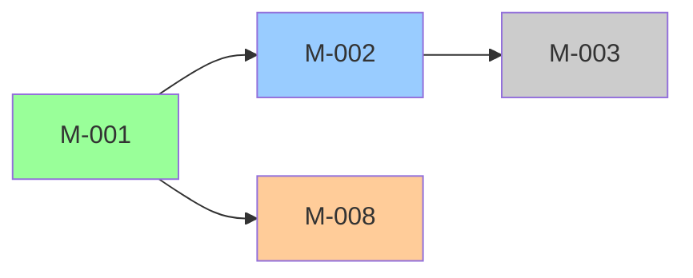
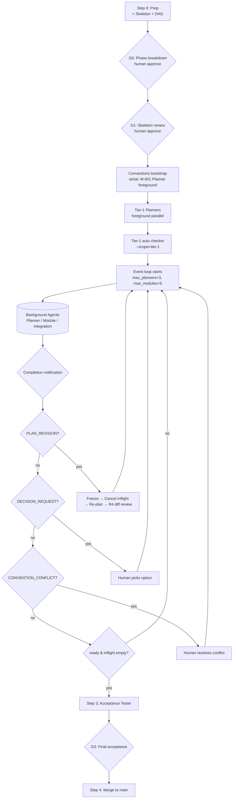

# Autoforge DAG Scheduling Redesign

**Status:** Draft (pending user review)
**Date:** 2026-05-18
**Author:** Brainstorming session (Zhanwei Wang + Claude)
**Target skill:** `skills/autoforge/`

---

## Motivation

Autoforge runs frequently take tens of hours, with most of that time spent at low concurrency — often a single agent doing work while the rest of the team sits idle. Profiling the current SKILL.md flow surfaces three structural bottlenecks:

1. **Phase barrier.** Planning and execution are organized as topological phases. Phase N+1 cannot start any work — neither planning nor execution — until every module in Phase N has been APPROVE'd, sequentially ff-merged, **and** the Integration Tester has passed. One straggler module (worst case: 20 retries in Replan/Diagnosis Mode) stalls the entire downstream pipeline.
2. **Planning and Execution are fully serialized.** All plans for all phases are written and human-reviewed before any module executes. Planners sit idle during Step 2 even though tier-2/3 plans only depend on tier-1 plans, not tier-1 code.
3. **In-phase sync points.** Inside a phase, the `conventions-bootstrap` Planner runs alone before the rest, and `conventions-additions/` are merged at the phase boundary — additional serialized steps that compound (1).

The redesign replaces the phase-based scheduler with an event-driven DAG scheduler, pipelines planning against execution, and moves integration testing from a phase-boundary barrier to a per-module rolling test. The goal: collapse total run time from `Σ max(phase_i)` toward `critical_path(DAG)` while preserving every quality gate that today's flow provides.

The terminal state of this spec is an implementation plan written via the `superpowers:writing-plans` skill.

## Design Decisions (locked during brainstorming)

| # | Decision | Rationale |
|---|----------|-----------|
| D1 | **Event-driven scheduler** using `run_in_background` Agent + completion notifications | Real continuous saturation. No wave gaps. Claude Code harness already provides the async primitive — no polling required. |
| D2 | **PLAN_REVISION = cancel all in-flight + re-plan + restart** | Safest semantics; matches the spirit of today's (b) branch. In-flight cancellation cost is bounded by the slowest running agent (no explicit cancel in the harness). |
| D3 | **Pipeline scope: initial run + re-plan** | Both flows are event-driven; tier-2+ plans are produced rolling, never batched. Re-plan re-enters the same loop, not a separate "phase 1 redo". |
| D4 | **Neighborhood-scope integration test on every module merge** | Scope = `{M} ∪ closure(M)`. Fastest feedback; no redundant retesting of unrelated upstream pairs. |
| D5 | **Human gates: G0 (phase breakdown) + G1 (skeleton) + G3 (final acceptance) + event-driven** | Maximal autonomy. Tier-1 plan review (G2) removed; replaced by automated `--scope=tier-1` checker. |
| D6 | **All-at-once rewrite in a worktree, then PR** | No `--scheduler=dag` flag, no dual code paths. Breaking change; users must restart in-flight autoforge runs. |

## Glossary additions

| Term | Definition |
|------|-----------|
| **Tier** | Topological layer of the module DAG. Replaces "phase" terminology. `tier(M) = 1 + max(tier(d) for d in deps(M))`, or `1` if `deps(M)` is empty. Tier is informational (used in run-status visualization and `--scope=tier-N` checker filtering); it does **not** introduce execution barriers. |
| **Ready set (planning)** | Modules `M` where `M.plan_status == pending` and every module in `closure(M)` has `plan_status == planned`. |
| **Ready set (execution)** | Modules `M` where `M.plan_status == planned` and `M.exec_status == pending` and every module in `closure(M)` has `exec_status == merged` (which includes neighborhood integration test pass — see §4). |
| **Neighborhood** | `neighborhood(M) = {M} ∪ closure(M)`. The scope of the integration test that runs after `M` ff-merges. |
| **In-flight** | Set of currently spawned background agents (Planners, Module Agents, Integration Testers). Bounded by `max_planners` and `max_modules` caps. |
| **Revision sequence** | Monotonically increasing counter of `PLAN_REVISION_NEEDED` events in a run. Each gets its own `revisions/{seq}/` audit directory. |

---

## §1 — Scheduling Model & State Structure

Replace today's "phase-internal parallel, phase-boundary barrier" with **event-driven ready-queue + background agents**.

### Persistent state

Written to `docs/raw/plans/{plan-dir}/run-state.json`. Updated after every state transition. Used to reconstruct the queues on session resume.

```jsonc
{
  "version": 1,
  "scheduler": {
    "max_planners": 3,
    "max_modules": 6,
    "idle_timeout_minutes": 30
  },
  "modules": {
    "M-001": {
      "deps": ["..."],
      "closure": ["..."],
      "tier": 1,
      "plan_status": "planned",        // pending | planning | planned | revising
      "exec_status": "merged",         // pending | ready | running | approved | integrating | merged | cancelled | needs_patch | failed
      "agent_handle": null,            // set while in-flight (Agent name from Agent({name: ...}))
      "retry_history": [...],          // mirrored from module-state-M-{id}.json
      "report_paths": {
        "plan": "plans/plan-M-001-...md",
        "developer_notes": "reports/developer-notes-M-001.md",
        "test_report": "reports/test-report-M-001.md",
        "review": "reports/review-M-001.md",
        "integration": "reports/integration-M-001.md"
      }
    }
  },
  "inflight": {
    "planners": ["M-013", "M-017"],
    "modules": ["M-002", "M-003"],
    "integration_testers": ["M-005"]
  },
  "human_gates": {
    "G0_approved": true,
    "G1_skeleton_approved": true,
    "G3_acceptance_approved": false
  },
  "revisions": [
    {"seq": 1, "trigger_module": "M-007", "issue_type": "INTERFACE_REDESIGN", "resolved_at": "..."}
  ],
  "current_revision": null,
  "frozen_at": null,
  "last_event_at": "2026-05-18T10:32:15Z"
}
```

### Main loop (pseudocode)

```
loop:
  ready_plan = {M | M.plan_status == pending
                    && closure(M).all(plan_status == planned)}
  ready_exec = {M | M.plan_status == planned && M.exec_status == pending
                    && closure(M).all(exec_status == merged)}

  while |inflight.planners| < max_planners and ready_plan:
    M = pop ready_plan          # priority: lower tier first, then revising > pending
    spawn_planner(M, run_in_background=true)

  while |inflight.modules| < max_modules and ready_exec:
    M = pop ready_exec          # priority: needs_patch > lower tier > higher tier
    spawn_module_agent(M, run_in_background=true)

  if nothing in-flight and queues empty:
    → all done, go to Acceptance
    break

  if frozen_at != null and all in-flight returned:
    → resume from revision flow (§5 R3-R5)

  await any background-agent completion notification
    OR idle_timeout
  process_result(returned_agent) → update state → persist → loop

  if idle_timeout fired and ready_set non-empty:
    write status dump, alert human, continue
```

### Conventions bootstrap (only serialized step)

The very first Planner — lowest M-id in tier 1 — runs in the **foreground** alone to produce `conventions.md`. Once it returns, the event loop starts. This is the only serialized planning step; all subsequent Planners run in background within the loop.

### Configuration

Add to `skills/autoforge/common/config.yml`:

```yaml
scheduler:
  max_planners: 3       # Opus-tier, expensive; cap concurrency to control cost
  max_modules: 6        # Sonnet-tier, cheaper; can run wider
  idle_timeout_minutes: 30
```

`max_modules` reflects an intentional trade-off: setting it equal to the maximum DAG fan-out maximizes throughput but spikes cost. 6 is a starting default; users with budget can raise it.

---

## §2 — Planning / Execution Pipelining

Today: Step 1 (all plans) → human review → Step 2 (all execution). Pipeline scope D3: **both initial run and re-plan use the event loop**.

### Module lifecycle states

```
pending → planning → planned → ready → running → approved → integrating → merged
                        ↑                                                     ↓
                        ├─ revising ← PLAN_REVISION_NEEDED ──────────────────┤
                        │                                                     │
                        └─ needs_patch ←─ (already-merged module needs change after revision)
```

### Ready set rules

- **Planning ready:** `closure(M).all(plan_status == planned)`. Planner input is the dep-closure plans (same as today). Only difference: this is computed continuously, not at phase boundaries.
- **Execution ready:** `M.plan_status == planned` **AND** `closure(M).all(exec_status == merged)`. The `merged` state implies "ff-merged to feature branch AND neighborhood integration test passed" (see §4).

This means: as soon as tier-1 plans + G1 skeleton are approved, the loop starts spawning **both** tier-1 Module Agents (their closure is empty, so exec-ready immediately) **and** tier-2/3 Planners (their plan-closure is the just-finished tier-1 plans). Tier-2 modules cannot exec until their tier-1 upstreams are merged, but their plans are being produced in parallel.

### Human gates

Per D5:
- **G0** (Phase breakdown) — at end of Step 0. Approves module count, DAG/tier breakdown, branch naming.
- **G1** (Skeleton review) — before conventions bootstrap runs. Approves module list, DAG mermaid, Module Interaction Protocols skeleton, key technical decisions. Does **not** read detailed plans.
- **G3** (Final acceptance) — after Acceptance Tester. Unchanged from today.

No G2 (tier-1 detailed plan review). Tier-1 plans go through an automated checker gate instead — see §7.

### Re-plan stays inside the loop

`PLAN_REVISION_NEEDED` does **not** kick the orchestrator back to Step 1. It triggers §5 R1-R5 (freeze → cancel in-flight → re-plan inside the same loop → diff review → resume). Re-planned modules re-enter the same state machine. The event loop never tears down.

---

## §3 — Conventions-additions Rolling Merge

Today: Planners write `conventions-additions/M-{id}.md`; orchestrator merges them at phase boundaries. Under DAG scheduling, phase boundaries don't exist — replace with rolling merge.

### Algorithm

Each time the orchestrator processes a Planner completion notification:

1. Check whether the Planner produced `plans/conventions-additions/M-{id}.md`.
2. If yes, **merge into `conventions.md` immediately**, in the same orchestrator main-loop iteration.
3. Delete the addition file.
4. Commit: `docs(plan): merge conventions additions from M-{id}`.

The orchestrator is the **single writer** of `conventions.md` — no race even though many Planners run in parallel, because each Planner writes only to its own `M-{id}.md` (which it alone owns).

### Conflict detection

When merging addition K, scan for conflicts with existing `conventions.md`:

- **Append-compatible** (new content under a new sub-heading, or strictly additive bullet under existing heading) → merge silently.
- **Semantic conflict** (same rule stated differently — e.g., M-002 says "use `errors.Wrap`", M-008 says "use `fmt.Errorf(\"%w\", ...)`") → trigger `CONVENTION_CONFLICT` revision:
  1. Write `plans/conventions-conflicts/{timestamp}-M-{a}-vs-M-{b}.md` capturing both proposals + relevant existing section.
  2. Pause event loop (treat as a revision per §5).
  3. Human resolves; orchestrator updates `conventions.md` with the final rule; loop resumes.

For non-trivial but non-conflicting merges, the orchestrator may spawn a `sonnet` subagent to do the merge (today's fallback).

### `CONVENTION_CONFLICT` as a first-class ISSUE_TYPE

Promote to `delivery-discipline.md` alongside the existing types (`PLAN_TEXT_ERROR`, `UPSTREAM_BUG`, etc.). It is the only ISSUE_TYPE not raised by a sub-agent — the orchestrator itself is the source. Treated identically by §5's revision flow.

---

## §4 — Neighborhood-Scope Integration Test

Today: one Integration Tester per phase boundary, scope = all modules in that phase + all previous phases. Under DAG scheduling: one Integration Tester **per module merge**, scope = neighborhood.

### Trigger

Each time a Module Agent returns APPROVE and its branch ff-merges to the feature branch:

1. Module enters `exec_status = integrating`.
2. Spawn Integration Tester for `M`, in background.
3. Loop continues spawning other Planners and Module Agents (does not block on integration).
4. When Integration Tester returns:
   - PASS → `M.exec_status = merged`. Touch ready-set computation (downstream modules may become exec-ready).
   - FAIL → enter fix cycle (see below).

### Scope

```
neighborhood(M) = {M} ∪ closure(M)
```

Integration Tester verifies:
- **Contract tests** — interfaces between `M` and modules in `closure(M)`: types match, error propagation correct.
- **Workflow tests** — multi-module workflows defined in design README's "Module Interaction Protocols" that **involve M**. Workflows not involving M are explicitly skipped.

Explicitly **not** in scope:
- Upstream pairs that don't involve M (already tested when those upstreams individually merged).
- Full-chain acceptance (Step 3 / G3 owns that).

### Fix cycle classification

When integration fails, the orchestrator classifies:

| Failure source | Action |
|----------------|--------|
| `M` itself (bug in just-merged module) | Spawn Developer in M's worktree (which was kept alive in `exec_status = integrating`). Fix → re-run integration tester (`is_rerun: true`). |
| Upstream module in closure | Mark upstream as `exec_status = needs_patch`. Touch ready set — all transitive downstream of the upstream become non-ready (their `merged` precondition no longer holds). Fix upstream in its (re-opened) worktree; cascade re-integration. |
| Design gap | Return `PLAN_REVISION_NEEDED` (§5 R1-R5). |

Stalling rules mirror today's Module Agent (progress → continue, 3 consecutive non-progress rounds → Replan Mode, 10 rounds total → DECISION_REQUEST).

### Integration Tester prompt parameters

`skills/autoforge/integration/tester-prompt.md` rewritten. New parameter set:

```yaml
target_module: M-{id}                # the newly-merged module
closure_module_ids: [...]            # M's dependency closure (already merged)
neighborhood_design_paths: [...]     # design specs for {M} ∪ closure(M)
already_merged_modules: [...]        # informational: do NOT re-test these
worktree_path: {worktree_root}/main  # primary worktree (M already merged here)
conventions_path: ...
project_coding_standards: ...
is_rerun: false                      # true on fix-cycle re-spawn
discipline_path: ...
```

First-principle in the prompt: "Focus tests on the interactions between `target_module` and `closure_module_ids`. Do **not** rewrite or duplicate tests that exercise interactions among `already_merged_modules` only."

### `exec_status = merged` semantic upgrade

In today's flow, "module merged" means "module branch ff-merged to feature branch". In the new flow, it means "ff-merged **AND** neighborhood integration test passed". This is a **strictness increase**: downstream modules now wait for integration pass before becoming exec-ready. Trade-off: slightly later downstream start vs. catching cross-module issues before downstream depends on potentially-broken upstream code. The brainstorming session accepted this trade-off.

### Periodic full regression — deferred

Initially not implemented. If real runs reveal cross-tier bugs that neighborhood tests miss, add a periodic full-closure regression (background, non-blocking) every K merges or at logical milestones. Tracked as a known follow-up; not in this redesign's MVP.

---

## §5 — Plan Revision Flow

Any `PLAN_REVISION_NEEDED` from any agent (Module Agent, Integration Tester, or orchestrator-detected `CONVENTION_CONFLICT`) routes through the same 5-step flow. ISSUE_TYPEs covered: `PLAN_TEXT_ERROR`, `UPSTREAM_BUG`, `UPSTREAM_INSUFFICIENT`, `INTERFACE_REDESIGN`, `UPSTREAM_NOT_IMPLEMENTED`, `CONVENTION_CONFLICT`.

### Step R1 — Freeze

- Orchestrator receives revision notification.
- Stops spawning new agents from the ready set.
- Sets `run-state.json.frozen_at = <timestamp>` and `current_revision = {seq}`.
- Loop continues to await in-flight agent completions but does not start anything new.

### Step R2 — Cancel in-flight

Claude Code harness has no explicit "cancel" primitive for background agents. Cancellation is implemented as **let them complete, then discard the result**:

- **In-flight Planners**: plan files written to disk are kept (harmless — re-plan will decide whether to overwrite). Planner return value is logged but does not transition module state.
- **In-flight Module Agents**: regardless of return (APPROVE / FAIL / DECISION_REQUEST), the module is marked `exec_status = cancelled`. The module branch is **kept** (commits preserved on the branch) but **not merged** to the feature branch. Re-plan decides what to do with it.
- **In-flight Integration Testers**: returned report archived to `reports/cancelled/integration-M-{id}-{revseq}.md`; does not affect state.

Write `revisions/{seq}/cancelled-modules.json` capturing module IDs, their progress at cancellation (commits, sub-agent stage, retry round), and current worktree paths.

### Step R3 — Re-plan

Re-plan re-uses the event loop's planning machinery — not a separate Step 1.

- Iterate all modules. For each, recompute status:
  - Modules whose plans need rework (per the trigger module's report + Planner's analysis): `plan_status = revising`. If the module was already `merged`, additionally set `exec_status = needs_patch`.
  - Already-`merged` modules whose **code** needs to change to match a revised downstream interface — but whose own plan does not — keep `plan_status = planned` and set `exec_status = needs_patch`.
  - Untouched modules: keep both statuses unchanged.
- Compute the new tier-1 set (`closure.all(planned)`). Spawn Planners for revising modules following the normal cap-bounded ready-set rules. Planner inputs include:

```yaml
revision_trigger:
  seq: 1
  source_module: M-007
  issue_type: INTERFACE_REDESIGN
  evidence: ...           # from reports/plan-revision-M-007.md
cancelled_state_snapshot: revisions/{seq}/cancelled-modules.json
merged_code_authority: true  # tells Planner to read actual code, not stale plans
                             # for already-merged closure modules
conflicting_additions: [...] # ONLY for CONVENTION_CONFLICT
```

- Planners write revised `plan-M-{id}.md` files. Diff against pre-revision versions is captured.

### Step R4 — Human review (revision diff only)

Generate `revisions/{seq}/plan-diff.md` summarizing:
- Which module plans actually changed (semantic vs. cosmetic).
- Which `merged` modules need patches.
- Which `cancelled` modules can resume from existing commits vs. need reset.

Present to human. Human approves / edits / rejects the diff. Not a full plan re-review.

### Step R5 — Resume

- Clear `frozen_at`. Set `current_revision = null` and append to `revisions[]`.
- Cancelled modules transition based on diff decision:
  - "Resume from existing commits" → `exec_status = pending` with state preserved (Module Agent will read its `module-state-M-{id}.json` and continue from last sub-agent).
  - "Reset and rerun" → reset worktree HEAD, `exec_status = pending` with fresh state.
- `needs_patch` modules are highest-priority in the ready set. Spawned in their (re-opened) worktrees with augmented plan steps. Decision **D7 (below)**: re-open the old worktree rather than primary, mirroring the first-execution pattern.
- Event loop resumes normally.

### Audit trail

```
revisions/
  001/
    trigger.md                # ISSUE_TYPE + source module + original report
    cancelled-modules.json    # R2 snapshot
    plan-diff.md              # R3 output: semantic-level diff
    human-decision.md         # R4 final decision
    resumed-at: <timestamp>
  002/
    ...
```

This replaces today's `docs(plan): re-plan from phase {n} — {reason}` commit message — structured + machine-readable for post-mortem analysis.

### D7 — `needs_patch` uses re-opened worktree

Open question resolved during brainstorming: already-merged module needing a patch reopens its old worktree (recreate via `git worktree add -b ...` on the existing module branch) rather than editing in primary. Trade-off: more worktree operations, but symmetric with first-execution flow — same Module Agent prompt, same audit gates, same merge sequence. The asymmetry of patching in primary would have required a separate code path with subtle bugs.

---

## §6 — Human Gates (event-driven)

### Blocking gates

| Gate | When | Content |
|------|------|---------|
| **G0** | End of Step 0 | Module count, DAG/tier mermaid, branch naming, output paths |
| **G1** | Before conventions bootstrap | Module list, DAG mermaid, Module Interaction Protocols skeleton, key technical decisions. Does **not** include detailed per-module plans |
| **G3** | After Acceptance Tester | Acceptance report + traceability + checker outputs |

### Event-driven gates

Triggered during event loop; pause loop for human action:

| Trigger | Human reviews | Decision |
|---------|---------------|----------|
| `DECISION_REQUEST` from any agent | DIAGNOSIS + 2-3 options + recommendation | Pick option or write custom instruction |
| `PLAN_REVISION_NEEDED` (any ISSUE_TYPE) | §5 R4 plan diff | approve / edit / reject |
| `CONVENTION_CONFLICT` (orchestrator-detected) | The two conflicting additions + relevant existing conventions.md section | Pick the rule |
| Planner emits `## Risks Flagged for Human` in a plan | That risks section | Acknowledge or request Planner rewrite |
| `idle_timeout_minutes` exceeded with non-empty ready set | Status dump (in-flight / ready / blocked) | Diagnose or terminate |
| `run-checkers.sh` `error`/`critical` finding | Checker output | See SKILL.md's existing CR-AF30/31 routing |

### Removed gates (vs today)

| Today's gate | Disposition |
|--------------|-------------|
| Step 1 end "All plans approved" | Replaced by G1 (skeleton). Detailed plans are gated automatically per §7. |
| Per-phase plan revision review | Replaced by §5 R4 (diff-only review per revision). |
| Phase-boundary integration test confirmation | Auto-handled — failures escalate via DECISION_REQUEST or PLAN_REVISION_NEEDED. No gate when passing. |

---

## §7 — Tier-1 Auto-checker Safeguard

With G2 removed, tier-1 detailed plans need a machine gate before any Module Agent spawns.

### Initial tier-1 sanity check

When all tier-1 plans are written (after conventions bootstrap + parallel tier-1 Planners complete) and **before any Module Agent spawns**:

```
bash skills/autoforge/scripts/run-checkers.sh {plan_dir} \
     --source-root {worktree_root}/main \
     --phase=plan \
     --scope=tier-1
```

`--scope=tier-1` (new flag) filters checkers to consider only tier-1 module plan files. Active checkers:
- `check-plan-readme.sh`
- `check-module-plan.sh` (only files for tier-1 modules)
- `check-plan-pollution.sh`
- `check-discipline-scan.sh`

### Routing

| Result | Action |
|--------|--------|
| All PASS | Event loop starts spawning Module Agents normally |
| `warning`-level findings only | Log to `revisions/auto-warnings.md`; event loop proceeds |
| `error` / `critical` findings | Auto-re-dispatch the corresponding tier-1 Planner with the findings JSON. Do **not** alert human (this is the autonomous compensation for G2 removal). Recursion bounded: 3 auto-fix rounds before escalating to DECISION_REQUEST |

### Per-plan checker for tier-2+

For each non-tier-1 Planner that returns:

```
bash skills/autoforge/scripts/run-checkers.sh {plan_dir} \
     --source-root {worktree_root}/main \
     --phase=plan \
     --scope=module-M-{id}
```

`--scope=module-M-{id}` (new flag) checks just that one module's plan file. Same routing as tier-1: auto-fix on failure, 3-round bound, then escalate.

Replaces today's "Step 1 end runs checkers over the whole plan dir batch" with rolling per-plan checking that fits the event loop's cadence.

### Implementation note on `--scope`

`run-checkers.sh` currently has `--phase={plan,execute,accept}` and `--gate=delivery-tag`. Add `--scope={tier-N | module-M-id}` orthogonal flag:
- Default `--scope=all` (today's behavior).
- `--scope=tier-N` filters input plan files to modules whose `tier == N`.
- `--scope=module-M-id` filters to exactly one plan file.

The scope filter applies to file enumeration (which plans the checker reads), not to checker logic — keeps the change local.

---

## §8 — Observability & Recoverability

Event-driven loops are harder to debug than phase-based flows. This section is the compensation.

### Real-time status file

`docs/raw/plans/{plan-dir}/run-status.md` — written by orchestrator after each state transition. Format:

```markdown
# Autoforge Run Status — {plan-dir}

## Snapshot @ 2026-05-18T14:35:22Z

In-flight Planners: 2 / 3 cap
  - M-013 (started 14:32, age 3m)
  - M-017 (started 14:35, age 0m)

In-flight Modules: 5 / 6 cap
  - M-002 (Developer round 2, started 13:55)
  - M-003 (Tester, started 14:01)
  - ...

In-flight Integration Testers: 1
  - M-007 (started 14:33)

Ready (planning): [M-019, M-020]
Ready (execution): [M-005]   ← capped, waiting for module slot
Blocked on closure: M-008 (waiting on M-005)

Tier progress:
  Tier 1: 5/5 merged
  Tier 2: 2/4 merged, 1 integrating, 1 running
  Tier 3: 0/3, all blocked

Recent transitions (last 10):
  14:35 M-003 Developer → Tester
  14:33 M-007 approved → integrating (Integration Tester spawned)
  14:31 M-002 plan_status: planned (Planner returned)
  ...

Current revision: none
```

### DAG mermaid in plan README

`README.md` includes a status-colored mermaid graph, regenerated on each `run-status.md` write:



Open the plan README on GitHub at any time to see progress at a glance.

### Commit cadence

The orchestrator commits frequently (matching today's density). Categories:

- `docs(plan): merge conventions additions from M-{id}` — per Planner with additions.
- `docs(plan): tier-{n} plan M-{id} ready` — per Planner completion.
- `docs(plan): update run-status` — **batched every K transitions or T seconds** (default K=5, T=60s) to avoid commit storms. The `run-status.md` and mermaid are updated in memory each transition, committed periodically.
- Existing `feat(M-{id})` / `test(M-{id})` / `fix(M-{id})` / `docs(M-{id})` from Module Agents — unchanged.
- `docs(plan): revision-{seq} resolved — {summary}` on revision close.

### Session resume

If the orchestrator session dies mid-run, on next startup with the same plan-dir:

1. Read `run-state.json` to reconstruct ready queues and `inflight` lists.
2. All `inflight` agents are by definition lost (the harness doesn't reconnect to dead agent sessions). Transition each in-flight module to `exec_status = cancelled` and revert its module-level state-machine to last persisted checkpoint (Module Agents already persist `module-state-M-{id}.json` after each sub-agent — that part is unchanged).
3. Append a "session-resume" note to `revisions/auto-warnings.md`.
4. Resume main loop. Cancelled modules re-enter ready set automatically; integration testers re-spawn on the next module merge.

**Resume cost:** up to one round of work per in-flight module is repeated. No `merged` modules are ever lost.

### Idle timeout dump

If `idle_timeout_minutes` (default 30) elapses without a completion notification AND ready set is non-empty, orchestrator writes a diagnostic dump and alerts the human (CR-AF32, new checker rule). Dump contains:
- Why no spawns happened (caps full? Why are inflight agents still running?)
- Per-inflight agent: age, last activity (from its sub-state JSON), worktree path
- Suggested next actions (raise caps, kill specific agent, terminate run)

### New checker rules

| ID | Description | Severity |
|----|-------------|----------|
| `CR-AF32` | Idle timeout exceeded — event loop has not made progress within `idle_timeout_minutes` despite non-empty ready set | error |
| `CR-AF33` | Scheduler state inconsistent — `run-state.json` disagrees with on-disk `module-state-M-*.json` or git log (e.g., `exec_status = merged` but module branch not in feature-branch ancestry) | critical |

Both run in `--phase=execute` mode of `run-checkers.sh`.

---

## §9 — Overall Flow & Change Map

### Flow diagram



### Mapping to today's SKILL.md

| Today | New design | Notes |
|-------|-----------|-------|
| Step 0 | S0 + G0 + G1 | New Skeleton Review (G1) inserted |
| Step 1 phase-by-phase planning | Conventions bootstrap (foreground) + Tier-1 Planners (foreground parallel) + event-loop rolling planning | Tier-2+ plans no longer batched; no per-phase plan review |
| Step 1.5 Bootstrap | Unchanged | Still runs before tier-1 Module Agents |
| Step 2 phase execution | Event loop spawns Module Agents | All background, ready-queue driven |
| Step 2.6 Phase integration test | Neighborhood integration test per module merge | Scope = `{M} ∪ closure(M)` |
| Step 2.7-2.9 phase status update | `run-status.md` + mermaid updated on every transition, committed periodically | Append-only log |
| Step 3 Acceptance | Unchanged | G3 preserved |
| Step 4 Merge to main | Unchanged | One-shot ff-merge feature branch |
| `PLAN_REVISION_NEEDED` b/c branches | Unified §5 R1-R5 | All ISSUE_TYPEs use the same flow; structured audit |

### File-level changes

| File | Change |
|------|--------|
| `skills/autoforge/SKILL.md` | Heavy rewrite of Step 0-2; add §1/§2/§3/§5 sections; remove phase chapters |
| `skills/autoforge/common/config.yml` | Add `scheduler.max_planners`, `scheduler.max_modules`, `scheduler.idle_timeout_minutes` |
| `skills/autoforge/planning/planner-prompt.md` | Add `revision_trigger`, `cancelled_state_snapshot`, `merged_code_authority`, `conflicting_additions` input params |
| `skills/autoforge/integration/tester-prompt.md` | Rewrite: scope changes to `target_module` + `closure_module_ids` |
| `skills/autoforge/module/agent-prompt.md` | Minor: add `needs_patch` resumption path; preserve worktree on cancel |
| `skills/autoforge/scripts/run-checkers.sh` | Add `--scope=tier-N` and `--scope=module-M-id` flags |
| `skills/autoforge/scripts/lib/*` | Implement scope filtering |
| `skills/autoforge/scripts/run-state-init.sh` (new) | Initialize `run-state.json` from Module Index |
| `skills/autoforge/scripts/run-state-update.sh` (new) | Called by orchestrator on each transition: update JSON, regenerate `run-status.md`, update mermaid; batch commits |
| `skills/autoforge/scripts/check-scheduler-state.sh` (new) | CR-AF33 checker |
| `skills/autoforge/scripts/check-idle-timeout.sh` (new) | CR-AF32 checker |
| `skills/autoforge/tests/test-scheduler-ready-set.sh` (new) | Unit tests for ready set computation |
| `skills/autoforge/tests/test-scheduler-cancel.sh` (new) | Cancel semantics tests |
| `skills/autoforge/tests/test-rolling-merge.sh` (new) | conventions rolling merge + conflict detection |
| `skills/autoforge/tests/test-run-state.sh` (new) | run-state.json persistence and resume |
| `skills/autoforge/CHANGELOG.md` | Record breaking changes |
| `skills/autoforge/delivery-discipline.md` | Add `CONVENTION_CONFLICT` ISSUE_TYPE; remove phase-barrier wording |

### Breaking changes

- One-shot rewrite, no compatibility flag. In-flight autoforge runs cannot migrate forward — users must restart against the new SKILL.md in a fresh plan-dir.
- `phase_number` parameter removed from all sub-agent prompts. Replaced by `tier_number` (informational only).
- New `--scope` flag is additive; default behavior unchanged for callers that don't pass it.
- Plan-dir layout adds `revisions/`, `conventions-conflicts/`, `run-state.json`, `run-status.md` files. Existing files (plans/, reports/, README.md) keep their structure.

### Expected performance impact

Heuristic estimate, based on a representative 30-module run:
- Today: ~4 phases, longest phase ~8h, sequential phase barrier with avg 30-minute Integration Tester → total ~32-40h
- Expected: critical path ~12-15h (longest dep chain ~5 modules @ ~2-3h each) + 30% overhead for cap saturation and integration tests → ~16-20h

The exact factor depends on DAG shape. Modules with deep fan-in dependency chains see less benefit; wide, shallow DAGs benefit most.

---

## Open follow-ups (deferred, not in MVP)

1. **Periodic full-closure regression** (§4) — added if neighborhood-scope tests prove insufficient.
2. **Background revision** — if PLAN_REVISION resolution proves cheap enough, consider allowing the loop to continue spawning non-affected modules during revision instead of full-line freeze. Today's decision (D2) is conservative; reconsider after empirical data.
3. **Adaptive concurrency** — auto-adjust `max_planners`/`max_modules` based on observed sub-agent success rates and cost. Not in MVP.
4. **Tier-1 plan auto-checker may produce noisy auto-fixes** — if 3-round auto-fix bound is hit frequently, escalate sooner or re-introduce a lightweight G2.
5. **`conventions-conflicts/` UI** — currently markdown files. Consider structured JSON + a small render script if conflicts become routine.

---

## Implementation order (one-shot worktree)

User chose "all-at-once rewrite in a worktree, then PR". Suggested sequence within that single PR:

1. **Foundation** — `common/config.yml`, `scripts/run-state-init.sh`, `scripts/run-state-update.sh`, `scripts/lib/` scope filter. Unit tests.
2. **Scheduler core** — pseudocode in SKILL.md §1-§2, including state machine and ready-set rules. Reference `run-state.json` schema as authority.
3. **Conventions rolling merge** — SKILL.md §3, conflict detection, `CONVENTION_CONFLICT` in `delivery-discipline.md`.
4. **Neighborhood integration** — rewrite `integration/tester-prompt.md`, update SKILL.md §4.
5. **Revision flow** — SKILL.md §5 R1-R5, `revisions/{seq}/` layout, Planner prompt new params.
6. **Human gates** — SKILL.md §6, remove old phase gates, document G0/G1/G3 + event-driven gates.
7. **Tier-1 safeguard** — `--scope` flag in `run-checkers.sh`, SKILL.md §7.
8. **Observability** — `run-status.md` template, mermaid generation, CR-AF32/33 checkers, session-resume protocol. SKILL.md §8.
9. **CHANGELOG** — breaking changes, migration note.
10. **End-to-end smoke test** — run against a small (5-7 module) test fixture in `tests/fixtures/`.

Each step's tests live next to the code change and run via `tests/run-all.sh`. The PR is reviewable as one unit but logically structured for sequential review.
