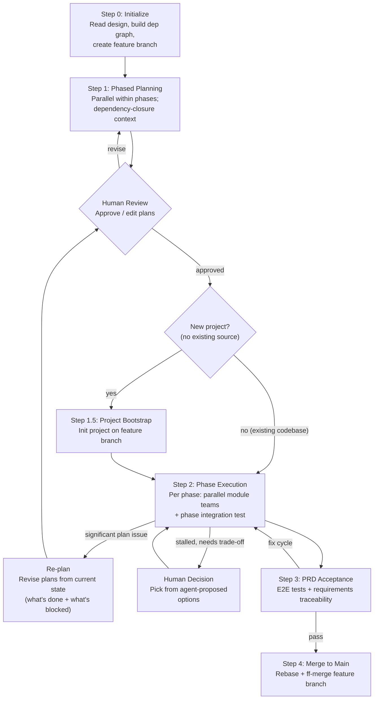
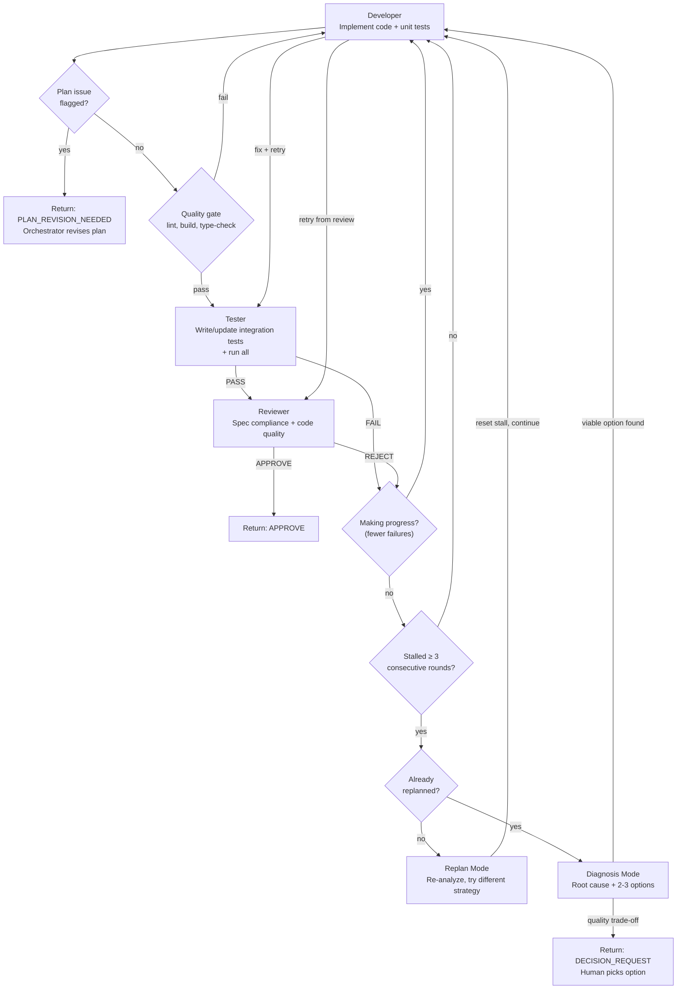

# Autoforge — Multi-Role Automated Development

Orchestrate agent teams to turn a system design into tested, PRD-validated code. Modules are planned **phase by phase** — phases run sequentially so upstream plans are finalized first, but Planners within a phase run in parallel (same-phase modules are independent by construction). Each Planner receives only its **dependency closure** of already-completed plans instead of every prior plan, keeping input size proportional to fan-in. Execution then runs modules in parallel with isolated git worktrees; each module gets a team (Developer, Tester, Reviewer). Fully automated with adaptive iteration — human intervenes only at explicit approval gates or when the agent has exhausted reasonable approaches and needs a trade-off decision.

## Input Modes

```
/autoforge docs/raw/design/2026-04-09-agent-team/              # full flow (plan → execute → accept)
/autoforge --plan-only docs/raw/design/2026-04-09-agent-team/   # generate plans only, stop for human review
/autoforge --execute docs/raw/plans/2026-04-09-agent-team-a3f1/     # execute existing plans (reads design/PRD paths from plan README)
/autoforge --evolve docs/raw/design/2026-04-09-agent-team/      # follow a `system-design --evolve` delivery: in-place mutate the
                                                                #   prior plan dir, re-plan only impacted modules, re-execute
/autoforge --evolve --plan-only docs/raw/design/2026-04-09-agent-team/   # stop after evolution re-plan, before execution
/autoforge --evolve --from docs/raw/plans/<plan-dir>/ docs/raw/design/<design-dir>/   # explicit prior plan dir (skip auto-discovery)
/autoforge --evolve --fresh docs/raw/design/2026-04-09-agent-team/       # escape hatch: NEW plan dir instead of in-place evolve
/autoforge --status docs/raw/plans/2026-04-09-agent-team-a3f1/      # show progress
/autoforge --cleanup docs/raw/plans/2026-04-09-agent-team-a3f1/     # abandon run: remove worktrees, branches, optionally plans
```

## Mode Routing

Detect the mode first. Read the routing files for that mode only — do not load the others.

| Mode | Trigger | Read These Files |
|------|---------|------------------|
| **Default** | `/autoforge <dir>` | Load per-step as needed (see loading notes in Steps 1–3 below) |
| **Plan only** | `--plan-only` | Same — stops after Step 1; only planner files are ever loaded |
| **Execute** | `--execute <plan-dir>` | Same — skip planner files unless re-plan is triggered |
| **Evolve** | `--evolve <design-dir>` | Load `--evolve Mode` section; same step files as Default but driven by Steps E0–E6 (planner + module-agent + execution prompts; same templates) |
| **Evolve plan-only** | `--evolve --plan-only` | Same as Evolve — stops after Step E4 |
| **Evolve fresh** | `--evolve --fresh` | Falls through to Default with a forced new plan directory; not the recommended path |
| **Status** | `--status <plan-dir>` | No additional files (read-only query) |
| **Cleanup** | `--cleanup <plan-dir>` | No additional files |

## Model Tiers

Abstract: `heavy` / `balanced` / `light`. Mapping in `common/config.yml` (`model_tier_defaults` + `model_mapping`).

### Per-dispatch model override (MANDATORY for cost control)

When the orchestrator dispatches a sub-agent via the Claude Code Agent tool, it **MUST** pass the `model` parameter to override the default (parent-session inheritance). Without this override, all sub-agents run on the parent session's model — typically `opus` — which costs 5–25× the configured tier rate. Per the `model_tier_defaults` section of `common/config.yml`:

| Role | Default tier | Agent-tool `model` value | Why |
|------|------|------|------|
| Planner | `heavy` | `"opus"` | Architecture decisions, cross-module consistency, most reasoning-heavy role in the pipeline |
| Bootstrap | `balanced` | `"sonnet"` | Mechanical project scaffolding from a tech-stack spec |
| Module Agent (2nd-level orchestrator) | `balanced` | `"sonnet"` | Flow control + state updates; escalates only on Replan/Diagnosis |
| Developer (initial + retry) | `balanced` | `"sonnet"` | Implementing code from a detailed plan |
| Developer (Replan Mode — Variant 4) | `heavy` | `"opus"` | New-strategy design after the current approach stalled |
| Tester | `balanced` | `"sonnet"` | Test authoring from spec acceptance criteria is mechanical |
| Reviewer | `balanced` | `"sonnet"` | Spec-compliance checking; escalate to `heavy` after repeated REJECT pattern |
| Integration Tester | `balanced` | `"sonnet"` | Phase-level test authoring + execution |
| Acceptance Tester | `balanced` | `"sonnet"` | E2E tests + traceability matrix; escalate to `heavy` for ambiguity classification |

**Escalation rule** (declared in `common/config.yml#escalation`): when Replan / Diagnosis triggers (Module Agent stalled ≥3 non-progress rounds), the next Developer spawn uses `heavy`. After one heavy-backed Replan attempt, revert. For the Acceptance Tester: after classifying a failure as PRD-ambiguity, the next ambiguity-classification pass uses `heavy`; revert once resolved.

**Why not heavy everywhere:** the heavy tier is ~5× balanced on input and ~15× on cache_read. Autoforge's inner loop (Developer → Tester → Reviewer) runs dozens of times per module across many modules — a mis-tiered default multiplies across the whole run. Balanced is the right default; heavy is a targeted escalation, not a baseline.

## Process Overview



## Step 0 — Initialization

1. **Read design input** — read design README.md (module index, dependency graph, Feature-Module mapping, interaction protocols, test strategy) + all module specs (`modules/*.md`) + API contracts (`api/*.md` if present)
2. **Read project coding standards** — gather conventions from three sources in priority order:
   - **(a) CLAUDE.md and AGENTS.md** (if they exist) from the project root — project-specific overrides; highest priority
   - **(b) Design README's Implementation Conventions and Key Technical Decisions** — design-level conventions translated from the PRD
   - **(c) PRD architecture.md developer convention sections** — follow the design README's `Design Input > Source` to the PRD directory, then read `architecture.md` for: Coding Conventions, Test Isolation, Development Workflow, Security Coding Policy, Backward Compatibility, Git & Branch Strategy, Code Review Policy, Observability Requirements, Performance Testing, AI Agent Configuration, Deployment Architecture (environments, local dev setup, config management, CD pipeline, environment isolation)
   
   Merge these into a unified `project_coding_standards` context: (a) overrides (b) overrides (c). Pass relevant sections to all sub-agents throughout the pipeline.
3. **Locate PRD** — follow `Design Input > Source` to find the PRD directory. Read: `README.md` (feature index only). Do NOT read journeys/ or architecture topic files upfront — they are not needed for planning. Individual module Planners and Developers will read specific feature files (and the frontend draft files referenced via `Frontend Draft Reference`) on demand when they need acceptance criteria, interaction design details, or existing-code context.
4. **Build dependency graph** — from Module Index `Deps` column, construct a DAG. Topologically sort into phases: Phase 1 = modules with no dependencies, Phase 2 = modules whose deps are all in Phase 1, etc.
5. **Detect project state** — check if project has existing source code (package manifests, src directories). If so, note this — Planners must account for existing code structure
6. **Determine output paths**:
   - Plan output: `docs/raw/plans/{design-dir-name}-{hash4}/` where `{design-dir-name}` comes from the design directory name (e.g. `2026-04-09-agent-team`) and `{hash4}` = `$(git rev-parse --short=4 HEAD)`
   - Feature branch: `autoforge/{design-dir-name}-{hash4}`
   - Worktree root: `{project-root}/../{project-dirname}-worktrees/autoforge-{design-dir-name}-{hash4}/` — sibling to the project directory, one subdirectory per autoforge run
7. **Create feature branch and primary worktree** — the main project directory stays on its current branch throughout the autoforge run. All autoforge work happens in worktrees:
   ```
   git branch autoforge/{design-dir-name}-{hash4}
   git worktree add {worktree_root}/main autoforge/{design-dir-name}-{hash4}
   ```
   The **primary worktree** (`{worktree_root}/main/`) is used for all non-module work: planning, bootstrap, integration tests, acceptance tests, and status updates. Module-specific work uses separate per-module worktrees (see Step 2).
8. **Present plan to user** — show: module count, phase breakdown with dependency rationale, branch names, output paths. User confirms before proceeding.

**Step 0 → Step 1 gate:** User confirms phase breakdown and branch naming.

## Step 1 — Phased Planning (parallel within phases)

> **Load now:** `planning/planner-prompt.md`, `planning/plan-readme-template.md`, `planning/module-plan-template.md`

Plan modules **phase by phase**. Phases run sequentially — so every plan in Phase N-1 is complete before any Phase N Planner starts — but within a phase, Planners run **in parallel**. Same-phase modules are independent by the DAG construction (no dep between them), so parallelism is safe for interface consistency.

Each Planner receives only its **dependency closure** of already-completed plans — the transitive set of upstream modules it consumes — instead of every prior plan. Combined with the shared `conventions.md`, this preserves cross-module coherence while keeping per-Planner input proportional to fan-in (typically 1–3 plans) rather than the full run size.

Planners run in the **primary worktree** (on the feature branch) — they only produce plan documents, no code. **Planners write files but do NOT commit** — the Orchestrator commits all plans together after all phases complete.

### Planning Order

Use the topological sort from Step 0. Plan one phase at a time; within a phase, spawn all Planners in a single message (multiple `Agent` tool calls in one response) and wait for the whole phase to finish before moving to the next.

**Conventions-bootstrap exception:** the very first Planner (lowest M-id in Phase 1) runs alone to create `conventions.md`. Once it returns, the rest of Phase 1 spawns in parallel. This is the only serialized step in the planning flow.

```
Example: Phase 1 [M-001, M-002, M-008] → Phase 2 [M-003, M-005] → Phase 3 [M-006, M-007]
  Round 1 (serialized): M-001 alone       # bootstraps conventions.md + its own plan
  Round 2 (parallel):   M-002, M-008      # rest of Phase 1
  Round 3 (parallel):   M-003, M-005      # Phase 2
  Round 4 (parallel):   M-006, M-007      # Phase 3
```

### Dependency Closure

For each module M about to be planned, the Orchestrator computes its **dependency closure** over the DAG:

- `direct_deps(M)` = modules listed in M's `Deps` column of the Module Index
- `closure(M)` = `direct_deps(M) ∪ { closure(d) for d in direct_deps(M) }` — transitive

Only plans for modules in `closure(M)` are passed to M's Planner. By the phase ordering, all of them are already planned by the time M is planned (closure can only point to earlier phases, never to same or later phases). For Phase 1 modules the closure is empty.

### Conventions Bootstrap

The first Planner has an additional responsibility: create `docs/raw/plans/{plan-dir}/plans/conventions.md` defining project-wide implementation conventions derived from multiple sources:

**Primary sources (provide to the first Planner):**
- Design README: Tech Stack, Module Interaction Protocols, full Module Index
- Design README: Implementation Conventions section (design-level translation of PRD policies)
- PRD architecture.md: developer convention sections (Coding Conventions, Test Isolation, Development Workflow, Security Coding Policy, Backward Compatibility, Git & Branch Strategy, Code Review Policy, Observability Requirements, Performance Testing, AI Agent Configuration)

**What conventions.md must include:**
- Directory structure and file organization
- Naming conventions (files, functions, types, variables)
- Error handling patterns (error types, propagation strategy)
- Shared type definitions (types referenced across module interaction protocols)
- Import/export patterns
- Test file organization and naming
- Security patterns — input validation locations, injection prevention, secret handling (from PRD Security Coding Policy translated via design Implementation Conventions)
- Test isolation rules — resource isolation, port binding, temp directories, timeouts, global state prohibition (from PRD Test Isolation translated via design Implementation Conventions)
- Observability patterns — structured logging format, mandatory events, required log fields, health checks (from PRD Observability Requirements translated via design Implementation Conventions)
- Performance testing — benchmark requirements, CI performance gates, resource limits (from PRD Performance Testing translated via design Implementation Conventions)
- Development workflow — prerequisites, setup commands, CI gate ordering, build matrix (from PRD Development Workflow)
- AI agent instruction file policy — which instruction files to maintain (CLAUDE.md, AGENTS.md), structure policy (concise index with references to convention files, not monolithic), content priorities, maintenance triggers (from PRD AI Agent Configuration)

Subsequent Planners follow `conventions.md`. If they encounter a pattern not yet covered, they **must not edit `conventions.md` directly** — within-phase Planners run in parallel and would race. Instead, each Planner writes its additions to a per-module file:

```
docs/raw/plans/{plan-dir}/plans/conventions-additions/M-{id}.md
```

After each phase of planning completes, the Orchestrator merges all `conventions-additions/*.md` from that phase into `conventions.md` (dedup, reconcile, then delete the merged addition files) before the next phase starts. This gives later phases a single consolidated conventions file to read.

### Per-Phase Planning

For each phase (following the conventions-bootstrap exception in the first round), spawn every Planner for that phase in a **single message** with multiple `Agent` tool calls so they run in parallel. Wait for the entire phase to return before starting the next phase.

```
# Round 1 — bootstrap (only the very first Planner in Phase 1)
Agent({
  description: "Planner for M-001 (conventions bootstrap)",
  prompt: <fill in planning/planner-prompt.md; is_first_module=true, dependency_closure_plan_paths=[]>,
  model: "opus",
  mode: "auto"
})

# Round 2+ — phase parallel (all remaining Planners in the current phase,
# spawned as parallel Agent calls in one message)
Agent({ description: "Planner for M-002", model: "opus", mode: "auto",
        prompt: <is_first_module=false, dependency_closure_plan_paths=[closure(M-002)]> })
Agent({ description: "Planner for M-008", model: "opus", mode: "auto",
        prompt: <is_first_module=false, dependency_closure_plan_paths=[closure(M-008)]> })
```

See `planning/planner-prompt.md` for the complete Planner prompt template.

**Planner input:**

| Input | Source | Notes |
|-------|--------|-------|
| Module design spec | `modules/M-{id}-{slug}.md` | Primary input for this module |
| Design README | Design `README.md` | Cross-module context: interaction protocols, test strategy, tech stack, Implementation Conventions, Key Technical Decisions, **Production Promotion Plan** (per-module Promote/Extend/Rewrite actions for frontend modules) |
| PRD architecture.md | `{prd-dir}/architecture.md` | Developer convention sections: Coding Conventions, Test Isolation, Security Coding Policy, Development Workflow, Observability Requirements, Performance Testing, Git & Branch Strategy, Code Review Policy, Backward Compatibility, AI Agent Configuration, **Frontend Implementation Path** (root of any PRD-stage frontend draft for user-facing modules) |
| PRD feature specs | `features/F-*.md` | Features referenced in module's Source Features section. For user-facing features, the **Frontend Draft Reference** subsection records the draft path and confirmation date — used by Planner to decide draft-promotion vs build-from-scratch step ordering |
| UI Promotion Guide | Module spec's UI Architecture section | If module has Promotion action = Promote/Extend: existing draft path, the contracts the draft must match, and the Promotion Requirements (i18n / a11y / perf / tests / coding-standard hardening). Planner uses this to generate "harden draft in place" steps instead of "write from scratch" steps |
| PRD frontend draft source | `{repo-root}/{frontend-implementation-path}/{feature-area}/` | Actual draft code files in the project source tree (NOT under `{prd-dir}/`). Planner reads these for Promote/Extend modules to write concrete hardening steps. For Rewrite or backend-only modules: skip |
| Dependency closure plans | `plans/plan-M-*.md` for every module in `closure(M)` | Concrete interface signatures, types, and file paths for the upstream modules this one consumes. Empty for Phase 1 modules. Replaces the prior "all previous plans" input. |
| Implemented code | Source files on feature branch | For already-merged modules: actual code is source of truth over plans (populated during re-planning) |
| Conventions | `plans/conventions.md` | First Planner creates; subsequent Planners read. Extensions are written to per-module `conventions-additions/M-{id}.md` files and merged by the Orchestrator between phases. |

**Planner output:**
- `docs/raw/plans/{plan-dir}/plans/plan-M-{id}-{slug}.md` (using `planning/module-plan-template.md`)
- [First module only] `docs/raw/plans/{plan-dir}/plans/conventions.md`
- [Subsequent modules, if needed] `docs/raw/plans/{plan-dir}/plans/conventions-additions/M-{id}.md`

### After Each Phase of Planning

Run between phases — before spawning the next phase's Planners — so later phases read a single consolidated conventions file:

1. **Collect conventions additions** — list files under `plans/conventions-additions/` produced by this phase's Planners
2. **Merge into `conventions.md`** — fold in any new sections, dedup and reconcile against existing content, preserve section order. For a non-trivial batch, spawn a `sonnet` subagent with the merge task; for zero or one addition, merge inline
3. **Delete the merged addition files** so the directory is empty before the next phase writes into it
4. **Proceed to the next phase**

### After All Phases of Planning Complete

1. **Generate plan README** — write `docs/raw/plans/{plan-dir}/README.md` using `planning/plan-readme-template.md`: dependency graph (mermaid), phase breakdown, module list with status
2. **Commit plans** — single commit of all plan files on the feature branch: `docs(plan): add implementation plans for {project}`
3. **Present to human** — provide a structured review summary so the user doesn't need to read every plan in full:
   - Per module: step count, key decisions, integration points
   - Cross-module: shared types defined in conventions.md, dependency flow
   - Risks: any assumptions or trade-offs the Planners flagged
   - If this is a **re-plan** (not initial planning), additionally provide:
     - **What changed and why** — a diff summary per plan: which steps/integration points were modified, added, or removed
     - **Trigger** — the issue that caused re-planning (ISSUE_TYPE, evidence, affected module)
     - **Impact scope** — which plans were unchanged vs. revised; which already-implemented modules need code changes
   - If `--plan-only` mode, stop here.
3.5. **Structural plan check (mandatory before human review)** — run

```
bash skills/autoforge/scripts/run-checkers.sh {plan_dir}
```

The aggregator invokes `check-plan-readme.sh` against the plan README, `check-module-plan.sh` against every `plans/plan-M-*.md`, and merges the JSON output. **If any finding has `severity` of `error` or `critical`, the gate fails** — dispatch the Planner again with the JSON findings so the plan is fixed before any human ever sees it. Warnings are surfaced to the human reviewer below but do not block the gate. This replaces the prior LLM-grep checks for required sections, wiring rows, AC mapping rows, and deferral discipline (delivery-discipline §C / §F / §L).
4. **Human review gate** — user approves, requests edits, or rejects. If edits requested, modify plans, re-run step 3.5, and re-commit.

**Step 1 → Step 1.5 gate:** Human approves all plans.

## Step 1.5 — Project Bootstrap (New Projects Only)

**Skip this step** if Step 0 detected an existing codebase (package manifests, src directories, build config). Proceed directly to Step 2.

This step only applies when creating a new project from scratch. It initializes the project in the primary worktree so all module worktrees inherit a working baseline.

1. **Read tech stack** — from design README.md (Tech Stack, Test Strategy sections)
2. **Spawn Bootstrap agent** in the primary worktree:
   ```
   Agent({
     description: "Project bootstrap",
     model: "sonnet",
     prompt: "Initialize project based on tech stack: {tech stack details}.
       Read the conventions file at {conventions_path} — it defines the expected
       directory structure, file naming, test organization, and shared types.
       Set up the project to match these conventions exactly:
       directory structure, dependency installation, build config, test framework, linter.
       Then scaffold CLAUDE.md based on AI Agent Configuration from the PRD architecture.md:
       generate a minimal CLAUDE.md with project overview placeholder, key commands
       from Development Workflow (build, test, lint), and references to convention
       files that the Development Infrastructure module will generate. Keep it
       concise (~200 lines or less) as a index file, not a monolithic document.
       Also scaffold deployment files based on Deployment Architecture from the PRD:
       environment variable template (.env.example with documented defaults from
       PRD config management policy) and local development setup script referenced
       in Development Workflow.
       Verify: project compiles, test command runs (0 tests), lint passes.
       Commit with message: 'chore: initialize project'",
     mode: "auto"
   })
   ```

## Step 2 — Phase Execution

> **Load now:** `module/agent-prompt.md`, `module/developer-prompt.md`, `module/tester-prompt.md`, `module/reviewer-prompt.md`
> **Load at phase integration test:** `integration/tester-prompt.md`

Execute phases sequentially. Within each phase, execute modules in parallel.

### Per-Module Flow

For each module, spawn a **Module Agent** (second-level orchestrator) in an isolated git worktree. The Module Agent manages the Developer → Tester → Reviewer cycle internally.

**Create worktree and branch before spawning the agent:**

```
# Variables
worktree_root = {project-root}/../{project-dirname}-worktrees/autoforge-{design-dir-name}-{hash4}
module_branch = autoforge/{design-dir-name}-{hash4}/p{n}/M-{id}-{slug}
module_worktree = {worktree_root}/p{n}-M-{id}-{slug}

# Create worktree forked from feature branch
git worktree add -b {module_branch} {module_worktree} autoforge/{design-dir-name}-{hash4}
```

**Before spawning, detect frontend draft source** (if the module has one):

Read the module design spec's UI Architecture section. If `Promotion action` is `Promote` or `Extend`, extract the `Draft path` (a repo-relative directory under PRD `architecture/tech-stack.md` → "Frontend Implementation Path"; the draft already lives in the project source tree, not under `{prd-dir}/`). This becomes `draft_source_path`. If `Promotion action` is `Rewrite`, or the module is backend / shared-library (no UI Architecture section), set `draft_source_path` to empty.

**Then spawn the Module Agent in the worktree directory:**

```
Agent({
  description: "Module Agent for M-{id}: {module-name}",
  model: "sonnet",
  mode: "auto",
  prompt: "You are a Module Agent implementing M-{id}: {module-name}.
    Your working directory is: {module_worktree}
    [Paste full contents of module/agent-prompt.md with parameters filled in]

    Parameters:
    - module_design_path: {path}
    - module_plan_path: {path}
    - design_readme_path: {path}
    - report_dir: docs/raw/plans/{plan-dir}/reports/
    - feature_branch: autoforge/{design-dir-name}-{hash4}
    - module_branch: {module_branch}
    - worktree_path: {module_worktree}
    - conventions_path: docs/raw/plans/{plan-dir}/plans/conventions.md
    - project_coding_standards: {unified conventions from: (1) CLAUDE.md/AGENTS.md overrides, (2) design README Implementation Conventions + Key Technical Decisions, (3) PRD architecture.md developer convention sections — merged in priority order, or 'none'}
    - promotion_action: {Promote | Extend | Rewrite | None — None for backend/shared-library modules}
    - draft_source_path: {extracted draft path, or empty if Promotion action = Rewrite / None}
    - stall_threshold: 3
    - hard_ceiling: 20
    - developer_prompt_path: {absolute path to skills/autoforge/module/developer-prompt.md}
    - tester_prompt_path: {absolute path to skills/autoforge/module/tester-prompt.md}
    - reviewer_prompt_path: {absolute path to skills/autoforge/module/reviewer-prompt.md}"
})
```

Module Agents within the same phase are spawned in parallel. See `module/agent-prompt.md` for the complete instructions.

### Module Agent Internal Flow



**Quality gate (between Developer and Tester):**

After Developer completes and before Tester runs, the Module Agent executes the project's CI gate commands from Development Workflow conventions (lint, build, type-check). If any fail, the Developer is given the failure output and must fix before proceeding. This catches formatting, import, and type errors early before test execution. If the Development Workflow specifies race detection, the Module Agent adds the race detection flag to test commands in subsequent Tester runs.

**Adaptive retry model:**

The Module Agent continues iterating as long as **measurable progress** is being made (fewer test failures or fewer required review findings each round). The goal is autonomous completion — human intervention is a last resort, not a quick fallback.

| Condition | Action |
|-----------|--------|
| Sub-agent flags PLAN_ISSUE (fundamental plan error) | Module Agent returns **PLAN_REVISION_NEEDED** — Orchestrator revises the plan and restarts the module |
| Sub-agent flags PLAN_ISSUE (minor deviation) | Module Agent notes the deviation and continues with a local workaround |
| Progress (fewer failures than previous round) | Continue — spawn Developer with fix context |
| No progress for 1-2 rounds | Continue — may need more iterations |
| No progress for 3 consecutive rounds | Enter **Replan Mode** — agent re-analyzes the problem and tries a fundamentally different approach (not just a different fix, a different strategy) |
| Replanned approach also stalls (3 more non-progress rounds) | Enter **Diagnosis Mode** — if a reasonable option exists that maintains quality, try it autonomously; if remaining options involve quality trade-offs, return DECISION_REQUEST |
| Hard ceiling (20 total retries) | Enter **Diagnosis Mode** → return DECISION_REQUEST |

**Replan Mode** is the critical differentiator: when the current approach isn't working, the agent doesn't ask for help — it steps back, re-reads the design spec, identifies what's fundamentally wrong, and devises an alternative implementation strategy. Only after exhausting reasonable alternatives does it involve the human, and only when the choice involves genuine trade-offs.

See `module/agent-prompt.md` for the complete Replan Mode, Diagnosis Mode, and decision request logic.

### Developer Role

```
Input:
  - Module plan file (plan-M-xxx.md)
  - Module design spec (M-xxx.md)
  - Worktree path (isolated workspace)
  - [On retry from Tester]: failure-details (which tests failed, error messages, test file paths)
  - [On retry from Reviewer]: review-M-{id}.md (required fixes with severity)

Output:
  - Implemented code + unit tests in worktree
  - Commit on worktree branch with message: "feat(M-{id}): implement {description}"
  - developer-notes.md in report directory (implementation notes, decisions made, issues encountered)

Responsibilities:
  - Follow plan steps sequentially
  - Write unit tests covering module internal logic
  - Ensure all unit tests pass before handoff
  - On Tester retry: read failure details, fix source code (NOT test files), commit with "fix(M-{id}): {description}"
  - On Reviewer retry: address required review comments only, commit with "fix(M-{id}): address review feedback"
```

### Tester Role

```
Input:
  - Module design spec (M-xxx.md) — for acceptance criteria and edge cases
  - Worktree path (to read implemented code)
  - Changed files list
  - developer-notes.md

Output:
  - Integration test code committed: "test(M-{id}): add/update integration tests"
  - test-report.md in report directory (overwritten each round — Module Agent preserves history in retry_history)
  - [On failure] failure-details.md in report directory (overwritten each round)

Responsibilities:
  Every run (first or subsequent):
    - Read module design spec's acceptance criteria and edge cases
    - Read the current code and developer notes
    - If no integration tests exist yet: write them from scratch
    - If integration tests already exist: review them against the current code
      - Tests still valid → keep as-is
      - Public interface changed → update affected tests
      - New behaviors introduced (e.g., after Replan) → add new tests
      - Tests testing removed/changed behavior → update or remove
    - Run ALL tests (unit + integration)
    - If all pass: return PASS with test-report.md
    - If any fail: return FAIL with failure-details.md
```

### Reviewer Role

```
Input:
  - Module design spec (M-xxx.md)
  - Worktree path (to read code)
  - test-report.md

Output:
  - review-result: APPROVE or REJECT
  - review-M-{id}.md in report directory (overwritten each round): findings table with severity (required/suggested)

Review Dimensions:
  - Spec compliance: does code implement all interfaces and behaviors defined in design?
  - Code quality: naming, structure, error handling, no obvious bugs
  - Test sufficiency: do tests cover design's acceptance criteria and edge cases?
  - No scope creep: code doesn't add unrequested functionality
```

### After All Modules in Phase Complete

1. **Collect results** — all Module Agents in the phase run in parallel and return APPROVE, DECISION_REQUEST, or PLAN_REVISION_NEEDED. Subagents cannot interact with the user directly — they return structured results to the Orchestrator, which handles all human communication.
2. **Handle plan revisions** — if any module returned PLAN_REVISION_NEEDED, route by severity:

   **a. PLAN_TEXT_ERROR (minor)** — this module's plan has incorrect text (wrong signature, wrong path):
   - Spawn a Planner agent to revise this module's plan
   - Commit: `docs(plan): re-plan from phase {n} — {reason}`
   - Restart the Module Agent (reset retry state)

   **b. UPSTREAM_BUG / UPSTREAM_INSUFFICIENT / INTERFACE_REDESIGN (significant)** — the issue cannot be resolved by changing this module alone:
   - **Pause execution** of the current phase
   - **Return to Step 1 (Re-planning)** with the following additional context:
     - The issue report from the Module Agent (ISSUE_TYPE, evidence, suggested fix)
     - Current project state: which modules are already implemented and merged, which are in progress
     - The actual code on the feature branch (Planners read the real code, not just the old plans)
   - Re-planning follows the same phased-parallel process as Step 1 (phases serialized, Planners within a phase in parallel, dependency-closure context) but starts from the current state:
     - Planners re-evaluate ALL plans (completed and remaining), grouped into phases by the DAG
     - Each Planner still receives only its dependency closure; for already-merged upstream modules in that closure, the Planner reads the actual source code (authoritative) in addition to the old plan
     - For already-implemented modules that need changes: plan produces fix/enhancement steps
     - For not-yet-implemented modules: plan is revised to account for the new reality
     - `conventions.md` is updated if needed via the same `conventions-additions/` flow
   - Commit revised plans: `docs(plan): re-plan from phase {n} — {reason}`
   - **Human review gate** — present the re-plan review summary (see Step 1, item 3) with emphasis on what changed and why. The user should be able to understand the re-plan without re-reading unchanged plans.
   - After approval: resume execution from the appropriate phase, using `--execute` mode logic to determine which modules need re-execution

   **c. UPSTREAM_NOT_IMPLEMENTED (autonomous, no human gate by default)** — the dependency this module needs has no implementation yet, even though it is in scope of the design / PRD. **Per delivery-discipline §N, the orchestrator's job is to make the missing capability exist this round, not to abandon the requesting module.** Do NOT bubble this up to the user as a DECISION_REQUEST unless steps below also fail.
   - **Identify the owner module** of the missing capability:
     - If the design names a module that owns this surface, that module is the owner.
     - If no module owns it, dispatch a `heavy`-tier Planner to allocate the surface to the most appropriate module (or split a new module M-NEW), commit the revised plan with `docs(plan): allocate {capability} to M-{id} for {requester}`, and treat that module as the owner for the rest of this step.
   - **Schedule the owner module before the requester resumes:**
     - If the owner module is in an earlier phase that already completed: re-open it in `--execute` mode (recreate worktree, dispatch Module Agent with the augmented plan that adds the missing surface), wait for APPROVE.
     - If the owner module is in the same phase: defer the requester's resumption until the owner completes; the owner is run with full Module Agent pipeline (Developer → Tester → Reviewer → discipline gate).
     - If the owner module would have been later: pull it forward into the current phase by adding it to the active phase's module set; the DAG is recomputed for downstream phases.
   - **Once the owner returns APPROVE**: restart the requester Module Agent with the same plan (the `module-state-M-{requester-id}.json` was preserved on PLAN_REVISION_NEEDED). The requester's Developer reads the now-implemented upstream and proceeds.
   - **Forbidden orchestrator responses to UPSTREAM_NOT_IMPLEMENTED:**
     - Returning APPROVE for the requester with a stub of the missing capability.
     - Marking the requester's relevant ACs `NOT_COVERED` and proceeding — these are in-scope, not deferrable (delivery-discipline §L).
     - Pausing the requester indefinitely while continuing to merge other modules; the dependency MUST be resolved within this phase.
   - Only escalate to DECISION_REQUEST after the Planner has tried at least one allocation and the owner module hits its own DECISION_REQUEST (genuine ambiguity), OR the missing capability is genuinely outside the design scope (in which case it is `UPSTREAM_INSUFFICIENT` and routes to b above).
3. **Handle decision requests** — if any module returned DECISION_REQUEST:
   - Orchestrator presents the module's diagnosis and proposed options to the user (the Orchestrator runs in the main conversation and can communicate with the user directly)
   - Human picks an option (or provides their own instruction)
   - Spawn a Developer agent (Variant 3 — Retry From Reviewer Rejection, or a custom prompt matching the chosen option) in the module's worktree with the chosen option as instructions. Pass: `module_design_path`, `module_plan_path`, `conventions_path`, and `project_coding_standards` as you would for any Developer spawn.
   - Spawn Tester to verify the fix (Tester will review/update tests as needed)
   - If pass → merge as normal; if fail → present updated diagnosis with new options to human; repeat until resolved or human chooses to skip/abort
4. **Merge module branches** — in the primary worktree (already on the feature branch), for each approved module sequentially, run the canonical module-merge command sequence documented in the **Git Strategy → Merge Rules** section below (fast-forward merge; on conflict rebase the module branch first then retry).
5. **Cleanup module worktrees and branches** — for each merged module:
   ```
   git worktree remove {worktree_root}/p{n}-M-{id}-{slug}
   git branch -d autoforge/{design-dir-name}-{hash4}/p{n}/M-{id}-{slug}
   ```
   For modules with DECISION_REQUEST or PLAN_REVISION_NEEDED: keep worktree alive for fix/restart process.
6. **Phase integration test** — spawn **Integration Tester** agent in the primary worktree:
   ```
   Agent({
     description: "Integration Tester for phase {n}",
     prompt: <fill in integration/tester-prompt.md with parameters below>,
     model: "sonnet",
     mode: "auto"
   })
   ```

   **Integration Tester parameters:**

   | Parameter | Source |
   |-----------|--------|
   | `phase_number` | Current phase number |
   | `feature_branch` | `autoforge/{design-dir-name}-{hash4}` |
   | `design_readme_path` | Design README.md path from Step 0 |
   | `module_design_paths` | Design specs for all modules in this phase |
   | `module_ids` | List of module IDs in this phase |
   | `previous_phase_modules` | Module IDs from all previous phases |
   | `report_dir` | `docs/raw/plans/{plan-dir}/reports/` |
   | `conventions_path` | `docs/raw/plans/{plan-dir}/plans/conventions.md` |
   | `project_coding_standards` | Unified project conventions (same as passed to Module Agents) |
   | `is_rerun` | `false` on first run; `true` when re-running after fix cycle |
   | `discipline_path` | Absolute path to `skills/autoforge/delivery-discipline.md` (the shared delivery-discipline ruleset; same value passed to every sub-agent) |

   See `integration/tester-prompt.md` for the complete prompt template.

   **Integration test fix cycle:** If integration tests fail, spawn a **Developer** agent in the primary worktree:

   ~~~~
   You are a Developer fixing integration test failures in phase {n}.

   ## Failure Context
   {paste failures section from integration report: test names, error messages, modules involved}

   ## Your Task
   - Read the failing integration tests to understand what's expected
   - Read the design specs for the involved modules: {module_design_paths for involved modules}
   - Fix the source code to make the integration tests pass
   - Do NOT modify the integration test files
   - Run all tests (unit + module-integration + phase-integration) to verify
   - Commit with message: "fix(p{n}): {brief description}"

   ## Inputs
   - Project conventions: {conventions_path}

   ## Rules
   - Fix the minimum necessary — do not refactor unrelated code
   - If the fix requires changes across multiple modules, make them in a single commit

   ## Project Coding Standards

   {project_coding_standards}
   ~~~~

   Re-run integration tests after each fix (with `is_rerun: true` — reviews and updates existing tests as needed).

   Continue fix cycles as long as progress is being made (fewer failing tests each round) up to a maximum of **10 fix rounds**. If stalled for 3 consecutive rounds without progress, re-analyze the failure pattern and try a different approach. If still blocked after 10 rounds or after exhausting reasonable approaches, request human decision with the diagnosis and proposed options.

7. **Update status** — update plan README.md status table, commit: `docs(plan): update status after phase-{n}`
8. **Update design doc** — update Module Index `Impl` column for completed modules (`—` → `Done`), update design-level Status if needed (Finalized → Implementing). Commit: `docs(design): update impl status after phase-{n}`
9. **Proceed to next phase**

## Step 3 — PRD Acceptance Validation

> **Load now:** `acceptance/tester-prompt.md`, `acceptance/report-template.md`

After all phases complete, validate against the original PRD.

### Acceptance Tester Role

Spawn the Acceptance Tester agent in the primary worktree:

```
Agent({
  description: "Acceptance Tester",
  prompt: <fill in acceptance/tester-prompt.md with parameters below>,
  model: "sonnet",
  mode: "auto"
})
```

**Acceptance Tester parameters:**

| Parameter | Source |
|-----------|--------|
| `feature_branch` | `autoforge/{design-dir-name}-{hash4}` |
| `prd_path` | PRD directory path from Step 0.2 |
| `design_readme_path` | Design README.md path from Step 0 |
| `report_dir` | `docs/raw/plans/{plan-dir}/reports/` |
| `conventions_path` | `docs/raw/plans/{plan-dir}/plans/conventions.md` |
| `project_coding_standards` | Unified project conventions (same as passed to Module Agents) |
| `acceptance_threshold` | From plan README Design Input table (default: 80) |
| `is_rerun` | `false` on first run; `true` when re-running after fix cycle |
| `previous_report_path` | `docs/raw/plans/{plan-dir}/reports/acceptance.md` — only when `is_rerun = true` |
| `discipline_path` | Absolute path to `skills/autoforge/delivery-discipline.md` (the shared delivery-discipline ruleset; same value passed to every sub-agent) |

See `acceptance/tester-prompt.md` for the complete prompt template. The Acceptance Tester reads all PRD feature specs and journey specs, writes E2E tests, builds a requirements traceability matrix, and determines the verdict (PASS / PARTIAL / FAIL) based on the acceptance threshold.

**Structural acceptance gate (mandatory before declaring PASS).** After the Acceptance Tester writes its report and `traceability.json`, the Orchestrator runs:

```
bash skills/autoforge/scripts/run-checkers.sh {plan_dir} --source-root {worktree_root}/main
```

This invokes `check-acceptance-report.sh`, `check-traceability.sh`, and `check-discipline-scan.sh` over the merged source tree. **Any `error`/`critical` finding (especially CR-AF09 orphan tests, CR-AF10 unmapped AC, CR-AF21 happy-path-only journeys, CR-AF20 "no error == success" assertions, CR-AF22 dependency-abandonment markers) blocks PASS** — treat these as acceptance failures and route through the fix cycle below. Warnings are listed in the report but do not block. This replaces the prior LLM-grep heuristics and matches the contract in delivery-discipline §F / §H / §M / §N.

### Acceptance Fix Cycle

If acceptance report shows failures:

1. **Classify each failure** — the Orchestrator analyzes the acceptance report and categorizes each failed criterion:

   | Failure Type | Example | Resolution path |
   |-------------|---------|----------------|
   | **Implementation bug** | Code has a logic error; fix is local to one module | Developer fix on feature branch |
   | **Cross-module issue** | Modules work individually but feature workflow breaks across boundaries | Developer fix with access to ALL involved modules' design specs |
   | **Design gap** | The design didn't specify how to handle this scenario; no module is responsible | **Return to re-planning** (Step 1) — design needs enhancement |
   | **PRD ambiguity** | Acceptance criterion is unclear, contradictory, or untestable as written | **Present to human** — PRD clarification needed (outside autoforge scope) |

2. **Handle implementation bugs and cross-module issues** — fixes run in the **primary worktree** (`{worktree_root}/main/`) on the feature branch. All module code is already merged here, and acceptance fixes are sequential. For each failure, spawn a Developer agent:

   ~~~~
   You are a Developer fixing acceptance test failures.

   ## Failed Criteria
   {paste failed items from acceptance report: criterion reference, expected, actual, fix suggestion}

   ## Your Task
   - Read the relevant module design specs: {all module_design_paths for modules involved in the failure}
   - Read the failing acceptance tests to understand what's expected
   - For cross-module issues: read the Module Interaction Protocols from the design README
   - Fix the source code to satisfy the acceptance criteria
   - Do NOT modify the acceptance test files
   - Run all tests to verify your fix doesn't break anything
   - Commit with message: "fix(M-{id}): {acceptance criterion description}"

   ## Inputs
   - Project conventions: {conventions_path}

   ## Rules
   - Fix only the specific issues listed — do not add features or refactor
   - If multiple criteria fail for the same root cause, fix them together in one commit
   - If you cannot fix the issue because the design doesn't support it, report it rather than implementing an ad-hoc workaround

   ## Project Coding Standards

   {project_coding_standards}
   ~~~~

3. **Handle design gaps** — if any failures are classified as design gaps:
   - These cannot be fixed by code changes alone
   - **Return to Step 1 (Re-planning)** with the acceptance failure evidence, same as PLAN_REVISION_NEEDED (significant) handling
   - Re-planning will produce revised plans that address the design gap
   - Human reviews revised plans before resuming execution

4. **Handle PRD ambiguities** — if any failures are classified as PRD issues:
   - Present to human with the specific acceptance criteria that are problematic
   - Human can: clarify the criterion (Orchestrator updates the acceptance test), waive the criterion (mark as NOT_COVERED with reason), or adjust the acceptance threshold

5. **Re-run acceptance tests** — Acceptance Tester re-runs full suite (with `is_rerun: true`, `previous_report_path: {report_dir}/acceptance.md`)
6. **Continue up to a ceiling** — repeat fix cycles while failing test count decreases, up to a maximum of **10 fix rounds**. If stalled for 3 consecutive rounds without progress, re-analyze and try a different approach. If still blocked after 10 rounds or after exhausting reasonable approaches, present the residual failures to the user per PARTIAL Verdict Handling below. Follow the same autonomous-first principle as module-level iteration.

### PARTIAL Verdict Handling

When the acceptance fix cycle stabilizes at PARTIAL (no further progress but some non-critical failures remain), present the acceptance report to the user with options:
- **(a) Merge with PARTIAL verdict** — accept the remaining gaps as known limitations; proceed to Step 4
- **(b) Continue fixing with user guidance** — user provides priorities or hints on which failures to focus on; resume fix cycle
- **(c) Abort and return to design phase** — the gaps indicate a design-level issue; return to re-planning (Step 1)

### After Acceptance

1. **Commit final report** — `docs/raw/plans/{plan-dir}/reports/acceptance.md`, commit: `docs(plan): add acceptance report`
2. **Update all statuses** — plan README status tables + design doc Impl columns (all modules `Done`, design-level Status → `Implemented`)
3. **Final commit** — `docs(plan): mark implementation complete`

## Step 4 — Merge to Main

Executed when acceptance verdict is PASS, or when the user explicitly chooses to merge with a PARTIAL verdict (see Acceptance Fix Cycle — PARTIAL Verdict Handling, option a).

1. **Rebase feature branch** onto latest main (in the primary worktree, which is on the feature branch):
   ```
   cd {worktree_root}/main
   git rebase main
   ```
2. **Remove primary worktree** — frees the feature branch for merge:
   ```
   git worktree remove {worktree_root}/main
   ```
3. **Fast-forward merge** (in the main project directory, which is on `main`):
   ```
   cd {project-root}
   git merge --ff-only autoforge/{design-dir-name}-{hash4}
   ```
4. **Cleanup** — delete feature branch + worktree root:
   ```
   git branch -d autoforge/{design-dir-name}-{hash4}
   rm -rf {worktree_root}
   ```
5. **Report** — print summary: modules implemented, tests passing, acceptance pass rate

If rebase has conflicts, pause and present to human for resolution.

## --execute Mode

> **Load on entry:** `module/agent-prompt.md`, `module/developer-prompt.md`, `module/tester-prompt.md`, `module/reviewer-prompt.md`, `integration/tester-prompt.md`, `acceptance/tester-prompt.md`, `acceptance/report-template.md`
> **Load only if re-plan triggered:** `planning/planner-prompt.md`, `planning/plan-readme-template.md`, `planning/module-plan-template.md`

When invoked with `--execute docs/raw/plans/{plan-dir}/`:

1. **Read plan README** — extract Source Design, Source PRD, Feature Branch, and **Worktree Root** from the Design Input table
2. **Recover or create worktrees** — use the plan README's `Worktree Root` field as the authoritative source for the worktree root path. Do not derive it from the branch name (the branch name `autoforge/{design-dir-name}-{hash4}` uses a slash while the worktree directory uses a hyphen: `autoforge-{design-dir-name}-{hash4}`). Check for existing worktrees:
   ```
   git worktree list   # check for stale worktrees under {worktree_root}
   ```
   - Primary worktree (`{worktree_root}/main/`): if exists and on feature branch → reuse; if missing → create
   - Module worktrees: handle based on module status (see step 4)
   - Stale worktrees (no matching status entry): remove with `git worktree remove`
3. **Read design and PRD** — same as Step 0.1 and 0.2, using paths from the plan README
4. **Detect current state** — read plan README status tables and determine state per module:

   | Module Status | Interpretation | Action | Worktree handling |
   |--------------|----------------|--------|------------------|
   | Merged = `Yes` | Fully complete | Skip | Remove worktree + branch if still present |
   | Dev/Test/Review all `—` | Not started | Execute from beginning | Create fresh worktree |
   | Dev = `Done` or `Retry`, Merged ≠ `Yes` | In progress or failed | Re-execute | Reuse existing worktree if present; create fresh if missing |
   | Any column = `Revision` | Plan being revised | Read `reports/plan-revision-M-{id}.md` for issue details; re-plan then re-execute | Clean up old worktree; create fresh after re-plan |
   | Any column = `Decision` | Waiting for human decision | Read `reports/decision-request-M-{id}.md` for diagnosis + options; present to user | Reuse existing worktree (has partial work for inspection) |
   | Any column = `Skipped` | Human chose to skip | Skip | Remove worktree + branch if still present |

   For phase status:
   - Phase is **complete** if all its modules are `Merged = Yes` and Integration Test = `Pass`
   - Phase is **in progress** if any module is started but phase is not complete
   - Phase is **pending** if no modules have started

5. **Detect bootstrap status** — check if the feature branch contains a commit with message `chore: initialize project`. If yes, bootstrap is complete. If the design's project state was "existing source code" (Step 0.5), bootstrap was skipped and is considered complete.

6. **Determine entry point**:
   - If no phases started and bootstrap not complete → start at Step 1.5
   - If bootstrap complete but no modules executed → start at Step 2, Phase 1
   - If some phases complete → start at the first incomplete phase
   - If all phases complete but no acceptance → start at Step 3
   - If acceptance ran but failed → start at acceptance fix cycle

7. **Resume execution** — follow Step 1.5 → Step 2 → Step 3 → Step 4 from the determined entry point, skipping completed work

This mode is useful for:
- Resuming after an interruption
- Executing plans that were generated with `--plan-only`
- Retrying after human-resolved decision requests

## --evolve Mode

> **Load on entry:** `planning/planner-prompt.md`, `planning/plan-readme-template.md`, `planning/module-plan-template.md`, `module/agent-prompt.md`, `module/developer-prompt.md`, `module/tester-prompt.md`, `module/reviewer-prompt.md`, `integration/tester-prompt.md`, `acceptance/tester-prompt.md`, `acceptance/report-template.md`

When invoked with `--evolve docs/raw/design/<design-dir>/ [--from <plan-dir>] [--plan-only] [--fresh]`:

The design directory has been evolved in place by `system-design --evolve` and now carries a new `delivery-<N>-<slug>` annotated tag (see system-design `SKILL.md` Phase Contract: design history is preserved via tags + `.review/versions/<N>.md` + the design `CHANGELOG.md`). autoforge follows the same convention on the implementation side: **the existing plan directory is mutated in place** — `--evolve` does NOT create a new plan directory. Plan history is preserved via:

- Annotated git tag `autoforge-delivery-<N>-<slug>` at each delivery's converged commit on the feature branch
- Per-delivery summary file `docs/raw/plans/{plan-dir}/versions/<N>.md`
- `docs/raw/plans/{plan-dir}/CHANGELOG.md` author-curated change log
- `docs/raw/plans/{plan-dir}/README.md` "Evolution History" section

This symmetry means the design directory and the plan directory have a 1:1 relationship across all deliveries, and any past delivery's plan + code can be reproduced via `git checkout autoforge-delivery-<N>-<slug>`.

### Why in-place (not a new plan dir)

1. **Symmetry with system-design** — system-design already mutates the design dir in place; mirroring it on the implementation side keeps a 1:design × 1:plan mapping and avoids an N×M discovery problem on subsequent evolutions.
2. **Plan ↔ code coupling** — the implementation lives on the feature branch and evolves on a child branch; the plan files are the design intent for that code. Decoupling them into separate directories per delivery would force readers to reconcile two trees during code review.
3. **Kept-module noise minimisation** — most evolutions touch a small subset of modules. Copying every `kept` module's plan into a new directory creates churn that doesn't reflect any real design change.
4. **Conventions accumulate** — `conventions.md` is already designed for in-place incremental updates via the `conventions-additions/` flow. Plan files follow the same model.
5. **History via tags, not via directory forks** — the same convention system-design uses; readable with standard `git log --oneline autoforge-delivery-1-foo..autoforge-delivery-2-bar`.

If a particular evolution is so heavy that in-place mutation would be misleading (e.g. >70% of modules `revised` plus large convention overhaul), the user can opt into `--evolve --fresh`, which falls back to Default mode with a new plan directory; this is an explicit user choice, never the default.

### Step E0 — Locate Prior Delivery and Plan

1. **Find the prior plan directory** — look for `docs/raw/plans/{design-dir-name}-*/` directories whose `README.md` `Source Design` field matches `<design-dir>`. Pick the one with the highest `Autoforge Delivery` field; treat an absent field as `0` (a legacy plan dir created before --evolve was introduced — the migration in Step E0.5 below will backfill it). If `--from <plan-dir>` is supplied, use it explicitly. Refuse if none matches: "no prior autoforge delivery for this design — run `/autoforge <design-dir>` from scratch first".

2. **Read the plan README** — extract the Design Input table fields:
   - `Source Design` (verify equals `<design-dir>`)
   - `Source PRD`
   - `Feature Branch Family` (e.g. `autoforge/{design-dir-name}-{hash4}`) — falls back to the older `Feature Branch` field on legacy READMEs
   - `Worktree Root`
   - `Current Design Delivery` (e.g. `delivery-2-tooling`) — the **baseline design tag**; may be absent on legacy READMEs (handled in Step E0.5)
   - `Autoforge Delivery` (integer; this is delivery `N-1`; the new delivery is `N`); may be absent on legacy READMEs (handled in Step E0.5)
   - `Acceptance Threshold`

   If any of `Feature Branch Family`, `Current Design Delivery`, `Autoforge Delivery`, or the `## Evolution History` section are absent, this is a legacy plan dir — proceed to Step E0.5 to backfill before continuing. Otherwise skip E0.5.

3. **Step E0.5 — Backfill legacy plan README (only when needed).** Triggered by E0.2 when the plan README pre-dates --evolve. The goal is to put the README into the schema described in `planning/plan-readme-template.md` so the rest of E0–E6 can run unchanged. Do **not** touch module status tables (other than reconciling orphan rows in sub-step 4), dependency graphs, or any data outside the listed fields.

   1. **Infer values:**
      - `Feature Branch Family` ← existing `Feature Branch` value
      - `Autoforge Delivery` ← `1` (the existing implementation is the first delivery)
      - `Current Design Delivery` ← run `git tag --list 'delivery-*' --merged HEAD --sort=creatordate` in the design's repo. Recommended default = the **earliest** delivery tag reachable from the design's HEAD (the design state the implementation was originally written against — subsequent design tags are evolutions to migrate toward). If no `delivery-*` tag exists, refuse: "design has no `delivery-*` tag yet — run `system-design --evolve` first to establish a baseline".
   2. **Confirm with user (mandatory):** present the inferred baseline alongside *all* candidate `delivery-*` tags (with their commit short-hashes and dates) via `AskUserQuestion` so the user can override. The plan's `Date` field is unreliable on its own — the legacy plan may have been written against a design that was tagged retroactively. The user's selection becomes `Current Design Delivery`.
   3. **Backfill the README** (Design Input + Evolution History only):
      - Insert `Feature Branch Family`, `Current Design Delivery`, `Autoforge Delivery`, and `Autoforge Delivery Tag` rows into the Design Input table per the template (keep `Feature Branch` as well — leave existing rows untouched). `Autoforge Delivery Tag` ← `—` (no tag was created at delivery-1's converged commit).
      - Add a `## Evolution History` section before `## Phase Status`, populated with one row for delivery-1: Baseline `—`, Target = the chosen `Current Design Delivery`, Autoforge Tag `—`, Modules `— / {total-from-Module-Index} / — / —`, Verdict = the existing Acceptance row's verdict (e.g. `Pass (90.4%)`), Summary `Legacy delivery (pre-evolve)`.
   4. **Reconcile orphan plan files (CR-AF16).** Run `bash skills/autoforge/scripts/run-checkers.sh {plan_dir}` and inspect any `CR-AF16` findings of the form *"plan exists for M-{id} but no row in Module Status"*. These are plan files added outside the autoforge run (typically post-acceptance hotfixes — look for a `Source Issue` / `Source ADR` / `Hotfix on top of Phase N` marker in the file's Context table). For each:
      - **If the plan file looks like merged hotfix work** (has a `Source Issue`/`Source ADR` field, references existing modules as deps, and the file is reachable from `main` per `git log --all -- <plan-path>`): append a row to `## Module Status` with `Plan=Done · Dev=Done · Test=Done · Review=Approved · Merged=Yes` and the Notes column citing the source issue/ADR (e.g. `manual hotfix · issue #21`). Also append a corresponding row to `## Module Plans` so the index stays complete; mark the Phase column as `Hotfix` (not a numbered phase, since these landed outside the planned phase order).
      - **If the plan file is unrecognised** (no source-issue marker, never made it to `main`, or the user can't classify it): present the file path and the first 30 lines to the user via `AskUserQuestion` and ask whether to (a) add as completed hotfix, (b) drop the file (`git rm`), or (c) abort the migration so the user can resolve manually.
      - These reconciliation edits go into the same migration commit — no separate commit per orphan.
   5. **Detect ID collisions with the design's added modules.** For each module classified `added` in the upcoming Step E1 (those with new `modules/M-{id}-{slug}.md` files in the target design tag): if the same `M-{id}` already has a plan file under `plans/` (whether from the original autoforge run or from sub-step 4's hotfix reconciliation), this is a **hard refusal** — the design's evolution introduces an ID that the implementation has already burned for unrelated work. Report the collision (`design adds M-{id}-<design-slug>; plan dir already owns M-{id}-<plan-slug>`) and stop. The user must either renumber the design's new module (re-run `system-design --evolve` to allocate a different ID) or rename the existing plan file before retrying.
   6. **Commit on the branch the plan dir currently lives on (typically `main`):** `docs(plan): backfill evolve-mode fields for legacy delivery-1`. The commit covers backfilled fields + Evolution History + any orphan-row reconciliations from sub-step 4.
   7. **Resume Step E0** at sub-step 4 below; the now-backfilled README has all fields E1–E6 require, and `run-checkers.sh` returns clean.

4. **Resolve the design's target delivery tag** — list `delivery-*` annotated tags reachable from the design dir's HEAD commit (`git tag --list 'delivery-*' --merged HEAD --sort=-creatordate`); the most recent one is the **target design tag**. Refuse if it equals the baseline (nothing to evolve).

5. **Refuse on dirty / mid-flight states** (same gate as Step 0):
   | Condition | Action |
   |-----------|--------|
   | Working tree has uncommitted changes | Refuse; ask user to commit/stash |
   | Prior plan dir has any module not in `Merged = Yes` / `Skipped` and no acceptance verdict | Refuse; tell user to resume with `--execute` first |
   | `target == baseline` | Refuse; "no design changes since last autoforge delivery" |

### Step E1 — Compute the Affected Module Set

system-design's evolution emits four file-level lists (`delete | modify | add | keep`) inside `<design-dir>/.review/round-K+1/plan.md`, but those classify **design files**. autoforge translates them into **module impact classes**, which is broader because cross-module interface effects propagate downstream.

1. **Read the design diff inputs**:
   - `<design-dir>/.review/versions/<N>.md` — change summary written by `system-design --evolve` (contains the planner's delete/modify/add/keep lists for the new delivery)
   - `<design-dir>/CHANGELOG.md` — human-readable timeline
   - `git diff <baseline-design-tag>..<target-design-tag> -- <design-dir>` — concrete file diff
   - The prior `Module Index` in the plan README (so we know which modules existed and their `Deps`)

2. **Classify each module** — output `docs/raw/plans/{plan-dir}/.evolve-N/impact.md`:

   | Class | Source signal | Implementation action |
   |-------|---------------|----------------------|
   | **removed** | `modules/M-xxx-*.md` deleted in the design diff | Delete plan file, delete owned source files, drop from Module Index |
   | **added** | `modules/M-xxx-*.md` newly added | Plan from scratch, execute as a new module |
   | **revised (direct)** | `modules/M-xxx-*.md` modified, OR a consumed `api/*.md` modified, OR a Module Interaction Protocol section in the design README that names this module modified, OR a Tech Stack change forces this module to switch frameworks/libraries | Re-plan in place, re-execute in evolution mode |
   | **revised (downstream)** | M is in `closure(N)` for some `revised (direct)` or `added` N whose **public interface or data model** changed semantically | Same as direct revised |
   | **kept** | None of the above | Plan unchanged; module code inherited from the parent feature-branch commit; participates in phase integration test + acceptance |

3. **Compute the downstream closure** — for each `revised (direct)` and `added` module, dispatch a small `sonnet` subagent to compare the module spec's `## Public Interfaces` and `## Data Models` sections between the baseline and target design tags and decide whether the change is *semantic* (signature, type, semantics, error contract) or *cosmetic* (typo, doc rewording). Mark every module N in the DAG with `M ∈ closure(N)` as `revised (downstream)` only when at least one upstream change is semantic. This avoids churning every transitive consumer when an upstream module only updated its prose.

4. **Refresh conventions baseline** — re-read the design README's `Implementation Conventions` and `Key Technical Decisions`, plus the PRD's `architecture.md` developer convention sections. Diff against the current `plans/conventions.md`. Emit any added/changed convention text as `plans/conventions-additions/_evolve-{N}.md`, to be merged after re-planning (Step E4.1).

5. **Present impact summary to user** — table per module (class + reason), cross-module interface deltas, conventions diff, removed-module fallout (orphaned consumers from `kept` modules — these are surfaced as "downgrade-blocking" and force the consumer into `revised`). The user may explicitly downgrade an `auto-revised (downstream)` module to `kept` (with rationale captured in `versions/<N>.md`) or upgrade a `kept` to `revised`. Approval gate before proceeding.

### Step E2 — Create Evolution Branch

Each evolution gets a fresh feature branch — `autoforge/<design-dir-name>-<hash4>` from the original delivery is typically already merged to main and has been deleted. Naming preserves the family root for traceability:

```
N = autoforge delivery counter for this run (e.g. 2 for the second delivery)
new_feature_branch  = autoforge/{design-dir-name}-{hash4}-d{N}
new_worktree_root   = {project-root}/../{project-dirname}-worktrees/autoforge-{design-dir-name}-{hash4}-d{N}
```

Branch from the most recent ancestor that contains the prior delivery's code. Pick whichever case is true for this plan dir — they are mutually exclusive:

```bash
# Case A — prior delivery's code is on main (the common case after --merge,
#          AND the only case for legacy delivery-1 plans backfilled in Step E0.5
#          where no autoforge-delivery-1 tag exists):
git branch {new_feature_branch} main

# Case B — prior delivery has not been merged yet (rare; --evolve usually follows merge):
git branch {new_feature_branch} autoforge-delivery-{N-1}-<prev-slug>

git worktree add {new_worktree_root}/main {new_feature_branch}
```

A missing `autoforge-delivery-{N-1}-<slug>` tag is **not** a refusal trigger. For legacy plan dirs (N-1 = 1) Case A always applies: the original feature branch has been merged and deleted, the converged commit lives on `main`, and the migration row in `Evolution History` already records `Autoforge Tag = —`. The new branch and worktree replace the original ones for this delivery; original worktrees (if any) were cleaned up at the end of delivery N-1 (`Step 4 — Merge to Main`).

### Step E3 — Apply Removals (Pre-Replan)

For each module classified `removed`:

1. `git rm docs/raw/plans/{plan-dir}/plans/plan-M-{id}-{slug}.md` (in primary worktree)
2. `git rm` the module's owned source files. Owned files are listed in the prior plan's `## Files Created` / `## Public Interfaces` sections; the design module file is gone but the prior plan still records exact paths.
3. Update `README.md`: drop the row from Module Index, Module Status, Phase Breakdown, dependency graph mermaid block (also delete dangling edges into removed module from sibling rows).
4. Single commit: `chore(plan): remove modules in delivery-{N} — {removed-module-list}`

If removing a module would break the build (orphan imports from a `kept` consumer), upgrade that consumer to `revised` instead and **defer the source file deletion** until after Step E5; the revised plan must include a "rewire/replace consumer of removed M-xxx" step.

### Step E4 — Re-Plan Affected Modules (In Place)

Restricted form of Step 1: only `revised` and `added` modules are re-planned. `kept` plans stay verbatim.

1. **Conventions update** — if Step E1.4 produced `_evolve-{N}.md`, merge it into `conventions.md` first via a single `sonnet` subagent, then `git rm` the addition file. Commit: `docs(plan): refresh conventions for delivery-{N}`.
2. **Re-build phase order** — recompute the topological sort over the post-removal DAG (added modules joined; removed modules dropped). Preserve prior phase numbering for any module whose phase didn't change; only re-stamp phases that genuinely shifted.
3. **Spawn Planners** — phase-by-phase with within-phase parallelism (same rules as Step 1). Each Planner receives the standard inputs PLUS:

   | Param | Source |
   |-------|--------|
   | `is_evolution` | `true` |
   | `previous_plan_path` | The existing `plan-M-{id}-{slug}.md` — for `revised` modules; omit for `added` |
   | `design_delta_summary_path` | `<design-dir>/.review/versions/<N>.md` |
   | `baseline_design_tag` / `target_design_tag` | For `git diff` / `git show` commands the Planner may need |
   | `removed_modules` | List of removed module IDs — Planner must not reference them |
   | `implemented_module_paths` | Source files for ALL modules in this module's dependency closure that are `kept` (already on the new feature branch — actual code is the source of truth, not the prior plan) |
   | `evolution_class` | `revised-direct` / `revised-downstream` / `added` |

   Planners overwrite (not append to) `plan-M-{id}-{slug}.md` for `revised` modules, and create new files for `added` modules. `kept` plan files are not opened.

4. **Update plan README** in the same commit window:
   - Set `Current Design Delivery` to the new target tag, increment `Autoforge Delivery` to `N`
   - Append a row to the `## Evolution History` table
   - Update Module Index, Module Status, Phase Breakdown for post-evolution state
   - For `kept` modules: keep `Merged = Yes` (they remain merged across the new branch since the branch is forked from a commit containing their code)
   - For `revised` and `added` modules: reset Plan/Dev/Test/Review/Merged to `—` (a fresh execution cycle will fill these)
   - For `removed` modules: drop the row (traceability lives in `versions/{N}.md`)

5. **Commit re-plan** — `docs(plan): re-plan for delivery-{N} — {target-design-tag}`

6. **Human review gate** — same review summary format as Step 1, with explicit "What changed and why" emphasis per module. The user can edit plans before execution.

7. **`--evolve --plan-only` exit** — if invoked, stop here. The plan dir is now in a coherent "delivery-{N} planned, awaiting execution" state and can later be resumed via `/autoforge --execute <plan-dir>`.

### Step E5 — Execute Affected Modules

Standard Step 2 flow with two adjustments:

1. **Module Agent receives `is_evolution: true`** — see "Evolution Mode in Module Agent" below. The agent starts from the existing module code (already present on the new feature branch via the parent commit) and applies the revised plan as a delta, not from scratch.
2. **Unaffected `kept` modules are NOT spawned** — their code is inherited from the parent commit. They DO participate in:
   - **Phase integration tests** — Integration Tester runs against the union of `revised + added + kept` modules in each phase; the integration test set itself may have been revised by Step E4 (the design's Test Strategy or interaction protocols changed)
   - **Acceptance** — full PRD acceptance validates the assembled system

   If a phase contains only `kept` modules (no revised, no added), skip module execution but still run the phase integration test (PRD acceptance criteria for that phase may have changed).

3. **Worktree lifecycle** is unchanged — per-module worktrees are created only for `revised + added` modules. After their Module Agent returns APPROVE, the standard merge sequence applies.

4. **Replan / Diagnosis Mode** — `revised` modules can still hit Replan Mode and Diagnosis Mode (and PLAN_REVISION_NEEDED) within their Module Agent loop. Those internal escalations are unchanged from the default flow.

### Step E6 — Acceptance, Versions File, Delivery Commit

1. **Acceptance** — Step 3 with `is_rerun: true`. Before the run:
   - Rename the prior `reports/acceptance.md` → `reports/acceptance-d{N-1}.md` (single commit: `docs(plan): archive delivery-{N-1} acceptance report`)
   - Pass `previous_report_path: reports/acceptance-d{N-1}.md`

2. **Write the delivery summary** — `docs/raw/plans/{plan-dir}/versions/{N}.md` capturing baseline tag, target tag, autoforge tag, branch, module impact table (including auto-revised → user-downgraded entries with rationale), conventions diff, acceptance verdict + delta vs prior run.

3. **Update CHANGELOG.md** — `docs/raw/plans/{plan-dir}/CHANGELOG.md` gets a new section header `## delivery-{N} — {YYYY-MM-DD} — {target-tag}` with bullet summary referencing `versions/{N}.md`.

4. **Commit-delivery** — single commit on the feature branch: `docs(plan): finalize autoforge delivery-{N}` and create annotated tag:

   ```bash
   git tag -a autoforge-delivery-{N}-<slug> -m "autoforge delivery {N}: {target-design-tag}"
   ```

   `<slug>` matches the design's `delivery-{N}-<slug>` slug for 1:1 traceability.

5. **Step 4 (Merge to main)** — runs as in the default flow, but on `{new_feature_branch}` instead of the original.

### Evolution Mode in Module Agent

When the Orchestrator spawns a Module Agent with `is_evolution: true`, the agent's behaviour changes in three places:

- **Setup** also reads the prior implementation from the parent commit (`git show {parent-commit}:src/...` for files the module owns per the prior plan), and assembles a brief "what's already there" summary.
- **First Developer spawn** uses **Variant 5 — Evolve from Existing Code** (see `module/developer-prompt.md`), not Variant 1. The Developer reads the revised plan + existing module source, identifies the deltas, applies them, and commits with `feat(M-{id}): evolve to delivery-{N} — {summary}`. Variants 2/3/4 (retry-from-Tester, retry-from-Reviewer, Replan) are reused unchanged after the first round.
- **Tester** is invoked with `is_rerun: true` (previous tests exist on the parent commit; review them against the revised plan, update or extend, then run the full suite). For `added` modules, `is_rerun: false` (no prior tests).

Reviewer behaviour is unchanged — it always reviews the current code against the current plan.

### Refusal Conditions Summary

| Condition | Reason |
|----------|--------|
| No prior plan directory matches the design | Run from scratch first (no `--evolve` baseline) |
| Prior plan directory is mid-execution | Resume the in-flight run with `--execute` first |
| Target design delivery tag equals the prior plan's recorded baseline | Nothing to evolve |
| Working tree is dirty | Same gate as default Step 0 |
| `--evolve --fresh` selected | Documented escape hatch — proceeds via Default Mode against a new plan directory |

## --status Mode

When invoked with `--status docs/raw/plans/{plan-dir}/`:

1. **Read plan README** — parse all status tables
2. **Read execution log** — parse `execution-log.md` for recent events
3. **Present summary**:
   - Phase progress: which phases complete, which in progress
   - Module status: per-module Dev/Test/Review state, retry counts
   - Integration test results: per-phase pass/fail
   - Acceptance status: if reached, show pass rate
   - Decision requests: any modules waiting for human decision
   - Recent events: last 10 entries from execution log
   - Estimated remaining: how many modules/phases left
4. **No modifications** — read-only mode

## --cleanup Mode

When invoked with `--cleanup docs/raw/plans/{plan-dir}/`:

Abandon the autoforge run and remove all artifacts. **This is destructive — confirm with user before proceeding.**

1. **Read plan README** — extract Feature Branch, Worktree Root
2. **Show current state** — run `--status` first so the user sees what will be lost
3. **Confirm** — ask user: "This will remove all worktrees, branches, and optionally plan files. Continue?"
4. **Remove all worktrees**:
   ```
   git worktree list   # find all worktrees under {worktree_root}
   # For each worktree:
   git worktree remove --force {path}
   ```
5. **Remove all module branches**:
   ```
   # For each module branch matching autoforge/{design-dir-name}-{hash4}/*:
   git branch -D {branch}
   ```
6. **Remove feature branch**:
   ```
   git branch -D autoforge/{design-dir-name}-{hash4}
   ```
7. **Remove worktree root directory**:
   ```
   rm -rf {worktree_root}
   ```
8. **Optionally remove plan files** — ask user:
   - "Keep plan files at `docs/raw/plans/{plan-dir}/` for reference?" (default: keep)
   - **Refuse to remove the plan directory** if any of the following exist (the plan has historical deliveries that would be destroyed):
     - One or more `versions/<N>.md` files
     - A `CHANGELOG.md`
     - One or more `autoforge-delivery-<N>-<slug>` annotated tags reachable from any preserved branch
     In those cases, reply: "this plan dir contains delivery history; refusing to remove. Use `git tag -d autoforge-delivery-*` and remove `versions/` manually if you genuinely want to discard the chain."
   - If user still says remove and no history exists: `git rm -rf docs/raw/plans/{plan-dir}/` + commit on current branch
9. **Report** — print what was cleaned up: worktrees removed, branches deleted, disk space freed

## Git Strategy

### Branch Naming

```
Feature branch (created by Orchestrator in Step 0 — initial delivery):
  autoforge/{design-dir-name}-{hash4}
  Example: autoforge/2026-04-09-agent-team-a3f1

Feature branch (created by Orchestrator in Step E2 — evolution delivery N≥2):
  autoforge/{design-dir-name}-{hash4}-d{N}
  Example: autoforge/2026-04-09-agent-team-a3f1-d2

Module branches (created by Orchestrator before spawning Module Agent):
  autoforge/{design-dir-name}-{hash4}/p{phase}/M-{id}-{slug}                  (delivery 1)
  autoforge/{design-dir-name}-{hash4}-d{N}/p{phase}/M-{id}-{slug}             (delivery N≥2)
  Example: autoforge/2026-04-09-agent-team-a3f1-d2/p1/M-001-task-split

Annotated tags (created on converged delivery commit):
  autoforge-delivery-{N}-{slug}
  Example: autoforge-delivery-2-cancel-flow
  The slug matches the design's delivery-{N}-{slug} for 1:1 traceability.
```

- `{design-dir-name}` = design directory name, directly traceable to `docs/raw/design/{name}/`
- `{hash4}` = `$(git rev-parse --short=4 HEAD)` at **initial plan creation** — prevents collision on first runs; **never bumped on `--evolve`** (the `-d{N}` suffix carries delivery identity)
- `-d{N}` = autoforge delivery counter (N≥2), introduced by `--evolve`
- `p{phase}` = phase number — groups modules by execution batch
- `M-{id}-{slug}` = module ID and slug — matches design document naming
- Module branches are forked from the feature branch

**Note:** If the PRD's Git & Branch Strategy defines a branch naming convention, autoforge's internal `autoforge/` prefix does not conflict — these are automation-scoped branches cleaned up after merge. For commit messages, if the PRD specifies a format (e.g., Conventional Commits with issue IDs), extend autoforge's commit templates accordingly.

### Commit Messages

```
chore: initialize project
docs(plan): add implementation plans for {project}
feat(M-001): implement {module} interfaces and core logic
feat(M-001): evolve to delivery-{N} — {summary}
test(M-001): add unit tests for {module}
test(M-001): add integration tests for {module}
fix(M-001): fix {test failure description}
fix(M-001): address review feedback
refactor(M-001): {new approach description after Replan}
state(M-001): update module state
test(p1): add phase-1 integration tests
fix(p1): resolve phase-1 integration issues
docs(plan): re-plan from phase {n} — {reason}
docs(plan): update status after phase-{n}
docs(design): update impl status after phase-{n}
test(e2e): add E2E acceptance tests
fix(M-001): {acceptance criterion description}
docs(plan): add acceptance report
docs(plan): mark implementation complete
log: {brief event description}

# --evolve specific:
chore(plan): remove modules in delivery-{N} — {removed-list}
docs(plan): refresh conventions for delivery-{N}
docs(plan): re-plan for delivery-{N} — {target-design-tag}
docs(plan): archive delivery-{N-1} acceptance report
docs(plan): finalize autoforge delivery-{N}
```

### Merge Rules

- **Prefer fast-forward merge; rebase only when fast-forward is not possible** — keep linear history
- **Only fast-forward merges** — `git merge --ff-only`; if ff not possible, rebase first
- **Module → feature branch**: sequential merge after each module completes within a phase
- **Feature → main**: only after full acceptance passes

**Canonical module-merge command sequence** (referenced from Step 2 — Phase Execution):

```bash
# 1. Try fast-forward merge from the primary worktree (feature branch checked out)
cd {worktree_root}/main
git merge --ff-only autoforge/{design-dir-name}-{hash4}/p{n}/M-{id}-{slug}

# 2. If ff-merge fails (concurrent changes landed on the feature branch), rebase
#    the module branch onto the current feature branch, then retry ff-merge:
cd {worktree_root}/p{n}-M-{id}-{slug}
git rebase autoforge/{design-dir-name}-{hash4}
cd {worktree_root}/main
git merge --ff-only autoforge/{design-dir-name}-{hash4}/p{n}/M-{id}-{slug}
```

If rebase produces conflicts (overlapping changes from modules in the same phase), pause and present the conflicts to the user for resolution — same as the feature-to-main conflict handling in Step 4.

Consider squashing `state()` commits during the merge to keep the feature branch history clean: `git merge --squash {module-branch}` followed by a single merge commit.

### Worktree Convention

```
Worktree root (sibling to project, one per autoforge feature branch):
  Initial delivery: {project-root}/../{project-dirname}-worktrees/autoforge-{design-dir-name}-{hash4}/
  Delivery N≥2:     {project-root}/../{project-dirname}-worktrees/autoforge-{design-dir-name}-{hash4}-d{N}/
  Example: ../myapp-worktrees/autoforge-2026-04-09-agent-team-a3f1-d2/

Primary worktree (feature branch — planning, bootstrap, integration, acceptance):
  {worktree-root}/main/

Per-module worktree (one per module during phase execution):
  {worktree-root}/p{phase}-M-{id}-{slug}/
```

Each delivery uses its own `worktree-root` so concurrent inspection of the prior delivery (via the persisted plan dir + tag) does not conflict with the in-flight evolution. After Step 4 (Merge to Main), the evolution worktree root is removed; the prior delivery's tag remains on main.

Worktrees are placed outside the project directory to avoid nesting. The **main project directory is never checked out to the feature branch** — it stays on its original branch, so other work can proceed in parallel.

### Worktree Lifecycle

Worktrees are managed by the Orchestrator:

| Event | Action |
|-------|--------|
| Autoforge starts | Create primary worktree: `git worktree add {worktree_root}/main {feature_branch}` |
| Phase starts | Create per-module worktrees: `git worktree add -b {branch} {path} {feature_branch}` |
| Module APPROVE | After merge: `git worktree remove {path}` + `git branch -d {branch}` |
| Module DECISION_REQUEST | Keep worktree + branch alive for human-assisted fix process |
| Module PLAN_REVISION_NEEDED (minor) | Keep worktree; revise plan and restart module in same worktree |
| Module PLAN_REVISION_NEEDED (significant) | Pause phase; merge unaffected APPROVE modules; clean up their worktrees. Keep affected worktrees until re-plan completes. After human approves revised plans: clean up old worktrees, create fresh ones for re-execution |
| Re-plan approved, resuming | Same as `--execute` mode: recover or recreate worktrees based on module status |
| All phases + acceptance complete | Remove worktree root: `rm -rf {worktree-root}` (verify with `git worktree list`) |

**Interruption recovery:** Worktrees and branches persist on disk across session interruptions. The `--execute` mode detects existing worktrees via `git worktree list` and handles each based on the module's status in the plan README. Stale worktrees with no matching status entry are removed.

## Status Tracking

Plan README.md maintains a live status table (updated after each phase):

```markdown
## Module Status

| Module | Phase | Plan | Dev | Test | Review | Merged | Notes |
|--------|-------|------|-----|------|--------|--------|-------|
| M-001  | 1     | Done | Done | Done | Approved | Yes | — |
| M-002  | 1     | Done | Retry 2 | — | — | — | Test failure: null check |
| M-003  | 2     | Done | — | — | — | — | Waiting for Phase 1 |

Legend: `—` = not started, `Done` = complete, `Retry {n}` = in retry cycle, `Replan {n}` = in replan mode (n = replan attempt), `Revision` = plan being revised, `Decision` = waiting for human decision, `Skipped` = human decided to skip, `Removed` = module deleted in this delivery (row dropped after delivery commit), `Kept` = unchanged this delivery, inherited from parent commit (only used during `--evolve`)

## Phase Status

| Phase | Modules | Completed | Integration Test | Status |
|-------|---------|-----------|-----------------|--------|
| 1     | 3       | 2/3       | —               | In Progress |
| 2     | 2       | 0/2       | —               | Waiting |

## Acceptance

| Feature | Criteria Total | Passed | Failed | Not Covered | Status |
|---------|---------------|--------|--------|-------------|--------|
| F-001   | 8             | 8      | 0      | 0           | Pass   |
| F-002   | 7             | 5      | 2      | 0           | Fail   |
```

## Execution Log

The Orchestrator maintains an append-only execution log at `docs/raw/plans/{plan-dir}/execution-log.md`. This is the **single source of truth** for understanding what happened, what decisions were made, and why things are the way they are.

### When to log

The Orchestrator appends an entry after every significant event:

| Event | What to record |
|-------|---------------|
| Phase started | Phase number, module list, worktree paths |
| Module Agent returned APPROVE | Module, total retries, test counts, commit hash |
| Module Agent returned DECISION_REQUEST | Module, diagnosis summary, proposed options |
| Module Agent returned PLAN_REVISION_NEEDED | Module, issue description, affected plans |
| Human decision made | Which option was chosen, rationale if provided |
| Plan revised | Which plans changed, what was corrected, downstream impact |
| Replan Mode entered (from Module Agent return) | Module, stall count, failure pattern, new strategy |
| Module retry with fix | Module, round number, what was fixed, test failure delta (e.g., 5→3) |
| Phase integration test result | Phase, pass/fail, test counts, failures if any |
| Phase merge completed | Modules merged, branch cleanup |
| Acceptance test result | Verdict, pass rate, failed criteria count |
| Acceptance fix dispatched | Module, which criteria being fixed |
| Infrastructure failure | Module, error type, action taken |

### Entry format

Each entry follows this structure:

```markdown
### {YYYY-MM-DD HH:MM} — {event summary}

**Context:** {module / phase / step}
**Event:** {what happened}
**Details:**
{key facts — test counts, failure descriptions, decisions, rationale}
**Outcome:** {what happens next as a result}
```

### Logging protocol

- The Orchestrator appends entries — sub-agents do NOT write to the log directly
- After appending, commit the log: `git add execution-log.md && git commit -m "log: {brief event description}"`
- Log commits are lightweight and frequent — one per event, not batched
- The log is append-only — never edit or remove previous entries
- Include quantitative data (test counts, failure deltas) so progress trends are visible

## Decision Request Protocol

When an agent has exhausted its autonomous options (Replan Mode tried, alternative approach also stalled, or hard ceiling reached), it enters **Diagnosis Mode** instead of giving up.

### Diagnosis Mode

The agent performs root cause analysis before requesting a human decision:

1. **Identify the pattern** — review all retry history:
   - Same test failing with same error → fundamental approach issue
   - Different tests failing each round → regression/side-effect pattern
   - Reviewer finding same issue repeatedly → spec interpretation disagreement
2. **Classify the root cause**:
   - **Design ambiguity** — spec doesn't clearly define expected behavior
   - **Plan error** — implementation steps don't achieve the spec's intent
   - **Missing capability** — the module needs something not available (external service, data, dependency)
   - **Conflicting constraints** — two requirements contradict each other
   - **Implementation complexity** — the approach is correct but execution has bugs
3. **Propose 2-3 concrete options**, each with:
   - What specifically to change (files, functions, approach)
   - Trade-offs and risks
   - Which tests/criteria would be affected

### How the Orchestrator handles DECISION_REQUEST

1. **Present** the diagnosis and options to human (other independent modules continue running)
2. **Human picks** an option — or provides a custom instruction
3. **Orchestrator spawns** a Developer agent in the module's worktree with the chosen option
4. **Verify** — spawn Tester to check the fix (Tester will review/update tests as needed)
5. **Continue** — if pass, proceed to Reviewer or merge; if fail, present an updated diagnosis with new options; repeat until resolved or human chooses to skip/abort

### Agent infrastructure failures

If an Agent tool call fails due to infrastructure issues (timeout, context overflow, tool error — as opposed to application-level test/review failures):

1. **First failure** — retry the same Agent call once (does not count toward retry tracking)
2. **Second failure** — present the infrastructure error to human with options: retry / skip module / abort
3. **Log** — record the infrastructure failure in the module's report directory for debugging

## Key Principles

- **Self-contained agents** — each agent receives all needed context; no agent needs to read prior conversation history
- **Phased-parallel planning, parallel execution** — phases plan sequentially (so upstream plans are final before downstream starts), Planners within a phase run in parallel, and each Planner reads only its dependency-closure of prior plans; within each execution phase, modules run in parallel
- **Fail fast, fix targeted** — test failures and review rejections are addressed by the responsible Developer, not by re-running the entire pipeline
- **Main stays clean** — all work happens on the feature branch; main is only touched at the very end after full acceptance
- **Design is the contract** — module design specs are the source of truth; Reviewer checks code against design, not against subjective standards
- **Status is visible** — plan README is updated after every phase; execution log records every decision and state change; design doc Impl columns reflect actual progress
- **Autonomous first** — continue iterating while progress is being made; when stalled, try alternative approaches before involving a human; request human decision only when reasonable options are exhausted and remaining choices involve quality trade-offs
- **Human decides trade-offs, agent decides implementation** — when genuinely stuck, the agent presents concrete options for human choice, then continues with the chosen approach — never dumps unstructured problems or gives up prematurely
- **In-place evolution mirrors system-design** — `--evolve` mutates the existing plan directory in place; per-delivery identity lives in `versions/<N>.md`, `CHANGELOG.md`, and the `autoforge-delivery-<N>-<slug>` annotated tag. Plan directories are 1:1 with design directories across all deliveries.
- **Evolution scope is module-level, not file-level** — system-design's `delete/modify/add/keep` is a *file* classification; autoforge translates it to a *module* classification, expanding the set via downstream-closure analysis on semantic interface changes. A typo fix in an upstream module does NOT cascade; a signature change does.

## Output Structure

```
docs/raw/plans/{design-dir-name}-{hash4}/
├── README.md                              # Dependency graph + phases + live status + Evolution History
├── CHANGELOG.md                           # Per-delivery curated changelog (added in delivery-2+)
├── execution-log.md                       # Chronological event log (append-only)
├── versions/                              # Per-delivery summaries (added in delivery-2+)
│   ├── 2.md
│   └── 3.md
├── .evolve-{N}/                           # Transient: per-evolution scratch (impact.md, classification rationale);
│                                          #   committed for traceability, not consumed by the runtime after E6
├── plans/
│   ├── conventions.md                     # Project-wide implementation conventions
│   ├── conventions-additions/             # Transient: per-module convention extensions,
│   │                                      #   merged into conventions.md and deleted
│   │                                      #   between phases (empty at end of planning).
│   │                                      #   Also receives `_evolve-{N}.md` during --evolve runs
│   ├── plan-M-001-{slug}.md               # Module implementation plan (mutated in place across deliveries)
│   ├── plan-M-002-{slug}.md
│   └── ...
├── reports/
│   ├── developer-notes-M-001.md           # Developer implementation notes
│   ├── test-report-M-001.md               # Module test report
│   ├── review-M-001.md                    # Module review result
│   ├── decision-request-M-001.md          # DECISION_REQUEST details (if stalled)
│   ├── plan-revision-M-001.md             # PLAN_REVISION_NEEDED details (if plan issue)
│   ├── module-state-M-001.json            # Module Agent state (retries, stall count, history)
│   ├── integration-phase-1.md             # Phase integration test report (overwritten per delivery;
│   │                                      #   archived as integration-phase-1-d{N-1}.md before reruns)
│   ├── integration-phase-2.md
│   ├── acceptance.md                      # Current delivery's PRD acceptance report
│   └── acceptance-d{N-1}.md               # Archived acceptance report from previous delivery
```

The plan directory name uses the **original** `{design-dir-name}-{hash4}` from the first delivery — `--evolve` does NOT bump `{hash4}`. `{hash4}` is a one-time collision-avoidance disambiguator, not a delivery counter; per-delivery identity lives in `versions/<N>.md` + the `autoforge-delivery-<N>-<slug>` git tag.

## Templates

- `delivery-discipline.md` — shared delivery-discipline ruleset (forbidden test patterns, write-path signal rules, wiring/registration, debt → issue, naming = contract, traceability closure, full local CI gate, flip-on-sight reflex, user-visible reporting, long-run re-anchor). Every sub-agent reads it before doing anything; every gate enforces it.
- `planning/plan-readme-template.md` — plan directory README with dependency graph, phase list, status tables
- `planning/planner-prompt.md` — Planner agent instructions (sequential planning with context accumulation)
- `planning/module-plan-template.md` — per-module implementation plan with atomic steps
- `module/agent-prompt.md` — Module Agent instructions (second-level orchestrator)
- `module/developer-prompt.md` — Developer sub-agent prompt variants (initial, retry-from-tester, retry-from-reviewer, replan, evolve-from-existing-code)
- `module/tester-prompt.md` — Tester sub-agent prompt
- `module/reviewer-prompt.md` — Reviewer sub-agent prompt
- `integration/tester-prompt.md` — Phase-level integration tester instructions
- `acceptance/tester-prompt.md` — PRD acceptance tester instructions
- `acceptance/report-template.md` — PRD acceptance report with traceability matrix

## Next Steps Hint

After completion, print:

```
Autoforge complete: all modules implemented and PRD acceptance passed.
  Feature branch merged to main.
  Acceptance report: docs/raw/plans/{plan-dir}/reports/acceptance.md
  Plan status: docs/raw/plans/{plan-dir}/README.md
```
