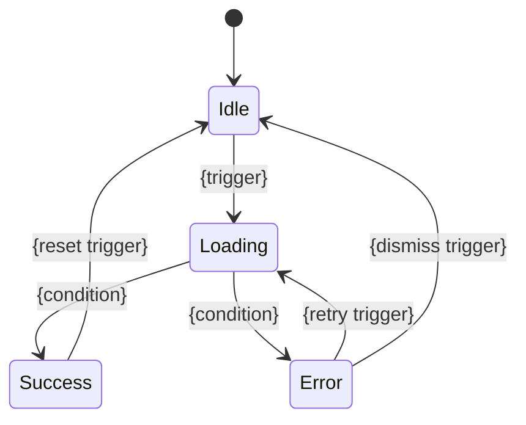
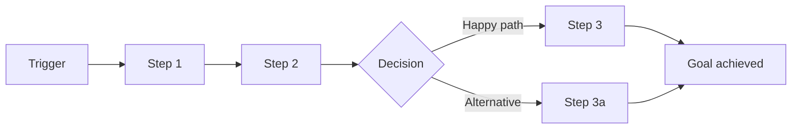

# User Prompt

I want a skill named `prd-analysis` that converts sparse product ideas into self-contained multi-file Product Requirements Documents (PRDs) optimized for AI coding agents. See @skills/prd-analysis.backup for the reference implementation.

# Expanded References

## @skills/prd-analysis.backup

_(directory; per-file cap 51200 B, total cap 524288 B, used 231780 B)_

**File tree:**

- SKILL.md (10181 bytes)
- architecture-template.md (35206 bytes)
- common/review-criteria.md (29883 bytes)
- document-mode.md (6881 bytes)
- evolve-mode.md (16319 bytes)
- evolve-readme-template.md (7008 bytes)
- feature-template.md (15807 bytes)
- generate/in-generate-review.md (4720 bytes)
- generate/writer-subagent.md (6761 bytes)
- journey-template.md (7280 bytes)
- output-discipline.md (2243 bytes)
- parallel-dispatch.md (3185 bytes)
- prd-template.md (6521 bytes)
- questioning-phases.md (55854 bytes)
- review/cross-reviewer-subagent.md (7391 bytes)
- review-checklist.md (21437 bytes)
- review-mode.md (12125 bytes)
- revise-mode.md (34739 bytes)
- scope-reference.md (4093 bytes)

**Contents:**

### SKILL.md

```
---
name: prd-analysis
description: "Use when the user needs to create a Product Requirements Document, perform product requirements analysis, convert brainstorming notes into structured specs, prepare requirements for AI coding agents, or evolve an existing PRD for a new iteration. Triggers: /prd-analysis, 'write a PRD', 'product requirements', 'requirements analysis', 'evolve PRD', 'new iteration'."
---

# PRD Analysis — AI-Coding-Ready Requirements

Generate PRDs as a **multi-file directory**. Each feature spec is a self-contained file — coding agents read only the file they need, minimizing context consumption.

## Scope

PRD captures **product-level decisions**: what to build, for whom, why, and at what priority. It does NOT specify implementation-level details — those belong to system-design. See `scope-reference.md` for the full PRD vs. system-design boundary table (loaded in authoring modes).

## Input Modes

```
/prd-analysis                          # interactive mode
/prd-analysis path/to/notes.md         # document-based mode
/prd-analysis --output docs/raw/prd/my-project  # custom output dir
/prd-analysis notes.md --output ./prd  # both
/prd-analysis --review docs/raw/prd/xxx/        # review existing PRD
/prd-analysis --revise docs/raw/prd/xxx/        # change management for existing PRD
/prd-analysis --evolve docs/raw/prd/xxx/        # incremental PRD for new iteration
/prd-analysis --evolve docs/raw/prd/xxx/ notes.md  # evolve with document input
```

## Mode Routing

After detecting the invocation mode, read the corresponding files before proceeding:

| Mode | Read These Files |
|------|-----------------|
| Initial analysis (no flags) | `questioning-phases.md`, `output-discipline.md` (load `scope-reference.md` on demand if scope boundary questions arise; load `review-checklist.md` on demand at Step 6) |
| Initial analysis + document input | `questioning-phases.md`, `document-mode.md`, `output-discipline.md` (load `scope-reference.md` on demand if scope boundary questions arise; load `review-checklist.md` on demand at Step 6) |
| `--review` | `review-mode.md`, `review-checklist.md`, `parallel-dispatch.md`, `output-discipline.md` |
| `--revise` | `revise-mode.md`, `parallel-dispatch.md`, `output-discipline.md` (load `scope-reference.md` and `review-checklist.md` on demand per revise-mode.md instructions) |
| `--evolve` | `evolve-mode.md`, `questioning-phases.md`, `output-discipline.md` (load `scope-reference.md` on demand if scope boundary questions arise; load `review-checklist.md` on demand at Evolve Step 4) |

Do NOT read files not listed for the current mode — they are not needed and waste context.

## Process

1. **Gather requirements** — interactive questioning or parse provided document
2. **Fill gaps** — ask targeted follow-up questions for missing info
3. **Generate PRD files** — using templates in this skill directory
4. **Cross-link** — backfill cross-references that couldn't exist during initial generation: journey Mapped Feature columns, feature Deps, feature Journey Context links, Cross-Journey Patterns "Addressed by Feature" column
5. **Write files** — write all generated files to disk (not yet committed)
6. **Self-review** — read each written file against the review checklist (see Review Checklist below), fix issues directly in files
7. **User review** — user reviews files in their editor, confirms or requests changes
8. **Commit** — commit all files to git

### Review Checklist

See `review-checklist.md` (loaded via mode routing for initial analysis, `--review`, `--revise`, and `--evolve` modes). Applied as step 6 of the process (after writing, before commit) — check each dimension and fix issues directly in the written files.

### Immutability Rule

Whether PRD files can be modified in place depends on their **downstream consumption state** — what has been built on top of them:

| Downstream State | Modify in Place? | Rationale |
|-----------------|-----------------|-----------|
| No design exists | Yes | No downstream consumers to break |
| Design exists, not implemented | Yes + append entry to `REVISIONS.md` (create the file if this is the first revision) | Design team needs the change record to update design accordingly |
| Implementation exists | No — create new version | Modifying in place would invalidate implemented code |

Steps 6-7 (self-review, user review) always occur before commit and are part of the creation process — modifying files during these steps is expected regardless of downstream state.

**Evolve mode note:** `--evolve` always creates a new directory (new date) — it never modifies the predecessor PRD. The predecessor is read-only input.

## Output Structure

```
{output-dir}/YYYY-MM-DD-{product-name}/
├── README.md                # Product overview + journey index + feature index + roadmap
├── REVISIONS.md             # Revision history (only present after first --revise)
├── journeys/
│   ├── J-001-{slug}.md      # Individual journey spec
│   └── ...
├── architecture.md          # INDEX ONLY (~50-80 lines) — diagram + links to topic files
├── architecture/            # Topic files — each standalone, independently readable
│   ├── tech-stack.md
│   ├── design-tokens.md     # (omit if no UI)
│   ├── navigation.md        # (omit if no UI)
│   ├── accessibility.md     # (omit if no UI)
│   ├── i18n.md
│   ├── data-model.md
│   ├── external-deps.md
│   ├── coding-conventions.md
│   ├── test-isolation.md
│   ├── security.md
│   ├── dev-workflow.md
│   ├── git-strategy.md
│   ├── code-review.md
│   ├── observability.md
│   ├── performance.md
│   ├── backward-compat.md   # (omit for v1)
│   ├── ai-agent-config.md
│   ├── deployment.md
│   ├── shared-conventions.md
│   ├── auth-model.md        # (omit if single-role)
│   ├── privacy.md           # (omit if no personal data)
│   └── nfr.md
├── features/
│   ├── F-001-{slug}.md      # Self-contained feature spec
│   └── ...
├── prototypes/              # Interactive prototypes (seed code for production)
│   ├── src/                 # Runnable prototype source
│   └── screenshots/         # Key state screenshots per feature
└── .reviews/                # Transient — not version-controlled (gitignore: docs/raw/prd/*/.reviews/)
    └── REVIEW-*.md          # Review findings produced by --review, consumed by --revise
```

Use templates: `prd-template.md` (README), `journey-template.md` (individual journeys), `architecture-template.md` (architecture index + topic files), and `feature-template.md` (feature specs). Evolve mode uses `evolve-readme-template.md` instead of `prd-template.md` for the README; all other templates are reused with the addition of the Change Annotation Convention (defined in `evolve-mode.md`).

**Agent consumption:** read README.md (~concise overview) → read one feature file → implement. Each feature file copies all needed context inline (data models, conventions, journey context), so the feature file alone is sufficient for implementation. Agents do NOT need to read architecture.md or architecture/ files — those are source-of-truth for the PRD author, not for coding agents. The feature file is the coding agent's only input.

**Evolve mode output** — only delta files present:

```
{output-dir}/YYYY-MM-DD-{product-name}/
├── README.md                # Incremental README (baseline ref + change summary + full indexes)
├── journeys/
│   ├── J-{NNN}-{slug}.md   # Only new or modified journeys
│   └── ...
├── architecture.md          # Incremental index (changed → local, unchanged → baseline ref)
├── architecture/
│   ├── {changed-topic}.md   # Only changed topic files
│   └── ...
├── features/
│   ├── F-{NNN}-{slug}.md   # New features, modified features, or tombstones (deprecated)
│   └── ...
├── prototypes/              # Only new/modified feature prototypes
│   ├── src/
│   └── screenshots/
```

**Agent consumption (evolve mode):** read incremental README.md → for a new/modified feature, read the local feature file (self-contained). For an unchanged feature, follow the `→ baseline` link to the predecessor PRD's feature file.

## Output Path

- **Default:** `docs/raw/prd/YYYY-MM-DD-{product-name}/`
- **Custom:** `--output <dir>` overrides the directory
- Confirm path with user before writing

## Key Principles

- **One question at a time** — don't overwhelm
- **MVP ruthlessly** — push back on scope creep
- **Minimal context** — agents read one small file, not a giant document
- **Copy, don't reference** — feature files include relevant data models, conventions, and journey context inline
- **README is a stable navigational index, REVISIONS.md tracks history** — README.md is the entry point and should not accumulate revision entries that destabilize navigation across versions. Revision history (entries written by `--revise`) lives in a sibling `REVISIONS.md`, created on first revision and grown thereafter. Both files coexist; the README's References section links to `REVISIONS.md` when present.
- **No ambiguity** — if a requirement can be interpreted two ways, clarify now
- **Omit empty sections** — if a section has nothing useful, skip it
- **Discipline files are non-optional** — `parallel-dispatch.md` (for `--review` / `--revise`) and `output-discipline.md` (all modes) are loaded at mode entry and their rules take precedence over any per-mode wording that conflicts.

## Next Steps Hint

After committing, print the following guidance to the user:

**Initial creation and revise mode:**
```
PRD complete: {output path}

Next steps:
  Interactive — /system-design {output path}
  Automated  — claude -p "generate system design based on {output path}" --auto
```

**Evolve mode** — use the cascade notification from Evolve Step 5 instead.
```

### architecture-template.md

```
# Architecture Template

Architecture documentation is split into a **concise index** (`architecture.md`) and **topic files** in the `architecture/` subdirectory. This minimizes token consumption — agents read only the index + the topic files relevant to their feature.

## Output Structure

```
{prd-dir}/
├── architecture.md              # Index only (~50-80 lines) — overview + links
└── architecture/
    ├── tech-stack.md            # Tech stack, frontend stack
    ├── design-tokens.md         # Design token system (omit if no UI)
    ├── navigation.md            # Navigation architecture (omit if no UI)
    ├── accessibility.md         # Accessibility baseline (omit if no UI)
    ├── i18n.md                  # Internationalization baseline
    ├── data-model.md            # Data model entities and relationships
    ├── external-deps.md         # External dependencies
    ├── coding-conventions.md    # Coding conventions (always present)
    ├── test-isolation.md        # Test isolation policies (always present)
    ├── security.md              # Security coding policy (always present)
    ├── dev-workflow.md          # Development workflow (always present)
    ├── git-strategy.md          # Git & branch strategy (always present)
    ├── code-review.md           # Code review policy (always present)
    ├── observability.md         # Observability requirements + tooling (always present)
    ├── performance.md           # Performance testing (always present)
    ├── backward-compat.md       # Backward compatibility (N/A for v1)
    ├── ai-agent-config.md       # AI agent configuration (always present)
    ├── deployment.md            # Deployment architecture
    ├── shared-conventions.md    # API conventions, error handling, testing strategy
    ├── auth-model.md            # Authorization model (omit if single-role)
    ├── privacy.md               # Privacy & compliance (omit if no personal data)
    └── nfr.md                   # Non-functional requirements + glossary
```

## architecture.md (Index Template)

architecture.md is **only an index** — it contains a high-level architecture diagram, a summary table linking to topic files, and nothing else. Target: ~50-80 lines.

```markdown
# Architecture: {Product Name}

## High-Level Architecture

{Mermaid diagram or concise textual description of component relationships}

## Architecture Index

| Topic | File | Summary |
|-------|------|---------|
| Tech Stack | [tech-stack.md](architecture/tech-stack.md) | {one-line: e.g. "Go backend, React frontend, PostgreSQL"} |
| Design Tokens | [design-tokens.md](architecture/design-tokens.md) | {one-line: e.g. "Colors, typography, spacing, motion tokens"} |
| Navigation | [navigation.md](architecture/navigation.md) | {one-line: e.g. "Site map, routes, breadcrumbs"} |
| Accessibility | [accessibility.md](architecture/accessibility.md) | {one-line: e.g. "WCAG 2.1 AA baseline"} |
| Internationalization | [i18n.md](architecture/i18n.md) | {one-line: e.g. "en + zh-CN, frontend + backend i18n"} |
| Data Model | [data-model.md](architecture/data-model.md) | {one-line: e.g. "User, Task, Agent, WorkSession entities"} |
| External Dependencies | [external-deps.md](architecture/external-deps.md) | {one-line: e.g. "Claude API, GitHub API, PostgreSQL"} |
| Coding Conventions | [coding-conventions.md](architecture/coding-conventions.md) | {one-line: e.g. "Code org, naming, error handling, logging, concurrency"} |
| Test Isolation | [test-isolation.md](architecture/test-isolation.md) | {one-line: e.g. "Resource isolation, race detection, parallel safety"} |
| Security | [security.md](architecture/security.md) | {one-line: e.g. "Input validation, secret handling, dependency scanning"} |
| Development Workflow | [dev-workflow.md](architecture/dev-workflow.md) | {one-line: e.g. "Prerequisites, CI gates, release process"} |
| Git & Branch Strategy | [git-strategy.md](architecture/git-strategy.md) | {one-line: e.g. "Rebase + ff-only, conventional commits"} |
| Code Review | [code-review.md](architecture/code-review.md) | {one-line: e.g. "Review dimensions, approvals, AI self-review"} |
| Observability | [observability.md](architecture/observability.md) | {one-line: e.g. "Mandatory events, health checks, SLOs, tooling"} |
| Performance Testing | [performance.md](architecture/performance.md) | {one-line: e.g. "Regression detection, budgets, load testing"} |
| Backward Compatibility | [backward-compat.md](architecture/backward-compat.md) | {one-line: e.g. "API versioning, schema evolution"} |
| AI Agent Configuration | [ai-agent-config.md](architecture/ai-agent-config.md) | {one-line: e.g. "CLAUDE.md structure, convention references"} |
| Deployment | [deployment.md](architecture/deployment.md) | {one-line: e.g. "Dev/staging/prod environments, CD pipeline"} |
| Shared Conventions | [shared-conventions.md](architecture/shared-conventions.md) | {one-line: e.g. "API format, error handling, testing strategy"} |
| Authorization | [auth-model.md](architecture/auth-model.md) | {one-line: e.g. "Admin/Member/Viewer roles, permission matrix"} |
| Privacy & Compliance | [privacy.md](architecture/privacy.md) | {one-line: e.g. "GDPR, data retention, user rights"} |
| NFRs & Glossary | [nfr.md](architecture/nfr.md) | {one-line: e.g. "Performance, security, scalability targets"} |

{Omit rows for topics that don't apply (e.g. no Design Tokens for backend-only products). Only files that exist get listed.}
```

## Topic File Templates

Each file below is a standalone document. Agents read only the files relevant to their feature.

---

### architecture/tech-stack.md

```markdown
# Tech Stack

| Layer | Technology | Rationale |
|-------|-----------|-----------|
| {e.g. Frontend / Backend / Database / Infrastructure} | {e.g. React + TypeScript / Go / PostgreSQL / AWS} | {why this choice} |

## Frontend Stack

{Omit if the product has no user-facing interface.}

| Concern | Choice | Version | Rationale |
|---------|--------|---------|-----------|
| UI Framework | {e.g. React} | {e.g. 19.x} | {why} |
| CSS Approach | {e.g. Tailwind CSS} | {e.g. 4.x} | {why} |
| Component Library | {e.g. Shadcn/ui} | {e.g. latest} | {why} |
| State Management | {e.g. Zustand} | {e.g. 5.x} | {why} |
| Build Tool | {e.g. Vite} | {e.g. 6.x} | {why} |
| Form Management | {e.g. React Hook Form} | {e.g. 7.x} | {why} |
| i18n | {e.g. react-i18next} | {e.g. 15.x} | {why} |
| E2E Testing | {e.g. Playwright} | {e.g. 1.x} | {why} |
```

---

### architecture/design-tokens.md

{Omit this file if the product has no user-facing interface.}

```markdown
# Design Token System

AI agents consume this file to generate consistent visual code.

## Colors

| Token | Value | Usage |
|-------|-------|-------|
| color.primary.50 | {lightest shade} | Lightest primary background |
| color.primary.500 | {mid shade} | Default primary |
| color.primary.900 | {darkest shade} | Darkest primary text |
| color.secondary.50–900 | {shades} | Secondary palette |
| color.neutral.50–950 | {shades} | Neutral palette |
| color.semantic.success | {value} | Success states |
| color.semantic.warning | {value} | Warning states |
| color.semantic.error | {value} | Error states, destructive actions |
| color.semantic.info | {value} | Informational |
| color.bg.default | {value} | Page background |
| color.bg.subtle | {value} | Card, section background |
| color.bg.muted | {value} | Disabled, inactive background |
| color.fg.default | {value} | Primary text |
| color.fg.muted | {value} | Secondary text |
| color.border.default | {value} | Default borders |

## Typography

| Token | Value |
|-------|-------|
| font.family.sans | {e.g. Inter, system-ui, -apple-system, sans-serif} |
| font.family.mono | {e.g. JetBrains Mono, Fira Code, monospace} |
| font.size.xs | 0.75rem (12px) |
| font.size.sm | 0.875rem (14px) |
| font.size.base | 1rem (16px) |
| font.size.lg | 1.125rem (18px) |
| font.size.xl | 1.25rem (20px) |
| font.size.2xl | 1.5rem (24px) |
| font.size.3xl | 1.875rem (30px) |
| font.size.4xl | 2.25rem (36px) |
| font.lineHeight.tight | 1.25 |
| font.lineHeight.normal | 1.5 |
| font.lineHeight.relaxed | 1.75 |
| font.weight.normal | 400 |
| font.weight.medium | 500 |
| font.weight.semibold | 600 |
| font.weight.bold | 700 |

## Spacing

| Token | Value | Usage |
|-------|-------|-------|
| spacing.0 | 0px | — |
| spacing.1 | 4px | Tight internal padding |
| spacing.2 | 8px | Default internal padding |
| spacing.3 | 12px | — |
| spacing.4 | 16px | Default gap, section padding |
| spacing.6 | 24px | Section margin |
| spacing.8 | 32px | Large section gap |
| spacing.12 | 48px | Page-level spacing |
| spacing.16 | 64px | Major section separation |

## Border, Shadow, Radius

| Token | Value |
|-------|-------|
| radius.none | 0px |
| radius.sm | 2px |
| radius.md | 6px |
| radius.lg | 8px |
| radius.xl | 12px |
| radius.full | 9999px |
| shadow.sm | 0 1px 2px 0 rgb(0 0 0 / 0.05) |
| shadow.md | 0 4px 6px -1px rgb(0 0 0 / 0.1) |
| shadow.lg | 0 10px 15px -3px rgb(0 0 0 / 0.1) |

## Breakpoints

| Token | Value | Target |
|-------|-------|--------|
| breakpoint.sm | 640px | Mobile landscape |
| breakpoint.md | 768px | Tablet |
| breakpoint.lg | 1024px | Desktop |
| breakpoint.xl | 1280px | Wide desktop |
| breakpoint.2xl | 1536px | Ultra-wide |

## Motion

| Token | Value | Usage |
|-------|-------|-------|
| motion.duration.fast | 150ms | Hover, toggle, micro-feedback |
| motion.duration.normal | 300ms | Panel open/close, page transition |
| motion.duration.slow | 500ms | Complex entrance animation |
| motion.easing.default | cubic-bezier(0.4, 0, 0.2, 1) | General purpose |
| motion.easing.in | cubic-bezier(0.4, 0, 1, 1) | Exit animations |
| motion.easing.out | cubic-bezier(0, 0, 0.2, 1) | Entrance animations |
| motion.easing.inOut | cubic-bezier(0.4, 0, 0.2, 1) | Symmetric transitions |

## Z-Index

| Token | Value | Usage |
|-------|-------|-------|
| z.base | 0 | Default content |
| z.dropdown | 10 | Dropdown menus |
| z.sticky | 20 | Sticky headers |
| z.overlay | 30 | Overlays, backdrops |
| z.modal | 40 | Modal dialogs |
| z.popover | 50 | Popovers, tooltips |
| z.toast | 60 | Toast notifications |

{Values above are defaults — replace with project-specific values during PRD Phase 3.}

**Note:** Values shown are common defaults (Tailwind CSS defaults for web). Replace with project-specific values confirmed during Phase 3 questioning. These are examples, not prescriptions.
```

---

### architecture/navigation.md

{Omit this file if the product has no user-facing interface or has only a single view. Use the Web section for web/desktop apps, or the TUI section for terminal apps — not both.}

```markdown
# Navigation Architecture

## Web Navigation

{Omit for TUI products.}

### Site Map

{Mermaid diagram showing page hierarchy derived from journey Screen/View names.}

### Navigation Layers

| Layer | Type | Content | Behavior |
|-------|------|---------|----------|
| Global | {sidebar / top nav / bottom tab} | {nav items} | {always visible / collapses on mobile} |
| Section | {tabs / sub-nav / breadcrumb} | {context-dependent items} | {appears within specific views} |
| Contextual | {inline links / action menus} | {in-content navigation} | {embedded in page content} |

### Route Definitions

| View (from journeys) | Route Pattern | Params | Query Params | Auth | Layout |
|----------------------|--------------|--------|-------------|------|--------|
| {view name} | {/path/:param} | {param: type} | {?key=default} | {required / public} | {main / minimal / none} |

### Deep Linking & State Restoration

| View | Shareable URL | State in URL | Restoration Behavior |
|------|-------------|-------------|---------------------|
| {view name} | Yes / No | {what state is encoded} | {how state is restored} |

**Breadcrumb Strategy:** {auto-generated from route hierarchy / manual per-view / none}

## TUI Navigation

{Omit for web products.}

### Screen Flow

{Mermaid diagram showing CLI entry points and TUI screen transitions.}

### Command Structure

| Command | Entry Point | Screen/View | Exit |
|---------|-------------|-------------|------|
| {e.g. `app run --input <path>`} | CLI | {TUI screen name} | {Ctrl+C / completion} |

### TUI Internal Navigation

| From | Action | To | Notes |
|------|--------|----|-------|
| {screen/panel} | {key or action} | {target screen/panel} | {e.g. focus changes} |

**Focus Order:** {e.g. main area → input → sidebar (Tab cycle)}
```

---

### architecture/accessibility.md

{Omit this file if the product has no user-facing interface.}

```markdown
# Accessibility Baseline

| Aspect | Requirement |
|--------|------------|
| WCAG Level | {2.1 AA / 2.1 AAA} |
| Keyboard Navigation | All interactive elements reachable via Tab; logical tab order; no keyboard traps |
| Screen Reader | All images have alt text; form fields have associated labels; dynamic content uses ARIA live regions |
| Focus Indicators | Visible focus ring on all interactive elements; minimum 3:1 contrast ratio |
| Color Contrast | Text: minimum 4.5:1 (normal) / 3:1 (large); UI components: minimum 3:1 |
| Motion | Respect `prefers-reduced-motion`; no auto-playing animations longer than 5 seconds |
| Touch Targets | Minimum 44x44px for touch interfaces |
| Error Identification | Errors identified by more than color alone (icon + text) |

{Individual features may add requirements beyond this baseline in their Accessibility sub-section.}
```

---

### architecture/i18n.md

{Omit this file if the product is single-language only and explicitly confirmed as such.}

```markdown
# Internationalization Baseline

## Shared

| Aspect | Requirement |
|--------|------------|
| Supported Languages | {e.g. en, zh-CN, ja} |
| Default Language | {e.g. en} |
| Date/Time Format | {locale-aware via Intl.DateTimeFormat / date-fns with locale} |
| Number Format | {locale-aware via Intl.NumberFormat} |
| Pluralization | {ICU MessageFormat / library-specific} |

## Frontend

{Omit if no user-facing interface.}

| Aspect | Requirement |
|--------|------------|
| RTL Support | {required / not required} |
| Text Externalization | All user-visible strings use i18n keys; no hardcoded text in components |
| Key Convention | {e.g. `{feature}.{section}.{element}`} |
| Content Direction | {LTR-only / bidirectional} |

## Backend

{Omit if single-language backend.}

| Aspect | Requirement |
|--------|------------|
| Locale Resolution | {e.g. Accept-Language header → user profile preference → default} |
| API Error Messages | {localized per request locale / fixed language} |
| Validation Messages | {localized per request locale / error codes only} |
| Notification Content | {localized per recipient preference / fixed language} |
| Timezone Handling | {e.g. store UTC, convert per user timezone on output} |
| Locale-Aware Formatting | {API returns formatted values per locale / raw values} |
```

---

### architecture/data-model.md

```markdown
# Data Model

## {EntityName}

| Field | Type | Constraints | Description |
|-------|------|-------------|-------------|
| ... | ... | ... | ... |

## Relationships

- {EntityA} 1:N {EntityB} — {why}
```

---

### architecture/external-deps.md

```markdown
# External Dependencies

| Service | Purpose | API Style | Timeout | Failure Mode | Fallback |
|---------|---------|-----------|---------|-------------|----------|
| {name} | {what it does for us} | REST / gRPC / SDK | {ms} | {what happens when down} | {degraded behavior or retry} |
```

---

### architecture/coding-conventions.md

```markdown
# Coding Conventions

Technology-agnostic policies. System-design translates these into stack-specific patterns.

## Code Organization

| Aspect | Policy |
|--------|--------|
| Layering strategy | {e.g. domain/service/infrastructure separation} |
| Module/package structure | {e.g. one package per bounded context} |
| File organization | {e.g. one primary type per file} |

## Naming Conventions

| Element | Convention | Example |
|---------|-----------|---------|
| Modules/packages | {e.g. lowercase, singular nouns} | {e.g. `scheduler`} |
| Types/classes | {e.g. PascalCase, descriptive nouns} | {e.g. `TaskScheduler`} |
| Interfaces | {e.g. behavior-describing names} | {e.g. `Scheduler`} |
| Functions/methods | {e.g. verb-first for actions} | {e.g. `CreateWorktree()`} |
| Constants | {e.g. ALL_CAPS or PascalCase per language} | — |
| Files | {e.g. snake_case matching primary type} | {e.g. `task_scheduler.go`} |

## Interface & Abstraction Design

| Aspect | Policy |
|--------|--------|
| When to define interfaces | {e.g. at module boundaries and for external dependencies} |
| Interface location | {e.g. defined by the consumer, not the provider} |
| Interface size | {e.g. prefer small, focused interfaces (1-3 methods)} |
| Concrete vs abstract | {e.g. start concrete; extract interface when needed} |

## Dependency Wiring

| Aspect | Policy |
|--------|--------|
| Injection method | {e.g. constructor injection} |
| Global mutable state | {e.g. prohibited} |
| Initialization order | {e.g. main/entry point constructs the dependency graph} |

## Error Handling & Propagation

| Aspect | Policy |
|--------|--------|
| Error context | {e.g. all errors must include context} |
| Error categories | {e.g. validation / domain / infrastructure / transient} |
| Cross-boundary translation | {e.g. infrastructure errors translated at layer boundaries} |
| Panic / unhandled exception policy | {e.g. recovered at goroutine entry points} |

## Logging

| Aspect | Policy |
|--------|--------|
| Format | {e.g. structured key-value pairs} |
| Levels | {e.g. ERROR/WARN/INFO/DEBUG with defined usage} |
| Sensitive data | {e.g. secrets, tokens, PII must never appear in logs} |
| Per-component logging | {e.g. each component logs with component identifier} |

## Configuration Access

| Aspect | Policy |
|--------|--------|
| Access pattern | {e.g. configuration injected at construction time} |
| Validation | {e.g. all config validated at startup; fail fast} |
| Defaults | {e.g. every config key has a sensible default} |

## Concurrency

| Aspect | Policy |
|--------|--------|
| Lifecycle management | {e.g. all long-running tasks accept cancellation token} |
| Shared state | {e.g. prefer message-passing over shared memory with locks} |
| Resource cleanup | {e.g. all resources released in cleanup/defer/finally path} |

## Frontend Conventions

{Omit if no user-facing interface.}

| Aspect | Policy |
|--------|--------|
| Component structure | {e.g. one component per file} |
| State management scope | {e.g. local state for UI-only; shared for cross-component} |
| Styling approach | {e.g. all values reference design tokens; no inline raw values} |
```

---

### architecture/test-isolation.md

```markdown
# Test Isolation

Policies ensuring tests are reliable when run in parallel, across worktrees, or in CI.

| Aspect | Policy |
|--------|--------|
| Resource isolation | {e.g. every test creates its own temporary resources} |
| Global mutable state | {Prohibited — all state passed as parameters} |
| Port binding | {e.g. bind to port 0; hardcoded ports forbidden} |
| File system | {e.g. use test framework's temp directory; no writes to project root} |
| External processes | {e.g. register cleanup to terminate on test completion} |
| Race detection | {e.g. enabled in CI; this is a gate, not optional} |
| Timeouts | {e.g. unit: 30s; integration: 5m; no unbounded tests} |
| Directory independence | {Tests must work from any worktree or checkout location} |
| Parallel classification | {e.g. parallel-safe by default; serial tests explicitly marked} |
```

---

### architecture/security.md

```markdown
# Security Coding Policy

| Aspect | Policy |
|--------|--------|
| Input validation | {e.g. all external input validated at system boundaries} |
| Boundary definition | {e.g. HTTP handlers, CLI parsers, file readers, message consumers} |
| Secret handling | {e.g. never in source code, logs, error messages, or VCS history} |
| Dependency scanning | {e.g. vulnerability scanning in CI; critical CVEs block merge} |
| Injection prevention | {e.g. never concatenate user input into commands/queries/templates} |
| Auth enforcement | {e.g. every entry point independently verifies permissions} |
| Sensitive data in transit | {e.g. all external connections use TLS} |
| Sensitive data at rest | {e.g. passwords hashed; encryption for PII — or N/A} |
```

---

### architecture/dev-workflow.md

```markdown
# Development Workflow

| Aspect | Specification |
|--------|---------------|
| Prerequisites | {e.g. Go 1.23+, Git 2.20+, Claude Code latest} |
| Local setup | {e.g. `make setup` — one-command bootstrap} |
| CI gates (blocking) | {e.g. lint → build → test with race detection → benchmark} |
| CI gates (non-blocking) | {e.g. coverage report, dependency audit} |
| Build matrix | {e.g. Linux amd64 + macOS arm64} |
| Versioning | {e.g. semver; tags trigger release builds} |
| Changelog | {e.g. conventional commits → auto-generated} |
| Release testing | {e.g. full test suite + E2E on release candidate} |
| Dependency policy | {e.g. new deps require review; MIT/Apache/BSD license} |
```

---

### architecture/git-strategy.md

```markdown
# Git & Branch Strategy

| Aspect | Policy |
|--------|--------|
| Branch naming | {e.g. `feature/{task-id}-{slug}`, `fix/{issue-id}-{slug}`} |
| Merge strategy | {e.g. rebase + fast-forward only; enforced via branch protection} |
| Branch protection | {e.g. main protected: require PR, CI pass, N approvals} |
| PR conventions | {e.g. one PR per feature; body must include summary + test plan} |
| Commit message format | {e.g. Conventional Commits with task/issue ID} |
| Stale branch cleanup | {e.g. merged branches deleted; unmerged > 30 days flagged} |
```

---

### architecture/code-review.md

```markdown
# Code Review Policy

| Aspect | Policy |
|--------|--------|
| Review dimensions | {e.g. correctness, security, test coverage, performance, readability} |
| Approval requirements | {e.g. 1 for standard; 2 for security-sensitive} |
| Review SLA | {e.g. started within 1 business day} |
| Automated checks | {e.g. lint, type check, test pass, coverage threshold} |
| Human review focus | {e.g. architecture fit, business logic, edge case coverage} |
| Feedback severity | {e.g. blocker / suggestion / nit} |
| AI agent self-review | {e.g. run lint + test + build before requesting review} |
```

---

### architecture/observability.md

```markdown
# Observability

## Requirements (Policy)

What must be observable, regardless of tooling.

### Mandatory Logging Events

| Event Category | What Must Be Logged | Required Fields |
|---------------|--------------------|-----------------| 
| State transitions | {e.g. every domain entity state change} | {e.g. timestamp, component, entity_id, from_state, to_state} |
| External calls | {e.g. every call to external service} | {e.g. timestamp, service, operation, duration_ms, success} |
| Authentication | {e.g. every auth attempt} | {e.g. timestamp, identity, action, result} |
| Errors | {e.g. every error at ERROR level} | {e.g. timestamp, component, error_type, message} |

### Health Checks

| Component | Health Definition | Check Interval |
|-----------|------------------|---------------|
| {component} | {e.g. can accept requests, deps reachable} | {e.g. 30s} |

### Key Metrics & SLOs

| Metric | Description | SLO Target |
|--------|-------------|-----------|
| {metric} | {description} | {target} |

### Alerting Rules

| Condition | Severity | Recipient | Escalation |
|-----------|----------|-----------|-----------|
| {condition} | {critical / warning} | {recipient} | {escalation path} |

### Audit Trail

{Omit if no operations require immutable audit logging.}

| Operation | What Is Recorded | Retention |
|-----------|-----------------|-----------|
| {operation} | {who, what, when} | {retention period} |

## Tooling

| Concern | Tool / Approach | Standard |
|---------|----------------|----------|
| Logging | {library + destination} | {log level policy} |
| Metrics | {collection method} | {key metrics to expose} |
| Tracing | {distributed tracing tool} | {when to create spans} |
| Alerting | {alerting tool + channel} | {alert conditions} |
```

---

### architecture/performance.md

```markdown
# Performance Testing

| Aspect | Policy |
|--------|--------|
| Regression detection | {e.g. benchmarks in CI; merge blocked if p95 degrades > 10%} |
| Performance budgets | {e.g. API p95 < 200ms; TUI render < 16ms; startup < 3s} |
| Load testing | {e.g. required before release; N agents × M tasks} |
| Profiling | {e.g. required before merging P0 features} |
| Resource limits | {e.g. total memory for 5 agents < 2GB} |
```

---

### architecture/backward-compat.md

{Omit for v1/MVP with no existing consumers. Note the intended future versioning strategy.}

```markdown
# Backward Compatibility

| Aspect | Policy |
|--------|--------|
| API versioning | {e.g. URL prefix `/v1/`; old version maintained 6 months} |
| Breaking change definition | {e.g. removing/renaming fields, changing types, altering defaults} |
| Breaking change process | {e.g. deprecation notice + 2 release cycles before removal} |
| Data schema evolution | {e.g. additive-only; destructive changes require migration scripts} |
| Config file evolution | {e.g. new keys with defaults; removed keys ignored with warning} |
```

---

### architecture/ai-agent-config.md

```markdown
# AI Agent Configuration

## Instruction Files

| File | Purpose | Maintained By |
|------|---------|---------------|
| {e.g. `CLAUDE.md`} | {Primary agent instruction file} | {e.g. updated on convention changes} |
| {e.g. `AGENTS.md`} | {Multi-agent coordination} | {e.g. updated when roles change} |

## Structure Policy

Agent instruction files must be **concise indexes** (~200 lines max), not monolithic documents.

| Content Type | Placement | Example |
|-------------|-----------|---------|
| Project overview & purpose | Direct in instruction file | "This is a TUI app for multi-agent collaboration" |
| Key commands (build, test, lint) | Direct in instruction file | `go build ./...`, `go test -race ./...` |
| Directory structure summary | Direct in instruction file | Brief tree of top-level dirs |
| Coding conventions | **Reference** to convention files | "See `.golangci-lint.yml`" |
| Test isolation rules | **Reference** to test helpers | "See `internal/testutil/`" |
| Security policies | **Reference** to security config | "See `.github/workflows/security.yml`" |
| Architecture details | **Reference** to docs | "See `docs/`" |

## Maintenance Policy

| Trigger | Action |
|---------|--------|
| Convention change | Update references if file paths changed |
| Project structure change | Update directory structure summary |
| New tooling adopted | Add command + reference |
| New agent role | Add role-specific section or file |

## Multi-Agent Coordination

{Omit for single-agent projects.}

| Aspect | Policy |
|--------|--------|
| Shared instructions | {e.g. all agents read same CLAUDE.md} |
| Role-specific instructions | {e.g. reviewer gets security checklist} |
| Convention discovery | {e.g. CLAUDE.md → convention file references → read files} |

## Context Budget Priority

1. Build/test/lint commands
2. File/directory structure
3. Naming conventions
4. Import patterns
5. Error handling patterns
6. Architecture constraints
```

---

### architecture/deployment.md

```markdown
# Deployment Architecture

## Environments

| Environment | Purpose | Users | Infrastructure | URL / Access | Notes |
|-------------|---------|-------|---------------|-------------|-------|
| Development | {local dev and debug} | {developers, AI agents} | {e.g. local / Docker} | {N/A} | {e.g. hot reload} |
| Testing / CI | {automated testing} | {CI system} | {e.g. ephemeral containers} | {N/A} | {e.g. clean state per run} |
| Staging | {pre-production} | {QA, stakeholders} | {e.g. mirrors prod} | {URL} | {e.g. anonymized data} |
| Production | {live service} | {end users} | {e.g. cloud} | {URL} | {e.g. autoscaling} |

{Omit environments that don't apply.}

## Local Development Setup

| Aspect | Policy |
|--------|--------|
| Reproducibility | {e.g. single-command setup; must work from clean checkout} |
| Service dependencies | {e.g. containerized / in-memory stubs / external} |
| Environment variables | {e.g. `.env.example` committed with documented defaults} |
| Data seeding | {e.g. idempotent seed script} |

## Environment Parity

| Aspect | Policy |
|--------|--------|
| Parity level | {e.g. staging mirrors production at smaller scale} |
| Acceptable differences | {e.g. dev uses SQLite instead of PostgreSQL} |
| Configuration consistency | {e.g. same config keys across environments; only values differ} |

## Configuration Management

| Aspect | Policy |
|--------|--------|
| Configuration source | {e.g. environment variables} |
| Secret management | {e.g. via secret manager; never in VCS} |
| Validation | {e.g. validates at startup; fails fast} |
| Template | {e.g. `.env.example` committed} |

## Data Migration

{Omit if no persistent data that evolves.}

| Aspect | Policy |
|--------|--------|
| Migration tool | {e.g. versioned migration scripts} |
| Reversibility | {e.g. every migration has rollback} |
| Seed data | {e.g. dev/test use seed script} |

## Deployment Pipeline (CD)

{Omit for local-only tools.}

| Aspect | Policy |
|--------|--------|
| Deployment trigger | {e.g. staging: auto on merge; prod: manual + tag} |
| Deployment strategy | {e.g. rolling / blue-green / canary} |
| Rollback strategy | {e.g. redeploy previous; database rollback} |
| Zero-downtime | {e.g. required for production} |
| Smoke tests | {e.g. health check + critical path after deploy} |

## Environment Isolation

| Aspect | Policy |
|--------|--------|
| Multi-instance isolation | {e.g. independent envs without conflicts} |
| Port allocation | {e.g. configurable via env vars; no hardcoded ports} |
| Database isolation | {e.g. separate instance/schema per dev; ephemeral per CI} |
| Namespace separation | {e.g. container names prefixed with dev/agent ID} |

## Infrastructure as Code

{Omit if trivially simple or manually provisioned for MVP.}

| Aspect | Policy |
|--------|--------|
| IaC requirement | {e.g. all infra defined declaratively} |
| Scope | {e.g. containers, orchestration, cloud resources} |
| Environment parameterization | {e.g. same templates; differences as parameter values} |
```

---

### architecture/shared-conventions.md

```markdown
# Shared Conventions

## API Conventions

| Aspect | Convention |
|--------|-----------|
| Format | {e.g. JSON, content-type application/json} |
| Authentication | {e.g. Bearer JWT in Authorization header} |
| Pagination | {e.g. cursor-based with `?cursor=`} |
| Versioning | {e.g. URL prefix /v1/} |
| Rate limiting | {e.g. 100 req/min per user, 429 response} |

## Error Handling

| Aspect | Convention |
|--------|-----------|
| Error response format | {e.g. RFC 7807 Problem Details} |
| Error codes | {e.g. `AUTH_EXPIRED`, `RESOURCE_NOT_FOUND`} |
| Client errors (4xx) | {e.g. specific error code + message, do not retry} |
| Server errors (5xx) | {e.g. generic message + request_id, log full stack} |
| Validation errors | {e.g. 422 with field-level errors array} |

## Testing Strategy

| Layer | Framework | Scope | Coverage Target |
|-------|-----------|-------|----------------|
| Unit | {e.g. Jest / pytest / Go testing} | {pure logic} | {e.g. 80%} |
| Integration | {e.g. Supertest / Testcontainers} | {API, DB} | {critical paths} |
| E2E | {e.g. Playwright / Cypress} | {user journeys} | {happy + key error paths} |
```

---

### architecture/auth-model.md

{Omit for single-role products or products with no access control.}

```markdown
# Authorization Model

## Roles

| Role | Description | Persona |
|------|-------------|---------|
| {e.g. Admin} | {what this role can do} | {which persona} |
| {e.g. Member} | {what this role can do} | {which persona} |

## Permission Matrix

| Feature | {Role 1} | {Role 2} | {Role 3} |
|---------|----------|----------|----------|
| F-001 {name} | Full | Read-only | No access |

**Data Visibility:** {e.g. "Users see own data; Admins see org-wide"}
```

---

### architecture/privacy.md

{Omit for internal tools with no personal data.}

```markdown
# Privacy & Compliance

| Aspect | Requirement |
|--------|------------|
| Regulations | {e.g. GDPR, CCPA, HIPAA — or "None"} |
| Personal data entities | {which entities contain PII} |
| User rights | {e.g. export, deletion, correction} |
| Data retention | {e.g. "2 years after account deletion"} |
| Consent | {e.g. "Explicit opt-in for analytics"} |
```

---

### architecture/nfr.md

```markdown
# Non-functional Requirements

| ID | Category | Requirement |
|----|----------|------------|
| NFR-001 | Performance | {p95 latency, throughput} |
| NFR-002 | Security | {auth method, data protection} |
| NFR-003 | Scalability | {concurrent users, growth rate} |
| NFR-004 | Reliability | {SLA, backup strategy} |
| NFR-005 | Internationalization | {supported languages — omit if single-language} |

# Glossary

| Term | Definition |
|------|-----------|
| ... | ... |
```

---

## Key Rules

- **architecture.md is an index only** (~50-80 lines) — it contains the high-level architecture diagram and a table linking to topic files. No section content lives in architecture.md
- Topic files live in `architecture/` subdirectory — each file is standalone and independently readable
- Feature files **copy relevant data models and conventions inline** — they reference the source file for traceability but don't require agents to read it
- Omit topic files that don't apply — no empty files. The architecture.md index only lists files that exist
- Frontend-related files (design-tokens.md, navigation.md, accessibility.md) are omitted for products with no user-facing interface
- i18n.md: Frontend section omitted for no UI; Backend section omitted for single-language backends; entire file omitted only if single-language AND no multi-locale consumers
- **coding-conventions.md**, **test-isolation.md**, **dev-workflow.md**, **security.md**, **git-strategy.md**, **code-review.md**, **observability.md**, **performance.md**, and **ai-agent-config.md** are always present
- **backward-compat.md** is omitted for v1/MVP — note intended strategy in the file or skip entirely
- **Observability requirements** (policy) and **observability tooling** are combined in one file (observability.md) with clear section separation
- All convention files contain **policies** not **implementation patterns** — system-design translates to stack-specific patterns
- Feature files copy relevant policies into their "Relevant conventions" section, citing the source file path
- Design Token values are defaults — replace during PRD Phase 3. Feature specs reference tokens by semantic name, never raw values
```

### common/review-criteria.md

```
# Review Criteria — PRD Analysis

Each criterion is one YAML block. Narrative text between blocks is for humans; the criteria-extractor script parses only the YAML code fences. Severities: `critical` > `error` > `warning` > `info`.

Checker types:
- `script` — deterministic check; runs via `scripts/<script_path>`; issues emitted as JSON
- `llm` — semantic judgment; runs in `cross-reviewer-subagent` / `adversarial-reviewer-subagent`
- `hybrid` — script extracts evidence (concept list, reference map, etc.) and LLM judges the output

`conflicts_with` declares known rule conflicts; `priority` arbitrates (lower wins).

---

## Layer 1 — Structural & Format (script-only)

### CR-001 header-metadata-complete

Every leaf (README.md, journey file, feature file, architecture topic) must have the minimum header metadata required by its template. For journey/feature files this is the filename pattern (`F-{NNN}-{slug}.md` / `J-{NNN}-{slug}.md` supplies `id` + `slug`) plus the inline bold header fields (e.g. feature files need `**Priority:** ... **Effort:** ...` under the `# F-NNN: ...` heading). These templates use inline header fields, not YAML frontmatter delimited by `---`.

```yaml
- id: CR-001
  name: "header-metadata-complete"
  version: 1.0.0
  checker_type: script
  script_path: scripts/check-frontmatter.sh
  severity: error
  conflicts_with: []
  priority: 1
```

### CR-002 leaf-size-limit

Single-leaf files must not exceed 600 lines. Oversized files indicate missing decomposition (e.g. a feature file bundling three features). README.md and architecture.md (both are indexes) have a 200-line soft cap.

```yaml
- id: CR-002
  name: "leaf-size-limit"
  version: 1.0.0
  checker_type: script
  script_path: scripts/check-frontmatter.sh
  severity: warning
  conflicts_with: []
  priority: 2
```

### CR-003 wikilinks-resolve

Every internal markdown link (`[...](./path)`, `[...](../path)`, `[...](journeys/J-*.md)`, etc.) must resolve to an existing file in the artifact. Broken cross-references destroy the self-contained property.

```yaml
- id: CR-003
  name: "wikilinks-resolve"
  version: 1.0.0
  checker_type: script
  script_path: scripts/check-wikilinks.sh
  severity: error
  conflicts_with: []
  priority: 1
```

### CR-004 index-consistency

`README.md` and `architecture.md` index tables must list every file in `journeys/`, `features/`, and `architecture/` respectively, and list no entries that lack a corresponding file.

```yaml
- id: CR-004
  name: "index-consistency"
  version: 1.0.0
  checker_type: script
  script_path: scripts/check-index-consistency.sh
  severity: error
  conflicts_with: []
  priority: 1
```

### CR-005 changelog-consistency

`CHANGELOG.md` entries and `.review/versions/<N>.md` files must be 1:1 with matching `delivery_id`, `change_summary`, and `affected_leaves`. `delivery_id` must be monotonic with no gaps.

```yaml
- id: CR-005
  name: "changelog-consistency"
  version: 1.0.0
  checker_type: script
  script_path: scripts/check-changelog-consistency.sh
  severity: error
  conflicts_with: []
  priority: 1
```

### CR-006 id-uniqueness

Journey IDs (`J-001`, `J-002`, ...), feature IDs (`F-001`, ...) must be unique and monotonic within the artifact. In evolve-mode new files must start above baseline `max(id)`.

```yaml
- id: CR-006
  name: "id-uniqueness"
  version: 1.0.0
  checker_type: script
  script_path: scripts/check-frontmatter.sh
  severity: error
  conflicts_with: []
  priority: 1
```

### CR-007 no-todo-markers

No `TODO`, `TBD`, `FIXME`, `[placeholder]`, or `<fill in>` tokens in committed files — these indicate incomplete authoring.

```yaml
- id: CR-007
  name: "no-todo-markers"
  version: 1.0.0
  checker_type: script
  script_path: scripts/check-frontmatter.sh
  severity: warning
  conflicts_with: []
  priority: 2
```

---

## Layer 2 — Traceability (hybrid)

### CR-010 traceability-goal-to-feature

Chain `Goal → Journey → Touchpoint → User Story → Feature → Analytics` must be unbroken. Every persona has at least one journey; every touchpoint maps to ≥1 feature; every feature maps back to ≥1 touchpoint (no orphan features); cross-journey patterns each have an addressing feature.

```yaml
- id: CR-010
  name: "traceability-goal-to-feature"
  version: 1.0.0
  checker_type: hybrid
  script_path: scripts/check-frontmatter.sh
  severity: error
  conflicts_with: []
  priority: 1
```

### CR-011 metrics-have-verification

Every README `Goal` metric has a `baseline` and `measurement method`; every journey metric has a Verification entry stating manual/automated/monitoring plus pass/fail criteria.

```yaml
- id: CR-011
  name: "metrics-have-verification"
  version: 1.0.0
  checker_type: llm
  severity: error
  conflicts_with: []
  priority: 2
```

### CR-012 evidence-source-stated

Every major product decision (Goals, Feature priority, Target metric) traces to an evidence source (user research, analytics, feedback) OR is labeled `Assumption` with confidence level. Assumption-heavy decisions are echoed in the Risks table as validation risks.

```yaml
- id: CR-012
  name: "evidence-source-stated"
  version: 1.0.0
  checker_type: llm
  severity: warning
  conflicts_with: []
  priority: 2
```

### CR-013 risk-mitigation-completeness

Every High-likelihood OR High-impact risk has a mitigation; affected features list the risk in their Risks & Mitigations section; compliance/privacy risks are covered if personal data is handled.

```yaml
- id: CR-013
  name: "risk-mitigation-completeness"
  version: 1.0.0
  checker_type: llm
  severity: error
  conflicts_with: []
  priority: 2
```

### CR-014 priority-phase-alignment

Every P0 feature serves a core-happy-path touchpoint; Roadmap phases align (P0→Phase 1, P1→Phase 2, P2→Phase 3); dependency graph does not contradict phase ordering (no P0 depending on P1 feature).

```yaml
- id: CR-014
  name: "priority-phase-alignment"
  version: 1.0.0
  checker_type: llm
  severity: error
  conflicts_with: []
  priority: 2
```

### CR-015 competitive-context-present

A Competitive Landscape section exists with ≥1 alternative (or is explicitly marked N/A for internal tools). Differentiation statement is present. Table-stakes features are identified.

```yaml
- id: CR-015
  name: "competitive-context-present"
  version: 1.0.0
  checker_type: llm
  severity: warning
  conflicts_with: []
  priority: 3
```

---

## Layer 3 — Self-Containment (llm)

### CR-020 feature-self-contained

Each feature file contains all context needed for a coding agent: relevant data models (copied inline, not referenced), applicable conventions (copied from `architecture/*.md`), permission model, journey context. A reader of one feature file alone can implement the feature.

```yaml
- id: CR-020
  name: "feature-self-contained"
  version: 1.0.0
  checker_type: llm
  severity: error
  conflicts_with: []
  priority: 2
```

### CR-021 no-external-file-references-in-feature

Feature files must not say "see architecture.md" or "per shared conventions" — the text must be copied inline. Cross-file hyperlinks to journeys and other features are allowed (they are navigational, not context-shifting).

```yaml
- id: CR-021
  name: "no-external-file-references-in-feature"
  version: 1.0.0
  checker_type: hybrid
  script_path: scripts/check-frontmatter.sh
  severity: warning
  conflicts_with: []
  priority: 2
```

---

## Layer 4 — Testability (llm)

### CR-030 ac-observable

Every Acceptance Criterion is precise enough to write a test assertion. Forbidden vague verbs: "correctly handles", "properly displays", "works as expected", "appropriately responds".

```yaml
- id: CR-030
  name: "ac-observable"
  version: 1.0.0
  checker_type: llm
  severity: error
  conflicts_with: []
  priority: 1
```

### CR-031 edge-case-given-when-then

Every Edge Case uses Given/When/Then and maps to an automated-test specification.

```yaml
- id: CR-031
  name: "edge-case-given-when-then"
  version: 1.0.0
  checker_type: llm
  severity: error
  conflicts_with: []
  priority: 1
```

### CR-032 non-behavioral-criterion-present

Every feature with non-trivial state or integration has ≥1 non-behavioral criterion (performance, concurrency, resource limit, security). Saturation rule: one NR per distinct operational characteristic is sufficient — do NOT demand per-endpoint p95.

```yaml
- id: CR-032
  name: "non-behavioral-criterion-present"
  version: 1.0.0
  checker_type: llm
  severity: warning
  conflicts_with: []
  priority: 2
```

### CR-033 authorization-edge-case

Every feature with a `Permission` line has ≥1 edge case testing unauthorized access. Saturation rule: one unauthorized-access EC per permission boundary (role × scope) is sufficient — do NOT enumerate every role × workspace × org combination.

```yaml
- id: CR-033
  name: "authorization-edge-case"
  version: 1.0.0
  checker_type: llm
  severity: error
  conflicts_with: []
  priority: 2
```

### CR-034 journey-error-path-covered

Every journey's Error & Recovery Paths row maps to ≥1 feature's Edge Case or Acceptance Criterion.

```yaml
- id: CR-034
  name: "journey-error-path-covered"
  version: 1.0.0
  checker_type: llm
  severity: error
  conflicts_with: []
  priority: 2
```

### CR-035 cross-feature-integration-ac

Features with `Dependencies: depends-on` must have ≥1 integration-level AC referencing the upstream feature's output (e.g. "Given F-003 has produced X, when F-005 consumes it, then ...").

```yaml
- id: CR-035
  name: "cross-feature-integration-ac"
  version: 1.0.0
  checker_type: llm
  severity: error
  conflicts_with: []
  priority: 2
```

### CR-036 journey-e2e-scenarios

Every multi-touchpoint journey has an E2E Test Scenarios table covering happy / alternative / error paths with features exercised + expected outcomes. Single-touchpoint journeys are exempt.

```yaml
- id: CR-036
  name: "journey-e2e-scenarios"
  version: 1.0.0
  checker_type: llm
  severity: warning
  conflicts_with: []
  priority: 3
```

### CR-037 test-data-requirements

Every feature with non-trivial test setup has a Test Data Requirements section (fixtures, boundary values, preconditions, external stubs). Saturation rule: reader can set up the test without reading implementation code — do NOT prescribe fixture JSON shape or generator API signatures.

```yaml
- id: CR-037
  name: "test-data-requirements"
  version: 1.0.0
  checker_type: llm
  severity: warning
  conflicts_with: []
  priority: 3
```

---

## Layer 5 — Interaction Design (llm, skip if no UI)

### CR-040 interaction-design-coverage

Every user-facing feature has an Interaction Design section containing Screen & Layout, Component Contracts, Interaction State Machine, Accessibility, Internationalization (frontend), Responsive Behavior. Skip for backend-only features.

```yaml
- id: CR-040
  name: "interaction-design-coverage"
  version: 1.0.0
  checker_type: llm
  severity: error
  conflicts_with: []
  priority: 2
```

### CR-041 screen-name-consistency

Screen/View names are identical across every journey touchpoint and every feature's `Screen & Layout` section referencing the same screen. Divergent names ("Dashboard" vs. "Home") break the de-facto screen inventory.

```yaml
- id: CR-041
  name: "screen-name-consistency"
  version: 1.0.0
  checker_type: hybrid
  script_path: scripts/check-frontmatter.sh
  severity: error
  conflicts_with: []
  priority: 2
```

### CR-042 state-machine-integrity

Every Interaction State Machine has no dead states (every state has ≥1 exit); every transition specifies system feedback; loading states have both Success AND Error exits.

```yaml
- id: CR-042
  name: "state-machine-integrity"
  version: 1.0.0
  checker_type: llm
  severity: error
  conflicts_with: []
  priority: 1
```

### CR-043 design-token-usage

No raw values (hex colors, ms, px values) in feature Interaction Design sections — all visual references use token semantic names (e.g. `color.primary.500`, `motion.duration.normal`). All applicable token categories are declared in `architecture/design-tokens.md`.

```yaml
- id: CR-043
  name: "design-token-usage"
  version: 1.0.0
  checker_type: hybrid
  script_path: scripts/check-frontmatter.sh
  severity: warning
  conflicts_with: []
  priority: 2
```

### CR-044 component-contract-consistency

Every component referenced in a feature's Interaction Design has a Component Contract (props, events, slots). Event names follow a consistent convention across features. Features sharing a screen have explicit component nesting rules.

```yaml
- id: CR-044
  name: "component-contract-consistency"
  version: 1.0.0
  checker_type: llm
  severity: warning
  conflicts_with: []
  priority: 2
```

### CR-045 cross-feature-event-flow

For features with Dependencies: event names in state-machine side effects match event names consumed by dependent features; payloads match; integration ACs (CR-035) reference the exact event names.

```yaml
- id: CR-045
  name: "cross-feature-event-flow"
  version: 1.0.0
  checker_type: llm
  severity: warning
  conflicts_with: []
  priority: 2
```

### CR-046 frontend-stack-consistency

Feature Interaction Designs use patterns compatible with the Frontend Stack chosen in `architecture/tech-stack.md` (state mgmt library, form library, UI framework conventions).

```yaml
- id: CR-046
  name: "frontend-stack-consistency"
  version: 1.0.0
  checker_type: llm
  severity: warning
  conflicts_with: []
  priority: 2
```

### CR-047 form-specification-complete

Every feature with user input has a Form Specification sub-section (fields: type, validation, error messages, conditional visibility, dependencies; submission: success/error handling; multi-step: step sequencing).

```yaml
- id: CR-047
  name: "form-specification-complete"
  version: 1.0.0
  checker_type: llm
  severity: warning
  conflicts_with: []
  priority: 3
```

### CR-048 micro-interactions-use-tokens

Every animation references motion duration and easing tokens by name. Saturation: once tokens are referenced, do NOT demand frame-by-frame choreography.

```yaml
- id: CR-048
  name: "micro-interactions-use-tokens"
  version: 1.0.0
  checker_type: llm
  severity: info
  conflicts_with: []
  priority: 3
```

### CR-049 journey-interaction-mode-set

Every journey touchpoint has an Interaction Mode specified (click / form / drag / swipe / keyboard / scroll / hover / voice / scan). Mode is consistent with the corresponding feature's component contracts and state machines.

```yaml
- id: CR-049
  name: "journey-interaction-mode-set"
  version: 1.0.0
  checker_type: llm
  severity: warning
  conflicts_with: []
  priority: 3
```

---

## Layer 6 — Accessibility, i18n, Responsive (llm, skip branches where N/A)

### CR-050 accessibility-baseline-complete

`architecture/accessibility.md` is present (skip if no UI) and covers WCAG level, keyboard navigation, screen reader support, focus management, contrast, reduced motion, touch targets, error identification.

```yaml
- id: CR-050
  name: "accessibility-baseline-complete"
  version: 1.0.0
  checker_type: llm
  severity: warning
  conflicts_with: []
  priority: 3
```

### CR-051 accessibility-per-feature

Every user-facing feature has an Accessibility sub-section referencing or extending the baseline. Keyboard navigation covers all interactive elements; ARIA roles specified for dynamic content; focus management defined for modals/drawers/overlays.

```yaml
- id: CR-051
  name: "accessibility-per-feature"
  version: 1.0.0
  checker_type: llm
  severity: warning
  conflicts_with: []
  priority: 3
```

### CR-052 i18n-baseline-complete

`architecture/i18n.md` present unless product is single-language AND no UI. Covers: supported languages, default, RTL, date/time/number/plural rules (shared); text externalization + key convention + content direction (frontend, if UI); locale resolution + message localization + timezone (backend, if multi-locale backend).

```yaml
- id: CR-052
  name: "i18n-baseline-complete"
  version: 1.0.0
  checker_type: llm
  severity: warning
  conflicts_with: []
  priority: 3
```

### CR-053 i18n-per-feature-frontend

Every user-facing feature has frontend i18n sub-section. All user-visible text has an i18n key (no hardcoded strings in component contracts or form specs). Saturation: key-naming convention stated once → do NOT audit individual keys.

```yaml
- id: CR-053
  name: "i18n-per-feature-frontend"
  version: 1.0.0
  checker_type: llm
  severity: warning
  conflicts_with: []
  priority: 3
```

### CR-054 i18n-per-feature-backend

Every backend feature returning user-visible text (API errors, validation messages, notification content, emails) has a Backend Internationalization sub-section stating which messages are locale-dependent and how locale is determined. Saturation: one row per error category (validation / permission / conflict / not_found) — do NOT demand per-EC row.

```yaml
- id: CR-054
  name: "i18n-per-feature-backend"
  version: 1.0.0
  checker_type: llm
  severity: warning
  conflicts_with: []
  priority: 3
```

### CR-055 responsive-coverage

Every user-facing feature has a Responsive Behavior sub-section. Web: layout changes for ≥ mobile + desktop breakpoints. TUI: terminal width/height constraints and layout adaptations.

```yaml
- id: CR-055
  name: "responsive-coverage"
  version: 1.0.0
  checker_type: llm
  severity: warning
  conflicts_with: []
  priority: 3
```

### CR-056 navigation-consistency

Every screen/view in journey touchpoints has a route in `architecture/navigation.md`. Route params match feature requirements. Breadcrumb strategy is defined.

```yaml
- id: CR-056
  name: "navigation-consistency"
  version: 1.0.0
  checker_type: llm
  severity: warning
  conflicts_with: []
  priority: 3
```

### CR-057 page-transition-complete

Every multi-step journey has a Page Transitions table (transition type, data prefetch, notes). Transition types are consistent with feature state machines.

```yaml
- id: CR-057
  name: "page-transition-complete"
  version: 1.0.0
  checker_type: llm
  severity: info
  conflicts_with: []
  priority: 4
```

---

## Layer 7 — Architecture Convention Completeness (llm)

### CR-060 coding-conventions-complete

`architecture/coding-conventions.md` covers: code organization / layering, naming, interface / abstraction design, dependency wiring, error handling & propagation, logging (levels, structured format, sensitive data), config access, concurrency patterns. Conventions are technology-agnostic policies, not implementation-specific patterns.

```yaml
- id: CR-060
  name: "coding-conventions-complete"
  version: 1.0.0
  checker_type: llm
  severity: warning
  conflicts_with: []
  priority: 3
```

### CR-061 test-isolation-complete

`architecture/test-isolation.md` covers: resource isolation policy, global mutable state prohibition, file system isolation, external process cleanup, race detection requirement, test timeout defaults, worktree/directory independence, parallel test classification.

```yaml
- id: CR-061
  name: "test-isolation-complete"
  version: 1.0.0
  checker_type: llm
  severity: warning
  conflicts_with: []
  priority: 3
```

### CR-062 dev-workflow-complete

`architecture/dev-workflow.md` covers: prerequisites (tool versions), local setup, CI pipeline gates, build matrix, release process (versioning, changelog), dependency management policy.

```yaml
- id: CR-062
  name: "dev-workflow-complete"
  version: 1.0.0
  checker_type: llm
  severity: warning
  conflicts_with: []
  priority: 3
```

### CR-063 security-policy-complete

`architecture/security.md` covers: input validation strategy (boundary definition), secret handling, dependency vulnerability scanning, injection prevention, authn/authz enforcement, sensitive data protection.

```yaml
- id: CR-063
  name: "security-policy-complete"
  version: 1.0.0
  checker_type: llm
  severity: warning
  conflicts_with: []
  priority: 3
```

### CR-064 backward-compat-present

`architecture/backward-compat.md` is present (or explicitly N/A for v1 with no consumers). Covers: API versioning, breaking change process, data schema evolution, configuration evolution.

```yaml
- id: CR-064
  name: "backward-compat-present"
  version: 1.0.0
  checker_type: llm
  severity: info
  conflicts_with: []
  priority: 4
```

### CR-065 git-strategy-complete

`architecture/git-strategy.md` covers: branch naming, merge strategy + enforcement, branch protection, PR conventions (size, description), commit message format, stale branch cleanup.

```yaml
- id: CR-065
  name: "git-strategy-complete"
  version: 1.0.0
  checker_type: llm
  severity: warning
  conflicts_with: []
  priority: 3
```

### CR-066 code-review-policy-complete

`architecture/code-review.md` covers: review dimensions, approval requirements, SLA, automated vs human split, feedback severity levels. If AI agents review: self-review policy defined.

```yaml
- id: CR-066
  name: "code-review-policy-complete"
  version: 1.0.0
  checker_type: llm
  severity: warning
  conflicts_with: []
  priority: 3
```

### CR-067 observability-requirements-complete

`architecture/observability.md` covers: mandatory logging events + required fields, health check requirements, key metrics + SLO targets, alerting rules + escalation, trace context propagation (multi-component), audit trail (if applicable).

```yaml
- id: CR-067
  name: "observability-requirements-complete"
  version: 1.0.0
  checker_type: llm
  severity: warning
  conflicts_with: []
  priority: 3
```

### CR-068 performance-testing-complete

`architecture/performance.md` covers: regression detection policy (CI benchmarks + threshold), performance budgets per category, load testing requirements, resource consumption limits.

```yaml
- id: CR-068
  name: "performance-testing-complete"
  version: 1.0.0
  checker_type: llm
  severity: warning
  conflicts_with: []
  priority: 3
```

### CR-069 deployment-architecture-complete

`architecture/deployment.md` covers environments, local dev setup (single-command bootstrap), environment parity, configuration management (source, secrets, validation), deployment pipeline (triggers, strategy, rollback, smoke tests), environment isolation (ports, DBs), data migration (if applicable), IaC requirements (if applicable).

```yaml
- id: CR-069
  name: "deployment-architecture-complete"
  version: 1.0.0
  checker_type: llm
  severity: warning
  conflicts_with: []
  priority: 3
```

### CR-070 ai-agent-config-complete

`architecture/ai-agent-config.md` covers: which agent instruction files to maintain (CLAUDE.md, AGENTS.md), structure policy (concise index vs monolithic — must be index), convention reference strategy (reference not duplicate), content policy, maintenance policy, multi-agent coordination (if applicable), context budget prioritization.

```yaml
- id: CR-070
  name: "ai-agent-config-complete"
  version: 1.0.0
  checker_type: llm
  severity: warning
  conflicts_with: []
  priority: 3
```

### CR-071 dev-infrastructure-feature

A Development Infrastructure feature exists (F-### with P0, Phase 1, no journey dependency). Its deliverables map to each convention section in `architecture/` (linter config, CI pipeline, pre-commit hooks, test helpers, security scanning, AI agent instruction files). Technology-agnostic at PRD level — concrete tool choices belong to system-design.

```yaml
- id: CR-071
  name: "dev-infrastructure-feature"
  version: 1.0.0
  checker_type: llm
  severity: error
  conflicts_with: []
  priority: 2
```

### CR-072 deployment-infrastructure-feature

If `architecture/deployment.md` defines environments, a Deployment Infrastructure feature exists with deliverables for each deployment aspect (env setup, config templates, migration tooling, CD pipeline, isolation config). P0, Phase 1.

```yaml
- id: CR-072
  name: "deployment-infrastructure-feature"
  version: 1.0.0
  checker_type: llm
  severity: warning
  conflicts_with: []
  priority: 3
```

---

## Layer 8 — Prototypes (llm, skip if no prototypes)

### CR-080 prototype-spec-alignment

Every state in a feature's Interaction State Machine corresponds to a prototype screenshot/snapshot under `prototypes/screenshots/F-*/`. No undocumented states visible in prototypes that aren't in the state machine.

```yaml
- id: CR-080
  name: "prototype-spec-alignment"
  version: 1.0.0
  checker_type: llm
  severity: warning
  conflicts_with: []
  priority: 3
```

### CR-081 prototype-feedback-incorporated

Every prototype has evidence of user validation (confirmation date in Prototype Reference). Feedback is categorized (spec change / token change / prototype-only) and incorporated — spec changes reflected in feature files, token changes reflected in `architecture/design-tokens.md`.

```yaml
- id: CR-081
  name: "prototype-feedback-incorporated"
  version: 1.0.0
  checker_type: llm
  severity: warning
  conflicts_with: []
  priority: 3
```

### CR-082 prototype-archival

Prototype source code exists under `prototypes/src/F-*/`; key state screenshots / snapshots exist under `prototypes/screenshots/F-*/`; every user-facing feature's Prototype Reference section has path and confirmation date populated.

```yaml
- id: CR-082
  name: "prototype-archival"
  version: 1.0.0
  checker_type: script
  script_path: scripts/check-frontmatter.sh
  severity: warning
  conflicts_with: []
  priority: 3
```

---

## Layer 9 — Notifications & Privacy (llm, skip when N/A)

### CR-090 notification-spec

Every feature triggering user notifications has a Notifications section (channel, recipient, content summary, user control). Features without notifications correctly omit the section.

```yaml
- id: CR-090
  name: "notification-spec"
  version: 1.0.0
  checker_type: llm
  severity: warning
  conflicts_with: []
  priority: 3
```

### CR-091 privacy-section-present

Privacy & Compliance section is present in README (or explicitly N/A). Personal data entities identified in `architecture/data-model.md`. User rights stated if regulated (GDPR / CCPA / etc.).

```yaml
- id: CR-091
  name: "privacy-section-present"
  version: 1.0.0
  checker_type: llm
  severity: warning
  conflicts_with: []
  priority: 3
```

### CR-092 authorization-model-defined

`architecture/auth-model.md` is present (or explicitly N/A for single-role products). Every feature with access restrictions has a Permission line in Context. Authorization model lists roles, scopes, defaults.

```yaml
- id: CR-092
  name: "authorization-model-defined"
  version: 1.0.0
  checker_type: llm
  severity: error
  conflicts_with: []
  priority: 2
```

---

## Layer 10 — Ambiguity (llm)

### CR-100 no-ambiguity

No TBD / TODO / vague descriptions remain. No sentences that could be interpreted two ways. Where ambiguity is intentional (phrased as "user preference"), phrase explicitly.

```yaml
- id: CR-100
  name: "no-ambiguity"
  version: 1.0.0
  checker_type: llm
  severity: error
  conflicts_with: []
  priority: 2
```

### CR-101 mvp-discipline

README Scope section lists out-of-scope items explicitly. Features listed as P0 serve the core happy path only — tangential polish is P1 or later.

```yaml
- id: CR-101
  name: "mvp-discipline"
  version: 1.0.0
  checker_type: llm
  severity: warning
  conflicts_with: []
  priority: 3
```

---

## Layer 11 — Evolve Mode (llm, only run in new-version review)

### CR-110 evolve-change-annotation

In evolve (new-version) delta files, every modified/added file has a metadata header (Status, Baseline, Change summary). Every file's internal change points have inline tags (`[ADDED]` / `[MODIFIED]` / `[REMOVED]`). Change summary is consistent with inline tags.

```yaml
- id: CR-110
  name: "evolve-change-annotation"
  version: 1.0.0
  checker_type: llm
  severity: error
  conflicts_with: []
  priority: 2
```

### CR-111 evolve-reference-validity

README Baseline.Predecessor path resolves to a valid old PRD directory; all `→ baseline` links in Journey / Feature / Architecture indexes resolve; Baseline field links in changed files resolve; tombstone Original links are valid.

```yaml
- id: CR-111
  name: "evolve-reference-validity"
  version: 1.0.0
  checker_type: script
  script_path: scripts/check-wikilinks.sh
  severity: error
  conflicts_with: []
  priority: 1
```

### CR-112 evolve-flatten-integrity

Running the flatten algorithm (evolve-mode doc) produces a combined view that passes the full review-criteria. New features' journey mappings exist in the flattened journey set; new features' dependencies exist in the flattened feature set; no references to deprecated items.

```yaml
- id: CR-112
  name: "evolve-flatten-integrity"
  version: 1.0.0
  checker_type: llm
  severity: error
  conflicts_with: []
  priority: 2
```

---

## Layer 12 — Convergence Governance (llm, used by judge indirectly)

These criteria are NOT run against the artifact body; they are referenced by `shared/judge-subagent.md` when interpreting oscillation signals.

### CR-900 non-saturation-guard

When a finding is emitted, the reviewer has checked the saturation rules declared in the matching criterion's narrative. Persistent findings on saturation-hit dimensions are downgraded to `info` automatically by the reviewer.

```yaml
- id: CR-900
  name: "non-saturation-guard"
  version: 1.0.0
  checker_type: llm
  severity: info
  conflicts_with: []
  priority: 4
```

### CR-901 anti-oscillation

Before flagging, the reviewer consults the last two rounds' resolved issues and does NOT re-flag an issue whose resolution would reverse a previously resolved issue. If such a conflict is detected, emit a single `criterion-thrash` issue instead of a regular dimension finding; flag for HITL.

```yaml
- id: CR-901
  name: "anti-oscillation"
  version: 1.0.0
  checker_type: llm
  severity: warning
  conflicts_with: []
  priority: 2
```
```

### document-mode.md

```
# Document-Based Mode — PRD Analysis

This file contains instructions for document-based PRD analysis (when a notes/requirements document is provided as input). It supplements `questioning-phases.md`.

---

## Document-Based Mode

Read document → summarize understanding → check gaps against list below → ask targeted questions → generate

**Gap checklist for documents** — scan for missing or vague coverage in these areas:

- [ ] Personas defined with clear goals?
- [ ] User journeys (happy path + error/alternative paths) explicitly described (or clearly implied with enough detail to write acceptance criteria)?
- [ ] Cross-journey patterns identified (shared pain points, repeated touchpoints, handoff points)?
- [ ] Success metrics with measurable targets?
- [ ] Competitive context or alternatives acknowledged?
- [ ] Evidence base for key decisions (data, research, or labeled assumptions)?
- [ ] Feature boundaries clear (what's in/out of MVP)?
- [ ] Edge cases and error handling addressed?
- [ ] Interaction design described for user-facing features (component contracts, state machines, a11y, i18n)?
- [ ] Frontend tech stack specified (framework, CSS, component library, state management)?
- [ ] Design tokens defined (colors, typography, spacing, breakpoints, motion)?
- [ ] Navigation architecture described (site map, routes, breadcrumbs)?
- [ ] Component contracts defined for user-facing features (props, events, slots)?
- [ ] Interaction state machines defined for stateful UI components?
- [ ] Form specifications defined for form-having features (fields, validation, error messages, conditional logic, submission behavior)?
- [ ] Micro-interactions & motion defined for key interactions (trigger, animation, duration token, easing token, purpose)?
- [ ] Interaction Mode specified per journey touchpoint (click, form, drag, swipe, keyboard, etc.)?
- [ ] Page transitions defined for multi-step journeys (transition type, data prefetch, notes)?
- [ ] Architecture-level accessibility baseline defined (WCAG level, keyboard, focus, contrast, motion, touch targets)?
- [ ] Accessibility requirements stated per feature (WCAG level, keyboard, ARIA, focus)?
- [ ] Architecture-level i18n baseline defined — frontend (languages, default language, RTL, key convention, format rules) and/or backend (locale resolution, error message localization, timezone handling)?
- [ ] Frontend internationalization requirements stated per user-facing feature (languages, keys, format rules)?
- [ ] Backend internationalization requirements stated per feature returning user-visible text (locale-dependent messages, locale resolution strategy)?
- [ ] Responsive behavior described per breakpoint for user-facing features?
- [ ] Prototype feedback documented and incorporated into specs and design tokens?
- [ ] Prototype source code archived (prototypes/src/{feature-slug}/) and visual records archived (prototypes/screenshots/{feature-slug}/ — browser screenshots for web, teatest golden files for TUI)?
- [ ] Authorization / permission model described (if multi-role)?
- [ ] Privacy / compliance requirements stated (if handling personal data)?
- [ ] Notification requirements captured (if the product notifies users)?
- [ ] Technical stack and integration points specified?
- [ ] Non-functional requirements (performance, security, i18n) stated?
- [ ] Shared conventions (API format, error handling, testing strategy) explicitly defined (or derivable from the document without assumptions)?
- [ ] Coding conventions defined (code organization, naming, interface design, dependency wiring, error propagation, logging, config access, concurrency)?
- [ ] Test isolation policies defined (resource isolation, no global mutable state, random ports, temp dirs, process cleanup, race detection, timeouts, directory independence)?
- [ ] Development workflow defined (prerequisites, local setup, CI gates, build matrix, release process, dependency management)?
- [ ] Security coding policy defined (input validation, secret handling, dependency scanning, injection prevention, auth enforcement)?
- [ ] Backward compatibility policy defined (API versioning, breaking changes, data schema evolution — or N/A for v1)?
- [ ] Git & Branch Strategy defined (naming, merge strategy, protection rules, PR conventions, commit format)?
- [ ] Code review policy defined (dimensions, approvals, SLA, automated vs human, severity levels)?
- [ ] Observability requirements defined at policy level (mandatory events, health checks, metrics/SLOs, alerting, audit trail)?
- [ ] Performance testing policy defined (regression detection, budgets, load testing, resource limits)?
- [ ] Development Infrastructure feature present (auto-derived from convention sections) with concrete deliverables (linter config, CI pipeline, pre-commit hooks, test helpers, security scanning, AI agent instruction files, etc.)?
- [ ] AI agent configuration defined (instruction files, structure policy, convention references, maintenance policy, context budget)?
- [ ] Deployment architecture defined (environments, local dev setup, environment parity, config management, data migration, CD pipeline, environment isolation, IaC)?
- [ ] Deployment Infrastructure feature present (auto-derived from Deployment Architecture) with concrete deliverables (env setup, config templates, migration tooling, CD pipeline, isolation config)?
- [ ] Risks or open questions acknowledged?
- [ ] Priority rationale (not just labels) provided?
- [ ] Edge cases testable (Given/When/Then, not vague descriptions)?
- [ ] Non-functional requirements stated per feature (not just globally)?
- [ ] Test data requirements inferrable for non-trivial features?
- [ ] E2E test scenarios inferrable from journey flows (happy + error paths)?

## Remediation

For each gap identified above, use the corresponding phase and deep-dive in `questioning-phases.md` to fill it:

| Gap Area | Questioning Phase | Deep-Dive |
|----------|------------------|-----------|
| Vision, problem, goals | Phase 1 | — |
| Personas, journeys | Phase 2 | User Journeys deep-dive |
| Competitive landscape | Phase 1 | Competitive Landscape deep-dive |
| Evidence base | Phase 1 | Evidence Base deep-dive |
| Frontend foundation (tokens, navigation, a11y, i18n) | Phase 3 | Frontend Foundation deep-dive |
| Features, interaction design, forms | Phase 4 | Interaction Design, Form Specification deep-dives |
| Prototypes | Phase 5 | Prototypes deep-dive |
| Architecture conventions | Phase 6 | Development Infrastructure, Deployment Infrastructure, AI Agent Configuration deep-dives |
| Authorization, privacy | Phase 6 | Authorization, Privacy deep-dives |
| Prioritization, roadmap | Phase 7 | — |
| Risks | Phase 8 | — |

Run the relevant questioning phase for each gap — do not attempt to fill gaps without the structured deep-dive guidance.
```

### evolve-mode.md

```
# PRD Evolve Mode (`--evolve`)

This file contains instructions for generating an incremental PRD for a new software iteration, using an existing PRD as baseline. The new PRD contains only delta (new/modified/deprecated items) and references the predecessor for unchanged content.

For evolve mode, also read `questioning-phases.md` — the per-phase questioning guide is reused with "review existing → ask delta → deep-dive" pattern.

Review Checklist dimensions are defined in `review-checklist.md` — load it on demand (Evolve Step 4 specifies when).

---

**When to use `--evolve` vs `--revise`:**
- `--revise`: small corrections or adjustments to an existing PRD (edits in place)
- `--evolve`: new iteration/release cycle — existing features should be (partially) implemented, and you need a new PRD reflecting the next round of requirements

## Evolve Step 1 — Load & Flatten Baseline

1. **Read the specified old PRD directory**, validate structural integrity (README.md, journeys/, features/, architecture.md exist)
2. **Detect version chain** — read old PRD's README.md. If a `Baseline` section exists with a `Predecessor` field, the old PRD is itself incremental. Recursively read the predecessor chain.
3. **Flatten in memory** — merge all predecessors to build "current complete product state":
   - Features: later PRD's version overwrites same-ID feature in parent. Tombstone (deprecated) removes feature from baseline.
   - Journeys: same rules as features.
   - Architecture topics: later PRD's topic file overwrites same-name file in parent.
   - README sections (Problem & Goals, Users, Risks, Roadmap): if the later PRD rewrites the section, it overwrites; otherwise parent version is kept.
   - Personas: accumulated from all PRDs (later PRD's persona table overwrites if changed).

**Flattening algorithm (pseudocode):**
```
function flatten(current_prd_path):
    baseline = read(current_prd_path / "README.md").Baseline.Predecessor
    if baseline is None:
        return read_all_files(current_prd_path)  # base case: original PRD
    
    parent = flatten(baseline)  # recursive: flatten the predecessor first
    current = read_all_files(current_prd_path)
    
    merged = copy(parent)
    for item in current.features:
        if item.status == "Deprecated":
            merged.features.remove(item.id)  # tombstone removes from baseline
        else:
            merged.features[item.id] = item  # new/modified overwrites same-ID
    
    for item in current.journeys:
        merged.journeys[item.id] = item  # same logic as features
    
    for topic in current.architecture:
        merged.architecture[topic.name] = topic  # changed topics overwrite
    
    # IDs: new items use max(merged.*.id) + 1 to avoid collisions
    return merged
```

**Edge cases:**
- Feature deprecated in version N then re-added in version N+1: the re-add creates a NEW feature ID (the old ID remains deprecated in the chain)
- Duplicate IDs across versions: the flattening always takes the latest version's entry, so duplicates are resolved by recency

4. **Present baseline summary to user:**

> Baseline loaded {if chain: "(chain: 2026-01-15 → 2026-03-20 → current flattened)"}
> - Product: {name} — {vision}
> - Personas: {count} ({list names})
> - Journeys: {count} ({list IDs and names})
> - Features: {count} — P0: {n}, P1: {n}, P2: {n} ({list IDs and names per priority})
> - Architecture topics: {count changed in latest iteration} / {total count}
>
> Is this baseline correct?

Wait for user confirmation. If user corrects something (e.g. "F-005 was actually deprecated informally"), adjust the baseline accordingly.

## Evolve Step 2 — Per-Phase Incremental Analysis

Reuse existing Phase 1–8 definitions. Each phase runs in the standard mode: **review existing → ask if changes → deep-dive changes**. Requirements sources are identical to initial analysis (interactive questioning, or parsed from user-provided document).

**Phase 1 — Vision & Context**
- **Review:** display baseline's Problem statement, Goals (with metrics), Scope boundary, Competitive landscape
- **Ask:** "Has the vision, goals, or competitive landscape changed?"
- **Deep-dive (if changes):** standard Phase 1 questioning flow. Changes cause README Problem & Goals / Evidence Base / Competitive Landscape sections to be rewritten.

**Phase 2 — Users & Journeys**
- **Review:** list all baseline personas and journeys (ID, name, persona, key touchpoints)
- **Ask:** "New personas? Journey changes? New journeys? Journeys to deprecate?"
- **Deep-dive:**
  - New persona → standard persona definition flow
  - New journey → standard journey deep-dive (happy path, error paths, alternative paths, metrics) using `journey-template.md`
  - Modified journey → display current journey details, walk through touchpoints to confirm what changes
  - Deprecated journey → confirm reason and replacement, check mapped features for impact
- **ID numbering:** new journeys get IDs continuing from baseline max (e.g. if baseline has J-001 through J-003, new journeys start at J-004)

**Phase 3 — Frontend Foundation** (skip if no user-facing interface)
- **Review:** display baseline's tech stack, design tokens, navigation architecture, a11y/i18n baselines
- **Ask:** "Any frontend infrastructure changes? (framework upgrade, new design tokens, navigation changes, etc.)"
- **Deep-dive (if changes):** standard Phase 3 questioning. Changes produce rewritten architecture topic files (design-tokens.md, navigation.md, etc.)

**Phase 4 — Features & Interaction Design**
- **Review:** list all baseline features (ID, name, type, priority, mapped journeys)
- **Ask:** "New features? Feature changes? Features to deprecate?"
- **Deep-dive:**
  - New feature → standard flow: user story extraction from journey touchpoints → grouping → interaction design using `feature-template.md`
  - Modified feature → display current feature details, walk through sections to confirm changes (requirements, AC, API contract, interaction design)
  - Deprecated feature → confirm reason and replacement, generate tombstone file
  - **Auto-derivation check:** if architecture conventions changed in Phase 3 or Phase 6, check whether Development Infrastructure and Deployment Infrastructure features need corresponding updates
- **ID numbering:** new features get IDs continuing from baseline max (e.g. if baseline has F-001 through F-011, new features start at F-012)

**Phase 5 — Interactive Prototype** (skip if no user-facing features)
- **Review:** list baseline features that have prototypes
- **Ask:** "Do new/modified user-facing features need prototypes?"
- **Deep-dive:** run prototype flow only for new and modified user-facing features. Unchanged feature prototypes stay in old PRD and are referenced.

**Phase 6 — Technical Architecture**
- **Review:** list all baseline architecture topic files with one-line key decision summaries
- **Ask:** "Any technical architecture changes? (new conventions, policy changes, security updates, etc.)"
- **Deep-dive:** discuss each changed topic individually. Changed topic files are fully rewritten into new PRD's architecture/ directory using `architecture-template.md` structure.

**Phase 7 — NFRs & Priority**
- **Review:** display baseline's impact/effort matrix and roadmap
- **Ask:** "What priority for new features? Any priority adjustments for existing features?"
- **Deep-dive:**
  - Assess impact/effort/priority for each new feature
  - Re-assess modified features if scope changed
  - Revalidate roadmap phase assignments (P0 → Phase 1, P1 → Phase 2, P2 → Phase 3)
  - Verify dependency ordering is still valid (no P0 depending on P1/P2 across phase boundaries)

**Phase 8 — Risks**
- **Review:** display baseline's risk list
- **Ask:** "Do these changes introduce new risks? Do existing risks need updates?"
- **Deep-dive:** standard risk identification (technical, dependency, data/compliance, scope, validation risks).

## Evolve Step 3 — Generate Incremental PRD Files

Generate files using the standard templates, with the following evolve-specific rules:

1. **README.md** — use `evolve-readme-template.md` instead of `prd-template.md`. Populate Baseline section, Change Summary, and complete indexes mixing local files with baseline references.
2. **New features** — use `feature-template.md` as normal. Add evolve metadata header with Status = **Added**, Baseline = N/A.
3. **Modified features** — use `feature-template.md` for full rewrite. Add evolve metadata header with Status = **Modified**, Baseline = link to predecessor's version, Change summary = concise list. Add inline change markers (`[ADDED]`, `[MODIFIED]`, `[REMOVED]`) at relevant points in the body.
4. **Deprecated features** — create tombstone file per format in `evolve-readme-template.md`.
5. **New/modified journeys** — same rules as features: full rewrite using `journey-template.md` + evolve metadata header + inline markers.
6. **New/modified architecture topics** — same rules: full rewrite using `architecture-template.md` topic structure + evolve metadata header + inline markers.
7. **architecture.md** — incremental index listing all topics. Changed topics link to local files. Unchanged topics link to baseline.
8. **Prototypes** — only for new/modified user-facing features.
9. **Cross-link** — same as initial creation: backfill journey Mapped Feature columns, feature Deps, Cross-Journey Patterns. For items referencing baseline features/journeys, use relative paths to the baseline PRD directory.

**Output path:** `docs/raw/prd/YYYY-MM-DD-{product-name}/` (same product name, new date). Confirm path with user before writing.

### Batch by File (Required)

Before writing any files, **group all content by target file**. Generate each file's complete content once, then write it. Never write a file more than once per evolve cycle. For large delta sets (>10 files), write independent clusters in parallel: features/* + journeys/* in parallel, then architecture/* in parallel, then README.md and cross-reference updates as a final sweep.

## Evolve Step 4 — Review Checklist

Run a two-layer review. Load `review-checklist.md` only if you need to reference a dimension's exact definition.

**Layer 1 — Delta review (new and modified files only):** Do NOT re-check baseline files that haven't changed — they were reviewed at initial creation. Only run checklist dimensions relevant to what actually changed in this evolve cycle:

**Always run (every evolve):**
- **Traceability** — no orphan features; every new/modified touchpoint maps to a feature; Cross-Journey Patterns updated for any new/changed journeys
- **No ambiguity** — no TBD/TODO/vague descriptions in any new or modified file
- **Version integrity** — README Baseline section and Change Summary are present and accurate; all `→ baseline` links valid

**Run if features were added or modified:**
- **Priority** — new/modified feature priority aligns with roadmap phase; dependencies respect phase ordering; no P0 depending on a P1/P2 across phase boundaries
- **Self-containment** — each new/modified feature file can be read and implemented independently
- **Testability** (sub-checks a, b, e, f only) — ACs precise; edge cases have Given/When/Then; error paths map to an AC or edge case; cross-feature dependencies have integration-level AC

**Run if features were deprecated:**
- **Traceability** (focused) — no journey touchpoint left uncovered; no metric orphan; no remaining feature depends on the deprecated one; tombstone file present

**Run if architecture conventions changed:**
- The single relevant architecture completeness dimension for what changed (e.g. Coding conventions if coding-conventions.md changed)

**Run if UI changes (new/modified screens, components, interactions):**
- **Interaction Design coverage** — modified user-facing features have complete Interaction Design sections
- **State machine integrity** — no dead states; loading states have success and error exits
- **Accessibility per-feature** — modified user-facing features have Accessibility sub-sections

**Layer 2 — Evolve-specific checks:**

| Dimension | Check |
|-----------|-------|
| Change annotation completeness | Every modified/added file has a metadata header (Status, Baseline, Change summary); every file's internal change points have inline tags; Change summary is consistent with inline tags; every deprecated feature has a tombstone |
| Reference validity | README Baseline.Predecessor path points to valid old PRD directory; all `→ baseline` links in Journey/Feature/Architecture indexes resolve to existing files; Baseline field links in changed files resolve correctly; tombstone Original links are valid |
| Incremental consistency | Feature/Journey IDs have no conflicts with baseline (new IDs > baseline max ID); changed features referencing changed architecture conventions point to this PRD's version (not old PRD); deprecated features removed from Feature Index/Roadmap/Cross-Journey Patterns; deprecated journeys' mapped features are handled (also deprecated, or remapped); README Change Summary matches actual files |
| Flatten integrity | Combined (flattened) view passes existing Review Checklist; new features' journey mappings exist in flattened journey set; new features' dependencies exist in flattened feature set; no references to deprecated items |

Fix issues directly in files, same as initial creation.

## Evolve Step 5 — User Review & Commit

Same as initial creation flow:

1. User reviews files
2. Fix any requested changes
3. Commit all files

**Commit message format:** `"PRD evolve: {product-name} — add F-012, modify F-003, deprecate F-005"` (list key changes)

**Post-commit cascade notification:**

```
Incremental PRD committed: {output path}

Change summary:
  Added:        {list of added features/journeys}
  Modified:     {list of modified features/journeys}
  Deprecated:   {list of deprecated features/journeys}
  Architecture: {list of changed topic files}

Next steps:
  If system-design exists → /system-design --revise {design-path} (propagate PRD changes)
  If no system-design     → /system-design {this PRD path}
```

## Change Annotation Convention (Evolve Mode)

All content types in evolve mode (features, journeys, architecture topics) use the same annotation system.

### File-level metadata header

Every changed or added file gets a metadata header table immediately after the title. This header is evolve-mode only — initial PRD files and revise-mode files do not use it.

**Modified file:**

| Field | Value |
|-------|-------|
| Status | **Modified** |
| Baseline | [{ID} in {predecessor-dir-name}]({relative-path-to-predecessor-file}) |
| Change summary | {concise list of what changed — maps to inline markers below} |

**Added file:**

| Field | Value |
|-------|-------|
| Status | **Added** |
| Baseline | N/A |

**Deprecated file (tombstone):** see tombstone format in `evolve-readme-template.md`.

### Inline change markers

Within the fully-rewritten file body, annotate specific change points using blockquotes with tags:

```
> **[ADDED]** {description of what was added}
```

```
> **[MODIFIED]** {description of what changed compared to baseline}
```

```
> **[REMOVED]** {description of what was removed and why}
```

```
> **[UNCHANGED]** {optional — only when explicitly calling out that something did NOT change is important for context}
```

### Available tags

| Tag | Meaning |
|-----|---------|
| `[ADDED]` | New content not present in baseline |
| `[MODIFIED]` | Content changed from baseline (include description of what changed) |
| `[REMOVED]` | Content removed from this item (include reason) |
| `[UNCHANGED]` | Optional — only when emphasizing "this did NOT change" matters for context |

### Annotation granularity

- **Section level** — if an entire section is new/modified, annotate after the section heading
- **Item level** — if only specific items within a section changed, annotate after those items
- **Don't annotate every line** — `[UNCHANGED]` is optional; most unchanged content needs no marker
- The file-level Change summary must be consistent with the inline markers (no omissions or extras)
```

### evolve-readme-template.md

```
# Incremental PRD Template — README.md (Evolve Mode)

The incremental README.md is the navigational entry point for an evolved PRD directory. It references a predecessor PRD as baseline, summarizes changes, and provides a complete index that mixes local files (changed items) with baseline references (unchanged items).

## Directory Structure

```
{output-dir}/
├── README.md              # Incremental overview + baseline ref + change summary + full index
├── journeys/
│   ├── J-{NNN}-{slug}.md  # Only new or modified journeys (full rewrite + change annotations)
│   └── ...
├── architecture.md        # Incremental architecture index (all topics, local or baseline ref)
├── architecture/
│   ├── {topic}.md         # Only changed topic files (full rewrite + change annotations)
│   └── ...
├── features/
│   ├── F-{NNN}-{slug}.md  # New features, modified features (full rewrite), or tombstones
│   └── ...
├── prototypes/            # Only new/modified feature prototypes
│   ├── src/
│   └── screenshots/
```

## Template

The incremental README.md follows this structure. Omit any section that has no useful content.

### Header

```
# {Product Name} — Incremental PRD

> {One-sentence product vision (updated if changed, otherwise same as baseline)}
```

### Baseline

| Field | Value |
|-------|-------|
| Predecessor | [{YYYY-MM-DD-product-name}](../YYYY-MM-DD-product-name/README.md) |
| Flattened from | {version chain, e.g.: 2026-01-15 → 2026-03-20 → 2026-06-15} |
| Date | {YYYY-MM-DD} |

### Change Summary

Categorize every change. This section is the first thing a reader sees — keep it scannable.

#### Added
- F-{NNN} {Feature Name} — {one-line description}
- J-{NNN} {Journey Name} — {one-line description}

#### Modified
- F-{NNN} {Feature Name} — {what changed}
- J-{NNN} {Journey Name} — {what changed}

#### Deprecated
- F-{NNN} {Feature Name} — {reason, replaced by what or N/A}

#### Architecture Changes
- {topic-file}.md — {what changed}

### Problem & Goals

{If unchanged: "No changes — see [baseline](../YYYY-MM-DD-product-name/README.md#problem--goals)"}
{If changed: full rewrite of section + change annotations using inline markers}

### Evidence Base

{If unchanged: "No changes — see [baseline](../YYYY-MM-DD-product-name/README.md#evidence-base)"}
{If changed: full rewrite + change annotations}

### Competitive Landscape

{If unchanged: "No changes — see [baseline](../YYYY-MM-DD-product-name/README.md#competitive-landscape)"}
{If changed: full rewrite + change annotations}

### Users

{If unchanged: "No changes — see [baseline](../YYYY-MM-DD-product-name/README.md#users)"}
{If changed: full rewrite + change annotations}

### User Journeys

{Complete index table — includes ALL journeys (local + baseline references). Always present, never reference-only.}

| ID | Journey | Persona | Status | Spec |
|----|---------|---------|--------|------|
| J-001 | {name} | {persona} | Unchanged | [→ baseline](../YYYY-MM-DD-product-name/journeys/J-001-{slug}.md) |
| J-002 | {name} | {persona} | **Modified** | [J-002](journeys/J-002-{slug}.md) |
| J-{NNN} | {name} | {persona} | **Added** | [J-{NNN}](journeys/J-{NNN}-{slug}.md) |

### Cross-Journey Patterns

{If unchanged: "No changes — see [baseline](../YYYY-MM-DD-product-name/README.md#cross-journey-patterns)"}
{If changed: full rewrite + change annotations. Deprecated features removed from "Addressed by Feature" column.}

### Feature Index

{Complete index table — includes ALL features (local + baseline references). Always present, never reference-only.}

| ID | Feature | Type | Status | Impact | Effort | Priority | Deps | Spec |
|----|---------|------|--------|--------|--------|----------|------|------|
| F-001 | {name} | UI | Unchanged | H | M | P0 | — | [→ baseline](../YYYY-MM-DD-product-name/features/F-001-{slug}.md) |
| F-003 | {name} | UI | **Modified** | H | M | P0 | F-001 | [F-003](features/F-003-{slug}.md) |
| F-005 | {name} | API | **Deprecated** | — | — | — | — | [F-005](features/F-005-{slug}.md) |
| F-012 | {name} | UI | **Added** | H | L | P0 | F-003 | [F-012](features/F-012-{slug}.md) |

### Risks

{If no new/changed risks: "No changes — see [baseline](../YYYY-MM-DD-product-name/README.md#risks)"}
{If risks changed: full rewrite + change annotations. Include all risks (baseline + new), annotate changes.}

### Roadmap

{Updated roadmap reflecting this iteration's changes. Include all phases — unchanged features listed for context with "(baseline)" note, new/modified features annotated.}

**Phase 1 — MVP** (P0 features)
- [F-001: {name}](../YYYY-MM-DD-product-name/features/F-001-{slug}.md) (baseline)
- [F-012: {name}](features/F-012-{slug}.md) **[ADDED]**

**Phase 2** (P1 features)
- [F-003: {name}](features/F-003-{slug}.md) **[MODIFIED]**

### References

- Baseline PRD: [{predecessor path}](../YYYY-MM-DD-product-name/README.md)
- Journeys: [journeys/](journeys/) + [baseline journeys](../YYYY-MM-DD-product-name/journeys/)
- Architecture: [architecture/](architecture/) + [baseline architecture](../YYYY-MM-DD-product-name/architecture/)
- Prototypes: [prototypes/](prototypes/) + [baseline prototypes](../YYYY-MM-DD-product-name/prototypes/) {omit if no prototypes}

## Tombstone File Format (Deprecated Features)

Deprecated features get a short tombstone file instead of being silently removed. This prevents agents from looking for the feature in the old PRD.

```
# F-{NNN}: {Feature Name} — DEPRECATED

| Field | Value |
|-------|-------|
| Status | Deprecated |
| Reason | {why deprecated} |
| Replaced by | [F-{NNN}](F-{NNN}-{slug}.md) or N/A |
| Original | [→ baseline](../../YYYY-MM-DD-product-name/features/F-{NNN}-{slug}.md) |

{1-2 sentences explaining why deprecated, for agent context.}
{If Replaced by is N/A, explain why no replacement is needed.}
```

## Change Annotation Convention

All content types (features, journeys, architecture topics) use the same annotation system. See SKILL.md's Evolve Mode section for the full convention (metadata header + inline markers).

All change annotations (file-level metadata headers, inline `[MODIFIED]`/`[ADDED]`/`[REMOVED]`/`[UNCHANGED]` tags) follow the **Change Annotation Convention** defined in `evolve-mode.md`. Refer to that file for the complete format specification, tag syntax, and examples.

## Key Rules

- README.md contains **complete indexes** for journeys, features, and architecture — mixing local and baseline references
- Change Summary is always present and categorized (Added / Modified / Deprecated / Architecture Changes)
- Sections unchanged from baseline use a single-line reference, not a full copy
- Baseline field is always present and links to the predecessor PRD
- Tombstone files prevent agents from chasing deprecated features into old PRDs
- Feature / Journey IDs continue from baseline (new IDs > baseline max ID)
```

### feature-template.md

```
# Feature Spec Template

Each file is **self-contained** — a coding agent implements the feature by reading only this file.

## Template

The feature file follows this structure. Omit any section that has no useful content.

### Header

```
# F-{001}: {Feature Name}

> **Priority:** P0 | P1 | P2  **Effort:** S | M | L | XL
```

### Context

**Product:** {one sentence}
**Relevant architecture:** {only parts this feature touches, 3-5 lines}
**Relevant data models:** {copy entity definitions this feature reads/writes}
**Relevant conventions:** copy applicable convention text from `architecture/` topic files — specifically `coding-conventions.md` (error handling, logging, concurrency policies relevant to this feature), `test-isolation.md` (resource isolation, parallel safety rules relevant to this feature's tests), `security.md` (input validation, secret handling relevant to this feature), and `shared-conventions.md` (API format, error structure). Copy the actual policy text inline — do not reference the files by path. The goal: a coding agent reads only this feature file and has all conventions needed to implement correctly. Also include when applicable: Code Review Policy (review dimensions applicable to this feature), Performance Testing (budgets applicable to this feature), Backward Compatibility (API versioning, schema evolution relevant to this feature's API contracts or data models), Observability Requirements (mandatory logging events, health checks, metrics relevant to this feature), AI Agent Configuration (instruction file references, maintenance triggers relevant to this feature). Omit conventions this feature doesn't touch (e.g. no API conventions for a pure background-job feature; no concurrency policy for a stateless utility; no backward compatibility for internal-only features with no API)
**Permission:** {which roles can access this feature and at what level — e.g. "Admin: full, Member: read-only, Viewer: no access". Copy from architecture.md Authorization Model. Omit for single-role products or features with no access restrictions}

### User Stories

- As a {persona}, I want to {action}, so that {outcome}.
- As a {persona}, I want to {action}, so that {outcome}.

### Journey Context

- **Journey:** [J-{NNN}: {journey name}](../journeys/J-{NNN}-{slug}.md) — Touchpoints #{touchpoint numbers} — Pain points: {which pain points resolved}
- **Journey:** [J-{NNN}: {journey name}](../journeys/J-{NNN}-{slug}.md) — Touchpoints #{touchpoint numbers} — Pain points: {which pain points resolved}

### Requirements

1. {precise, unambiguous requirement}
2. ...

### Acceptance Criteria

Behavioral (Given/When/Then):
- Given {precondition}, when {action}, then {result}
- Given {precondition}, when {edge case}, then {result}

{If this feature has Dependencies (depends-on), include at least one cross-feature integration criterion (Dependencies are listed in the Dependencies section below -- during initial writing, fill this integration criterion after completing the Dependencies section, or leave a `[TODO: add integration criterion for F-{dep}]` placeholder and backfill in Step 4 cross-linking):}
- Given {upstream feature} has {completed its action / produced its output}, when {this feature consumes it}, then {end-to-end observable result}

Non-behavioral (consider each dimension — include those that apply, omit the rest):
- **Performance:** {e.g. "Response time must be < 200ms at p95 for N concurrent users"}
- **Resource limits:** {e.g. "Memory usage must stay < 512MB for datasets up to 10k records"}
- **Concurrency:** {e.g. "Must handle 3 simultaneous agents writing to the same store without data loss"}
- **Security / permissions:** {e.g. "Viewer role receives 403 when attempting write operations"}
- **Degradation:** {e.g. "Must function with GitHub API unavailable, using cached data"}

### API Contract

{Only if this feature exposes or consumes APIs. Omit for pure UI or background-job features.}

**`{METHOD} {/path}`**

Request:
```json
{
  "field": "type — description"
}
```

Response (success — {status code}):
```json
{
  "field": "type — description"
}
```

Response (error — {status code}):
```json
{
  "error response per Shared Conventions error format"
}
```

{Repeat for each endpoint this feature introduces.}

### Interaction Design

{Required for user-facing features (web UI, mobile, desktop, CLI with TUI). Omit only for backend-only features (background jobs, pure API, CLI without TUI, infrastructure).}

#### Screen & Layout

**Screen/View:** {which screen(s) this feature appears on — must match Screen/View names from journey touchpoints}
**Route:** {**Web**: URL pattern from architecture.md Navigation Architecture — must match Route Definitions table. **TUI**: command/screen identifier from architecture.md Command Structure, or omit if screen is implicit}
**Layout:** {describe the visual structure using design token references — e.g. "two-column layout, sidebar width spacing.64, main content area with spacing.6 padding, cards with radius.lg and shadow.md"}

#### Component Contracts

{For each non-trivial UI component in this feature, define the interface that AI agents code against. Simple leaf components (a button, a label) don't need full contracts — only components with meaningful props, events, or composition points.}

**{ComponentName}**

| Prop | Type | Required | Default | Description |
|------|------|----------|---------|-------------|
| {name} | {type} | Y/N | {value} | {what it controls} |

| Event | Payload | Description |
|-------|---------|-------------|
| {name} | {type} | {when emitted and by what user action} |

| Slot/Children | Purpose | Default Content |
|---------------|---------|-----------------|
| {name} | {what goes here} | {fallback if empty} |

{Repeat for each component.}

#### Interaction State Machine

{For each component with non-trivial state transitions. Use Mermaid stateDiagram.}



| From | Event | To | System Feedback | Side Effects |
|------|-------|----|-----------------|-------------|
| {state} | {user action or system event} | {state} | {what the user sees — e.g. spinner, toast, banner} | {API calls, cache invalidation, analytics events} |

**Rules:**
- Every state must have at least one exit (no dead states)
- Every transition must specify system feedback (what the user sees)
- Loading states must have both success AND error exits

#### Form Specification

{Only for features with forms. Omit otherwise.}

| Field | Type | Label (i18n key) | Validation | Error Message (i18n key) | Depends On | Conditional |
|-------|------|-------------------|------------|--------------------------|------------|-------------|
| {name} | text / email / select / checkbox / ... | {feature}.{field}.label | {e.g. required, minLength(3), maxLength(100)} | {feature}.{field}.error.{rule} | {other field name, or —} | {shown when {field} = {value}, or —} |

**Submission behavior:**
- Validation timing: {on blur / on submit / on change after first submit}
- Submit button state: {disabled until valid / always enabled, validate on click}
- Success action: {redirect to {route} / show success state / close modal}
- Error action: {show inline errors / show error banner / show toast}

#### Micro-Interactions & Motion

{Key animations and transitions that provide user feedback. Omit for features with no meaningful motion.}

| Trigger | Element | Animation | Duration Token | Easing Token | Purpose |
|---------|---------|-----------|---------------|-------------|---------|
| {e.g. page enter} | {e.g. main content} | {e.g. fade in + slide up 8px} | motion.duration.normal | motion.easing.out | {e.g. smooth entry} |

#### Accessibility

**WCAG Level:** {2.1 AA / 2.1 AAA — or "baseline per architecture.md"}

**Keyboard Navigation:**

| Action | Key | Behavior |
|--------|-----|----------|
| {e.g. navigate list} | {e.g. Arrow Up/Down} | {e.g. moves focus between items} |
| {e.g. submit form} | {e.g. Enter} | {e.g. submits if focused on form} |
| {e.g. close modal} | {e.g. Escape} | {e.g. closes modal, returns focus to trigger} |

**ARIA:**

| Element | Role | Label/Description | Live Region |
|---------|------|-------------------|-------------|
| {e.g. search results} | {e.g. region} | {e.g. aria-label="{i18n key}"} | {e.g. polite — announces count changes} |
| {e.g. error message} | {e.g. alert} | — | {e.g. assertive} |

**Focus Management:**
- After modal open: focus moves to {first focusable element / close button}
- After modal close: focus returns to {trigger element}
- After form submit success: focus moves to {success message / next logical element}
- After inline error: focus moves to {first invalid field}

#### Internationalization (Frontend)

{For user-facing features. Omit for backend-only features.}

**Supported Languages:** {from architecture.md — e.g. en, zh-CN, ja}
**RTL Support:** {yes / no}
**Text Keys:** (prefix: `{feature-slug}.`)

| Key | Default (en) | Context |
|-----|-------------|---------|
| {feature}.title | {text} | {page/section title} |
| {feature}.submit_button | {text} | {CTA button} |
| {feature}.error.required | {text} | {validation error} |

**Format Rules:**

| Data Type | Format | Library/Method |
|-----------|--------|---------------|
| Date | {e.g. locale-aware, relative for < 7 days} | {e.g. date-fns/format with locale} |
| Number | {e.g. locale-aware thousand separator} | {e.g. Intl.NumberFormat} |
| Currency | {e.g. symbol + locale formatting} | {e.g. Intl.NumberFormat with currency} |
| Pluralization | {e.g. ICU MessageFormat} | {per i18n library} |

#### Internationalization (Backend)

{For backend features that return user-visible text (API errors, validation messages, notifications, emails). Omit for single-language backends or features with no locale-dependent output.}

**Locale Resolution:** {from architecture.md — e.g. Accept-Language header → user preference → default}

**Locale-Dependent Messages:**

| Message / Response | Localized? | How Locale Is Determined | Notes |
|--------------------|-----------|------------------------|-------|
| {e.g. API validation errors} | {yes / no — error codes only} | {e.g. Accept-Language header} | {e.g. client formats from code} |
| {e.g. email notification body} | {yes / no} | {e.g. recipient user preference} | {e.g. template per locale} |

**Timezone Handling:** {from architecture.md — e.g. store UTC, convert per user timezone on API output}

#### Responsive Behavior

**Web** — {Reference breakpoint tokens from architecture.md Design Token System.}

| Breakpoint | Layout Change | Component Change |
|------------|--------------|-----------------|
| < sm (mobile) | {e.g. single column, full-width cards} | {e.g. hamburger menu replaces sidebar} |
| sm – md (tablet) | {e.g. two-column, collapsible sidebar} | {e.g. sidebar as overlay} |
| >= lg (desktop) | {e.g. three-column, fixed sidebar} | {e.g. full sidebar visible} |

**TUI** — {Reference terminal size tokens from architecture.md Design Token System. Replace the web breakpoint table above with:}

| Terminal Width | Layout Change | Component Change |
|---------------|--------------|-----------------|
| < {breakpoint.sidebar.collapse} | {e.g. sidebar hidden, content full-width} | {e.g. Ctrl+B toggles sidebar} |
| >= {breakpoint.sidebar.collapse} | {e.g. sidebar visible at fixed width} | {e.g. sidebar always shown} |

#### Prototype Reference

{Populated after prototype validation completes. Omit during initial feature writing. Must be filled for every user-facing feature after prototype validation.}

- **Prototype path:** `../prototypes/src/{feature-slug}/`
- **Screenshots:** `../prototypes/screenshots/{feature-slug}/` {browser screenshots for web; teatest `.golden` files or terminal screenshots for TUI}
- **Confirmed:** {YYYY-MM-DD}

### State Flow

{Business entity state flow — for features where domain objects have lifecycle states (e.g. orders, approvals, subscriptions). Distinct from the Interaction State Machine above, which tracks UI component states. Omit for stateless CRUD.}

```mermaid
stateDiagram-v2
    [*] --> {State1}
    {State1} --> {State2}: {event}
    {State2} --> {State3}: {event}
    {State3} --> [*]
```

| From | Event | To | Side Effects |
|------|-------|----|-------------|
| {state} | {trigger} | {state} | {what else happens: notifications, data changes, etc.} |

### Edge Cases

{Use the same Given/When/Then format as Acceptance Criteria — every edge case must be testable as an automated test.}

- Given {precondition / unusual state}, when {trigger}, then {observable, assertable result}
- Given {precondition / boundary value}, when {action}, then {observable result}

{If this feature has a Permission line in Context, include at least one unauthorized access edge case:}
- Given {unauthorized role, e.g. "a user with Viewer role"}, when {attempting a restricted action}, then {rejection behavior, e.g. "returns 403 and no data is modified"}

### Test Data Requirements

{Minimum dataset and preconditions needed to verify this feature. Omit for features with trivial or no test data needs.}

| Aspect | Specification |
|--------|---------------|
| Fixtures / seed data | {e.g. "a PRD directory with README.md + 3 feature files with cross-dependencies"} |
| Boundary values | {e.g. "0 tasks, 1 task, 100+ tasks for DAG construction"} |
| Preconditions | {e.g. "a git repo with at least one worktree already created by F-004"} |
| External service stubs | {e.g. "mock gh CLI returning 5 issues; mock Claude API returning structured JSON"} |

### Dependencies

- Depends on: [F-{XXX}](./F-{XXX}-{slug}.md) — {reason}
- Blocks: [F-{YYY}](./F-{YYY}-{slug}.md) — {reason}

### Analytics & Tracking

| Event | Trigger | Payload | Purpose |
|-------|---------|---------|---------|
| {event_name} | {user action that fires it} | {key data fields} | {which Goal metric this feeds} |

### Notifications

{Only if this feature triggers notifications to users. Omit if no notifications.}

| Event | Channel | Recipient | Content Summary | User Control |
|-------|---------|-----------|----------------|-------------|
| {e.g. task failed} | {email / push / in-app / SMS} | {e.g. task owner} | {what the notification communicates} | {e.g. can disable in settings} |

### Risks & Mitigations

{Copy relevant risks from README.md that affect this feature — only if applicable, omit otherwise}

| Risk | Mitigation in this feature |
|------|---------------------------|
| {risk from README} | {how this feature's implementation addresses it} |

### Implementation Notes

- **Approach:** {strategy}
- **Key files:** {paths to modify (existing codebase) or suggested file structure (new project)}
- **Testing:** {what to test}
- **Pitfalls:** {what to avoid}

## Rules

- **Context = minimal but sufficient**: only architecture/models this feature touches. Copy inline, never say "see architecture.md".
- **Omit empty sections**: no API Contract for pure UI features, no Interaction Design for backend-only features (background jobs, pure API, infrastructure). **All user-facing features must include Interaction Design.** No frontend i18n for backend-only features; no backend i18n for pure UI features or single-language backends.
- **Precise language**: "must", "returns", "rejects" — not "should consider", "might want to".
- **Testable criteria**: every acceptance criterion and edge case maps to an automated test. Edge cases use Given/When/Then, same as acceptance criteria.
```

### generate/in-generate-review.md

```
# in-generate-review.md — Writer Self-Review Checklist (T3)

Every writer traverses this checklist in a **single pass** after composing the leaf body, before emitting the output. Any `FAIL` must be fixed in-place or escalated via `regression_justified`.

This is embedded in the writer's system prompt and referenced in `generate/writer-subagent.md`.

---

## Traversal rules

1. Run only criteria from `applicable_criteria` (orchestrator selects them per leaf_kind).
2. For each criterion, emit one line: `- <id> <name>: PASS | FAIL — "<reason>" → fixed. | N/A`
3. If a criterion has an explicit saturation rule (e.g. "one EC per permission boundary is sufficient") and you've hit the minimum, PASS even if the reviewer could arguably want more — that's the rule, not laziness.
4. Order criteria by severity: `critical` first, then `error`, `warning`, `info`.
5. After the last criterion, emit `regression_justified: false` (or `true` with a one-line reason) as the final self-review line.

## Authoring pass vs. review pass — what's in scope here

The in-generate self-review is deliberately **narrow**:
- Structural / header metadata / basic completeness (CR-001, CR-002, CR-007).
- Leaf-type-specific mandatory sections (e.g. user-facing feature → Interaction Design, state machine, a11y).
- Self-containment (CR-020, CR-021) — does this file stand alone?
- Testability (CR-030, CR-031, CR-032, CR-033) — are ACs observable?
- Obvious traceability (CR-010 script half) — does the leaf cross-reference what it should?

The in-generate self-review does **not** run cross-file criteria (CR-045 cross-feature event flow, CR-041 screen-name-consistency, CR-011 metrics-have-verification across README + feature, etc.) — those require the full artifact view and are the cross-reviewer's job.

## Leaf-kind mapping (which criteria apply)

| Leaf Kind | Always | If user-facing | If has Permission | If has Dependencies | If has Notifications |
|-----------|--------|----------------|-------------------|---------------------|----------------------|
| readme | CR-001, CR-002, CR-007 | CR-011 | — | — | — |
| journey | CR-001, CR-002, CR-007, CR-034, CR-036, CR-049 | — | — | — | — |
| feature | CR-001, CR-002, CR-007, CR-020, CR-021, CR-030, CR-031, CR-032 | CR-040, CR-042, CR-043, CR-047, CR-048, CR-049, CR-050, CR-051, CR-052, CR-053, CR-055, CR-057 | CR-033 | CR-035 | CR-090 |
| architecture-topic | CR-001, CR-002, CR-007 | — | — | — | — |
| tombstone | CR-001, CR-007 | — | — | — | — |

Topic-file specific:

| Topic file | Criterion |
|-----------|-----------|
| coding-conventions.md | CR-060 |
| test-isolation.md | CR-061 |
| dev-workflow.md | CR-062 |
| security.md | CR-063 |
| backward-compat.md | CR-064 |
| git-strategy.md | CR-065 |
| code-review.md | CR-066 |
| observability.md | CR-067 |
| performance.md | CR-068 |
| deployment.md | CR-069 |
| ai-agent-config.md | CR-070 |
| privacy.md | CR-091 |
| auth-model.md | CR-092 |
| accessibility.md | CR-050 |
| i18n.md | CR-052 |

## FAIL handling

- **Fixable without escalation**: edit the body in-place and flip the line to `FAIL → fixed.` Do NOT leave a genuine FAIL in the footer unless there's a substantive reason.
- **Design conflict** (e.g. the saturation-rule boundary IS violated, but the requirements say so explicitly): emit `FAIL — "<reason>"`; do NOT fix; the cross-reviewer will judge.
- **Regression into a resolved issue**: set `regression_justified: true` with a concise reason; HITL will decide.

## Saturation rules (inherited from CR-### narrative)

Respect the following so that repeated `--revise` rounds don't generate ever-tighter demands for non-improvement:

| Criterion | Saturation |
|-----------|------------|
| CR-032 non-behavioral-criterion-present | ≥1 NR per distinct operational characteristic (read vs write, steady vs burst). Do NOT demand per-endpoint p95. |
| CR-033 authorization-edge-case | ≥1 unauthorized-access EC per permission boundary (role × scope). Do NOT enumerate every combination. |
| CR-037 test-data-requirements | Reader can set up the test without reading implementation. Do NOT prescribe fixture JSON shape. |
| CR-053 i18n-per-feature-frontend | Key-naming convention stated once. Do NOT audit individual keys. |
| CR-054 i18n-per-feature-backend | One row per error category (validation / permission / conflict / not_found). |
| CR-048 micro-interactions-use-tokens | Animations reference motion tokens. Do NOT demand frame-by-frame choreography. |
| CR-020 feature-self-contained | Feature contains the capability, contract, and observable behavior. Do NOT demand deeper inlining of entities already present at JSON-schema level. |
```

### generate/writer-subagent.md

```
# writer-subagent.md — Writer Sub-Agent Prompt

**Role:** `writer`. **Default tier:** `balanced`. **Filesystem:** `write-artifact-only` (may write only to a single target leaf under the artifact root). **Network:** none.

You are dispatched to **produce (or rewrite) exactly one leaf file**. You do not see the rest of the artifact except via the context the orchestrator injects. Your output is the final body of that leaf, followed by two HTML-comment blocks: in-generate self-review, then metrics-footer.

---

## Input contract

First user message begins with `trace_id: R<N>-W-<nnn>`. Payload:

```yaml
trace_id: R1-W-007
target_leaf: features/F-003-login.md
leaf_kind: feature       # readme | journey | feature | architecture-topic | tombstone
mode: add | modify
current_body: |          # present only when mode=modify
  <...existing file content...>
template_path: common/templates/feature-template.md
applicable_criteria:     # list of CR-### + short narrative
  - id: CR-001
    name: header-metadata-complete
    severity: error
  - id: CR-020
    name: feature-self-contained
    severity: error
  - ... (only criteria that apply to this leaf_kind)
requirements_slice:      # subset of intake requirements.yml relevant to this leaf
  feature:
    id: F-003
    title: Login
    priority: P0
    stories: [...]
    requirements: [...]
    acceptance_criteria: [...]
    edge_cases: [...]
    ...
journey_context:         # for feature writers: copy of referenced journeys' relevant touchpoints
  - id: J-001
    touchpoints: [#2, #3]
    pain_points: [...]
architecture_context:    # for feature writers: copy of referenced architecture sections
  data_model: |
    <copied verbatim from architecture/data-model.md>
  conventions: |
    <copied verbatim from architecture/coding-conventions.md relevant sections>
  shared_conventions: |
    <copied verbatim from architecture/shared-conventions.md>
resolved_issue_constraints:   # only for mode=modify; treat as negative constraints
  - issue_id: R12-007
    criterion_id: CR-032
    file: features/F-003-login.md
    description: "..."
in_generate_self_review_checklist: generate/in-generate-review.md
```

## Your job

1. **Read** `template_path` — understand the structural contract.
2. **Compose** the leaf body, copying required context inline per the self-containment rule. For feature writers specifically: the Context section MUST copy data-model entries, conventions, journey context text verbatim from `architecture_context` and `journey_context`. Do NOT write "see architecture.md".
3. **Honor applicable criteria**: each one is a quality gate. Don't aim for "pretty" — aim for every `severity: error` criterion to PASS in the self-review.
4. **In-generate self-review** (T3 — see `generate/in-generate-review.md`): after composing the body, traverse each applicable criterion and mark PASS / FAIL / N/A inline. Any FAIL must either be fixed before emitting, or explicitly acknowledged so the reviewer can escalate.
5. **Inline anti-regression** (mode=modify only): for every item in `resolved_issue_constraints`, verify your rewrite does not reintroduce the old failure. If it does, you must output `regression_justified: true` in the self-review with a one-line `regression_reason`; the reviser gate will escalate to HITL.

## Leaf-kind specific rules

### `readme`

- You produce README.md. Index tables (Journey Index, Feature Index, Cross-Journey Patterns, Roadmap) may be empty stubs; summarizer will fill in cross-refs after all writers finish. Mark stub rows with `<!-- summarizer: fill -->` and they'll be rewritten.
- Never exceed 200 lines.

### `journey` (`journeys/J-###-{slug}.md`)

- Follow `common/templates/journey-template.md` exactly.
- Mapped Feature column in Touchpoints table — leave as `—` (summarizer backfills).
- Interaction Mode column MUST be filled for every touchpoint.
- Error & Recovery Paths + E2E Test Scenarios sections are mandatory for multi-touchpoint journeys.

### `feature` (`features/F-###-{slug}.md`)

- Follow `common/templates/feature-template.md` exactly.
- Context section copies data model + conventions + journey context **inline** (self-containment).
- Acceptance Criteria: behavioral in Given/When/Then; non-behavioral list only dimensions that apply.
- Every Permission feature has at least one unauthorized-access edge case.
- User-facing features: full Interaction Design (screen, components, state machine, a11y, i18n, responsive, micro-interactions).
- Backend/API features: API Contract section required; Interaction Design omitted.
- Dependencies: list `depends on` / `blocks` rows with reason; if depends-on list is non-empty, include at least one cross-feature integration AC.

### `architecture-topic` (`architecture/{topic}.md`)

- Follow the topic-specific template inside `common/templates/architecture-template.md`.
- Conventions are **technology-agnostic policies**, not implementation-specific patterns. The system-design skill adds concretion later.

### `tombstone`

- Minimal: 10–15 lines. Include: Status=Deprecated, deprecated-since date, Replacement link, Reason.
- Use `common/templates/evolve-readme-template.md` tombstone section.

## Output format

Produce **only**:

```markdown
<your generated leaf body here, per the applicable template>

<!-- self-review -->
- CR-001 header-metadata-complete: PASS
- CR-020 feature-self-contained: PASS
- CR-030 ac-observable: PASS
- CR-033 authorization-edge-case: FAIL — "F-003 has Permission line; unauthorized EC missing. Adding now." → fixed.
- CR-043 design-token-usage: N/A (backend feature, no visual references)
- regression_justified: false
<!-- /self-review -->

<!-- metrics-footer -->
role: writer
trace_id: R1-W-007
output_hash: <sha256 of the leaf body (NOT including these two footer blocks)>
linked_issues: []
<!-- /metrics-footer -->
```

## Write constraint

Use a single `Write` tool call to `<artifact-root>/<target_leaf>` with the full content (body + self-review + metrics-footer). Do not repeat the body in assistant text before the Write call (echo-then-write is FORBIDDEN — see `output-discipline` in the orchestrator flow). Emit at most a one-line summary like "Writing features/F-003-login.md (feature file, 420 lines, 0 FAILs)" before the tool call.

## FORBIDDEN

- ❌ Writing to more than one file. You own exactly one leaf.
- ❌ Reading other leaves — use the context orchestrator supplied.
- ❌ `usage:` / `tokens:` / `cost:` fields in the footer.
- ❌ Placing anything after the `<!-- /metrics-footer -->` line.
- ❌ Cross-file references that break self-containment ("see architecture.md", "refer to shared conventions"). Copy the text inline.
- ❌ TBD / TODO / placeholder tokens in the final body (CR-007).
```

### journey-template.md

```
# Journey Template — journeys/ directory

The journeys/ directory documents all key user journeys. It bridges personas (README.md) and features (features/*.md) — every feature should trace back to a journey touchpoint, and every journey pain point should have feature coverage.

## Directory Structure

```
journeys/
├── J-001-{slug}.md        # Individual journey spec
├── J-002-{slug}.md
└── ...
```

The Journey Index lives in the top-level README.md (see `prd-template.md`), not in a separate file — consistent with how Feature Index works.

## Individual Journey File Template (J-{NNN}-{slug}.md)

Each journey file follows this structure. Omit any section that has no useful content.

### Header

```markdown
# J-{001}: {Journey Name}

**Persona:** {who}
**Trigger:** {what event or need initiates this journey}
**Goal:** {what the user is trying to accomplish}
**Frequency:** {how often this journey occurs — daily / weekly / on-demand / one-time}
```

### Journey Flow



### Touchpoints

| # | Stage | User Action | System Response | Screen/View | Interaction Mode | Emotion | Pain Point | Mapped Feature |
|---|-------|-------------|-----------------|-------------|------------------|---------|------------|----------------|
| 1 | {stage name} | {what the user does} | {what the system does} | {screen or view the user is on — e.g. "Dashboard", "Settings > Profile", "CLI prompt". Use consistent names across journeys} | {primary interaction pattern: click / form / drag / swipe / long-press / keyboard / scroll / hover / voice / scan} | {positive/neutral/negative} | {frustration or friction, if any} | [F-{XXX}](../features/F-{XXX}-{slug}.md) |

**Mapped Feature** is backfilled during PRD Step 4 (cross-linking) after features are derived from touchpoints. During initial journey writing (Phase 2), leave this column blank or mark as `—`. Do not block journey completion on feature mapping.

**Stages** are logical phases of the journey, such as:
- **Discovery** — user becomes aware of the product/feature
- **Onboarding** — first-time setup, learning
- **Core Task** — primary value delivery
- **Completion** — task done, confirmation, next steps
- **Return** — coming back, picking up where left off
- **Recovery** — handling errors, failures, edge cases

### Alternative Paths

| Condition | Diverges at | Path | Rejoins at |
|-----------|-------------|------|------------|
| {when this happens} | Step {#} | {what happens instead} | Step {#} or {dead end} |

### Page Transitions

{How the user moves between screens during this journey. Omit for single-screen journeys.}

| From (Step #) | To (Step #) | Transition Type | Data Prefetch | Notes |
|---------------|-------------|-----------------|---------------|-------|
| {e.g. #1 Dashboard} | {e.g. #2 Task Detail} | {navigate (push) / navigate (replace) / modal / drawer / back} | {e.g. task data via API / cached / none} | {e.g. show skeleton during fetch, restore scroll position} |

### Error & Recovery Paths

| Error Scenario | Occurs at | User Sees | Recovery Action | Mapped Feature |
|---------------|-----------|-----------|-----------------|----------------|
| {what goes wrong} | Step {#} | {error message / state} | {how user recovers} | [F-{XXX}](../features/F-{XXX}-{slug}.md) |

### E2E Test Scenarios

{Translate the journey flow into executable end-to-end test specifications. Each scenario covers a full path (happy, alternative, or error) through the journey, crossing feature boundaries. Omit for single-touchpoint journeys.}

| Scenario | Path | Steps (touchpoints) | Features Exercised | Expected Outcome |
|----------|------|---------------------|--------------------|------------------|
| {e.g. "Happy path: PRD to execution"} | Happy | #1 → #2 → #3 → #4 | F-001, F-003, F-005 | {observable end state, e.g. "all tasks reach done status, worktrees cleaned up"} |
| {e.g. "Error: agent failure mid-run"} | Error & Recovery | #1 → #2 → Error at #3 → Recovery #4 | F-003, F-009, F-010 | {e.g. "failed task retried, quality gate re-run, execution resumes"} |
| {e.g. "Alternative: user edits tasks before execution"} | Alternative | #1 → #2a → #3 → #4 | F-001, F-006 | {e.g. "modified task list used for scheduling"} |

### Journey Metrics

| Metric | Target | Baseline | Measurement | Verification |
|--------|--------|----------|-------------|--------------|
| Completion rate | {%} | {current or N/A} | {how to measure} | {manual acceptance / automated E2E / monitoring — and pass/fail criteria} |
| Time to complete | {duration} | {current or N/A} | {how to measure} | {manual acceptance / automated E2E / monitoring — and pass/fail criteria} |
| Drop-off point | {step #} | {current or N/A} | {how to measure} | {manual acceptance / automated E2E / monitoring — and pass/fail criteria} |

## Typical Journeys to Consider

Not all products need all of these. Use this as a checklist to avoid blind spots:

- **First-time use / Onboarding** — the user's very first experience
- **Core task (happy path)** — the primary value delivery, everything goes right
- **Core task (unhappy path)** — the primary task but things go wrong (bad input, network failure, permission denied)
- **Return visit** — user comes back after time away, needs to re-orient
- **Power user** — advanced/bulk operations, shortcuts, integrations
- **Admin / Management** — configuration, user management, settings
- **Upgrade / Migration** — moving from old system or free tier to paid

## Key Rules

- **Every feature must map to at least one journey touchpoint** — orphan features indicate either a missing journey or an unnecessary feature
- **Every pain point should have feature coverage** — unaddressed pain points are scope gaps
- **Journeys describe the user's experience, not the system's behavior** — write from the user's perspective
- **Include emotional states** — they drive UX decisions and priority
- **Alternative and error paths are not optional** — most bugs and UX failures live here
- **Copy relevant journey context into feature files** — don't force coding agents to read journey files
- **Screen/View names must be consistent across journeys** — the same screen referenced in different journeys must use the same name. This column builds a de-facto screen inventory for the product
- **Interaction Mode captures the primary interaction pattern** at each touchpoint — this informs the feature's Interaction Design section (component contracts, state machines, accessibility keyboard requirements)
- **Page Transitions describe cross-screen navigation** during the journey — this informs architecture.md's Navigation Architecture and feature-level routing
- **E2E Test Scenarios are required for multi-touchpoint journeys** — translate each path (happy, alternative, error) into a cross-feature test specification. Omit only for single-touchpoint journeys
- **Every Error & Recovery Path must trace to a testable criterion** — either an Edge Case or Acceptance Criterion in a Feature file
```

### output-discipline.md

```
# Output Discipline for Main Agent

Applies to the main agent in ALL prd-analysis modes. Subagents follow their dispatch prompt's own output rules (see `parallel-dispatch.md`).

## Rule 1 — No Echo-Then-Write (MANDATORY)

When generating large artifacts (REVIEW files, feature files, journey files, architecture topic files, REVISIONS.md entries), write them directly via the `Write` tool. Do NOT include the full body of the artifact in assistant text before the tool call.

- **Permitted:** a one-line summary like `"Writing REVIEW-20260417-*.md with 18 Critical / 47 Important / 142 Suggestion findings."`
- **Forbidden:** pasting the full 30k-token report body inline, then calling `Write` — this doubles output token cost.

**Why:** observed duplicate generation of a 35k-token REVIEW report (once as inline text, once via `Write`) cost $5.98 in a single session.

## Rule 2 — No Inter-Dispatch Commentary (MANDATORY)

After a subagent returns a `<task-notification>`, do NOT emit an assistant response that contains only acknowledgment or summary of the return.

- If the next action is another tool call (TaskUpdate at a milestone, next dispatch, Write), proceed to that tool call in the SAME response that processes the return.
- If the next action is human review, emit the full user-facing summary in that response, not an intermediate ack.

**Why:** observed 87 tool-less "thinking responses" worth $71.6 in a single session, most triggered by subagent returns.

## Rule 3 — Task Board Parsimony

`TaskUpdate` fires ONLY at cluster-level milestones:

- All subagents in a cluster dispatched
- All subagents in a cluster returned (batch the status change)
- All clusters complete

Do NOT `TaskUpdate` after each individual subagent return. **Targets:** ≤3 TaskUpdate calls per `--review` pass, ≤5 per `--revise` pass.

## Rule 4 — Bash Consolidation

When multiple independent read-only Bash commands are needed (e.g., `git status`, `git diff`, `ls`, file inspection), combine them in a single response via parallel tool_use blocks, OR chain with `&&` in one command when output ordering is deterministic.

Never emit separate Bash tool calls across multiple responses for a batch of git/ls/file-inspection operations.
```

### parallel-dispatch.md

```
# Parallel Subagent Dispatch Rules

Shared dispatch rules for review subagents (review-mode Step 2), the clustering subagent (revise-mode Pre-Answered Mode), and fix subagents (revise-mode Step 5). These rules take precedence over any per-mode wording that conflicts.

## Rule 1 — Single-Response Parallel Emission (MANDATORY)

When dispatching N subagents for independent work, emit all N `Agent` tool_use blocks in a **single assistant response**.

Sequential dispatch (one Agent call per response, waiting for return before next dispatch) is **FORBIDDEN** for independent work.

**Why:** each sequential dispatch replays the full context cache_read (~280k tokens per turn on typical PRDs). N sequential dispatches cost N × cache_read; one parallel dispatch costs 1 × cache_read. Observed: a 32-subagent serial dispatch cost $41.6 that would have been ~$1.30 if parallelized.

**"Independent" means:** no subagent's output is an input to another's. Fix subagents across different file clusters are always independent. Review subagents across disjoint file sets are always independent.

## Rule 2 — Subagent Parameters (MANDATORY)

- `subagent_type: "general-purpose"` — never `Explore` (lightweight tier, miscalibrated for PRD judgment work)
- `model: "sonnet"` — never pin a specific version like `claude-sonnet-4-6`. Use the tier alias so the policy survives model rotations.
- **Escalation to `model: "opus"`** is permitted ONLY when BOTH hold:
  (a) the PRD has been through ≥3 `--review → --revise` cycles, AND
  (b) the same dimension keeps surfacing findings across those cycles.
  Escalate for the specific file+dimension combination, not the whole batch. Any other escalation requires explicit justification in the dispatch prompt.

## Rule 3 — Cluster Sizing (MANDATORY)

- Fix subagents: **≤3 target files** per cluster.
- Review subagents: **10–15 files** per cluster, grouped by artifact class (`features/`, `journeys/`, `architecture/`). If a class has ≤15 files total, put all in one cluster (no artificial split). Split only when a class has >15 files, into disjoint ranges.
- A file with **>8 findings** gets its own 1-file cluster — large edit counts replay more cache_read per turn.
- No file appears in two clusters.

## Rule 4 — Tool Usage Inside Subagents (MANDATORY)

- File with **1 edit** → use `Edit`
- File with **>1 edit** → use `MultiEdit` (one tool call, all edits)
- Sequential `Edit` calls on the same file are **FORBIDDEN** — each Edit triggers a cache_read replay of full conversation state.
- No post-edit "verification re-read" of a file you just edited.
- No Grep/Glob exploration inside subagents — all target paths are pre-listed in the dispatch prompt.

## Rule 5 — Dispatch Prompt Contract

Every dispatch prompt MUST include:

1. Absolute target file paths (no globs, no discovery).
2. Exact dimensions or findings scope (no open-ended "also check X").
3. Report format specification (one line per file, no prose summary).
4. Forbidden list (files outside target set, Grep/Glob, post-edit re-read).

See `review-mode.md` Step 2 and `revise-mode.md` Step 5 for the full templates that bake these rules in.
```

### prd-template.md

```
# PRD Template — README.md

The README.md is the navigational entry point for the PRD directory. Omit any section that has no useful content.

## Directory Structure

```
{output-dir}/
├── README.md              # Product overview + journey index + feature index + roadmap
├── REVISIONS.md           # Revision history (only present after first --revise)
├── journeys/
│   ├── J-001-{slug}.md    # Individual journey spec
│   └── ...
├── architecture.md        # Architecture, tech stack, design tokens, data model, NFRs
├── features/
│   ├── F-001-{slug}.md    # Self-contained feature spec
│   └── ...
├── prototypes/            # Interactive prototypes (seed code for production)
│   ├── src/               # Runnable prototype source code, organized per feature
│   │   ├── F-001-{slug}/  # Prototype for F-001
│   │   ├── F-006-{slug}/  # Prototype for F-006
│   │   └── ...
│   └── screenshots/       # Key state screenshots/snapshots per feature
│       ├── F-001-{slug}/  # Browser screenshots (web) or teatest golden files (TUI)
│       └── ...
```

## Template

The README.md follows this structure:

### Header

```
# PRD: {Product Name}

> {One-sentence product vision}
```

### Problem & Goals

{Problem statement: who has the problem, why it matters — 2-3 sentences}

**Goals:**

| Metric | Target | Baseline | How to Measure |
|--------|--------|----------|----------------|
| {metric} | {target value} | {current value or N/A} | {measurement method, e.g. event tracking, analytics query} |

**Scope:** {in/out of scope — brief}

### Evidence Base

| Decision | Evidence Type | Source | Confidence |
|----------|-------------|--------|------------|
| {e.g. "Task splitting is the core pain"} | {User interviews / Analytics / Feedback / Assumption} | {e.g. "12 interviews, Q1 2026"} | {High / Medium / Low} |

{Low-confidence decisions based on assumptions should be flagged as validation risks in the Risks section.}

### Competitive Landscape

{Omit for purely internal tools with no external alternatives.}

| Alternative | How It Solves the Problem | Strengths | Weaknesses |
|-------------|--------------------------|-----------|------------|
| {competitor or workaround} | {brief} | {what it does well} | {where it falls short} |

**Our Differentiation:** {1-2 sentences — why users will choose us over the alternatives}
**Table Stakes:** {features users expect as baseline — omit these and users won't adopt}

### Users

| Persona | Role | Primary Goal |
|---------|------|-------------|
| {Name} | {role} | {goal} |

### User Journeys

| ID | Journey | Persona | Key Pain Points | Spec |
|----|---------|---------|----------------|------|
| J-001 | {name} | {persona} | {brief} | [journey](journeys/J-001-{slug}.md) |

See [journeys/](journeys/) for full journey maps with touchpoints, alternative paths, and error recovery.

### Cross-Journey Patterns

{Omit if only one journey exists. Document patterns discovered across multiple journeys — these inform shared features and infrastructure.}

| Pattern | Affected Journeys | Implication | Addressed by Feature |
|---------|------------------|-------------|---------------------|
| {e.g. multiple journeys have anxiety during "waiting" stages} | J-001, J-003 | {e.g. unified progress/status feedback mechanism needed} | [F-{XXX}](features/F-{XXX}-{slug}.md) |
| {e.g. admin and member journeys share the same search touchpoint} | J-002, J-004 | {e.g. shared search component with role-based result filtering} | [F-{XXX}](features/F-{XXX}-{slug}.md) |

### Feature Index

| ID | Feature | Type | Impact | Effort | Priority | Deps | Prototype | Spec |
|----|---------|------|--------|--------|----------|------|-----------|------|
| F-001 | {name} | UI | H | M | P0 | — | [screenshots](prototypes/screenshots/F-001-{slug}/) | [spec](features/F-001-{slug}.md) |
| F-002 | {name} | API | H | S | P0 | F-001 | — | [spec](features/F-002-{slug}.md) |

Type: `UI` (user-facing, has Interaction Design) | `API` (exposes/consumes APIs) | `Backend` (background jobs, infrastructure). Types are non-exclusive — use comma-separated if applicable (e.g., `UI, API` for a feature with both a user interface and an API).

### Risks

| Risk | Likelihood | Impact | Mitigation | Affected Features |
|------|-----------|--------|------------|-------------------|
| {what can go wrong} | H/M/L | H/M/L | {strategy} | F-{XXX}, F-{YYY} |

### Roadmap

Default mapping: **Phase 1 (MVP) = all P0**, **Phase 2 = P1**, **Phase 3 = P2**. Override only with explicit rationale (e.g. technical dependency forces a P1 into Phase 1).

**Phase 1 — MVP** (P0 features)
- [F-001: {name}](features/F-001-{slug}.md)
- [F-002: {name}](features/F-002-{slug}.md)

**Phase 2** (P1 features)
- [F-003: {name}](features/F-003-{slug}.md)

### References

- [User Journeys](journeys/)
- [Architecture, Design Tokens & Data Model](architecture.md)
- [Interactive Prototypes](prototypes/) {omit if no prototypes}
- [Revision History](REVISIONS.md) {omit on initial creation; added by `--revise` mode}

## REVISIONS.md Template

The REVISIONS.md file records the version chain for this PRD. It is created on the first `--revise` invocation and appended on each subsequent revision. Omit this file on initial creation — only `--revise` writes it.

```markdown
# Revision History — {Product Name}

Chronological record of revisions to this PRD. Most recent entry first.

| Version | Date | Change Type | Previous Version | Summary of Changes |
|---------|------|-------------|-----------------|-------------------|
| {this directory name or "in-place"} | {YYYY-MM-DD} | {New version / In-place edit} | [{previous directory name}]({relative path}) or N/A | {what changed and why} |
```

**Rules:**
- New entries are inserted at the top of the table (most recent first)
- `Previous Version` links are relative paths from this directory — e.g. `../2026-03-01-{product}/REVISIONS.md`
- For in-place edits, `Version` may be the literal string `in-place` plus a date suffix if multiple in-place edits occur in the same directory

## Key Rules

- README.md is **navigational only** — no feature details, no architecture deep-dives
- Revision History lives in `REVISIONS.md`, not in README.md — keeps the navigational entry point stable as the version chain grows
- No section should exist if it has nothing useful to say — omit empty sections
```

### review/cross-reviewer-subagent.md

```
# cross-reviewer-subagent.md — Cross Reviewer Sub-Agent Prompt

**Role:** `reviewer` (variant: `cross`). **Default tier:** `heavy`. **Filesystem:** `read-artifact + read-review`. **Network:** none. **Execute:** `scripts-sandbox-only` (may invoke `scripts/extract-criteria.sh` if clarification is needed; must NOT spawn scripts that write to artifact).

You are invoked in parallel with peer cross-reviewers. Each of you owns a cluster of leaves (10–15 files typically) and runs the broad-coverage review. You are NOT the adversarial reviewer — that is a separate dispatch, with the `adversarial-reviewer-subagent.md` prompt, same role but different framing.

---

## Input contract

First user message begins with `trace_id: R<N>-V-<nnn>`. Payload:

```yaml
trace_id: R3-V-002
artifact_root: docs/raw/prd/2026-04-20-cofounder/
cluster:
  class: features              # features | journeys | architecture | readme+arch
  files:
    - features/F-003-login.md
    - features/F-004-settings.md
    - features/F-007-billing.md
    - ... (10–15 files)
scope: incremental | full
in_scope_criteria:
  - id: CR-001
    name: header-metadata-complete
    severity: error
    narrative: "<copied narrative from review-criteria.md>"
    saturation_rule: null | "..."
  - id: CR-042
    name: state-machine-integrity
    severity: error
    narrative: "..."
    saturation_rule: "..."
  - ...
previous_round_issues:
  - {issue_id: R2-004, file: features/F-003-login.md, criterion: CR-030, severity: error, status: persistent, suggested_fix: "..."}
  - ...
previous_resolved_issues:       # last 2 rounds, for anti-oscillation awareness (CR-901)
  - {issue_id: R1-012, file: features/F-003-login.md, criterion: CR-033, severity: error, resolved_in_round: 2}
  - ...
output_dir: docs/raw/prd/2026-04-20-cofounder/.review/round-3/issues-pending/
```

## Allowed reads

- Every file in `cluster.files` (read fully)
- `<artifact_root>/README.md` (for cross-file context)
- `<artifact_root>/architecture.md` + `<artifact_root>/architecture/*.md` (only the topic files referenced by features in your cluster; be discerning — don't read all)
- `<artifact_root>/journeys/*.md` (only journeys referenced by features in your cluster, or ALL journeys if `cluster.class == journeys`)
- `<artifact_root>/.review/round-<N-1>/issues/*` (frontmatter only)
- `<artifact_root>/.review/round-<N-1>/index.md`

**FORBIDDEN reads**:
- Files NOT in `cluster.files` AND not in the cross-file lists above
- `<artifact_root>/.review/traces/` (contains LLM prompts/outputs; not your business)
- `<artifact_root>/prototypes/src/*` (LLM audit of prototype source is out of scope; use CR-082 which is a script check)

## Your tasks

For each file in `cluster.files`:
1. Read the file body (NOT the `<!-- self-review -->` or `<!-- metrics-footer -->` blocks — these will be stripped by a script post-converged).
2. Traverse `in_scope_criteria`. For each criterion applicable to this file kind:
   - If the criterion has `checker_type: script`, do NOT re-run it — `scripts/run-checkers.sh` already did. You'll see those issues from the orchestrator-supplied `previous_round_issues` view if any; don't duplicate.
   - If `checker_type: llm`, judge the file body semantically.
   - If `checker_type: hybrid`, read the script's partial output (if available) and use it to scope your semantic judgment (e.g. CR-010 traceability script finds orphan features; you judge whether the remaining traceability chain makes semantic sense).
3. For every finding, **apply saturation rules** (from the criterion's `saturation_rule:` field). If the saturation condition already holds, do NOT emit the finding.
4. **Anti-oscillation check (CR-901)**: before emitting a finding, check `previous_resolved_issues`. If your proposed fix would reverse a previously-resolved issue's resolution, do NOT emit the regular finding. Instead, emit a single `anti-oscillation` issue citing both finding IDs, severity=warning.
5. **Independence flag**: for each finding, evaluate whether it can be fixed in parallel with other findings on the same file. Findings on non-overlapping sections of a file are `independence: true`; findings touching the same section are `independence: false`.

## Output contract

For each finding, write one markdown file to `<output_dir>/R<N>-V<variant>-<nnn>.md` (where `<variant>` is `C` for cross or `A` for adversarial, `<nnn>` is your own per-dispatch counter 001, 002, ...). Final issue IDs (R<N>-###) will be allocated by the summarizer; you use `R<N>-V<variant>-<nnn>` as a draft handle.

```
---
draft_id: R3-VC-012
file: features/F-003-login.md
criterion_id: CR-030
severity: error
status: new | persistent | resolved | regressed      # compare to previous_round_issues
prev_rounds: [R2-004]                                  # if this is a persistent issue
suggested_fix: "Replace 'correctly handles' with an observable assertion."
independence: true
reviewer_role: reviewer
reviewer_variant: cross
reviewer_type: llm
regression_justified: false
regression_reason: null
anti_oscillation: false
---

<detailed description: which AC contains the vague verb, what test assertion is missing, the specific line or table row>
```

For leaves with NO findings from your cluster, emit a single "no-issues-file" summary file `<output_dir>/R<N>-V<variant>-<nnn>-no-issues.md` listing the cluster files and confirming clean pass. Do NOT emit fake "passing" issue files.

Also emit a summary tail in assistant text (NOT a Write):

```
Cluster <class> review complete. Cluster size: <N> files. Findings: {critical: 0, error: 5, warning: 12, info: 2}. New: 8, persistent: 7, resolved: 4, regressed: 0.
```

## Status computation rules

- `new`: criterion_id + file does not appear in `previous_round_issues`.
- `persistent`: same criterion_id + file appears in `previous_round_issues` with status `new` or `persistent`.
- `resolved`: appeared in `previous_round_issues` with status `new` or `persistent`, but your current review finds no violation. Emit a resolved-issue stub (same schema, `status: resolved`, empty description body) so the summarizer has proof of closure.
- `regressed`: appeared in `previous_resolved_issues`, now violated again. Emit a full finding with `status: regressed`. Regressed is a strong signal — always emit even if severity would normally be suppressed.

## FORBIDDEN

- ❌ Reading or writing leaves outside `cluster.files`.
- ❌ Spawning parallel agents yourself (only the top-level orchestrator dispatches sub-agents).
- ❌ Emitting findings for criteria outside `in_scope_criteria`.
- ❌ Emitting `warning`/`info` findings that violate saturation rules — those are noise.
- ❌ "Rewriting suggestions" — you emit findings + one-line `suggested_fix`, never rewrite leaves yourself. The reviser does that.
- ❌ Exceeding your `context_budgets.reviewer` (70000 input tokens). If your cluster is too large, the orchestrator mis-clustered — emit what you can and mark `cluster_oversized: true` in the assistant tail so the orchestrator can re-cluster next round.

## Output Footer (MANDATORY)

```
<!-- metrics-footer -->
role: reviewer
trace_id: <copy from first user message first line>
output_hash: <sha256 of the concatenation of every issue file written, in filename order>
linked_issues: [R3-VC-012, R3-VC-013, ...]   # draft_ids of issues you wrote
<!-- /metrics-footer -->
```
```

### review-checklist.md

```
# PRD Review Checklist

## Execution Scope — Per-File vs Cross-File

When review is run via parallel subagents (see `review-mode.md` Steps 2–3), each subagent runs only **per-file** dimensions on its assigned files. **Cross-file** dimensions need a whole-PRD view and must be run once by the orchestrating (main) agent after subagents return.

| Scope | Dimensions |
|-------|-----------|
| **Per-file** | Evidence · Authorization · Self-containment · Testability (a, b, c, d, h) · Interaction Design coverage · Form specification completeness · Micro-interactions & motion · State machine integrity · Frontend stack consistency · Accessibility per-feature · i18n per-feature — frontend · i18n per-feature — backend · Page transition completeness · Prototype-spec alignment · Prototype feedback incorporation · Responsive coverage · Notifications · Journey interaction mode coverage · No ambiguity |
| **Cross-file** | Traceability · Competitive context · Metrics · Risks · Priority · Privacy · Testability (e, f, g) · Design token completeness · Component contract consistency · Cross-feature event flow · Accessibility baseline completeness · i18n baseline completeness · Navigation consistency · Prototype archival completeness · Coding conventions completeness · Test isolation completeness · Development workflow completeness · Security coding policy completeness · Backward compatibility completeness · Git & Branch Strategy completeness · Code review policy completeness · Observability requirements completeness · Performance testing completeness · Development infrastructure feature · Deployment architecture completeness · AI agent configuration completeness · Version integrity |

When review is run inline (self-review during initial creation, step 6), both scopes are checked together by the main agent — no split needed.

---

## Convergence Rules

A review that keeps producing fresh findings round after round is churning on subjective dimensions, not improving quality. Apply these rules BEFORE flagging a finding, in both inline self-review and dispatched subagents.

### Pass-Count Severity Gate

Count prior review-driven revision passes from `REVISIONS.md` (version-controlled — the authoritative source). Use `Grep` with pattern `^## .*review-finding` on `REVISIONS.md`; the match count is the number of prior remediation passes. Do NOT rely on `.reviews/*.applied.md` counts — `.reviews/` is gitignored and absent on fresh clones or after cleanup.

| Prior applied passes | Severities to emit |
|----------------------|---------------------|
| 0–1 | Critical, Important, Suggestion |
| 2 | Critical, Important (drop Suggestion) |
| ≥3 | Critical only |

Rationale: after three passes, remaining non-Critical findings are overwhelmingly judgment drift on subjective dimensions (fixture detail, i18n table shape, per-endpoint NR). If real structural gaps remain, system-design will surface them; do not keep scrubbing the PRD.

### Dimension Saturation Rules

Do NOT flag a finding if the listed saturation condition already holds. These dimensions are the primary sources of infinite regress.

| Dimension | Stop flagging once this holds |
|-----------|-------------------------------|
| Testability (c) non-behavioral AC | Feature has ≥1 NR per distinct operational characteristic (e.g. read vs write, steady vs burst). Do NOT demand per-endpoint p95. |
| Testability (d) authorization EC | Feature has ≥1 unauthorized-access EC per permission boundary (role × scope). Do NOT enumerate every role × workspace × org combination. |
| Testability (h) test data | Test Data Requirements section exists and a reader can set up the test without reading implementation code. Do NOT prescribe fixture JSON shape, seed-file paths, or generator API signatures. |
| i18n per-feature — backend | Table covers one row per error category (validation, permission, conflict, not_found). Do NOT demand a row per EC or AC. |
| i18n per-feature — frontend | Key-naming convention is stated. Do NOT audit individual string keys. |
| Micro-interactions & motion | Animations reference motion/timing tokens by name. Do NOT demand frame-by-frame choreography or easing math. |
| Self-containment | Feature contains the capability, contract, and observable behavior needed to implement. Do NOT demand deeper inlining of entities already described at JSON-schema level. |

### Oscillation Detection

Primary source is `REVISIONS.md` — every review-driven pass records a `**Themes:**` summary of what was added or removed (e.g. "Removed SQL DDL blocks", "Added performance NRs", "Tightened authorization ECs"). This is version-controlled and always available.

Before flagging a finding, check the most recent 2–3 `REVISIONS.md` entries for a Theme whose wording is opposite to your Fix (prior pass added what you're removing, or removed what you're adding). If found, do NOT emit the per-dimension finding — emit a single `[Critical] Convergence conflict` citing the conflicting REVISIONS.md entry date and Theme line.

Local `.reviews/*.applied.md` files, if present, may be consulted as a finer-grained supplement — but never as the primary signal, since they are gitignored.

Oscillation is resolved by the main agent via user judgment, not by swinging content back and forth in fix subagents.

---

Applied as step 6 of the process (after writing, before commit). Check each dimension and fix issues directly in the written files:

| Dimension | Check |
|-----------|-------|
| Traceability | Goal → Journey → Touchpoint → User Story → Feature → Analytics chain is complete: every persona has journeys (happy + error + first-use); every touchpoint and pain point maps to a Feature; every Feature maps back to at least one touchpoint; no orphan features; cross-journey patterns are documented and each pattern is addressed by at least one Feature (or section omitted for single-journey products) |
| Evidence | Every major product decision traces to an evidence source (user research, data, feedback, or explicitly labeled as assumption); assumption-heavy features are flagged as validation risks |
| Competitive context | Competitive landscape section is present (or explicitly marked N/A for internal tools); differentiation is stated; table-stakes features are identified |
| Metrics | Every Goal has baseline + measurement method; every measurement maps to at least one Feature's Analytics event; every Journey Metric has a Verification entry (manual/automated/monitoring + pass/fail criteria) |
| Risks | Every high-likelihood or high-impact risk has a mitigation strategy; affected Features acknowledge the risk; compliance/privacy risks are covered if applicable |
| Priority | Every P0 serves a core journey happy-path touchpoint; Roadmap phases align with Priority (P0→Phase 1, P1→Phase 2); Feature dependencies don't contradict phase ordering |
| Authorization | Authorization model is defined (or N/A); every Feature with access restrictions has a Permission line in Context |
| Privacy | Privacy & Compliance section is present (or explicitly N/A); personal data entities are identified; user rights are stated if regulated |
| Self-containment | Each Feature file can be read and implemented independently — all needed context is inline |
| Testability | **(a)** Every Acceptance Criterion is precise enough to write a test assertion (no vague verbs like "correctly handles", "properly displays" — replace with observable behavior). **(b)** Every Edge Case has Given/When/Then that maps to an automated test. **(c)** Every Feature with non-trivial state or integration has at least one non-behavioral criterion (performance, concurrency, or resource limit). **(d)** Every Feature with a Permission line has at least one edge-case testing unauthorized access. **(e)** Every Journey's Error & Recovery Paths map to at least one Feature's Edge Case or Acceptance Criterion. **(f)** Cross-feature dependencies have at least one integration-level acceptance criterion in the downstream Feature (e.g. "Given F-003 has scheduled a task, when F-005 executes it, then …"). **(g)** Every multi-touchpoint Journey has an E2E Test Scenarios table covering happy, alternative, and error paths with features exercised and expected outcomes. **(h)** Every Feature with non-trivial test setup has a Test Data Requirements section (fixtures, boundary values, preconditions, external stubs) |
| Interaction Design coverage | Every user-facing Feature has an Interaction Design section with Screen & Layout, Component Contracts, Interaction State Machine, Accessibility, Internationalization, and Responsive Behavior (web breakpoints or TUI terminal size constraints) filled; Screen/View names are consistent between journey touchpoints and feature files; no user-facing feature has Interaction Design omitted |
| Form specification completeness | (Skip if no features with forms) Every feature with user input has a Form Specification sub-section with field definitions (name, type, validation rules, error messages, conditional visibility, dependencies); submission behavior is defined (success/error handling); multi-step forms have step sequencing |
| Micro-interactions & motion | (Skip if no user-facing interface) Every user-facing feature with key interactions has a Micro-Interactions & Motion sub-section; every animation references duration and easing tokens (no raw ms or cubic-bezier values); every animation has a stated purpose |
| Journey interaction mode coverage | Every journey touchpoint has an Interaction Mode specified (click, form, drag, swipe, keyboard, scroll, hover, voice, scan, etc.); interaction modes are consistent with the corresponding feature's component contracts and state machines |
| Design token completeness | (Skip if no user-facing interface) All applicable token categories are defined in architecture.md — **web**: colors, typography, spacing, breakpoints, motion, z-index; **TUI**: colors (terminal palette), typography (monospace), spacing (character units), borders — skip breakpoints, shadows, border-radius for TUI per Phase 3 TUI Handling. No raw values used in feature Interaction Design sections — all visual references use token semantic names |
| State machine integrity | Every Interaction State Machine has no dead states (every state has at least one exit); every transition specifies system feedback; loading states have both success and error exits |
| Frontend stack consistency | (Skip if no user-facing interface) Every user-facing feature's Interaction Design uses patterns compatible with Phase 3 Frontend Stack choices — state machines align with chosen state management library, form specifications use chosen form library conventions, component contracts use chosen framework conventions |
| Component contract consistency | Every component referenced in a feature's Interaction Design section has a Component Contract with props, events, and slots defined; event names follow a consistent convention across features; for features sharing a screen, component nesting and slot-filling rules are explicit |
| Cross-feature event flow | For features with Dependencies: event names in state machine side effects match event names consumed by dependent features' state machines; event payloads (from Component Contract Events) match consumer expectations; integration acceptance criteria (Testability f) reference exact event names |
| Accessibility baseline completeness | (Skip if no user-facing interface) architecture.md Accessibility Baseline section is present and complete (WCAG target level, keyboard navigation policy, screen reader support, focus management, color contrast, reduced motion, touch targets, error identification); per-feature Accessibility sub-sections reference or extend the baseline |
| Accessibility per-feature | Every user-facing feature has an Accessibility sub-section; keyboard navigation covers all interactive elements; ARIA roles are specified for dynamic content; focus management is defined for all modals, drawers, and overlays |
| i18n baseline completeness | (Skip if product is single-language AND has no user-facing interface) architecture.md Internationalization Baseline section is present and complete. **Frontend** (skip if no UI): text externalization convention, key naming convention, content direction, RTL support. **Backend** (skip if no multi-locale backend): API locale resolution strategy, error/validation message localization approach, notification content localization, timezone handling. **Shared**: supported languages, default language, date/time format, number format, pluralization rules. Per-feature i18n sub-sections reference or extend the baseline |
| i18n per-feature — frontend | (Skip if no user-facing interface; also skip for single-language TUI products where Phase 3 TUI Handling confirmed no i18n) Every user-facing feature has a frontend Internationalization sub-section; all user-visible text has an i18n key (no hardcoded strings in component contracts or form specs); format rules are defined for dates, numbers, and plurals |
| i18n per-feature — backend | (Skip if single-language backend) Every backend feature that returns user-visible text (API error messages, validation messages, notification content, email templates) has a Backend Internationalization sub-section specifying which messages are locale-dependent and how locale is determined (Accept-Language, user preference, default) |
| Navigation consistency | Every Screen/View in journey touchpoints has a route in architecture.md Navigation Architecture; route params match feature requirements; breadcrumb strategy is defined |
| Page transition completeness | Every journey with multi-step flows has a Page Transitions table with transition type (navigate push/replace, modal, drawer, back), data prefetch strategy, and notes; transition types are consistent with the corresponding feature's state machines |
| Prototype-spec alignment | (Skip if no prototypes) Every state in the feature's Interaction State Machine has a corresponding prototype screenshot/snapshot (web: browser screenshot; TUI: teatest golden file or terminal screenshot); no undocumented states visible in prototypes that aren't in the state machine |
| Prototype feedback incorporation | (Skip if no prototypes) Every prototype has evidence of user validation (confirmation date in Prototype Reference); feedback has been categorized (spec change / token change / prototype-only) and incorporated — spec changes reflected in feature files, token changes reflected in architecture.md |
| Prototype archival completeness | (Skip if no prototypes) Prototype source code exists in `{prd-dir}/prototypes/src/`; key state screenshots/snapshots exist in `{prd-dir}/prototypes/screenshots/` (browser screenshots for web, teatest golden files or terminal screenshots for TUI); every user-facing feature's Prototype Reference section has path and confirmation date filled |
| Responsive coverage | Every user-facing feature has a Responsive Behavior sub-section; **web**: layout changes described for at least mobile (< sm) and desktop (>= lg) breakpoints; **TUI**: terminal width/height constraints and layout adaptations described (e.g. sidebar collapse threshold, minimum terminal size) |
| Notifications | Every feature that triggers user notifications has a Notifications section with channel, recipient, content summary, and user control; features without notifications correctly omit it |
| Coding conventions completeness | architecture.md Coding Conventions section is present and covers: code organization/layering policy, naming conventions, interface/abstraction design policy, dependency wiring policy, error handling & propagation policy, logging conventions (levels, structured format, sensitive data), configuration access policy, concurrency patterns (lifecycle, shared state rules). If UI exists: component structure, state management patterns, styling conventions. All conventions are technology-agnostic policies, not implementation-specific patterns |
| Test isolation completeness | architecture.md Test Isolation section is present and covers: resource isolation policy (temp dirs, random ports, isolated DBs), global mutable state prohibition, file system isolation, external process cleanup, race detection requirement in CI, test timeout defaults, worktree/directory independence, parallel test classification. Per-feature Test Data Requirements reference these policies where applicable |
| Development workflow completeness | architecture.md Development Workflow section is present and covers: prerequisites (language/tool versions), local setup instructions, CI pipeline gates (what checks run, what blocks merge), build matrix (supported platforms), release process (versioning scheme, changelog), dependency management policy |
| Security coding policy completeness | architecture.md Security Coding Policy section is present and covers: input validation strategy (boundary definition), secret handling rules, dependency vulnerability scanning policy, injection prevention policy, authentication/authorization enforcement policy, sensitive data protection. Per-feature edge cases include security-relevant scenarios where applicable |
| Backward compatibility completeness | architecture.md Backward Compatibility section is present (or explicitly N/A for v1 with no existing consumers) and covers: API versioning strategy, breaking change definition and process, data schema evolution strategy, configuration file evolution. If N/A: intended future versioning strategy is noted |
| Git & Branch Strategy completeness | architecture.md Git & Branch Strategy section is present and covers: branch naming convention, merge strategy (and enforcement mechanism), branch protection rules, PR conventions (size, description, one-per-feature), commit message format, stale branch cleanup |
| Code review policy completeness | architecture.md Code Review Policy section is present and covers: review dimensions (correctness, security, tests, performance, readability), approval requirements, review SLA, automated vs human review split, feedback severity levels. If AI agents are reviewers: self-review policy defined |
| Observability requirements completeness | architecture.md Observability Requirements section is present (distinct from tool-focused Observability) and covers: mandatory logging events and required fields, health check requirements, key metrics with SLO targets, alerting rules and escalation, trace context propagation (if multi-component), audit trail requirements (if applicable) |
| Performance testing completeness | architecture.md Performance Testing section is present and covers: regression detection policy (CI benchmarks, threshold), performance budgets per category, load testing requirements (scenarios, pass/fail criteria), resource consumption limits. Per-feature non-behavioral criteria reference these budgets where applicable |
| Development infrastructure feature | A "Development Infrastructure" feature exists (auto-derived from convention sections) that produces enforceable artifacts for each convention policy: linter config, CI pipeline, pre-commit hooks, test helpers, security scanning, AI agent instruction files, etc. Feature is P0, Phase 1, no journey dependency. Each convention section in architecture.md maps to at least one concrete deliverable in this feature's requirements |
| Deployment architecture completeness | architecture.md Deployment Architecture section covers: environments (purpose, users, infrastructure), local development setup (reproducibility, service dependencies, env vars, data seeding), environment parity policy, configuration management (source, secrets, validation, template), deployment pipeline/CD (triggers, strategy, rollback, smoke tests), environment isolation (multi-instance, ports, databases). Data migration and IaC sections present if applicable. A "Deployment Infrastructure" feature exists (auto-derived) with deliverables for each deployment aspect |
| AI agent configuration completeness | architecture.md AI Agent Configuration section is present and covers: which agent instruction files to maintain (CLAUDE.md, AGENTS.md, etc.), structure policy (concise index vs monolithic — must be index), convention reference strategy (reference not duplicate), content policy (what is direct vs referenced), maintenance policy (when to update, who is responsible), multi-agent coordination (if applicable), context budget prioritization |
| No ambiguity | No TBD/TODO/vague descriptions remaining |
| Version integrity | If `REVISIONS.md` exists: every Previous Version path resolves to an actual directory; Summary of Changes is present for each entry; README's References section links to `REVISIONS.md`. If Baseline section exists (evolve-mode PRD): Predecessor path resolves to valid directory; all `→ baseline` links in indexes resolve correctly; Change Summary matches actual files. If sibling directories with the same product slug exist in the parent directory: version chain is consistent (revise-mode links via `REVISIONS.md`, evolve-mode links via Baseline.Predecessor). **Skip during initial creation self-review (step 6)** — only applies to `--review`, `--revise` post-change review, and `--evolve` post-generation review |
```

### review-mode.md

```
# PRD Review Mode (`--review`)

This file contains instructions for reviewing an existing PRD for quality, completeness, and consistency. This mode is read-only — it reports findings but does not modify any files.

Review Checklist dimensions and the per-file / cross-file scope split are defined in `review-checklist.md` — read that first.

---

## Step 0 — Version Discovery

Scan the parent directory for sibling PRD directories with the same product slug (the portion after the date prefix `YYYY-MM-DD-`). If the reviewed directory name does not match the `YYYY-MM-DD-{slug}` pattern (e.g. custom `--output` path), skip this step. If multiple versions exist: identify which version is being reviewed, which is latest (by date prefix), and whether the versions form a consistent chain. Chain links may be via `REVISIONS.md` (revise-mode) or Baseline.Predecessor (evolve-mode) — check both. Record this context for subsequent steps. If the reviewed PRD is an evolve-mode PRD (has Baseline section): additionally validate all `→ baseline` reference links, Change Summary accuracy, and change annotation completeness using the evolve-specific checks from the Evolve Step 4 Review Checklist.

## Step 0.5 — Convergence Gate

Count prior review-driven revision passes via `Grep` on `{PRD-dir}/REVISIONS.md` with pattern `^## .*review-finding` (version-controlled — works on fresh clones). If `REVISIONS.md` is absent, the count is 0.

Apply the Pass-Count Severity Gate from `review-checklist.md` → Convergence Rules:

| Prior review-driven passes | Severities to emit | Decision |
|----------------------------|---------------------|----------|
| 0–1 | Critical + Important + Suggestion | Proceed — full review |
| 2 | Critical + Important (drop Suggestion) | Proceed — gated review |
| ≥3 | Critical only | See abort condition below |

**Abort condition:** if prior review-driven passes ≥3 AND the most recent matching REVISIONS.md entry's Rationale reports zero remaining Critical findings (or the prior `--revise` ran to completion with no Critical left), do NOT run a new review pass. Report to the user:

> This PRD has completed 3+ remediation passes with no remaining Critical findings. Further review rounds are unlikely to surface correctness issues — remaining gaps are better surfaced by running system-design. Skipping review.

Then exit without writing a REVIEW file.

Otherwise, record the severity gate value and pass it into every dispatched subagent (Step 2) so they only emit findings at or above the gate. The main agent's cross-file pass (Step 3) follows the same gate.

## Step 1 — Inventory (main agent, minimal reads)

The main agent must **not** read all journey / architecture topic / feature files itself — doing so fills main context unnecessarily and leaves no budget to aggregate subagent findings. Read only:

- `README.md`
- `REVISIONS.md` (if present)
- `architecture.md` (the index file, not the `architecture/` topic files)

Then enumerate file inventory via `Glob`:

- `journeys/J-*.md`
- `architecture/*.md`
- `features/F-*.md`

Record the file lists for use in Step 2.

## Step 2 — Dispatch Parallel Review Subagents

Dispatch **one round** of subagents, covering disjoint file sets, split by artifact class. **Do not dispatch a second review pass for the same files** — if a subagent's findings are vague, prefer `--revise` over re-reviewing.

**Read `parallel-dispatch.md` first** — it defines the mandatory dispatch rules (single-response parallel emission, `subagent_type`, model tier, cluster sizing, tool usage, prompt contract). Review-mode-specific overrides are below.

**Review-mode-specific rules:**

- Group files by artifact class: `features/`, `journeys/`, `architecture/`. Do not mix classes within a cluster.
- Each cluster contains **10–15 files** (not the ≤3 used by Fix subagents).
- Every subagent runs only the **per-file** dimensions from `review-checklist.md` — cross-file dimensions run in Step 3 on the main agent.
- Each subagent prompt MUST include:
  1. Exact absolute paths of target files (no globs — prevents re-discovery).
  2. Instruction to read each target file exactly once, in parallel.
  3. The per-file dimensions list from `review-checklist.md`.
  4. The findings schema from Step 4 below.
  5. Instruction to skip `prototypes/src/` entirely; list `prototypes/screenshots/` only if needed.

**Subagent prompt template** (copy into each dispatch, substituting the severity gate from Step 0.5):

```
Review the following files against the PRD per-file review dimensions.

**Severity gate for this pass:** {all | critical_important | critical_only}
Emit ONLY findings at or above this gate. The orchestrator already computed this from prior-pass count — do not re-derive.

Target files (read each exactly once, in parallel):
- <abs path 1>
- <abs path 2>
- ...

Per-file dimensions to check:
<paste the Per-file row from review-checklist.md Execution Scope table>

**Convergence Rules — apply BEFORE flagging any finding:**
1. **Pass-Count Severity Gate** — drop findings below the gate value above.
2. **Dimension Saturation Rules** (see `review-checklist.md` → Convergence Rules) — do NOT flag a dimension whose saturation condition is met. Specifically: Testability (c) does not require per-endpoint p95; Testability (d) does not require enumerating every role×workspace×org combination; Testability (h) does not require prescribed fixture shapes; i18n backend tables do not require one row per EC.
3. **Oscillation detection** — read the most recent 2–3 entries' `**Themes:**` sections from `REVISIONS.md` (version-controlled, always available). If a Theme line records a prior pass adding content you're about to flag as violation (or removing content you're about to demand), emit a single `[Critical] Convergence conflict` citing the REVISIONS.md entry date + Theme line, NOT the per-dimension finding. Local `.reviews/*.applied.md` may be consulted as a supplement when present.

For each file, report findings in this exact format:

### <relative path from PRD dir>
- [Critical|Important|Suggestion] <Dimension>: <one-line finding>
  Fix: <concrete action>

If a file has no findings, write: `### <path>\n(no issues)`.

**Dimension names MUST be copied verbatim from `review-checklist.md`** (e.g. `i18n per-feature — backend`, not `Backend Internationalization`). Downstream tooling matches these strings literally to scope delta review.

Rules:
- You MUST read `<skill-dir>/review-checklist.md` once to load the Convergence Rules and dimension definitions.
- You MUST `Grep` the most recent 2–3 entries of `{PRD-dir}/REVISIONS.md` for oscillation detection (skip if file absent). `.reviews/*.applied.md` is OPTIONAL supplementary signal — gitignored and may be missing.
- Do not Read, Glob, or Grep any other files outside the listed target files.
- Do not read architecture.md or other feature/journey files for cross-reference — cross-file checks are handled separately.
- Do not write or edit anything.
- Output discipline: emit per-file findings directly as structured text. No prose preamble or "I will now report findings" framing. Do not echo the findings list in your final summary — the structured entries ARE the output.
```

## Step 3 — Cross-File Checks (main agent)

After subagents return, the main agent runs the **cross-file** dimensions from `review-checklist.md` using:

- The already-read README + REVISIONS + architecture.md index
- Per-file findings from Step 2 (not the full file contents)
- Targeted reads of specific files only when a cross-file finding requires it (e.g. verifying a dependency chain entry)

If verifying a cross-file check requires reading a feature or journey file, read only that single file — never re-read the whole set.

## Step 4 — Write Findings to `.reviews/REVIEW-{timestamp}.md`

Before presenting to the user, write the aggregated findings to `{PRD-dir}/.reviews/REVIEW-{ISO-timestamp}.md` (create the `.reviews/` directory if absent). This artifact is consumed by `--revise` in Pre-Answered Mode — without it, a subsequent fix pass has to re-discover issues.

**Not version-controlled.** `.reviews/` is a transient scratch directory — teams should add `docs/raw/prd/*/.reviews/` to `.gitignore`. Durable audit history belongs in `REVISIONS.md` (appended by `--revise` post-change), not in raw review dumps. If `.gitignore` does not yet exclude `.reviews/`, prompt the user to add it after Step 5.

**Timestamp format:** `YYYYMMDD-HHMMSS` (e.g. `REVIEW-20260417-153045.md`).

**File structure:**

```markdown
# PRD Review — {ISO timestamp}

Reviewed: {absolute path of PRD directory}
Reviewer: claude (prd-analysis --review)
Version context: {from Step 0; omit if no sibling versions}

## Summary

- Critical: N
- Important: N
- Suggestion: N

## Per-File Findings

### <relative path e.g. features/F-027-xxx.md>
- [Critical] <Dimension>: <one-line finding>
  Fix: <concrete action>
- [Important] <Dimension>: ...
  Fix: ...

### <next file>
...

## Cross-File Findings

- [Critical] <Dimension>: <finding>
  Affects: <path1>, <path2>
  Fix: <concrete action>
- [Important] ...
```

Requirements:

- Every finding MUST have a `Fix:` line describing a concrete action (not just "reword this" — say what to write). `--revise` consumes these directly.
- Every finding MUST include the dimension name so `--revise` Step 6 can scope delta review to tagged dimensions only.
- Files with no findings may be omitted from the Per-File Findings section.

## Step 5 — Present Findings

Lead with a version context block if multiple versions were discovered in Step 0:

```
Version context:
  Reviewing: {path of reviewed directory} ({position, e.g. v1 of 2})
  Latest:    {path of latest directory}
  Chain:     {whether REVISIONS.md links form a consistent chain}
  ⚠ You are reviewing an older version.       ← only if not latest
```

Then present:

- Summary counts (Critical / Important / Suggestion).
- The top ~10 findings by severity as a table (inline) with a pointer to the full `REVIEW-{timestamp}.md` file.
- Do not dump the full findings table inline for large PRDs — the file is the source of truth.

## Step 6 — Recommend Next Step

- Issues are minor (wording, missing cross-links): note them for the next revision cycle.
- Issues are significant (missing journeys, orphan features, gaps): recommend `--revise {PRD-dir}`. Tell the user the revise command will auto-consume the latest `REVIEW-*.md` in Pre-Answered Mode — no need to re-enumerate findings.
- Reviewing an older version: note that the latest version should be reviewed instead, unless the user explicitly requested this version.

### Compaction Hint

After presenting findings and before the user proceeds to `--revise`, emit this message verbatim:

> 💡 **Context compaction recommended**
>
> The review phase has loaded your journey/architecture/feature files into context (~280k tokens). If you plan to run `--revise` next, running `/compact` now will let the revise phase start with a cleaner context — saves roughly $20–$30 in cache_read costs on a PRD this size.
>
> Run `/compact` to proceed, or skip this if you are not revising this session.

**Skip this message if:**
- No REVIEW file was written (convergence gate aborted in Step 0.5), OR
- Combined Critical + Important finding count is below 5 (revise is unlikely to be worth running at that point).

## Prototypes — How to Handle

If `prototypes/` exists, list `prototypes/screenshots/` (directory structure and filenames only). This covers the three prototype dimensions: alignment uses filenames vs. state machine states, feedback incorporation uses the `Confirmed` date in each feature's Prototype Reference section, archival completeness uses screenshot presence per feature as a proxy. **Never list or read `prototypes/src/`** — source is seed code, not part of the spec. Only read an individual screenshot file when a state-machine ↔ screenshot mismatch is suspected for a specific feature and visual confirmation is needed; skip otherwise.
```

### revise-mode.md

```
# PRD Revise Mode (`--revise`)

This file contains instructions for interactively modifying an existing PRD — whether it's still a draft or already finalized. Auto-detects PRD state, confirms intent with the user, then guides a structured change process with impact analysis and conflict detection.

Review Checklist dimensions are defined in `review-checklist.md` — load it on demand (Step 6 specifies when).

---

## Pre-Answered Mode (Automated / CI / Review-driven fix pass)

If the invocation prompt already provides answers to Steps 1–4 (downstream state confirmed, PRD overview skipped, change list enumerated, impact analysis resolved), **skip Steps 1–4 entirely** and jump directly to Step 5. Do not re-ask questions or re-run analysis that is already settled.

**Review-driven fix pass:** If `{PRD-dir}/.reviews/REVIEW-*.md` files exist (produced by `--review` Step 4), treat the newest as pre-answered input.

**DO NOT read the REVIEW file in the main agent.** For a PRD with ~30–50 features the file routinely exceeds 800–1500 lines (~20–40k tokens) and, once loaded, stays in the main-agent prompt cache for every subsequent turn (15–20 turns × main-agent cache_read = the largest single avoidable cost line in a revise session). Delegate the read + cluster step to a Sonnet subagent and consume only its compact manifest.

**Flow:**

1. **Select the REVIEW file** — list `{PRD-dir}/.reviews/REVIEW-*.md`, sort by timestamp, pick the newest file that does NOT end in `.applied.md`. This is a directory-listing step (`Glob` / `Bash ls`), not a file read — the REVIEW body itself is not loaded into main context.
2. **Dispatch the Clustering Subagent** (see template below). It reads the REVIEW file, parses per-file findings, packs files into ≤3-file clusters, and returns a structured manifest. The manifest is typically **2–4k tokens** — small enough to stay in main context cheaply.
3. **Consume the manifest directly** — no further reads of the REVIEW file by the main agent. Use `cluster.target_files` and `cluster.dimensions_tagged` to drive Step 5 dispatch and Step 6 delta-review scoping.
4. **Jump to Step 5** and dispatch one Fix subagent per cluster using Template A (Template A points each Fix subagent at the REVIEW file itself — Fix subagents read only the sections they need).
5. **Step 6 delta-review scope** comes from the manifest's union of `dimensions_tagged` plus the always-run checks. Do not re-run dimensions the review already validated as passing.
6. **After all edits succeed**, rename the consumed file to `.reviews/REVIEW-{timestamp}.applied.md` (`Bash mv`) so it is not re-applied on a subsequent invocation. `.reviews/` is not version-controlled — the durable audit for this revision is the `REVISIONS.md` entry produced by Step 5.

**Clustering-Subagent dispatch template** (main agent emits this):

```
Cluster the findings in {REVIEW file absolute path} into fix batches.

Read the REVIEW file exactly once. Do not read any other file.

Parse every `### <relative path>` section under `## Per-File Findings`. For each section, count findings, collect the unique `Dimension:` tags, and note the severities present.

Produce clusters using these rules:
- Each cluster contains AT MOST 3 target files.
- Files are grouped within the same artifact class first (features/*, journeys/*, architecture/*); do not mix classes within a cluster unless a class has <3 files left.
- Files with >8 findings get their own cluster (1 file only) — large edit counts replay more cache_read per turn.
- Preserve source order within a class (F-001..F-003, F-004..F-006, ...).
- Cross-file findings from the `## Cross-File Findings` section are NOT clustered — list them separately in `cross_file_findings` so the main agent can handle them inline after Fix subagents return.

Return the manifest as YAML inside a fenced code block, exactly this shape:

```yaml
review_file: <absolute path>
total_findings: <int>
critical: <int>
important: <int>
suggestion: <int>
clusters:
  - id: 1
    target_files:
      - <absolute path>
      - <absolute path>
    finding_counts: { critical: N, important: N, suggestion: N }
    dimensions_tagged: [<dimension 1>, <dimension 2>, ...]
  - id: 2
    ...
cross_file_findings:
  - dimension: <dimension>
    severity: <Critical|Important|Suggestion>
    one_line: <the finding text, no Fix line>
dimensions_tagged_union: [<every dimension that appears anywhere>]
```

**Forbidden:**
- Reading any file other than the REVIEW file.
- Grep/Glob/Bash exploration of the PRD directory.
- Emitting the `Fix:` text of individual findings — clusters carry only the list of target files and dimension tags; Fix subagents will read the REVIEW themselves for the edit text (Template A).
- Prose commentary outside the YAML block.

Absolute paths only (resolve them from the REVIEW's `Reviewed:` header + each `### <relative path>` header).
```

The main agent consumes the returned YAML as the cluster plan. Fix-subagent dispatches in Step 5 use `cluster.target_files` directly; Step 6 delta-review scope uses `dimensions_tagged_union`.

**Dispatch execution (MANDATORY — see `parallel-dispatch.md` Rule 1):**

Once the manifest is consumed, emit ALL Fix subagent dispatches in a **single assistant response** containing N `Agent` tool_use blocks (one per cluster). Sequential dispatch is **FORBIDDEN** — it replays ~280k cache_read per cluster, costing roughly $1.30 per cluster on a typical PRD. A 10-cluster revision dispatched in parallel costs ~$1.30; dispatched serially costs ~$13.

Do NOT emit any intermediate assistant response between consuming the manifest and the dispatch. No "Now I will dispatch the fix subagents" preamble — proceed directly to the multi-tool-use response.

**Clustering-Subagent dispatch parameters:** Use `subagent_type: "general-purpose"` and `model: "sonnet"`. Do not use `Explore` (lightweight tier — will misparse the structured findings schema). Do not use `opus` (simple parsing + grouping is not top-tier work). Never pin a specific version.

---

## Revise Step 1 — Detect Downstream State & Confirm Intent

Auto-detect what has been built on top of this PRD, then confirm with the user.

**Auto-detection:**

1. **Check for design:** scan for a system-design directory whose `Design Input > Source` references this PRD path
2. **Check for implementation:** if a design exists, read its `Design Input > Status` field — `Implementing` or `Implemented` means code exists

**Detection algorithm:**
1. Extract the product slug from the PRD directory name: `YYYY-MM-DD-{slug}` -> `{slug}`
2. Scan `docs/raw/design/` for directories matching `*-{slug}/` -- if any exist, a design exists
3. For each matching design directory, read its README.md Module Index `Impl` column:
   - If any module has Impl = `In Progress` or `Done` -> implementation exists
   - If all modules have Impl = `—` -> design exists but no implementation
4. If no matching design directories found -> no downstream consumers (modify in place freely)

**Ask user to confirm detected state:**

> I detected the following downstream state for this PRD:
> - Design: {found at path / not found}
> - Implementation: {Status field value / N/A}
>
> Is this correct? If not, what's the actual state?

**Resolve action based on confirmed state:**

| Downstream State | Action |
|-----------------|--------|
| No design exists | Modify PRD files directly |
| Design exists, not implemented | Modify PRD files directly + append entry to `REVISIONS.md` (create the file if absent) describing what changed (so design can be updated accordingly) |
| Implementation exists (Status = Implementing or Implemented) | Create new PRD version (new dated directory); original untouched |

If the user disagrees with the auto-detection (e.g. "the design exists but is outdated and will be regenerated"), defer to user judgment.

## Revise Step 2 — Present PRD Overview

Read README.md in parallel with a quick scan of journey filenames (do not read full journey files yet). Summarize:

- Product name and vision
- Personas and journey count
- Feature count by priority (P0/P1/P2) and roadmap phase
- Key risks and open items (if any)

## Revise Step 3 — Gather Changes (interactive, one at a time)

Ask the user to select change types (multiple allowed):

1. **Add requirement** — new feature, new journey, or new persona
2. **Modify requirement** — change existing feature behavior, scope, priority, or acceptance criteria
3. **Deprecate requirement** — remove a feature or journey that's no longer needed
4. **Environment change** — external shift (tech stack, competitor, regulation, user feedback) that affects existing requirements
5. **Convention/policy change** — change to developer conventions, test isolation, security policy, git strategy, code review, observability, performance testing, or other architecture-level policies

Then deep-dive each selected type:

**Add requirement:**
- What persona does this serve? (existing or new?)
- What journey does it belong to? (existing or new?)
- What touchpoint / pain point does it address?
- What's the expected priority (P0/P1/P2)?
- Does it depend on any existing features?
- Does any existing feature need to change to accommodate this?

**Modify requirement:**
- Which feature(s) / journey(s)?
- What specifically changes? (behavior, scope, priority, acceptance criteria, interaction design)
- Why the change? (new evidence, user feedback, technical constraint, scope adjustment)
- Is the change additive (extending behavior) or breaking (changing existing behavior)?

**Deprecate requirement:**
- Which feature(s) / journey(s)?
- Why? (no longer needed, superseded by another feature, too expensive, invalidated by evidence)
- What replaces it, if anything?

**Environment change:**
- What changed externally? (tech stack shift, new competitor, regulatory change, user research findings)
- Which existing features / journeys are affected?
- Does this change priorities?
- Are new features needed in response?

**Convention/policy change:**
- Which section(s) in architecture.md? (Coding Conventions / Test Isolation / Security Coding Policy / Git & Branch Strategy / Code Review Policy / Observability Requirements / Performance Testing / Development Workflow / Backward Compatibility / Shared Conventions / AI Agent Configuration / Deployment Architecture)
- What specifically changes? (new policy, relaxed policy, stricter policy, removed policy)
- Why the change? (incident, new team member onboarding friction, CI flakiness, security audit finding, performance regression, workflow bottleneck)
- Is this additive (new policy alongside existing ones) or breaking (changes behavior that existing features already follow)?
- Which features are most affected? (features that copy this convention into "Relevant conventions", or features whose tests/edge cases depend on this policy)

## Revise Step 4 — Impact Analysis & Conflict Detection

After gathering all changes, run **only the impact checks relevant to each change type**. Do not run checks for change types not present in this revision.

**Impact checks by change type:**

| Change Type | Run These Impact Checks |
|-------------|------------------------|
| **Add requirement** | Journey impact · Dependency chain · Cross-journey patterns · Metrics impact · Roadmap impact · Risk impact · Test impact |
| **Modify requirement — priority only** | Roadmap impact · Dependency chain (phase ordering) |
| **Modify requirement — behavior/scope/AC** | Journey impact · Dependency chain · Test impact · Prototype impact; plus conditionally: Design token impact (if tokens referenced), Navigation impact (if screens added/removed/renamed), Component contract impact (if shared component changed), Accessibility baseline impact (if a11y requirements changed), i18n baseline impact (if i18n requirements changed), Form specification impact (if form fields changed), Micro-interaction & motion impact (if animations/transitions changed), Interaction mode impact (if touchpoint interaction pattern changed) |
| **Deprecate requirement** | Journey impact · Dependency chain · Cross-journey patterns · Metrics impact · Risk impact · Prototype impact |
| **Environment change** | Risk impact · Metrics impact; then determine which additional checks apply based on the specific external change (tech stack shift → AI agent config impact; security/compliance → Security policy impact; competitor → note in risks only) |
| **Convention/policy change** | Run only the single convention category that changed: Coding conventions → Coding conventions impact + per-feature Relevant conventions; Test isolation → Test isolation impact + Test Data Requirements; Security policy → Security policy impact + edge cases; Backward compat → Backward compatibility impact + API contracts; Git strategy → Git & Branch Strategy impact + Implementation Notes; Code review policy → Code review policy impact; Observability → Observability requirements impact + Analytics events; Performance testing → Performance testing impact + non-behavioral AC; AI agent config → AI agent configuration impact; Deployment architecture → Deployment architecture impact + Deployment Infrastructure feature |

**Impact check definitions** (consult only the definitions relevant to your change types):

- **Journey impact** — Which journeys reference the affected feature(s)? Do touchpoints need updating? If a journey itself changed, which features map to its touchpoints?
- **Dependency chain** — Which features depend on the affected item? Which features does it depend on?
- **Cross-journey patterns** — Does this change affect any documented cross-journey pattern? If a journey is added/removed, do patterns need re-evaluation?
- **Metrics impact** — Does the affected item feed a Goal metric? Will removing/changing it leave a metric unmeasured?
- **Roadmap impact** — Does this change affect phase ordering? Do dependencies still respect phase boundaries?
- **Risk impact** — Does this change introduce new risks or invalidate existing mitigations?
- **Test impact** — Which Acceptance Criteria, Edge Cases, and E2E Test Scenarios are invalidated or need updating? Which dependent features' test cases need regression re-verification?
- **Design token impact** — Does the change affect design tokens in architecture.md? If so, check every user-facing feature's Interaction Design section for references to those tokens.
- **Navigation impact** — Does the change add/remove/rename screens? If so, update architecture.md Navigation Architecture and affected features' Screen & Layout sub-sections.
- **Component contract impact** — Does the change modify a shared component's contract? If so, check which features use that component and whether their state machines and interactions are still valid.
- **Accessibility baseline impact** — Does the change affect architecture.md's Accessibility Baseline? If so, affected user-facing features' Accessibility sub-sections may need updating.
- **i18n baseline impact** — Does the change affect architecture.md's Internationalization Baseline? If frontend baseline changed, check user-facing features' i18n sub-sections. If backend baseline changed, check backend features returning user-visible text.
- **Form specification impact** — Does the change affect a feature's Form Specification? If so, check whether the state machine, acceptance criteria, and E2E Test Scenarios still cover the updated form behavior.
- **Micro-interaction & motion impact** — Does the change introduce, remove, or modify UI interactions? If so, check affected features' Micro-Interactions & Motion sub-sections.
- **Interaction mode impact** — Does the change modify a journey's touchpoints or interaction patterns? If so, check that the Interaction Mode column is updated and corresponding feature component contracts support the changed mode.
- **Prototype impact** — Does the change invalidate existing prototypes? Mark affected prototypes as needing regeneration (set Confirmed date to empty); after regeneration, overwrite old source and screenshots, then update Confirmed date. Impact is derived from the spec delta alone — **do not list or read `prototypes/src/` or `prototypes/screenshots/`**. Which features have prototypes is determined from each feature file's Prototype Reference section, not from the filesystem.
- **Coding conventions impact** — Which features copy affected policies into their "Relevant conventions" section? Update those inline copies.
- **Test isolation impact** — Which features' Test Data Requirements reference the changed policies? Update those sections.
- **Development workflow impact** — Which features' Implementation Notes reference the changed CI gates or prerequisites? Update those sections.
- **Security policy impact** — Which features' edge cases and acceptance criteria cover security-relevant scenarios affected by the change? Update those sections.
- **Backward compatibility impact** — Which features' API contracts and data model sections need versioning annotations for the changed strategy?
- **Git & Branch Strategy impact** — Which features' Implementation Notes and Development Workflow CI gates reference the changed strategy?
- **Code review policy impact** — Which features have Reviewer-related user stories or acceptance criteria that need alignment?
- **Observability requirements impact** — Which features' Analytics & Tracking sections need new or updated events for the changed requirements?
- **Performance testing impact** — Which features' non-behavioral acceptance criteria reference the changed budgets or thresholds?
- **AI agent configuration impact** — Does the Development Infrastructure feature's CLAUDE.md deliverable need updating? Do any convention file references still point to valid files?
- **Deployment architecture impact** — Does the Deployment Infrastructure feature's deliverables need updating for the changed environments, pipeline policy, or isolation configuration?

**Conflict detection** — check for these types:

| Conflict Type | What to Check |
|---------------|---------------|
| Dependency conflict | New feature depends on a deprecated feature; modifying a feature breaks a dependent feature's assumptions |
| Priority conflict | A P0 depends on a P1/P2 (phase ordering violation); a new P0 isn't on any core journey happy path |
| Behavior conflict | New requirement contradicts an existing requirement (e.g. "data is public by default" vs. "data is private by default") |
| Scope conflict | Changes push total effort beyond stated MVP boundary without re-scoping |
| Coverage gap | Deprecating a feature leaves a journey touchpoint or pain point with no feature coverage |
| Metric orphan | Removing a feature that was the sole measurement point for a Goal metric |

Present findings to the user before proceeding:
- **Conflicts** — must be resolved before continuing (ask user how to resolve each one)
- **Impacts** — changes that propagate to other files, user confirms awareness
- **Warnings** — potential issues that don't block but should be acknowledged

## Revise Step 5 — Execute Changes

### Batch by File (Required)

Before making any edits, **group all pending changes by target file**. For each file, collect every change that applies to it, then read the file once, apply all changes in a single pass, and write it once. Never read or write a file more than once per revision cycle. This is mandatory — per-finding sequential edits cause O(n) file re-reads and dramatically increase cost.

**Grouping procedure:**
1. List all changes (from Step 3 or from the pre-answered findings list).
2. For each change, identify the target file(s) it affects.
3. Build a file → [changes] map.
4. Process each file in the map: read → apply all its changes → write.
5. After all files are processed, handle cross-reference updates (README, journey Mapped Feature columns, Feature Index) as a final sweep — also one read-and-write per cross-reference file.

**Parallelism:** If the change set is large (>15 changes), group files into independent clusters (features/*, architecture/*, journeys/*, README.md) and process clusters in parallel where no cluster's output is an input to another cluster's edit. For example: fix all feature files in parallel, then fix architecture files that reference those features, then update README/cross-references.

**Cluster sizing:** each Fix subagent handles **at most 3 files**. Larger clusters balloon the per-turn cache_read: a 5-file cluster doing 40 edits across 40 turns replays ~165k context per turn; splitting into 3-file clusters caps the replay at ~60k. Bias toward more smaller clusters (dispatched in parallel) over few large clusters.

### Fix-Subagent Dispatch Rules

**Read `parallel-dispatch.md` first** — it defines the mandatory dispatch rules (single-response parallel emission, model tier, cluster sizing ≤3 files, MultiEdit for >1 edit, forbidden post-edit re-reads, dispatch prompt contract).

**Revise-mode-specific rules:**

- If a `.reviews/REVIEW-*.md` was consumed (Pre-Answered Mode), use **Template A** (reference-based, below).
- Otherwise (interactive revise, Step 3 gathered the change list), use **Template B** (inline edits list, below).

When delegating a cluster to a `general-purpose` subagent, the dispatch prompt MUST use this template. Free-form prompts lead to the subagent re-reading files (4× observed on same file) and running its own Glob/Grep to re-discover the change set — both are pure waste.

**Template A — reference-based dispatch** (when REVIEW-*.md exists):

```
Apply the findings from {REVIEW-*.md absolute path} that target the files listed below.
The REVIEW file groups findings by file under `### <relative path>` headings; each finding has a `Fix:` line describing the concrete edit.

Read each target file exactly once (in parallel). For each file, collect all matching findings from the REVIEW file, then apply them in a single pass:
- file with 1 finding: use `Edit`
- file with >1 finding: use `MultiEdit` (mandatory — no sequential Edits on the same file)
Write once per file.

**Oscillation guard:** if a finding's Fix would undo content that is clearly the result of a prior remediation (e.g. the Fix removes text that looks like it was added by a prior review pass — inline fixtures, capability statements, extra edge cases), do NOT apply it. Skip that finding and report it with status `skipped: oscillation suspected — <one line why>`. The main agent will resolve oscillations; subagents must not swing content back and forth.

**Forbidden:**
- Re-reading a target file after editing it (no "verification read").
- Sequential `Edit` calls on the same file — use `MultiEdit` when >1 edit applies.
- Grep/Glob exploration — all paths are listed below.
- Editing files not listed below.
- Applying findings for files not in your list.

**Target files (read in parallel):**
- <absolute path 1>
- <absolute path 2>
- <absolute path 3>

**On completion**, report per-file: `applied N edits` OR `skipped M: oscillation suspected` OR `file not found` OR `anchor not found: <anchor>`. No prose summary.
```

**Template B — inline edits** (interactive revise, no REVIEW-*.md):

```
Apply the following edits. Each file is listed with its queued edits.
Read each file exactly once (in parallel). Apply all edits in a single pass. Write once.

**Tool usage (mandatory):**
- file with 1 edit: use `Edit`
- file with >1 edit: use `MultiEdit` (one call with all edits). Sequential `Edit` on the same file is FORBIDDEN.

**Forbidden:**
- Re-reading a file after editing it (no "verification read").
- Grep/Glob exploration of the target directory — all paths are listed below.
- Editing files outside the list below.
- Making edits not listed below (even if you spot an adjacent issue — report it instead).

**Target files & queued edits:**

- file: <absolute path>
  edits:
    - <unique anchor text from current file>: replace with <new text>
    - <unique anchor text>: replace with <new text>
    - ...

- file: <absolute path>
  edits:
    - ...

**On completion**, report per-file: "applied N edits" or "file not found" or "anchor not found: <anchor>". Do not report prose summaries of what changed — the edits list is the contract.
```

### Handling Subagent Returns

Follow `output-discipline.md` Rule 2 (no inter-dispatch commentary) and Rule 3 (TaskUpdate parsimony):

- When Fix subagent returns arrive, the main agent's NEXT action is the next tool call (cross-reference sweep, REVISIONS.md append, or user-facing summary) — NOT a standalone ack response.
- `TaskUpdate` fires once when all clusters dispatched, once when all returned. Do NOT update per-cluster.
- When writing REVISIONS.md, use `Write` directly with the full entry body — do NOT echo the body in assistant text first (output-discipline Rule 1).

The orchestrator (main agent) owns the cluster plan — but how it is built depends on mode:

- **Pre-Answered Mode (REVIEW-*.md exists):** the orchestrator MUST delegate the read + group step to the Clustering Subagent described at the top of this file, and consume its YAML manifest. The orchestrator never reads the REVIEW body itself.
- **Interactive mode (Template B):** the orchestrator already has the change list in context from Step 3, so it pre-materializes every edit and dispatches directly. No Clustering Subagent is needed.

When using Template A, Fix subagents extract the exact edit text from the REVIEW file they read; when using Template B, the orchestrator pre-materializes every edit. Do not push cluster-composition into Fix subagents in either mode.

---

Based on the downstream state confirmed in Step 1:

**Modify directly (no design, or design exists but not implemented):**
- Update affected files in place (using batch-by-file procedure above)
- If design exists: append an entry to `REVISIONS.md` summarizing what changed and why (create the file using the template in `prd-template.md` if this is the first revision, and add a link to it from README.md's References section) — this record helps the design update process (`/system-design --revise`) identify what PRD changes need to propagate

**Create new version (implementation exists):**
- Create new dated directory (e.g. `docs/raw/prd/YYYY-MM-DD-{product-name}/`)
- Copy forward unchanged files (including any existing `REVISIONS.md` from the previous version)
- Apply changes to affected files (using batch-by-file procedure above)
- Append an entry to `REVISIONS.md` (create it if absent) linking back to the previous version's directory; add a link to `REVISIONS.md` from README.md's References section

In both cases:
- Update all cross-references (journey Mapped Feature columns, feature Dependencies, Cross-Journey Patterns "Addressed by Feature" column)
- Mark deprecated features clearly — remove the feature file and remove it from Feature Index, Roadmap, and any Mapped Feature references
- Re-derive affected User Stories if journey touchpoints changed (re-run Phase 4 Step 1 extraction for affected journeys only)

### REVISIONS.md Entry Format (Required for Convergence Tracking)

`REVISIONS.md` is the version-controlled source of truth used by `review-mode.md` Step 0.5 to count prior passes and detect oscillations. Review-driven fix-pass entries MUST use a stable heading format and include a `**Themes:**` section detailed enough for oscillation detection.

**Heading format for Pre-Answered Mode (REVIEW-driven fix passes) — MANDATORY:**

```
## {YYYY-MM-DD} — {Nth}-pass review-finding fixes (REVIEW-{timestamp})
```

The word `review-finding` MUST appear in the heading — `review-mode.md` Step 0.5 greps `^## .*review-finding` to count passes. Do not rephrase this anchor.

**Required sections in each review-driven entry:**

- **Rationale:** which REVIEW file was consumed, finding counts by severity, remaining-Critical count (explicit "zero Critical remaining" if applicable — this triggers the convergence-gate abort condition on the next `--review`).
- **Themes:** one bullet per thematic cluster of fixes. Each bullet MUST be specific enough that a future reviewer can tell what was added or removed (e.g. "Removed SQL DDL blocks from F-018/F-021/F-022" — not "Scope cleanup"). This powers oscillation detection: future reviews grep Themes to check whether a new finding would swing content back.
- **Files affected:** count and class breakdown.
- **Downstream impact:** whether design exists and what it will inherit.

For non-review-driven revisions (interactive feature add/modify/deprecate), use a different heading (e.g. `## {date} — Add F-049 SSO` / `## {date} — Deprecate F-005`) so they are NOT counted by the convergence gate.

### Rolling Detail Window (keeps REVISIONS.md bounded)

`REVISIONS.md` grows monotonically and would bloat subagent context. Every append uses a rolling window: the 3 most recent entries keep full bodies; older entries are compacted to heading + one-line summary, with full detail recoverable via `git log -p REVISIONS.md`.

**Append procedure (execute in this order):**

1. **Compact older bodies** — before appending the new entry, identify entries that will become older than the 3rd-most-recent after the append (i.e. entries currently 3rd-most-recent and older). For each such entry still in full-body form, replace its body (everything between its `## ...` heading and the next `---` separator, or EOF) with a single line:

   ```
   **Summary:** {one-line themes digest}. Full detail in git history (`git log -p REVISIONS.md`).
   ```

   The one-line digest SHOULD be derived from the entry's current `**Themes:**` bullets — take the noun phrases (e.g. `Scope-boundary tightening; testability tightening; authorization matrices; UI state machine completions`). Keep the heading line and any trailing `---` separator intact.

2. **Append the new full-body entry** after compaction.

3. **The detail window applies to review-driven entries only.** Non-review-driven entries (feature add/modify/deprecate) are treated as standalone narrative — do not compact them; they record substantive product decisions worth keeping in line.

**Invariants preserved by this procedure:**

- **Pass count stays exact.** `Grep` of `^## .*review-finding` still matches every compacted entry — only bodies change, not headings.
- **Oscillation detection stays accurate.** The 3-entry detailed window matches `review-mode.md` Step 2's "read most recent 2–3 entries" — all the signal it needs is still in full form.
- **No audit loss.** Full body of every compacted entry is recoverable via `git log -p REVISIONS.md` — the compaction commit is itself the pointer.

**When NOT to apply compaction:** first 3 review-driven passes (nothing to compact); entry being compacted is already in summary form (idempotent — skip). Never compact the entry you are currently appending.

## Revise Step 6 — Post-Change Review (Delta-Focused)

**Do NOT run the full 52-dimension review checklist.** Run only the checklist dimensions relevant to what actually changed. Load `review-checklist.md` only if you need to reference a dimension's exact definition.

**Review-driven fix pass scope:** If this revision consumed a `REVIEW-*.md` file (Pre-Answered Mode), the delta review scope is:

- The **always-run** set below, **plus**
- Only the dimensions whose tags appeared in the consumed `REVIEW-*.md`.

Do not re-run dimensions the review already validated as passing.

**Always run (every revision):**
- **Traceability** — no orphan features; every touchpoint still maps to a feature; Cross-Journey Patterns still accurate
- **No ambiguity** — no TBD/TODO/vague descriptions in modified files
- **Version integrity** — REVISIONS.md entry is present and correct; README References section links to REVISIONS.md; all `→ baseline` links valid if applicable
- **All conflicts from Step 4 resolved**

**Run if features were added or modified:**
- **Priority** — new/modified feature's priority aligns with roadmap phase; dependencies respect phase ordering
- **Self-containment** — modified feature file can be read and implemented independently
- **Testability** (sub-checks a, b, e, f only) — ACs are precise; edge cases have Given/When/Then; error paths map to an AC or edge case; cross-feature dependencies have integration-level AC

**Run if features were deprecated:**
- **Traceability** (focused) — no journey touchpoint or pain point left uncovered; no Metric orphan; no Dependency conflict (no remaining feature depends on the deprecated one)

**Run additionally if the change touches UI (screens, components, interactions):**
- **Interaction Design coverage** — modified user-facing features have complete Interaction Design sections
- **State machine integrity** — no dead states; every transition has system feedback; loading states have success and error exits
- **Component contract consistency** — shared components used by modified features have consistent contracts
- **Journey interaction mode coverage** — touchpoints in modified journeys have Interaction Mode specified
- **Accessibility per-feature** — modified user-facing features have Accessibility sub-sections
- **i18n per-feature — frontend** — modified user-facing features have no hardcoded strings

**Run additionally if architecture conventions changed:**
- The single relevant architecture completeness dimension (e.g., "Coding conventions completeness" if coding conventions changed)
- **Development infrastructure feature** — check that the concrete deliverable for the changed convention is still present and correct

Then proceed to user review → commit (same as initial creation flow steps 7-8).

**Commit message format:** describe the revision, e.g. "Revise PRD: add F-014 SSO, deprecate F-005, reprioritize F-008 to P0"

**Post-revise cascade notification:**

After committing the revision, check for downstream consumers and print applicable next steps:

1. **If a system-design exists for this PRD** (detected in Revise Step 1): print:
   ```
   ⚠ Downstream design exists: {design path}
   The following PRD sections changed: {list of changed sections}
   
   Next step: run system-design --revise {design path} to propagate these changes
     - Implementation Conventions may need re-translation
     - Module specs referencing changed conventions may need updating
   ```

2. **If no downstream design exists**: print only the standard next steps hint (same as initial creation).
```

### scope-reference.md

```
# PRD vs. System Design Scope Reference

PRD captures **product-level decisions**: what to build, for whom, why, and at what priority. It does NOT specify implementation-level details — those belong to system-design:

| Belongs in PRD | Belongs in System Design |
|----------------|------------------------|
| "Admin can manage users, Viewer can only read" (permission rules) | Permission middleware implementation, RBAC table schema |
| "User data must comply with GDPR" (compliance requirement) | PII field annotations, data retention cron design |
| "Support English and Chinese" (frontend i18n requirement) | i18n library config, translation lazy loading, fallback strategy |
| "API errors and emails in user's locale" (backend i18n requirement) | Accept-Language middleware, message catalog implementation, locale resolution chain |
| "Notify user when task fails" (notification requirement) | Notification queue architecture, delivery retry logic |
| Design token definitions (colors, typography, spacing, motion, breakpoints) | Token-to-code implementation (CSS custom properties, Tailwind config) |
| Component contracts (props, events, slots) | Component file structure, composition patterns |
| Interaction state machines (states, transitions, user feedback) | State store implementation, async patterns, caching |
| Navigation architecture (site map, routes, breadcrumbs) | Route guards, lazy loading, code splitting |
| Form specifications (fields, validation rules, i18n keys) | Form library config, validation execution, server integration |
| Accessibility requirements (WCAG level, ARIA, keyboard, focus management) | a11y testing tools (axe-core), implementation patterns |
| Responsive layout changes per breakpoint | CSS grid implementation, breakpoint utilities |
| Interactive prototypes (seed-quality code for validation) | Prototype-to-Production mapping, refactoring plan |
| Coding conventions — error propagation policy, logging level rules, global state prohibition, naming rules | Concrete patterns (specific error types, logger library config, DI container setup) |
| Test isolation policy — tests must use temporary resources, no shared mutable state, parallel-safe | Test helper implementations, fixture libraries, CI runner configuration |
| Development workflow requirements — prerequisite versions, CI gate policies, release versioning scheme | CI pipeline YAML, Makefile/Taskfile, release automation scripts |
| Security coding policy — input validation at boundaries, secret handling rules, dependency vulnerability scanning | WAF rules, secret manager integration, SAST tool config |
| Backward compatibility policy — API versioning rules, breaking change process, data migration strategy | Version negotiation middleware, migration script framework |
| Git & Branch Strategy — branch naming, merge strategy, protection rules, PR conventions, commit message format | Branch protection API config, git hooks, PR template files |
| Code review policy — review dimensions, approval requirements, automated vs human review split | Review bot config, CODEOWNERS file, CI reviewer assignment |
| Observability requirements (policy) — which events must be logged, health check requirements, SLO definitions, alerting rules | Log pipeline config, health check endpoint, Grafana dashboards, PagerDuty rules |
| Performance testing policy — regression detection thresholds, performance budgets, load testing requirements | Benchmark harness config, CI perf gate scripts, load test scenarios |
| AI agent configuration — instruction file strategy, structure policy (index vs monolithic), convention references, maintenance policy | Concrete instruction file content (CLAUDE.md body text), file scaffolding scripts |
| Deployment & environment policy — environments, local dev setup, environment parity, config management, data migration strategy, CD pipeline triggers/rollback, environment isolation, IaC requirements | Concrete deployment tooling (Dockerfile, docker-compose, Terraform, K8s manifests, CD workflow files, migration scripts) |
```
