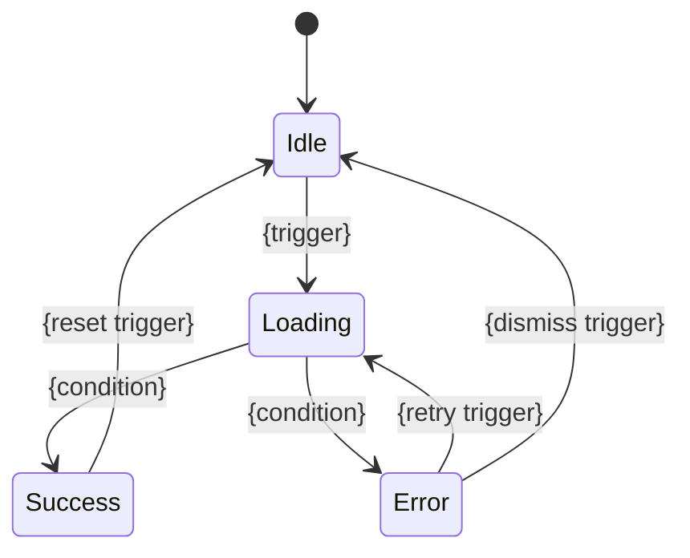
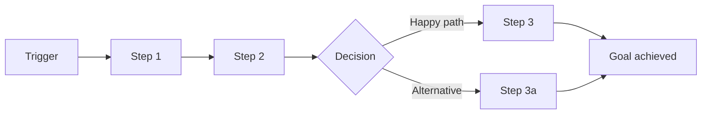

# User Prompt

I want a skill named `prd-analysis` that converts sparse product ideas into self-contained multi-file Product Requirements Documents (PRDs) optimized for AI coding agents. See @skills/prd-analysis.backup for the reference implementation.

# Expanded References

## @skills/prd-analysis.backup

_(directory; dir-mode=selective — tree + orientation files inlined (SKILL.md, README.md, LICENSE, CHANGELOG, *-template.md); used 82003 B)_

**File tree:**

- SKILL.md (10181 bytes)
- architecture-template.md (35206 bytes)
- common/review-criteria.md (29883 bytes)
- document-mode.md (6881 bytes)
- evolve-mode.md (16319 bytes)
- evolve-readme-template.md (7008 bytes)
- feature-template.md (15807 bytes)
- generate/in-generate-review.md (4720 bytes)
- generate/writer-subagent.md (6761 bytes)
- journey-template.md (7280 bytes)
- output-discipline.md (2243 bytes)
- parallel-dispatch.md (3185 bytes)
- prd-template.md (6521 bytes)
- questioning-phases.md (55854 bytes)
- review/cross-reviewer-subagent.md (7391 bytes)
- review-checklist.md (21437 bytes)
- review-mode.md (12125 bytes)
- revise-mode.md (34739 bytes)
- scope-reference.md (4093 bytes)

**Contents:**

### SKILL.md

```
---
name: prd-analysis
description: "Use when the user needs to create a Product Requirements Document, perform product requirements analysis, convert brainstorming notes into structured specs, prepare requirements for AI coding agents, or evolve an existing PRD for a new iteration. Triggers: /prd-analysis, 'write a PRD', 'product requirements', 'requirements analysis', 'evolve PRD', 'new iteration'."
---

# PRD Analysis — AI-Coding-Ready Requirements

Generate PRDs as a **multi-file directory**. Each feature spec is a self-contained file — coding agents read only the file they need, minimizing context consumption.

## Scope

PRD captures **product-level decisions**: what to build, for whom, why, and at what priority. It does NOT specify implementation-level details — those belong to system-design. See `scope-reference.md` for the full PRD vs. system-design boundary table (loaded in authoring modes).

## Input Modes

```
/prd-analysis                          # interactive mode
/prd-analysis path/to/notes.md         # document-based mode
/prd-analysis --output docs/raw/prd/my-project  # custom output dir
/prd-analysis notes.md --output ./prd  # both
/prd-analysis --review docs/raw/prd/xxx/        # review existing PRD
/prd-analysis --revise docs/raw/prd/xxx/        # change management for existing PRD
/prd-analysis --evolve docs/raw/prd/xxx/        # incremental PRD for new iteration
/prd-analysis --evolve docs/raw/prd/xxx/ notes.md  # evolve with document input
```

## Mode Routing

After detecting the invocation mode, read the corresponding files before proceeding:

| Mode | Read These Files |
|------|-----------------|
| Initial analysis (no flags) | `questioning-phases.md`, `output-discipline.md` (load `scope-reference.md` on demand if scope boundary questions arise; load `review-checklist.md` on demand at Step 6) |
| Initial analysis + document input | `questioning-phases.md`, `document-mode.md`, `output-discipline.md` (load `scope-reference.md` on demand if scope boundary questions arise; load `review-checklist.md` on demand at Step 6) |
| `--review` | `review-mode.md`, `review-checklist.md`, `parallel-dispatch.md`, `output-discipline.md` |
| `--revise` | `revise-mode.md`, `parallel-dispatch.md`, `output-discipline.md` (load `scope-reference.md` and `review-checklist.md` on demand per revise-mode.md instructions) |
| `--evolve` | `evolve-mode.md`, `questioning-phases.md`, `output-discipline.md` (load `scope-reference.md` on demand if scope boundary questions arise; load `review-checklist.md` on demand at Evolve Step 4) |

Do NOT read files not listed for the current mode — they are not needed and waste context.

## Process

1. **Gather requirements** — interactive questioning or parse provided document
2. **Fill gaps** — ask targeted follow-up questions for missing info
3. **Generate PRD files** — using templates in this skill directory
4. **Cross-link** — backfill cross-references that couldn't exist during initial generation: journey Mapped Feature columns, feature Deps, feature Journey Context links, Cross-Journey Patterns "Addressed by Feature" column
5. **Write files** — write all generated files to disk (not yet committed)
6. **Self-review** — read each written file against the review checklist (see Review Checklist below), fix issues directly in files
7. **User review** — user reviews files in their editor, confirms or requests changes
8. **Commit** — commit all files to git

### Review Checklist

See `review-checklist.md` (loaded via mode routing for initial analysis, `--review`, `--revise`, and `--evolve` modes). Applied as step 6 of the process (after writing, before commit) — check each dimension and fix issues directly in the written files.

### Immutability Rule

Whether PRD files can be modified in place depends on their **downstream consumption state** — what has been built on top of them:

| Downstream State | Modify in Place? | Rationale |
|-----------------|-----------------|-----------|
| No design exists | Yes | No downstream consumers to break |
| Design exists, not implemented | Yes + append entry to `REVISIONS.md` (create the file if this is the first revision) | Design team needs the change record to update design accordingly |
| Implementation exists | No — create new version | Modifying in place would invalidate implemented code |

Steps 6-7 (self-review, user review) always occur before commit and are part of the creation process — modifying files during these steps is expected regardless of downstream state.

**Evolve mode note:** `--evolve` always creates a new directory (new date) — it never modifies the predecessor PRD. The predecessor is read-only input.

## Output Structure

```
{output-dir}/YYYY-MM-DD-{product-name}/
├── README.md                # Product overview + journey index + feature index + roadmap
├── REVISIONS.md             # Revision history (only present after first --revise)
├── journeys/
│   ├── J-001-{slug}.md      # Individual journey spec
│   └── ...
├── architecture.md          # INDEX ONLY (~50-80 lines) — diagram + links to topic files
├── architecture/            # Topic files — each standalone, independently readable
│   ├── tech-stack.md
│   ├── design-tokens.md     # (omit if no UI)
│   ├── navigation.md        # (omit if no UI)
│   ├── accessibility.md     # (omit if no UI)
│   ├── i18n.md
│   ├── data-model.md
│   ├── external-deps.md
│   ├── coding-conventions.md
│   ├── test-isolation.md
│   ├── security.md
│   ├── dev-workflow.md
│   ├── git-strategy.md
│   ├── code-review.md
│   ├── observability.md
│   ├── performance.md
│   ├── backward-compat.md   # (omit for v1)
│   ├── ai-agent-config.md
│   ├── deployment.md
│   ├── shared-conventions.md
│   ├── auth-model.md        # (omit if single-role)
│   ├── privacy.md           # (omit if no personal data)
│   └── nfr.md
├── features/
│   ├── F-001-{slug}.md      # Self-contained feature spec
│   └── ...
├── prototypes/              # Interactive prototypes (seed code for production)
│   ├── src/                 # Runnable prototype source
│   └── screenshots/         # Key state screenshots per feature
└── .reviews/                # Transient — not version-controlled (gitignore: docs/raw/prd/*/.reviews/)
    └── REVIEW-*.md          # Review findings produced by --review, consumed by --revise
```

Use templates: `prd-template.md` (README), `journey-template.md` (individual journeys), `architecture-template.md` (architecture index + topic files), and `feature-template.md` (feature specs). Evolve mode uses `evolve-readme-template.md` instead of `prd-template.md` for the README; all other templates are reused with the addition of the Change Annotation Convention (defined in `evolve-mode.md`).

**Agent consumption:** read README.md (~concise overview) → read one feature file → implement. Each feature file copies all needed context inline (data models, conventions, journey context), so the feature file alone is sufficient for implementation. Agents do NOT need to read architecture.md or architecture/ files — those are source-of-truth for the PRD author, not for coding agents. The feature file is the coding agent's only input.

**Evolve mode output** — only delta files present:

```
{output-dir}/YYYY-MM-DD-{product-name}/
├── README.md                # Incremental README (baseline ref + change summary + full indexes)
├── journeys/
│   ├── J-{NNN}-{slug}.md   # Only new or modified journeys
│   └── ...
├── architecture.md          # Incremental index (changed → local, unchanged → baseline ref)
├── architecture/
│   ├── {changed-topic}.md   # Only changed topic files
│   └── ...
├── features/
│   ├── F-{NNN}-{slug}.md   # New features, modified features, or tombstones (deprecated)
│   └── ...
├── prototypes/              # Only new/modified feature prototypes
│   ├── src/
│   └── screenshots/
```

**Agent consumption (evolve mode):** read incremental README.md → for a new/modified feature, read the local feature file (self-contained). For an unchanged feature, follow the `→ baseline` link to the predecessor PRD's feature file.

## Output Path

- **Default:** `docs/raw/prd/YYYY-MM-DD-{product-name}/`
- **Custom:** `--output <dir>` overrides the directory
- Confirm path with user before writing

## Key Principles

- **One question at a time** — don't overwhelm
- **MVP ruthlessly** — push back on scope creep
- **Minimal context** — agents read one small file, not a giant document
- **Copy, don't reference** — feature files include relevant data models, conventions, and journey context inline
- **README is a stable navigational index, REVISIONS.md tracks history** — README.md is the entry point and should not accumulate revision entries that destabilize navigation across versions. Revision history (entries written by `--revise`) lives in a sibling `REVISIONS.md`, created on first revision and grown thereafter. Both files coexist; the README's References section links to `REVISIONS.md` when present.
- **No ambiguity** — if a requirement can be interpreted two ways, clarify now
- **Omit empty sections** — if a section has nothing useful, skip it
- **Discipline files are non-optional** — `parallel-dispatch.md` (for `--review` / `--revise`) and `output-discipline.md` (all modes) are loaded at mode entry and their rules take precedence over any per-mode wording that conflicts.

## Next Steps Hint

After committing, print the following guidance to the user:

**Initial creation and revise mode:**
```
PRD complete: {output path}

Next steps:
  Interactive — /system-design {output path}
  Automated  — claude -p "generate system design based on {output path}" --auto
```

**Evolve mode** — use the cascade notification from Evolve Step 5 instead.
```

### architecture-template.md

```
# Architecture Template

Architecture documentation is split into a **concise index** (`architecture.md`) and **topic files** in the `architecture/` subdirectory. This minimizes token consumption — agents read only the index + the topic files relevant to their feature.

## Output Structure

```
{prd-dir}/
├── architecture.md              # Index only (~50-80 lines) — overview + links
└── architecture/
    ├── tech-stack.md            # Tech stack, frontend stack
    ├── design-tokens.md         # Design token system (omit if no UI)
    ├── navigation.md            # Navigation architecture (omit if no UI)
    ├── accessibility.md         # Accessibility baseline (omit if no UI)
    ├── i18n.md                  # Internationalization baseline
    ├── data-model.md            # Data model entities and relationships
    ├── external-deps.md         # External dependencies
    ├── coding-conventions.md    # Coding conventions (always present)
    ├── test-isolation.md        # Test isolation policies (always present)
    ├── security.md              # Security coding policy (always present)
    ├── dev-workflow.md          # Development workflow (always present)
    ├── git-strategy.md          # Git & branch strategy (always present)
    ├── code-review.md           # Code review policy (always present)
    ├── observability.md         # Observability requirements + tooling (always present)
    ├── performance.md           # Performance testing (always present)
    ├── backward-compat.md       # Backward compatibility (N/A for v1)
    ├── ai-agent-config.md       # AI agent configuration (always present)
    ├── deployment.md            # Deployment architecture
    ├── shared-conventions.md    # API conventions, error handling, testing strategy
    ├── auth-model.md            # Authorization model (omit if single-role)
    ├── privacy.md               # Privacy & compliance (omit if no personal data)
    └── nfr.md                   # Non-functional requirements + glossary
```

## architecture.md (Index Template)

architecture.md is **only an index** — it contains a high-level architecture diagram, a summary table linking to topic files, and nothing else. Target: ~50-80 lines.

```markdown
# Architecture: {Product Name}

## High-Level Architecture

{Mermaid diagram or concise textual description of component relationships}

## Architecture Index

| Topic | File | Summary |
|-------|------|---------|
| Tech Stack | [tech-stack.md](architecture/tech-stack.md) | {one-line: e.g. "Go backend, React frontend, PostgreSQL"} |
| Design Tokens | [design-tokens.md](architecture/design-tokens.md) | {one-line: e.g. "Colors, typography, spacing, motion tokens"} |
| Navigation | [navigation.md](architecture/navigation.md) | {one-line: e.g. "Site map, routes, breadcrumbs"} |
| Accessibility | [accessibility.md](architecture/accessibility.md) | {one-line: e.g. "WCAG 2.1 AA baseline"} |
| Internationalization | [i18n.md](architecture/i18n.md) | {one-line: e.g. "en + zh-CN, frontend + backend i18n"} |
| Data Model | [data-model.md](architecture/data-model.md) | {one-line: e.g. "User, Task, Agent, WorkSession entities"} |
| External Dependencies | [external-deps.md](architecture/external-deps.md) | {one-line: e.g. "Claude API, GitHub API, PostgreSQL"} |
| Coding Conventions | [coding-conventions.md](architecture/coding-conventions.md) | {one-line: e.g. "Code org, naming, error handling, logging, concurrency"} |
| Test Isolation | [test-isolation.md](architecture/test-isolation.md) | {one-line: e.g. "Resource isolation, race detection, parallel safety"} |
| Security | [security.md](architecture/security.md) | {one-line: e.g. "Input validation, secret handling, dependency scanning"} |
| Development Workflow | [dev-workflow.md](architecture/dev-workflow.md) | {one-line: e.g. "Prerequisites, CI gates, release process"} |
| Git & Branch Strategy | [git-strategy.md](architecture/git-strategy.md) | {one-line: e.g. "Rebase + ff-only, conventional commits"} |
| Code Review | [code-review.md](architecture/code-review.md) | {one-line: e.g. "Review dimensions, approvals, AI self-review"} |
| Observability | [observability.md](architecture/observability.md) | {one-line: e.g. "Mandatory events, health checks, SLOs, tooling"} |
| Performance Testing | [performance.md](architecture/performance.md) | {one-line: e.g. "Regression detection, budgets, load testing"} |
| Backward Compatibility | [backward-compat.md](architecture/backward-compat.md) | {one-line: e.g. "API versioning, schema evolution"} |
| AI Agent Configuration | [ai-agent-config.md](architecture/ai-agent-config.md) | {one-line: e.g. "CLAUDE.md structure, convention references"} |
| Deployment | [deployment.md](architecture/deployment.md) | {one-line: e.g. "Dev/staging/prod environments, CD pipeline"} |
| Shared Conventions | [shared-conventions.md](architecture/shared-conventions.md) | {one-line: e.g. "API format, error handling, testing strategy"} |
| Authorization | [auth-model.md](architecture/auth-model.md) | {one-line: e.g. "Admin/Member/Viewer roles, permission matrix"} |
| Privacy & Compliance | [privacy.md](architecture/privacy.md) | {one-line: e.g. "GDPR, data retention, user rights"} |
| NFRs & Glossary | [nfr.md](architecture/nfr.md) | {one-line: e.g. "Performance, security, scalability targets"} |

{Omit rows for topics that don't apply (e.g. no Design Tokens for backend-only products). Only files that exist get listed.}
```

## Topic File Templates

Each file below is a standalone document. Agents read only the files relevant to their feature.

---

### architecture/tech-stack.md

```markdown
# Tech Stack

| Layer | Technology | Rationale |
|-------|-----------|-----------|
| {e.g. Frontend / Backend / Database / Infrastructure} | {e.g. React + TypeScript / Go / PostgreSQL / AWS} | {why this choice} |

## Frontend Stack

{Omit if the product has no user-facing interface.}

| Concern | Choice | Version | Rationale |
|---------|--------|---------|-----------|
| UI Framework | {e.g. React} | {e.g. 19.x} | {why} |
| CSS Approach | {e.g. Tailwind CSS} | {e.g. 4.x} | {why} |
| Component Library | {e.g. Shadcn/ui} | {e.g. latest} | {why} |
| State Management | {e.g. Zustand} | {e.g. 5.x} | {why} |
| Build Tool | {e.g. Vite} | {e.g. 6.x} | {why} |
| Form Management | {e.g. React Hook Form} | {e.g. 7.x} | {why} |
| i18n | {e.g. react-i18next} | {e.g. 15.x} | {why} |
| E2E Testing | {e.g. Playwright} | {e.g. 1.x} | {why} |
```

---

### architecture/design-tokens.md

{Omit this file if the product has no user-facing interface.}

```markdown
# Design Token System

AI agents consume this file to generate consistent visual code.

## Colors

| Token | Value | Usage |
|-------|-------|-------|
| color.primary.50 | {lightest shade} | Lightest primary background |
| color.primary.500 | {mid shade} | Default primary |
| color.primary.900 | {darkest shade} | Darkest primary text |
| color.secondary.50–900 | {shades} | Secondary palette |
| color.neutral.50–950 | {shades} | Neutral palette |
| color.semantic.success | {value} | Success states |
| color.semantic.warning | {value} | Warning states |
| color.semantic.error | {value} | Error states, destructive actions |
| color.semantic.info | {value} | Informational |
| color.bg.default | {value} | Page background |
| color.bg.subtle | {value} | Card, section background |
| color.bg.muted | {value} | Disabled, inactive background |
| color.fg.default | {value} | Primary text |
| color.fg.muted | {value} | Secondary text |
| color.border.default | {value} | Default borders |

## Typography

| Token | Value |
|-------|-------|
| font.family.sans | {e.g. Inter, system-ui, -apple-system, sans-serif} |
| font.family.mono | {e.g. JetBrains Mono, Fira Code, monospace} |
| font.size.xs | 0.75rem (12px) |
| font.size.sm | 0.875rem (14px) |
| font.size.base | 1rem (16px) |
| font.size.lg | 1.125rem (18px) |
| font.size.xl | 1.25rem (20px) |
| font.size.2xl | 1.5rem (24px) |
| font.size.3xl | 1.875rem (30px) |
| font.size.4xl | 2.25rem (36px) |
| font.lineHeight.tight | 1.25 |
| font.lineHeight.normal | 1.5 |
| font.lineHeight.relaxed | 1.75 |
| font.weight.normal | 400 |
| font.weight.medium | 500 |
| font.weight.semibold | 600 |
| font.weight.bold | 700 |

## Spacing

| Token | Value | Usage |
|-------|-------|-------|
| spacing.0 | 0px | — |
| spacing.1 | 4px | Tight internal padding |
| spacing.2 | 8px | Default internal padding |
| spacing.3 | 12px | — |
| spacing.4 | 16px | Default gap, section padding |
| spacing.6 | 24px | Section margin |
| spacing.8 | 32px | Large section gap |
| spacing.12 | 48px | Page-level spacing |
| spacing.16 | 64px | Major section separation |

## Border, Shadow, Radius

| Token | Value |
|-------|-------|
| radius.none | 0px |
| radius.sm | 2px |
| radius.md | 6px |
| radius.lg | 8px |
| radius.xl | 12px |
| radius.full | 9999px |
| shadow.sm | 0 1px 2px 0 rgb(0 0 0 / 0.05) |
| shadow.md | 0 4px 6px -1px rgb(0 0 0 / 0.1) |
| shadow.lg | 0 10px 15px -3px rgb(0 0 0 / 0.1) |

## Breakpoints

| Token | Value | Target |
|-------|-------|--------|
| breakpoint.sm | 640px | Mobile landscape |
| breakpoint.md | 768px | Tablet |
| breakpoint.lg | 1024px | Desktop |
| breakpoint.xl | 1280px | Wide desktop |
| breakpoint.2xl | 1536px | Ultra-wide |

## Motion

| Token | Value | Usage |
|-------|-------|-------|
| motion.duration.fast | 150ms | Hover, toggle, micro-feedback |
| motion.duration.normal | 300ms | Panel open/close, page transition |
| motion.duration.slow | 500ms | Complex entrance animation |
| motion.easing.default | cubic-bezier(0.4, 0, 0.2, 1) | General purpose |
| motion.easing.in | cubic-bezier(0.4, 0, 1, 1) | Exit animations |
| motion.easing.out | cubic-bezier(0, 0, 0.2, 1) | Entrance animations |
| motion.easing.inOut | cubic-bezier(0.4, 0, 0.2, 1) | Symmetric transitions |

## Z-Index

| Token | Value | Usage |
|-------|-------|-------|
| z.base | 0 | Default content |
| z.dropdown | 10 | Dropdown menus |
| z.sticky | 20 | Sticky headers |
| z.overlay | 30 | Overlays, backdrops |
| z.modal | 40 | Modal dialogs |
| z.popover | 50 | Popovers, tooltips |
| z.toast | 60 | Toast notifications |

{Values above are defaults — replace with project-specific values during PRD Phase 3.}

**Note:** Values shown are common defaults (Tailwind CSS defaults for web). Replace with project-specific values confirmed during Phase 3 questioning. These are examples, not prescriptions.
```

---

### architecture/navigation.md

{Omit this file if the product has no user-facing interface or has only a single view. Use the Web section for web/desktop apps, or the TUI section for terminal apps — not both.}

```markdown
# Navigation Architecture

## Web Navigation

{Omit for TUI products.}

### Site Map

{Mermaid diagram showing page hierarchy derived from journey Screen/View names.}

### Navigation Layers

| Layer | Type | Content | Behavior |
|-------|------|---------|----------|
| Global | {sidebar / top nav / bottom tab} | {nav items} | {always visible / collapses on mobile} |
| Section | {tabs / sub-nav / breadcrumb} | {context-dependent items} | {appears within specific views} |
| Contextual | {inline links / action menus} | {in-content navigation} | {embedded in page content} |

### Route Definitions

| View (from journeys) | Route Pattern | Params | Query Params | Auth | Layout |
|----------------------|--------------|--------|-------------|------|--------|
| {view name} | {/path/:param} | {param: type} | {?key=default} | {required / public} | {main / minimal / none} |

### Deep Linking & State Restoration

| View | Shareable URL | State in URL | Restoration Behavior |
|------|-------------|-------------|---------------------|
| {view name} | Yes / No | {what state is encoded} | {how state is restored} |

**Breadcrumb Strategy:** {auto-generated from route hierarchy / manual per-view / none}

## TUI Navigation

{Omit for web products.}

### Screen Flow

{Mermaid diagram showing CLI entry points and TUI screen transitions.}

### Command Structure

| Command | Entry Point | Screen/View | Exit |
|---------|-------------|-------------|------|
| {e.g. `app run --input <path>`} | CLI | {TUI screen name} | {Ctrl+C / completion} |

### TUI Internal Navigation

| From | Action | To | Notes |
|------|--------|----|-------|
| {screen/panel} | {key or action} | {target screen/panel} | {e.g. focus changes} |

**Focus Order:** {e.g. main area → input → sidebar (Tab cycle)}
```

---

### architecture/accessibility.md

{Omit this file if the product has no user-facing interface.}

```markdown
# Accessibility Baseline

| Aspect | Requirement |
|--------|------------|
| WCAG Level | {2.1 AA / 2.1 AAA} |
| Keyboard Navigation | All interactive elements reachable via Tab; logical tab order; no keyboard traps |
| Screen Reader | All images have alt text; form fields have associated labels; dynamic content uses ARIA live regions |
| Focus Indicators | Visible focus ring on all interactive elements; minimum 3:1 contrast ratio |
| Color Contrast | Text: minimum 4.5:1 (normal) / 3:1 (large); UI components: minimum 3:1 |
| Motion | Respect `prefers-reduced-motion`; no auto-playing animations longer than 5 seconds |
| Touch Targets | Minimum 44x44px for touch interfaces |
| Error Identification | Errors identified by more than color alone (icon + text) |

{Individual features may add requirements beyond this baseline in their Accessibility sub-section.}
```

---

### architecture/i18n.md

{Omit this file if the product is single-language only and explicitly confirmed as such.}

```markdown
# Internationalization Baseline

## Shared

| Aspect | Requirement |
|--------|------------|
| Supported Languages | {e.g. en, zh-CN, ja} |
| Default Language | {e.g. en} |
| Date/Time Format | {locale-aware via Intl.DateTimeFormat / date-fns with locale} |
| Number Format | {locale-aware via Intl.NumberFormat} |
| Pluralization | {ICU MessageFormat / library-specific} |

## Frontend

{Omit if no user-facing interface.}

| Aspect | Requirement |
|--------|------------|
| RTL Support | {required / not required} |
| Text Externalization | All user-visible strings use i18n keys; no hardcoded text in components |
| Key Convention | {e.g. `{feature}.{section}.{element}`} |
| Content Direction | {LTR-only / bidirectional} |

## Backend

{Omit if single-language backend.}

| Aspect | Requirement |
|--------|------------|
| Locale Resolution | {e.g. Accept-Language header → user profile preference → default} |
| API Error Messages | {localized per request locale / fixed language} |
| Validation Messages | {localized per request locale / error codes only} |
| Notification Content | {localized per recipient preference / fixed language} |
| Timezone Handling | {e.g. store UTC, convert per user timezone on output} |
| Locale-Aware Formatting | {API returns formatted values per locale / raw values} |
```

---

### architecture/data-model.md

```markdown
# Data Model

## {EntityName}

| Field | Type | Constraints | Description |
|-------|------|-------------|-------------|
| ... | ... | ... | ... |

## Relationships

- {EntityA} 1:N {EntityB} — {why}
```

---

### architecture/external-deps.md

```markdown
# External Dependencies

| Service | Purpose | API Style | Timeout | Failure Mode | Fallback |
|---------|---------|-----------|---------|-------------|----------|
| {name} | {what it does for us} | REST / gRPC / SDK | {ms} | {what happens when down} | {degraded behavior or retry} |
```

---

### architecture/coding-conventions.md

```markdown
# Coding Conventions

Technology-agnostic policies. System-design translates these into stack-specific patterns.

## Code Organization

| Aspect | Policy |
|--------|--------|
| Layering strategy | {e.g. domain/service/infrastructure separation} |
| Module/package structure | {e.g. one package per bounded context} |
| File organization | {e.g. one primary type per file} |

## Naming Conventions

| Element | Convention | Example |
|---------|-----------|---------|
| Modules/packages | {e.g. lowercase, singular nouns} | {e.g. `scheduler`} |
| Types/classes | {e.g. PascalCase, descriptive nouns} | {e.g. `TaskScheduler`} |
| Interfaces | {e.g. behavior-describing names} | {e.g. `Scheduler`} |
| Functions/methods | {e.g. verb-first for actions} | {e.g. `CreateWorktree()`} |
| Constants | {e.g. ALL_CAPS or PascalCase per language} | — |
| Files | {e.g. snake_case matching primary type} | {e.g. `task_scheduler.go`} |

## Interface & Abstraction Design

| Aspect | Policy |
|--------|--------|
| When to define interfaces | {e.g. at module boundaries and for external dependencies} |
| Interface location | {e.g. defined by the consumer, not the provider} |
| Interface size | {e.g. prefer small, focused interfaces (1-3 methods)} |
| Concrete vs abstract | {e.g. start concrete; extract interface when needed} |

## Dependency Wiring

| Aspect | Policy |
|--------|--------|
| Injection method | {e.g. constructor injection} |
| Global mutable state | {e.g. prohibited} |
| Initialization order | {e.g. main/entry point constructs the dependency graph} |

## Error Handling & Propagation

| Aspect | Policy |
|--------|--------|
| Error context | {e.g. all errors must include context} |
| Error categories | {e.g. validation / domain / infrastructure / transient} |
| Cross-boundary translation | {e.g. infrastructure errors translated at layer boundaries} |
| Panic / unhandled exception policy | {e.g. recovered at goroutine entry points} |

## Logging

| Aspect | Policy |
|--------|--------|
| Format | {e.g. structured key-value pairs} |
| Levels | {e.g. ERROR/WARN/INFO/DEBUG with defined usage} |
| Sensitive data | {e.g. secrets, tokens, PII must never appear in logs} |
| Per-component logging | {e.g. each component logs with component identifier} |

## Configuration Access

| Aspect | Policy |
|--------|--------|
| Access pattern | {e.g. configuration injected at construction time} |
| Validation | {e.g. all config validated at startup; fail fast} |
| Defaults | {e.g. every config key has a sensible default} |

## Concurrency

| Aspect | Policy |
|--------|--------|
| Lifecycle management | {e.g. all long-running tasks accept cancellation token} |
| Shared state | {e.g. prefer message-passing over shared memory with locks} |
| Resource cleanup | {e.g. all resources released in cleanup/defer/finally path} |

## Frontend Conventions

{Omit if no user-facing interface.}

| Aspect | Policy |
|--------|--------|
| Component structure | {e.g. one component per file} |
| State management scope | {e.g. local state for UI-only; shared for cross-component} |
| Styling approach | {e.g. all values reference design tokens; no inline raw values} |
```

---

### architecture/test-isolation.md

```markdown
# Test Isolation

Policies ensuring tests are reliable when run in parallel, across worktrees, or in CI.

| Aspect | Policy |
|--------|--------|
| Resource isolation | {e.g. every test creates its own temporary resources} |
| Global mutable state | {Prohibited — all state passed as parameters} |
| Port binding | {e.g. bind to port 0; hardcoded ports forbidden} |
| File system | {e.g. use test framework's temp directory; no writes to project root} |
| External processes | {e.g. register cleanup to terminate on test completion} |
| Race detection | {e.g. enabled in CI; this is a gate, not optional} |
| Timeouts | {e.g. unit: 30s; integration: 5m; no unbounded tests} |
| Directory independence | {Tests must work from any worktree or checkout location} |
| Parallel classification | {e.g. parallel-safe by default; serial tests explicitly marked} |
```

---

### architecture/security.md

```markdown
# Security Coding Policy

| Aspect | Policy |
|--------|--------|
| Input validation | {e.g. all external input validated at system boundaries} |
| Boundary definition | {e.g. HTTP handlers, CLI parsers, file readers, message consumers} |
| Secret handling | {e.g. never in source code, logs, error messages, or VCS history} |
| Dependency scanning | {e.g. vulnerability scanning in CI; critical CVEs block merge} |
| Injection prevention | {e.g. never concatenate user input into commands/queries/templates} |
| Auth enforcement | {e.g. every entry point independently verifies permissions} |
| Sensitive data in transit | {e.g. all external connections use TLS} |
| Sensitive data at rest | {e.g. passwords hashed; encryption for PII — or N/A} |
```

---

### architecture/dev-workflow.md

```markdown
# Development Workflow

| Aspect | Specification |
|--------|---------------|
| Prerequisites | {e.g. Go 1.23+, Git 2.20+, Claude Code latest} |
| Local setup | {e.g. `make setup` — one-command bootstrap} |
| CI gates (blocking) | {e.g. lint → build → test with race detection → benchmark} |
| CI gates (non-blocking) | {e.g. coverage report, dependency audit} |
| Build matrix | {e.g. Linux amd64 + macOS arm64} |
| Versioning | {e.g. semver; tags trigger release builds} |
| Changelog | {e.g. conventional commits → auto-generated} |
| Release testing | {e.g. full test suite + E2E on release candidate} |
| Dependency policy | {e.g. new deps require review; MIT/Apache/BSD license} |
```

---

### architecture/git-strategy.md

```markdown
# Git & Branch Strategy

| Aspect | Policy |
|--------|--------|
| Branch naming | {e.g. `feature/{task-id}-{slug}`, `fix/{issue-id}-{slug}`} |
| Merge strategy | {e.g. rebase + fast-forward only; enforced via branch protection} |
| Branch protection | {e.g. main protected: require PR, CI pass, N approvals} |
| PR conventions | {e.g. one PR per feature; body must include summary + test plan} |
| Commit message format | {e.g. Conventional Commits with task/issue ID} |
| Stale branch cleanup | {e.g. merged branches deleted; unmerged > 30 days flagged} |
```

---

### architecture/code-review.md

```markdown
# Code Review Policy

| Aspect | Policy |
|--------|--------|
| Review dimensions | {e.g. correctness, security, test coverage, performance, readability} |
| Approval requirements | {e.g. 1 for standard; 2 for security-sensitive} |
| Review SLA | {e.g. started within 1 business day} |
| Automated checks | {e.g. lint, type check, test pass, coverage threshold} |
| Human review focus | {e.g. architecture fit, business logic, edge case coverage} |
| Feedback severity | {e.g. blocker / suggestion / nit} |
| AI agent self-review | {e.g. run lint + test + build before requesting review} |
```

---

### architecture/observability.md

```markdown
# Observability

## Requirements (Policy)

What must be observable, regardless of tooling.

### Mandatory Logging Events

| Event Category | What Must Be Logged | Required Fields |
|---------------|--------------------|-----------------| 
| State transitions | {e.g. every domain entity state change} | {e.g. timestamp, component, entity_id, from_state, to_state} |
| External calls | {e.g. every call to external service} | {e.g. timestamp, service, operation, duration_ms, success} |
| Authentication | {e.g. every auth attempt} | {e.g. timestamp, identity, action, result} |
| Errors | {e.g. every error at ERROR level} | {e.g. timestamp, component, error_type, message} |

### Health Checks

| Component | Health Definition | Check Interval |
|-----------|------------------|---------------|
| {component} | {e.g. can accept requests, deps reachable} | {e.g. 30s} |

### Key Metrics & SLOs

| Metric | Description | SLO Target |
|--------|-------------|-----------|
| {metric} | {description} | {target} |

### Alerting Rules

| Condition | Severity | Recipient | Escalation |
|-----------|----------|-----------|-----------|
| {condition} | {critical / warning} | {recipient} | {escalation path} |

### Audit Trail

{Omit if no operations require immutable audit logging.}

| Operation | What Is Recorded | Retention |
|-----------|-----------------|-----------|
| {operation} | {who, what, when} | {retention period} |

## Tooling

| Concern | Tool / Approach | Standard |
|---------|----------------|----------|
| Logging | {library + destination} | {log level policy} |
| Metrics | {collection method} | {key metrics to expose} |
| Tracing | {distributed tracing tool} | {when to create spans} |
| Alerting | {alerting tool + channel} | {alert conditions} |
```

---

### architecture/performance.md

```markdown
# Performance Testing

| Aspect | Policy |
|--------|--------|
| Regression detection | {e.g. benchmarks in CI; merge blocked if p95 degrades > 10%} |
| Performance budgets | {e.g. API p95 < 200ms; TUI render < 16ms; startup < 3s} |
| Load testing | {e.g. required before release; N agents × M tasks} |
| Profiling | {e.g. required before merging P0 features} |
| Resource limits | {e.g. total memory for 5 agents < 2GB} |
```

---

### architecture/backward-compat.md

{Omit for v1/MVP with no existing consumers. Note the intended future versioning strategy.}

```markdown
# Backward Compatibility

| Aspect | Policy |
|--------|--------|
| API versioning | {e.g. URL prefix `/v1/`; old version maintained 6 months} |
| Breaking change definition | {e.g. removing/renaming fields, changing types, altering defaults} |
| Breaking change process | {e.g. deprecation notice + 2 release cycles before removal} |
| Data schema evolution | {e.g. additive-only; destructive changes require migration scripts} |
| Config file evolution | {e.g. new keys with defaults; removed keys ignored with warning} |
```

---

### architecture/ai-agent-config.md

```markdown
# AI Agent Configuration

## Instruction Files

| File | Purpose | Maintained By |
|------|---------|---------------|
| {e.g. `CLAUDE.md`} | {Primary agent instruction file} | {e.g. updated on convention changes} |
| {e.g. `AGENTS.md`} | {Multi-agent coordination} | {e.g. updated when roles change} |

## Structure Policy

Agent instruction files must be **concise indexes** (~200 lines max), not monolithic documents.

| Content Type | Placement | Example |
|-------------|-----------|---------|
| Project overview & purpose | Direct in instruction file | "This is a TUI app for multi-agent collaboration" |
| Key commands (build, test, lint) | Direct in instruction file | `go build ./...`, `go test -race ./...` |
| Directory structure summary | Direct in instruction file | Brief tree of top-level dirs |
| Coding conventions | **Reference** to convention files | "See `.golangci-lint.yml`" |
| Test isolation rules | **Reference** to test helpers | "See `internal/testutil/`" |
| Security policies | **Reference** to security config | "See `.github/workflows/security.yml`" |
| Architecture details | **Reference** to docs | "See `docs/`" |

## Maintenance Policy

| Trigger | Action |
|---------|--------|
| Convention change | Update references if file paths changed |
| Project structure change | Update directory structure summary |
| New tooling adopted | Add command + reference |
| New agent role | Add role-specific section or file |

## Multi-Agent Coordination

{Omit for single-agent projects.}

| Aspect | Policy |
|--------|--------|
| Shared instructions | {e.g. all agents read same CLAUDE.md} |
| Role-specific instructions | {e.g. reviewer gets security checklist} |
| Convention discovery | {e.g. CLAUDE.md → convention file references → read files} |

## Context Budget Priority

1. Build/test/lint commands
2. File/directory structure
3. Naming conventions
4. Import patterns
5. Error handling patterns
6. Architecture constraints
```

---

### architecture/deployment.md

```markdown
# Deployment Architecture

## Environments

| Environment | Purpose | Users | Infrastructure | URL / Access | Notes |
|-------------|---------|-------|---------------|-------------|-------|
| Development | {local dev and debug} | {developers, AI agents} | {e.g. local / Docker} | {N/A} | {e.g. hot reload} |
| Testing / CI | {automated testing} | {CI system} | {e.g. ephemeral containers} | {N/A} | {e.g. clean state per run} |
| Staging | {pre-production} | {QA, stakeholders} | {e.g. mirrors prod} | {URL} | {e.g. anonymized data} |
| Production | {live service} | {end users} | {e.g. cloud} | {URL} | {e.g. autoscaling} |

{Omit environments that don't apply.}

## Local Development Setup

| Aspect | Policy |
|--------|--------|
| Reproducibility | {e.g. single-command setup; must work from clean checkout} |
| Service dependencies | {e.g. containerized / in-memory stubs / external} |
| Environment variables | {e.g. `.env.example` committed with documented defaults} |
| Data seeding | {e.g. idempotent seed script} |

## Environment Parity

| Aspect | Policy |
|--------|--------|
| Parity level | {e.g. staging mirrors production at smaller scale} |
| Acceptable differences | {e.g. dev uses SQLite instead of PostgreSQL} |
| Configuration consistency | {e.g. same config keys across environments; only values differ} |

## Configuration Management

| Aspect | Policy |
|--------|--------|
| Configuration source | {e.g. environment variables} |
| Secret management | {e.g. via secret manager; never in VCS} |
| Validation | {e.g. validates at startup; fails fast} |
| Template | {e.g. `.env.example` committed} |

## Data Migration

{Omit if no persistent data that evolves.}

| Aspect | Policy |
|--------|--------|
| Migration tool | {e.g. versioned migration scripts} |
| Reversibility | {e.g. every migration has rollback} |
| Seed data | {e.g. dev/test use seed script} |

## Deployment Pipeline (CD)

{Omit for local-only tools.}

| Aspect | Policy |
|--------|--------|
| Deployment trigger | {e.g. staging: auto on merge; prod: manual + tag} |
| Deployment strategy | {e.g. rolling / blue-green / canary} |
| Rollback strategy | {e.g. redeploy previous; database rollback} |
| Zero-downtime | {e.g. required for production} |
| Smoke tests | {e.g. health check + critical path after deploy} |

## Environment Isolation

| Aspect | Policy |
|--------|--------|
| Multi-instance isolation | {e.g. independent envs without conflicts} |
| Port allocation | {e.g. configurable via env vars; no hardcoded ports} |
| Database isolation | {e.g. separate instance/schema per dev; ephemeral per CI} |
| Namespace separation | {e.g. container names prefixed with dev/agent ID} |

## Infrastructure as Code

{Omit if trivially simple or manually provisioned for MVP.}

| Aspect | Policy |
|--------|--------|
| IaC requirement | {e.g. all infra defined declaratively} |
| Scope | {e.g. containers, orchestration, cloud resources} |
| Environment parameterization | {e.g. same templates; differences as parameter values} |
```

---

### architecture/shared-conventions.md

```markdown
# Shared Conventions

## API Conventions

| Aspect | Convention |
|--------|-----------|
| Format | {e.g. JSON, content-type application/json} |
| Authentication | {e.g. Bearer JWT in Authorization header} |
| Pagination | {e.g. cursor-based with `?cursor=`} |
| Versioning | {e.g. URL prefix /v1/} |
| Rate limiting | {e.g. 100 req/min per user, 429 response} |

## Error Handling

| Aspect | Convention |
|--------|-----------|
| Error response format | {e.g. RFC 7807 Problem Details} |
| Error codes | {e.g. `AUTH_EXPIRED`, `RESOURCE_NOT_FOUND`} |
| Client errors (4xx) | {e.g. specific error code + message, do not retry} |
| Server errors (5xx) | {e.g. generic message + request_id, log full stack} |
| Validation errors | {e.g. 422 with field-level errors array} |

## Testing Strategy

| Layer | Framework | Scope | Coverage Target |
|-------|-----------|-------|----------------|
| Unit | {e.g. Jest / pytest / Go testing} | {pure logic} | {e.g. 80%} |
| Integration | {e.g. Supertest / Testcontainers} | {API, DB} | {critical paths} |
| E2E | {e.g. Playwright / Cypress} | {user journeys} | {happy + key error paths} |
```

---

### architecture/auth-model.md

{Omit for single-role products or products with no access control.}

```markdown
# Authorization Model

## Roles

| Role | Description | Persona |
|------|-------------|---------|
| {e.g. Admin} | {what this role can do} | {which persona} |
| {e.g. Member} | {what this role can do} | {which persona} |

## Permission Matrix

| Feature | {Role 1} | {Role 2} | {Role 3} |
|---------|----------|----------|----------|
| F-001 {name} | Full | Read-only | No access |

**Data Visibility:** {e.g. "Users see own data; Admins see org-wide"}
```

---

### architecture/privacy.md

{Omit for internal tools with no personal data.}

```markdown
# Privacy & Compliance

| Aspect | Requirement |
|--------|------------|
| Regulations | {e.g. GDPR, CCPA, HIPAA — or "None"} |
| Personal data entities | {which entities contain PII} |
| User rights | {e.g. export, deletion, correction} |
| Data retention | {e.g. "2 years after account deletion"} |
| Consent | {e.g. "Explicit opt-in for analytics"} |
```

---

### architecture/nfr.md

```markdown
# Non-functional Requirements

| ID | Category | Requirement |
|----|----------|------------|
| NFR-001 | Performance | {p95 latency, throughput} |
| NFR-002 | Security | {auth method, data protection} |
| NFR-003 | Scalability | {concurrent users, growth rate} |
| NFR-004 | Reliability | {SLA, backup strategy} |
| NFR-005 | Internationalization | {supported languages — omit if single-language} |

# Glossary

| Term | Definition |
|------|-----------|
| ... | ... |
```

---

## Key Rules

- **architecture.md is an index only** (~50-80 lines) — it contains the high-level architecture diagram and a table linking to topic files. No section content lives in architecture.md
- Topic files live in `architecture/` subdirectory — each file is standalone and independently readable
- Feature files **copy relevant data models and conventions inline** — they reference the source file for traceability but don't require agents to read it
- Omit topic files that don't apply — no empty files. The architecture.md index only lists files that exist
- Frontend-related files (design-tokens.md, navigation.md, accessibility.md) are omitted for products with no user-facing interface
- i18n.md: Frontend section omitted for no UI; Backend section omitted for single-language backends; entire file omitted only if single-language AND no multi-locale consumers
- **coding-conventions.md**, **test-isolation.md**, **dev-workflow.md**, **security.md**, **git-strategy.md**, **code-review.md**, **observability.md**, **performance.md**, and **ai-agent-config.md** are always present
- **backward-compat.md** is omitted for v1/MVP — note intended strategy in the file or skip entirely
- **Observability requirements** (policy) and **observability tooling** are combined in one file (observability.md) with clear section separation
- All convention files contain **policies** not **implementation patterns** — system-design translates to stack-specific patterns
- Feature files copy relevant policies into their "Relevant conventions" section, citing the source file path
- Design Token values are defaults — replace during PRD Phase 3. Feature specs reference tokens by semantic name, never raw values
```

### evolve-readme-template.md

```
# Incremental PRD Template — README.md (Evolve Mode)

The incremental README.md is the navigational entry point for an evolved PRD directory. It references a predecessor PRD as baseline, summarizes changes, and provides a complete index that mixes local files (changed items) with baseline references (unchanged items).

## Directory Structure

```
{output-dir}/
├── README.md              # Incremental overview + baseline ref + change summary + full index
├── journeys/
│   ├── J-{NNN}-{slug}.md  # Only new or modified journeys (full rewrite + change annotations)
│   └── ...
├── architecture.md        # Incremental architecture index (all topics, local or baseline ref)
├── architecture/
│   ├── {topic}.md         # Only changed topic files (full rewrite + change annotations)
│   └── ...
├── features/
│   ├── F-{NNN}-{slug}.md  # New features, modified features (full rewrite), or tombstones
│   └── ...
├── prototypes/            # Only new/modified feature prototypes
│   ├── src/
│   └── screenshots/
```

## Template

The incremental README.md follows this structure. Omit any section that has no useful content.

### Header

```
# {Product Name} — Incremental PRD

> {One-sentence product vision (updated if changed, otherwise same as baseline)}
```

### Baseline

| Field | Value |
|-------|-------|
| Predecessor | [{YYYY-MM-DD-product-name}](../YYYY-MM-DD-product-name/README.md) |
| Flattened from | {version chain, e.g.: 2026-01-15 → 2026-03-20 → 2026-06-15} |
| Date | {YYYY-MM-DD} |

### Change Summary

Categorize every change. This section is the first thing a reader sees — keep it scannable.

#### Added
- F-{NNN} {Feature Name} — {one-line description}
- J-{NNN} {Journey Name} — {one-line description}

#### Modified
- F-{NNN} {Feature Name} — {what changed}
- J-{NNN} {Journey Name} — {what changed}

#### Deprecated
- F-{NNN} {Feature Name} — {reason, replaced by what or N/A}

#### Architecture Changes
- {topic-file}.md — {what changed}

### Problem & Goals

{If unchanged: "No changes — see [baseline](../YYYY-MM-DD-product-name/README.md#problem--goals)"}
{If changed: full rewrite of section + change annotations using inline markers}

### Evidence Base

{If unchanged: "No changes — see [baseline](../YYYY-MM-DD-product-name/README.md#evidence-base)"}
{If changed: full rewrite + change annotations}

### Competitive Landscape

{If unchanged: "No changes — see [baseline](../YYYY-MM-DD-product-name/README.md#competitive-landscape)"}
{If changed: full rewrite + change annotations}

### Users

{If unchanged: "No changes — see [baseline](../YYYY-MM-DD-product-name/README.md#users)"}
{If changed: full rewrite + change annotations}

### User Journeys

{Complete index table — includes ALL journeys (local + baseline references). Always present, never reference-only.}

| ID | Journey | Persona | Status | Spec |
|----|---------|---------|--------|------|
| J-001 | {name} | {persona} | Unchanged | [→ baseline](../YYYY-MM-DD-product-name/journeys/J-001-{slug}.md) |
| J-002 | {name} | {persona} | **Modified** | [J-002](journeys/J-002-{slug}.md) |
| J-{NNN} | {name} | {persona} | **Added** | [J-{NNN}](journeys/J-{NNN}-{slug}.md) |

### Cross-Journey Patterns

{If unchanged: "No changes — see [baseline](../YYYY-MM-DD-product-name/README.md#cross-journey-patterns)"}
{If changed: full rewrite + change annotations. Deprecated features removed from "Addressed by Feature" column.}

### Feature Index

{Complete index table — includes ALL features (local + baseline references). Always present, never reference-only.}

| ID | Feature | Type | Status | Impact | Effort | Priority | Deps | Spec |
|----|---------|------|--------|--------|--------|----------|------|------|
| F-001 | {name} | UI | Unchanged | H | M | P0 | — | [→ baseline](../YYYY-MM-DD-product-name/features/F-001-{slug}.md) |
| F-003 | {name} | UI | **Modified** | H | M | P0 | F-001 | [F-003](features/F-003-{slug}.md) |
| F-005 | {name} | API | **Deprecated** | — | — | — | — | [F-005](features/F-005-{slug}.md) |
| F-012 | {name} | UI | **Added** | H | L | P0 | F-003 | [F-012](features/F-012-{slug}.md) |

### Risks

{If no new/changed risks: "No changes — see [baseline](../YYYY-MM-DD-product-name/README.md#risks)"}
{If risks changed: full rewrite + change annotations. Include all risks (baseline + new), annotate changes.}

### Roadmap

{Updated roadmap reflecting this iteration's changes. Include all phases — unchanged features listed for context with "(baseline)" note, new/modified features annotated.}

**Phase 1 — MVP** (P0 features)
- [F-001: {name}](../YYYY-MM-DD-product-name/features/F-001-{slug}.md) (baseline)
- [F-012: {name}](features/F-012-{slug}.md) **[ADDED]**

**Phase 2** (P1 features)
- [F-003: {name}](features/F-003-{slug}.md) **[MODIFIED]**

### References

- Baseline PRD: [{predecessor path}](../YYYY-MM-DD-product-name/README.md)
- Journeys: [journeys/](journeys/) + [baseline journeys](../YYYY-MM-DD-product-name/journeys/)
- Architecture: [architecture/](architecture/) + [baseline architecture](../YYYY-MM-DD-product-name/architecture/)
- Prototypes: [prototypes/](prototypes/) + [baseline prototypes](../YYYY-MM-DD-product-name/prototypes/) {omit if no prototypes}

## Tombstone File Format (Deprecated Features)

Deprecated features get a short tombstone file instead of being silently removed. This prevents agents from looking for the feature in the old PRD.

```
# F-{NNN}: {Feature Name} — DEPRECATED

| Field | Value |
|-------|-------|
| Status | Deprecated |
| Reason | {why deprecated} |
| Replaced by | [F-{NNN}](F-{NNN}-{slug}.md) or N/A |
| Original | [→ baseline](../../YYYY-MM-DD-product-name/features/F-{NNN}-{slug}.md) |

{1-2 sentences explaining why deprecated, for agent context.}
{If Replaced by is N/A, explain why no replacement is needed.}
```

## Change Annotation Convention

All content types (features, journeys, architecture topics) use the same annotation system. See SKILL.md's Evolve Mode section for the full convention (metadata header + inline markers).

All change annotations (file-level metadata headers, inline `[MODIFIED]`/`[ADDED]`/`[REMOVED]`/`[UNCHANGED]` tags) follow the **Change Annotation Convention** defined in `evolve-mode.md`. Refer to that file for the complete format specification, tag syntax, and examples.

## Key Rules

- README.md contains **complete indexes** for journeys, features, and architecture — mixing local and baseline references
- Change Summary is always present and categorized (Added / Modified / Deprecated / Architecture Changes)
- Sections unchanged from baseline use a single-line reference, not a full copy
- Baseline field is always present and links to the predecessor PRD
- Tombstone files prevent agents from chasing deprecated features into old PRDs
- Feature / Journey IDs continue from baseline (new IDs > baseline max ID)
```

### feature-template.md

```
# Feature Spec Template

Each file is **self-contained** — a coding agent implements the feature by reading only this file.

## Template

The feature file follows this structure. Omit any section that has no useful content.

### Header

```
# F-{001}: {Feature Name}

> **Priority:** P0 | P1 | P2  **Effort:** S | M | L | XL
```

### Context

**Product:** {one sentence}
**Relevant architecture:** {only parts this feature touches, 3-5 lines}
**Relevant data models:** {copy entity definitions this feature reads/writes}
**Relevant conventions:** copy applicable convention text from `architecture/` topic files — specifically `coding-conventions.md` (error handling, logging, concurrency policies relevant to this feature), `test-isolation.md` (resource isolation, parallel safety rules relevant to this feature's tests), `security.md` (input validation, secret handling relevant to this feature), and `shared-conventions.md` (API format, error structure). Copy the actual policy text inline — do not reference the files by path. The goal: a coding agent reads only this feature file and has all conventions needed to implement correctly. Also include when applicable: Code Review Policy (review dimensions applicable to this feature), Performance Testing (budgets applicable to this feature), Backward Compatibility (API versioning, schema evolution relevant to this feature's API contracts or data models), Observability Requirements (mandatory logging events, health checks, metrics relevant to this feature), AI Agent Configuration (instruction file references, maintenance triggers relevant to this feature). Omit conventions this feature doesn't touch (e.g. no API conventions for a pure background-job feature; no concurrency policy for a stateless utility; no backward compatibility for internal-only features with no API)
**Permission:** {which roles can access this feature and at what level — e.g. "Admin: full, Member: read-only, Viewer: no access". Copy from architecture.md Authorization Model. Omit for single-role products or features with no access restrictions}

### User Stories

- As a {persona}, I want to {action}, so that {outcome}.
- As a {persona}, I want to {action}, so that {outcome}.

### Journey Context

- **Journey:** [J-{NNN}: {journey name}](../journeys/J-{NNN}-{slug}.md) — Touchpoints #{touchpoint numbers} — Pain points: {which pain points resolved}
- **Journey:** [J-{NNN}: {journey name}](../journeys/J-{NNN}-{slug}.md) — Touchpoints #{touchpoint numbers} — Pain points: {which pain points resolved}

### Requirements

1. {precise, unambiguous requirement}
2. ...

### Acceptance Criteria

Behavioral (Given/When/Then):
- Given {precondition}, when {action}, then {result}
- Given {precondition}, when {edge case}, then {result}

{If this feature has Dependencies (depends-on), include at least one cross-feature integration criterion (Dependencies are listed in the Dependencies section below -- during initial writing, fill this integration criterion after completing the Dependencies section, or leave a `[TODO: add integration criterion for F-{dep}]` placeholder and backfill in Step 4 cross-linking):}
- Given {upstream feature} has {completed its action / produced its output}, when {this feature consumes it}, then {end-to-end observable result}

Non-behavioral (consider each dimension — include those that apply, omit the rest):
- **Performance:** {e.g. "Response time must be < 200ms at p95 for N concurrent users"}
- **Resource limits:** {e.g. "Memory usage must stay < 512MB for datasets up to 10k records"}
- **Concurrency:** {e.g. "Must handle 3 simultaneous agents writing to the same store without data loss"}
- **Security / permissions:** {e.g. "Viewer role receives 403 when attempting write operations"}
- **Degradation:** {e.g. "Must function with GitHub API unavailable, using cached data"}

### API Contract

{Only if this feature exposes or consumes APIs. Omit for pure UI or background-job features.}

**`{METHOD} {/path}`**

Request:
```json
{
  "field": "type — description"
}
```

Response (success — {status code}):
```json
{
  "field": "type — description"
}
```

Response (error — {status code}):
```json
{
  "error response per Shared Conventions error format"
}
```

{Repeat for each endpoint this feature introduces.}

### Interaction Design

{Required for user-facing features (web UI, mobile, desktop, CLI with TUI). Omit only for backend-only features (background jobs, pure API, CLI without TUI, infrastructure).}

#### Screen & Layout

**Screen/View:** {which screen(s) this feature appears on — must match Screen/View names from journey touchpoints}
**Route:** {**Web**: URL pattern from architecture.md Navigation Architecture — must match Route Definitions table. **TUI**: command/screen identifier from architecture.md Command Structure, or omit if screen is implicit}
**Layout:** {describe the visual structure using design token references — e.g. "two-column layout, sidebar width spacing.64, main content area with spacing.6 padding, cards with radius.lg and shadow.md"}

#### Component Contracts

{For each non-trivial UI component in this feature, define the interface that AI agents code against. Simple leaf components (a button, a label) don't need full contracts — only components with meaningful props, events, or composition points.}

**{ComponentName}**

| Prop | Type | Required | Default | Description |
|------|------|----------|---------|-------------|
| {name} | {type} | Y/N | {value} | {what it controls} |

| Event | Payload | Description |
|-------|---------|-------------|
| {name} | {type} | {when emitted and by what user action} |

| Slot/Children | Purpose | Default Content |
|---------------|---------|-----------------|
| {name} | {what goes here} | {fallback if empty} |

{Repeat for each component.}

#### Interaction State Machine

{For each component with non-trivial state transitions. Use Mermaid stateDiagram.}



| From | Event | To | System Feedback | Side Effects |
|------|-------|----|-----------------|-------------|
| {state} | {user action or system event} | {state} | {what the user sees — e.g. spinner, toast, banner} | {API calls, cache invalidation, analytics events} |

**Rules:**
- Every state must have at least one exit (no dead states)
- Every transition must specify system feedback (what the user sees)
- Loading states must have both success AND error exits

#### Form Specification

{Only for features with forms. Omit otherwise.}

| Field | Type | Label (i18n key) | Validation | Error Message (i18n key) | Depends On | Conditional |
|-------|------|-------------------|------------|--------------------------|------------|-------------|
| {name} | text / email / select / checkbox / ... | {feature}.{field}.label | {e.g. required, minLength(3), maxLength(100)} | {feature}.{field}.error.{rule} | {other field name, or —} | {shown when {field} = {value}, or —} |

**Submission behavior:**
- Validation timing: {on blur / on submit / on change after first submit}
- Submit button state: {disabled until valid / always enabled, validate on click}
- Success action: {redirect to {route} / show success state / close modal}
- Error action: {show inline errors / show error banner / show toast}

#### Micro-Interactions & Motion

{Key animations and transitions that provide user feedback. Omit for features with no meaningful motion.}

| Trigger | Element | Animation | Duration Token | Easing Token | Purpose |
|---------|---------|-----------|---------------|-------------|---------|
| {e.g. page enter} | {e.g. main content} | {e.g. fade in + slide up 8px} | motion.duration.normal | motion.easing.out | {e.g. smooth entry} |

#### Accessibility

**WCAG Level:** {2.1 AA / 2.1 AAA — or "baseline per architecture.md"}

**Keyboard Navigation:**

| Action | Key | Behavior |
|--------|-----|----------|
| {e.g. navigate list} | {e.g. Arrow Up/Down} | {e.g. moves focus between items} |
| {e.g. submit form} | {e.g. Enter} | {e.g. submits if focused on form} |
| {e.g. close modal} | {e.g. Escape} | {e.g. closes modal, returns focus to trigger} |

**ARIA:**

| Element | Role | Label/Description | Live Region |
|---------|------|-------------------|-------------|
| {e.g. search results} | {e.g. region} | {e.g. aria-label="{i18n key}"} | {e.g. polite — announces count changes} |
| {e.g. error message} | {e.g. alert} | — | {e.g. assertive} |

**Focus Management:**
- After modal open: focus moves to {first focusable element / close button}
- After modal close: focus returns to {trigger element}
- After form submit success: focus moves to {success message / next logical element}
- After inline error: focus moves to {first invalid field}

#### Internationalization (Frontend)

{For user-facing features. Omit for backend-only features.}

**Supported Languages:** {from architecture.md — e.g. en, zh-CN, ja}
**RTL Support:** {yes / no}
**Text Keys:** (prefix: `{feature-slug}.`)

| Key | Default (en) | Context |
|-----|-------------|---------|
| {feature}.title | {text} | {page/section title} |
| {feature}.submit_button | {text} | {CTA button} |
| {feature}.error.required | {text} | {validation error} |

**Format Rules:**

| Data Type | Format | Library/Method |
|-----------|--------|---------------|
| Date | {e.g. locale-aware, relative for < 7 days} | {e.g. date-fns/format with locale} |
| Number | {e.g. locale-aware thousand separator} | {e.g. Intl.NumberFormat} |
| Currency | {e.g. symbol + locale formatting} | {e.g. Intl.NumberFormat with currency} |
| Pluralization | {e.g. ICU MessageFormat} | {per i18n library} |

#### Internationalization (Backend)

{For backend features that return user-visible text (API errors, validation messages, notifications, emails). Omit for single-language backends or features with no locale-dependent output.}

**Locale Resolution:** {from architecture.md — e.g. Accept-Language header → user preference → default}

**Locale-Dependent Messages:**

| Message / Response | Localized? | How Locale Is Determined | Notes |
|--------------------|-----------|------------------------|-------|
| {e.g. API validation errors} | {yes / no — error codes only} | {e.g. Accept-Language header} | {e.g. client formats from code} |
| {e.g. email notification body} | {yes / no} | {e.g. recipient user preference} | {e.g. template per locale} |

**Timezone Handling:** {from architecture.md — e.g. store UTC, convert per user timezone on API output}

#### Responsive Behavior

**Web** — {Reference breakpoint tokens from architecture.md Design Token System.}

| Breakpoint | Layout Change | Component Change |
|------------|--------------|-----------------|
| < sm (mobile) | {e.g. single column, full-width cards} | {e.g. hamburger menu replaces sidebar} |
| sm – md (tablet) | {e.g. two-column, collapsible sidebar} | {e.g. sidebar as overlay} |
| >= lg (desktop) | {e.g. three-column, fixed sidebar} | {e.g. full sidebar visible} |

**TUI** — {Reference terminal size tokens from architecture.md Design Token System. Replace the web breakpoint table above with:}

| Terminal Width | Layout Change | Component Change |
|---------------|--------------|-----------------|
| < {breakpoint.sidebar.collapse} | {e.g. sidebar hidden, content full-width} | {e.g. Ctrl+B toggles sidebar} |
| >= {breakpoint.sidebar.collapse} | {e.g. sidebar visible at fixed width} | {e.g. sidebar always shown} |

#### Prototype Reference

{Populated after prototype validation completes. Omit during initial feature writing. Must be filled for every user-facing feature after prototype validation.}

- **Prototype path:** `../prototypes/src/{feature-slug}/`
- **Screenshots:** `../prototypes/screenshots/{feature-slug}/` {browser screenshots for web; teatest `.golden` files or terminal screenshots for TUI}
- **Confirmed:** {YYYY-MM-DD}

### State Flow

{Business entity state flow — for features where domain objects have lifecycle states (e.g. orders, approvals, subscriptions). Distinct from the Interaction State Machine above, which tracks UI component states. Omit for stateless CRUD.}

```mermaid
stateDiagram-v2
    [*] --> {State1}
    {State1} --> {State2}: {event}
    {State2} --> {State3}: {event}
    {State3} --> [*]
```

| From | Event | To | Side Effects |
|------|-------|----|-------------|
| {state} | {trigger} | {state} | {what else happens: notifications, data changes, etc.} |

### Edge Cases

{Use the same Given/When/Then format as Acceptance Criteria — every edge case must be testable as an automated test.}

- Given {precondition / unusual state}, when {trigger}, then {observable, assertable result}
- Given {precondition / boundary value}, when {action}, then {observable result}

{If this feature has a Permission line in Context, include at least one unauthorized access edge case:}
- Given {unauthorized role, e.g. "a user with Viewer role"}, when {attempting a restricted action}, then {rejection behavior, e.g. "returns 403 and no data is modified"}

### Test Data Requirements

{Minimum dataset and preconditions needed to verify this feature. Omit for features with trivial or no test data needs.}

| Aspect | Specification |
|--------|---------------|
| Fixtures / seed data | {e.g. "a PRD directory with README.md + 3 feature files with cross-dependencies"} |
| Boundary values | {e.g. "0 tasks, 1 task, 100+ tasks for DAG construction"} |
| Preconditions | {e.g. "a git repo with at least one worktree already created by F-004"} |
| External service stubs | {e.g. "mock gh CLI returning 5 issues; mock Claude API returning structured JSON"} |

### Dependencies

- Depends on: [F-{XXX}](./F-{XXX}-{slug}.md) — {reason}
- Blocks: [F-{YYY}](./F-{YYY}-{slug}.md) — {reason}

### Analytics & Tracking

| Event | Trigger | Payload | Purpose |
|-------|---------|---------|---------|
| {event_name} | {user action that fires it} | {key data fields} | {which Goal metric this feeds} |

### Notifications

{Only if this feature triggers notifications to users. Omit if no notifications.}

| Event | Channel | Recipient | Content Summary | User Control |
|-------|---------|-----------|----------------|-------------|
| {e.g. task failed} | {email / push / in-app / SMS} | {e.g. task owner} | {what the notification communicates} | {e.g. can disable in settings} |

### Risks & Mitigations

{Copy relevant risks from README.md that affect this feature — only if applicable, omit otherwise}

| Risk | Mitigation in this feature |
|------|---------------------------|
| {risk from README} | {how this feature's implementation addresses it} |

### Implementation Notes

- **Approach:** {strategy}
- **Key files:** {paths to modify (existing codebase) or suggested file structure (new project)}
- **Testing:** {what to test}
- **Pitfalls:** {what to avoid}

## Rules

- **Context = minimal but sufficient**: only architecture/models this feature touches. Copy inline, never say "see architecture.md".
- **Omit empty sections**: no API Contract for pure UI features, no Interaction Design for backend-only features (background jobs, pure API, infrastructure). **All user-facing features must include Interaction Design.** No frontend i18n for backend-only features; no backend i18n for pure UI features or single-language backends.
- **Precise language**: "must", "returns", "rejects" — not "should consider", "might want to".
- **Testable criteria**: every acceptance criterion and edge case maps to an automated test. Edge cases use Given/When/Then, same as acceptance criteria.
```

### journey-template.md

```
# Journey Template — journeys/ directory

The journeys/ directory documents all key user journeys. It bridges personas (README.md) and features (features/*.md) — every feature should trace back to a journey touchpoint, and every journey pain point should have feature coverage.

## Directory Structure

```
journeys/
├── J-001-{slug}.md        # Individual journey spec
├── J-002-{slug}.md
└── ...
```

The Journey Index lives in the top-level README.md (see `prd-template.md`), not in a separate file — consistent with how Feature Index works.

## Individual Journey File Template (J-{NNN}-{slug}.md)

Each journey file follows this structure. Omit any section that has no useful content.

### Header

```markdown
# J-{001}: {Journey Name}

**Persona:** {who}
**Trigger:** {what event or need initiates this journey}
**Goal:** {what the user is trying to accomplish}
**Frequency:** {how often this journey occurs — daily / weekly / on-demand / one-time}
```

### Journey Flow



### Touchpoints

| # | Stage | User Action | System Response | Screen/View | Interaction Mode | Emotion | Pain Point | Mapped Feature |
|---|-------|-------------|-----------------|-------------|------------------|---------|------------|----------------|
| 1 | {stage name} | {what the user does} | {what the system does} | {screen or view the user is on — e.g. "Dashboard", "Settings > Profile", "CLI prompt". Use consistent names across journeys} | {primary interaction pattern: click / form / drag / swipe / long-press / keyboard / scroll / hover / voice / scan} | {positive/neutral/negative} | {frustration or friction, if any} | [F-{XXX}](../features/F-{XXX}-{slug}.md) |

**Mapped Feature** is backfilled during PRD Step 4 (cross-linking) after features are derived from touchpoints. During initial journey writing (Phase 2), leave this column blank or mark as `—`. Do not block journey completion on feature mapping.

**Stages** are logical phases of the journey, such as:
- **Discovery** — user becomes aware of the product/feature
- **Onboarding** — first-time setup, learning
- **Core Task** — primary value delivery
- **Completion** — task done, confirmation, next steps
- **Return** — coming back, picking up where left off
- **Recovery** — handling errors, failures, edge cases

### Alternative Paths

| Condition | Diverges at | Path | Rejoins at |
|-----------|-------------|------|------------|
| {when this happens} | Step {#} | {what happens instead} | Step {#} or {dead end} |

### Page Transitions

{How the user moves between screens during this journey. Omit for single-screen journeys.}

| From (Step #) | To (Step #) | Transition Type | Data Prefetch | Notes |
|---------------|-------------|-----------------|---------------|-------|
| {e.g. #1 Dashboard} | {e.g. #2 Task Detail} | {navigate (push) / navigate (replace) / modal / drawer / back} | {e.g. task data via API / cached / none} | {e.g. show skeleton during fetch, restore scroll position} |

### Error & Recovery Paths

| Error Scenario | Occurs at | User Sees | Recovery Action | Mapped Feature |
|---------------|-----------|-----------|-----------------|----------------|
| {what goes wrong} | Step {#} | {error message / state} | {how user recovers} | [F-{XXX}](../features/F-{XXX}-{slug}.md) |

### E2E Test Scenarios

{Translate the journey flow into executable end-to-end test specifications. Each scenario covers a full path (happy, alternative, or error) through the journey, crossing feature boundaries. Omit for single-touchpoint journeys.}

| Scenario | Path | Steps (touchpoints) | Features Exercised | Expected Outcome |
|----------|------|---------------------|--------------------|------------------|
| {e.g. "Happy path: PRD to execution"} | Happy | #1 → #2 → #3 → #4 | F-001, F-003, F-005 | {observable end state, e.g. "all tasks reach done status, worktrees cleaned up"} |
| {e.g. "Error: agent failure mid-run"} | Error & Recovery | #1 → #2 → Error at #3 → Recovery #4 | F-003, F-009, F-010 | {e.g. "failed task retried, quality gate re-run, execution resumes"} |
| {e.g. "Alternative: user edits tasks before execution"} | Alternative | #1 → #2a → #3 → #4 | F-001, F-006 | {e.g. "modified task list used for scheduling"} |

### Journey Metrics

| Metric | Target | Baseline | Measurement | Verification |
|--------|--------|----------|-------------|--------------|
| Completion rate | {%} | {current or N/A} | {how to measure} | {manual acceptance / automated E2E / monitoring — and pass/fail criteria} |
| Time to complete | {duration} | {current or N/A} | {how to measure} | {manual acceptance / automated E2E / monitoring — and pass/fail criteria} |
| Drop-off point | {step #} | {current or N/A} | {how to measure} | {manual acceptance / automated E2E / monitoring — and pass/fail criteria} |

## Typical Journeys to Consider

Not all products need all of these. Use this as a checklist to avoid blind spots:

- **First-time use / Onboarding** — the user's very first experience
- **Core task (happy path)** — the primary value delivery, everything goes right
- **Core task (unhappy path)** — the primary task but things go wrong (bad input, network failure, permission denied)
- **Return visit** — user comes back after time away, needs to re-orient
- **Power user** — advanced/bulk operations, shortcuts, integrations
- **Admin / Management** — configuration, user management, settings
- **Upgrade / Migration** — moving from old system or free tier to paid

## Key Rules

- **Every feature must map to at least one journey touchpoint** — orphan features indicate either a missing journey or an unnecessary feature
- **Every pain point should have feature coverage** — unaddressed pain points are scope gaps
- **Journeys describe the user's experience, not the system's behavior** — write from the user's perspective
- **Include emotional states** — they drive UX decisions and priority
- **Alternative and error paths are not optional** — most bugs and UX failures live here
- **Copy relevant journey context into feature files** — don't force coding agents to read journey files
- **Screen/View names must be consistent across journeys** — the same screen referenced in different journeys must use the same name. This column builds a de-facto screen inventory for the product
- **Interaction Mode captures the primary interaction pattern** at each touchpoint — this informs the feature's Interaction Design section (component contracts, state machines, accessibility keyboard requirements)
- **Page Transitions describe cross-screen navigation** during the journey — this informs architecture.md's Navigation Architecture and feature-level routing
- **E2E Test Scenarios are required for multi-touchpoint journeys** — translate each path (happy, alternative, error) into a cross-feature test specification. Omit only for single-touchpoint journeys
- **Every Error & Recovery Path must trace to a testable criterion** — either an Edge Case or Acceptance Criterion in a Feature file
```

### prd-template.md

```
# PRD Template — README.md

The README.md is the navigational entry point for the PRD directory. Omit any section that has no useful content.

## Directory Structure

```
{output-dir}/
├── README.md              # Product overview + journey index + feature index + roadmap
├── REVISIONS.md           # Revision history (only present after first --revise)
├── journeys/
│   ├── J-001-{slug}.md    # Individual journey spec
│   └── ...
├── architecture.md        # Architecture, tech stack, design tokens, data model, NFRs
├── features/
│   ├── F-001-{slug}.md    # Self-contained feature spec
│   └── ...
├── prototypes/            # Interactive prototypes (seed code for production)
│   ├── src/               # Runnable prototype source code, organized per feature
│   │   ├── F-001-{slug}/  # Prototype for F-001
│   │   ├── F-006-{slug}/  # Prototype for F-006
│   │   └── ...
│   └── screenshots/       # Key state screenshots/snapshots per feature
│       ├── F-001-{slug}/  # Browser screenshots (web) or teatest golden files (TUI)
│       └── ...
```

## Template

The README.md follows this structure:

### Header

```
# PRD: {Product Name}

> {One-sentence product vision}
```

### Problem & Goals

{Problem statement: who has the problem, why it matters — 2-3 sentences}

**Goals:**

| Metric | Target | Baseline | How to Measure |
|--------|--------|----------|----------------|
| {metric} | {target value} | {current value or N/A} | {measurement method, e.g. event tracking, analytics query} |

**Scope:** {in/out of scope — brief}

### Evidence Base

| Decision | Evidence Type | Source | Confidence |
|----------|-------------|--------|------------|
| {e.g. "Task splitting is the core pain"} | {User interviews / Analytics / Feedback / Assumption} | {e.g. "12 interviews, Q1 2026"} | {High / Medium / Low} |

{Low-confidence decisions based on assumptions should be flagged as validation risks in the Risks section.}

### Competitive Landscape

{Omit for purely internal tools with no external alternatives.}

| Alternative | How It Solves the Problem | Strengths | Weaknesses |
|-------------|--------------------------|-----------|------------|
| {competitor or workaround} | {brief} | {what it does well} | {where it falls short} |

**Our Differentiation:** {1-2 sentences — why users will choose us over the alternatives}
**Table Stakes:** {features users expect as baseline — omit these and users won't adopt}

### Users

| Persona | Role | Primary Goal |
|---------|------|-------------|
| {Name} | {role} | {goal} |

### User Journeys

| ID | Journey | Persona | Key Pain Points | Spec |
|----|---------|---------|----------------|------|
| J-001 | {name} | {persona} | {brief} | [journey](journeys/J-001-{slug}.md) |

See [journeys/](journeys/) for full journey maps with touchpoints, alternative paths, and error recovery.

### Cross-Journey Patterns

{Omit if only one journey exists. Document patterns discovered across multiple journeys — these inform shared features and infrastructure.}

| Pattern | Affected Journeys | Implication | Addressed by Feature |
|---------|------------------|-------------|---------------------|
| {e.g. multiple journeys have anxiety during "waiting" stages} | J-001, J-003 | {e.g. unified progress/status feedback mechanism needed} | [F-{XXX}](features/F-{XXX}-{slug}.md) |
| {e.g. admin and member journeys share the same search touchpoint} | J-002, J-004 | {e.g. shared search component with role-based result filtering} | [F-{XXX}](features/F-{XXX}-{slug}.md) |

### Feature Index

| ID | Feature | Type | Impact | Effort | Priority | Deps | Prototype | Spec |
|----|---------|------|--------|--------|----------|------|-----------|------|
| F-001 | {name} | UI | H | M | P0 | — | [screenshots](prototypes/screenshots/F-001-{slug}/) | [spec](features/F-001-{slug}.md) |
| F-002 | {name} | API | H | S | P0 | F-001 | — | [spec](features/F-002-{slug}.md) |

Type: `UI` (user-facing, has Interaction Design) | `API` (exposes/consumes APIs) | `Backend` (background jobs, infrastructure). Types are non-exclusive — use comma-separated if applicable (e.g., `UI, API` for a feature with both a user interface and an API).

### Risks

| Risk | Likelihood | Impact | Mitigation | Affected Features |
|------|-----------|--------|------------|-------------------|
| {what can go wrong} | H/M/L | H/M/L | {strategy} | F-{XXX}, F-{YYY} |

### Roadmap

Default mapping: **Phase 1 (MVP) = all P0**, **Phase 2 = P1**, **Phase 3 = P2**. Override only with explicit rationale (e.g. technical dependency forces a P1 into Phase 1).

**Phase 1 — MVP** (P0 features)
- [F-001: {name}](features/F-001-{slug}.md)
- [F-002: {name}](features/F-002-{slug}.md)

**Phase 2** (P1 features)
- [F-003: {name}](features/F-003-{slug}.md)

### References

- [User Journeys](journeys/)
- [Architecture, Design Tokens & Data Model](architecture.md)
- [Interactive Prototypes](prototypes/) {omit if no prototypes}
- [Revision History](REVISIONS.md) {omit on initial creation; added by `--revise` mode}

## REVISIONS.md Template

The REVISIONS.md file records the version chain for this PRD. It is created on the first `--revise` invocation and appended on each subsequent revision. Omit this file on initial creation — only `--revise` writes it.

```markdown
# Revision History — {Product Name}

Chronological record of revisions to this PRD. Most recent entry first.

| Version | Date | Change Type | Previous Version | Summary of Changes |
|---------|------|-------------|-----------------|-------------------|
| {this directory name or "in-place"} | {YYYY-MM-DD} | {New version / In-place edit} | [{previous directory name}]({relative path}) or N/A | {what changed and why} |
```

**Rules:**
- New entries are inserted at the top of the table (most recent first)
- `Previous Version` links are relative paths from this directory — e.g. `../2026-03-01-{product}/REVISIONS.md`
- For in-place edits, `Version` may be the literal string `in-place` plus a date suffix if multiple in-place edits occur in the same directory

## Key Rules

- README.md is **navigational only** — no feature details, no architecture deep-dives
- Revision History lives in `REVISIONS.md`, not in README.md — keeps the navigational entry point stable as the version chain grows
- No section should exist if it has nothing useful to say — omit empty sections
```
