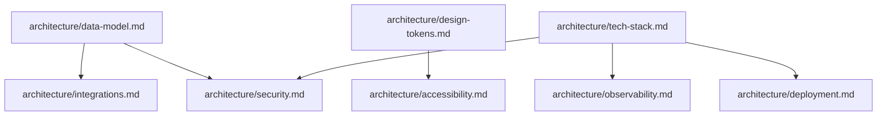

# Architecture Template

This file defines TWO templates:
1. **Index template**: `architecture.md` — the 50-80 line PRD-pyramid architecture index.
2. **Topic template**: `architecture/{topic}.md` — one standalone topic file per architectural concern.

Per CR-L10 self-containment, every topic file is independently readable. The index is a navigation hub, NOT a load-bearing reference.

---

## Template Usage Notes

The two-template pattern keeps the index small (50-80 lines) and puts all substantive content in topic files. Agents reading a specific feature file need only the index plus the topic files relevant to that feature — they never need to open the index to understand a topic, and they never need to open a topic file to understand the index.

**Standalone-topic enforcement**: every `architecture/{topic}.md` file MUST be independently readable without opening any other file. Concretely:

- A reader opening `architecture/data-model.md` alone MUST find all entity schemas, constraints, and relationships inline — not "see also data-model-extended.md".
- Forward informational pointers (e.g., "see design-tokens.md for related color semantics") are acceptable ONLY when they are additive, not load-bearing. A reader who does NOT follow the pointer must still fully understand the topic.
- Never write "see X.md for this information" when X.md is the only place the information lives.

This enforcement applies to every topic file regardless of size or complexity.

---

## Section 1: Index Template

Path: `<prd-pyramid-root>/architecture.md`

Total length: 50-80 lines (longer files lose their navigation utility).

```markdown
---
title: Architecture Index
last_updated: YYYY-MM-DD
---

# Architecture Index

{1 paragraph: what architectural concerns are documented in this pyramid and how to navigate. Name the product, list the top-level topics, and state that each topic file is independently readable.}

## Topics

| Topic | File | Summary |
|-------|------|---------|
| Tech Stack | architecture/tech-stack.md | {1 sentence describing layers, key choices} |
| Data Model | architecture/data-model.md | {1 sentence: entity count, key relationships} |
| Design Tokens | architecture/design-tokens.md | {1 sentence: token categories covered; omit row if no UI} |
| Integrations | architecture/integrations.md | {1 sentence: external services and auth models} |
| Security | architecture/security.md | {1 sentence: threat model scope} |
| Accessibility | architecture/accessibility.md | {1 sentence: WCAG target level and scope; omit row if no UI} |
| Coding Conventions | architecture/coding-conventions.md | {1 sentence: policy scope} |
| Test Isolation | architecture/test-isolation.md | {1 sentence} |
| Observability | architecture/observability.md | {1 sentence} |
| Development Workflow | architecture/dev-workflow.md | {1 sentence} |
| Git & Branch Strategy | architecture/git-strategy.md | {1 sentence} |
| Code Review | architecture/code-review.md | {1 sentence} |
| Performance | architecture/performance.md | {1 sentence} |
| Deployment | architecture/deployment.md | {1 sentence} |
| AI Agent Config | architecture/ai-agent-config.md | {1 sentence} |
| NFRs & Glossary | architecture/nfr.md | {1 sentence} |

{Omit rows for topics that do not apply. Only files that exist in the pyramid are listed.}

## Topic Dependencies



{Mermaid only — no ASCII art per cofounder/CLAUDE.md diagrams policy. Adjust edges to reflect actual dependencies in this pyramid. Remove nodes for omitted topics.}

## Cross-Cutting Concerns

- {Observability spans data-model (what events to log) and tech-stack (logging library choice).}
- {Security spans data-model (PII fields), tech-stack (secret management), and integrations (auth model).}
- {Design tokens span accessibility (contrast ratios) and coding-conventions (no inline raw values).}
- {Add or remove entries to reflect this product's actual cross-cutting surface.}
```

---

## Section 2: Topic Template

Path: `<prd-pyramid-root>/architecture/{topic}.md`

Each topic file MUST be standalone — a reader who opens just `architecture/data-model.md` should learn the data model without opening other files. No "see X.md" cross-references for context; only forward-pointers like "see design-tokens.md for related color semantics" are acceptable when the link is informational, not load-bearing.

```markdown
---
topic: {topic-name}
last_updated: YYYY-MM-DD
status: draft | accepted | implemented
---

# {Topic Title}

## Summary

{2-3 sentences: what this topic covers, what decisions are recorded here, and the scope boundary (what is NOT in this file). A reader who only reads this section should understand whether they need to read further.}

## {Body Section 1 — topic-specific}

{Substantive content for this topic. See "Topic-Specific Requirements" below for what each named topic must include. All content that a consuming agent needs must be present here — not referenced elsewhere.}

## {Body Section 2 — topic-specific}

{Additional topic-specific sections as needed.}

## Glossary (Topic-Local)

{Terms used in this topic file that are NOT already defined in common/domain-glossary.md. Define them here so the file is independently readable. An empty section is acceptable when all terms are in the domain glossary — do NOT omit the heading.}

## Open Questions

- {Unresolved decisions, outstanding approvals, or items blocked on external input. Use "None." if all questions are resolved.}

## Change Log

- YYYY-MM-DD: created
```

---

## Topic-Specific Requirements

### tech-stack.md

Stack components organized by layer (frontend / backend / data / infra). Each component includes: name, version pin, purpose, and alternatives considered.

```markdown
# Tech Stack

## Summary

{2-3 sentences covering layers present and key technology choices.}

## Stack Overview

| Layer | Technology | Version | Purpose | Alternatives Considered |
|-------|-----------|---------|---------|------------------------|
| Frontend | {e.g. React} | {e.g. 19.x} | {why} | {what was rejected} |
| Backend | {e.g. Go} | {e.g. 1.23} | {why} | {what was rejected} |
| Database | {e.g. PostgreSQL} | {e.g. 16.x} | {why} | {what was rejected} |
| Infrastructure | {e.g. AWS ECS} | — | {why} | {what was rejected} |

## Frontend Stack Detail

{Omit if no user-facing interface.}

| Concern | Choice | Version | Rationale |
|---------|--------|---------|-----------|
| UI Framework | {e.g. React} | {e.g. 19.x} | {why} |
| CSS Approach | {e.g. Tailwind CSS} | {e.g. 4.x} | {why} |
| Component Library | {e.g. Shadcn/ui} | {e.g. latest} | {why} |
| State Management | {e.g. Zustand} | {e.g. 5.x} | {why} |
| Build Tool | {e.g. Vite} | {e.g. 6.x} | {why} |
| E2E Testing | {e.g. Playwright} | {e.g. 1.x} | {why} |
```

---

### data-model.md

Every entity must be the canonical source that feature leaves copy from (CR-L10 self-containment). Include all field types, constraints (NOT NULL, UNIQUE, FK), and relationships with cardinality.

```markdown
# Data Model

## Summary

{2-3 sentences: number of entities, key relationships, and persistence strategy.}

## {EntityName}

| Field | Type | Constraints | Description |
|-------|------|-------------|-------------|
| id | {e.g. UUID} | NOT NULL, PK | Primary key |
| {field} | {type} | {NOT NULL / UNIQUE / FK → Entity.id} | {description} |

{Repeat for every entity. Each entity gets its own H2 section.}

## Relationships

| Relationship | Cardinality | FK Location | Notes |
|-------------|------------|-------------|-------|
| {EntityA} → {EntityB} | 1:N | {EntityB.entityA_id} | {business reason} |

{Include all relationships. State cardinality explicitly: 1:1, 1:N, M:N (with junction table name).}

## Indexes

| Table | Columns | Type | Reason |
|-------|---------|------|--------|
| {table} | {col1, col2} | {BTREE / GIN / partial} | {query pattern it supports} |
```

---

### design-tokens.md

Token catalog with semantic names ONLY (CR-L12 design-token-semantics). Never use raw values like `#FF0000` as the token name or primary identifier. Token category sections: color, spacing, typography, motion, elevation. Omit this file if the product has no user-facing interface.

```markdown
# Design Tokens

## Summary

{2-3 sentences: what token categories are defined, the semantic naming convention, and implementation mechanism (e.g. CSS custom properties, Tailwind config).}

## Color Tokens

| Token | Semantic Meaning | Usage |
|-------|-----------------|-------|
| color.primary | Brand primary action color | Buttons, links, focus rings |
| color.primary.subtle | Lightest primary tint | Background highlights |
| color.secondary | Brand secondary action color | Supporting actions |
| color.semantic.success | Positive outcome indicator | Success states, confirmations |
| color.semantic.warning | Caution indicator | Warning messages |
| color.semantic.error | Failure/destructive indicator | Error states, destructive actions |
| color.semantic.info | Informational indicator | Info banners, tooltips |
| color.bg.default | Default page background | Page canvas |
| color.bg.subtle | Slightly elevated surface | Cards, panels |
| color.bg.muted | Disabled/inactive surface | Inactive tabs, disabled inputs |
| color.fg.default | Primary text color | Body text |
| color.fg.muted | Secondary/de-emphasized text | Captions, helper text |
| color.border.default | Default border color | Input borders, dividers |

{Replace token names or add product-specific tokens as needed. Actual values are set during PRD Phase 3 and recorded in system-design — not here.}

## Spacing Tokens

| Token | Scale Step | Usage |
|-------|-----------|-------|
| spacing.xs | Tightest internal padding | Inline badges, dense lists |
| spacing.sm | Compact padding | Compact buttons, tags |
| spacing.md | Default internal padding | Standard buttons, inputs |
| spacing.lg | Default gap between elements | Section padding, card padding |
| spacing.xl | Large section margin | Page-level vertical rhythm |
| spacing.2xl | Major section separation | Hero sections, page breaks |

## Typography Tokens

| Token | Semantic Role | Usage |
|-------|--------------|-------|
| typography.display | Largest display text | Hero headings |
| typography.heading.xl | Page title | H1 |
| typography.heading.lg | Section title | H2 |
| typography.heading.md | Subsection title | H3 |
| typography.body | Default body text | Paragraphs |
| typography.body.sm | Small body text | Captions, hints |
| typography.mono | Monospaced text | Code, IDs |

## Motion Tokens

| Token | Semantic Role | Usage |
|-------|--------------|-------|
| motion.duration.fast | Micro-interactions | Hover, toggle feedback |
| motion.duration.normal | Standard transitions | Panel open/close |
| motion.duration.slow | Complex animations | Page transitions |
| motion.easing.default | General-purpose easing | Most transitions |
| motion.easing.enter | Entrance easing | Elements entering view |
| motion.easing.exit | Exit easing | Elements leaving view |

## Elevation Tokens

| Token | Semantic Role | Usage |
|-------|--------------|-------|
| elevation.base | Flat, no shadow | Default content surface |
| elevation.raised | Slightly elevated | Cards, popovers |
| elevation.overlay | Floating above content | Modals, drawers |
| elevation.toast | Highest stack | Transient notifications |
```

---

### integrations.md

Each external integration must document: name, purpose, auth model, data flow direction, failure handling. (Corresponds to `external-deps.md` in the backup template.)

```markdown
# Integrations

## Summary

{2-3 sentences: how many external integrations, primary auth pattern (API key / OAuth / service account), and failure-handling philosophy.}

## Integration Inventory

| Service | Purpose | Auth Model | Data Flow | Failure Handling | Fallback |
|---------|---------|-----------|-----------|-----------------|----------|
| {name} | {what it does for us} | {API key / OAuth 2.0 / service account} | {inbound / outbound / bidirectional} | {what happens when down} | {degraded mode or retry strategy} |

{One row per external integration. Include all third-party APIs, SaaS services, and external data sources.}

## Integration Details

### {Integration Name}

| Aspect | Detail |
|--------|--------|
| Endpoint | {base URL or SDK package} |
| Auth | {token type, storage location, rotation policy} |
| Rate Limits | {requests/min or requests/day} |
| Timeout | {ms} |
| Retry Policy | {max attempts, backoff strategy} |
| Data Sent | {what data we send, PII implications} |
| Data Received | {what data we receive, PII implications} |

{Repeat for each integration that warrants detail.}
```

---

### security.md

Threat model topics relevant to PRD scope: auth, authz, data privacy, audit. Each topic must include both the threat and the mitigation policy.

```markdown
# Security

## Summary

{2-3 sentences: threat model scope, primary security concerns, and compliance requirements (if any).}

## Threat Model

| Threat | Attack Vector | Mitigation Policy |
|--------|-------------|------------------|
| Unauthorized access | {e.g. credential theft} | {e.g. MFA required; session tokens expire in 1h} |
| Injection | {e.g. SQL / command injection} | {e.g. parameterized queries; no string concatenation into queries} |
| Data exfiltration | {e.g. over-privileged API keys} | {e.g. least-privilege scopes; audit log on bulk export} |
| Secret leakage | {e.g. credentials in logs/VCS} | {e.g. secrets never logged; pre-commit hook blocks .env commits} |

## Authentication & Authorization Policy

| Aspect | Policy |
|--------|--------|
| Auth mechanism | {e.g. JWT with short expiry + refresh token} |
| Session lifetime | {e.g. access token 1h; refresh token 30d} |
| Authorization model | {e.g. RBAC with roles defined in auth-model.md; or "see auth-model.md for role matrix"} |
| Privilege escalation | {e.g. re-authentication required for destructive actions} |

## Data Protection

| Aspect | Policy |
|--------|--------|
| Secrets in source | {e.g. forbidden; enforced by pre-commit hook and CI scan} |
| PII at rest | {e.g. encrypted at column level for fields listed in data-model.md} |
| PII in transit | {e.g. TLS 1.2+ on all external connections} |
| PII in logs | {e.g. masked; log pipeline strips fields marked PII} |
| Dependency scanning | {e.g. Snyk in CI; critical CVEs block merge} |

## Audit Trail

| Operation | Logged Fields | Retention |
|-----------|-------------|-----------|
| {e.g. login attempt} | {who, when, result, IP} | {e.g. 90 days} |
| {e.g. admin privilege use} | {who, what, when, affected entity} | {e.g. 1 year} |
```

---

### accessibility.md

WCAG target level, interaction-mode coverage matrix (each Glossary interaction mode has an accessible counterpart), color-contrast requirements. Omit if no user-facing interface.

```markdown
# Accessibility

## Summary

{2-3 sentences: WCAG target level, interaction-mode scope, and any special user groups this product must serve.}

## Baseline Requirements

| Aspect | Requirement |
|--------|------------|
| WCAG Level | {2.1 AA / 2.1 AAA} |
| Keyboard Navigation | All interactive elements reachable via Tab; logical tab order; no keyboard traps |
| Screen Reader | All images have alt text; form fields have associated labels; dynamic content uses ARIA live regions |
| Focus Indicators | Visible focus ring on all interactive elements; minimum 3:1 contrast ratio |
| Color Contrast — Normal Text | Minimum 4.5:1 |
| Color Contrast — Large Text | Minimum 3:1 |
| Color Contrast — UI Components | Minimum 3:1 |
| Motion | Respect `prefers-reduced-motion`; no auto-playing animations longer than 5 seconds |
| Touch Targets | Minimum 44×44px for touch interfaces |
| Error Identification | Errors identified by more than color alone (icon + text) |

## Interaction-Mode Coverage Matrix

Each interaction mode from the project glossary must have an accessible counterpart:

| Interaction Mode | Accessible Counterpart | Standard |
|-----------------|----------------------|---------|
| click | keyboard Enter/Space equivalent | WCAG 2.1.1 |
| form | label association + error announcement | WCAG 1.3.1, 3.3.1 |
| drag | keyboard-operable alternative | WCAG 2.1.1 |
| keyboard | no traps; logical order | WCAG 2.1.2 |
| scroll | keyboard-scrollable; no scroll traps | WCAG 2.1.1 |
| hover | focus-triggered equivalent | WCAG 1.4.13 |
| swipe | touch-target size; pointer alternative | WCAG 2.5.5 |
| voice | visual equivalent for all voice-triggered actions | WCAG 1.1.1 |
| scan | text alternative for QR/barcode content | WCAG 1.1.1 |

{Remove rows for interaction modes not used in this product.}

## Color-Contrast Requirements

Design tokens referenced in design-tokens.md MUST satisfy these ratios. Token values are set during system-design phase.

| Token Pair | Minimum Ratio | Context |
|-----------|--------------|---------|
| color.fg.default on color.bg.default | 4.5:1 | Body text |
| color.fg.muted on color.bg.default | 4.5:1 | Secondary text |
| color.semantic.error on color.bg.default | 4.5:1 | Error text |
| color.primary on color.bg.default | 3:1 | UI component (button background) |
| color.border.default on color.bg.default | 3:1 | Input borders |
```

---

### Other Topic Files

For the remaining topics from the backup template (coding-conventions.md, test-isolation.md, dev-workflow.md, git-strategy.md, code-review.md, observability.md, performance.md, backward-compat.md, ai-agent-config.md, deployment.md, shared-conventions.md, auth-model.md, privacy.md, nfr.md, navigation.md, i18n.md), apply the universal Topic Template from Section 2. Every file MUST include:

- frontmatter (`topic`, `last_updated`, `status`)
- `## Summary` (2-3 sentences with scope boundary)
- topic-specific body sections (tables matching the backup template content)
- `## Glossary (Topic-Local)` (may be empty; heading MUST be present)
- `## Open Questions`
- `## Change Log`

The backup template at `skills/prd-analysis.backup/architecture-template.md` contains the detailed table schemas for each of these topics and should be consulted for the body content structure.

---

## Required Sections Summary

| Section | Index (`architecture.md`) | Topic (`architecture/{topic}.md`) |
|---------|--------------------------|----------------------------------|
| frontmatter | yes (`title`, `last_updated`) | yes (`topic`, `last_updated`, `status`) |
| Title (H1) | yes | yes |
| Summary / overview paragraph | yes (inline in body) | yes (dedicated `## Summary`) |
| Topics table | yes | no |
| Mermaid dependency diagram | yes | no (informational pointers only) |
| Cross-Cutting Concerns | yes | no |
| Body (topic-specific content) | no | yes |
| Glossary (Topic-Local) | no | yes (may be empty; heading required) |
| Open Questions | no | yes |
| Change Log | no | yes |
