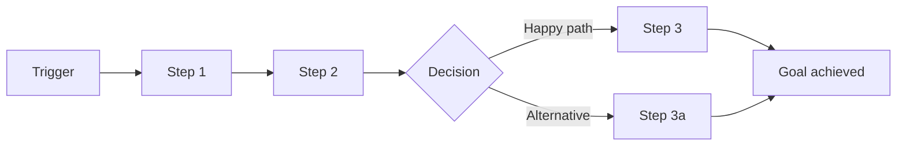
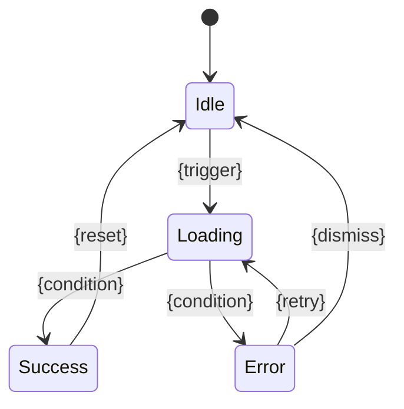

# Artifact Templates — prd-analysis

All prd-analysis output is **document-variant** (Variant 1). Every leaf must be self-contained
(≤ 300 lines) and independently readable — all required context is copied inline, never
cross-referenced. Agents read a single file and have everything they need.

**ID formats:** journeys `J-001`, `J-002` … features `F-001`, `F-002` … sequential,
zero-padded, stable across iterations. File slugs use kebab-case. Design tokens use semantic
names (`color.primary`, `spacing.md`, `motion.duration.normal`) — never raw values.

---

## README Index Template

The README.md is the pyramid apex — navigation only. No feature details, no architecture
deep-dives. Omit any section that has nothing useful to say.

```markdown
# PRD: {Product Name}

> {One-sentence product vision}

## Problem & Goals

{2-3 sentences: who has the problem, why it matters}

**Goals:**

| Metric | Target | Baseline | How to Measure |
|--------|--------|----------|----------------|
| {metric} | {target} | {current or N/A} | {measurement method} |

**Scope:** {in/out of scope — brief}

## Evidence Base

| Decision | Evidence Type | Source | Confidence |
|----------|--------------|--------|------------|
| {decision} | {User interviews / Analytics / Assumption} | {source} | {High/Medium/Low} |

## Competitive Landscape

{Omit for internal tools with no external alternatives.}

| Alternative | How It Solves the Problem | Strengths | Weaknesses |
|-------------|--------------------------|-----------|------------|
| {competitor} | {brief} | {strengths} | {weaknesses} |

**Our Differentiation:** {1-2 sentences}
**Table Stakes:** {baseline features users expect}

## Users

| Persona | Role | Primary Goal |
|---------|------|-------------|
| {Name} | {role} | {goal} |

## User Journeys

| ID | Journey | Persona | Key Pain Points | Spec |
|----|---------|---------|----------------|------|
| J-001 | {name} | {persona} | {brief} | [journey](journeys/J-001-{slug}.md) |

See [journeys/](journeys/) for full journey maps with touchpoints and error paths.

## Cross-Journey Patterns

{Omit if only one journey. Document recurring themes across journeys.}

| Pattern | Affected Journeys | Implication | Addressed by Feature |
|---------|------------------|-------------|---------------------|
| {pattern} | J-001, J-003 | {infrastructure need} | [F-{XXX}](features/F-{XXX}-{slug}.md) |

## Feature Index

| ID | Feature | Type | Impact | Effort | Priority | Deps | Spec |
|----|---------|------|--------|--------|----------|------|------|
| F-001 | {name} | UI | H | M | P0 | — | [spec](features/F-001-{slug}.md) |
| F-002 | {name} | API | H | S | P0 | F-001 | [spec](features/F-002-{slug}.md) |

Type: `UI` · `API` · `Backend` — comma-separated if multiple apply (e.g., `UI, API`).

## Risks

| Risk | Likelihood | Impact | Mitigation | Affected Features |
|------|-----------|--------|------------|-------------------|
| {risk} | H/M/L | H/M/L | {strategy} | F-{XXX} |

## Roadmap

**Phase 1 — MVP** (P0 features)
- [F-001: {name}](features/F-001-{slug}.md)

**Phase 2** (P1 features)
- [F-003: {name}](features/F-003-{slug}.md)

## References

- [User Journeys](journeys/)
- [Architecture, Design Tokens & Data Model](architecture.md)
```

---

## Journey Template (J-NNN)

File: `journeys/J-{NNN}-{slug}.md`. Omit any section with no useful content.

```markdown
---
id: J-{NNN}
slug: {kebab-case-name}
persona: {who}
status: active
---

# J-{NNN}: {Journey Name}

**Persona:** {who}
**Trigger:** {what event or need initiates this journey}
**Goal:** {what the user is trying to accomplish}
**Frequency:** {daily / weekly / on-demand / one-time}

## Journey Flow



## Touchpoints

| # | Stage | User Action | System Response | Screen/View | Interaction Mode | Emotion | Pain Point | Mapped Feature |
|---|-------|-------------|-----------------|-------------|------------------|---------|------------|----------------|
| 1 | {stage} | {what user does} | {system response} | {screen name — consistent across journeys} | {click/form/drag/keyboard/scroll/hover/swipe/voice/scan} | {positive/neutral/negative} | {friction, if any} | — |

**Stage vocabulary:** Discovery · Onboarding · Core Task · Completion · Return · Recovery

**Interaction modes:** `click` `form` `drag` `keyboard` `scroll` `hover` `swipe` `voice` `scan`
— list the primary mode; details go in the feature's Interaction Design section.

**Mapped Feature** is backfilled in Step 4 (cross-linking). Leave `—` during initial writing.

**Screen/View names must be consistent across all journeys** — the same screen referenced in
different journeys uses the same name. This builds the de-facto screen inventory.

## Alternative Paths

| Condition | Diverges at | Path | Rejoins at |
|-----------|-------------|------|------------|
| {when} | Step {#} | {what happens} | Step {#} or dead end |

## Page Transitions

{Omit for single-screen journeys.}

| From (Step #) | To (Step #) | Transition Type | Data Prefetch | Notes |
|---------------|-------------|-----------------|---------------|-------|
| {#1 Dashboard} | {#2 Task Detail} | {navigate (push)/modal/drawer/back} | {API/cached/none} | {e.g. skeleton during fetch} |

## Error & Recovery Paths

| Error Scenario | Occurs at | User Sees | Recovery Action | Mapped Feature |
|---------------|-----------|-----------|-----------------|----------------|
| {what goes wrong} | Step {#} | {error message} | {recovery action} | — |

## E2E Test Scenarios

{Omit for single-touchpoint journeys.}

| Scenario | Path | Steps (touchpoints) | Features Exercised | Expected Outcome |
|----------|------|---------------------|--------------------|------------------|
| {e.g. happy path} | Happy | #1 → #2 → #3 | F-001, F-003 | {observable end state} |
| {e.g. error recovery} | Error & Recovery | #1 → Error at #2 → #3 | F-003, F-009 | {observable end state} |

## Journey Metrics

| Metric | Target | Baseline | Measurement | Verification |
|--------|--------|----------|-------------|--------------|
| Completion rate | {%} | {current or N/A} | {how} | {manual/E2E/monitoring — pass criteria} |
| Time to complete | {duration} | {N/A} | {how} | {pass criteria} |
| Drop-off point | Step {#} | {N/A} | {how} | {pass criteria} |
```

---

## Feature Template (F-NNN)

File: `features/F-{NNN}-{slug}.md`. Each file is **self-contained** — a coding agent
implements the feature by reading only this file. All context (data models, conventions,
journey pain points) is copied inline. Omit sections that don't apply.

```markdown
---
id: F-{NNN}
slug: {kebab-case-name}
priority: P0 | P1 | P2
effort: S | M | L | XL
status: active
---

# F-{NNN}: {Feature Name}

> **Priority:** P0 | P1 | P2  **Effort:** S | M | L | XL

## Context

**Product:** {one sentence}
**Relevant architecture:** {only the parts this feature touches — 3-5 lines inline}
**Relevant data models:** {copy entity definitions this feature reads/writes — inline, not a file reference}
**Relevant conventions:** {copy applicable policy text from architecture/ topic files inline —
error handling, logging, concurrency, security, API format. Never say "see architecture.md".
Also copy when applicable: code review policy, performance budgets, backward-compat rules,
observability requirements, AI agent config references. Omit what this feature doesn't touch.}
**Permission:** {which roles can access and at what level — e.g. "Admin: full, Member: read-only".
Omit for single-role products or features with no access restrictions.}

## User Stories

- As a {persona}, I want to {action}, so that {outcome}.

## Journey Context

- **Journey:** [J-{NNN}: {name}](../journeys/J-{NNN}-{slug}.md) — Touchpoints #{n} — Pain points: {which resolved}

**Priority rationale:** {why this priority — link to evidence or goal metric from README}

## Requirements

1. {Precise, unambiguous requirement — "must", "returns", "rejects", not "should consider"}
2. ...

## Acceptance Criteria

Behavioral (Given/When/Then):
- Given {precondition}, when {action}, then {result}
- Given {precondition}, when {edge case}, then {result}

{If dependencies exist, include at least one cross-feature integration criterion:}
- Given {upstream feature} has {output}, when {this feature consumes it}, then {observable result}

Non-behavioral (include applicable dimensions, omit the rest):
- **Performance:** {e.g. p95 < 200ms for N concurrent users}
- **Resource limits:** {e.g. memory < 512MB for datasets up to 10k records}
- **Concurrency:** {e.g. 3 simultaneous writers without data loss}
- **Security / permissions:** {e.g. Viewer role receives 403 on write}
- **Degradation:** {e.g. functions with GitHub API unavailable, using cached data}

## API Contract

{Only for features that expose or consume APIs. Omit for pure UI or background-job features.}

**`{METHOD} {/path}`**

Request:
```json
{ "field": "type — description" }
```

Response (success — {status}):
```json
{ "field": "type — description" }
```

Response (error — {status}):
```json
{ "error": "per shared-conventions error format" }
```

## Interaction Design

{Required for user-facing features. Omit for backend-only (background jobs, pure API, infra).}

### Screen & Layout

**Screen/View:** {must match Screen/View name from journey touchpoints}
**Route:** {URL pattern for web; command/screen identifier for TUI}
**Layout:** {visual structure using design token references —
e.g. "two-column, sidebar width spacing.64, cards with radius.lg and shadow.md"}

### Component Contracts

{Only for non-trivial components with meaningful props/events/slots.}

**{ComponentName}**

| Prop | Type | Required | Default | Description |
|------|------|----------|---------|-------------|
| {name} | {type} | Y/N | {value} | {what it controls} |

| Event | Payload | Description |
|-------|---------|-------------|
| {name} | {type} | {when emitted} |

### Interaction State Machine



| From | Event | To | System Feedback | Side Effects |
|------|-------|----|-----------------|-------------|
| {state} | {action} | {state} | {spinner/toast/banner} | {API call, cache flush} |

Rules: every state has ≥1 exit; loading states have both success AND error exits.

### Form Specification

{Only for features with forms.}

| Field | Type | Label (i18n key) | Validation | Error Message (i18n key) |
|-------|------|-------------------|------------|--------------------------|
| {name} | text/email/select/checkbox | {feature}.{field}.label | {required, minLength(3)} | {feature}.{field}.error.required |

**Submission:** validate on {blur/submit/change after first submit}; success → {redirect/state};
error → {inline errors/toast}.

### Accessibility

**WCAG Level:** {2.1 AA / 2.1 AAA}

| Action | Key | Behavior |
|--------|-----|----------|
| {navigate list} | Arrow Up/Down | {moves focus between items} |

| Element | Role | Label/Description | Live Region |
|---------|------|-------------------|-------------|
| {search results} | region | aria-label="{i18n key}" | {polite} |

### Responsive Behavior

| Breakpoint | Layout Change | Component Change |
|------------|--------------|-----------------|
| < sm (mobile) | {single column} | {hamburger menu} |
| >= lg (desktop) | {three-column} | {full sidebar} |

## State Flow

{Business entity lifecycle — omit for stateless CRUD.}

```mermaid
stateDiagram-v2
    [*] --> {State1}
    {State1} --> {State2}: {event}
    {State2} --> [*]
```

## Edge Cases

- Given {unusual state}, when {trigger}, then {observable, assertable result}
- Given {boundary value}, when {action}, then {observable result}
{If Permission defined:}
- Given {unauthorized role}, when {restricted action}, then {rejection — e.g. 403, no data modified}

## Dependencies

- Depends on: [F-{XXX}](./F-{XXX}-{slug}.md) — {reason}
- Blocks: [F-{YYY}](./F-{YYY}-{slug}.md) — {reason}

## Implementation Notes

- **Approach:** {strategy}
- **Key files:** {paths to modify or suggested structure}
- **Testing:** {what to test}
- **Pitfalls:** {what to avoid}
```

---

## Architecture Index Template

File: `architecture.md` — index only (~50-80 lines). No section content lives here; all detail
is in `architecture/` topic files. Feature files copy relevant policies inline from topic files.

```markdown
# Architecture: {Product Name}

## High-Level Architecture

{Mermaid diagram or concise textual description of component relationships}

## Architecture Index

| Topic | File | Summary |
|-------|------|---------|
| Tech Stack | [tech-stack.md](architecture/tech-stack.md) | {one-line summary} |
| Design Tokens | [design-tokens.md](architecture/design-tokens.md) | {one-line — omit if no UI} |
| Navigation | [navigation.md](architecture/navigation.md) | {one-line — omit if no UI} |
| Accessibility | [accessibility.md](architecture/accessibility.md) | {one-line — omit if no UI} |
| Internationalization | [i18n.md](architecture/i18n.md) | {one-line} |
| Data Model | [data-model.md](architecture/data-model.md) | {one-line} |
| External Dependencies | [external-deps.md](architecture/external-deps.md) | {one-line} |
| Coding Conventions | [coding-conventions.md](architecture/coding-conventions.md) | {one-line} |
| Test Isolation | [test-isolation.md](architecture/test-isolation.md) | {one-line} |
| Security | [security.md](architecture/security.md) | {one-line} |
| Development Workflow | [dev-workflow.md](architecture/dev-workflow.md) | {one-line} |
| Git & Branch Strategy | [git-strategy.md](architecture/git-strategy.md) | {one-line} |
| Code Review | [code-review.md](architecture/code-review.md) | {one-line} |
| Observability | [observability.md](architecture/observability.md) | {one-line} |
| Performance Testing | [performance.md](architecture/performance.md) | {one-line} |
| Backward Compatibility | [backward-compat.md](architecture/backward-compat.md) | {one-line — omit for v1/MVP} |
| AI Agent Configuration | [ai-agent-config.md](architecture/ai-agent-config.md) | {one-line} |
| Deployment | [deployment.md](architecture/deployment.md) | {one-line} |
| Shared Conventions | [shared-conventions.md](architecture/shared-conventions.md) | {one-line} |
| Authorization | [auth-model.md](architecture/auth-model.md) | {one-line — omit if single-role} |
| Privacy & Compliance | [privacy.md](architecture/privacy.md) | {one-line — omit if no personal data} |
| NFRs & Glossary | [nfr.md](architecture/nfr.md) | {one-line} |

{Omit rows for topics that don't apply — only list files that exist.}
{Always present: coding-conventions, test-isolation, security, dev-workflow, git-strategy,
code-review, observability, performance, ai-agent-config, shared-conventions.}
{Conditionally present: design-tokens/navigation/accessibility (omit for no-UI products);
i18n (omit only if single-language AND no multi-locale consumers);
auth-model (omit for single-role); privacy (omit for no personal data);
backward-compat (omit for v1/MVP).}
```

---

## Architecture Topic Template

Each `architecture/{topic}.md` is a standalone document ≤ 300 lines. Agents read only the
topic files relevant to their feature. Feature files copy relevant policy text inline.

**Design token values** use semantic names. Token tables below are defaults (Tailwind CSS
conventions for web) — replace with project-specific values confirmed during Phase 3.

```markdown
# {Topic Title}

{Purpose sentence — what decisions live here.}

## {Section}

| Aspect | Policy / Value | Notes |
|--------|---------------|-------|
| {aspect} | {policy or value} | {when to override or omit} |
```

**Design Token shape** (for `architecture/design-tokens.md`):

| Token category | Key tokens |
|----------------|-----------|
| Colors | `color.primary.{50–900}`, `color.secondary.{50–900}`, `color.neutral.{50–950}`, `color.semantic.{success/warning/error/info}`, `color.bg.{default/subtle/muted}`, `color.fg.{default/muted}`, `color.border.default` |
| Typography | `font.family.{sans/mono}`, `font.size.{xs/sm/base/lg/xl/2xl/3xl/4xl}`, `font.lineHeight.{tight/normal/relaxed}`, `font.weight.{normal/medium/semibold/bold}` |
| Spacing | `spacing.{0/1/2/3/4/6/8/12/16}` (0px → 64px scale) |
| Borders / Shadows | `radius.{none/sm/md/lg/xl/full}`, `shadow.{sm/md/lg}` |
| Breakpoints | `breakpoint.{sm/md/lg/xl/2xl}` (640px → 1536px) |
| Motion | `motion.duration.{fast/normal/slow}` (150ms/300ms/500ms), `motion.easing.{default/in/out/inOut}` |
| Z-index | `z.{base/dropdown/sticky/overlay/modal/popover/toast}` (0 → 60) |

---

## Tombstone Template (evolve-mode)

Deprecated features and journeys get a tombstone file instead of silent removal. Prevents
agents from chasing deprecated items into the previous PRD.

File: `features/F-{NNN}-{slug}.md` (same path as original, full rewrite with DEPRECATED status)

```markdown
---
id: F-{NNN}
slug: {kebab-case-name}
status: deprecated
---

# F-{NNN}: {Feature Name} — DEPRECATED

| Field | Value |
|-------|-------|
| Status | Deprecated |
| Reason | {why deprecated — 1 sentence} |
| Replaced by | [F-{NNN}](F-{NNN}-{slug}.md) or N/A |
| Original | [→ baseline](../../{YYYY-MM-DD-product}/features/F-{NNN}-{slug}.md) |

{1-2 sentences for agent context: why deprecated, what agent should do instead.
If Replaced by is N/A, explain why no replacement is needed.}
```

Journey tombstones follow the same shape — `journeys/J-{NNN}-{slug}.md` with `id: J-{NNN}`.

---

## Key Rules (applies to all leaf types)

- **Self-contained:** opening one file gives a reader everything needed to act on it.
  Cross-references are navigation aids only — they must never be load-bearing.
- **≤ 300 lines per leaf.** Split large content across multiple files.
- **No empty sections.** Omit any section that has nothing useful to say.
- **Consistent Screen/View names** across all journeys — same screen, same name everywhere.
- **Design tokens by semantic name** — `color.primary`, `spacing.md` — never raw hex/px.
- **Precise language** — "must", "returns", "rejects". Not "should consider", "might want to".
- **Testable criteria** — every acceptance criterion and edge case maps to an automated test.
