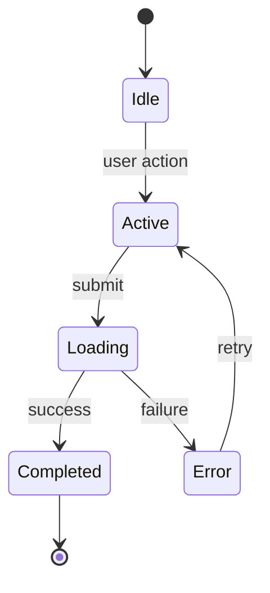

## Template Usage Notes

1. **Every section is REQUIRED unless marked `(optional)`.** Do not omit required sections because they seem empty — write "None" or "N/A" with a brief rationale if a section has no applicable content. Optional sections are explicitly labelled.
2. **Self-contained per CR-L10** means all referenced context (data models, journey touchpoints, conventions, dependencies) is **copied inline** into this file. Never write "see data-model.md" or link to another file. A coding agent implementing this feature reads only this file.
3. **F-NNN IDs** are zero-padded 3-digit integers (F-001, F-002, ...), sequential, and **stable across iterations**. Never renumber an existing feature — if a feature is retired, use a tombstone; the ID is not recycled.

---
id: F-NNN
slug: {feature-slug}
title: {Feature Title}
priority: P0 | P1 | P2 | P3
mvp: in | out | conditional
status: draft | accepted | implemented | deprecated
journeys: [J-NNN, J-MMM]
touchpoints: [J-NNN.{step-id}]
owner: {persona-name or "platform"}
created: YYYY-MM-DD
last_updated: YYYY-MM-DD
---

# F-NNN: {Feature Title}

## Overview
{1-2 paragraph summary — what the feature does, who benefits, and its primary value. Write for a reader who has not seen the PRD. Name the persona(s), describe the core capability, and state why it matters to the product.}

## User Story
As a {persona}, I want to {action}, so that {motivation}.

## Acceptance Criteria
- [ ] AC-1: Given {pre-state}, When {action}, Then {observable result and measurable assertion}.
- [ ] AC-2: Given {pre-state}, When {edge-case action}, Then {observable result with threshold or binary outcome}.
- [ ] AC-3: ...

{Each AC must be measurable — binary pass/fail or threshold (e.g. "response time < 200 ms at p95"). No fuzzy assertions such as "user is satisfied" or "experience is smooth".}

{If this feature has dependencies (see Dependencies section), include at least one cross-feature integration criterion:}
- [ ] AC-INT: Given {upstream feature F-XXX} has {completed its action / produced its output}, When {this feature consumes it}, Then {end-to-end observable result}.

## State Machine
{Required if the feature has ≥ 2 user-visible states. Use `stateDiagram-v2`. If the feature is purely stateless, write "N/A — feature is stateless" and skip the diagram.}



{Accompany the diagram with a transition table:}

| From | Event | To | System Feedback | Side Effects |
|------|-------|----|-----------------|-------------|
| Idle | {user action} | Active | {what the user sees} | {API calls, analytics events} |
| Active | submit | Loading | spinner | POST /resource |
| Loading | success | Completed | success toast | cache invalidated |
| Loading | failure | Error | inline error message | none |
| Error | retry | Active | fields re-enabled | none |

**Rules:**
- Every state must have at least one exit (no dead states).
- Every transition must specify system feedback.
- Loading states must have both success AND error exits.

## Interaction Mode
{Per glossary: list the **primary** mode from: `click` | `form` | `drag` | `keyboard` | `scroll` | `hover` | `swipe` | `voice` | `scan`. If the feature is multi-modal, list the primary mode first and secondary mode(s) after, e.g. "Primary: form. Secondary: keyboard (submit via Enter)."}

Primary: {mode}
Secondary (optional): {mode — omit if single-modal}

## Inline Data Model
{Self-contained per CR-L10. Copy entity schemas relevant to this feature from the architecture data model INLINE — do not write "see data-model.md". Include only the entities this feature reads or writes. If no persistent entities are involved, write "N/A — feature is stateless."}

```yaml
{EntityName}:
  id: uuid
  {field_name}: {type}           # {description}
  status: enum [draft, active, archived]
  created_at: timestamp
  updated_at: timestamp

{RelatedEntityName}:
  id: uuid
  {foreign_key}: uuid            # FK to {EntityName}.id
  {field_name}: {type}
```

## Inline Journey Context
{Self-contained per CR-L10. Copy the relevant touchpoint rows from the journey files inline. The implementing agent must not need to open any journey file.}

| Step | Stage | Screen | Action | Mode | System Response | Pain Point |
|------|-------|--------|--------|------|-----------------|------------|
| J-NNN.{step-id} | {stage name} | {screen/view name} | {user action} | {interaction mode} | {system response} | {pain point or "None"} |

## Inline Conventions
{Self-contained per CR-L10. Copy applicable formatting, validation, and error-handling rules from the architecture conventions inline. Include only conventions this feature must follow. Omit conventions this feature does not touch.}

**Validation:**
- {e.g. Trim whitespace from all string inputs before validation.}
- {e.g. Normalize email to lower-case before persistence.}

**Error States:**
- {e.g. Show inline error below the offending field with `aria-describedby` pointing to the error element.}
- {e.g. API errors: surface the `error.message` field from the shared error envelope.}

**Loading States:**
- {e.g. Skeleton placeholder for async loads expected to take > 300 ms; spinner for < 300 ms.}

**Security / Permissions:**
- {e.g. Viewer role receives HTTP 403 on write operations; no data is returned in the response body.}

**Observability:**
- {e.g. Log `feature.action.attempted` and `feature.action.succeeded` / `feature.action.failed` at INFO level.}

## Dependencies
- Depends on: {F-XXX — reason, or "none"}
- Blocks: {F-YYY — reason, or "none"}

## MVP Boundary Note
{Required if `mvp: conditional` in frontmatter, or if this feature touches the MVP boundary. State the cutoff criterion and the impact-vs-effort reasoning that determined the `conditional` status. If `mvp: in` or `mvp: out` with no ambiguity, write "N/A."}

## Open Questions
- {Question to resolve before implementation. Mark RESOLVED with the answer when answered.}

## Change Log
- YYYY-MM-DD: created
- YYYY-MM-DD: {description of change}
