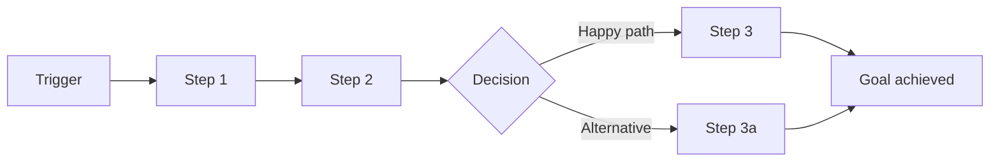

# Journey Template — journeys/ directory

The journeys/ directory documents all key user journeys. It bridges personas (README.md) and
features (features/*.md) — every feature should trace back to a journey touchpoint, and every
journey pain point should have feature coverage.

## Directory Structure

```
journeys/
├── J-001-{slug}.md        # Individual journey spec
├── J-002-{slug}.md
└── ...
```

The Journey Index lives in the top-level README.md (see `prd-template.md`), not in a separate
file — consistent with how Feature Index works.

---

## Individual Journey File Template (J-{NNN}-{slug}.md)

Each journey file is self-contained: all context a consuming agent needs is present inline.
Omit any section that has no useful content.

---

### Header

```markdown
# J-{001}: {Journey Name}

**Persona:** {who — copy the full persona description inline; do not reference README.md}
**Trigger:** {what event or need initiates this journey}
**Goal:** {what the user is trying to accomplish}
**Frequency:** {how often this journey occurs — daily / weekly / on-demand / one-time}

## Preconditions

- {system state required before this journey can begin — e.g. "user has completed onboarding", "at least one project exists"}
- {account or permission state required — e.g. "user holds Editor role or higher"}
- {data state required — e.g. "a draft feature spec exists with status 'open'"}
```

---

### Persona (inline copy)

```markdown
## Persona

**Name / Role:** {e.g. "Alex — Solo Founder"}
**Goals:** {what this persona is ultimately trying to achieve}
**Frustrations:** {recurring pain points this persona experiences}
**Technical fluency:** {low / medium / high}
**Context:** {brief narrative — when and how this persona encounters the product}
```

> Copy the relevant persona block from the PRD README inline here. A coding agent or reviewer
> reading this journey file MUST NOT need to open README.md to understand who the user is.

---

### Journey Flow

```markdown
## Journey Flow


```

---

### Touchpoints

```markdown
## Touchpoints

| # | Stage | User Action | System Response | Screen/View | Interaction Mode | Emotion | Pain Point | Mapped Feature |
|---|-------|-------------|-----------------|-------------|------------------|---------|------------|----------------|
| 1 | {stage name} | {what the user does} | {what the system does} | {screen or view — e.g. "Dashboard", "Settings > Profile", "CLI prompt". Use consistent names across journeys} | {primary interaction pattern: click / form / drag / swipe / keyboard / scroll / hover / voice / scan} | {positive / neutral / negative} | {frustration or friction, if any} | [F-{XXX}](../features/F-{XXX}-{slug}.md) |
```

**Mapped Feature** is backfilled during PRD Step 4 (cross-linking) after features are derived
from touchpoints. During initial journey writing (Phase 2), leave this column blank or mark as
`—`. Do not block journey completion on feature mapping.

**Stages** are logical phases of the journey, such as:
- **Discovery** — user becomes aware of the product/feature
- **Onboarding** — first-time setup, learning
- **Core Task** — primary value delivery
- **Completion** — task done, confirmation, next steps
- **Return** — coming back, picking up where left off
- **Recovery** — handling errors, failures, edge cases

---

### Success Outcome

```markdown
## Success Outcome

{Describe what the user sees or has achieved when this journey completes successfully. Be
observable: what is on screen, what changed in the system, what confirmation the user received.}

**User signal of success:** {e.g. "toast 'Project saved' appears; user lands on Project Detail view"}
**System state after success:** {e.g. "project record persisted; audit log entry written; collaborators notified"}
```

---

### Alternative Paths

```markdown
## Alternative Paths

| Condition | Diverges at | Path | Rejoins at |
|-----------|-------------|------|------------|
| {when this happens} | Step {#} | {what happens instead} | Step {#} or dead end |
```

---

### Page Transitions

```markdown
## Page Transitions

{How the user moves between screens during this journey. Omit for single-screen journeys.}

| From (Step #) | To (Step #) | Transition Type | Data Prefetch | Notes |
|---------------|-------------|-----------------|---------------|-------|
| {e.g. #1 Dashboard} | {e.g. #2 Task Detail} | {navigate (push) / navigate (replace) / modal / drawer / back} | {e.g. task data via API / cached / none} | {e.g. show skeleton during fetch, restore scroll position} |
```

---

### Error & Recovery Paths

```markdown
## Error & Recovery Paths

| Error Scenario | Occurs at | User Sees | Recovery Action | Mapped Feature |
|----------------|-----------|-----------|-----------------|----------------|
| {what goes wrong} | Step {#} | {error message / state} | {how user recovers} | [F-{XXX}](../features/F-{XXX}-{slug}.md) |
```

---

### E2E Test Scenarios

```markdown
## E2E Test Scenarios

{Translate the journey flow into executable end-to-end test specifications. Each scenario covers
a full path (happy, alternative, or error) through the journey, crossing feature boundaries.
Omit for single-touchpoint journeys.}

| Scenario | Path | Steps (touchpoints) | Features Exercised | Expected Outcome |
|----------|------|---------------------|--------------------|------------------|
| {e.g. "Happy path: PRD to execution"} | Happy | #1 → #2 → #3 → #4 | F-001, F-003, F-005 | {observable end state} |
| {e.g. "Error: agent failure mid-run"} | Error & Recovery | #1 → #2 → Error at #3 → Recovery #4 | F-003, F-009 | {e.g. "failed task retried, quality gate re-run, execution resumes"} |
| {e.g. "Alternative: user edits before execution"} | Alternative | #1 → #2a → #3 | F-001, F-006 | {e.g. "modified task list used for scheduling"} |
```

---

### Journey Metrics

```markdown
## Journey Metrics

| Metric | Target | Baseline | Measurement | Verification |
|--------|--------|----------|-------------|--------------|
| Completion rate | {%} | {current or N/A} | {how to measure} | {manual acceptance / automated E2E / monitoring — and pass/fail criteria} |
| Time to complete | {duration} | {current or N/A} | {how to measure} | {manual acceptance / automated E2E / monitoring — and pass/fail criteria} |
| Drop-off point | {step #} | {current or N/A} | {how to measure} | {manual acceptance / automated E2E / monitoring — and pass/fail criteria} |
```

---

### Related Features (Back-references)

```markdown
## Related Features

| Feature ID | Title | Relationship |
|------------|-------|--------------|
| [F-{XXX}](../features/F-{XXX}-{slug}.md) | {Feature title} | {covers touchpoint #N / covers error at #N / foundational dependency} |
```

> Back-references are populated during PRD Step 4 cross-linking. List every feature that covers
> at least one touchpoint or error in this journey.

---

### Applicable Design Tokens

**Required for journeys covering any UI screens. Omit only for journeys with no user-facing screens (e.g. background job monitoring, CLI-only single-command journeys).**

```markdown
## Applicable Design Tokens

{Copy the relevant design token definitions inline from architecture/design-tokens.md. A
reviewer or agent reading only this journey file must not need to open another file to
understand which visual/motion properties apply to screens in this journey.}

| Token | Value | Usage in this journey |
|-------|-------|----------------------|
| {e.g. `color.primary`} | {e.g. `#1A73E8`} | {e.g. primary CTA on Step 2 — Dashboard screen} |
| {e.g. `spacing.md`} | {e.g. `16px`} | {e.g. gap between touchpoint cards on Step 3} |
| {e.g. `motion.duration.standard`} | {e.g. `200ms`} | {e.g. page transition animation Steps 1→2} |
```

---

## Typical Journeys to Consider

Not all products need all of these. Use this as a checklist to avoid blind spots:

- **First-time use / Onboarding** — the user's very first experience
- **Core task (happy path)** — the primary value delivery, everything goes right
- **Core task (unhappy path)** — the primary task but things go wrong (bad input, network
  failure, permission denied)
- **Return visit** — user comes back after time away, needs to re-orient
- **Power user** — advanced/bulk operations, shortcuts, integrations
- **Admin / Management** — configuration, user management, settings
- **Upgrade / Migration** — moving from old system or free tier to paid

---

## Key Rules

- **Every feature must map to at least one journey touchpoint** — orphan features indicate
  either a missing journey or an unnecessary feature
- **Every pain point should have feature coverage** — unaddressed pain points are scope gaps
- **Journeys describe the user's experience, not the system's behavior** — write from the
  user's perspective
- **Include emotional states** — they drive UX decisions and priority
- **Alternative and error paths are not optional** — most bugs and UX failures live here
- **Copy relevant context inline** — persona description, design tokens, and applicable
  conventions must be inlined; do not force coding agents to open a second file
- **Screen/View names must be consistent across journeys** — the same screen referenced in
  different journeys must use the same name. This column builds a de-facto screen inventory
- **Interaction Mode captures the primary interaction pattern** at each touchpoint — informs
  the feature's Interaction Design section (component contracts, state machines, accessibility)
- **Page Transitions describe cross-screen navigation** during the journey — informs
  architecture.md's Navigation Architecture and feature-level routing
- **E2E Test Scenarios are required for multi-touchpoint journeys** — translate each path
  (happy, alternative, error) into a cross-feature test specification. Omit only for
  single-touchpoint journeys
- **Every Error & Recovery Path must trace to a testable criterion** — either an Edge Case or
  Acceptance Criterion in a Feature file
