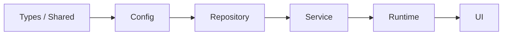
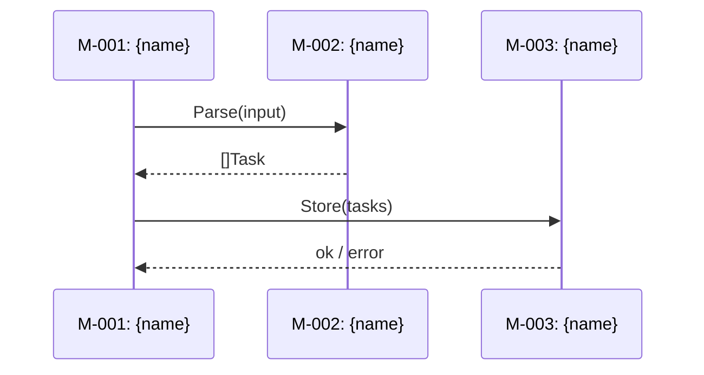
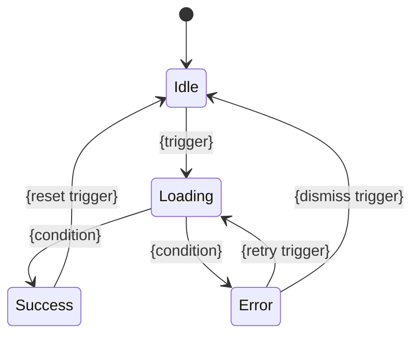
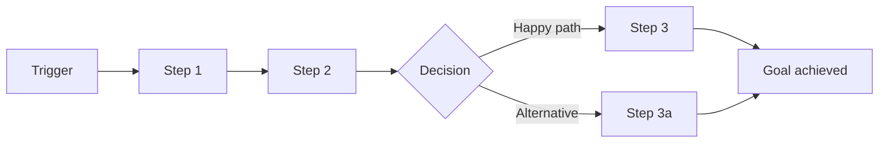

# User Prompt

Create a generative skill named `system-design` for the cofounder plugin (Claude Code skill plugin). This skill produces AI-coding-ready system design documents from PRD output, draft documents, or interactive Q&A, in the modern skill-forge multi-role architecture.

# Reference (legacy single-orchestrator implementation — use as the substantive content source for ALL templates, checklists, and lint rules)

@skills/system-design.backup/

The legacy directory above contains the authoritative content (templates, structural-lint catalog, design-review checklist, generate/review/revise mode logic). Mine it for substance. The architectural shell, however, must be **completely rebuilt** in the skill-forge multi-role pattern (orchestrator + planner + writers + cross-reviewer + adversarial-reviewer + reviser + summarizer + judge), matching the prd-analysis skill's architecture (also in this repo as `@skills/prd-analysis/` for reference).

# Skill Identity

- **Name**: `system-design`
- **Trigger phrases**: `/cofounder:system-design`, "system design", "module design", "technical design", "design review"
- **Description**: Use when the user needs to create system design documents from a PRD or requirements, perform module decomposition, define interfaces and data models, or review existing designs.
- **Plugin**: cofounder (lives at `skills/system-design/` in this repo)
- **Pipeline position**: consumes `/cofounder:prd-analysis` output (`docs/raw/prd/YYYY-MM-DD-{slug}/`); feeds `/cofounder:autoforge`.

# Input Modes (preserve from legacy)

```
/cofounder:system-design                                    # interactive
/cofounder:system-design path/to/prd/                       # PRD-based
/cofounder:system-design path/to/draft.md                   # document-based
/cofounder:system-design --output docs/raw/design/my-product
/cofounder:system-design --review docs/raw/design/xxx/      # read-only review
/cofounder:system-design --revise docs/raw/design/xxx/      # change management
```

# Output (preserve from legacy, but produced via writer fan-out instead of single-pass)

```
{output-dir}/YYYY-MM-DD-{product-name}/
├── README.md              # design overview + module index + Feature-Module mapping matrix
├── REVISIONS.md           # appended by --revise (created on first revision)
├── modules/
│   └── M-NNN-{slug}.md    # self-contained per-module spec (one writer per module in fan-out)
├── api/                   # only generated when project has APIs
│   └── API-NNN-{slug}.md  # self-contained API contract
└── .reviews/              # transient, not version-controlled
    ├── REVIEW-*.md / .applied.md   # semantic findings
    └── LINT-*.md / .applied.md     # mechanical findings
```

Default output dir: `docs/raw/design/YYYY-MM-DD-{slug}/`. Custom via `--output`.

# Core Principles (non-negotiable; preserve from legacy)

1. **Self-contained file**: each module spec is independently consumable by a coding agent. Copy relevant data models, conventions, and interface definitions inline; never link to a sibling file the agent must also read.
2. **Two-phase quality gate**: mechanical structural-lint (deterministic, grep-runnable: placeholder JSON, missing per-endpoint blocks, unfilled Boundary Enforcement columns, dangling endpoint references, PRD-architecture/analytics coverage gaps) runs BEFORE semantic design review. Mechanical findings never reach the semantic reviewer. Lint catalog must include at least L1..L5 (per-file) and X1..X8 (cross-file) checks from the legacy `structural-lint.md`.
3. **Feature-Module mapping matrix** is the bridge between PRD features and implementation modules. Symbols: `✦` = module modifies data for the feature, `△` = module provides read-only support. The matrix lives in README.md and is the key input for `/cofounder:autoforge`.
4. **Mechanical dependency-layering check**: forward-only layer order; reverse-layer imports are blockers requiring (a) consumer-side interface extraction into a lower layer, (b) callee relocation, or (c) documented cross-cutting exemption.
5. **API/module endpoint consistency check**: every endpoint named in any module's API Surface table MUST exist in `api/`, and every endpoint in `api/` MUST attach to a module's API Surface.
6. **Implementation Conventions enumeration check**: every file under PRD's `architecture/` MUST appear as a row in README's Implementation Conventions table, or be explicitly marked `N/A — {reason}`.
7. **Status lifecycle** (preserve from legacy): design-level Status is `Draft → Finalized → Implementing → Implemented`. Module-level `Impl` column tracks `NotStarted → InProgress → Done`.
8. **Cross-document paths**: when referencing PRD files, use relative paths from the design dir (e.g., `../../../prd/2026-04-09-foo/features/F-001-slug.md`).
9. **Self-contained Implementation Conventions translation**: PRD architecture topic files (coding conventions, test isolation, security policy, AI agent config, etc.) get translated into a single Implementation Conventions table inline in README, not cross-referenced.

# Modes

| Mode | Trigger | Behavior |
|------|---------|----------|
| Generate | default (no flag) | Full multi-round generation: planner plans modules, writers fan-out (one per module + one per API + one for README), structural-lint runs as scripts, cross-reviewer + adversarial-reviewer dispatch, summarizer, judge. Uses `.review/round-N/` pyramid. |
| `--review <design-dir>` | read-only review | Run structural-lint scripts + cross-reviewer + adversarial-reviewer over an existing design directory. Produce `REVIEW-*.md` + `LINT-*.md` files in `<design-dir>/.reviews/`. Do NOT modify any artifact files. |
| `--revise <design-dir>` | change management | Consume newest unapplied `REVIEW-*.md`, dispatch per-issue reviser sub-agents, re-run structural-lint, append entry to `REVISIONS.md`, rename consumed files to `*.applied.md`. |
| `--diagnose` | metrics | Pure-script aggregation of harness JSONL + dispatch-log per skill-forge convention. |

# Architecture (NEW in this rebuild — adopt skill-forge multi-role pattern)

- **Orchestrator** (this skill's SKILL.md): pure dispatch + bookkeeping; reads only `plan.md` and `verdict.yml`; writes only `.review/state.yml` and `.review/traces/round-N/dispatch-log.jsonl`.
- **Sub-agents** (each in its own prompt file under `generate/`, `review/`, `revise/`, `shared/`):
  - `planner-subagent.md` — heavy tier; reads PRD/draft, proposes module decomposition + Feature-Module matrix + dependency layering; writes `plan.md`.
  - `writer-subagent.md` — balanced tier; one writer per module file (and per API file, and for README). Each writer reads only the plan + relevant template + relevant PRD slice; writes a self-contained module/api/README and a `self-reviews/<trace_id>.md`.
  - `cross-reviewer-subagent.md` — heavy tier; reviews ALL leaves against the design-review checklist; produces issue files.
  - `adversarial-reviewer-subagent.md` — heavy tier; attacks the design (NFR violations, race conditions, security holes, missing failure modes); produces issue files.
  - `per-issue-reviser-subagent.md` — balanced tier; one reviser per open issue.
  - `summarizer-subagent.md` — light tier; writes `round-N/index.md`, `CHANGELOG.md`, `versions/<N>.md`.
  - `judge-subagent.md` — light tier; emits `verdict.yml` (converged/progressing/oscillating/diverging).
- **Scripts** under `scripts/`: structural-lint checks (one script per check, e.g., `check-placeholder-json.sh`, `check-per-endpoint-blocks.sh`, `check-boundary-enforcement.sh`, `check-endpoint-references.sh`, `check-architecture-coverage.sh`, `check-analytics-coverage.sh`, `check-dependency-layering.sh`, `check-implementation-conventions.sh`), aggregated by `run-checkers.sh`. Plus the standard skill-forge skeleton scripts (git-precheck, prepare-input, glossary-probe, scaffold, run-checkers, commit-delivery, metrics-aggregate, etc.).
- **Templates** under `common/templates/`: `design-readme-template.md`, `module-template.md`, `api-template.md`, `revision-entry-template.md`. Each writer reads only its template, NOT all of them.
- **Review criteria** in `common/review-criteria.md`: enumerate every dimension from legacy `design-review-checklist.md` plus structural-lint catalog (L1..L5, X1..X8). Each criterion gets a CR-NNN id, severity, type (script vs LLM), and check-script reference (when type=script).

# Hard Constraints

- Self-contained file principle MUST be enforced — no module/api/readme may dangle to a sibling for content.
- Mechanical structural-lint MUST run before semantic LLM review in every mode that triggers review (generate Step 9-equivalent, --review preamble, --revise gate).
- Cross-document paths MUST be relative, not absolute, so design directories are portable.
- Reverse-layer dependency imports MUST be blockers, not warnings.
- The skill MUST NOT use any third-party Python/bash dependencies (no pyyaml, jq, slugify) per skill-forge convention.
- Writer fan-out is parallel; each writer reads only its slice (one module's PRD features + the module template), not the entire PRD or full design.

# Acceptance Criteria

The new skill is acceptable when:
1. SKILL.md exists with correct frontmatter (name, version, description, trigger phrases) and mode-routing table.
2. Every legacy concept is preserved (self-contained, two-phase quality gate, Feature-Module matrix, dependency layering, API/module sync, Implementation Conventions enumeration, status lifecycle, cross-document paths).
3. Architecture is fully migrated to skill-forge pattern (orchestrator + 7 sub-agent roles + scripts + templates + review criteria).
4. Structural-lint catalog covers at minimum L1..L5 + X1..X8 from legacy `structural-lint.md`, expressed as one script per check.
5. Generate / --review / --revise / --diagnose modes all routable from SKILL.md.
6. All required files exist per skill-forge skeleton (config.yml, review-criteria.md, sub-agent prompts, scripts, templates, CHANGELOG.md, .review/README.md).
7. Plugin auto-discovery works — `skills/system-design/SKILL.md` registers as `/cofounder:system-design`.

# Expanded References

## @skills/system-design.backup/

_(directory; dir-mode=selective — tree + orientation files inlined (SKILL.md, README.md, LICENSE, CHANGELOG, *-template.md); used 64096 B)_

**File tree:**

- SKILL.md (6391 bytes)
- api-template.md (10607 bytes)
- design-review-checklist.md (20743 bytes)
- design-template.md (23373 bytes)
- generate-mode.md (40851 bytes)
- module-template.md (23725 bytes)
- review-mode.md (13591 bytes)
- revise-mode.md (34528 bytes)
- structural-lint.md (15852 bytes)

**Contents:**

### SKILL.md

```
---
name: system-design
description: "Use when the user needs to create system design documents from a PRD or requirements, perform module decomposition, define interfaces and data models, or review existing designs. Triggers: /system-design, 'system design', 'module design', 'technical design', 'design review'."
---

# System Design — AI-Coding-Ready Technical Design

Generate system design documents as a **multi-file directory**. Each module spec is a self-contained file — coding agents read only the file they need. Includes a structured design review phase that directly improves the documents.

## Input Modes

```
/system-design                                    # interactive mode
/system-design path/to/prd/                       # PRD-based mode
/system-design path/to/draft.md                   # document-based mode
/system-design --output docs/raw/design/my-project    # custom output dir
/system-design path/to/prd/ --output ./design     # both
/system-design --review docs/raw/design/xxx/          # review existing design (read-only)
/system-design --revise docs/raw/design/xxx/          # change management for existing design
```

**Note on evolved PRDs:** When a PRD has been evolved (`/prd-analysis --evolve`), use `/system-design` with the new incremental PRD path to generate a fresh design, or use `--revise` on the existing design to propagate specific PRD changes. There is no dedicated `--evolve` mode for system-design — `--revise` handles both in-place PRD changes and evolved PRD deltas.

## Mode Routing

Detect mode from the input flags and load only the relevant topic file. The Design Review checklist and the Structural Lint checklist are shared across modes.

| Mode | Trigger | Read These Files |
|------|---------|------------------|
| **Generate** (default) | No `--review` / `--revise` flag | `generate-mode.md` (load `structural-lint.md` at Step 9a; load `design-review-checklist.md` at Step 10) |
| **Review** | `--review <design-dir>` | `review-mode.md` + `design-review-checklist.md` (load `structural-lint.md` at Step 1.5 pre-scan) |
| **Revise** | `--revise <design-dir>` | `revise-mode.md` (load `structural-lint.md` at Step 7.0 gate; load `design-review-checklist.md` on demand per revise-mode.md instructions) |

Detect the mode first. Read the routing files for that mode only — do not load the others. Templates (`design-template.md`, `module-template.md`, `api-template.md`) are loaded per-section as needed during file generation.

**Structural Lint vs Design Review:** `structural-lint.md` catches deterministic, grep-runnable gaps (placeholder JSON, missing per-endpoint blocks, unfilled Boundary Enforcement columns, dangling hook↔endpoint references). It runs before the semantic `design-review-checklist.md` so mechanical findings never consume reviewer attention. If the checklist keeps flagging a mechanical class across `--revise` cycles, extend `structural-lint.md` rather than accepting the review cost.

## Output Structure

```
{output-dir}/YYYY-MM-DD-{product-name}/
├── README.md              # Design overview + module index + mapping matrix
├── REVISIONS.md           # Revision history (only present after first --revise)
├── modules/
│   ├── M-001-{slug}.md    # Self-contained module design
│   └── ...
├── api/                   # Only generated when project has APIs
│   ├── API-001-{slug}.md  # Self-contained API contract
│   └── ...
└── .reviews/              # Transient — not version-controlled (gitignore: docs/raw/design/*/.reviews/)
    ├── REVIEW-*.md            # Semantic review findings, produced by --review, consumed by --revise
    ├── REVIEW-*.applied.md    # Same, after --revise consumes it (renamed by Bash mv)
    ├── LINT-*.md              # Structural-lint findings (L1..L5, X1..X8), produced by generate/review/revise
    └── LINT-*.applied.md      # Same, after generate/revise fixes and re-runs clean
```

Use templates: `design-template.md` (README), `module-template.md` (module specs),
`api-template.md` (API contracts).

**Agent consumption:** read README.md (overview + mapping matrix) → read one module file → implement. The module file alone is sufficient for a coding agent to start working.

## Output Path

- **Default:** `docs/raw/design/YYYY-MM-DD-{product-name}/`
- **Custom:** `--output <dir>` overrides the directory
- Confirm path with user before writing
- **Cross-document paths:** when referencing PRD files (Source Features, References, Analytics Coverage), use relative paths from the design directory to the PRD directory. Example: if PRD is at `docs/raw/prd/2026-04-09-foo/` and design is at `docs/raw/design/2026-04-09-foo/`, a module's Source Feature link would be `../../../prd/2026-04-09-foo/features/F-001-slug.md`

## Key Principles

- **Self-contained** — each module file can be independently consumed by a coding agent
- **Copy, don't reference** — relevant data models, interface definitions are copied inline
- **One question at a time** — don't overwhelm during interactive refinement
- **Design ≠ Plan** — this skill produces "how to build it" designs, not "who does what in what order" — task assignment and execution are handled by `/autoforge`
- **Review writes reports, revise applies them** — `--review` is read-only and produces `REVIEW-*.md` (semantic findings) plus `LINT-*.md` (mechanical gaps) in `.reviews/`. `--revise` consumes the newest REVIEW and re-runs lint to fix the gaps. Generate-mode's Step 10 self-review is the one place where review and fix happen in a single pass.
- **README is a stable navigational index, REVISIONS.md tracks history** — README.md stays a clean entry point so module/api links are easy to follow across versions; revision entries (written by `--revise`) accumulate in `REVISIONS.md` instead. REVISIONS.md is created on first revision; the README's References section links to it once it exists.
- **Omit empty sections** — if a section has nothing useful, skip it
- **Feature-Module mapping** — the mapping matrix is the bridge between requirements and implementation, serving as the key input for the planning phase

## Next Steps Hint

After committing, print the following guidance to the user:

```
System design complete: {output path}

Next steps:
  /autoforge {output path}
```
```

### api-template.md

```
# API Contract Template

Each file describes a group of related API endpoints. **Self-contained** — a coding agent implements the API by reading only this file.

## Template

The API contract file follows this structure. Omit any section that has no useful content.

### Header

```
# API-{001}: {API Group Name}

> **Direction:** internal | external  **Protocol:** REST | gRPC | CLI
```

### Context

**Owning module(s):** [M-{XXX}: {name}](../modules/M-{XXX}-{slug}.md)
If multiple modules jointly serve this API, list all with their responsibility scope.
**Serving features:** F-001, F-003

### Endpoints

Adapt the format below to match the protocol. Examples for REST, gRPC, and CLI follow.

#### REST Endpoints

Each endpoint MUST include every subsection below — Description, Authentication & Permissions, Request (including headers), Request example, Response, Response example, and Constraints. No subsection is optional at the endpoint level. File-level notes (e.g. a Dual-Surface block at the top of the file) do not substitute for per-endpoint fields — a reader opening a single endpoint must see its auth and constraints inline.

**{METHOD} {/path}**

**Description:** {what it does}

**Authentication & Permissions:**

| Requirement | Value |
|------------|-------|
| Required headers | {e.g. `x-api-key`, `anthropic-version`, `anthropic-beta: managed-agents-2026-04-01`} |
| Roles permitted | {e.g. Developer, OrgAdmin, Admin — or `internal-only`} |
| Workspace scoping | {e.g. "request must carry a workspace-scoped key; cross-workspace access returns 404 (existence-concealment)"} |

For internal-only endpoints, write `internal-only — invoked by M-XXX; no external callers` and skip roles/scoping.

**Request:**

| Parameter | Location | Type | Required | Description |
|-----------|----------|------|----------|-------------|
| {name} | path/query/body/header | string | Y | {desc} |

Location: `path` / `query` / `body` / `header` (e.g., Authorization, X-Request-ID)

**Request example:**

{Populated JSON — never `{}`. Include all required fields with realistic values. For endpoints with no request body (e.g. DELETE), show the full HTTP line with headers instead.}

```json
{
  "name": "example-task",
  "metadata": {"owner": "alice"}
}
```

**Response:**

| Status Code | Meaning | Body |
|-------------|---------|------|
| 200 | Success | {structure} |
| 400 | Bad request | `{"type":"error","error":{"type":"invalid_request_error","message":"..."}}` |
| 404 | Not found | `{"type":"error","error":{"type":"not_found_error","message":"..."}}` |

**Response example:**

{Populated JSON of the success body — never `{}`. Include a realistic object with stable-looking IDs (e.g. `task_01abc...`) and timestamps.}

```json
{
  "id": "task_01abc",
  "type": "task",
  "name": "example-task",
  "created_at": "2026-04-19T10:00:00Z"
}
```

**Constraints:**

- {Idempotency — e.g. "idempotent on `Idempotency-Key` header within 24 h window; differing body returns 409"}
- {Rate limit — e.g. "60 req/min/workspace shared with other mutations; governed by rate_limit_configs"}
- {Size — e.g. "request body ≤ 1 MiB; response `data[]` ≤ 100 items without cursor"}
- {Concurrency — e.g. "max 8 concurrent requests per key"}

For internal-only endpoints, list at minimum: concurrency cap, timeout, and idempotency semantics.

#### gRPC Services

```protobuf
service TaskService {
  rpc CreateTask(CreateTaskRequest) returns (CreateTaskResponse);
  rpc ListTasks(ListTasksRequest) returns (stream Task);
}

message CreateTaskRequest {
  string name = 1;
  string description = 2;
}

message CreateTaskResponse {
  string task_id = 1;
  Task task = 2;
}
```

**RPC: CreateTask**

**Description:** {what it does}

| Field | Type | Required | Description |
|-------|------|----------|-------------|
| name | string | Y | {desc} |

**Error codes:**

| gRPC Code | When | Description |
|-----------|------|-------------|
| INVALID_ARGUMENT | name is empty | {detail} |
| ALREADY_EXISTS | duplicate name | {detail} |

#### CLI Subcommands

**`{command} {subcommand} [flags]`**

**Description:** {what it does}

| Flag | Short | Type | Default | Description |
|------|-------|------|---------|-------------|
| --output | -o | string | stdout | {desc} |
| --format | -f | enum(json,table) | table | {desc} |

**Arguments:**

| Position | Name | Required | Description |
|----------|------|----------|-------------|
| 1 | {name} | Y | {desc} |

**Example:**

```bash
$ mytool task create --output json "My Task"
{"id": "t-001", "name": "My Task", "status": "created"}
```

**Exit codes:**

| Code | Meaning |
|------|---------|
| 0 | Success |
| 1 | Invalid input |
| 2 | Resource not found |

### Error Codes

| Code | Meaning | Trigger |
|------|---------|---------|
| {code} | {meaning} | {when} |

### Authentication & Permissions (File-level Summary)

{Summary only — each endpoint above MUST carry its own Authentication & Permissions block. This file-level summary lists the auth mechanism common to all endpoints and the role matrix overview. It does NOT replace per-endpoint fields.}

- **Auth mechanism:** {e.g. "API key via `x-api-key` header; JWT cookie for admin surface"}
- **Role matrix:** Developer / OrgAdmin / Admin — per-endpoint permitted roles are listed in each endpoint's block
- **Beta headers:** {e.g. "endpoints flagged [beta] require `anthropic-beta: managed-agents-2026-04-01`"}
- **Dual-surface paths:** {e.g. "all `/v1/*` paths are also available at `/api/v1/*` on the native surface" — if applicable}

Omit this file-level summary only when there is exactly one endpoint (all auth content lives in the endpoint block).

### Test Scenarios

{Key scenarios a coding agent must cover when testing this API. Focus on boundary values, error paths, and concurrency — not happy-path duplicates of the endpoint examples above.}

| Endpoint | Scenario | Input | Expected Result |
|----------|----------|-------|-----------------|
| {e.g. POST /tasks} | {e.g. missing required field} | `{"description": "no name"}` | 400, `{"error": "name is required"}` |
| {e.g. POST /tasks} | {e.g. duplicate name} | `{"name": "existing"}` | 409, `{"error": "task already exists"}` |
| {e.g. DELETE /tasks/:id} | {e.g. idempotent delete} | DELETE twice with same ID | First: 204; Second: 204 (not 404) |
| {e.g. GET /tasks} | {e.g. pagination boundary} | `?limit=0` | 400, or empty list depending on contract |

### Constraints (File-level Summary)

{Summary of constraints that apply uniformly across the endpoint group (e.g. shared rate-limit bucket, shared idempotency window, shared pagination contract). Per-endpoint deviations MUST still be listed in that endpoint's own Constraints block. This section never replaces per-endpoint Constraints.}

- {e.g. "All endpoints in this group share the `workspace.mutations` rate-limit bucket"}
- {e.g. "All list endpoints use cursor pagination with `limit` 1..100, default 20"}
- {e.g. "All mutation endpoints honor `Idempotency-Key` with a 24 h replay window"}

## Rules

- **Authoritative**: design API contracts refine and supersede PRD feature-level API contracts — they add parameter types, error codes, examples, and constraints. If a PRD feature's API Contract conflicts, the design version takes precedence
- **Direction**: `internal` = inter-module interface, `external` = exposed to outside consumers
- **Protocol**: each API file uses only the format matching its Protocol (REST, gRPC, or CLI) — delete the other protocol sections from the template
- **One file per API group**: group related endpoints together (e.g., all task CRUD in one file), not one file per endpoint
- **Per-endpoint completeness (REST)**: every endpoint MUST carry its own Authentication & Permissions block, Request table, Request example, Response table, Response example, and Constraints block. A file-level summary does NOT substitute — readers who open a single endpoint must see all of its contract inline. Reviewers reject endpoints where any of these subsections is missing or defers to "see file-level notes above".
- **Examples must be populated**: `{}` as a request or response body is rejected at review time. Examples must include realistic field values; every field in the corresponding Response table's Body column must appear in the example. For endpoints with no body (e.g. some DELETEs), show the full HTTP request line + headers and the full response envelope (e.g. `{"id":"...","type":"..._deleted"}`).
- **Forbidden placeholder patterns inside example code blocks** (`structural-lint.md` check L2 greps for these — they fail before review):
    - `"..."` used as a value
    - `/* ... */` or `// ...` comments of any kind (JSON has no comments)
    - A body that is literally `{}` in a Request example or Response example
    - `"<placeholder>"`, `"TBD"`, `"TODO"` as a value
    - `"snapshot of above"`, `"same as above"` — paste the content, don't reference it
    - `...` as the sole content of a value (e.g. `"items": [...]`) — write out at least one realistic element

  The `Response:` table's Body column and the `Response example:` block must be mutually consistent: every field named in the Body column appears as a key in the example, and every key in the example appears in the Body column (aside from envelope fields like `id` / `type` / `created_at` that are standard across responses).
- **Dual-surface paths**: if endpoints are served on both a public (`/v1/*`) and native (`/api/v1/*`) surface, each endpoint block must list both paths in its `METHOD path` header — a file-level summary note is not sufficient; readers of a single endpoint must see both paths.
- **Test Scenarios complement examples**: endpoint examples show happy-path usage; Test Scenarios cover boundaries, error paths, and concurrency. Don't duplicate happy-path in Test Scenarios. Focus on cases where the expected behavior is non-obvious or easily missed.
- **Omit whitelist** (only these sections may be omitted):
    - *Authentication & Permissions (File-level Summary)* — omit only when the file has exactly one endpoint
    - *Constraints (File-level Summary)* — omit when there are no cross-endpoint shared constraints
    - *Error Codes (file-level table)* — omit when error codes are fully enumerated per-endpoint with no file-level aggregation needed
    - *Test Scenarios* — omit if every endpoint is trivial CRUD with no edge cases
  - All per-endpoint subsections are mandatory and cannot be omitted.
- **Precise language**: "returns 400 when", "rejects if" — not "might return an error"
```

### design-template.md

```
# Design Template — README.md

The README.md is the navigational entry point for the design directory. Omit any section that has no useful content.

## Directory Structure

```
{output-dir}/
├── README.md              # Design overview + module index + mapping matrix
├── REVISIONS.md           # Revision history (only present after first --revise)
├── modules/
│   ├── M-001-{slug}.md    # Self-contained module design
│   └── ...
├── api/                   # Only when project has APIs
│   ├── API-001-{slug}.md  # Self-contained API contract
│   └── ...
```

## Template

The README.md follows this structure:

### Header

```
# System Design: {Product Name}

> {One-sentence design objective}
```

### Design Input

- **Source:** [{PRD name}]({path to PRD README.md}) | {document name} | Interactive
- **Date:** YYYY-MM-DD
- **Status:** Draft | Finalized | Implementing | Implemented

### Architecture Overview

{Mermaid diagram — more detailed than PRD, showing module interfaces and data flow}

### Dependency Layering

{Forward-only dependency order between module layers. Modules may only depend on modules in the same layer or layers to their left. This constraint prevents circular dependencies and enables parallel agent work on modules in different layers.}



{The diagram above is an example — replace with the actual layer order for this project. Each layer is a group of modules with the same architectural role.}

| Layer | Modules | May Depend On |
|-------|---------|---------------|
| {e.g. Types} | M-001, M-005 | — (no dependencies) |
| {e.g. Repository} | M-002 | Types |
| {e.g. Service} | M-003, M-004 | Types, Repository |
| {e.g. UI} | M-006 | Types, Service |

**Rule:** cross-layer dependencies must follow the left-to-right order. Any reverse dependency (e.g. Repository → Service) is a design violation that must be resolved by extracting a shared interface into a lower layer.

### Key Technical Decisions

| Decision | Options | Conclusion | Rationale |
|----------|---------|------------|-----------|
| {e.g. state management} | A: in-memory / B: SQLite / C: JSON files | C | {why} |
| {e.g. locale resolution} | A: Accept-Language middleware / B: user profile field / C: URL path prefix | A | {why — omit row if single-language backend} |
| {e.g. message catalog} | A: embedded JSON per locale / B: database-backed / C: third-party service | A | {why — omit row if single-language backend} |

### Implementation Conventions

{Stack-specific implementation patterns translated from PRD architecture.md's technology-agnostic policies. Module-level Relevant Conventions reference these patterns. Omit if PRD has no developer convention sections.}

| Category | PRD Policy | Implementation Pattern | Enforcement |
|----------|-----------|----------------------|-------------|
| Error handling | {e.g. errors must include context} | {e.g. `fmt.Errorf("doing X: %w", err)`} | {e.g. golangci-lint errcheck + wrapcheck} |
| Logging | {e.g. structured key-value, ERROR/WARN/INFO/DEBUG levels} | {e.g. `slog.Info("event", "key", val)` with JSON handler} | {e.g. lint rule banning fmt.Println in non-test code} |
| Input validation | {e.g. validate at system boundaries} | {e.g. `validate` struct tags at HTTP handler layer} | {e.g. code review checklist item} |
| Test isolation | {e.g. temp dirs, random ports, no global state} | {e.g. `t.TempDir()`, `net.Listen("tcp", ":0")`, no package-level vars in tests} | {e.g. `go test -race`, CI gate} |
| Dependency injection | {e.g. constructor injection, no global mutable state} | {e.g. `func NewService(deps Deps) *Service`} | {e.g. lint rule banning package-level `var`} |
| Concurrency | {e.g. context propagation, graceful cancellation} | {e.g. `context.Context` first parameter, `errgroup` for goroutine lifecycle} | {e.g. `go vet` copylocks check} |
| Security | {e.g. injection prevention, secret handling} | {e.g. parameterized queries, `os.Getenv` for secrets, never log tokens} | {e.g. gosec in CI, secret scanning} |
| CI gates | {e.g. lint → build → test with race → benchmark} | {e.g. GitHub Actions workflow with 4 sequential jobs} | {e.g. branch protection requiring CI pass} |
| Git workflow | {e.g. rebase + ff-only, conventional commits} | {e.g. branch protection: require rebase, commitlint pre-commit hook} | {e.g. CI commit message lint} |
| Performance | {e.g. p95 < 200ms, regression < 10%} | {e.g. Go benchmarks with `benchstat`, CI gate comparing against baseline} | {e.g. benchmark CI job with threshold check} |
| AI agent config | {e.g. CLAUDE.md as concise index, ~200 lines, references convention files} | {e.g. generate CLAUDE.md with project overview + key commands + references to .golangci-lint.yml, .github/workflows/, etc.} | {e.g. CI check that CLAUDE.md exists and is under 200 lines} |
| Deployment | {e.g. reproducible local env, CD pipeline, config management, environment isolation} | {e.g. docker-compose for local dev, GitHub Actions for CD, .env.example for config, per-agent Docker network for isolation} | {e.g. CI validates docker-compose up succeeds, CD requires manual approval for prod} |

### Module Index

| ID | Module | Type | Responsibility | Complexity | Deps | Impl | Spec |
|----|--------|------|---------------|------------|------|------|------|
| M-001 | {name} | backend | {one sentence} | M | — | — | [spec](modules/M-001-{slug}.md) |
| M-002 | {name} | frontend | {one sentence} | S | M-001 | — | [spec](modules/M-002-{slug}.md) |

Type: `backend` | `frontend` | `shared` — helps identify which modules have UI responsibilities
Impl: `—` (not started) | `In progress` | `Done` — tracks per-module implementation status; updated by coding agents or users when implementation begins/completes

**Two tracking dimensions:** The module `Status` field (Draft / Finalized / Implementing / Implemented) tracks the *design document's* lifecycle. The Module Index `Impl` column (`—` / In Progress / Done) tracks *code implementation* progress, updated by autoforge or manually. These are independent — a module can be Status=Finalized but Impl=— (designed but not yet coded).

### NFR Allocation

{Shows how PRD-level non-functional requirements are decomposed across modules. Helps identify hot-spot modules (carrying multiple critical NFRs) and gaps (NFRs not allocated to any module).}

| NFR Source | Category | PRD Target | Primary Module | Budget | Supporting Modules |
|------------|----------|------------|---------------|--------|-------------------|
| {e.g. NFR-001} | Performance | P99 < 500ms (task creation) | M-002 (< 300ms) | 60% | M-001 (< 100ms), M-003 (< 100ms) |
| {e.g. NFR-002} | Security | All user input sanitized | M-001 | — | M-003 (secondary validation) |

### Test Strategy

{Project-level testing approach derived from Step 3 Testing Deep-Dive. Provides the global context for per-module Testing sections.}

**Test pyramid:** {e.g. unit-heavy 70/20/10 — rationale from project characteristics}

**Toolchain:**

| Test Type | Framework | Runner |
|-----------|-----------|--------|
| Unit | {e.g. Jest / pytest / go test} | {e.g. CI parallel, local watch mode} |
| Integration | {e.g. Supertest / testcontainers} | {e.g. CI with service dependencies} |
| E2E | {e.g. Playwright / Cypress} | {e.g. CI against staging, nightly} |
| Contract | {e.g. Pact / custom shared fixtures} | {e.g. CI on interface changes} |

**Test data management:** {e.g. factories with sensible defaults; each test owns its data; transaction rollback for DB isolation}

**Shared Test Fakes Inventory:**

{A single source of truth for test doubles used across multiple modules. Every fake listed here is reused by name from module-level Testing sections (via the `Source` column in each module's Test isolation table). If a fake is used by only one module, keep it module-local and do NOT list it here. Omit this subsection only if the project has no cross-module test doubles.}

| Fake | Package Path | Implements | Used By | Notes |
|------|-------------|-----------|---------|-------|
| {e.g. `fakes.AuditSink`} | `internal/testutil/fakes` | `audit.Sink` (from M-005) | M-014, M-015, M-016, M-017, M-018 | in-memory recorder; `Emits()` returns recorded entries |
| {e.g. `fakes.NATS`} | `internal/testutil/fakes` | `messaging.Bus` (from M-008) | M-020, M-024, M-031 | `Publish` buffers messages; `Drain()` returns FIFO |
| {e.g. `fakes.ConfigReader`} | `internal/testutil/fakes` | `config.Reader` (from M-023) | M-034, M-042 | static map; thread-safe |
| {e.g. `fakes.OrgModelsReader`} | `internal/testutil/fakes` | `models.OrgReader` (from M-033) | M-042, M-043 | returns injected enabled-model list |

**Rules:**
- Any dependency referenced by ≥2 modules' Test isolation tables MUST have an entry here — module-local fakes for shared deps are rejected at review
- The `Implements` column names the production interface the fake satisfies, so readers can find the contract
- The `Used By` column lists module IDs; keep it current as modules are added or boundaries change

**NFR verification:**

| NFR Category | Verification Method | Tool | Trigger |
|-------------|-------------------|------|---------|
| Performance | {e.g. load test with k6} | {tool} | {e.g. pre-release, nightly} |
| Security | {e.g. dependency scan + SAST} | {tool} | {e.g. every CI run} |

**CI execution order:** {e.g. lint → unit → integration → E2E; fail-fast at each stage}

### Feature-Module Mapping

| | M-001 {name} | M-002 {name} | M-003 {name} |
|-------|:-:|:-:|:-:|
| F-001 {name} | ✦ | ✦ | |
| F-002 {name} | | ✦ | △ |
| F-003 {name} | △ | | ✦ |

✦ = requires modification  △ = read-only dependency

### Module Interaction Protocols

{All cross-module interactions. Each entry describes one dependency pair across module boundaries. This table and the Module Index `Deps` column are **two views of the same data** — every `(caller, callee)` pair that appears in any module's Deps (direct) cell MUST have a corresponding row here, and vice versa. Bidirectional sync is enforced at review time.}

| Interaction | Caller → Callee | Method | Data Format | Error Strategy | Contract Test |
|-------------|----------------|--------|-------------|----------------|---------------|
| {e.g. Task ingestion} | M-001 → M-002 | sync function call | `[]Task` | caller retries 3x, then fails with `ErrIngestFailed` | {e.g. shared fixture: valid/invalid Task payloads; both sides test against same fixtures} |
| {e.g. Status notification} | M-003 → M-001 | async event / message queue | `StatusEvent` JSON | dead-letter queue after 5 failures | {e.g. schema validation: producer and consumer validate against shared JSON schema} |

**Sync rule:** Before finalizing the design, enumerate every `(caller, callee)` pair implied by each module's Deps (direct) column. For each pair, either (a) this table has a matching row, or (b) the pair is called out in a cross-cutting note (e.g. same-layer L6 wiring, consumer-side-interface pattern) AND that note is linked from Dependency Layering. Any pair falling in neither is a review finding.

**Consumer-side interfaces:** When a same-layer or forward-layer dep is implemented via a consumer-declared interface (Wire-injected, producer implements), annotate the Deps cell like `M-007 (+ M-022 via consumer-side interface)` and add a dedicated row here with `Method = consumer-side interface (Wire-injected)`.

{For complex interactions, include a sequence diagram:}



### View / Screen Index

{Maps PRD journey touchpoints' Screen/View names to the frontend modules that implement them. Omit if the project has no user-facing interface (pure API, CLI-only with no TUI, background service).}

| View | Description | Primary Module | Source Features | Source Journeys |
|------|-------------|---------------|-----------------|-----------------|
| {e.g. Dashboard} | {one sentence — what the user sees and does here} | M-002 | F-001, F-003 | J-001 #3, J-002 #5 |
| {e.g. Settings > Profile} | {one sentence} | M-004 | F-007 | J-001 #7 |

**Notes:**
- View names must match the Screen/View column in PRD journey touchpoints exactly
- If a view is shared across multiple journeys, list all journey references
- Source Journeys format: `J-{id} #{n}` where `#n` is the touchpoint sequence number from the journey's Touchpoints table (e.g., `J-001 #3` = Journey J-001, touchpoint 3)
- For complex views, note the major sections/areas and which feature controls each

### Prototype-to-Production Mapping

{Maps PRD prototype components to production module destinations. Omit if PRD has no prototypes.}

| Prototype Component | Source Path (PRD) | Target Module | Action | Gap Description |
|--------------------|--------------------|---------------|--------|-----------------|
| {e.g. TaskList} | {prototypes/src/F-001-tasks/TaskList.tsx} | M-{NNN} | {Reuse / Refactor / Rewrite} | {what needs to change for production — omit for Reuse} |
| {e.g. SidebarModel (TUI)} | {prototypes/src/F-006-tui/sidebar.go} | M-{NNN} | {Reuse / Refactor / Rewrite} | {e.g. replace mock data with real agent state} |

**Action legend:**
- **Reuse** — prototype code is production-ready; copy to module with minimal changes (e.g. add route guard, swap mock data for real API)
- **Refactor** — structure is correct but implementation needs improvement (describe specifically in Gap)
- **Rewrite** — prototype served validation purposes only; implement from PRD feature spec

### Design System Conventions

{Shared UI implementation patterns. References PRD's Design Token System for visual values. Omit if no user-facing interface.}

**Design Token Source:** [{PRD name} architecture.md]({path to PRD architecture.md}#design-token-system)

**Token Implementation (Web):**

{Use this table for web/desktop UI. For TUI, use the TUI table below.}

| Token Category | Implementation | File/Config |
|---------------|---------------|-------------|
| Colors | {e.g. CSS custom properties via Tailwind theme} | {e.g. tailwind.config.ts theme.extend.colors} |
| Typography | {e.g. Tailwind font classes} | {e.g. tailwind.config.ts theme.extend.fontSize} |
| Spacing | {e.g. Tailwind spacing scale (default matches PRD tokens)} | {e.g. no config needed / custom config} |
| Motion | {e.g. CSS transitions referencing custom properties} | {e.g. globals.css :root variables} |

**Token Implementation (TUI):**

{Use this table for TUI products. Omit the Web table above.}

| Token Category | Implementation | File/Config |
|---------------|---------------|-------------|
| Colors | {e.g. lipgloss.Color constants referencing ANSI 256 values} | {e.g. internal/tui/theme.go} |
| Typography | {e.g. lipgloss.Bold / lipgloss.Italic styles} | {e.g. internal/tui/theme.go} |
| Spacing | {e.g. lipgloss.Padding / lipgloss.Margin in character units} | {e.g. internal/tui/theme.go} |
| Borders | {e.g. lipgloss.RoundedBorder / NormalBorder} | {e.g. internal/tui/theme.go} |

**Component patterns (Web):**
- **Loading states:** {e.g. skeleton components; duration from motion.duration tokens}
- **Error states:** {e.g. inline ErrorBanner with retry; uses color.semantic.error token}
- **Empty states:** {e.g. centered illustration + CTA; reusable EmptyState component}
- **Toast notifications:** {e.g. Sonner library, positioned top-right, auto-dismiss after 5s}
- **Modal dialogs:** {e.g. Shadcn Dialog, focus-trapped, Escape to close}
- **Form patterns:** {e.g. React Hook Form with Zod schema; inline error display per PRD form specs}

**Component patterns (TUI):**
- **Loading states:** {e.g. spinner model (⠋⠙⠹⠸⠼⠴⠦⠧); interval from motion.spinner.interval token}
- **Error states:** {e.g. error card with color.accent.error + ✗ icon; dual-channel (color + icon)}
- **Empty states:** {e.g. centered dim text message}
- **Modal/overlay:** {e.g. Command Center overlay with focus trap; Esc to close}
- **Input patterns:** {e.g. bubbles textinput; prefix shows current context}

**Responsive implementation (Web):**
- **Approach:** {e.g. mobile-first with Tailwind breakpoint prefixes}
- **Sidebar behavior:** {e.g. Sheet component on mobile (< md), fixed sidebar on desktop}
- **Grid system:** {e.g. CSS Grid with Tailwind grid classes; 12-column on desktop, single-column on mobile}

**Responsive implementation (TUI):**
- **Approach:** {e.g. terminal width detection via WindowSizeMsg}
- **Sidebar behavior:** {e.g. auto-hide below breakpoint.sidebar.collapse chars, Ctrl+B toggle}
- **Minimum terminal size:** {e.g. 80x24 — show warning if smaller}

**Dark mode / theming:** {e.g. CSS class-based with next-themes / terminal-dependent (ANSI colors adapt to terminal theme) / not supported}

### API Index

| ID | API | Direction | Spec |
|----|-----|-----------|------|
| API-001 | {name} | {internal/external} | [spec](api/API-001-{slug}.md) |

### Analytics Coverage

{Maps every PRD feature analytics event to a module responsible for emitting it. This section does not design the analytics implementation — it ensures the planning phase knows where analytics code must be added. Omit only if no features define Analytics & Tracking events.}

**Coverage rule:** enumerate every `## Analytics` event defined across PRD feature files — one row per event. Missing any event is a review finding, not an omission. Run `grep -A 20 "## Analytics" {PRD path}/features/*.md` (or equivalent) during generation to build the event list.

| Feature | Event | Trigger | Emitting Channel | Responsible Module |
|---------|-------|---------|-----------------|-------------------|
| [F-001: {name}]({path to PRD feature file}) | {event_name} | {user action} | {frontend `useAnalytics()` hook / backend `audit.Emit` / OpenTelemetry metric} | M-001 |
| [F-002: {name}]({path to PRD feature file}) | {event_name} | {user action} | {channel} | M-002 |

**Sweep fallback** (operational backend features with many events):

When a backend operational feature (e.g. queue depth, session lifecycle) emits dozens of events that are better covered by an `audit.Emit` + operator-dashboard channel than per-event rows, use a single sweep row: `F-004..F-042 (operational backend) → audit-log entries via audit.Emit → Log Viewer + operator dashboards (M-032/M-043). No frontend-analytics emission.` The sweep rule must name the feature IDs and the channel — not an unlabeled blanket.

### References

- [PRD]({path to PRD README.md})
- [User Journeys]({path to PRD journeys/})
- [Architecture & Glossary]({path to PRD architecture.md})
- [Revision History](REVISIONS.md) {omit on initial creation; added by `--revise` mode}

## REVISIONS.md Template

The REVISIONS.md file records the version chain for this design. It is created on the first `--revise` invocation and appended on each subsequent revision. Omit this file on initial creation — only `--revise` writes it.

```markdown
# Revision History — {Product Name} (System Design)

Chronological record of revisions to this design. Most recent entry first.

| Version | Date | Change Type | Previous Version | Summary of Changes |
|---------|------|-------------|-----------------|-------------------|
| {this directory name or "in-place"} | {YYYY-MM-DD} | {New version / In-place edit} | [{previous directory name}]({relative path}) or N/A | {what changed and why} |
```

**Rules:**
- New entries are inserted at the top of the table (most recent first)
- `Previous Version` links are relative paths from this directory — e.g. `../2026-03-01-{product}/REVISIONS.md`
- For in-place edits, `Version` may be the literal string `in-place` plus a date suffix if multiple in-place edits occur in the same directory

## Key Rules

- README.md is **navigational only** — no module implementation details
- Revision History lives in `REVISIONS.md`, not in README.md — keeps the navigational entry point stable as the version chain grows
- `Key Technical Decisions` records important choices and rationale, preventing redundant discussion
- `NFR Allocation` is the global view of how PRD-level NFRs decompose across modules — identifies hot-spot modules and coverage gaps
- `Feature-Module Mapping` is the core input for the planning phase (`/autoforge`)
- `Test Strategy` captures project-level testing approach — pyramid allocation, toolchain, test data management, NFR verification methods, and CI execution order. Per-module Testing sections derive from this global strategy. Omit if the project has no testable code (pure documentation, config-only)
- `Module Interaction Protocols` captures cross-module contracts that no single module file owns — the global view of how modules work together. The `Contract Test` column specifies how each interaction is verified (shared fixtures, schema validation, integration tests). **Bidirectional sync with Module Index Deps is required:** every pair in a module's Deps (direct) column must appear here, and every row here must correspond to an actual dep declared in Module Index (or be accounted for by a linked cross-cutting note).
- `Shared Test Fakes Inventory` (under Test Strategy) is the single source of truth for test doubles reused by ≥2 modules — prevents each module inventing its own fake for shared dependencies. Module-level Test isolation tables reference fakes by name from this inventory.
- `View / Screen Index` maps PRD journey screens to frontend modules — ensures every user-facing view has clear module ownership. Omit if the project has no user-facing interface
- `Design System Conventions` captures shared UI **implementation** patterns — references PRD's Design Token System for visual values and specifies how tokens map to code. Omit if no user-facing interface
- `Prototype-to-Production Mapping` connects PRD prototypes to production modules — each prototype component gets an Action (Reuse / Refactor / Rewrite) and a Gap Description. Omit if PRD has no prototypes
- `Dependency Layering` defines the forward-only dependency order — modules depend only on same-layer or leftward layers; reverse dependencies are design violations that must be resolved before implementation
- `Implementation Conventions` captures stack-specific patterns translated from PRD architecture.md's technology-agnostic developer convention policies — module-level Relevant Conventions reference these patterns instead of raw PRD policies. Omit if PRD has no developer convention sections
- `Analytics Coverage` bridges PRD feature analytics to module ownership — **one row per event** from every PRD feature's `## Analytics` section. Operational backend features that emit many events via `audit.Emit` may be grouped under a single sweep row that names the feature IDs and the emitting channel. Omit the whole section only if no features define analytics events.
- API Index only appears when the project has APIs — omit if not applicable
- No section should exist if it has nothing useful to say — omit empty sections
```

### module-template.md

```
# Module Spec Template

Each file is **self-contained** — a coding agent implements the module by reading only this file.

## Template

The module file follows this structure. Omit any section that has no useful content.

### Header

```
# M-{001}: {Module Name}

> **Source Features:** F-001, F-003  **Complexity:** S | M | L | XL
```

### Change Scope

{Only for revised designs (via `--revise`) or incremental designs on existing codebases. Omit for initial designs.}

**Status:** New | Modified
**Previous version:** [{previous module file}]({relative path}) — {only for Modified}
**What changed:** {only for Modified — brief description of changes from the previous version}

{Unchanged modules are carried forward verbatim from the previous version — no Change Scope section needed.}

### Responsibility

{What this module does and does NOT do — 2-3 sentences}

### Architecture Position

{Where this module sits in the overall architecture, which modules it interacts with — Mermaid diagram}

### Interface Definition

{Public interfaces / exported functions exposed to other modules. Use the project's language for code examples:}

```go
type TaskSource interface {
    Parse(input string) ([]Task, error)
}
```

### API Surface

{**Required** for any module that exposes HTTP/gRPC/CLI endpoints. Omit only for pure internal library modules with no callable external surface. Each row below is one endpoint; every column must be filled (no blanks, no "see API-XXX" cross-references — the module file is self-contained).}

| Method + Path | Auth & Role | Success | Error Codes | Request Example | Response Example | Constraints |
|--------------|-------------|---------|-------------|----------------|------------------|-------------|
| `POST /v1/tasks` | `x-api-key` + Developer | 201 | 400 invalid_request, 409 conflict, 429 rate_limit | see [API-001](../api/API-001-task.md#create-task) | see [API-001](../api/API-001-task.md#create-task) | idempotent on `Idempotency-Key`; body ≤ 1 MiB; 10 req/s/key |

Required columns (every row, no exceptions):
- **Method + Path** — full HTTP verb + path (include dual paths if the module serves `/v1/*` and `/api/v1/*`; do not rely on a file-level alias note)
- **Auth & Role** — required headers + role matrix (e.g. `x-api-key` + Developer/OrgAdmin/Admin), or `internal-only` for modules without external surface
- **Success** — HTTP status code for the happy path
- **Error Codes** — all triggerable status codes with error-type strings (e.g. `400 invalid_request_error`, `422 resource_error`)
- **Request Example / Response Example** — anchor links to populated JSON blocks in the owning API contract file (`api/API-XXX.md#...`); `{}` placeholder is not acceptable
- **Constraints** — rate limits, size caps, idempotency, concurrency caps (copy inline — do not say "see API contract")

If this module owns the API contract file itself, still fill all columns here (pointing to the API file's anchors) — a coding agent reading only this module file must be able to implement the handler without opening the API file.

### Relevant Conventions

{Copy applicable stack-specific implementation patterns from README's Implementation Conventions section. Use the translated patterns (language/framework idioms), not raw PRD policies. Also include applicable Shared Conventions from PRD architecture.md. Omit conventions this module doesn't touch.}

- **Error handling:** {e.g. `fmt.Errorf("doing X: %w", err)` — from Implementation Conventions error handling pattern}
- **Logging:** {e.g. `slog.Info("event", "key", val)` with JSON handler — from Implementation Conventions logging pattern}
- **Input validation:** {e.g. `validate` struct tags at handler layer — only if this module handles external input}
- **Concurrency:** {e.g. `context.Context` first parameter, `errgroup` for goroutine lifecycle — only if this module uses concurrency}
- **Test isolation:** {e.g. `t.TempDir()`, `net.Listen("tcp", ":0")` — from Implementation Conventions test isolation pattern}
- **API format:** {e.g. JSON, REST, pagination style — only if this module exposes or consumes APIs}
- **Error format:** {e.g. RFC 7807 Problem Details — only if this module produces error responses}
- **Testing:** {e.g. Jest for unit, Supertest for integration — framework mandates from PRD/README Test Strategy; see Testing section below for module-specific test strategy}

If this module requires a convention pattern not yet documented in README's Implementation Conventions, add the pattern to this module's Relevant Conventions section with a note: `[NEW — propose adding to README Implementation Conventions]`. The design review will surface these for promotion to project-wide conventions.

### Internal Design

{Core algorithms, state management, key flows — flowcharts or pseudocode. If source features define State Flow diagrams (stateDiagram), extract and refine the state machines here with implementation-level detail.}

### UI Architecture

{Only for frontend modules (Type = frontend). Omit for backend modules.}

**Views owned:** {list of views from README's View / Screen Index that this module implements}

**Prototype Reuse Guide:**

{Omit if no prototype exists for this module's source features, or if all mapped prototypes have Action = Rewrite.}

- **Source:** `{PRD path}/prototypes/src/{feature-slug}/` {web or TUI}
- **Action:** {Reuse / Refactor — from README Prototype-to-Production Mapping}
- **Files to copy/adapt:**

| Prototype File | Production Target | Action | Adaptation Notes |
|---------------|-------------------|--------|-----------------|
| {e.g. `sidebar.go`} | {e.g. `internal/tui/sidebar.go`} | Copy | {e.g. replace mock data with real agent state from M-003} |
| {e.g. `theme.go`} | {e.g. `internal/tui/theme.go`} | Copy | {e.g. no changes — token constants are production-ready} |
| {e.g. `TaskList.tsx`} | {e.g. `src/components/TaskList.tsx`} | Refactor | {e.g. extract API calls to service layer, add error boundary} |

- **Reusable patterns:** {list patterns the coding agent should preserve — e.g. "state machine in `Update()` method matches PRD spec; lipgloss styling approach; message routing pattern between models"}
- **What to discard:** {e.g. "hardcoded mock data in `testdata.go`; placeholder spinner — replace with real heartbeat from scheduler events"}

{**Rule:** When Action = Reuse, the coding agent MUST start by copying prototype files, then adapt. Do NOT rewrite from scratch. When Action = Refactor, start from prototype code and apply the documented adaptations.}

**Component Tree:**

{Show 2-3 levels of nesting. Leaf nodes are the smallest independently testable UI units (e.g., a form, a data table, a navigation bar) — not individual HTML elements.}

```
{ViewName}/
├── {ViewName}Layout          # top-level layout container
│   ├── {SectionA}            # major UI section
│   │   ├── {ChildComponent}
│   │   └── {ChildComponent}
│   └── {SectionB}
│       └── {ChildComponent}
```

**Routing:**

| Route | Component | Guard | Lazy Load | Data Prefetch |
|-------|-----------|-------|-----------|---------------|
| {route pattern from PRD} | {component name} | {e.g. authGuard / none} | {Yes / No} | {e.g. fetchData(id) / none} |

Guard: Name of the route guard function (e.g., `authGuard`, `roleGuard('admin')`). Use `—` if no guard is needed. Guards are referenced by name; implementation details belong in the module's Internal Design section.

**State Management:**

| State | Source | Scope | Implementation | Sync Strategy |
|-------|--------|-------|---------------|---------------|
| {e.g. taskList} | {API call / local / URL params} | {view / global / component} | {e.g. Zustand slice / useState / useSearchParams} | {e.g. React Query with 30s stale time / URL ↔ state sync on mount / —} |

**Key Interactions:**

| Interaction | Component | Triggers | Side Effects | Optimistic? |
|-------------|-----------|----------|-------------|-------------|
| {e.g. submit form} | {component name} | {e.g. POST /tasks via M-001} | {e.g. toast notification, invalidate query cache} | {Yes — add to list, rollback on error / No} |

**Frontend Performance (Web):**

| Metric | Target | Measurement | Optimization |
|--------|--------|-------------|-------------|
| LCP | {e.g. < 2.5s} | {e.g. Lighthouse CI} | {e.g. code split route, preload critical CSS} |
| INP | {e.g. < 200ms} | {e.g. Web Vitals lib} | {e.g. debounce search, virtualize long lists} |
| CLS | {e.g. < 0.1} | {e.g. Lighthouse CI} | {e.g. reserve space for async content} |
| Bundle (this module) | {e.g. < 150 KB gzipped} | {e.g. bundlesize CI check} | {e.g. tree-shake, lazy load heavy deps} |

**Frontend Performance (TUI):** {Use this table instead of Web Vitals for TUI modules.}

| Metric | Target | Measurement | Optimization |
|--------|--------|-------------|-------------|
| Render latency | {e.g. < 16ms per frame} | {e.g. teatest frame timing} | {e.g. avoid full re-render, update only changed regions} |
| Input-response time | {e.g. < 50ms} | {e.g. benchmark test} | {e.g. debounce rapid keystrokes} |
| Memory (RSS) | {e.g. < 150 MB with 500 messages} | {e.g. runtime.ReadMemStats} | {e.g. evict old messages, cap in-memory history} |

**Design System Usage:** {which patterns from README's Design System Conventions this module applies — e.g. "loading skeletons for async data, toast notifications for mutations, Sheet sidebar on mobile"}

**Accessibility Implementation:**
- Tab order: {describe the logical focus flow through this module's views}
- ARIA: {reference PRD feature spec's ARIA table; note implementation nuances}
- Testing: {e.g. "axe-core integration test for each view; manual screen reader test for {complex interaction}"}

**i18n Implementation (Frontend):**
- Namespace: {e.g. `dashboard`, `tasks` — maps to i18n key prefix from PRD feature specs}
- Lazy loading: {e.g. "load locale files per-route to reduce initial bundle"}
- Fallback: {e.g. "en as fallback; show key name if translation missing in dev"}

### Backend i18n Implementation

{Run through the trigger checklist below — if any answer is **yes**, this section is mandatory. Omit only when all answers are no (or the backend is single-language).}

**Trigger checklist** (answer each yes/no for this module):
- [ ] Returns HTTP error messages with human-readable `message` fields? (not just `error.type` codes)
- [ ] Returns validation errors with field-level human-readable text?
- [ ] Emits user-facing notifications (email, push, SMS, in-app)?
- [ ] Returns user-facing labels/enum values that must be localized (status names, reason strings shown in UI)?
- [ ] Handles timestamps that are serialized to user-local time (not pure UTC) at this module's boundary?

If **any** box is ticked, fill all four fields below:

- **Locale context:** {how this module receives the request locale — e.g. "from `i18n.FromContext(ctx)` set by M-006 LocaleMiddleware", "from `user.preferred_locale` field loaded by M-010 Auth"}
- **Message catalog access:** {concrete call site — e.g. "`i18n.Localize(ctx, 'backend.tasks.errors.not_found')` at `internal/tasks/service.go:142`"; name the catalog namespace (e.g. `backend.{module-slug}.errors.*`)}
- **Locale-dependent outputs:** {enumerate every interface method/response field that returns localized content — e.g. "Create() → 400 message, Validate() → field-level errors, NotifyUser() → email body"}
- **Timezone:** {e.g. "stores UTC; converts via `user.timezone` at `handler.serializeTask`", or "all timestamps UTC ISO 8601 — no conversion, client responsible"}

If all boxes are unticked, add a one-line note in **Relevant Conventions** instead: "Backend i18n: N/A — module returns only machine-readable error codes and UTC timestamps; localization responsibility is on caller." This single line is the explicit opt-out — omitting the section silently is not acceptable when the module is HTTP-facing.

### Data Model

{Complete schema for entities this module owns or mutates — fields, types, constraints, indexes}

| Field | Type | Constraints | Description |
|-------|------|-------------|-------------|
| ... | ... | ... | ... |

### Error Handling

| Error Scenario | Handling Strategy |
|----------------|-------------------|
| {case} | {handling} |

### Testing

{How this module is tested. Self-contained — a coding agent knows what tests to write from this section alone.}

**Test isolation:** {how this module is tested independently — which dependencies are replaced and with what. Reusable fakes live in the project's Shared Test Fakes Inventory (see README Test Strategy). When a dependency appears in that inventory, reference it by name rather than describing a new fake — this prevents the same fake being reinvented across modules.}

| Dependency | Test Double | Source | Rationale |
|------------|-------------|--------|-----------|
| {e.g. M-032 Audit sink} | `fakes.AuditSink` | Shared Test Fakes Inventory | {e.g. "records emits in memory; callers assert on count + payload"} |
| {e.g. M-002 Storage} | `fakes.Storage` | Shared Test Fakes Inventory | {e.g. "preserves query semantics without real DB"} |
| {e.g. External: Stripe API} | recorded responses | Module-local (`internal/{slug}/testdata/stripe/`) | {why module-local and not shared} |

If this module introduces a new fake that other modules will likely need (e.g. a service dependency reused by >1 caller), add it to the Shared Test Fakes Inventory in README instead of keeping it module-local.

**Key test scenarios:**

| Scenario | Type | What to Verify |
|----------|------|----------------|
| {e.g. Parse valid input} | Unit | {expected output, state change, or side effect} |
| {e.g. Handle storage failure} | Unit | {error propagation, retry behavior} |
| {e.g. Full ingestion pipeline} | Integration | {end-to-end data flow through real dependencies} |

**Contract tests:** {list interactions from Module Interaction Protocols that this module participates in and must verify — e.g. "as callee: M-001 calls Parse() — verify contract with shared test fixtures"}

**Coverage target:** {e.g. "line coverage > 80% for core logic (Internal Design); error paths must have explicit test cases"}

### Non-Functional Requirements

{Explicit per-module constraints derived from PRD NFRs. Each entry references the source NFR and states a concrete, measurable target for this module.}

| NFR Source | Category | Constraint |
|------------|----------|------------|
| {e.g. NFR-001} | Performance | P99 latency < 200ms for query operations |
| {e.g. NFR-003} | Security | All inputs sanitized; no raw SQL; auth token validated before processing |
| {e.g. NFR-002} | Scalability | Stateless design; supports horizontal scaling to 1000 QPS |

### Dependencies

**Internal (modules):**
- Depends on: [M-{XXX}](./M-{XXX}-{slug}.md) — {reason}
- Depended by: [M-{YYY}](./M-{YYY}-{slug}.md) — {reason}

**External (services):** {from PRD architecture.md External Dependencies — only services this module directly calls}

| Service | Purpose | API Style | Timeout | Failure Mode | Fallback |
|---------|---------|-----------|---------|-------------|----------|
| {name} | {what this module uses it for} | REST / gRPC / SDK | {ms} | {what happens when down} | {degraded behavior or retry strategy} |

### Source Features

- [F-001: {name}]({relative path from design dir to PRD feature file}) — {which part of the feature this module implements}

{**Path format:** Use relative paths from this module file to the PRD feature file. From `docs/raw/design/YYYY-MM-DD-{slug}/modules/M-001-{slug}.md`, the path to a PRD feature typically looks like `../../../prd/YYYY-MM-DD-{slug}/features/F-001-{slug}.md`. Verify the link resolves from the module file's location.}

### Implementation Constraints

- {Non-NFR technical constraints: language/runtime version requirements, platform compatibility, architectural prohibitions, required libraries or protocols}
- {Pitfalls to avoid: known anti-patterns, concurrency traps, common mistakes in this domain}

### Boundary Enforcement

{Lint rules, structural tests, or CI checks that mechanically guard this module's boundaries and conventions. An agent whose changes violate these will have its build rejected.}

| Constraint | Tool / Lint / Test | File Path | CI Job |
|------------|-------------------|-----------|--------|
| {e.g. No imports from Service layer} | `eslint-plugin-import/no-restricted-paths` rule `repo-no-service` | `.eslintrc.js` | `lint` in `.github/workflows/ci.yml` |
| {e.g. All exported functions have JSDoc} | `eslint-plugin-jsdoc/require-jsdoc` | `.eslintrc.js` | `lint` |
| {e.g. File size < 500 lines} | custom structural test | `internal/{slug}/file_size_test.go` | `test` |
| {e.g. `ConfigReader` must be injected — no global singleton} | `depguard` rule forbidding package-level vars in `internal/{slug}/` | `.golangci.yml` | `lint` |

**Column rules** (every row, no exceptions):
- **Constraint** — one concrete rule; descriptive English like "code should be clean" is rejected
- **Tool / Lint / Test** — named tool + rule identifier (e.g. `golangci-lint:errcheck`, `eslint:custom-rule-name`, `go test ./internal/{slug}/...`); not "custom lint"
- **File Path** — path to the config file or test file that encodes the rule — must `grep` to a real file in the repo
- **CI Job** — job name from the CI pipeline that runs the check (e.g. `lint`, `test-unit`, `structural-check`) — must match a job defined in the Development Infrastructure module

If you cannot fill all four columns, the constraint is not enforceable and should be moved to **Implementation Constraints** as advisory guidance, not Boundary Enforcement.

## Rules

- **Responsibility = minimal but sufficient**: only what this module owns. If you can't describe it in 2-3 sentences, the module is too big.
- **Interface Definition is the contract**: other modules and coding agents depend on this. Be precise — parameter types, return types, error types.
- **API Surface is the HTTP contract snapshot**: every HTTP-facing module must fill the API Surface table with all columns (Method+Path / Auth & Role / Success / Error Codes / Request Example / Response Example / Constraints). "See API-XXX" cross-references without inline content are not acceptable — a coding agent must be able to implement the handler from this file alone. Anchor links to populated examples in the API contract file count as inline content; `{}` placeholders or "TBD" do not.
- **Internal Design**: enough detail that a coding agent can implement without guessing, but not so much that it becomes pseudocode for every line.
- **Data Model**: copy inline, never say "see README.md" or "see architecture.md".
- **Relevant Conventions**: copy stack-specific implementation patterns from README's Implementation Conventions (translated from PRD architecture.md convention sections: Shared Conventions, Coding Conventions, Test Isolation, Security Coding Policy, Development Workflow, Git & Branch Strategy, Code Review Policy, Observability Requirements, Performance Testing, Backward Compatibility) — only the ones this module needs. Use the translated language/framework idioms, not raw PRD policies. Ensures coding agents follow consistent patterns without reading external files.
- **NFR = concrete numbers**: don't write "should be fast" — write "P99 < 200ms". Every NFR entry must reference the source NFR ID from the PRD (e.g. NFR-001).
- **External Dependencies**: copy from PRD architecture.md External Dependencies — only services this module directly calls. Include timeout, failure mode, and fallback inline so the module spec is self-contained.
- **Testing = actionable for coding agents**: test isolation must name specific test doubles; key test scenarios must state what to verify, not just "test this works"; contract tests must reference the specific interaction from Module Interaction Protocols. Derive test scenarios from Interface Definition (public contract), Error Handling (failure paths), and Internal Design (complex logic branches). Copy toolchain choices (framework, runner) inline from README's Test Strategy — don't reference, copy, so the module file is self-contained.
- **Omit whitelist** (only these sections may be omitted — all others are mandatory when the module has the corresponding surface):
    - *Change Scope* — omit for initial designs; required for revisions
    - *Data Model* — omit if the module owns no persistent data
    - *Error Handling* — omit only if errors are trivially propagated with no module-specific strategy
    - *Non-Functional Requirements* — omit only if the module carries no PRD NFR allocation
    - *External Dependencies* — omit if the module calls only internal modules
    - *Relevant Conventions* — omit if none of the project's Implementation Conventions rows apply
    - *UI Architecture* — omit for backend/shared modules (required for frontend)
    - *Backend i18n Implementation* — omit only when every trigger-checklist box is unticked; otherwise mandatory
    - *API Surface* — omit only for pure internal library modules with no HTTP/gRPC/CLI endpoint
    - *Testing* — omit only for S-complexity modules with no dependencies and no error paths
    - *Boundary Enforcement* — omit if the project has no linting/CI infrastructure, or for trivial S-complexity modules
  - Sections not on the whitelist (Responsibility, Architecture Position, Interface Definition, Internal Design, Source Features, Implementation Constraints) are always required. Silently dropping them is a review finding.
- **Frontend modules must include UI Architecture**: component tree, routing, state management, key interactions, frontend performance, design system usage, accessibility implementation, and i18n implementation (frontend). This section provides the **implementation architecture** — it references PRD feature specs for the interaction design (component contracts, state machines, a11y requirements) and specifies how to implement them technically.
- **Backend i18n = checklist-driven**: every HTTP-facing backend module must walk the Backend i18n Implementation trigger checklist. If any box is ticked, fill all four fields (Locale context / Message catalog / Locale-dependent outputs / Timezone). If all boxes are unticked, declare it explicitly with a one-line N/A note in Relevant Conventions — silent omission on an HTTP-facing module is a review finding.
- **Inline glossary terms**: if the module uses domain-specific terms from the PRD glossary, define them inline in Responsibility or the relevant section — don't assume the reader has access to the PRD architecture.md glossary.
- **Cross-document paths are relative**: Source Features links point from the module file to the PRD feature file using relative paths (typically `../../../prd/YYYY-MM-DD-{slug}/features/F-001-{slug}.md`). Every link must resolve from the module file's filesystem location so downstream tools (autoforge planners) can follow them.
- **Boundary Enforcement = mechanical, not advisory**: every row must fill all four columns (Constraint / Tool-Lint-Test / File Path / CI Job) with grep-able identifiers. "Should follow X" without an enforcement mechanism, or "custom lint" without a named rule, is not acceptable — move such items to Implementation Constraints as advisory. Derive constraints from the project's Dependency Layering rules and module-level Relevant Conventions.
- **Precise language**: "must", "returns", "rejects" — not "should consider", "might want to".
```

## @skills/prd-analysis/

_(directory; dir-mode=selective — tree + orientation files inlined (SKILL.md, README.md, LICENSE, CHANGELOG, *-template.md); used 131231 B)_

**File tree:**

- CHANGELOG.md (1513 bytes)
- SKILL.md (17392 bytes)
- common/config.yml (5105 bytes)
- common/domain-glossary.md (2017 bytes)
- common/output-discipline.md (6063 bytes)
- common/parallel-dispatch.md (6288 bytes)
- common/review-criteria.md (38034 bytes)
- common/scaffold-provenance.yml (5650 bytes)
- common/scope-reference.md (5420 bytes)
- common/shared-scripts-manifest.yml (920 bytes)
- common/snippets.md (10747 bytes)
- common/templates/architecture-template.md (35206 bytes)
- common/templates/artifact-template.md (5802 bytes)
- common/templates/evolve-readme-template.md (10335 bytes)
- common/templates/feature-template.md (18785 bytes)
- common/templates/journey-template.md (10319 bytes)
- common/templates/prd-template.md (9886 bytes)
- common/templates/review-checklist.md (29115 bytes)
- common/templates/review-readme-template.md (12040 bytes)
- common/templates/skill-md-template.md (9953 bytes)
- generate/document-mode.md (12106 bytes)
- generate/domain-consultant-subagent.md (13666 bytes)
- generate/evolve-mode.md (21516 bytes)
- generate/from-scratch.md (7222 bytes)
- generate/in-generate-review.md (2097 bytes)
- generate/new-version.md (5161 bytes)
- generate/planner-subagent.md (5776 bytes)
- generate/questioning-phases.md (55888 bytes)
- generate/writer-subagent.md (23114 bytes)
- review/adversarial-reviewer-subagent.md (9487 bytes)
- review/cross-reviewer-subagent.md (22412 bytes)
- review/index.md (6156 bytes)
- revise/index.md (5408 bytes)
- revise/per-issue-reviser-subagent.md (11966 bytes)
- revise/revise-mode.md (35482 bytes)
- scripts/build-depgraph.sh (4695 bytes)
- scripts/check-artifact-pyramid.sh (2222 bytes)
- scripts/check-changelog-consistency.sh (4419 bytes)
- scripts/check-checker-implementations.sh (3660 bytes)
- scripts/check-config-schema.sh (4856 bytes)
- scripts/check-criteria-consistency.sh (4293 bytes)
- scripts/check-criteria-yaml.sh (3568 bytes)
- scripts/check-dependencies.sh (2181 bytes)
- scripts/check-dispatch-log-snippet.sh (1816 bytes)
- scripts/check-drift.sh (7885 bytes)
- scripts/check-frontmatter.sh (3248 bytes)
- scripts/check-index-consistency.sh (4430 bytes)
- scripts/check-ipc-footer.sh (2092 bytes)
- scripts/check-mode-routing.sh (3720 bytes)
- scripts/check-scaffold-sha.sh (2987 bytes)
- scripts/check-scripts-inventory.sh (3769 bytes)
- scripts/check-skill-md-sections.sh (6081 bytes)
- scripts/check-skill-structure.sh (4843 bytes)
- scripts/check-trace-id-format.sh (2890 bytes)
- scripts/commit-delivery.sh (3823 bytes)
- scripts/extract-criteria.sh (3307 bytes)
- scripts/git-precheck.sh (1659 bytes)
- scripts/glossary-probe.sh (7769 bytes)
- scripts/lib/aggregate.py (30704 bytes)
- scripts/metrics-aggregate.sh (4216 bytes)
- scripts/prepare-input.sh (12044 bytes)
- scripts/prune-traces.sh (2450 bytes)
- scripts/run-checkers.sh (34588 bytes)
- scripts/scaffold.sh (11099 bytes)
- shared/judge-subagent.md (8915 bytes)
- shared/summarizer-subagent.md (11874 bytes)

**Contents:**

### CHANGELOG.md

```
# CHANGELOG

## Delivery 3 — 2026-04-28

- **Verdict**: converged after 5 rounds
- **Git SHA**: `976c362`
- **Changes**: Forced-full cross-review triggered by skill-forge 0.2.2 drift (CR-S15 cost-control, CR-S16 skeleton conformance, CR-S17 checker-implementation, CR-L11 cross-reference consistency); 21 issues found in round 6; monotonic resolution across rounds 7–10 via cross-review + targeted revise cycles (6 → 2 → 1 → 0 convergence); skeleton-protected exception R6-V003-004 (scripts/lib/aggregate.py, warning) carried forward per revise-mode specification
- **Leaves affected**: 5 core leaves revised (SKILL.md, review/index.md, parallel-dispatch.md, 2 topic refinements); 65 scaffold-owned leaves verified byte-identical

## Delivery 2 — 2026-04-25

- **Verdict**: converged after 3 rounds
- **Git SHA**: `dd6107d`
- **Changes**: LLM-type cross-review via split-scope fan-out (3 sonnet reviewers by scope); 20 issues found and closed in revise cycle; 0 script-type issues post-convergence
- **Leaves affected**: 10 core leaves (SKILL.md, subagent spec, templates, topic files)

## Delivery 1 — 2026-04-25

- **Verdict**: converged after 2 rounds
- **Git SHA**: `e699468`
- **Changes**: Full skill regeneration using cost-optimized from-scratch generation with per-role model overrides; 18 writer dispatches recovered from transient API failures; 5 CR-META-missing-checker errors resolved in revise phase
- **Leaves affected**: 36 core leaves (SKILL.md, templates, topic files) + 41 scripts
```

### SKILL.md

```
---
name: prd-analysis
version: 1.0.0
description: "Use when the user needs to create a Product Requirements Document, perform product requirements analysis, convert brainstorming notes into structured specs, prepare requirements for AI coding agents, or evolve an existing PRD for a new iteration. Triggers: /prd-analysis, 'write a PRD', 'product requirements', 'requirements analysis', 'evolve PRD', 'new iteration'."
---

# prd-analysis — AI-Coding-Ready Product Requirements Documents

## Artifact Variant: Document

prd-analysis generates PRDs as a **multi-file directory** — a pyramid-indexed bundle of README, journey leaves, feature leaves, and architecture topic files. It operates as a **multi-stage interactive pipeline** (questioning → document parsing → review → revise → evolve), not a generative-skill subagent triad. The orchestrator drives the user dialogue directly via sequential mode-routing to topic files. This maps to guide §7.2 (Document variant): the primary artifact is a structured Markdown document set consumed by human reviewers and downstream AI coding agents alike.

## Mode Routing

| Mode | Args | Loaded Files | Semantics |
|------|------|-------------|-----------|
| generate (from scratch) | `/cofounder:prd-analysis` or `/cofounder:prd-analysis path/to/notes.md` | `generate/questioning-phases.md`, `common/output-discipline.md` (+ `generate/document-mode.md` if document arg present; `common/scope-reference.md` + `common/templates/review-checklist.md` on demand) | Interactive questioning (or document parsing) → PRD file generation → self-review → user review → commit |
| generate (new version) | `/cofounder:prd-analysis --evolve <prd-dir> [notes.md]` | `generate/evolve-mode.md`, `generate/questioning-phases.md`, `common/output-discipline.md` (+ `common/scope-reference.md` + `common/templates/review-checklist.md` on demand at Evolve Step 4) | Diff-aware iteration on baseline PRD; ID-stable new/modified features + tombstones for deprecated items |
| review | `/cofounder:prd-analysis --review <prd-dir>` | `review/index.md`, `common/templates/review-checklist.md`, `common/parallel-dispatch.md`, `common/output-discipline.md` | Script-first + dimension-by-dimension LLM review; issues filed under `.review/round-N/issues/` |
| revise | `/cofounder:prd-analysis --revise <prd-dir>` | `revise/index.md`, `common/parallel-dispatch.md`, `common/output-discipline.md` (+ `common/scope-reference.md` + `common/templates/review-checklist.md` on demand) | Per-issue revise loop driven by open issues from last review round; cascade re-review when scope changes |
| `--diagnose` | `[--round N \| --delivery N \| --since <iso>]` | Only `scripts/metrics-aggregate.sh` (pure script; no sub-agent prompt loaded, no artifact leaves read) | Aggregate harness JSONL + dispatch-log; output `.review/metrics/<scope>.metrics.yml` |

Do NOT load files not listed for the current mode — unused files waste context.

## Bootstrap Precheck

Every mode MUST call `scripts/git-precheck.sh` as the first action. On failure (non-zero exit): skill exits; does NOT enter any generate/review/revise mode.

- Verifies `git ≥ 2.0`, `bash ≥ 4.0`, `python3 ≥ 3.8`
- If cwd is not a git repo, auto-runs `git init` + empty bootstrap commit
- During Bootstrap Precheck, orchestrator MUST write `skill-root: <absolute path to this skill's root directory>` to `<target>/.review/state.yml` so downstream sub-agents can locate this skill's own scripts.

## Core Contract

- Orchestrator is **pure dispatch + bookkeeping only**. Forbidden: reading artifact leaves, summarizing content, computing convergence verdicts, rewriting artifacts, analyzing issue priority.
- Hard dependencies: `git ≥ 2.0`, `bash ≥ 4.0`, `python3 ≥ 3.8`. NEVER add `pyyaml` / `jq` / `slugify` / any third-party package.
- Target artifact in-place mutated. History through git tags (`delivery-<N>-<slug>` annotated tags) + `.review/versions/<N>.md` + target `CHANGELOG.md`.
- `.review/` lives at target root. Pyramid-indexed: `round-<N>/` + `metrics/` + `versions/`.
- Round numbers are cross-delivery monotonic.

**Exception for review-mode Step 1 and Step 4:** The main agent MAY read `README.md`, `REVISIONS.md`, and `architecture.md` (the index file) during inventory — these are index/navigation files, not per-feature or per-journey artifact leaves. The main agent MAY perform targeted reads of single feature or journey files when a cross-file check requires spot-verification. It MUST NOT bulk-read the full feature/journey set.

## Input Modes (Summary)

```
/prd-analysis                                          # interactive mode (default)
/prd-analysis path/to/notes.md                         # document-based mode
/prd-analysis --output docs/raw/prd/my-project         # custom output dir
/prd-analysis notes.md --output ./prd                  # both
/prd-analysis --review docs/raw/prd/xxx/               # review existing PRD
/prd-analysis --revise docs/raw/prd/xxx/               # change management for existing PRD
/prd-analysis --evolve docs/raw/prd/xxx/               # incremental PRD for new iteration
/prd-analysis --evolve docs/raw/prd/xxx/ notes.md      # evolve with document input
```

## Output Structure

```
docs/raw/prd/YYYY-MM-DD-{product-slug}/
├── README.md                # Product overview + journey index + feature index + roadmap
├── REVISIONS.md             # Revision history (only present after first --revise)
├── journeys/
│   ├── J-001-{slug}.md      # Individual journey spec (self-contained)
│   └── ...
├── architecture.md          # INDEX ONLY (~50-80 lines) — diagram + links to topic files
├── architecture/            # Topic files — each standalone, independently readable
│   ├── tech-stack.md
│   ├── design-tokens.md
│   ├── data-model.md
│   ├── coding-conventions.md
│   ├── security.md
│   └── ...
├── features/
│   ├── F-001-{slug}.md      # Self-contained feature spec (inline-copies context)
│   └── ...
└── .review/                 # Transient — not version-controlled
    ├── state.yml
    ├── traces/
    │   └── round-N/
    │       └── dispatch-log.jsonl
    ├── round-N/
    │   └── issues/
    │       └── I-NNN.md
    ├── metrics/
    └── versions/
```

Use templates: `common/templates/prd-template.md` (README), `common/templates/journey-template.md` (individual journeys), `common/templates/architecture-template.md` (architecture index + topic files), `common/templates/feature-template.md` (feature specs). Evolve mode uses `common/templates/evolve-readme-template.md` instead of `common/templates/prd-template.md`.

## Output Path

- **Default:** `docs/raw/prd/YYYY-MM-DD-{product-slug}/`
- **Custom:** `--output <dir>` overrides the directory
- Confirm path with user before writing

## Immutability Rule

| Downstream State | Modify in Place? | Rationale |
|-----------------|-----------------|-----------|
| No design exists | Yes | No downstream consumers to break |
| Design exists, not implemented | Yes + append entry to `REVISIONS.md` | Design team needs the change record |
| Implementation exists | No — create new version | Modifying in place would invalidate implemented code |

**Evolve mode note:** `--evolve` always creates a new directory (new date) — it never modifies the predecessor PRD.

## Key Principles

- **One question at a time** — don't overwhelm the user
- **MVP ruthlessly** — push back on scope creep
- **Minimal context** — agents read one small file, not a giant document
- **Copy, don't reference** — feature files include relevant data models, conventions, and journey context inline
- **README is stable navigation** — revision history lives in `REVISIONS.md`, not README
- **No ambiguity** — if a requirement can be interpreted two ways, clarify now
- **Omit empty sections** — if a section has nothing useful, skip it
- **Discipline files are non-optional** — `common/parallel-dispatch.md` and `common/output-discipline.md` rules take precedence over per-mode wording that conflicts

## Orchestrator Dispatch Contract

<!-- snippet-c-fingerprint: dispatch-log-v1 -->

### Per every dispatch (mandatory)

For **every** sub-agent dispatch the orchestrator MUST:

1. **Assign a `trace_id`** in the format `R{round}-{role-letter}-{nnn}` where:
   - `round` is the integer round number
   - `role-letter` is the single-letter code from the table below (**no two-letter forms**)
   - `nnn` is a zero-padded 3-digit sequence counter, per-round per-role (`001`, `002`, …)

   | Role | Letter | Notes |
   |------|--------|-------|
   | domain-Consultant | `C` | |
   | Planner | `P` | |
   | Writer | `W` | |
   | reViewer (cross + adversarial) | `V` | Single letter for both reviewer variants; distinguish via `reviewer_variant` in dispatch-log |
   | Reviser | `R` | |
   | Summarizer | `S` | |
   | Judge | `J` | |

   > Example: `R3-W-007` = Round 3, writer, 7th call. `R5-V-003` = Round 5, reviewer, 3rd call
   > (cross vs. adversarial is determined by `reviewer_variant` in the dispatch-log, not the letter).
   > Note: in `R3-R-001` the leading `R` means "Round 3"; the second `R` is the reviser role code —
   > parse by splitting on `-` into three segments, never by letter shape.

2. **Before dispatch — append a `launched` event** to
   `.review/traces/round-<N>/dispatch-log.jsonl` (one JSONL line, see schema below).

3. **After dispatch — append a `completed` event** to the same file once the ACK is received
   (see schema below).

4. **Inject `trace_id`** as the **literal first line** of the sub-agent's first user message:
   ```
   trace_id: R3-W-007
   ```

### `launched` event schema

One JSONL line appended before dispatch:

```jsonl
{"event": "launched", "trace_id": "R3-W-007", "role": "writer", "reviewer_variant": null, "tier": "balanced", "model": "claude-sonnet-4-5", "delivery_id": 3, "dispatched_at": "2026-04-20T10:15:30Z", "prompt_hash": "sha256:...", "linked_issues": ["R3-012"], "session_file": "/Users/me/.claude/projects/my-project/abc-def.jsonl"}
```

Required fields:

| Field | Type | Notes |
|-------|------|-------|
| `event` | `"launched"` | Literal string |
| `trace_id` | string | JOIN key; must match user-prompt first line and sub-agent ACK |
| `role` | string | One of: `writer`, `reviewer`, `reviser`, `planner`, `summarizer`, `judge`, `domain_consultant` |
| `reviewer_variant` | `"cross"` \| `"adversarial"` \| `null` | Required when `role == "reviewer"`; `null` for all other roles |
| `tier` | string | Model tier classification |
| `model` | string | Model identifier requested via the Agent-tool `model` parameter. MUST be the config-mapped value for this role's tier (e.g. `balanced` → `claude-sonnet-4-5`). Used for pricing lookup; `--diagnose` flags drift when the harness-observed model disagrees. |
| `delivery_id` | integer | `--delivery` scope filter for `metrics-aggregate.sh` |
| `dispatched_at` | ISO-8601 | Time-window start for fallback JOIN + latency calculation |
| `prompt_hash` | string | `sha256:...` of full prompt text; required if skill supports resume (§17) |
| `linked_issues` | array of strings | Issue IDs relevant to this dispatch; may be empty array `[]` |
| `session_file` | string \| omit | Absolute path to harness JSONL for this dispatch; omit if unavailable — falls back to rglob scan |

### `completed` event schema

One JSONL line appended after ACK is received:

```jsonl
{"event": "completed", "trace_id": "R3-W-007", "role": "writer", "ack_status": "OK", "linked_issues": ["R3-012"], "self_review_status": "PARTIAL", "fail_count": 1, "returned_at": "2026-04-20T10:16:10Z"}
```

Required fields:

| Field | Type | Notes |
|-------|------|-------|
| `event` | `"completed"` | Literal string |
| `trace_id` | string | Must match the paired `launched` event |
| `role` | string | Same as `launched` |
| `ack_status` | `"OK"` \| `"FAIL"` | See §3.9 ACK semantics |
| `linked_issues` | array of strings | Backfilled from ACK; may be empty |
| `returned_at` | ISO-8601 | Time-window end for fallback JOIN + latency calculation |
| `self_review_status` | `"FULL_PASS"` \| `"PARTIAL"` | **Writer only** (required); omit for all other roles |
| `fail_count` | integer | **Writer only** (required); number of FAIL rows in self-review archive; `0` when `FULL_PASS`; omit for all other roles |

### FORBIDDEN

The orchestrator MUST NOT:

- **Read artifact leaves** — no reading of `<artifact-path>` content; those paths belong to sub-agents
- **Summarize or compute verdicts** from artifact content
- **Rewrite or generate artifacts** (production content belongs to sub-agents only)
- **Write to `.review/` business archive files** (self-reviews, issues, plan, verdict) — those are sub-agent write targets

The orchestrator's ONLY write targets are `state.yml` and `dispatch-log.jsonl` (§5.1 pure-dispatch principle).

### Permitted Actions (guide §5.1)

1. Dispatch one sub-agent via Task tool
2. Fan-out multiple sub-agents in parallel
3. Decide next step from ACK / judge verdict / §16 failure classification
4. Internal bookkeeping: Edit/Write to `.review/state.yml` + `.review/traces/round-*/dispatch-log.jsonl`; call `scripts/` deterministic scripts

### Forbidden Actions (guide §5.1)

- Reading artifact leaves
- Summarizing content
- Computing convergence verdicts
- Rewriting artifacts
- Analyzing issue priority
- Writing business archives (issues / self-reviews / plan.md / verdict.yml / index.md / CHANGELOG)

## `--diagnose` Mode

**Pure script mode. MUST NOT** load any sub-agent prompt.

### Execution Steps (FORBIDDEN to deviate)

1. Validate `scripts/metrics-aggregate.sh` exists and is executable.
2. Pass-through args verbatim.
3. Invoke:
   ```bash
   scripts/metrics-aggregate.sh --diagnose "$@" \
     --review-dir ./.review \
     --harness-dir "${CLAUDE_HARNESS_DIR:-$HOME/.claude/projects}" \
     --config common/config.yml
   ```
4. Handle exit codes: 0=success; 1=argument error; 2=input error; 3=JOIN coverage < 50%.
5. Relay script output verbatim — no LLM post-processing.

## Model Tiers

Abstract: `heavy` / `balanced` / `light`. Mapping in `common/config.yml` (`model_tier_defaults` + `model_mapping`).

### Per-dispatch model override (MANDATORY for cost control)

When the orchestrator dispatches a sub-agent via the Claude Code Agent tool, it **MUST**
pass the `model` parameter to override the default (parent-session inheritance). Without
this override, all sub-agents run on the parent session's model — typically `opus` —
which costs 5–25× the configured tier rate. Per the `tool_permissions` +
`model_tier_defaults` sections of `common/config.yml`:

| Role | Default tier | Agent-tool `model` value |
|------|------|------|
| domain-consultant | `heavy` | `"opus"` |
| planner | `heavy` | `"opus"` |
| writer | `balanced` | `"sonnet"` |
| reviewer (cross + adversarial) | `heavy` | `"opus"` |
| reviser | `balanced` | `"sonnet"` |
| summarizer | `light` | `"haiku"` |
| judge | `light` | `"haiku"` |

Users may override a single dispatch via `--tier <role>=<tier>` (see CLI Flags).

Orchestrator MUST log both `model_requested` (the tier-mapped value passed to the Agent
tool) and the `model` actually observed in the harness JSONL for each dispatch, so
`--diagnose` can flag drift.

## CLI Flags

| Flag | Applies to | Semantics |
|------|-----------|-----------|
| `--full` | `--review` | Force full review — bypass skip-set, treat every leaf as `cross_reviewer_focus`. Orchestrator passes `--full` to `scripts/run-checkers.sh`; `skip-set.yml` records `forced_full: true`. |
| `--interactive` | Generate | Force-dispatch `domain-consultant` even on dense input. |
| `--no-consultant` | Generate | Skip `domain-consultant` even if triggers fire; orchestrator synthesizes a minimal `clarification.yml` (R-001..R-007 = `deferred`) from the user prompt + `input.md` expanded refs. Saves the consultant's heavy-tier dispatch (~$4 at opus rates). |
| `--force-continue` | Generate | Override `oscillating`/`diverging` judge verdict and run one more round; requires HITL approval gate. |
| `--tier <role>=<tier>` | Generate / Review / Revise | Override model tier for one dispatch role (e.g. `--tier writer=heavy`). |
| `--max-iterations N` | Generate / Review / Revise | Override `config.yml.convergence.max_iterations`. |

## Next Steps Hint

After committing, print the following guidance to the user:

**Initial creation and revise mode:**
```
PRD complete: {output path}

Next steps:
  Interactive — /system-design {output path}
  Automated  — claude -p "generate system design based on {output path}" --auto
```

**Evolve mode** — use the cascade notification from Evolve Step 5 instead.

## Configuration & Subagent Files

- **Config**: `common/config.yml`
- **Review criteria**: `common/review-criteria.md`
- **Domain glossary**: `common/domain-glossary.md`
- **Sub-agent prompts**:
  - `generate/domain-consultant-subagent.md`
  - `generate/planner-subagent.md`
  - `generate/writer-subagent.md`
  - `review/cross-reviewer-subagent.md`
  - `review/adversarial-reviewer-subagent.md`
  - `revise/per-issue-reviser-subagent.md`
  - `shared/summarizer-subagent.md`
  - `shared/judge-subagent.md`
```

### common/templates/architecture-template.md

```
# Architecture Template

Architecture documentation is split into a **concise index** (`architecture.md`) and **topic files** in the `architecture/` subdirectory. This minimizes token consumption — agents read only the index + the topic files relevant to their feature.

## Output Structure

```
{prd-dir}/
├── architecture.md              # Index only (~50-80 lines) — overview + links
└── architecture/
    ├── tech-stack.md            # Tech stack, frontend stack
    ├── design-tokens.md         # Design token system (omit if no UI)
    ├── navigation.md            # Navigation architecture (omit if no UI)
    ├── accessibility.md         # Accessibility baseline (omit if no UI)
    ├── i18n.md                  # Internationalization baseline
    ├── data-model.md            # Data model entities and relationships
    ├── external-deps.md         # External dependencies
    ├── coding-conventions.md    # Coding conventions (always present)
    ├── test-isolation.md        # Test isolation policies (always present)
    ├── security.md              # Security coding policy (always present)
    ├── dev-workflow.md          # Development workflow (always present)
    ├── git-strategy.md          # Git & branch strategy (always present)
    ├── code-review.md           # Code review policy (always present)
    ├── observability.md         # Observability requirements + tooling (always present)
    ├── performance.md           # Performance testing (always present)
    ├── backward-compat.md       # Backward compatibility (N/A for v1)
    ├── ai-agent-config.md       # AI agent configuration (always present)
    ├── deployment.md            # Deployment architecture
    ├── shared-conventions.md    # API conventions, error handling, testing strategy
    ├── auth-model.md            # Authorization model (omit if single-role)
    ├── privacy.md               # Privacy & compliance (omit if no personal data)
    └── nfr.md                   # Non-functional requirements + glossary
```

## architecture.md (Index Template)

architecture.md is **only an index** — it contains a high-level architecture diagram, a summary table linking to topic files, and nothing else. Target: ~50-80 lines.

```markdown
# Architecture: {Product Name}

## High-Level Architecture

{Mermaid diagram or concise textual description of component relationships}

## Architecture Index

| Topic | File | Summary |
|-------|------|---------|
| Tech Stack | [tech-stack.md](architecture/tech-stack.md) | {one-line: e.g. "Go backend, React frontend, PostgreSQL"} |
| Design Tokens | [design-tokens.md](architecture/design-tokens.md) | {one-line: e.g. "Colors, typography, spacing, motion tokens"} |
| Navigation | [navigation.md](architecture/navigation.md) | {one-line: e.g. "Site map, routes, breadcrumbs"} |
| Accessibility | [accessibility.md](architecture/accessibility.md) | {one-line: e.g. "WCAG 2.1 AA baseline"} |
| Internationalization | [i18n.md](architecture/i18n.md) | {one-line: e.g. "en + zh-CN, frontend + backend i18n"} |
| Data Model | [data-model.md](architecture/data-model.md) | {one-line: e.g. "User, Task, Agent, WorkSession entities"} |
| External Dependencies | [external-deps.md](architecture/external-deps.md) | {one-line: e.g. "Claude API, GitHub API, PostgreSQL"} |
| Coding Conventions | [coding-conventions.md](architecture/coding-conventions.md) | {one-line: e.g. "Code org, naming, error handling, logging, concurrency"} |
| Test Isolation | [test-isolation.md](architecture/test-isolation.md) | {one-line: e.g. "Resource isolation, race detection, parallel safety"} |
| Security | [security.md](architecture/security.md) | {one-line: e.g. "Input validation, secret handling, dependency scanning"} |
| Development Workflow | [dev-workflow.md](architecture/dev-workflow.md) | {one-line: e.g. "Prerequisites, CI gates, release process"} |
| Git & Branch Strategy | [git-strategy.md](architecture/git-strategy.md) | {one-line: e.g. "Rebase + ff-only, conventional commits"} |
| Code Review | [code-review.md](architecture/code-review.md) | {one-line: e.g. "Review dimensions, approvals, AI self-review"} |
| Observability | [observability.md](architecture/observability.md) | {one-line: e.g. "Mandatory events, health checks, SLOs, tooling"} |
| Performance Testing | [performance.md](architecture/performance.md) | {one-line: e.g. "Regression detection, budgets, load testing"} |
| Backward Compatibility | [backward-compat.md](architecture/backward-compat.md) | {one-line: e.g. "API versioning, schema evolution"} |
| AI Agent Configuration | [ai-agent-config.md](architecture/ai-agent-config.md) | {one-line: e.g. "CLAUDE.md structure, convention references"} |
| Deployment | [deployment.md](architecture/deployment.md) | {one-line: e.g. "Dev/staging/prod environments, CD pipeline"} |
| Shared Conventions | [shared-conventions.md](architecture/shared-conventions.md) | {one-line: e.g. "API format, error handling, testing strategy"} |
| Authorization | [auth-model.md](architecture/auth-model.md) | {one-line: e.g. "Admin/Member/Viewer roles, permission matrix"} |
| Privacy & Compliance | [privacy.md](architecture/privacy.md) | {one-line: e.g. "GDPR, data retention, user rights"} |
| NFRs & Glossary | [nfr.md](architecture/nfr.md) | {one-line: e.g. "Performance, security, scalability targets"} |

{Omit rows for topics that don't apply (e.g. no Design Tokens for backend-only products). Only files that exist get listed.}
```

## Topic File Templates

Each file below is a standalone document. Agents read only the files relevant to their feature.

---

### architecture/tech-stack.md

```markdown
# Tech Stack

| Layer | Technology | Rationale |
|-------|-----------|-----------|
| {e.g. Frontend / Backend / Database / Infrastructure} | {e.g. React + TypeScript / Go / PostgreSQL / AWS} | {why this choice} |

## Frontend Stack

{Omit if the product has no user-facing interface.}

| Concern | Choice | Version | Rationale |
|---------|--------|---------|-----------|
| UI Framework | {e.g. React} | {e.g. 19.x} | {why} |
| CSS Approach | {e.g. Tailwind CSS} | {e.g. 4.x} | {why} |
| Component Library | {e.g. Shadcn/ui} | {e.g. latest} | {why} |
| State Management | {e.g. Zustand} | {e.g. 5.x} | {why} |
| Build Tool | {e.g. Vite} | {e.g. 6.x} | {why} |
| Form Management | {e.g. React Hook Form} | {e.g. 7.x} | {why} |
| i18n | {e.g. react-i18next} | {e.g. 15.x} | {why} |
| E2E Testing | {e.g. Playwright} | {e.g. 1.x} | {why} |
```

---

### architecture/design-tokens.md

{Omit this file if the product has no user-facing interface.}

```markdown
# Design Token System

AI agents consume this file to generate consistent visual code.

## Colors

| Token | Value | Usage |
|-------|-------|-------|
| color.primary.50 | {lightest shade} | Lightest primary background |
| color.primary.500 | {mid shade} | Default primary |
| color.primary.900 | {darkest shade} | Darkest primary text |
| color.secondary.50–900 | {shades} | Secondary palette |
| color.neutral.50–950 | {shades} | Neutral palette |
| color.semantic.success | {value} | Success states |
| color.semantic.warning | {value} | Warning states |
| color.semantic.error | {value} | Error states, destructive actions |
| color.semantic.info | {value} | Informational |
| color.bg.default | {value} | Page background |
| color.bg.subtle | {value} | Card, section background |
| color.bg.muted | {value} | Disabled, inactive background |
| color.fg.default | {value} | Primary text |
| color.fg.muted | {value} | Secondary text |
| color.border.default | {value} | Default borders |

## Typography

| Token | Value |
|-------|-------|
| font.family.sans | {e.g. Inter, system-ui, -apple-system, sans-serif} |
| font.family.mono | {e.g. JetBrains Mono, Fira Code, monospace} |
| font.size.xs | 0.75rem (12px) |
| font.size.sm | 0.875rem (14px) |
| font.size.base | 1rem (16px) |
| font.size.lg | 1.125rem (18px) |
| font.size.xl | 1.25rem (20px) |
| font.size.2xl | 1.5rem (24px) |
| font.size.3xl | 1.875rem (30px) |
| font.size.4xl | 2.25rem (36px) |
| font.lineHeight.tight | 1.25 |
| font.lineHeight.normal | 1.5 |
| font.lineHeight.relaxed | 1.75 |
| font.weight.normal | 400 |
| font.weight.medium | 500 |
| font.weight.semibold | 600 |
| font.weight.bold | 700 |

## Spacing

| Token | Value | Usage |
|-------|-------|-------|
| spacing.0 | 0px | — |
| spacing.1 | 4px | Tight internal padding |
| spacing.2 | 8px | Default internal padding |
| spacing.3 | 12px | — |
| spacing.4 | 16px | Default gap, section padding |
| spacing.6 | 24px | Section margin |
| spacing.8 | 32px | Large section gap |
| spacing.12 | 48px | Page-level spacing |
| spacing.16 | 64px | Major section separation |

## Border, Shadow, Radius

| Token | Value |
|-------|-------|
| radius.none | 0px |
| radius.sm | 2px |
| radius.md | 6px |
| radius.lg | 8px |
| radius.xl | 12px |
| radius.full | 9999px |
| shadow.sm | 0 1px 2px 0 rgb(0 0 0 / 0.05) |
| shadow.md | 0 4px 6px -1px rgb(0 0 0 / 0.1) |
| shadow.lg | 0 10px 15px -3px rgb(0 0 0 / 0.1) |

## Breakpoints

| Token | Value | Target |
|-------|-------|--------|
| breakpoint.sm | 640px | Mobile landscape |
| breakpoint.md | 768px | Tablet |
| breakpoint.lg | 1024px | Desktop |
| breakpoint.xl | 1280px | Wide desktop |
| breakpoint.2xl | 1536px | Ultra-wide |

## Motion

| Token | Value | Usage |
|-------|-------|-------|
| motion.duration.fast | 150ms | Hover, toggle, micro-feedback |
| motion.duration.normal | 300ms | Panel open/close, page transition |
| motion.duration.slow | 500ms | Complex entrance animation |
| motion.easing.default | cubic-bezier(0.4, 0, 0.2, 1) | General purpose |
| motion.easing.in | cubic-bezier(0.4, 0, 1, 1) | Exit animations |
| motion.easing.out | cubic-bezier(0, 0, 0.2, 1) | Entrance animations |
| motion.easing.inOut | cubic-bezier(0.4, 0, 0.2, 1) | Symmetric transitions |

## Z-Index

| Token | Value | Usage |
|-------|-------|-------|
| z.base | 0 | Default content |
| z.dropdown | 10 | Dropdown menus |
| z.sticky | 20 | Sticky headers |
| z.overlay | 30 | Overlays, backdrops |
| z.modal | 40 | Modal dialogs |
| z.popover | 50 | Popovers, tooltips |
| z.toast | 60 | Toast notifications |

{Values above are defaults — replace with project-specific values during PRD Phase 3.}

**Note:** Values shown are common defaults (Tailwind CSS defaults for web). Replace with project-specific values confirmed during Phase 3 questioning. These are examples, not prescriptions.
```

---

### architecture/navigation.md

{Omit this file if the product has no user-facing interface or has only a single view. Use the Web section for web/desktop apps, or the TUI section for terminal apps — not both.}

```markdown
# Navigation Architecture

## Web Navigation

{Omit for TUI products.}

### Site Map

{Mermaid diagram showing page hierarchy derived from journey Screen/View names.}

### Navigation Layers

| Layer | Type | Content | Behavior |
|-------|------|---------|----------|
| Global | {sidebar / top nav / bottom tab} | {nav items} | {always visible / collapses on mobile} |
| Section | {tabs / sub-nav / breadcrumb} | {context-dependent items} | {appears within specific views} |
| Contextual | {inline links / action menus} | {in-content navigation} | {embedded in page content} |

### Route Definitions

| View (from journeys) | Route Pattern | Params | Query Params | Auth | Layout |
|----------------------|--------------|--------|-------------|------|--------|
| {view name} | {/path/:param} | {param: type} | {?key=default} | {required / public} | {main / minimal / none} |

### Deep Linking & State Restoration

| View | Shareable URL | State in URL | Restoration Behavior |
|------|-------------|-------------|---------------------|
| {view name} | Yes / No | {what state is encoded} | {how state is restored} |

**Breadcrumb Strategy:** {auto-generated from route hierarchy / manual per-view / none}

## TUI Navigation

{Omit for web products.}

### Screen Flow

{Mermaid diagram showing CLI entry points and TUI screen transitions.}

### Command Structure

| Command | Entry Point | Screen/View | Exit |
|---------|-------------|-------------|------|
| {e.g. `app run --input <path>`} | CLI | {TUI screen name} | {Ctrl+C / completion} |

### TUI Internal Navigation

| From | Action | To | Notes |
|------|--------|----|-------|
| {screen/panel} | {key or action} | {target screen/panel} | {e.g. focus changes} |

**Focus Order:** {e.g. main area → input → sidebar (Tab cycle)}
```

---

### architecture/accessibility.md

{Omit this file if the product has no user-facing interface.}

```markdown
# Accessibility Baseline

| Aspect | Requirement |
|--------|------------|
| WCAG Level | {2.1 AA / 2.1 AAA} |
| Keyboard Navigation | All interactive elements reachable via Tab; logical tab order; no keyboard traps |
| Screen Reader | All images have alt text; form fields have associated labels; dynamic content uses ARIA live regions |
| Focus Indicators | Visible focus ring on all interactive elements; minimum 3:1 contrast ratio |
| Color Contrast | Text: minimum 4.5:1 (normal) / 3:1 (large); UI components: minimum 3:1 |
| Motion | Respect `prefers-reduced-motion`; no auto-playing animations longer than 5 seconds |
| Touch Targets | Minimum 44x44px for touch interfaces |
| Error Identification | Errors identified by more than color alone (icon + text) |

{Individual features may add requirements beyond this baseline in their Accessibility sub-section.}
```

---

### architecture/i18n.md

{Omit this file if the product is single-language only and explicitly confirmed as such.}

```markdown
# Internationalization Baseline

## Shared

| Aspect | Requirement |
|--------|------------|
| Supported Languages | {e.g. en, zh-CN, ja} |
| Default Language | {e.g. en} |
| Date/Time Format | {locale-aware via Intl.DateTimeFormat / date-fns with locale} |
| Number Format | {locale-aware via Intl.NumberFormat} |
| Pluralization | {ICU MessageFormat / library-specific} |

## Frontend

{Omit if no user-facing interface.}

| Aspect | Requirement |
|--------|------------|
| RTL Support | {required / not required} |
| Text Externalization | All user-visible strings use i18n keys; no hardcoded text in components |
| Key Convention | {e.g. `{feature}.{section}.{element}`} |
| Content Direction | {LTR-only / bidirectional} |

## Backend

{Omit if single-language backend.}

| Aspect | Requirement |
|--------|------------|
| Locale Resolution | {e.g. Accept-Language header → user profile preference → default} |
| API Error Messages | {localized per request locale / fixed language} |
| Validation Messages | {localized per request locale / error codes only} |
| Notification Content | {localized per recipient preference / fixed language} |
| Timezone Handling | {e.g. store UTC, convert per user timezone on output} |
| Locale-Aware Formatting | {API returns formatted values per locale / raw values} |
```

---

### architecture/data-model.md

```markdown
# Data Model

## {EntityName}

| Field | Type | Constraints | Description |
|-------|------|-------------|-------------|
| ... | ... | ... | ... |

## Relationships

- {EntityA} 1:N {EntityB} — {why}
```

---

### architecture/external-deps.md

```markdown
# External Dependencies

| Service | Purpose | API Style | Timeout | Failure Mode | Fallback |
|---------|---------|-----------|---------|-------------|----------|
| {name} | {what it does for us} | REST / gRPC / SDK | {ms} | {what happens when down} | {degraded behavior or retry} |
```

---

### architecture/coding-conventions.md

```markdown
# Coding Conventions

Technology-agnostic policies. System-design translates these into stack-specific patterns.

## Code Organization

| Aspect | Policy |
|--------|--------|
| Layering strategy | {e.g. domain/service/infrastructure separation} |
| Module/package structure | {e.g. one package per bounded context} |
| File organization | {e.g. one primary type per file} |

## Naming Conventions

| Element | Convention | Example |
|---------|-----------|---------|
| Modules/packages | {e.g. lowercase, singular nouns} | {e.g. `scheduler`} |
| Types/classes | {e.g. PascalCase, descriptive nouns} | {e.g. `TaskScheduler`} |
| Interfaces | {e.g. behavior-describing names} | {e.g. `Scheduler`} |
| Functions/methods | {e.g. verb-first for actions} | {e.g. `CreateWorktree()`} |
| Constants | {e.g. ALL_CAPS or PascalCase per language} | — |
| Files | {e.g. snake_case matching primary type} | {e.g. `task_scheduler.go`} |

## Interface & Abstraction Design

| Aspect | Policy |
|--------|--------|
| When to define interfaces | {e.g. at module boundaries and for external dependencies} |
| Interface location | {e.g. defined by the consumer, not the provider} |
| Interface size | {e.g. prefer small, focused interfaces (1-3 methods)} |
| Concrete vs abstract | {e.g. start concrete; extract interface when needed} |

## Dependency Wiring

| Aspect | Policy |
|--------|--------|
| Injection method | {e.g. constructor injection} |
| Global mutable state | {e.g. prohibited} |
| Initialization order | {e.g. main/entry point constructs the dependency graph} |

## Error Handling & Propagation

| Aspect | Policy |
|--------|--------|
| Error context | {e.g. all errors must include context} |
| Error categories | {e.g. validation / domain / infrastructure / transient} |
| Cross-boundary translation | {e.g. infrastructure errors translated at layer boundaries} |
| Panic / unhandled exception policy | {e.g. recovered at goroutine entry points} |

## Logging

| Aspect | Policy |
|--------|--------|
| Format | {e.g. structured key-value pairs} |
| Levels | {e.g. ERROR/WARN/INFO/DEBUG with defined usage} |
| Sensitive data | {e.g. secrets, tokens, PII must never appear in logs} |
| Per-component logging | {e.g. each component logs with component identifier} |

## Configuration Access

| Aspect | Policy |
|--------|--------|
| Access pattern | {e.g. configuration injected at construction time} |
| Validation | {e.g. all config validated at startup; fail fast} |
| Defaults | {e.g. every config key has a sensible default} |

## Concurrency

| Aspect | Policy |
|--------|--------|
| Lifecycle management | {e.g. all long-running tasks accept cancellation token} |
| Shared state | {e.g. prefer message-passing over shared memory with locks} |
| Resource cleanup | {e.g. all resources released in cleanup/defer/finally path} |

## Frontend Conventions

{Omit if no user-facing interface.}

| Aspect | Policy |
|--------|--------|
| Component structure | {e.g. one component per file} |
| State management scope | {e.g. local state for UI-only; shared for cross-component} |
| Styling approach | {e.g. all values reference design tokens; no inline raw values} |
```

---

### architecture/test-isolation.md

```markdown
# Test Isolation

Policies ensuring tests are reliable when run in parallel, across worktrees, or in CI.

| Aspect | Policy |
|--------|--------|
| Resource isolation | {e.g. every test creates its own temporary resources} |
| Global mutable state | {Prohibited — all state passed as parameters} |
| Port binding | {e.g. bind to port 0; hardcoded ports forbidden} |
| File system | {e.g. use test framework's temp directory; no writes to project root} |
| External processes | {e.g. register cleanup to terminate on test completion} |
| Race detection | {e.g. enabled in CI; this is a gate, not optional} |
| Timeouts | {e.g. unit: 30s; integration: 5m; no unbounded tests} |
| Directory independence | {Tests must work from any worktree or checkout location} |
| Parallel classification | {e.g. parallel-safe by default; serial tests explicitly marked} |
```

---

### architecture/security.md

```markdown
# Security Coding Policy

| Aspect | Policy |
|--------|--------|
| Input validation | {e.g. all external input validated at system boundaries} |
| Boundary definition | {e.g. HTTP handlers, CLI parsers, file readers, message consumers} |
| Secret handling | {e.g. never in source code, logs, error messages, or VCS history} |
| Dependency scanning | {e.g. vulnerability scanning in CI; critical CVEs block merge} |
| Injection prevention | {e.g. never concatenate user input into commands/queries/templates} |
| Auth enforcement | {e.g. every entry point independently verifies permissions} |
| Sensitive data in transit | {e.g. all external connections use TLS} |
| Sensitive data at rest | {e.g. passwords hashed; encryption for PII — or N/A} |
```

---

### architecture/dev-workflow.md

```markdown
# Development Workflow

| Aspect | Specification |
|--------|---------------|
| Prerequisites | {e.g. Go 1.23+, Git 2.20+, Claude Code latest} |
| Local setup | {e.g. `make setup` — one-command bootstrap} |
| CI gates (blocking) | {e.g. lint → build → test with race detection → benchmark} |
| CI gates (non-blocking) | {e.g. coverage report, dependency audit} |
| Build matrix | {e.g. Linux amd64 + macOS arm64} |
| Versioning | {e.g. semver; tags trigger release builds} |
| Changelog | {e.g. conventional commits → auto-generated} |
| Release testing | {e.g. full test suite + E2E on release candidate} |
| Dependency policy | {e.g. new deps require review; MIT/Apache/BSD license} |
```

---

### architecture/git-strategy.md

```markdown
# Git & Branch Strategy

| Aspect | Policy |
|--------|--------|
| Branch naming | {e.g. `feature/{task-id}-{slug}`, `fix/{issue-id}-{slug}`} |
| Merge strategy | {e.g. rebase + fast-forward only; enforced via branch protection} |
| Branch protection | {e.g. main protected: require PR, CI pass, N approvals} |
| PR conventions | {e.g. one PR per feature; body must include summary + test plan} |
| Commit message format | {e.g. Conventional Commits with task/issue ID} |
| Stale branch cleanup | {e.g. merged branches deleted; unmerged > 30 days flagged} |
```

---

### architecture/code-review.md

```markdown
# Code Review Policy

| Aspect | Policy |
|--------|--------|
| Review dimensions | {e.g. correctness, security, test coverage, performance, readability} |
| Approval requirements | {e.g. 1 for standard; 2 for security-sensitive} |
| Review SLA | {e.g. started within 1 business day} |
| Automated checks | {e.g. lint, type check, test pass, coverage threshold} |
| Human review focus | {e.g. architecture fit, business logic, edge case coverage} |
| Feedback severity | {e.g. blocker / suggestion / nit} |
| AI agent self-review | {e.g. run lint + test + build before requesting review} |
```

---

### architecture/observability.md

```markdown
# Observability

## Requirements (Policy)

What must be observable, regardless of tooling.

### Mandatory Logging Events

| Event Category | What Must Be Logged | Required Fields |
|---------------|--------------------|-----------------| 
| State transitions | {e.g. every domain entity state change} | {e.g. timestamp, component, entity_id, from_state, to_state} |
| External calls | {e.g. every call to external service} | {e.g. timestamp, service, operation, duration_ms, success} |
| Authentication | {e.g. every auth attempt} | {e.g. timestamp, identity, action, result} |
| Errors | {e.g. every error at ERROR level} | {e.g. timestamp, component, error_type, message} |

### Health Checks

| Component | Health Definition | Check Interval |
|-----------|------------------|---------------|
| {component} | {e.g. can accept requests, deps reachable} | {e.g. 30s} |

### Key Metrics & SLOs

| Metric | Description | SLO Target |
|--------|-------------|-----------|
| {metric} | {description} | {target} |

### Alerting Rules

| Condition | Severity | Recipient | Escalation |
|-----------|----------|-----------|-----------|
| {condition} | {critical / warning} | {recipient} | {escalation path} |

### Audit Trail

{Omit if no operations require immutable audit logging.}

| Operation | What Is Recorded | Retention |
|-----------|-----------------|-----------|
| {operation} | {who, what, when} | {retention period} |

## Tooling

| Concern | Tool / Approach | Standard |
|---------|----------------|----------|
| Logging | {library + destination} | {log level policy} |
| Metrics | {collection method} | {key metrics to expose} |
| Tracing | {distributed tracing tool} | {when to create spans} |
| Alerting | {alerting tool + channel} | {alert conditions} |
```

---

### architecture/performance.md

```markdown
# Performance Testing

| Aspect | Policy |
|--------|--------|
| Regression detection | {e.g. benchmarks in CI; merge blocked if p95 degrades > 10%} |
| Performance budgets | {e.g. API p95 < 200ms; TUI render < 16ms; startup < 3s} |
| Load testing | {e.g. required before release; N agents × M tasks} |
| Profiling | {e.g. required before merging P0 features} |
| Resource limits | {e.g. total memory for 5 agents < 2GB} |
```

---

### architecture/backward-compat.md

{Omit for v1/MVP with no existing consumers. Note the intended future versioning strategy.}

```markdown
# Backward Compatibility

| Aspect | Policy |
|--------|--------|
| API versioning | {e.g. URL prefix `/v1/`; old version maintained 6 months} |
| Breaking change definition | {e.g. removing/renaming fields, changing types, altering defaults} |
| Breaking change process | {e.g. deprecation notice + 2 release cycles before removal} |
| Data schema evolution | {e.g. additive-only; destructive changes require migration scripts} |
| Config file evolution | {e.g. new keys with defaults; removed keys ignored with warning} |
```

---

### architecture/ai-agent-config.md

```markdown
# AI Agent Configuration

## Instruction Files

| File | Purpose | Maintained By |
|------|---------|---------------|
| {e.g. `CLAUDE.md`} | {Primary agent instruction file} | {e.g. updated on convention changes} |
| {e.g. `AGENTS.md`} | {Multi-agent coordination} | {e.g. updated when roles change} |

## Structure Policy

Agent instruction files must be **concise indexes** (~200 lines max), not monolithic documents.

| Content Type | Placement | Example |
|-------------|-----------|---------|
| Project overview & purpose | Direct in instruction file | "This is a TUI app for multi-agent collaboration" |
| Key commands (build, test, lint) | Direct in instruction file | `go build ./...`, `go test -race ./...` |
| Directory structure summary | Direct in instruction file | Brief tree of top-level dirs |
| Coding conventions | **Reference** to convention files | "See `.golangci-lint.yml`" |
| Test isolation rules | **Reference** to test helpers | "See `internal/testutil/`" |
| Security policies | **Reference** to security config | "See `.github/workflows/security.yml`" |
| Architecture details | **Reference** to docs | "See `docs/`" |

## Maintenance Policy

| Trigger | Action |
|---------|--------|
| Convention change | Update references if file paths changed |
| Project structure change | Update directory structure summary |
| New tooling adopted | Add command + reference |
| New agent role | Add role-specific section or file |

## Multi-Agent Coordination

{Omit for single-agent projects.}

| Aspect | Policy |
|--------|--------|
| Shared instructions | {e.g. all agents read same CLAUDE.md} |
| Role-specific instructions | {e.g. reviewer gets security checklist} |
| Convention discovery | {e.g. CLAUDE.md → convention file references → read files} |

## Context Budget Priority

1. Build/test/lint commands
2. File/directory structure
3. Naming conventions
4. Import patterns
5. Error handling patterns
6. Architecture constraints
```

---

### architecture/deployment.md

```markdown
# Deployment Architecture

## Environments

| Environment | Purpose | Users | Infrastructure | URL / Access | Notes |
|-------------|---------|-------|---------------|-------------|-------|
| Development | {local dev and debug} | {developers, AI agents} | {e.g. local / Docker} | {N/A} | {e.g. hot reload} |
| Testing / CI | {automated testing} | {CI system} | {e.g. ephemeral containers} | {N/A} | {e.g. clean state per run} |
| Staging | {pre-production} | {QA, stakeholders} | {e.g. mirrors prod} | {URL} | {e.g. anonymized data} |
| Production | {live service} | {end users} | {e.g. cloud} | {URL} | {e.g. autoscaling} |

{Omit environments that don't apply.}

## Local Development Setup

| Aspect | Policy |
|--------|--------|
| Reproducibility | {e.g. single-command setup; must work from clean checkout} |
| Service dependencies | {e.g. containerized / in-memory stubs / external} |
| Environment variables | {e.g. `.env.example` committed with documented defaults} |
| Data seeding | {e.g. idempotent seed script} |

## Environment Parity

| Aspect | Policy |
|--------|--------|
| Parity level | {e.g. staging mirrors production at smaller scale} |
| Acceptable differences | {e.g. dev uses SQLite instead of PostgreSQL} |
| Configuration consistency | {e.g. same config keys across environments; only values differ} |

## Configuration Management

| Aspect | Policy |
|--------|--------|
| Configuration source | {e.g. environment variables} |
| Secret management | {e.g. via secret manager; never in VCS} |
| Validation | {e.g. validates at startup; fails fast} |
| Template | {e.g. `.env.example` committed} |

## Data Migration

{Omit if no persistent data that evolves.}

| Aspect | Policy |
|--------|--------|
| Migration tool | {e.g. versioned migration scripts} |
| Reversibility | {e.g. every migration has rollback} |
| Seed data | {e.g. dev/test use seed script} |

## Deployment Pipeline (CD)

{Omit for local-only tools.}

| Aspect | Policy |
|--------|--------|
| Deployment trigger | {e.g. staging: auto on merge; prod: manual + tag} |
| Deployment strategy | {e.g. rolling / blue-green / canary} |
| Rollback strategy | {e.g. redeploy previous; database rollback} |
| Zero-downtime | {e.g. required for production} |
| Smoke tests | {e.g. health check + critical path after deploy} |

## Environment Isolation

| Aspect | Policy |
|--------|--------|
| Multi-instance isolation | {e.g. independent envs without conflicts} |
| Port allocation | {e.g. configurable via env vars; no hardcoded ports} |
| Database isolation | {e.g. separate instance/schema per dev; ephemeral per CI} |
| Namespace separation | {e.g. container names prefixed with dev/agent ID} |

## Infrastructure as Code

{Omit if trivially simple or manually provisioned for MVP.}

| Aspect | Policy |
|--------|--------|
| IaC requirement | {e.g. all infra defined declaratively} |
| Scope | {e.g. containers, orchestration, cloud resources} |
| Environment parameterization | {e.g. same templates; differences as parameter values} |
```

---

### architecture/shared-conventions.md

```markdown
# Shared Conventions

## API Conventions

| Aspect | Convention |
|--------|-----------|
| Format | {e.g. JSON, content-type application/json} |
| Authentication | {e.g. Bearer JWT in Authorization header} |
| Pagination | {e.g. cursor-based with `?cursor=`} |
| Versioning | {e.g. URL prefix /v1/} |
| Rate limiting | {e.g. 100 req/min per user, 429 response} |

## Error Handling

| Aspect | Convention |
|--------|-----------|
| Error response format | {e.g. RFC 7807 Problem Details} |
| Error codes | {e.g. `AUTH_EXPIRED`, `RESOURCE_NOT_FOUND`} |
| Client errors (4xx) | {e.g. specific error code + message, do not retry} |
| Server errors (5xx) | {e.g. generic message + request_id, log full stack} |
| Validation errors | {e.g. 422 with field-level errors array} |

## Testing Strategy

| Layer | Framework | Scope | Coverage Target |
|-------|-----------|-------|----------------|
| Unit | {e.g. Jest / pytest / Go testing} | {pure logic} | {e.g. 80%} |
| Integration | {e.g. Supertest / Testcontainers} | {API, DB} | {critical paths} |
| E2E | {e.g. Playwright / Cypress} | {user journeys} | {happy + key error paths} |
```

---

### architecture/auth-model.md

{Omit for single-role products or products with no access control.}

```markdown
# Authorization Model

## Roles

| Role | Description | Persona |
|------|-------------|---------|
| {e.g. Admin} | {what this role can do} | {which persona} |
| {e.g. Member} | {what this role can do} | {which persona} |

## Permission Matrix

| Feature | {Role 1} | {Role 2} | {Role 3} |
|---------|----------|----------|----------|
| F-001 {name} | Full | Read-only | No access |

**Data Visibility:** {e.g. "Users see own data; Admins see org-wide"}
```

---

### architecture/privacy.md

{Omit for internal tools with no personal data.}

```markdown
# Privacy & Compliance

| Aspect | Requirement |
|--------|------------|
| Regulations | {e.g. GDPR, CCPA, HIPAA — or "None"} |
| Personal data entities | {which entities contain PII} |
| User rights | {e.g. export, deletion, correction} |
| Data retention | {e.g. "2 years after account deletion"} |
| Consent | {e.g. "Explicit opt-in for analytics"} |
```

---

### architecture/nfr.md

```markdown
# Non-functional Requirements

| ID | Category | Requirement |
|----|----------|------------|
| NFR-001 | Performance | {p95 latency, throughput} |
| NFR-002 | Security | {auth method, data protection} |
| NFR-003 | Scalability | {concurrent users, growth rate} |
| NFR-004 | Reliability | {SLA, backup strategy} |
| NFR-005 | Internationalization | {supported languages — omit if single-language} |

# Glossary

| Term | Definition |
|------|-----------|
| ... | ... |
```

---

## Key Rules

- **architecture.md is an index only** (~50-80 lines) — it contains the high-level architecture diagram and a table linking to topic files. No section content lives in architecture.md
- Topic files live in `architecture/` subdirectory — each file is standalone and independently readable
- Feature files **copy relevant data models and conventions inline** — they reference the source file for traceability but don't require agents to read it
- Omit topic files that don't apply — no empty files. The architecture.md index only lists files that exist
- Frontend-related files (design-tokens.md, navigation.md, accessibility.md) are omitted for products with no user-facing interface
- i18n.md: Frontend section omitted for no UI; Backend section omitted for single-language backends; entire file omitted only if single-language AND no multi-locale consumers
- **coding-conventions.md**, **test-isolation.md**, **dev-workflow.md**, **security.md**, **git-strategy.md**, **code-review.md**, **observability.md**, **performance.md**, and **ai-agent-config.md** are always present
- **backward-compat.md** is omitted for v1/MVP — note intended strategy in the file or skip entirely
- **Observability requirements** (policy) and **observability tooling** are combined in one file (observability.md) with clear section separation
- All convention files contain **policies** not **implementation patterns** — system-design translates to stack-specific patterns
- Feature files copy relevant policies into their "Relevant conventions" section, citing the source file path
- Design Token values are defaults — replace during PRD Phase 3. Feature specs reference tokens by semantic name, never raw values
```

### common/templates/artifact-template.md

```
# Artifact Template Index — prd-analysis

This file is the canonical entry point for all artifact templates produced by prd-analysis. It
describes the template family, routes the writer to the correct template by file class, and states
the self-containment rules that every artifact must satisfy regardless of template used.

**Planner note**: When emitting a `plan.md` `add[]` entry for a prd-analysis artifact file, the
`template` field MUST point to the specific template below that matches the file's class — NOT to
this index file. This index is for navigation only; writers must read the leaf template directly.

---

## Template Family

| File Class | Template Path | When to Use |
|------------|--------------|-------------|
| PRD README (from-scratch) | `common/templates/prd-template.md` | The top-level `README.md` at the PRD output root. Authored in from-scratch and new-version generate modes. Contains product overview, persona table, journey index, feature index, cross-journey patterns, roadmap, and design token summary. |
| Journey spec | `common/templates/journey-template.md` | One file per user journey under `journeys/J-{NNN}-{slug}.md`. Documents persona, stage-by-stage touchpoints, pain points, and feature derivation table for that journey. |
| Feature spec | `common/templates/feature-template.md` | One file per feature under `features/F-{NNN}-{slug}.md`. Self-contained implementation spec: header, goal, actors, state machine, acceptance criteria, data model snapshot, design tokens, dependencies, and open questions. |
| Architecture index + topics | `common/templates/architecture-template.md` | Two-level structure: `architecture.md` (index, ~50–80 lines) + topic files under `architecture/` (tech-stack, design-tokens, navigation, accessibility, i18n, state, data-flow, error-handling, testing). Each topic file is self-contained. |
| Evolve-mode PRD README | `common/templates/evolve-readme-template.md` | The `README.md` for an incremental (evolved) PRD directory. References a predecessor PRD as baseline, annotates changed/added/removed/unchanged items, and provides a complete mixed index. |

---

## Self-Containment Rules (apply to every artifact)

Every output file produced from the templates above MUST satisfy all of the following:

1. **No cross-file references for implementation**: A coding agent reading a single feature spec
   must have everything it needs to implement that feature without opening a second file. If a
   convention, data model field, or architecture decision is needed by a feature, copy the
   relevant text inline — do not write "see `architecture/tech-stack.md`".

2. **Data model inline**: Any field or entity the feature reads or writes must be reproduced in
   the feature's "Data Model Snapshot" section — even if the same entity appears in another
   feature file. Duplication across files is correct; omission is not.

3. **Design tokens inline**: If the feature references a design token (color, spacing, motion),
   that token's name and value must appear inline in the feature file, not as a reference to
   `architecture/design-tokens.md`.

4. **No placeholder sections**: A file with empty sections or `<!-- TBD -->` content fails
   CR-L05 (artifact-template-self-contained) and CR-PP04 (no-tbd-placeholders). Every section
   either has substantive content or is omitted entirely.

5. **IPC envelope prohibition**: Artifact files MUST NOT contain any HTML-comment IPC envelopes
   (`<!-- metrics-footer -->`, `<!-- self-review -->`, `<!-- DOMAIN_FILL -->`, `<!-- Writer: ... -->`).
   All process metadata goes to `.review/` archive files only.

---

## Anti-Patterns

**BAD — cross-reference instead of inline copy**:

```markdown
## Data Model
See `architecture/data-model.md` for the User entity schema.
```

**GOOD — inline copy**:

```markdown
## Data Model Snapshot
User: { id: uuid, email: string, role: enum(admin|member|viewer), created_at: timestamp }
```

---

**BAD — IPC envelope in artifact body**:

```markdown
<!-- DOMAIN_FILL: populated by writer-subagent during round 1 -->
<!-- Writer: describe the artifact's section layout -->
```

**GOOD — no HTML-comment metadata in artifact body at all**. Placeholders belong in templates
only; the written artifact must contain realized content.

---

**BAD — empty section retained**:

```markdown
## Open Questions

<!-- Writer: list open questions here -->
```

**GOOD — omit the section if empty, or populate it**:

```markdown
## Open Questions

- Q1: Should the bulk-import feature support XLS in addition to CSV? Owner: PM. Due: 2025-06-01.
```

---

## Routing Decision Tree

```
Is this the top-level README.md for a from-scratch or new-version PRD?
  YES → use common/templates/prd-template.md

Is this a journey file (journeys/J-*.md)?
  YES → use common/templates/journey-template.md

Is this a feature file (features/F-*.md)?
  YES → use common/templates/feature-template.md

Is this an architecture index or architecture topic file?
  YES → use common/templates/architecture-template.md

Is this the README.md for an evolve-mode PRD?
  YES → use common/templates/evolve-readme-template.md

None of the above?
  → set template: null in plan.md and derive structure from clarification.yml context
```

---

## ID Conventions (shared across templates)

- Features: `F-001`, `F-002`, ... (zero-padded, sequential, stable across iterations — never renumber)
- Journeys: `J-001`, `J-002`, ...
- Architecture topics: no ID prefix — named by topic (`tech-stack`, `design-tokens`, etc.)

These IDs appear in every cross-reference within the PRD (e.g., a journey's feature derivation
table references `F-001`). Writers MUST use the IDs assigned in the planner's `plan.md`; they
MUST NOT assign new IDs unilaterally.
```

### common/templates/evolve-readme-template.md

```
# Incremental PRD Template — README.md (Evolve Mode)

The incremental README.md is the navigational entry point for an evolved PRD directory. It
references a predecessor PRD as baseline, summarizes changes, and provides a complete index that
mixes local files (changed items) with baseline references (unchanged items).

All change annotations (file-level metadata headers, inline `[MODIFIED]`/`[ADDED]`/`[REMOVED]`/
`[UNCHANGED]` tags) follow the **Change Annotation Convention** defined in `generate/evolve-mode.md`. Refer
to that file for the complete format specification, tag syntax, and examples.

---

## Directory Structure

```
{output-dir}/
├── README.md              # Incremental overview + baseline ref + change summary + full index
├── journeys/
│   ├── J-{NNN}-{slug}.md  # Only new or modified journeys (full rewrite + change annotations)
│   └── ...
├── architecture.md        # Incremental architecture index (all topics, local or baseline ref)
├── architecture/
│   ├── {topic}.md         # Only changed topic files (full rewrite + change annotations)
│   └── ...
├── features/
│   ├── F-{NNN}-{slug}.md  # New features, modified features (full rewrite), or tombstones
│   └── ...
├── prototypes/            # Only new/modified feature prototypes
│   ├── src/
│   └── screenshots/
```

---

## Template

The incremental README.md follows this structure. Omit any section that has no useful content.

### Header

```
# {Product Name} — Incremental PRD

> {One-sentence product vision (updated if changed, otherwise same as baseline)}
```

### Baseline Reference

| Field | Value |
|-------|-------|
| Predecessor | [{YYYY-MM-DD-product-name}](../YYYY-MM-DD-product-name/README.md) |
| Flattened from | {version chain, e.g.: 2026-01-15 → 2026-03-20 → 2026-06-15} |
| Date | {YYYY-MM-DD} |

The Predecessor path MUST resolve to an actual directory on disk (enforced by CR-PP05). If this
is the first evolution, Flattened from is the same as Predecessor.

### Change Summary

Categorize every change. This section is the first thing a reader sees — keep it scannable.

#### Added
- F-{NNN} {Feature Name} — {one-line description}
- J-{NNN} {Journey Name} — {one-line description}

#### Modified
- F-{NNN} {Feature Name} — {what changed, one line}
- J-{NNN} {Journey Name} — {what changed, one line}

#### Deprecated
- F-{NNN} {Feature Name} — {reason; replaced by F-{NNN} or N/A}
- J-{NNN} {Journey Name} — {reason; replaced by J-{NNN} or N/A}

#### Architecture Changes
- {topic-file}.md — {what changed, one line}

If a category has no entries, omit it entirely. Do not write "None."

### Problem & Goals

{If unchanged: "No changes — see [baseline](../YYYY-MM-DD-product-name/README.md#problem--goals)"}
{If changed: full rewrite of section + change annotations using inline markers}

### Evidence Base

{If unchanged: "No changes — see [baseline](../YYYY-MM-DD-product-name/README.md#evidence-base)"}
{If changed: full rewrite + change annotations}

### Competitive Landscape

{If unchanged: "No changes — see [baseline](../YYYY-MM-DD-product-name/README.md#competitive-landscape)"}
{If changed: full rewrite + change annotations}

### Users

{If unchanged: "No changes — see [baseline](../YYYY-MM-DD-product-name/README.md#users)"}
{If changed: full rewrite + change annotations}

### User Journeys

Complete index table — includes ALL journeys (local + baseline references). Always present,
never reference-only. Status column uses: `Unchanged`, `**Modified**`, `**Added**`,
`**Deprecated**`.

| ID | Journey | Persona | Status | Spec |
|----|---------|---------|--------|------|
| J-001 | {name} | {persona} | Unchanged | [→ baseline](../YYYY-MM-DD-product-name/journeys/J-001-{slug}.md) |
| J-002 | {name} | {persona} | **Modified** | [J-002](journeys/J-002-{slug}.md) |
| J-{NNN} | {name} | {persona} | **Added** | [J-{NNN}](journeys/J-{NNN}-{slug}.md) |
| J-{NNN} | {name} | {persona} | **Deprecated** | [J-{NNN}](journeys/J-{NNN}-{slug}.md) |

### Cross-Journey Patterns

{If unchanged: "No changes — see [baseline](../YYYY-MM-DD-product-name/README.md#cross-journey-patterns)"}
{If changed: full rewrite + change annotations. Deprecated features removed from "Addressed by
Feature" column.}

### Feature Index

Complete index table — includes ALL features (local + baseline references). Always present,
never reference-only. Status column uses: `Unchanged`, `**Modified**`, `**Added**`,
`**Deprecated**`.

| ID | Feature | Type | Status | Impact | Effort | Priority | Deps | Spec |
|----|---------|------|--------|--------|--------|----------|------|------|
| F-001 | {name} | UI | Unchanged | H | M | P0 | — | [→ baseline](../YYYY-MM-DD-product-name/features/F-001-{slug}.md) |
| F-003 | {name} | UI | **Modified** | H | M | P0 | F-001 | [F-003](features/F-003-{slug}.md) |
| F-005 | {name} | API | **Deprecated** | — | — | — | — | [F-005](features/F-005-{slug}.md) |
| F-012 | {name} | UI | **Added** | H | L | P0 | F-003 | [F-012](features/F-012-{slug}.md) |

### Deprecated-Item Tombstone Index

Lists every deprecated feature and journey in this iteration (and all prior iterations not yet
superseded). Each entry links to the tombstone file. Agents use this index to confirm deprecation
status without opening the baseline PRD.

| ID | Name | Type | Deprecated In | Reason | Replaced By |
|----|------|------|---------------|--------|-------------|
| F-{NNN} | {name} | Feature | {YYYY-MM-DD iteration} | {short reason} | F-{NNN} or N/A |
| J-{NNN} | {name} | Journey | {YYYY-MM-DD iteration} | {short reason} | J-{NNN} or N/A |

If no items were deprecated in any iteration in the chain, omit this section.

### ID-Stability Ledger

Tracks all ID assignments across the version chain for this evolve iteration. Provides the
authoritative record of which IDs are active, deprecated, or reserved.

| ID | Status | Introduced | Last Changed | Notes |
|----|--------|------------|--------------|-------|
| F-001 | Active | {YYYY-MM-DD baseline} | {YYYY-MM-DD or "—"} | {note or "—"} |
| F-005 | Deprecated | {YYYY-MM-DD baseline} | {this iteration} | Replaced by F-012 |
| F-012 | Active | {this iteration} | — | New in this iteration |

Rules:
- IDs are never reused. Once assigned (active or deprecated), the ID is permanently reserved.
- New IDs in this iteration MUST be greater than the maximum ID in the baseline.
- If an ID appears in the baseline as active and is not listed here, it is implicitly active
  and unchanged — no entry required for unchanged items.

### Cascade-Impact Map

Documents all cascade effects triggered by this iteration's changes. A cascade occurs when a
journey modification forces feature changes, or a feature deprecation forces journey updates, or
an architecture change propagates into multiple leaves.

| Trigger | Trigger Type | Cascades To | Impact |
|---------|-------------|-------------|--------|
| J-{NNN} modified | Journey | F-{NNN}, F-{NNN} | {what changed in the dependent features} |
| F-{NNN} deprecated | Feature | J-{NNN} | {how the journey touchpoint was updated} |
| {topic}.md changed | Architecture | F-{NNN}, F-{NNN} | {convention/contract updated in features} |

If no cascades occurred in this iteration, write: "No cascades in this iteration."

### Risks

{If no new/changed risks: "No changes — see [baseline](../YYYY-MM-DD-product-name/README.md#risks)"}
{If risks changed: full rewrite + change annotations. Include all risks (baseline + new), annotate
changes.}

### Roadmap

Updated roadmap reflecting this iteration's changes. Include all phases — unchanged features
listed for context with "(baseline)" note, new/modified features annotated.

**Phase 1 — MVP** (P0 features)
- [F-001: {name}](../YYYY-MM-DD-product-name/features/F-001-{slug}.md) (baseline)
- [F-012: {name}](features/F-012-{slug}.md) **[ADDED]**

**Phase 2** (P1 features)
- [F-003: {name}](features/F-003-{slug}.md) **[MODIFIED]**

### References

- Baseline PRD: [{YYYY-MM-DD-product-name}](../YYYY-MM-DD-product-name/README.md)
- Journeys: [journeys/](journeys/) + [baseline journeys](../YYYY-MM-DD-product-name/journeys/)
- Architecture: [architecture/](architecture/) + [baseline architecture](../YYYY-MM-DD-product-name/architecture/)
- Prototypes: [prototypes/](prototypes/) + [baseline prototypes](../YYYY-MM-DD-product-name/prototypes/) {omit if no prototypes}

---

## Tombstone File Format (Deprecated Features and Journeys)

Deprecated features and journeys get a short tombstone file instead of being silently removed.
This prevents agents from looking for the item in the old PRD and discovering stale content.

```
# {F|J}-{NNN}: {Name} — DEPRECATED

| Field | Value |
|-------|-------|
| Status | Deprecated |
| Reason | {why deprecated} |
| Replaced by | [{F|J}-{NNN}]({F|J}-{NNN}-{slug}.md) or N/A |
| Original | [→ baseline](../../YYYY-MM-DD-product-name/{features|journeys}/{F|J}-{NNN}-{slug}.md) |

{1-2 sentences explaining why deprecated, for agent context.}
{If Replaced by is N/A, explain why no replacement is needed.}
```

---

## Key Rules

- README.md contains **complete indexes** for journeys, features, and architecture — mixing local
  and baseline references. An agent navigating this PRD must never need to open the baseline
  README to get the full picture.
- Change Summary is always present and categorized (Added / Modified / Deprecated / Architecture
  Changes). Categories with no entries are omitted.
- Sections unchanged from baseline use a single-line reference link, not a full copy.
- The Baseline Reference field is always present and links to the predecessor PRD.
- Tombstone files prevent agents from chasing deprecated items into old PRDs.
- Feature and Journey IDs continue from baseline: new IDs MUST be greater than the baseline max ID.
- The ID-Stability Ledger tracks all ID assignments across the version chain; IDs are never reused.
- The Cascade-Impact Map documents all cross-leaf propagations triggered by this iteration's
  changes, so reviewers can verify no cascade was missed.
- The Deprecated-Item Tombstone Index provides a single lookup point for all deprecated items
  across the entire version chain visible from this iteration.
```

### common/templates/feature-template.md

```
# Feature Spec Template

Each file is **self-contained** — a coding agent implements the feature by reading only this file.

## Template

The feature file follows this structure. Omit any section that has no useful content.

### Header

```
# F-{001}: {Feature Name}

> **Priority:** P0 | P1 | P2  **Effort:** S | M | L | XL
```

### Context

**Product:** {one sentence describing the product this feature belongs to}

**Relevant architecture:** {only the parts of the architecture this feature touches — 3–5 lines. Copy inline from architecture topic files; do not reference them by path}

**Relevant data models:** {copy entity definitions this feature reads or writes — field names, types, constraints. A coding agent implementing this feature must not need to open a second file to understand the data shape}

**Relevant conventions:** copy applicable convention text from architecture topic files inline — do not reference the files by path. **Copy applicable text inline. Do not write "see \<file\>" — the file paths below identify source documents only.**

- *Coding conventions* (error handling, logging, concurrency policies relevant to this feature) — copy applicable text inline; source: `architecture/coding-conventions.md`
- *Test isolation* (resource isolation, parallel safety rules relevant to this feature's tests) — copy applicable text inline; source: `architecture/test-isolation.md`
- *Security* (input validation, secret handling relevant to this feature) — copy applicable text inline; source: `architecture/security.md`
- *Shared conventions* (API format, error structure) — copy applicable text inline; source: `architecture/shared-conventions.md`
- *Code review policy* (review dimensions applicable to this feature) — when applicable
- *Performance testing* (budgets applicable to this feature) — when applicable
- *Backward compatibility* (API versioning, schema evolution relevant to this feature's API contracts or data models) — when applicable
- *Observability requirements* (mandatory logging events, health checks, metrics) — when applicable
- *AI agent configuration* (instruction file references, maintenance triggers) — when applicable

Omit conventions this feature does not touch (e.g. no API conventions for a pure background-job feature; no concurrency policy for a stateless utility; no backward compatibility for internal-only features with no API).

**Permission:** {which roles can access this feature and at what level — e.g. "Admin: full, Member: read-only, Viewer: no access". Copy from the Authorization Model in architecture. Omit for single-role products or features with no access restrictions}

### User Stories

- As a {persona}, I want to {action}, so that {outcome}.
- As a {persona}, I want to {action}, so that {outcome}.

### Journey Context

Copy the relevant journey context inline. Do not rely on a link being load-bearing.

- **Journey:** J-{NNN}: {journey name} — Touchpoints #{touchpoint numbers} — Pain points: {which pain points this feature resolves}
- **Touchpoint detail** (copy from journey file):

  | # | Stage | User Action | System Response | Screen/View | Interaction Mode | Emotion | Pain Point | Mapped Feature |
  |---|-------|-------------|----------------|------------|-----------------|---------|------------|---------------|
  | {#} | {stage} | {user action} | {response} | {screen} | {mode} | {emotion} | {pain point if any} | F-{NNN} |

- **Journey:** J-{NNN}: {journey name} — Touchpoints #{touchpoint numbers} — Pain points: {which pain points resolved}

  *(Repeat touchpoint table for each journey this feature appears in)*

### Requirements

1. {precise, unambiguous requirement — use "must", "returns", "rejects", not "should" or "might"}
2. ...

### Acceptance Criteria

Behavioral (Given/When/Then):
- Given {precondition}, when {action}, then {result}
- Given {precondition}, when {edge case}, then {result}

{If this feature has dependencies (depends-on), include at least one cross-feature integration criterion. Fill this after completing the Dependencies section, or leave a `[TODO: add integration criterion for F-{dep}]` placeholder and backfill in cross-linking:}
- Given {upstream feature} has {completed its action / produced its output}, when {this feature consumes it}, then {end-to-end observable result}

Non-behavioral (include applicable dimensions, omit the rest):
- **Performance:** {e.g. "Response time must be < 200ms at p95 for N concurrent users"}
- **Resource limits:** {e.g. "Memory usage must stay < 512MB for datasets up to 10k records"}
- **Concurrency:** {e.g. "Must handle 3 simultaneous agents writing to the same store without data loss"}
- **Security / permissions:** {e.g. "Viewer role receives 403 when attempting write operations"}
- **Degradation:** {e.g. "Must function with GitHub API unavailable, using cached data"}

### API Contract

{Only if this feature exposes or consumes APIs. Omit for pure UI or background-job features.}

**`{METHOD} {/path}`**

Request:
```json
{
  "field": "type — description"
}
```

Response (success — {status code}):
```json
{
  "field": "type — description"
}
```

Response (error — {status code}):
```json
{
  "error": "string — error code",
  "message": "string — human-readable description",
  "details": "object | null — per shared conventions error format"
}
```

{Repeat for each endpoint this feature introduces.}

### Interaction Design

{Required for user-facing features (web UI, mobile, desktop, CLI with TUI). Omit only for backend-only features (background jobs, pure API, CLI without TUI, infrastructure).}

#### Screen & Layout

**Screen/View:** {which screen(s) this feature appears on — must match Screen/View names from the Journey Context touchpoint table above}
**Route:** {Web: URL pattern from architecture navigation — must match Route Definitions table. TUI: command/screen identifier from architecture Command Structure, or omit if screen is implicit}
**Layout:** {describe the visual structure using design token references — e.g. "two-column layout, sidebar width `spacing.16`, main content area with `spacing.6` padding, cards with `radius.lg` and `shadow.md`"}

**Design Tokens (inline copy):**

Copy the applicable token definitions from `architecture/design-tokens.md` (or equivalent) inline below. Do not reference the file by path — a coding agent must be able to read only this feature file.

| Token | Value | Purpose |
|-------|-------|---------|
| {token.name} | {value} | {semantic meaning for this feature} |

#### Component Contracts

{For each non-trivial UI component in this feature, define the interface that AI agents code against. Simple leaf components (a button, a label) do not need full contracts — only components with meaningful props, events, or composition points.}

**{ComponentName}**

| Prop | Type | Required | Default | Description |
|------|------|----------|---------|-------------|
| {name} | {type} | Y/N | {value} | {what it controls} |

| Event | Payload | Description |
|-------|---------|-------------|
| {name} | {type} | {when emitted and by what user action} |

| Slot/Children | Purpose | Default Content |
|---------------|---------|-----------------|
| {name} | {what goes here} | {fallback if empty} |

{Repeat for each component.}

#### Interaction State Machine

{For each component with non-trivial state transitions. Use Mermaid stateDiagram.}



| From | Event | To | System Feedback | Side Effects |
|------|-------|----|-----------------|-------------|
| {state} | {user action or system event} | {state} | {what the user sees — e.g. spinner, toast, banner} | {API calls, cache invalidation, analytics events} |

**Rules:**
- Every state must have at least one exit (no dead states)
- Every transition must specify system feedback (what the user sees)
- Loading states must have both success AND error exits

#### Form Specification

{Only for features with forms. Omit otherwise.}

| Field | Type | Label (i18n key) | Validation | Error Message (i18n key) | Depends On | Conditional |
|-------|------|-------------------|------------|--------------------------|------------|-------------|
| {name} | text / email / select / checkbox / ... | {feature}.{field}.label | {e.g. required, minLength(3), maxLength(100)} | {feature}.{field}.error.{rule} | {other field name, or —} | {shown when {field} = {value}, or —} |

**Submission behavior:**
- Validation timing: {on blur / on submit / on change after first submit}
- Submit button state: {disabled until valid / always enabled, validate on click}
- Success action: {redirect to {route} / show success state / close modal}
- Error action: {show inline errors / show error banner / show toast}

#### Micro-Interactions & Motion

{Key animations and transitions that provide user feedback. Omit for features with no meaningful motion. All durations and easings MUST use token names — raw millisecond values and raw cubic-bezier expressions are forbidden.}

| Trigger | Element | Animation | Duration Token | Easing Token | Purpose |
|---------|---------|-----------|---------------|-------------|---------|
| {e.g. page enter} | {e.g. main content} | {e.g. fade in + slide up 8px} | motion.duration.normal | motion.easing.out | {e.g. smooth entry} |

#### Accessibility

**WCAG Level:** {2.1 AA / 2.1 AAA — or "baseline per architecture accessibility policy"}

**Keyboard Navigation:**

| Action | Key | Behavior |
|--------|-----|----------|
| {e.g. navigate list} | {e.g. Arrow Up/Down} | {e.g. moves focus between items} |
| {e.g. submit form} | {e.g. Enter} | {e.g. submits if focused on form} |
| {e.g. close modal} | {e.g. Escape} | {e.g. closes modal, returns focus to trigger} |

**ARIA:**

| Element | Role | Label/Description | Live Region |
|---------|------|-------------------|-------------|
| {e.g. search results} | {e.g. region} | {e.g. aria-label="{i18n key}"} | {e.g. polite — announces count changes} |
| {e.g. error message} | {e.g. alert} | — | {e.g. assertive} |

**Focus Management:**
- After modal open: focus moves to {first focusable element / close button}
- After modal close: focus returns to {trigger element}
- After form submit success: focus moves to {success message / next logical element}
- After inline error: focus moves to {first invalid field}

#### Internationalization (Frontend)

{For user-facing features. Omit for backend-only features.}

**Supported Languages:** {from architecture i18n baseline — e.g. en, zh-CN, ja}
**RTL Support:** {yes / no}
**Text Keys:** (prefix: `{feature-slug}.`)

| Key | Default (en) | Context |
|-----|-------------|---------|
| {feature}.title | {text} | {page/section title} |
| {feature}.submit_button | {text} | {CTA button} |
| {feature}.error.required | {text} | {validation error} |

**Format Rules:**

| Data Type | Format | Library/Method |
|-----------|--------|---------------|
| Date | {e.g. locale-aware, relative for < 7 days} | {e.g. date-fns/format with locale} |
| Number | {e.g. locale-aware thousand separator} | {e.g. Intl.NumberFormat} |
| Currency | {e.g. symbol + locale formatting} | {e.g. Intl.NumberFormat with currency} |
| Pluralization | {e.g. ICU MessageFormat} | {per i18n library} |

#### Internationalization (Backend)

{For backend features that return user-visible text (API errors, validation messages, notifications, emails). Omit for single-language backends or features with no locale-dependent output.}

**Locale Resolution:** {from architecture i18n baseline — e.g. Accept-Language header → user preference → default}

**Locale-Dependent Messages:**

| Message / Response | Localized? | How Locale Is Determined | Notes |
|--------------------|-----------|------------------------|-------|
| {e.g. API validation errors} | {yes / no — error codes only} | {e.g. Accept-Language header} | {e.g. client formats from code} |
| {e.g. email notification body} | {yes / no} | {e.g. recipient user preference} | {e.g. template per locale} |

**Timezone Handling:** {from architecture i18n baseline — e.g. store UTC, convert per user timezone on API output}

#### Responsive Behavior

**Web** — Reference breakpoint tokens from architecture Design Token System (copied inline in the Design Tokens table above).

| Breakpoint | Layout Change | Component Change |
|------------|--------------|-----------------|
| < sm (mobile) | {e.g. single column, full-width cards} | {e.g. hamburger menu replaces sidebar} |
| sm – md (tablet) | {e.g. two-column, collapsible sidebar} | {e.g. sidebar as overlay} |
| >= lg (desktop) | {e.g. three-column, fixed sidebar} | {e.g. full sidebar visible} |

**TUI** — Reference terminal size tokens from architecture Design Token System (copied inline above). Replace the web breakpoint table with:

| Terminal Width | Layout Change | Component Change |
|---------------|--------------|-----------------|
| < {breakpoint.sidebar.collapse} | {e.g. sidebar hidden, content full-width} | {e.g. Ctrl+B toggles sidebar} |
| >= {breakpoint.sidebar.collapse} | {e.g. sidebar visible at fixed width} | {e.g. sidebar always shown} |

#### Prototype Reference

{Populated after prototype validation completes. Omit during initial feature writing. Must be filled for every user-facing feature after prototype validation.}

- **Prototype path:** `../prototypes/src/{feature-slug}/`
- **Screenshots:** `../prototypes/screenshots/{feature-slug}/` {browser screenshots for web; teatest `.golden` files or terminal screenshots for TUI}
- **Confirmed:** {YYYY-MM-DD}

### State Flow

{Business entity state flow — for features where domain objects have lifecycle states (e.g. orders, approvals, subscriptions). Distinct from the Interaction State Machine above, which tracks UI component states. Omit for stateless CRUD.}

```mermaid
stateDiagram-v2
    [*] --> {State1}
    {State1} --> {State2}: {event}
    {State2} --> {State3}: {event}
    {State3} --> [*]
```

| From | Event | To | Side Effects |
|------|-------|----|-------------|
| {state} | {trigger} | {state} | {what else happens: notifications, data changes, etc.} |

### Edge Cases

{Use the same Given/When/Then format as Acceptance Criteria — every edge case must be testable as an automated test.}

- Given {precondition / unusual state}, when {trigger}, then {observable, assertable result}
- Given {precondition / boundary value}, when {action}, then {observable result}

{If this feature has a Permission line in Context, include at least one unauthorized access edge case:}
- Given {unauthorized role, e.g. "a user with Viewer role"}, when {attempting a restricted action}, then {rejection behavior, e.g. "returns 403 and no data is modified"}

### Test Data Requirements

{Minimum dataset and preconditions needed to verify this feature. Omit for features with trivial or no test data needs.}

| Aspect | Specification |
|--------|---------------|
| Fixtures / seed data | {e.g. "a PRD directory with README.md + 3 feature files with cross-dependencies"} |
| Boundary values | {e.g. "0 tasks, 1 task, 100+ tasks for DAG construction"} |
| Preconditions | {e.g. "a git repo with at least one worktree already created by F-004"} |
| External service stubs | {e.g. "mock gh CLI returning 5 issues; mock Claude API returning structured JSON"} |

### Dependencies

- Depends on: [F-{XXX}](./F-{XXX}-{slug}.md) — {reason: what this feature requires from F-XXX before it can function}
- Blocks: [F-{YYY}](./F-{YYY}-{slug}.md) — {reason: what F-YYY requires from this feature}

### Analytics & Tracking

| Event | Trigger | Payload | Purpose |
|-------|---------|---------|---------|
| {event_name} | {user action that fires it} | {key data fields} | {which Goal metric this feeds} |

### Notifications

{Only if this feature triggers notifications to users. Omit if no notifications.}

| Event | Channel | Recipient | Content Summary | User Control |
|-------|---------|-----------|----------------|-------------|
| {e.g. task failed} | {email / push / in-app / SMS} | {e.g. task owner} | {what the notification communicates} | {e.g. can disable in settings} |

### Risks & Mitigations

{Copy relevant risks from the PRD README that affect this feature — only if applicable, omit otherwise.}

| Risk | Mitigation in this feature |
|------|---------------------------|
| {risk from README} | {how this feature's implementation addresses it} |

### Implementation Notes

- **Approach:** {strategy for implementing this feature}
- **Key files:** {paths to modify (existing codebase) or suggested file structure (new project)}
- **Testing:** {what to test — unit, integration, E2E scenarios}
- **Pitfalls:** {known anti-patterns or gotchas to avoid}

### Open Questions

{Decisions or information gaps that must be resolved before implementation can begin. Remove when resolved.}

| # | Question | Owner | Due | Resolution |
|---|----------|-------|-----|------------|
| 1 | {question} | {person/team} | {date} | {open / {resolution text}} |

---

## Rules

- **Self-contained**: every piece of context a coding agent needs to implement this feature — data models, conventions, journey touchpoints, design tokens — MUST be copied inline. Never say "see architecture.md" or "see J-001". Cross-references for navigation are permitted but must NOT be load-bearing.
- **Omit empty sections**: no API Contract for pure UI features; no Interaction Design for backend-only features (background jobs, pure API, infrastructure); no frontend i18n for backend-only features; no backend i18n for pure UI features or single-language backends; no State Flow for stateless CRUD.
- **All user-facing features must include Interaction Design.** No exceptions.
- **Precise language**: "must", "returns", "rejects" — not "should consider", "might want to".
- **Testable criteria**: every acceptance criterion and edge case maps to an automated test. Edge cases use Given/When/Then, same as acceptance criteria.
- **Design token names, not raw values**: all visual references in Interaction Design MUST use semantic token names (e.g. `color.primary`, `spacing.md`). Raw hex, rem, ms, or px values are forbidden.
- **ID stability**: feature IDs (F-NNN) are zero-padded, sequential, and stable across iterations. Never renumber existing IDs.
- **Motivation ties to evidence**: every major product decision traces to user research, data, competitive analysis, or an explicit assumption label. Assumption-heavy features are flagged as validation risks.
```

### common/templates/journey-template.md

```
# Journey Template — journeys/ directory

The journeys/ directory documents all key user journeys. It bridges personas (README.md) and
features (features/*.md) — every feature should trace back to a journey touchpoint, and every
journey pain point should have feature coverage.

## Directory Structure

```
journeys/
├── J-001-{slug}.md        # Individual journey spec
├── J-002-{slug}.md
└── ...
```

The Journey Index lives in the top-level README.md (see `common/templates/prd-template.md`), not in a separate
file — consistent with how Feature Index works.

---

## Individual Journey File Template (J-{NNN}-{slug}.md)

Each journey file is self-contained: all context a consuming agent needs is present inline.
Omit any section that has no useful content.

---

### Header

```markdown
# J-{001}: {Journey Name}

**Persona:** {who — copy the full persona description inline; do not reference README.md}
**Trigger:** {what event or need initiates this journey}
**Goal:** {what the user is trying to accomplish}
**Frequency:** {how often this journey occurs — daily / weekly / on-demand / one-time}

## Preconditions

- {system state required before this journey can begin — e.g. "user has completed onboarding", "at least one project exists"}
- {account or permission state required — e.g. "user holds Editor role or higher"}
- {data state required — e.g. "a draft feature spec exists with status 'open'"}
```

---

### Persona (inline copy)

```markdown
## Persona

**Name / Role:** {e.g. "Alex — Solo Founder"}
**Goals:** {what this persona is ultimately trying to achieve}
**Frustrations:** {recurring pain points this persona experiences}
**Technical fluency:** {low / medium / high}
**Context:** {brief narrative — when and how this persona encounters the product}
```

> Copy the relevant persona block from the PRD README inline here. A coding agent or reviewer
> reading this journey file MUST NOT need to open README.md to understand who the user is.

---

### Journey Flow

```markdown
## Journey Flow


```

---

### Touchpoints

```markdown
## Touchpoints

| # | Stage | User Action | System Response | Screen/View | Interaction Mode | Emotion | Pain Point | Mapped Feature |
|---|-------|-------------|-----------------|-------------|------------------|---------|------------|----------------|
| 1 | {stage name} | {what the user does} | {what the system does} | {screen or view — e.g. "Dashboard", "Settings > Profile", "CLI prompt". Use consistent names across journeys} | {primary interaction pattern: click / form / drag / swipe / keyboard / scroll / hover / voice / scan} | {positive / neutral / negative} | {frustration or friction, if any} | [F-{XXX}](../features/F-{XXX}-{slug}.md) |
```

**Mapped Feature** is backfilled during PRD Step 4 (cross-linking) after features are derived
from touchpoints. During initial journey writing (Phase 2), leave this column blank or mark as
`—`. Do not block journey completion on feature mapping.

**Stages** are logical phases of the journey, such as:
- **Discovery** — user becomes aware of the product/feature
- **Onboarding** — first-time setup, learning
- **Core Task** — primary value delivery
- **Completion** — task done, confirmation, next steps
- **Return** — coming back, picking up where left off
- **Recovery** — handling errors, failures, edge cases

---

### Success Outcome

```markdown
## Success Outcome

{Describe what the user sees or has achieved when this journey completes successfully. Be
observable: what is on screen, what changed in the system, what confirmation the user received.}

**User signal of success:** {e.g. "toast 'Project saved' appears; user lands on Project Detail view"}
**System state after success:** {e.g. "project record persisted; audit log entry written; collaborators notified"}
```

---

### Alternative Paths

```markdown
## Alternative Paths

| Condition | Diverges at | Path | Rejoins at |
|-----------|-------------|------|------------|
| {when this happens} | Step {#} | {what happens instead} | Step {#} or dead end |
```

---

### Page Transitions

```markdown
## Page Transitions

{How the user moves between screens during this journey. Omit for single-screen journeys.}

| From (Step #) | To (Step #) | Transition Type | Data Prefetch | Notes |
|---------------|-------------|-----------------|---------------|-------|
| {e.g. #1 Dashboard} | {e.g. #2 Task Detail} | {navigate (push) / navigate (replace) / modal / drawer / back} | {e.g. task data via API / cached / none} | {e.g. show skeleton during fetch, restore scroll position} |
```

---

### Error & Recovery Paths

```markdown
## Error & Recovery Paths

| Error Scenario | Occurs at | User Sees | Recovery Action | Mapped Feature |
|----------------|-----------|-----------|-----------------|----------------|
| {what goes wrong} | Step {#} | {error message / state} | {how user recovers} | [F-{XXX}](../features/F-{XXX}-{slug}.md) |
```

---

### E2E Test Scenarios

```markdown
## E2E Test Scenarios

{Translate the journey flow into executable end-to-end test specifications. Each scenario covers
a full path (happy, alternative, or error) through the journey, crossing feature boundaries.
Omit for single-touchpoint journeys.}

| Scenario | Path | Steps (touchpoints) | Features Exercised | Expected Outcome |
|----------|------|---------------------|--------------------|------------------|
| {e.g. "Happy path: PRD to execution"} | Happy | #1 → #2 → #3 → #4 | F-001, F-003, F-005 | {observable end state} |
| {e.g. "Error: agent failure mid-run"} | Error & Recovery | #1 → #2 → Error at #3 → Recovery #4 | F-003, F-009 | {e.g. "failed task retried, quality gate re-run, execution resumes"} |
| {e.g. "Alternative: user edits before execution"} | Alternative | #1 → #2a → #3 | F-001, F-006 | {e.g. "modified task list used for scheduling"} |
```

---

### Journey Metrics

```markdown
## Journey Metrics

| Metric | Target | Baseline | Measurement | Verification |
|--------|--------|----------|-------------|--------------|
| Completion rate | {%} | {current or N/A} | {how to measure} | {manual acceptance / automated E2E / monitoring — and pass/fail criteria} |
| Time to complete | {duration} | {current or N/A} | {how to measure} | {manual acceptance / automated E2E / monitoring — and pass/fail criteria} |
| Drop-off point | {step #} | {current or N/A} | {how to measure} | {manual acceptance / automated E2E / monitoring — and pass/fail criteria} |
```

---

### Related Features (Back-references)

```markdown
## Related Features

| Feature ID | Title | Relationship |
|------------|-------|--------------|
| [F-{XXX}](../features/F-{XXX}-{slug}.md) | {Feature title} | {covers touchpoint #N / covers error at #N / foundational dependency} |
```

> Back-references are populated during PRD Step 4 cross-linking. List every feature that covers
> at least one touchpoint or error in this journey.

---

### Applicable Design Tokens

**Required for journeys covering any UI screens. Omit only for journeys with no user-facing screens (e.g. background job monitoring, CLI-only single-command journeys).**

```markdown
## Applicable Design Tokens

{Copy the relevant design token definitions inline from architecture/design-tokens.md. A
reviewer or agent reading only this journey file must not need to open another file to
understand which visual/motion properties apply to screens in this journey.}

| Token | Value | Usage in this journey |
|-------|-------|----------------------|
| {e.g. `color.primary`} | {e.g. `#1A73E8`} | {e.g. primary CTA on Step 2 — Dashboard screen} |
| {e.g. `spacing.md`} | {e.g. `16px`} | {e.g. gap between touchpoint cards on Step 3} |
| {e.g. `motion.duration.standard`} | {e.g. `200ms`} | {e.g. page transition animation Steps 1→2} |
```

---

## Typical Journeys to Consider

Not all products need all of these. Use this as a checklist to avoid blind spots:

- **First-time use / Onboarding** — the user's very first experience
- **Core task (happy path)** — the primary value delivery, everything goes right
- **Core task (unhappy path)** — the primary task but things go wrong (bad input, network
  failure, permission denied)
- **Return visit** — user comes back after time away, needs to re-orient
- **Power user** — advanced/bulk operations, shortcuts, integrations
- **Admin / Management** — configuration, user management, settings
- **Upgrade / Migration** — moving from old system or free tier to paid

---

## Key Rules

- **Every feature must map to at least one journey touchpoint** — orphan features indicate
  either a missing journey or an unnecessary feature
- **Every pain point should have feature coverage** — unaddressed pain points are scope gaps
- **Journeys describe the user's experience, not the system's behavior** — write from the
  user's perspective
- **Include emotional states** — they drive UX decisions and priority
- **Alternative and error paths are not optional** — most bugs and UX failures live here
- **Copy relevant context inline** — persona description, design tokens, and applicable
  conventions must be inlined; do not force coding agents to open a second file
- **Screen/View names must be consistent across journeys** — the same screen referenced in
  different journeys must use the same name. This column builds a de-facto screen inventory
- **Interaction Mode captures the primary interaction pattern** at each touchpoint — informs
  the feature's Interaction Design section (component contracts, state machines, accessibility)
- **Page Transitions describe cross-screen navigation** during the journey — informs
  architecture.md's Navigation Architecture and feature-level routing
- **E2E Test Scenarios are required for multi-touchpoint journeys** — translate each path
  (happy, alternative, error) into a cross-feature test specification. Omit only for
  single-touchpoint journeys
- **Every Error & Recovery Path must trace to a testable criterion** — either an Edge Case or
  Acceptance Criterion in a Feature file
```

### common/templates/prd-template.md

```
# PRD README Template

The README.md is the navigational entry point for the PRD directory. It is an index-only file —
full content lives in leaf files under `journeys/` and `features/`. Omit any section that has
nothing useful to say.

---

## Directory Structure

```
{output-dir}/
├── README.md              # This file — product overview, journey index, feature index, roadmap
├── REVISIONS.md           # Revision history (created on first --revise; absent on initial output)
├── journeys/
│   ├── J-001-{slug}.md    # Self-contained journey spec
│   └── ...
├── architecture/          # Architecture topic files (data model, conventions, design tokens, etc.)
│   ├── design-tokens.md
│   └── ...
├── features/
│   ├── F-001-{slug}.md    # Self-contained feature spec
│   └── ...
└── prototypes/            # Interactive prototypes (optional — omit when not generated)
    ├── src/               # Runnable prototype source, organized per feature
    │   ├── F-001-{slug}/
    │   └── ...
    └── screenshots/       # Key-state screenshots per feature
        ├── F-001-{slug}/
        └── ...
```

---

## Template

The README.md follows this structure exactly. Replace every `{placeholder}` with product-specific
content. Omit optional sections (marked *Omit if …*) only when the stated condition applies.

---

### Header

```
# PRD: {Product Name}

> {One-sentence product vision — what exists for whom, and what changes for them}
```

---

### Problem & Goals

{Problem statement: who has the problem, why it matters — 2–3 sentences. State the pain, not the
solution.}

**Goals:**

| Metric | Target | Baseline | How to Measure |
|--------|--------|----------|----------------|
| {metric name} | {target value} | {current value or N/A} | {measurement method — e.g. event tracking, analytics query, user survey} |

**Scope:** {What is explicitly in scope and out of scope for this version — brief, bullet or
sentence form.}

---

### Evidence Base

| Decision | Evidence Type | Source | Confidence |
|----------|---------------|--------|------------|
| {e.g. "Task splitting is the core pain"} | {User interviews / Analytics / Feedback / Competitive analysis / Assumption} | {e.g. "12 interviews, Q1 2026"} | {High / Medium / Low} |

{Low-confidence rows based on assumptions MUST be reflected as validation risks in the Risks
section below.}

---

### Competitive Landscape

*Omit for purely internal tools with no external alternatives — write "N/A — internal tool" in
place of the table.*

| Alternative | How It Solves the Problem | Strengths | Weaknesses |
|-------------|--------------------------|-----------|------------|
| {competitor or common workaround} | {brief description} | {what it does well} | {where it falls short} |

**Our Differentiation:** {1–2 sentences — why users choose this product over alternatives.}

**Table Stakes:** {Features users expect as baseline — omitting these prevents adoption. List
briefly.}

---

### Target Users

| Persona | Role | Primary Goal |
|---------|------|--------------|
| {Name} | {role or job title} | {what they are trying to accomplish} |

---

### User Journeys

| ID | Journey | Persona | Key Pain Points | Spec |
|----|---------|---------|-----------------|------|
| J-001 | {journey name} | {persona name} | {1–2 pain points in brief} | [spec](journeys/J-001-{slug}.md) |

See [journeys/](journeys/) for full journey maps with touchpoints, alternative paths, interaction
modes, and error recovery.

---

### Cross-Journey Patterns

*Omit this section if only one journey exists.*

Document patterns observed across multiple journeys — shared pain points, repeated touchpoints,
common infrastructure needs, or handoff points between personas. Each pattern MUST be addressed by
at least one feature.

| Pattern | Affected Journeys | Implication | Addressed by Feature |
|---------|-------------------|-------------|----------------------|
| {e.g. "Anxiety during async-wait stages"} | J-001, J-003 | {e.g. "Unified progress/status feedback mechanism needed"} | [F-{NNN}](features/F-{NNN}-{slug}.md) |
| {e.g. "Admin and member journeys share search touchpoint"} | J-002, J-004 | {e.g. "Shared search component with role-based result filtering"} | [F-{NNN}](features/F-{NNN}-{slug}.md) |

---

### Feature Index

| ID | Feature | Type | Impact | Effort | Priority | Deps | Prototype | Spec |
|----|---------|------|--------|--------|----------|------|-----------|------|
| F-001 | {feature name} | {type} | H | M | P0 | — | [screenshots](prototypes/screenshots/F-001-{slug}/) | [spec](features/F-001-{slug}.md) |
| F-002 | {feature name} | {type} | H | S | P0 | F-001 | — | [spec](features/F-002-{slug}.md) |

**Type values** (non-exclusive — use comma-separated when applicable):
- `UI` — user-facing, has Interaction Design
- `API` — exposes or consumes APIs
- `Backend` — background jobs, infrastructure, no direct user surface

**Impact / Effort:** `H` = High, `M` = Medium, `S` = Small, `L` = Low

**Priority:** `P0` = MVP (Phase 1), `P1` = Phase 2, `P2` = Phase 3

**Prototype column:** link to `prototypes/screenshots/F-{NNN}-{slug}/`; use `—` when no prototype
exists.

> **Mandatory auto-derived features (always include, regardless of product):**
> Two features MUST appear in every Feature Index as P0/Phase 1 with no journey dependency (`Deps = —`):
> 1. **Development Infrastructure** — one requirement per architecture convention section (coding standards, tooling, repo setup, etc.); `Type = Backend`.
> 2. **Deployment Infrastructure** — one requirement per deployment architecture aspect (hosting, CI/CD, environments, monitoring, etc.); `Type = Backend`.
> These are never derived from user journeys; they are derived from the architecture and deployment convention sections.

---

### Design Tokens Summary

*Omit if design tokens are fully specified only in `architecture/design-tokens.md` and no
README-level summary is needed. When present, this is a summary index — not the authoritative
definition.*

| Token Category | Scope | Notes |
|----------------|-------|-------|
| {e.g. color} | {web / TUI / both} | {e.g. semantic palette: primary, surface, error, on-*} |
| {e.g. typography} | {web / TUI / both} | {e.g. scale: display, body, caption} |
| {e.g. spacing} | {web / TUI / both} | {e.g. 4px base grid, xs/sm/md/lg/xl} |
| {e.g. motion} | {web} | {e.g. duration and easing tokens for key transitions} |

Full token definitions: [architecture/design-tokens.md](architecture/design-tokens.md).

---

### Constraints

| Constraint | Type | Impact |
|------------|------|--------|
| {e.g. "Must run offline-first"} | {Technical / Regulatory / Business / Resource} | {which features or journeys are affected} |

---

### Risks

| Risk | Likelihood | Impact | Mitigation | Affected Features |
|------|-----------|--------|------------|-------------------|
| {what can go wrong} | H/M/L | H/M/L | {mitigation strategy} | F-{NNN}, F-{MMM} |

{Rows with Confidence = Low in the Evidence Base MUST appear here as validation risks.}

---

### Roadmap

Default mapping: **Phase 1 (MVP) = all P0**, **Phase 2 = P1**, **Phase 3 = P2**. Override only
with explicit rationale (e.g. a technical dependency forces a P1 feature into Phase 1).

**Phase 1 — MVP** (P0 features)
- [F-001: {name}](features/F-001-{slug}.md)
- [F-002: {name}](features/F-002-{slug}.md)

**Phase 2** (P1 features)
- [F-003: {name}](features/F-003-{slug}.md)

**Phase 3** (P2 features)
- [F-004: {name}](features/F-004-{slug}.md)

---

### Glossary

*Omit if no domain-specific terms require definition.*

| Term | Definition |
|------|-----------|
| {term} | {definition — 1–2 sentences, as a coding agent would need to understand it} |

---

### References

- [User Journeys](journeys/)
- [Architecture, Design Tokens & Data Model](architecture/)
- [Interactive Prototypes](prototypes/) *(omit if no prototypes generated)*
- [Revision History](REVISIONS.md) *(omit on initial creation — added by `--revise` mode)*

---

## REVISIONS.md Template

The REVISIONS.md file records the version chain for this PRD. It is created on the first
`--revise` invocation and appended on each subsequent revision. **Omit this file on initial
creation — only `--revise` writes it.**

```markdown
# Revision History — {Product Name}

Chronological record of revisions to this PRD. Most recent entry first.

| Version | Date | Change Type | Previous Version | Summary of Changes |
|---------|------|-------------|------------------|--------------------|
| {this directory name or "in-place"} | {YYYY-MM-DD} | {New version / In-place edit} | [{previous dir}]({relative path}) or N/A | {what changed and why} |
```

**Rules:**
- New entries are inserted at the top of the table (most recent first).
- `Previous Version` links are relative paths from this directory — e.g.
  `../2026-03-01-{product}/REVISIONS.md`.
- For in-place edits, `Version` may be the literal string `in-place` plus a date suffix when
  multiple in-place edits occur in the same directory.

---

## Key Rules

- README.md is **index-only** — no feature details, no architecture deep-dives, no inline-copy of
  journey touchpoint tables. Full content lives in leaf files.
- Revision History lives in `REVISIONS.md`, not in README.md — keeps the navigational entry point
  stable as the version chain grows.
- Omit any section that has nothing useful to say — do not emit empty section headers.
- Every feature in the Feature Index MUST have a corresponding file at the listed path.
- Every journey in the User Journeys table MUST have a corresponding file at the listed path.
- IDs are zero-padded, sequential, and stable across iterations: F-001, F-002, …; J-001, J-002, …
```

### common/templates/review-readme-template.md

```
# `.review/` — Generation, Review & Delivery Archive

Everything under `.review/` is **meta** about how the surrounding skill was produced.
The surrounding skill itself lives at the parent level (`SKILL.md`, `common/`,
`generate/`, `review/`, `revise/`, `scripts/`, `shared/`). Nothing in this directory is
loaded at runtime by the skill — it exists purely for audit, debugging, metrics, and
future-round context.

> **Ownership note.** The files here were written by **the generator that produced
> this skill** (the tool that was invoked when this skill's `.review/` was first
> populated), NOT by this skill's own scripts. A generated skill's archive describes
> the audit trail of *being produced*, not of producing its own downstream artifacts.
> If this skill is later self-hosted — i.e. it generates a new version of itself —
> subsequent rounds will be written by this skill's own `scripts/` under the same
> schema, because every generative skill follows the same 8-role spec.

---

## Top-level shape

```
.review/
├── README.md               ← this file
├── state.yml               ← orchestrator bookkeeping (current_round, current_delivery, phase, git_sha)
├── round-0/                ← bootstrap (input + glossary probe + clarification)
├── round-1/, round-2/ …    ← per-round work (plan | issues | self-reviews | skip-set | index | verdict)
├── traces/round-<N>/       ← dispatch-log.jsonl for that round (one JSONL line per launched/completed event)
├── versions/<N>.md         ← on-converge delivery summaries (only written when verdict=converged)
├── metrics/                ← aggregated metrics (produced by metrics-aggregate in --diagnose mode)
├── dismissed-fails/        ← writer self-review FAIL rows the cross-reviewer explicitly dismissed
└── hitl/                   ← human-in-the-loop override records (force-continue, regression justification, etc.)
```

Rounds are **cross-delivery monotonic**: delivery-1 uses round-1..k, delivery-2 starts
at round-k+1. Round-0 is the **one-off bootstrap** scoped to input and clarification —
it does not recur per delivery (it is re-used as the bootstrap subdir for new-version
deliveries via the generator's `prepare-input --bootstrap-subdir <round>` flag).

## `state.yml`

Single source of truth for the orchestrator's own bookkeeping. Keys:

| Key | Purpose |
|---|---|
| `current_round` | Monotonically incremented; read by run-checkers / skip-set / cross-reviewer. |
| `current_delivery` | Bumped when a verdict=converged triggers the delivery commit. |
| `mode` | One of `generate-from-scratch`, `generate-new-version`, `review`, `revise`. |
| `phase` (optional) | Set to `on-converge` just before the summarizer's on-converge phase is dispatched. |
| `forced_full_cross_review` (optional) | `true` during the first `--review` dispatch of a delivery. |
| `git_sha` (optional) | Current HEAD sha, injected by orchestrator before on-converge summarizer dispatch. |

Orchestrator is the **only** writer to this file. Sub-agents read it but never modify
it.

## `round-0/` — Bootstrap

Produced during the generator's Round-0 bootstrap steps (input preparation, glossary
probe, optional clarification dialogue). Contents:

| File | Produced by role | Purpose |
|---|---|---|
| `input.md` | `prepare-input` (script) | Normalized user prompt + any `@path` / `http://` references expanded inline. Directory refs are walked and inlined under a per-directory size budget. |
| `input-meta.yml` | `prepare-input` (script) | `word_count`, `has_code_block`, `has_structured_lists`, `expanded_references`, `fetch_errors`. |
| `trigger-flags.yml` | `glossary-probe` (script) | `glossary_hit`, `sparse_input`, `hit_terms[]`. Orchestrator routes the clarification step off this file. |
| `clarification/<ISO-ts>.yml` | `domain-consultant` (sub-agent) | Flat `SKILL_NAME`/`SKILL_VERSION`/`SKILL_DESCRIPTION`/`ARTIFACT_ROOT` keys + `normalized_requirements` R-001..R-007. Planner + writers read this. |

If multiple clarification files exist (e.g., user revised mid-dialogue), the
**lexicographic max by filename** is the authoritative one (ISO-8601 timestamps sort
correctly).

## `round-<N>/` — Per-round work

The canonical working directory for round N. Not every file is written every round —
presence depends on what step of the round executed.

| File / dir | Produced by role | When |
|---|---|---|
| `plan.md` | `planner` (sub-agent) | First round of a delivery; after plan approval it drives writer fan-out. New-version deliveries include `delete`/`modify`/`add`/`keep` lists. |
| `self-reviews/R<N>-W-<NNN>.md` | `writer` (sub-agent) | One per writer dispatch. CR-by-CR PASS/FAIL checklist + `self_review_status` + `fail_count`. Summarizer reads `fail_count` for `writer_fail_count_sum`. |
| `manifest.yml` | `run-checkers` (script) Phase A | Leaf inventory for the round (hash + last-mod). |
| `depgraph.yml` | `run-checkers` (script) Phase A | Leaf dependency graph used by skip-set propagation. |
| `skip-set.yml` | `run-checkers` (script) Phase A | `cross_reviewer_focus` + `cross_reviewer_skip` lists. `forced_full: true` when invoked via `--full`. |
| `issues/round-checker-output.json` | `run-checkers` (script) Phase B | Raw JSON array of all issues produced by script-type checkers. Machine-readable source of truth. |
| `issues/R<N>-<NNN>.md` | `run-checkers` (script source **or** carry-forward from skipped-leaf open issues) **and** `cross-reviewer` / `adversarial-reviewer` (llm source) | One file per issue, YAML frontmatter: `id`, `status`, `severity`, `criterion_id`, `file`, `round`, `source` (`script` \| `carry-forward` \| `cross-reviewer` \| `adversarial-reviewer` \| `self-review-escalation`), optional `missing_script_path` (script source), `resolved_script_path` (when marked resolved), `resolves: R<M>-<NNN>` (cross-reviewer when closing a prior-round issue), `carries_from: R<M>-<NNN>` (carry-forward when inheriting a prior-round open issue whose file is in this round's `cross_reviewer_skip`). Summarizer and judge read **frontmatter only**; they never open issue bodies. |
| `clarification/<ts>.yml` | `domain-consultant` (sub-agent, new-version deliveries) | Present when a delivery-N start required fresh clarification on top of the previous baseline. |
| `dismissed-fails/<trace_id>-<cr-id>.md` | `cross-reviewer` (sub-agent) | Written when a writer self-review FAIL row is explicitly dismissed (instead of escalated to an issue). |
| `index.md` | `summarizer` (sub-agent) | YAML frontmatter with aggregate counts (`open_issues`, `resolved_this_round`, `critical_count`, `error_count`, `warning_count`, `coverage_percent`, `skip_set_utilization`, `writer_fail_count_sum`) + prose. Judge reads the frontmatter only. Severity counts are scoped to OPEN issues (status ∈ {new, persistent, regressed}) so resolved issues never block convergence. |
| `verdict.yml` | `judge` (sub-agent) | `verdict: converged\|progressing\|oscillating\|diverging\|stalled` + `next_action` + `evidence` block. Routes the next round. |

### Issue-status vocabulary

Statuses must be drawn from this set (vocabulary consistent across round-N/issues/,
summarizer, and judge):

- `new` — first-round detection
- `persistent` — same `criterion_id + file` was `new`/`persistent` in round N-1
- `resolved` — existed in round N-1 but no longer detectable this round
- `regressed` — was `resolved` in round N-1 but detected again this round

Transition rules (who sets what, per round N):

- **`new`** — emitted by `run-checkers` (script source) or by a reviewer (llm source) on
  first detection.
- **`persistent`** — set two ways. (a) the cross-reviewer re-evaluates a leaf in its focus
  list and finds the same `criterion_id + file` still detectable — writes a new record
  with `source: cross-reviewer`. (b) `run-checkers` Phase A carries the prior-round issue
  forward because its `file` is in the **current** round's `cross_reviewer_skip` and no
  one re-evaluated it — writes a new record with `source: carry-forward` and
  `carries_from: R<N-1>-<NNN>`. Carry-forward guarantees open issues never vanish from the
  summarizer's `open_issues` count just because cross-reviewer didn't re-look at them
  (incremental-review correctness).
- **`resolved`** — set by the cross-reviewer when a prior-round issue is no longer
  detectable. Writes a new record with `status: resolved`, `resolves: R<N-1>-<NNN>`.
- **`regressed`** — set by the cross-reviewer when an issue that was `resolved` in
  round N-1 is detected again.

The summarizer and the judge never set status — they only read it.

### Issue-ID format

`R<N>-<NNN>` where `<NNN>` is zero-padded 3 digits. Script-tier issues come first in a
round (NNN=001, 002, …). When the cross-reviewer runs later in the same round, it
starts at `max(existing_NNN) + 1` so IDs never collide.

## `traces/round-<N>/dispatch-log.jsonl`

JSONL — one line per **launched**/**completed** event. Written **only** by the
orchestrator (pure-dispatch principle — sub-agents never touch this file). Schema:

```jsonl
{"event": "launched", "trace_id": "R3-W-007", "role": "writer", "reviewer_variant": null, "tier": "balanced", "model": "<model>", "delivery_id": 3, "dispatched_at": "<ISO-ts>", "prompt_hash": "sha256:…", "linked_issues": [...]}
{"event": "completed", "trace_id": "R3-W-007", "role": "writer", "ack_status": "OK", "linked_issues": [...], "returned_at": "<ISO-ts>", "self_review_status": "FULL_PASS", "fail_count": 0}
```

Role letters (the single letter after the round number in `trace_id`): `C`
domain-Consultant · `P` Planner · `W` Writer · `V` reViewer (cross or adversarial —
distinguished by `reviewer_variant`) · `R` Reviser · `S` Summarizer · `J` Judge.

The `metrics-aggregate` tool in `--diagnose` mode reads this file plus the harness
transcripts to produce `metrics/<scope>.metrics.yml`.

## `versions/<N>.md`

Written by the summarizer's on-converge phase when the judge verdict is `converged`.
Sits alongside the annotated git tag produced by the delivery commit. Each file is a
frozen snapshot of `quality_at_delivery` (final issue counts, coverage, regressed
count, writer fail count) — the authoritative "what did we ship and how clean was it"
record.

## `metrics/`

Output of the generator's `metrics-aggregate --diagnose` invocations. Pure-script,
never LLM-written. Scope is either a round (`round-<N>.metrics.yml`) or a delivery
(`delivery-<N>.metrics.yml`). Contents: latency, cost, tier distribution, coverage-gap
warnings. `README.md` under this subdir is a rolling trend table appended by the
summarizer's on-converge phase.

## `hitl/`

One file per human-in-the-loop override. Examples: `--force-continue`
acknowledgments, regression justifications, stalled-release approvals. Format is
free-form YAML with at minimum `decided_at`, `decision`, and `rationale`.

---

## How to review this run

1. **What was asked for?** — `round-0/input.md` + the `clarification/` YAML.
2. **How was it planned?** — `round-<first>/plan.md` add/modify/delete/keep lists.
3. **What did each writer produce?** — `self-reviews/` tell you which CRs each writer
   passed/failed; the artifact leaves are at the parent level (one directory up from
   `.review/`).
4. **What did the checks find?** — `round-<N>/issues/*.md` frontmatter. Start from
   `round-<N>/index.md` for the aggregate view.
5. **What did the judge decide, and why?** — `round-<N>/verdict.yml` evidence block.
6. **How expensive was it?** — `metrics/` (re-run the generator's `--diagnose` if the
   files aren't already written).
7. **Did anyone override the judge?** — `hitl/`.

The rule of thumb: every routing decision the orchestrator made should be
reconstructable from these files **without reading any artifact leaf**. If you find
yourself opening an artifact leaf to answer "why did X happen?", that's a signal the
archive is missing an expected record — file it as a generator-internal bug.
```

### common/templates/skill-md-template.md

```
# Template: SKILL.md — Shape Reference for Writer

This template is READ by the writer sub-agent when authoring the target skill's `SKILL.md`. It describes
the fully-filled end-state the writer targets. The skeleton has placeholders (`prd-analysis` etc.);
the writer replaces all of them using `clarification.yml` fields.

---

## Shape Reference

```
---
name: <skill-name>
version: 1.0.0
description: "Use when <trigger condition — one or two sentences max>. ≤ 1024 chars."
---

# <skill-name> — <one-line purpose>

## Artifact Variant: <Document | Code | Schema | Hybrid>

<One-paragraph explanation of what this skill generates and which guide §7.x variant applies.>

## Mode Routing

| Mode | Args | Loaded Files | Semantics |
|------|------|-------------|-----------|
| generate (from scratch) | `/cofounder:<skill-name> "<description>"` | `generate/from-scratch.md`, `common/review-criteria.md` | <one-line semantics> |
| generate (new version)  | `/cofounder:<skill-name> --target <path> "<change>"` | `generate/new-version.md`, `common/review-criteria.md` | <one-line semantics> |
| review  | `/cofounder:<skill-name> --review --target <path>` | `review/index.md`, `common/review-criteria.md` | <one-line semantics> |
| revise  | `/cofounder:<skill-name> --revise --target <path>` | `revise/index.md`, `common/review-criteria.md` | <one-line semantics> |
| `--diagnose` | `[--round N | --delivery N | --since <iso>]` | Only `scripts/metrics-aggregate.sh` | Aggregate harness JSONL + dispatch-log |

## Bootstrap Precheck

Every mode MUST call `scripts/git-precheck.sh` as the first action. On failure (non-zero exit):
skill exits; does NOT enter any generate/review/revise mode.

- Verifies `git ≥ 2.0`, `bash ≥ 4.0`, `python3 ≥ 3.8`
- If cwd is not a git repo, auto-runs `git init` + empty bootstrap commit
- During Bootstrap Precheck, orchestrator MUST write
  `skill-root: <absolute path to this skill\'s root directory>` to
  `<target>/.review/state.yml` so downstream sub-agents can locate this skill's own scripts.

## Core Contract

- Orchestrator is **pure dispatch + bookkeeping only**. Forbidden: reading artifact leaves,
  summarizing content, computing convergence verdicts, rewriting artifacts, analyzing issue priority.
- Hard dependencies: `git ≥ 2.0`, `bash ≥ 4.0`, `python3 ≥ 3.8`. NEVER add `pyyaml` / `jq` /
  `slugify` / any third-party package.
- Target artifact in-place mutated. History through git tags (`delivery-<N>-<slug>` annotated tags)
  + `.review/versions/<N>.md` + target `CHANGELOG.md`.
- `.review/` lives at target root. Pyramid-indexed: `round-<N>/` + `metrics/` + `versions/`.
- Round numbers are cross-delivery monotonic.

## Orchestrator Dispatch Contract

<!-- snippet-c-fingerprint: dispatch-log-v1 -->

### Per every dispatch (mandatory)

For **every** sub-agent dispatch the orchestrator MUST:

1. **Assign a `trace_id`** in the format `R{round}-{role-letter}-{nnn}` ...
[Snippet C body copied verbatim from common/snippets.md — do not abbreviate]

## `--diagnose` Mode

**Pure script mode. MUST NOT** load any sub-agent prompt.

### Execution Steps (FORBIDDEN to deviate)

1. Validate `scripts/metrics-aggregate.sh` exists and is executable.
2. Pass-through args verbatim.
3. Invoke:
   ```bash
   scripts/metrics-aggregate.sh --diagnose "$@" \
     --review-dir ./.review \
     --harness-dir "${CLAUDE_HARNESS_DIR:-$HOME/.claude/projects}" \
     --config common/config.yml
   ```
4. Handle exit codes: 0=success; 1=argument error; 2=input error; 3=JOIN coverage < 50%.
5. Relay script output verbatim — no LLM post-processing.

## Model Tiers

Abstract: `heavy` / `balanced` / `light`. Mapping in `common/config.yml` (`model_tier_defaults` + `model_mapping`).

### Per-dispatch model override (MANDATORY for cost control)

When the orchestrator dispatches a sub-agent via the Claude Code Agent tool, it **MUST**
pass the `model` parameter to override the default (parent-session inheritance). Without
this override, all sub-agents run on the parent session's model — typically `opus` —
which costs 5–25× the configured tier rate. Per the `tool_permissions` +
`model_tier_defaults` sections of `common/config.yml`:

| Role | Default tier | Agent-tool `model` value |
|------|------|------|
| domain-consultant | `heavy` | `"opus"` |
| planner | `heavy` | `"opus"` |
| writer | `balanced` | `"sonnet"` |
| reviewer (cross + adversarial) | `heavy` | `"opus"` |
| reviser | `balanced` | `"sonnet"` |
| summarizer | `light` | `"haiku"` |
| judge | `light` | `"haiku"` |

Users may override a single dispatch via `--tier <role>=<tier>` (see CLI Flags).

Orchestrator MUST log both `model_requested` (the tier-mapped value passed to the Agent
tool) and the `model` actually observed in the harness JSONL for each dispatch, so
`--diagnose` can flag drift.

## CLI Flags

| Flag | Applies to | Semantics |
|------|-----------|-----------|
| `--full` | `--review` | Force full review — bypass skip-set, treat every leaf as `cross_reviewer_focus`. Orchestrator passes `--full` to `scripts/run-checkers.sh`; `skip-set.yml` records `forced_full: true`. |
| `--interactive` | Generate | Force-dispatch `domain-consultant` even on dense input. |
| `--no-consultant` | Generate | Skip `domain-consultant` even if triggers fire; orchestrator synthesizes a minimal `clarification.yml` (R-001..R-007 = `deferred`) from the user prompt + `input.md` expanded refs. Saves the consultant's heavy-tier dispatch (~$4 at opus rates). |
| `--force-continue` | Generate | Override `oscillating`/`diverging` judge verdict and run one more round; requires HITL approval gate. |
| `--tier <role>=<tier>` | Generate / Review / Revise | Override model tier for one dispatch role (e.g. `--tier writer=heavy`). |
| `--max-iterations N` | Generate / Review / Revise | Override `config.yml.convergence.max_iterations`. |

## Configuration & Subagent Files

- **Config**: `common/config.yml`
- **Review criteria**: `common/review-criteria.md`
- **Domain glossary**: `common/domain-glossary.md`
- **Sub-agent prompts**:
  - `generate/domain-consultant-subagent.md`
  - `generate/planner-subagent.md`
  - `generate/writer-subagent.md`
  - `review/cross-reviewer-subagent.md`
  - `review/adversarial-reviewer-subagent.md`
  - `revise/per-issue-reviser-subagent.md`
  - `shared/summarizer-subagent.md`
  - `shared/judge-subagent.md`
```

---

## Content Requirements

Fill the following from `clarification.yml`:

| Placeholder | Source field |
|-------------|-------------|
| `<skill-name>` | `clarification.skill_name` |
| `<one-line purpose>` | `clarification.purpose` |
| `<trigger condition>` | `clarification.trigger` — MUST start with "Use when" |
| Artifact Variant paragraph | `clarification.artifact_variant` + `clarification.variant_notes` |
| Mode Routing "Semantics" column | `clarification.mode_semantics.*` |
| Snippet C body | Copied verbatim from `common/snippets.md` — never paraphrase |

**Critical rules**:
- `description` MUST start with the exact phrase "Use when" (CR-S01 hard check).
- Mode Routing table MUST include all 5 rows AND the "Loaded Files" column (CR-S02 hard check).
- Orchestrator body MUST contain the line `<!-- snippet-c-fingerprint: dispatch-log-v1 -->` verbatim (CR-S09 hard check).

---

## Positive Example — decision-log skill (excerpts)

```yaml
---
name: decision-log
version: 1.0.0
description: "Use when the team needs to record an architectural or product decision with
  rationale, alternatives considered, and action items. Run before implementing any
  significant technical change. ≤ 1024 chars."
---
```

Mode Routing (good — all 5 rows, Loaded Files column present):

```markdown
| Mode | Args | Loaded Files | Semantics |
|------|------|-------------|-----------|
| generate (from scratch) | `/cofounder:decision-log "adopt PostgreSQL for primary store"` | `generate/from-scratch.md`, `common/review-criteria.md` | New decision record from prompt; consultant clarifies scope, writers author leaf |
| generate (new version) | `/cofounder:decision-log --target decisions/ "revise auth decision"` | `generate/new-version.md`, `common/review-criteria.md` | Amend existing decision; planner emits delta plan |
| review | `/cofounder:decision-log --review --target decisions/` | `review/index.md`, `common/review-criteria.md` | LLM + script checks; issues filed under `.review/` |
| revise | `/cofounder:decision-log --revise --target decisions/` | `revise/index.md`, `common/review-criteria.md` | Per-issue revise loop |
| `--diagnose` | `[--round N]` | Only `scripts/metrics-aggregate.sh` | Aggregate metrics; no sub-agent |
```

Snippet C fingerprint line (correct):

```
<!-- snippet-c-fingerprint: dispatch-log-v1 -->
```

---

## Negative Example — common mistakes (with CR annotations)

**Anti-pattern A — description doesn't start with "Use when"** → CR-S01 fires:

```yaml
description: "The decision-log skill helps teams document architectural decisions."
#             ^^^ WRONG: starts with "The", not "Use when"
```

**Anti-pattern B — Mode Routing table missing "Loaded Files" column** → CR-S02 fires:

```markdown
| Mode | Args | Semantics |
|------|------|-----------|
| generate | ... | ... |
# ^^^ WRONG: no "Loaded Files" column
```

**Anti-pattern C — orchestrator body omits Snippet C fingerprint** → CR-S09 fires:

```markdown
## Orchestrator Dispatch Contract

For every dispatch the orchestrator MUST assign a trace_id...
# ^^^ WRONG: the fingerprint comment line is absent; check-dispatch-log-snippet.sh will fail
```

---

## How to Fill

1. Open `clarification.yml` at `.review/round-0/clarification/<ts>.yml`.
2. Map `skill_name` → every `prd-analysis` placeholder.
3. Map `trigger` → `description` value (prepend "Use when" if not already present).
4. Copy Snippet C verbatim from `common/snippets.md`; do not paraphrase or shorten.
5. Confirm all 5 Mode Routing rows are present before writing.
```
