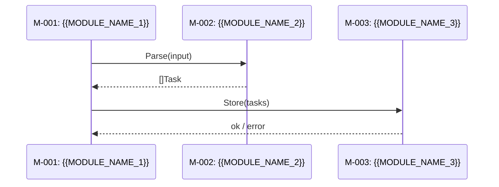

# System Design: {{PRODUCT_NAME}}

> {{DESIGN_OBJECTIVE}}

<!-- COMMENTARY: {{PRODUCT_NAME}} = full product name from PRD README header.
     {{DESIGN_OBJECTIVE}} = one sentence that answers: what does this design accomplish?
     Keep the objective under 80 chars. It should state the purpose, not list modules. -->

## Design Input

- **Source:** [{{PRD_NAME}}]({{PRD_PATH}}) | {{INPUT_MODE}}
- **Date:** {{DESIGN_DATE}}
- **Status:** {{DESIGN_STATUS}}

<!-- COMMENTARY:
     {{PRD_NAME}}     = human-readable PRD title (e.g. "TaskFlow PRD").
     {{PRD_PATH}}     = relative path from this README to the PRD README.md.
                        Canonical depth from docs/raw/design/<date>-<slug>/README.md:
                          "../../prd/<date>-<slug>/README.md"  (two ".." levels)
                        WARNING: module specs (modules/M-NNN.md) use THREE ".." levels.
                        Do NOT copy the ../../../prd/... pattern from module-template.md
                        into this README — the README is one level shallower.
     {{INPUT_MODE}}   = one of: "PRD-based" | "draft-based" | "Interactive".
     {{DESIGN_DATE}}  = ISO-8601 date this document was generated (YYYY-MM-DD).
     {{DESIGN_STATUS}} = one of: "Draft" | "Finalized" | "Implementing" | "Implemented".
                         Status tracks the design document's lifecycle, not code progress.
                         Code progress is tracked separately in the Module Index Impl column. -->

## Architecture Overview

<!-- COMMENTARY: Mermaid diagram — more detailed than the PRD's conceptual diagram.
     Show module identifiers (M-001, M-002 …) and the principal data flows between them.
     This is a navigational aid; deep interface contracts live in each module's spec. -->

```mermaid
graph TD
    {{MODULE_SLUG_A}}["M-001: {{MODULE_NAME_A}}"]
    {{MODULE_SLUG_B}}["M-002: {{MODULE_NAME_B}}"]
    {{MODULE_SLUG_A}} --> {{MODULE_SLUG_B}}
```

<!-- COMMENTARY: Replace the placeholder nodes with the actual modules derived from the PRD.
     One node per module. Show only the primary data-flow edges; cross-cutting concerns
     (auth, logging, config) may be omitted from the diagram but MUST appear in Module Deps. -->

## Dependency Layering

<!-- COMMENTARY: Forward-only dependency order between layers. Modules may only depend on
     modules in the same layer or layers to their left. This prevents circular dependencies
     and enables parallel coding-agent work on modules in different layers.
     X6 lint (check-dependency-layering.sh) enforces this — reverse-layer imports are BLOCKERS. -->

```mermaid
graph LR
    {{LAYER_1}}["{{LAYER_1_NAME}}"] --> {{LAYER_2}}["{{LAYER_2_NAME}}"] --> {{LAYER_3}}["{{LAYER_3_NAME}}"]
```

<!-- COMMENTARY: Replace with the actual layer order for this project.
     Typical layer sequence: Types/Shared → Config → Repository → Service → Runtime → UI.
     Adjust to match the stack; every module must land in exactly one layer. -->

| Layer | Modules | May Depend On |
|-------|---------|---------------|
| {{LAYER_1_NAME}} | {{LAYER_1_MODULES}} | — (no dependencies) |
| {{LAYER_2_NAME}} | {{LAYER_2_MODULES}} | {{LAYER_1_NAME}} |
| {{LAYER_3_NAME}} | {{LAYER_3_MODULES}} | {{LAYER_1_NAME}}, {{LAYER_2_NAME}} |

<!-- COMMENTARY:
     {{LAYER_N_NAME}}    = human-readable layer label (e.g. "Types", "Repository", "Service", "UI").
     {{LAYER_N_MODULES}} = comma-separated module IDs in this layer (e.g. "M-001, M-005").
     Add/remove rows to match the actual layer count.
     Rule: cross-layer dependencies must follow the left-to-right order shown in the Mermaid
     diagram. Any reverse dependency (e.g. Repository → Service) MUST be resolved by extracting
     a shared interface into a lower layer before implementation begins. -->

## Key Technical Decisions

<!-- COMMENTARY: Record important architectural choices with rationale to prevent re-litigating
     them. One row per decision. Omit rows that have no meaningful alternatives considered.
     This section is write-once-reference-often; do not list obvious implementation details. -->

| Decision | Options | Conclusion | Rationale |
|----------|---------|------------|-----------|
| {{DECISION_1}} | A: {{OPT_A}} / B: {{OPT_B}} | {{CONCLUSION}} | {{RATIONALE}} |

<!-- COMMENTARY:
     {{DECISION_1}}  = short decision label (e.g. "State management", "Auth approach").
     {{OPT_A}}, etc. = concrete alternatives considered.
     {{CONCLUSION}}  = which option was chosen (letter + label).
     {{RATIONALE}}   = one sentence: why this choice, what constraint drove it.
     Omit the Locale / Message-Catalog rows if the product is single-language only. -->

## Implementation Conventions

<!-- COMMENTARY: Stack-specific patterns translated from PRD architecture.md's
     technology-agnostic policies. Module specs reference these patterns by Convention name
     rather than restating the raw PRD policy inline.
     X3 lint (check-architecture-coverage.sh) verifies that every file under PRD
     architecture/ appears as a row here OR is marked "N/A — {reason}".
     Omit this entire section only if the PRD has no developer-convention sections. -->

| Convention | Source PRD File | Translation | Owners | Enforcement |
|------------|----------------|-------------|--------|-------------|
| {{CONVENTION_NAME_1}} | {{PRD_ARCH_FILE_1}} | {{STACK_PATTERN_1}} | {{OWNER_MODULES_1}} | {{ENFORCEMENT_TOOL_1}} |
| {{CONVENTION_NAME_2}} | {{PRD_ARCH_FILE_2}} | {{STACK_PATTERN_2}} | {{OWNER_MODULES_2}} | {{ENFORCEMENT_TOOL_2}} |

<!-- COMMENTARY:
     Column definitions:
       Convention      = short name for the pattern (e.g. "Error wrapping", "Input validation").
       Source PRD File = relative path from this file to the PRD architecture source
                         (e.g. "../../prd/.../architecture.md").
       Translation     = concrete stack-specific rule (e.g. `fmt.Errorf("doing X: %w", err)`).
       Owners          = comma-separated module IDs whose code MUST follow this convention.
                         Use "All modules" if it applies project-wide.
       Enforcement     = tool or process that gates violations (e.g. "golangci-lint wrapcheck",
                         "CI commitlint hook", "code review checklist").
     Common conventions to include (adapt per stack):
       Error handling, Logging, Input validation, Test isolation, Dependency injection,
       Concurrency, Security, CI gates, Git workflow, Performance, AI agent config, Deployment. -->

## Module Index

<!-- COMMENTARY: One row per module. Every module MUST have a corresponding spec file at
     modules/M-NNN-{slug}.md. The Impl column tracks code progress (independent of Status).
     X5 lint (check-feature-module-traceability.sh) verifies every F-NNN appears in at least
     one cell of the Feature-Module Mapping matrix.
     X8 lint (check-readme-references.sh) verifies every Spec link resolves to an existing file. -->

| ID | Module | Type | Responsibility | Complexity | Deps | Impl | Spec |
|----|--------|------|---------------|------------|------|------|------|
| {{MODULE_ID_1}} | {{MODULE_NAME_1}} | {{MODULE_TYPE_1}} | {{MODULE_RESPONSIBILITY_1}} | {{MODULE_COMPLEXITY_1}} | {{MODULE_DEPS_1}} | — | [spec](modules/{{MODULE_ID_1}}-{{MODULE_SLUG_1}}.md) |
| {{MODULE_ID_2}} | {{MODULE_NAME_2}} | {{MODULE_TYPE_2}} | {{MODULE_RESPONSIBILITY_2}} | {{MODULE_COMPLEXITY_2}} | {{MODULE_DEPS_2}} | — | [spec](modules/{{MODULE_ID_2}}-{{MODULE_SLUG_2}}.md) |

<!-- COMMENTARY:
     {{MODULE_ID_N}}           = zero-padded sequential ID: M-001, M-002, …
     {{MODULE_NAME_N}}         = human-readable module name.
     {{MODULE_TYPE_N}}         = one of: "backend" | "frontend" | "shared".
     {{MODULE_RESPONSIBILITY_N}} = one sentence describing the module's single purpose.
     {{MODULE_COMPLEXITY_N}}   = T-shirt size: S | M | L | XL.
     {{MODULE_DEPS_N}}         = comma-separated direct dependency IDs (e.g. "M-001, M-003")
                                  or "—" if none.
     {{MODULE_SLUG_N}}         = kebab-case slug matching the spec filename
                                  (e.g. "auth-service" for M-003-auth-service.md).
     Impl values:
       "—"          = not started (default on initial generation)
       "In progress" = coding agent is actively implementing
       "Done"        = implementation complete and merged
     Two tracking dimensions:
       Module Status (in the spec file)  = design document lifecycle: Draft / Finalized /
                                           Implementing / Implemented.
       Module Index Impl (this column)   = code implementation progress.
       These are independent — a module can be Status=Finalized but Impl=—. -->

## NFR Allocation

<!-- COMMENTARY: Decomposes PRD-level non-functional requirements across modules.
     Identifies hot-spot modules (carrying multiple critical NFRs) and coverage gaps.
     Derive rows from PRD NFR section — one row per NFR source ID.
     Omit this section only if the PRD defines no NFRs. -->

| NFR Source | Category | PRD Target | Primary Module | Budget | Supporting Modules |
|------------|----------|------------|---------------|--------|-------------------|
| {{NFR_ID_1}} | {{NFR_CATEGORY_1}} | {{NFR_TARGET_1}} | {{PRIMARY_MODULE_1}} | {{BUDGET_1}} | {{SUPPORTING_MODULES_1}} |

<!-- COMMENTARY:
     {{NFR_ID_N}}            = PRD NFR identifier (e.g. "NFR-001").
     {{NFR_CATEGORY_N}}      = category label (e.g. "Performance", "Security", "Availability").
     {{NFR_TARGET_N}}        = exact PRD target (e.g. "P99 < 500ms").
     {{PRIMARY_MODULE_N}}    = the module that owns the largest share of the budget.
     {{BUDGET_N}}            = percentage or latency sub-budget allocated to the primary module,
                                or "—" if non-decomposable.
     {{SUPPORTING_MODULES_N}} = other modules contributing to meeting this NFR. -->

## Test Strategy

<!-- COMMENTARY: Project-level testing approach. Defines the context for per-module Testing
     sections — module specs derive from this global strategy rather than stating it again.
     Omit entirely only if the project has no testable code (pure documentation, config-only). -->

**Test pyramid:** {{TEST_PYRAMID_ALLOCATION}}

<!-- COMMENTARY: {{TEST_PYRAMID_ALLOCATION}} = e.g. "unit-heavy 70/20/10 — large unit suite
     because business logic is pure functions; minimal E2E because UI is thin". -->

**Toolchain:**

| Test Type | Framework | Runner |
|-----------|-----------|--------|
| Unit | {{UNIT_FRAMEWORK}} | {{UNIT_RUNNER}} |
| Integration | {{INTEGRATION_FRAMEWORK}} | {{INTEGRATION_RUNNER}} |
| E2E | {{E2E_FRAMEWORK}} | {{E2E_RUNNER}} |
| Contract | {{CONTRACT_FRAMEWORK}} | {{CONTRACT_RUNNER}} |

<!-- COMMENTARY: Fill only the test types the project will actually use; omit rows for types
     that are explicitly out of scope (note the reason in a comment instead). -->

**Test data management:** {{TEST_DATA_STRATEGY}}

<!-- COMMENTARY: {{TEST_DATA_STRATEGY}} = describe factory approach, ownership, and DB isolation
     strategy (e.g. "factories with sensible defaults; each test owns its data; transaction
     rollback for DB isolation"). -->

**Shared Test Fakes Inventory:**

<!-- COMMENTARY: Single source of truth for test doubles reused by ≥2 modules.
     Every fake listed here is referenced by name from per-module Test isolation tables via
     the Source column. If a fake is used by only one module, keep it module-local and do NOT
     list it here. Omit this subsection only if the project has no cross-module test doubles.
     Rule: any dependency referenced by ≥2 modules' Test isolation tables MUST have an entry
     here — module-local fakes for shared deps are rejected at review. -->

| Fake | Package Path | Implements | Used By | Notes |
|------|-------------|-----------|---------|-------|
| {{FAKE_NAME_1}} | {{FAKE_PACKAGE_1}} | {{FAKE_INTERFACE_1}} | {{FAKE_USED_BY_1}} | {{FAKE_NOTES_1}} |

**NFR verification:**

| NFR Category | Verification Method | Tool | Trigger |
|-------------|-------------------|------|---------|
| {{NFR_VERIFY_CATEGORY_1}} | {{NFR_VERIFY_METHOD_1}} | {{NFR_VERIFY_TOOL_1}} | {{NFR_VERIFY_TRIGGER_1}} |

**CI execution order:** {{CI_EXECUTION_ORDER}}

<!-- COMMENTARY: {{CI_EXECUTION_ORDER}} = ordered list of CI stages, e.g.
     "lint → unit → integration → E2E; fail-fast at each stage". -->

## Feature-Module Mapping

<!-- COMMENTARY: The core input for the planning phase (/autoforge). One column per module,
     one row per PRD feature. Cells use the two-symbol vocabulary:
       ✦ = the module MODIFIES data or owns implementation for this feature
       △ = the module provides READ-ONLY support for this feature
       (blank) = module has no involvement with this feature
     X5 lint (check-feature-module-traceability.sh) verifies:
       - Every PRD F-NNN appears in at least one cell (✦ or △).
       - Every module column's header lists its source features. -->

| | {{MODULE_ID_1}} {{MODULE_NAME_1}} | {{MODULE_ID_2}} {{MODULE_NAME_2}} | {{MODULE_ID_3}} {{MODULE_NAME_3}} |
|-------|:-:|:-:|:-:|
| {{FEATURE_ID_1}} {{FEATURE_NAME_1}} | ✦ | △ | |
| {{FEATURE_ID_2}} {{FEATURE_NAME_2}} | | ✦ | ✦ |
| {{FEATURE_ID_3}} {{FEATURE_NAME_3}} | △ | | ✦ |

✦ = requires modification  △ = read-only dependency

<!-- COMMENTARY:
     {{FEATURE_ID_N}}   = PRD feature identifier (e.g. "F-001").
     {{FEATURE_NAME_N}} = short feature name matching the PRD feature file title.
     Add a column per module and a row per PRD feature. Blank cells are intentional —
     not every module touches every feature.
     Do NOT use any other symbols beyond ✦ and △. -->

## Module Interaction Protocols

<!-- COMMENTARY: Every cross-module dependency pair (caller → callee) MUST appear as a row
     here. This table and the Module Index Deps column are two views of the same data.
     X1 lint (check-module-deps-vs-protocols.sh) enforces bidirectional sync:
       - Every dep edge in any module's Deps (direct) column → a row here.
       - Every row here → a declared dep in Module Index.
     Sync rule: before finalizing the design, enumerate every (caller, callee) pair implied
     by each module's Deps column. For each pair, either: (a) this table has a matching row,
     or (b) the pair is in a cross-cutting note linked from Dependency Layering.
     Consumer-side interfaces: when a dep uses a consumer-declared interface (Wire-injected),
     annotate the Deps cell as "M-007 (+ M-022 via consumer-side interface)" and add a row
     here with Method = "consumer-side interface (Wire-injected)". -->

| Interaction | Caller → Callee | Sync/Async | Idempotency | Retry Policy | Contract Test |
|-------------|----------------|------------|-------------|--------------|---------------|
| {{INTERACTION_NAME_1}} | {{CALLER_1}} → {{CALLEE_1}} | {{SYNC_ASYNC_1}} | {{IDEMPOTENCY_1}} | {{RETRY_POLICY_1}} | {{CONTRACT_TEST_1}} |
| {{INTERACTION_NAME_2}} | {{CALLER_2}} → {{CALLEE_2}} | {{SYNC_ASYNC_2}} | {{IDEMPOTENCY_2}} | {{RETRY_POLICY_2}} | {{CONTRACT_TEST_2}} |

<!-- COMMENTARY:
     {{INTERACTION_NAME_N}} = short human label (e.g. "Task ingestion", "Status notification").
     {{CALLER_N}}           = module ID and name of the caller (e.g. "M-001 Parser").
     {{CALLEE_N}}           = module ID and name of the callee (e.g. "M-002 Ingester").
     {{SYNC_ASYNC_N}}       = one of:
                               "sync" (synchronous function call / in-process)
                               "async" (event / message queue / background job)
                               "HTTP REST"
                               "gRPC"
                               "consumer-side interface (Wire-injected)"
                              This column satisfies CR-D07's sync/async classification requirement.
     {{IDEMPOTENCY_N}}      = "idempotent" | "non-idempotent" | "at-least-once safe".
     {{RETRY_POLICY_N}}     = retry behaviour (e.g. "caller retries 3×, then fails with
                               ErrXxx" or "dead-letter queue after 5 failures").
     {{CONTRACT_TEST_N}}    = shared fixture or contract test reference
                               (e.g. "shared fixture: valid/invalid Task payloads; both sides
                               test against same fixtures" or "Pact consumer contract in
                               contracts/m001-m002.json"). -->

<!-- COMMENTARY: For complex multi-step interactions, include a sequence diagram below the
     table to clarify message ordering. Use mermaid sequenceDiagram syntax.
     Example (remove or replace for the actual design):


-->

## View / Screen Index

<!-- COMMENTARY: Maps PRD journey touchpoints' Screen/View names to frontend modules.
     Omit this entire section if the project has no user-facing interface
     (pure API, CLI-only with no TUI, background service).
     View names MUST match the Screen/View column in PRD journey touchpoints exactly.
     Source Journeys format: "J-{id} #{n}" where #n is the touchpoint sequence number.
     Draft Path is the repo-relative directory of the PRD Phase 5 frontend draft for this view
     (sub-path under PRD architecture/tech-stack.md → "Frontend Implementation Path"; "—" if no draft).
     Promotion Action describes how autoforge will take this view from draft to production:
       Promote = keep draft structure; add i18n / a11y / tests / lint / perf hardening in place.
       Extend  = draft covers part of the view; keep what exists, add missing screens/states.
       Rewrite = draft is unsuitable; redo from feature spec. Use sparingly. -->

| View | Description | Primary Module | Source Features | Source Journeys | Draft Path | Promotion Action |
|------|-------------|---------------|-----------------|-----------------|-----------|------------------|
| {{VIEW_NAME_1}} | {{VIEW_DESCRIPTION_1}} | {{VIEW_MODULE_1}} | {{VIEW_FEATURES_1}} | {{VIEW_JOURNEYS_1}} | {{VIEW_DRAFT_PATH_1}} | {{VIEW_PROMOTION_ACTION_1}} |

## Production Promotion Plan

<!-- COMMENTARY: Replaces the old Prototype-to-Production Mapping. The PRD Phase 5
     "Frontend Draft" produced runnable code in the project source tree at the path recorded
     in PRD architecture/tech-stack.md → "Frontend Implementation Path". That draft is
     experience-validation only — it has not been hardened for production (i18n wiring,
     accessibility, performance budgets, tests, coding-standard conformance).
     This section plans how autoforge will promote each user-facing module's draft to
     production-deliverable quality. Per-module hardening details live in each module's
     UI Architecture → Promotion Requirements subsection.

     Omit this entire section if the project has no user-facing interface or no PRD draft
     was produced.

     Promotion Action values:
       Promote = keep draft structure; harden in place (i18n / a11y / tests / lint / perf).
       Extend  = draft covers part of the module; keep what exists, add missing screens/states,
                 then harden everything to production.
       Rewrite = draft is unsuitable; redo from feature spec. Used sparingly — prefer Promote
                 unless the draft is structurally wrong.

     Hardening categories (every Promote/Extend module must address each in its module file,
     even if the answer is "N/A — see rationale"):
       1. i18n integration       — replace draft string tables with the production i18n library;
                                   namespacing, locale negotiation, fallback rules.
       2. Accessibility          — full a11y audit on top of draft's basic ARIA; keyboard map,
                                   focus management, screen-reader passes, axe-core baseline.
       3. Performance            — Web Vitals or TUI render budgets; bundle limits.
       4. Tests                  — unit / integration / E2E coverage targets.
       5. Coding-standard alignment — lint clean, type-clean, framework conventions, dead-code
                                   removal in draft files. -->

| Module | Action | Draft Path | Hardening Scope (one-line summary) |
|--------|--------|-----------|------------------------------------|
| {{PROMOTE_MODULE_1}} | {{PROMOTE_ACTION_1}} | {{PROMOTE_DRAFT_PATH_1}} | {{PROMOTE_SCOPE_1}} |

## Design System Conventions

<!-- COMMENTARY: Shared UI implementation patterns. References PRD's Design Token System.
     Omit this entire section if the project has no user-facing interface.
     Choose the Web table OR the TUI table based on the stack — not both.
     Token values (colors, spacing amounts, etc.) come from the PRD architecture.md
     Design Token System section; this table specifies the implementation mechanism. -->

**Design Token Source:** [{{PRD_NAME}} architecture.md]({{PRD_ARCH_PATH}}#design-token-system)

**Token Implementation:**

| Token Category | Implementation | File / Config |
|---------------|---------------|---------------|
| Colors | {{TOKEN_COLORS_IMPL}} | {{TOKEN_COLORS_FILE}} |
| Typography | {{TOKEN_TYPOGRAPHY_IMPL}} | {{TOKEN_TYPOGRAPHY_FILE}} |
| Spacing | {{TOKEN_SPACING_IMPL}} | {{TOKEN_SPACING_FILE}} |
| Motion | {{TOKEN_MOTION_IMPL}} | {{TOKEN_MOTION_FILE}} |

**Component patterns:**
- **Loading states:** {{COMPONENT_LOADING}}
- **Error states:** {{COMPONENT_ERROR}}
- **Empty states:** {{COMPONENT_EMPTY}}
- **Modal/overlay:** {{COMPONENT_MODAL}}
- **Form patterns:** {{COMPONENT_FORMS}}

**Responsive implementation:**
- **Approach:** {{RESPONSIVE_APPROACH}}
- **Sidebar behavior:** {{RESPONSIVE_SIDEBAR}}

**Dark mode / theming:** {{DARK_MODE_STRATEGY}}

## API Index

<!-- COMMENTARY: Present only when the project has APIs. Omit entirely for pure CLI tools,
     background workers, or projects where all API contracts are module-internal.
     X2 lint (check-endpoint-literal-vs-api.sh) verifies every api/*.md endpoint is claimed
     by at least one module's API Surface, and every MODULE API Surface endpoint exists in
     api/*.md.
     X8 lint (check-readme-references.sh) verifies every Spec link resolves to an existing file. -->

| ID | API | Direction | Spec |
|----|-----|-----------|------|
| {{API_ID_1}} | {{API_NAME_1}} | {{API_DIRECTION_1}} | [spec](api/{{API_ID_1}}-{{API_SLUG_1}}.md) |

<!-- COMMENTARY:
     {{API_ID_N}}        = zero-padded sequential ID: API-001, API-002, …
     {{API_NAME_N}}      = human-readable API name (e.g. "Task REST API").
     {{API_DIRECTION_N}} = "internal" (between services) | "external" (consumer-facing).
     {{API_SLUG_N}}      = kebab-case slug matching the api/ filename. -->

## Analytics Coverage

<!-- COMMENTARY: Maps every PRD feature analytics event to the module responsible for
     emitting it. One row per event — missing any event is a review finding.
     X4 lint (check-analytics-coverage.sh) verifies every PRD Analytics event appears here,
     owned by at least one module.
     To build the event list during generation: grep -A 20 "## Analytics" {PRD path}/features/*.md
     Omit this entire section only if no PRD features define Analytics & Tracking events.
     Sweep fallback: for operational backend features emitting dozens of events via audit.Emit,
     a single sweep row is allowed — but it MUST name the feature IDs and the emitting channel. -->

**Coverage rule:** every `## Analytics` event defined across PRD feature files must appear below — one row per event.

| Feature | Event | Trigger | Emitting Channel | Responsible Module |
|---------|-------|---------|-----------------|-------------------|
| [{{FEATURE_ID_1}}: {{FEATURE_NAME_1}}]({{FEATURE_PATH_1}}) | {{EVENT_NAME_1}} | {{EVENT_TRIGGER_1}} | {{EVENT_CHANNEL_1}} | {{EVENT_MODULE_1}} |
| [{{FEATURE_ID_2}}: {{FEATURE_NAME_2}}]({{FEATURE_PATH_2}}) | {{EVENT_NAME_2}} | {{EVENT_TRIGGER_2}} | {{EVENT_CHANNEL_2}} | {{EVENT_MODULE_2}} |

<!-- COMMENTARY:
     {{FEATURE_ID_N}}    = PRD feature ID (e.g. "F-001").
     {{FEATURE_NAME_N}}  = short feature name.
     {{FEATURE_PATH_N}}  = relative path from this README to the PRD feature file
                           (e.g. "../../prd/.../features/F-001-slug.md").
     {{EVENT_NAME_N}}    = exact event name as declared in the PRD Analytics section.
     {{EVENT_TRIGGER_N}} = user action or system condition that fires the event.
     {{EVENT_CHANNEL_N}} = implementation channel, one of:
                           "frontend useAnalytics() hook"
                           "backend audit.Emit"
                           "OpenTelemetry metric"
     {{EVENT_MODULE_N}}  = module ID responsible for emitting (e.g. "M-004"). -->

## References

<!-- COMMENTARY: Stable links to the PRD artifacts this design was derived from.
     {{PRD_README_PATH}}     = relative path to PRD README.md.
     {{PRD_JOURNEYS_PATH}}   = relative path to PRD journeys/ directory.
     {{PRD_ARCH_PATH}}       = relative path to PRD architecture.md.
     REVISIONS.md link: omit on initial creation — added automatically by --revise mode
     on first revision. The revision-entry-template.md defines the append format. -->

- [PRD]({{PRD_README_PATH}})
- [User Journeys]({{PRD_JOURNEYS_PATH}})
- [Architecture & Glossary]({{PRD_ARCH_PATH}})
