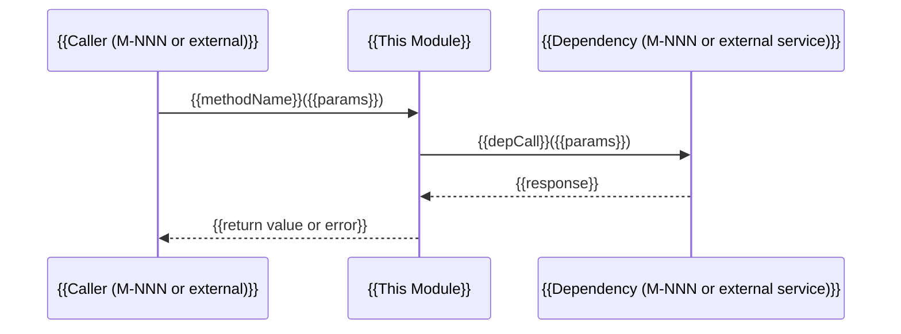

# M-{{NNN}}: {{Module Name}}

<!-- Header: Module ID (M-NNN) is stable across iterations. Name must match the README module index row exactly. -->

> **Status:** NotStarted | InProgress | Done  
> **Assignee:** {{assignee or "unassigned"}}  
> **Source Features:** {{F-001, F-003 — space-separated list of PRD feature IDs}}  
> **Complexity:** S | M | L | XL

<!-- Status uses the Impl tri-state: NotStarted = not yet coded; InProgress = work underway; Done = merged to main. -->

---

## Change Scope

<!-- Omit this section for initial designs (the first time this module file is created).
     Required for --revise mode and incremental designs on existing codebases. -->

**Status:** New | Modified  
**Previous version:** [{{previous module file}}]({{relative path}}) — *only for Modified*  
**What changed:** {{brief description of what differs from the prior version — only for Modified}}

---

## Responsibility

<!-- 2–3 sentences. State what this module DOES and what it explicitly DOES NOT do.
     If you cannot describe the scope in 2–3 sentences the module is too large — split it.
     Also define any domain-specific terms used below rather than assuming the reader has the PRD. -->

{{What this module is solely responsible for, in precise imperative language.}}

**Out of scope:** {{explicit list of things a reader might expect this module to handle, but doesn't.}}

---

## Architecture Position

<!-- Mermaid diagram showing where this module sits in the overall system.
     Show at minimum: this module's box, every direct caller, and every direct dependency.
     Label each edge with the data or call type (e.g., REST, gRPC, event, in-process). -->

```mermaid
graph LR
    subgraph Callers
        {{M-NNN-caller}}["{{Caller Module}}"]
    end
    subgraph This
        {{M-NNN}}["{{This Module}}"]
    end
    subgraph Deps
        {{M-NNN-dep}}["{{Dependency Module}}"]
        {{ExtSvc}}["{{External Service}}"]
    end

    {{M-NNN-caller}} -- "{{call type}}" --> {{M-NNN}}
    {{M-NNN}} -- "{{call type}}" --> {{M-NNN-dep}}
    {{M-NNN}} -- "REST/SDK" --> {{ExtSvc}}
```

---

## Source Features

<!-- Relative paths from this module file to the PRD feature files.
     From docs/raw/design/YYYY-MM-DD-{slug}/modules/M-NNN-{slug}.md the typical form is:
     ../../../prd/YYYY-MM-DD-{slug}/features/F-NNN-{slug}.md
     Verify each link resolves from the module file's filesystem location. -->

- [F-{{NNN}}: {{Feature Name}}](../../../prd/{{YYYY-MM-DD-slug}}/features/F-{{NNN}}-{{slug}}.md) — {{which part of the feature this module implements}}
- [F-{{NNN}}: {{Feature Name}}](../../../prd/{{YYYY-MM-DD-slug}}/features/F-{{NNN}}-{{slug}}.md) — {{which part of the feature this module implements}}

<!-- X5 lint (check-feature-module-traceability.sh) verifies every F-NNN here resolves to a real
     PRD file and appears as ✦ in the README Feature-Module matrix for this module column. -->

---

## Data Models

<!-- Inline TypeScript or JSON-Schema definitions for every entity this module OWNS or MUTATES.
     Never say "see README.md" or "see architecture.md" — copy the definition here so a coding
     agent can implement without opening a second file.
     Omit this section only if this module owns no persistent data and mutates no shared state. -->

<!-- X7 lint (check-single-source-of-truth.sh) verifies that ID-prefix conventions (e.g. task_,
     usr_) and data-model definitions declared here are also declared as the source of truth in
     the module designated as canonical owner in the Architecture Overview.
     If THIS module IS the canonical owner, prefix each definition with a comment: "// source of truth". -->

```typescript
// {{EntityName}} — owned by this module
// source of truth  ← include this comment only when THIS module is the designated owner

export interface {{EntityName}} {
  id: string;              // format: "{{prefix}}_" + ULID, e.g. "{{prefix}}_01ARZ3NDEKTSV4RRFFQ69G5FAV"
  {{fieldName}}: {{FieldType}};  // {{constraint or description}}
  {{fieldName}}: {{FieldType}} | null;  // optional — {{when null}}
  createdAt: string;       // ISO 8601 UTC
  updatedAt: string;       // ISO 8601 UTC
}

export type {{EnumName}} = "{{VALUE_A}}" | "{{VALUE_B}}" | "{{VALUE_C}}";
```

**Database schema (when applicable):**

| Field | Type | Constraints | Index | Description |
|-------|------|-------------|-------|-------------|
| `{{field_name}}` | `{{SQL type}}` | `NOT NULL` / `UNIQUE` / `DEFAULT {{val}}` | Primary / Unique / None | {{description}} |
| `{{field_name}}` | `{{SQL type}}` | `NOT NULL` | `idx_{{table}}_{{field}}` | {{description — why indexed}} |

<!-- Add migration notes here if this module modifies an existing schema:
     Migration: {{migration file or strategy, e.g. "add column non-nullable with DEFAULT ''; backfill; drop DEFAULT"}} -->

---

## Interfaces

<!-- TypeScript-style signatures for ALL public interfaces exposed by this module.
     Covers: outbound (what other modules call on this module) and inbound (what this module calls
     on its dependencies — import type from the dependency's Interface Definition, DO NOT redefine).

     Be precise: parameter types, return types, error types. Other modules and coding agents
     depend on this contract. "Returns data" is not a contract; "returns Promise<Task | null>" is.

     L5 lint (check-module-interface-types.sh) verifies every type referenced here resolves to
     a definition either inline in this file's Data Models section or in the named dependency
     module's Interface Definition / Data Models. -->

### Outbound (this module exposes)

```typescript
// Inbound interface — callers depend on this signature; changes here are breaking.

export interface {{ModuleName}}Service {
  /**
   * {{one-line description of what this method does}}
   * @param {{paramName}} {{description}}
   * @returns {{description of success value}}
   * @throws {{ErrorType}} when {{condition}}
   * @throws {{ErrorType}} when {{condition}}
   */
  {{methodName}}({{paramName}}: {{ParamType}}): Promise<{{ReturnType}}>;

  /**
   * {{one-line description}}
   */
  {{methodName}}({{paramName}}: {{ParamType}}, options?: {{OptionsType}}): Promise<{{ReturnType}} | null>;
}

// Supporting types — inline definitions so callers do not need to open a second file.
export interface {{ParamType}} {
  {{fieldName}}: {{FieldType}};
}

export interface {{ReturnType}} {
  {{fieldName}}: {{FieldType}};
}

export class {{ErrorType}} extends Error {
  constructor(public readonly code: "{{ERROR_CODE_A}}" | "{{ERROR_CODE_B}}", message: string) {
    super(message);
  }
}
```

### Inbound (this module calls on dependencies)

```typescript
// Imported from {{M-NNN-dep}} — do NOT redefine, only import in implementation.
import type { {{DepService}} } from "{{module-path}}";

// Constructor signature — dependency injection pattern used by this module.
// Callers use {{ModuleName}}Service; the factory/DI container supplies concrete impls.
export function create{{ModuleName}}Service(deps: {
  {{depName}}: {{DepService}};
  {{depName}}: {{DepService}};
}): {{ModuleName}}Service;
```

---

## API Surface

<!-- Required for ANY module that exposes HTTP / gRPC / CLI endpoints.
     Omit ONLY for pure internal library modules with no callable external surface.

     SELF-CONTAINED REQUIREMENT: every column MUST be filled inline — no "see API-NNN" prose
     without an anchor link. A coding agent implementing this handler must never need to open
     a second file. Anchor links to populated examples in the API contract file count as
     inline content; {} placeholders or "TBD" do not.

     L4 lint (check-api-surface-cols.sh) enforces EXACTLY 7 columns per row.
     Column order MUST be: Method | Path | Auth | Roles | Rate | Idempotency | Owner

     For internal-only endpoints with no external caller, set Auth = "internal-only" and
     Roles = "—" (em-dash, not empty cell). -->

| Method | Path | Auth | Roles | Rate | Idempotency | Owner |
|--------|------|------|-------|------|-------------|-------|
| `{{METHOD}}` | `{{/v1/resource/:id}}` | `{{header name or "bearer JWT" or "x-api-key"}}` | `{{role-a,role-b or "all"}}` | `{{N req/s/key or "—"}}` | `{{Idempotent on Idempotency-Key / Not idempotent / N/A}}` | [API-{{NNN}}](../api/API-{{NNN}}-{{slug}}.md#{{anchor}}) |
| `{{METHOD}}` | `{{/v1/resource}}` | `{{auth scheme}}` | `{{roles}}` | `{{rate limit}}` | `{{idempotency}}` | [API-{{NNN}}](../api/API-{{NNN}}-{{slug}}.md#{{anchor}}) |

<!-- Column definitions (copied inline per self-contained principle):
     Method      — full HTTP verb: GET, POST, PUT, PATCH, DELETE
     Path        — full versioned path including path params (e.g. /v1/tasks/:id)
     Auth        — required header + scheme (e.g. "x-api-key", "Authorization: Bearer JWT")
     Roles       — comma-separated roles that may call this endpoint (e.g. "developer,org-admin")
                   or "all" for unauthenticated / public; "internal-only" for no external surface
     Rate        — requests per second per key/user (e.g. "10 req/s/key"); "—" for internal
     Idempotency — "Idempotent on Idempotency-Key header" | "Not idempotent" | "N/A — GET/DELETE"
     Owner       — anchor link to the populated JSON block in the owning api/API-NNN-slug.md file
                   Format: [API-NNN](../api/API-NNN-slug.md#method-path-slug)
                   FORBIDDEN: literal "{}", "TBD", "see API-NNN" without anchor -->

<!-- X2 lint (check-endpoint-literal-vs-api.sh) verifies every Method+Path literal here has a
     matching endpoint heading in the referenced api/API-NNN-slug.md file, and that no api/*.md
     endpoint is orphaned (not claimed by any module's API Surface). -->

---

## Boundary Enforcement

<!-- Lint rules, structural tests, or CI checks that mechanically guard this module's boundaries.
     An agent whose changes violate these will have its build rejected.

     L3 lint (check-boundary-enforcement-cols.sh) enforces EXACTLY 4 columns per row.
     Column order MUST be: Operation | Authorization | Validation | Error response

     If you cannot fill all four columns with concrete grep-able identifiers, the constraint
     is advisory — move it to Implementation Constraints instead. "custom lint" or "code review"
     without a named rule is NOT acceptable in this table.

     Omit this section only for trivial S-complexity modules with no CI infrastructure. -->

| Operation | Authorization | Validation | Error response |
|-----------|--------------|------------|----------------|
| `{{operation description, e.g. "Create resource"}}` | `{{tool:rule, e.g. "middleware:auth-guard"}}` | `{{tool:rule, e.g. "zod schema: CreateResourceSchema"}}` | `{{HTTP status + error type, e.g. "401 unauthorized_error / 400 validation_error"}}` |
| `{{operation description}}` | `{{tool:rule}}` | `{{tool:rule}}` | `{{HTTP status + error type}}` |

<!-- Column definitions (from structural-lint.md L3):
     Operation       — one concrete rule in descriptive English; "code should be clean" is rejected
     Authorization   — named tool + rule identifier (e.g. middleware:require-role('admin'),
                       golangci-lint:errcheck, eslint:no-restricted-paths:repo-no-service)
     Validation      — named schema or validator (e.g. zod:CreateTaskSchema, class-validator:@IsUUID)
     Error response  — HTTP status code + error-type string (e.g. "422 validation_error",
                       "401 unauthenticated_error"); must match API Surface Error Codes column -->

---

## Module Deps

<!-- Direct outbound dependency module slugs (M-NNN format).
     X1 lint (check-module-deps-vs-protocols.sh) verifies every (caller, callee) pair listed here
     has a corresponding row in README.md's Module Interaction Protocols table — and vice versa.
     Orphan deps (declared here but absent from README protocols) and orphan protocol rows
     (in README but absent here) both fail X1.

     List only DIRECT dependencies — do not list transitive deps.
     For each dep, state the call direction and what data or service is exchanged. -->

**Depends on (outbound):**
- `{{M-NNN-slug}}` — {{why / what data this module calls on the dependency}}
- `{{M-NNN-slug}}` — {{why / what data}}

**Depended on by (inbound):**
- `{{M-NNN-slug}}` — {{why / what data the caller gets from this module}}

**External services** (from PRD architecture.md External Dependencies — copy inline):

<!-- Omit this sub-section if this module calls no external services. -->

| Service | Purpose | API Style | Timeout | Failure Mode | Fallback |
|---------|---------|-----------|---------|-------------|----------|
| `{{ServiceName}}` | {{what this module uses it for}} | REST / gRPC / SDK | `{{N}}ms` | {{what happens when the service is down or returns 5xx}} | {{degraded behavior, retry strategy, or circuit-breaker policy}} |

---

## Test Strategy

<!-- Self-contained: a coding agent must know exactly what tests to write from this section alone.
     Copy toolchain choices (framework, runner) inline from README's Test Strategy — do NOT cross-
     reference; copy, so the module file is self-contained.
     Derive test scenarios from: Interface Definition (public contract), Error Handling (failure
     paths), and Internal Design (complex logic branches).

     Omit this section only for S-complexity modules with no dependencies and no error paths. -->

**Test isolation** — how this module is tested independently:

| Dependency | Test Double | Source | Rationale |
|------------|-------------|--------|-----------|
| `{{M-NNN-dep}}` | `fakes.{{DepService}}` | Shared Test Fakes Inventory | {{e.g. "records calls in memory; callers assert on count + payload"}} |
| `{{M-NNN-dep}}` | `fakes.{{DepService}}` | Shared Test Fakes Inventory | {{rationale}} |
| `{{External: ServiceName}}` | recorded responses | Module-local (`{{internal/slug/testdata/service/}}`) | {{why module-local and not shared}} |

<!-- If this module introduces a new fake that >1 module will need, add it to the Shared Test
     Fakes Inventory in README.md instead of keeping it module-local. -->

**Test pyramid allocation:**

| Layer | Framework | Target Coverage | Focus |
|-------|-----------|----------------|-------|
| Unit | {{e.g. Jest / Vitest / go test}} | `{{≥ N%}}` line coverage on core logic | Interface contract, error paths, edge cases |
| Integration | {{e.g. Supertest / httptest}} | All API Surface endpoints | Real DB / service; verify status codes + body shape |
| Contract | {{e.g. Pact / shared fixtures}} | All Module Interaction Protocols rows | Callee verifies it meets caller's expectations |

**Key test scenarios:**

| Scenario | Type | What to Verify |
|----------|------|----------------|
| {{e.g. "{{methodName}} with valid input"}} | Unit | {{expected return value or state change}} |
| {{e.g. "{{methodName}} when dep returns error"}} | Unit | {{error propagated with correct type and message}} |
| {{e.g. "POST /v1/{{resource}} happy path"}} | Integration | {{201 response, entity persisted, event emitted}} |
| {{e.g. "POST /v1/{{resource}} missing required field"}} | Integration | {{400 validation_error, no entity created}} |
| {{e.g. "M-NNN calls {{methodName}} — contract"}} | Contract | {{shared fixture asserts response shape matches M-NNN expectations}} |

**Contract tests:** {{list every Module Interaction Protocols row this module participates in (as caller or callee) and must verify — e.g. "as callee: M-001 calls {{methodName}}() — verify contract with shared test fixture at testdata/contracts/M-001-{{slug}}.json"}}

**Coverage target:** {{e.g. "≥80% line coverage for core business logic (Internal Design section); every error path in Error Handling MUST have an explicit test case; uncovered lines in boundary/auth paths are P0 blockers."}}

---

## NFR Decomposition

<!-- This module's share of PRD NFRs. Every entry MUST reference the source NFR ID from the PRD
     and state a concrete, measurable target. "Should be fast" is rejected.
     Omit this section only if the module carries no PRD NFR allocation. -->

| NFR Source | Category | Constraint |
|------------|----------|------------|
| `{{NFR-NNN}}` | Performance | {{e.g. P99 latency < 200ms measured at handler entry; P50 < 50ms}} |
| `{{NFR-NNN}}` | Throughput | {{e.g. Sustain 500 req/s per instance at P99 < 200ms; horizontal scaling via stateless design}} |
| `{{NFR-NNN}}` | Error Budget | {{e.g. Error rate < 0.1% of requests; 99.9% availability per calendar month}} |
| `{{NFR-NNN}}` | Security | {{e.g. All inputs sanitized; no raw SQL; auth token validated before any data access}} |
| `{{NFR-NNN}}` | Data Retention | {{e.g. Hard-delete records after 90 days; anonymize PII fields within 30 days of account deletion}} |

---

## Observability

<!-- Structured event names, metric names, and trace span names for this module.
     These MUST match the PRD Analytics event names exactly — the Analytics Coverage section
     in README.md (checked by X4 lint) maps every PRD event to an owning module.
     Do NOT invent new event names here; derive from PRD features' Analytics tables. -->

**Structured logs** (emitted at significant state transitions):

| Event Name | Level | Fields | Trigger |
|------------|-------|--------|---------|
| `{{module.slug.event_name}}` | INFO | `{{field1, field2, field3}}` | {{when this log line is emitted}} |
| `{{module.slug.event_name}}` | ERROR | `{{field1, error_code, trace_id}}` | {{on which error condition}} |

**Metrics** (exported to Prometheus / StatsD / equivalent):

| Metric Name | Type | Labels | Description |
|-------------|------|--------|-------------|
| `{{module_slug_operation_duration_seconds}}` | Histogram | `{{method, status_code, route}}` | {{latency of {{operation}}; P99 target from NFR above}} |
| `{{module_slug_errors_total}}` | Counter | `{{error_code, operation}}` | {{total error count by type}} |

**Distributed traces:**

| Span Name | Parent | Attributes | When Created |
|-----------|--------|------------|--------------|
| `{{module-slug.operation}}` | `{{parent-span or "root"}}` | `{{attr1, attr2}}` | {{entry point for {{operation}}}} |

---

## Internal Design

<!-- Core algorithms, state management, key flows — enough detail that a coding agent can implement
     without guessing. Not so much that it becomes pseudocode for every line.
     If source features define State Flow diagrams (stateDiagram), extract and refine the state
     machines here with implementation-level detail.

     Use Mermaid flowcharts or sequence diagrams for non-trivial flows. -->

### Key Flows



### State Machine (when applicable)

```mermaid
stateDiagram-v2
    [*] --> {{InitialState}}
    {{InitialState}} --> {{NextState}}: {{trigger}}
    {{NextState}} --> {{FinalState}}: {{trigger}}
    {{FinalState}} --> [*]
```

### Algorithms and Invariants

- {{Describe key algorithms or invariants that a coding agent must preserve. E.g.: "The deduplication window is a sliding 5-minute TTL set; keys are SHA-256 of (user_id, idempotency_key)."}}
- {{Describe concurrency model: e.g. "All writes are serialized through a per-entity advisory lock; reads are non-locking."}}

---

## UI Architecture

<!-- Omit this section for backend and shared library modules.
     Required for frontend modules (Type = frontend). -->

**Views owned:** {{list of views from README's View / Screen Index that this module implements}}

### Component Tree

<!-- Show 2–3 levels of nesting. Leaf nodes are the smallest independently testable UI units
     (e.g. a form, a data table, a navigation bar) — not individual HTML elements. -->

```
{{ViewName}}/
├── {{ViewName}}Layout          # top-level layout container
│   ├── {{SectionA}}            # major UI section
│   │   ├── {{ChildComponent}}
│   │   └── {{ChildComponent}}
│   └── {{SectionB}}
│       └── {{ChildComponent}}
```

### Routing

| Route | Component | Guard | Lazy Load | Data Prefetch |
|-------|-----------|-------|-----------|---------------|
| `{{route pattern}}` | `{{ComponentName}}` | `{{authGuard / roleGuard('admin') / —}}` | `{{Yes / No}}` | `{{fetchData(id) / none}}` |

<!-- Guard: name of the route guard function. Use "—" if no guard. Implementation belongs in
     Internal Design. -->

### State Management

| State | Source | Scope | Implementation | Sync Strategy |
|-------|--------|-------|---------------|---------------|
| `{{stateName}}` | `{{API call / local / URL params}}` | `{{view / global / component}}` | `{{e.g. Zustand slice / useState / useSearchParams}}` | `{{e.g. React Query 30s stale / URL ↔ state sync on mount / —}}` |

### Key Interactions

| Interaction | Component | Triggers | Side Effects | Optimistic? |
|-------------|-----------|----------|-------------|-------------|
| `{{e.g. submit form}}` | `{{ComponentName}}` | `{{e.g. POST /v1/resource via M-NNN}}` | `{{toast, invalidate query cache}}` | `{{Yes — add to list, rollback on error / No}}` |

### Frontend Performance

<!-- Use Web Vitals for web modules; use the TUI table below for terminal modules. -->

**Web:**

| Metric | Target | Measurement | Optimization |
|--------|--------|-------------|-------------|
| LCP | `{{< 2.5s}}` | `{{Lighthouse CI}}` | `{{code-split route, preload critical CSS}}` |
| INP | `{{< 200ms}}` | `{{Web Vitals lib}}` | `{{debounce search, virtualize long lists}}` |
| CLS | `{{< 0.1}}` | `{{Lighthouse CI}}` | `{{reserve space for async content}}` |
| Bundle (this module) | `{{< 150 KB gzipped}}` | `{{bundlesize CI check}}` | `{{tree-shake, lazy-load heavy deps}}` |

**TUI (use instead of Web Vitals for terminal modules):**

| Metric | Target | Measurement | Optimization |
|--------|--------|-------------|-------------|
| Render latency | `{{< 16ms per frame}}` | `{{teatest frame timing}}` | `{{avoid full re-render, update only changed regions}}` |
| Input-response time | `{{< 50ms}}` | `{{benchmark test}}` | `{{debounce rapid keystrokes}}` |
| Memory (RSS) | `{{< 150 MB with 500 messages}}` | `{{runtime.ReadMemStats}}` | `{{evict old messages, cap in-memory history}}` |

### Design System Usage

{{Which patterns from README's Design System Conventions this module applies — e.g. "loading skeletons for async data, toast notifications for mutations, Sheet sidebar on mobile."}}

### Accessibility Implementation

- **Tab order:** {{describe the logical focus flow through this module's views}}
- **ARIA:** {{reference PRD feature spec's ARIA table; note implementation nuances}}
- **Testing:** {{e.g. "axe-core integration test for each view; manual screen reader test for {{complex interaction}}"}}

### i18n Implementation (Frontend)

- **Namespace:** `{{e.g. dashboard, tasks — maps to i18n key prefix from PRD feature specs}}`
- **Lazy loading:** {{e.g. "load locale files per-route to reduce initial bundle"}}
- **Fallback:** {{e.g. "en as fallback; show key name if translation missing in dev"}}

---

## Backend i18n Implementation

<!-- Run through the trigger checklist — if any answer is YES this section is mandatory.
     Omit only when ALL answers are NO (or backend is single-language with no user-facing text). -->

**Trigger checklist** (answer YES/NO for this module):

- [ ] Returns HTTP error messages with human-readable `message` fields?
- [ ] Returns validation errors with field-level human-readable text?
- [ ] Emits user-facing notifications (email, push, SMS, in-app)?
- [ ] Returns user-facing labels or enum values that must be localized?
- [ ] Handles timestamps serialized to user-local time (not pure UTC) at this module's boundary?

<!-- If ANY box is ticked, fill all four fields below.
     If ALL boxes are unticked, delete the four fields and add a one-line note to Relevant
     Conventions instead: "Backend i18n: N/A — module returns only machine-readable error codes
     and UTC timestamps; localization responsibility is on caller." Silent omission on an
     HTTP-facing module is a review finding. -->

- **Locale context:** {{how this module receives the request locale — e.g. "from i18n.FromContext(ctx) set by M-006 LocaleMiddleware"}}
- **Message catalog access:** {{concrete call site — e.g. "i18n.Localize(ctx, 'backend.{{slug}}.errors.not_found') at internal/{{slug}}/service.go:142"; name the catalog namespace}}
- **Locale-dependent outputs:** {{enumerate every interface method/response field that returns localized content}}
- **Timezone:** {{e.g. "stores UTC; converts via user.timezone at handler.serialize{{Entity}}", or "all timestamps UTC ISO 8601 — no conversion, client responsible"}}

---

## Relevant Conventions

<!-- Copy applicable stack-specific implementation patterns from README's Implementation
     Conventions section. Use the translated language/framework idioms, not raw PRD policies.
     Also include applicable Shared Conventions from PRD architecture.md.
     Omit conventions this module does not touch.

     If this module requires a convention not yet in README's Implementation Conventions, add the
     pattern here with a note: "[NEW — propose adding to README Implementation Conventions]".
     The design review will surface these for promotion to project-wide conventions. -->

- **Error handling:** {{e.g. "fmt.Errorf("doing X: %w", err) — from Implementation Conventions error-handling pattern"}}
- **Logging:** {{e.g. "slog.Info("event", "key", val) with JSON handler — from Implementation Conventions logging pattern"}}
- **Input validation:** {{e.g. "zod schema at handler layer, never in service layer — only if this module handles external input"}}
- **Concurrency:** {{e.g. "context.Context as first parameter; errgroup for goroutine lifecycle — only if this module uses concurrency"}}
- **Test isolation:** {{e.g. "t.TempDir(), net.Listen("tcp", ":0") — from Implementation Conventions test-isolation pattern"}}
- **API format:** {{e.g. "JSON over REST; cursor-based pagination — only if this module exposes or consumes APIs"}}
- **Error format:** {{e.g. "RFC 7807 Problem Details with application/problem+json — only if this module produces error responses"}}
- **Backend i18n:** {{N/A note here if all trigger-checklist boxes are unticked — mandatory explicit opt-out for HTTP-facing modules}}

---

## Implementation Constraints

<!-- Non-NFR technical constraints: language/runtime version requirements, platform compatibility,
     architectural prohibitions, required libraries or protocols.
     Pitfalls to avoid: known anti-patterns, concurrency traps, common mistakes in this domain.
     Items that cannot meet all four Boundary Enforcement columns belong here as advisory guidance. -->

- {{e.g. "Requires Node.js ≥ 20 LTS; do not use CommonJS require() — ESM only per project standard."}}
- {{e.g. "MUST NOT import from {{M-NNN-slug}} — that module is in a higher layer per Dependency Layering rules."}}
- {{e.g. "Avoid N+1 queries: batch-load related entities using DataLoader or equivalent."}}
- {{e.g. "Do not store secrets in process.env at module load time — read them inside the request handler from the secrets manager."}}

---

## Error Handling

<!-- How this module handles each significant error scenario.
     Omit only if errors are trivially propagated with no module-specific strategy.
     For each scenario: state what triggers it, how it is caught, what is returned, and whether
     it is retried, logged, or surfaced to the caller. -->

| Error Scenario | Trigger | Handling Strategy | Caller-Facing Response |
|----------------|---------|-------------------|----------------------|
| `{{dependency unavailable}}` | `{{M-NNN-dep throws NetworkError}}` | `{{Log + return service_unavailable}}` | `{{503 service_unavailable_error}}` |
| `{{validation failure}}` | `{{input fails schema check}}` | `{{Reject immediately, no DB write}}` | `{{400 validation_error with field-level detail}}` |
| `{{entity not found}}` | `{{DB returns null for given ID}}` | `{{Return null from service; handler maps to 404}}` | `{{404 not_found_error}}` |
| `{{concurrent modification}}` | `{{optimistic lock version mismatch}}` | `{{Retry up to 3× with exponential backoff; fail after}}` | `{{409 conflict_error}}` |

---

## Open Questions

<!-- Questions that must be resolved before or during implementation. Each question should
     reference the person or decision-making process that can resolve it.
     Remove resolved questions; do not leave stale items. -->

- [ ] `{{Q-NNN}}` {{Question text.}} — *Owner: {{name or role}}; Due: {{date or sprint}}*
- [ ] `{{Q-NNN}}` {{Question text.}} — *Owner: {{name or role}}; Due: {{date or sprint}}*
