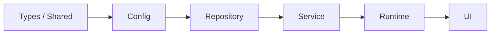
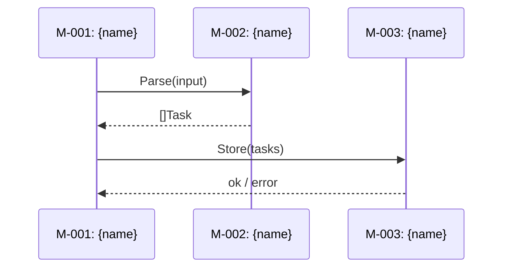

# Design Template — README.md

The README.md is the navigational entry point for the design directory. Omit any section that has no useful content.

## Directory Structure

```
{output-dir}/
├── README.md              # Design overview + module index + mapping matrix
├── REVISIONS.md           # Revision history (only present after first --revise)
├── modules/
│   ├── M-001-{slug}.md    # Self-contained module design
│   └── ...
├── api/                   # Only when project has APIs
│   ├── API-001-{slug}.md  # Self-contained API contract
│   └── ...
```

## Template

The README.md follows this structure:

### Header

```
# System Design: {Product Name}

> {One-sentence design objective}
```

### Design Input

- **Source:** [{PRD name}]({path to PRD README.md}) | {document name} | Interactive
- **Date:** YYYY-MM-DD
- **Status:** Draft | Finalized | Implementing | Implemented

### Architecture Overview

{Mermaid diagram — more detailed than PRD, showing module interfaces and data flow}

### Dependency Layering

{Forward-only dependency order between module layers. Modules may only depend on modules in the same layer or layers to their left. This constraint prevents circular dependencies and enables parallel agent work on modules in different layers.}



{The diagram above is an example — replace with the actual layer order for this project. Each layer is a group of modules with the same architectural role.}

| Layer | Modules | May Depend On |
|-------|---------|---------------|
| {e.g. Types} | M-001, M-005 | — (no dependencies) |
| {e.g. Repository} | M-002 | Types |
| {e.g. Service} | M-003, M-004 | Types, Repository |
| {e.g. UI} | M-006 | Types, Service |

**Rule:** cross-layer dependencies must follow the left-to-right order. Any reverse dependency (e.g. Repository → Service) is a design violation that must be resolved by extracting a shared interface into a lower layer.

### Key Technical Decisions

| Decision | Options | Conclusion | Rationale |
|----------|---------|------------|-----------|
| {e.g. state management} | A: in-memory / B: SQLite / C: JSON files | C | {why} |
| {e.g. locale resolution} | A: Accept-Language middleware / B: user profile field / C: URL path prefix | A | {why — omit row if single-language backend} |
| {e.g. message catalog} | A: embedded JSON per locale / B: database-backed / C: third-party service | A | {why — omit row if single-language backend} |

### Implementation Conventions

{Stack-specific implementation patterns translated from PRD architecture.md's technology-agnostic policies. Module-level Relevant Conventions reference these patterns. Omit if PRD has no developer convention sections.}

| Category | PRD Policy | Implementation Pattern | Enforcement |
|----------|-----------|----------------------|-------------|
| Error handling | {e.g. errors must include context} | {e.g. `fmt.Errorf("doing X: %w", err)`} | {e.g. golangci-lint errcheck + wrapcheck} |
| Logging | {e.g. structured key-value, ERROR/WARN/INFO/DEBUG levels} | {e.g. `slog.Info("event", "key", val)` with JSON handler} | {e.g. lint rule banning fmt.Println in non-test code} |
| Input validation | {e.g. validate at system boundaries} | {e.g. `validate` struct tags at HTTP handler layer} | {e.g. code review checklist item} |
| Test isolation | {e.g. temp dirs, random ports, no global state} | {e.g. `t.TempDir()`, `net.Listen("tcp", ":0")`, no package-level vars in tests} | {e.g. `go test -race`, CI gate} |
| Dependency injection | {e.g. constructor injection, no global mutable state} | {e.g. `func NewService(deps Deps) *Service`} | {e.g. lint rule banning package-level `var`} |
| Concurrency | {e.g. context propagation, graceful cancellation} | {e.g. `context.Context` first parameter, `errgroup` for goroutine lifecycle} | {e.g. `go vet` copylocks check} |
| Security | {e.g. injection prevention, secret handling} | {e.g. parameterized queries, `os.Getenv` for secrets, never log tokens} | {e.g. gosec in CI, secret scanning} |
| CI gates | {e.g. lint → build → test with race → benchmark} | {e.g. GitHub Actions workflow with 4 sequential jobs} | {e.g. branch protection requiring CI pass} |
| Git workflow | {e.g. rebase + ff-only, conventional commits} | {e.g. branch protection: require rebase, commitlint pre-commit hook} | {e.g. CI commit message lint} |
| Performance | {e.g. p95 < 200ms, regression < 10%} | {e.g. Go benchmarks with `benchstat`, CI gate comparing against baseline} | {e.g. benchmark CI job with threshold check} |
| AI agent config | {e.g. CLAUDE.md as concise index, ~200 lines, references convention files} | {e.g. generate CLAUDE.md with project overview + key commands + references to .golangci-lint.yml, .github/workflows/, etc.} | {e.g. CI check that CLAUDE.md exists and is under 200 lines} |
| Deployment | {e.g. reproducible local env, CD pipeline, config management, environment isolation} | {e.g. docker-compose for local dev, GitHub Actions for CD, .env.example for config, per-agent Docker network for isolation} | {e.g. CI validates docker-compose up succeeds, CD requires manual approval for prod} |

### Module Index

| ID | Module | Type | Responsibility | Complexity | Deps | Impl | Spec |
|----|--------|------|---------------|------------|------|------|------|
| M-001 | {name} | backend | {one sentence} | M | — | — | [spec](modules/M-001-{slug}.md) |
| M-002 | {name} | frontend | {one sentence} | S | M-001 | — | [spec](modules/M-002-{slug}.md) |

Type: `backend` | `frontend` | `shared` — helps identify which modules have UI responsibilities
Impl: `—` (not started) | `In progress` | `Done` — tracks per-module implementation status; updated by coding agents or users when implementation begins/completes

**Two tracking dimensions:** The module `Status` field (Draft / Finalized / Implementing / Implemented) tracks the *design document's* lifecycle. The Module Index `Impl` column (`—` / In Progress / Done) tracks *code implementation* progress, updated by autoforge or manually. These are independent — a module can be Status=Finalized but Impl=— (designed but not yet coded).

### NFR Allocation

{Shows how PRD-level non-functional requirements are decomposed across modules. Helps identify hot-spot modules (carrying multiple critical NFRs) and gaps (NFRs not allocated to any module).}

| NFR Source | Category | PRD Target | Primary Module | Budget | Supporting Modules |
|------------|----------|------------|---------------|--------|-------------------|
| {e.g. NFR-001} | Performance | P99 < 500ms (task creation) | M-002 (< 300ms) | 60% | M-001 (< 100ms), M-003 (< 100ms) |
| {e.g. NFR-002} | Security | All user input sanitized | M-001 | — | M-003 (secondary validation) |

### Test Strategy

{Project-level testing approach derived from Step 3 Testing Deep-Dive. Provides the global context for per-module Testing sections.}

**Test pyramid:** {e.g. unit-heavy 70/20/10 — rationale from project characteristics}

**Toolchain:**

| Test Type | Framework | Runner |
|-----------|-----------|--------|
| Unit | {e.g. Jest / pytest / go test} | {e.g. CI parallel, local watch mode} |
| Integration | {e.g. Supertest / testcontainers} | {e.g. CI with service dependencies} |
| E2E | {e.g. Playwright / Cypress} | {e.g. CI against staging, nightly} |
| Contract | {e.g. Pact / custom shared fixtures} | {e.g. CI on interface changes} |

**Test data management:** {e.g. factories with sensible defaults; each test owns its data; transaction rollback for DB isolation}

**Shared Test Fakes Inventory:**

{A single source of truth for test doubles used across multiple modules. Every fake listed here is reused by name from module-level Testing sections (via the `Source` column in each module's Test isolation table). If a fake is used by only one module, keep it module-local and do NOT list it here. Omit this subsection only if the project has no cross-module test doubles.}

| Fake | Package Path | Implements | Used By | Notes |
|------|-------------|-----------|---------|-------|
| {e.g. `fakes.AuditSink`} | `internal/testutil/fakes` | `audit.Sink` (from M-005) | M-014, M-015, M-016, M-017, M-018 | in-memory recorder; `Emits()` returns recorded entries |
| {e.g. `fakes.NATS`} | `internal/testutil/fakes` | `messaging.Bus` (from M-008) | M-020, M-024, M-031 | `Publish` buffers messages; `Drain()` returns FIFO |
| {e.g. `fakes.ConfigReader`} | `internal/testutil/fakes` | `config.Reader` (from M-023) | M-034, M-042 | static map; thread-safe |
| {e.g. `fakes.OrgModelsReader`} | `internal/testutil/fakes` | `models.OrgReader` (from M-033) | M-042, M-043 | returns injected enabled-model list |

**Rules:**
- Any dependency referenced by ≥2 modules' Test isolation tables MUST have an entry here — module-local fakes for shared deps are rejected at review
- The `Implements` column names the production interface the fake satisfies, so readers can find the contract
- The `Used By` column lists module IDs; keep it current as modules are added or boundaries change

**NFR verification:**

| NFR Category | Verification Method | Tool | Trigger |
|-------------|-------------------|------|---------|
| Performance | {e.g. load test with k6} | {tool} | {e.g. pre-release, nightly} |
| Security | {e.g. dependency scan + SAST} | {tool} | {e.g. every CI run} |

**CI execution order:** {e.g. lint → unit → integration → E2E; fail-fast at each stage}

### Feature-Module Mapping

| | M-001 {name} | M-002 {name} | M-003 {name} |
|-------|:-:|:-:|:-:|
| F-001 {name} | ✦ | ✦ | |
| F-002 {name} | | ✦ | △ |
| F-003 {name} | △ | | ✦ |

✦ = requires modification  △ = read-only dependency

### Module Interaction Protocols

{All cross-module interactions. Each entry describes one dependency pair across module boundaries. This table and the Module Index `Deps` column are **two views of the same data** — every `(caller, callee)` pair that appears in any module's Deps (direct) cell MUST have a corresponding row here, and vice versa. Bidirectional sync is enforced at review time.}

| Interaction | Caller → Callee | Method | Data Format | Error Strategy | Contract Test |
|-------------|----------------|--------|-------------|----------------|---------------|
| {e.g. Task ingestion} | M-001 → M-002 | sync function call | `[]Task` | caller retries 3x, then fails with `ErrIngestFailed` | {e.g. shared fixture: valid/invalid Task payloads; both sides test against same fixtures} |
| {e.g. Status notification} | M-003 → M-001 | async event / message queue | `StatusEvent` JSON | dead-letter queue after 5 failures | {e.g. schema validation: producer and consumer validate against shared JSON schema} |

**Sync rule:** Before finalizing the design, enumerate every `(caller, callee)` pair implied by each module's Deps (direct) column. For each pair, either (a) this table has a matching row, or (b) the pair is called out in a cross-cutting note (e.g. same-layer L6 wiring, consumer-side-interface pattern) AND that note is linked from Dependency Layering. Any pair falling in neither is a review finding.

**Consumer-side interfaces:** When a same-layer or forward-layer dep is implemented via a consumer-declared interface (Wire-injected, producer implements), annotate the Deps cell like `M-007 (+ M-022 via consumer-side interface)` and add a dedicated row here with `Method = consumer-side interface (Wire-injected)`.

{For complex interactions, include a sequence diagram:}



### View / Screen Index

{Maps PRD journey touchpoints' Screen/View names to the frontend modules that implement them. Omit if the project has no user-facing interface (pure API, CLI-only with no TUI, background service).}

| View | Description | Primary Module | Source Features | Source Journeys |
|------|-------------|---------------|-----------------|-----------------|
| {e.g. Dashboard} | {one sentence — what the user sees and does here} | M-002 | F-001, F-003 | J-001 #3, J-002 #5 |
| {e.g. Settings > Profile} | {one sentence} | M-004 | F-007 | J-001 #7 |

**Notes:**
- View names must match the Screen/View column in PRD journey touchpoints exactly
- If a view is shared across multiple journeys, list all journey references
- Source Journeys format: `J-{id} #{n}` where `#n` is the touchpoint sequence number from the journey's Touchpoints table (e.g., `J-001 #3` = Journey J-001, touchpoint 3)
- For complex views, note the major sections/areas and which feature controls each

### Prototype-to-Production Mapping

{Maps PRD prototype components to production module destinations. Omit if PRD has no prototypes.}

| Prototype Component | Source Path (PRD) | Target Module | Action | Gap Description |
|--------------------|--------------------|---------------|--------|-----------------|
| {e.g. TaskList} | {prototypes/src/F-001-tasks/TaskList.tsx} | M-{NNN} | {Reuse / Refactor / Rewrite} | {what needs to change for production — omit for Reuse} |
| {e.g. SidebarModel (TUI)} | {prototypes/src/F-006-tui/sidebar.go} | M-{NNN} | {Reuse / Refactor / Rewrite} | {e.g. replace mock data with real agent state} |

**Action legend:**
- **Reuse** — prototype code is production-ready; copy to module with minimal changes (e.g. add route guard, swap mock data for real API)
- **Refactor** — structure is correct but implementation needs improvement (describe specifically in Gap)
- **Rewrite** — prototype served validation purposes only; implement from PRD feature spec

### Design System Conventions

{Shared UI implementation patterns. References PRD's Design Token System for visual values. Omit if no user-facing interface.}

**Design Token Source:** [{PRD name} architecture.md]({path to PRD architecture.md}#design-token-system)

**Token Implementation (Web):**

{Use this table for web/desktop UI. For TUI, use the TUI table below.}

| Token Category | Implementation | File/Config |
|---------------|---------------|-------------|
| Colors | {e.g. CSS custom properties via Tailwind theme} | {e.g. tailwind.config.ts theme.extend.colors} |
| Typography | {e.g. Tailwind font classes} | {e.g. tailwind.config.ts theme.extend.fontSize} |
| Spacing | {e.g. Tailwind spacing scale (default matches PRD tokens)} | {e.g. no config needed / custom config} |
| Motion | {e.g. CSS transitions referencing custom properties} | {e.g. globals.css :root variables} |

**Token Implementation (TUI):**

{Use this table for TUI products. Omit the Web table above.}

| Token Category | Implementation | File/Config |
|---------------|---------------|-------------|
| Colors | {e.g. lipgloss.Color constants referencing ANSI 256 values} | {e.g. internal/tui/theme.go} |
| Typography | {e.g. lipgloss.Bold / lipgloss.Italic styles} | {e.g. internal/tui/theme.go} |
| Spacing | {e.g. lipgloss.Padding / lipgloss.Margin in character units} | {e.g. internal/tui/theme.go} |
| Borders | {e.g. lipgloss.RoundedBorder / NormalBorder} | {e.g. internal/tui/theme.go} |

**Component patterns (Web):**
- **Loading states:** {e.g. skeleton components; duration from motion.duration tokens}
- **Error states:** {e.g. inline ErrorBanner with retry; uses color.semantic.error token}
- **Empty states:** {e.g. centered illustration + CTA; reusable EmptyState component}
- **Toast notifications:** {e.g. Sonner library, positioned top-right, auto-dismiss after 5s}
- **Modal dialogs:** {e.g. Shadcn Dialog, focus-trapped, Escape to close}
- **Form patterns:** {e.g. React Hook Form with Zod schema; inline error display per PRD form specs}

**Component patterns (TUI):**
- **Loading states:** {e.g. spinner model (⠋⠙⠹⠸⠼⠴⠦⠧); interval from motion.spinner.interval token}
- **Error states:** {e.g. error card with color.accent.error + ✗ icon; dual-channel (color + icon)}
- **Empty states:** {e.g. centered dim text message}
- **Modal/overlay:** {e.g. Command Center overlay with focus trap; Esc to close}
- **Input patterns:** {e.g. bubbles textinput; prefix shows current context}

**Responsive implementation (Web):**
- **Approach:** {e.g. mobile-first with Tailwind breakpoint prefixes}
- **Sidebar behavior:** {e.g. Sheet component on mobile (< md), fixed sidebar on desktop}
- **Grid system:** {e.g. CSS Grid with Tailwind grid classes; 12-column on desktop, single-column on mobile}

**Responsive implementation (TUI):**
- **Approach:** {e.g. terminal width detection via WindowSizeMsg}
- **Sidebar behavior:** {e.g. auto-hide below breakpoint.sidebar.collapse chars, Ctrl+B toggle}
- **Minimum terminal size:** {e.g. 80x24 — show warning if smaller}

**Dark mode / theming:** {e.g. CSS class-based with next-themes / terminal-dependent (ANSI colors adapt to terminal theme) / not supported}

### API Index

| ID | API | Direction | Spec |
|----|-----|-----------|------|
| API-001 | {name} | {internal/external} | [spec](api/API-001-{slug}.md) |

### Analytics Coverage

{Maps every PRD feature analytics event to a module responsible for emitting it. This section does not design the analytics implementation — it ensures the planning phase knows where analytics code must be added. Omit only if no features define Analytics & Tracking events.}

**Coverage rule:** enumerate every `## Analytics` event defined across PRD feature files — one row per event. Missing any event is a review finding, not an omission. Run `grep -A 20 "## Analytics" {PRD path}/features/*.md` (or equivalent) during generation to build the event list.

| Feature | Event | Trigger | Emitting Channel | Responsible Module |
|---------|-------|---------|-----------------|-------------------|
| [F-001: {name}]({path to PRD feature file}) | {event_name} | {user action} | {frontend `useAnalytics()` hook / backend `audit.Emit` / OpenTelemetry metric} | M-001 |
| [F-002: {name}]({path to PRD feature file}) | {event_name} | {user action} | {channel} | M-002 |

**Sweep fallback** (operational backend features with many events):

When a backend operational feature (e.g. queue depth, session lifecycle) emits dozens of events that are better covered by an `audit.Emit` + operator-dashboard channel than per-event rows, use a single sweep row: `F-004..F-042 (operational backend) → audit-log entries via audit.Emit → Log Viewer + operator dashboards (M-032/M-043). No frontend-analytics emission.` The sweep rule must name the feature IDs and the channel — not an unlabeled blanket.

### References

- [PRD]({path to PRD README.md})
- [User Journeys]({path to PRD journeys/})
- [Architecture & Glossary]({path to PRD architecture.md})
- [Revision History](REVISIONS.md) {omit on initial creation; added by `--revise` mode}

## REVISIONS.md Template

The REVISIONS.md file records the version chain for this design. It is created on the first `--revise` invocation and appended on each subsequent revision. Omit this file on initial creation — only `--revise` writes it.

```markdown
# Revision History — {Product Name} (System Design)

Chronological record of revisions to this design. Most recent entry first.

| Version | Date | Change Type | Previous Version | Summary of Changes |
|---------|------|-------------|-----------------|-------------------|
| {this directory name or "in-place"} | {YYYY-MM-DD} | {New version / In-place edit} | [{previous directory name}]({relative path}) or N/A | {what changed and why} |
```

**Rules:**
- New entries are inserted at the top of the table (most recent first)
- `Previous Version` links are relative paths from this directory — e.g. `../2026-03-01-{product}/REVISIONS.md`
- For in-place edits, `Version` may be the literal string `in-place` plus a date suffix if multiple in-place edits occur in the same directory

## Key Rules

- README.md is **navigational only** — no module implementation details
- Revision History lives in `REVISIONS.md`, not in README.md — keeps the navigational entry point stable as the version chain grows
- `Key Technical Decisions` records important choices and rationale, preventing redundant discussion
- `NFR Allocation` is the global view of how PRD-level NFRs decompose across modules — identifies hot-spot modules and coverage gaps
- `Feature-Module Mapping` is the core input for the planning phase (`/autoforge`)
- `Test Strategy` captures project-level testing approach — pyramid allocation, toolchain, test data management, NFR verification methods, and CI execution order. Per-module Testing sections derive from this global strategy. Omit if the project has no testable code (pure documentation, config-only)
- `Module Interaction Protocols` captures cross-module contracts that no single module file owns — the global view of how modules work together. The `Contract Test` column specifies how each interaction is verified (shared fixtures, schema validation, integration tests). **Bidirectional sync with Module Index Deps is required:** every pair in a module's Deps (direct) column must appear here, and every row here must correspond to an actual dep declared in Module Index (or be accounted for by a linked cross-cutting note).
- `Shared Test Fakes Inventory` (under Test Strategy) is the single source of truth for test doubles reused by ≥2 modules — prevents each module inventing its own fake for shared dependencies. Module-level Test isolation tables reference fakes by name from this inventory.
- `View / Screen Index` maps PRD journey screens to frontend modules — ensures every user-facing view has clear module ownership. Omit if the project has no user-facing interface
- `Design System Conventions` captures shared UI **implementation** patterns — references PRD's Design Token System for visual values and specifies how tokens map to code. Omit if no user-facing interface
- `Prototype-to-Production Mapping` connects PRD prototypes to production modules — each prototype component gets an Action (Reuse / Refactor / Rewrite) and a Gap Description. Omit if PRD has no prototypes
- `Dependency Layering` defines the forward-only dependency order — modules depend only on same-layer or leftward layers; reverse dependencies are design violations that must be resolved before implementation
- `Implementation Conventions` captures stack-specific patterns translated from PRD architecture.md's technology-agnostic developer convention policies — module-level Relevant Conventions reference these patterns instead of raw PRD policies. Omit if PRD has no developer convention sections
- `Analytics Coverage` bridges PRD feature analytics to module ownership — **one row per event** from every PRD feature's `## Analytics` section. Operational backend features that emit many events via `audit.Emit` may be grouped under a single sweep row that names the feature IDs and the emitting channel. Omit the whole section only if no features define analytics events.
- API Index only appears when the project has APIs — omit if not applicable
- No section should exist if it has nothing useful to say — omit empty sections
